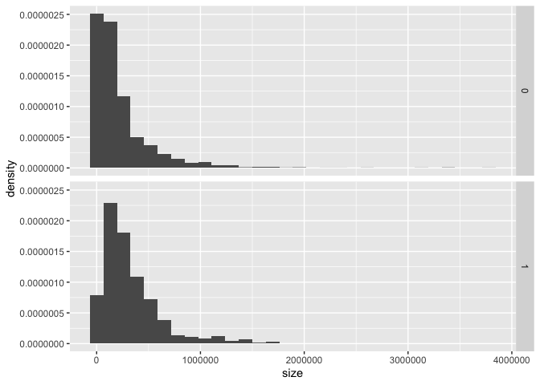
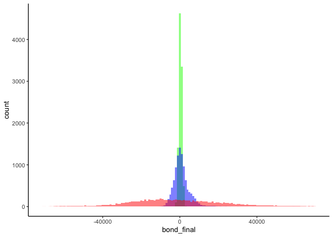

Green buildings
===============

``` r
library(mosaic)
```

    ## Loading required package: dplyr

    ## 
    ## Attaching package: 'dplyr'

    ## The following objects are masked from 'package:stats':
    ## 
    ##     filter, lag

    ## The following objects are masked from 'package:base':
    ## 
    ##     intersect, setdiff, setequal, union

    ## Loading required package: lattice

    ## Loading required package: ggformula

    ## Loading required package: ggplot2

    ## Loading required package: ggstance

    ## 
    ## Attaching package: 'ggstance'

    ## The following objects are masked from 'package:ggplot2':
    ## 
    ##     geom_errorbarh, GeomErrorbarh

    ## 
    ## New to ggformula?  Try the tutorials: 
    ##  learnr::run_tutorial("introduction", package = "ggformula")
    ##  learnr::run_tutorial("refining", package = "ggformula")

    ## Loading required package: mosaicData

    ## Loading required package: Matrix

    ## Registered S3 method overwritten by 'mosaic':
    ##   method                           from   
    ##   fortify.SpatialPolygonsDataFrame ggplot2

    ## 
    ## The 'mosaic' package masks several functions from core packages in order to add 
    ## additional features.  The original behavior of these functions should not be affected by this.
    ## 
    ## Note: If you use the Matrix package, be sure to load it BEFORE loading mosaic.

    ## 
    ## Attaching package: 'mosaic'

    ## The following object is masked from 'package:Matrix':
    ## 
    ##     mean

    ## The following object is masked from 'package:ggplot2':
    ## 
    ##     stat

    ## The following objects are masked from 'package:dplyr':
    ## 
    ##     count, do, tally

    ## The following objects are masked from 'package:stats':
    ## 
    ##     binom.test, cor, cor.test, cov, fivenum, IQR, median,
    ##     prop.test, quantile, sd, t.test, var

    ## The following objects are masked from 'package:base':
    ## 
    ##     max, mean, min, prod, range, sample, sum

``` r
greenbuildingsdata = read.csv('data/greenbuildings.csv')

head(greenbuildingsdata)
```

    ##   CS_PropertyID cluster   size empl_gr  Rent leasing_rate stories age
    ## 1        379105       1 260300    2.22 38.56        91.39      14  16
    ## 2        122151       1  67861    2.22 28.57        87.14       5  27
    ## 3        379839       1 164848    2.22 33.31        88.94      13  36
    ## 4         94614       1  93372    2.22 35.00        97.04      13  46
    ## 5        379285       1 174307    2.22 40.69        96.58      16   5
    ## 6         94765       1 231633    2.22 43.16        92.74      14  20
    ##   renovated class_a class_b LEED Energystar green_rating net amenities
    ## 1         0       1       0    0          1            1   0         1
    ## 2         0       0       1    0          0            0   0         1
    ## 3         1       0       1    0          0            0   0         1
    ## 4         1       0       1    0          0            0   0         0
    ## 5         0       1       0    0          0            0   0         1
    ## 6         0       1       0    0          0            0   0         1
    ##   cd_total_07 hd_total07 total_dd_07 Precipitation  Gas_Costs
    ## 1        4988         58        5046         42.57 0.01370000
    ## 2        4988         58        5046         42.57 0.01373149
    ## 3        4988         58        5046         42.57 0.01373149
    ## 4        4988         58        5046         42.57 0.01373149
    ## 5        4988         58        5046         42.57 0.01373149
    ## 6        4988         58        5046         42.57 0.01373149
    ##   Electricity_Costs cluster_rent
    ## 1        0.02900000        36.78
    ## 2        0.02904455        36.78
    ## 3        0.02904455        36.78
    ## 4        0.02904455        36.78
    ## 5        0.02904455        36.78
    ## 6        0.02904455        36.78

``` r
summary(greenbuildingsdata)
```

    ##  CS_PropertyID        cluster            size            empl_gr       
    ##  Min.   :      1   Min.   :   1.0   Min.   :   1624   Min.   :-24.950  
    ##  1st Qu.: 157452   1st Qu.: 272.0   1st Qu.:  50891   1st Qu.:  1.740  
    ##  Median : 313253   Median : 476.0   Median : 128838   Median :  1.970  
    ##  Mean   : 453003   Mean   : 588.6   Mean   : 234638   Mean   :  3.207  
    ##  3rd Qu.: 441188   3rd Qu.:1044.0   3rd Qu.: 294212   3rd Qu.:  2.380  
    ##  Max.   :6208103   Max.   :1230.0   Max.   :3781045   Max.   : 67.780  
    ##                                                       NA's   :74       
    ##       Rent         leasing_rate       stories            age        
    ##  Min.   :  2.98   Min.   :  0.00   Min.   :  1.00   Min.   :  0.00  
    ##  1st Qu.: 19.50   1st Qu.: 77.85   1st Qu.:  4.00   1st Qu.: 23.00  
    ##  Median : 25.16   Median : 89.53   Median : 10.00   Median : 34.00  
    ##  Mean   : 28.42   Mean   : 82.61   Mean   : 13.58   Mean   : 47.24  
    ##  3rd Qu.: 34.18   3rd Qu.: 96.44   3rd Qu.: 19.00   3rd Qu.: 79.00  
    ##  Max.   :250.00   Max.   :100.00   Max.   :110.00   Max.   :187.00  
    ##                                                                     
    ##    renovated         class_a          class_b            LEED         
    ##  Min.   :0.0000   Min.   :0.0000   Min.   :0.0000   Min.   :0.000000  
    ##  1st Qu.:0.0000   1st Qu.:0.0000   1st Qu.:0.0000   1st Qu.:0.000000  
    ##  Median :0.0000   Median :0.0000   Median :0.0000   Median :0.000000  
    ##  Mean   :0.3795   Mean   :0.3999   Mean   :0.4595   Mean   :0.006841  
    ##  3rd Qu.:1.0000   3rd Qu.:1.0000   3rd Qu.:1.0000   3rd Qu.:0.000000  
    ##  Max.   :1.0000   Max.   :1.0000   Max.   :1.0000   Max.   :1.000000  
    ##                                                                       
    ##    Energystar       green_rating          net            amenities     
    ##  Min.   :0.00000   Min.   :0.00000   Min.   :0.00000   Min.   :0.0000  
    ##  1st Qu.:0.00000   1st Qu.:0.00000   1st Qu.:0.00000   1st Qu.:0.0000  
    ##  Median :0.00000   Median :0.00000   Median :0.00000   Median :1.0000  
    ##  Mean   :0.08082   Mean   :0.08677   Mean   :0.03471   Mean   :0.5266  
    ##  3rd Qu.:0.00000   3rd Qu.:0.00000   3rd Qu.:0.00000   3rd Qu.:1.0000  
    ##  Max.   :1.00000   Max.   :1.00000   Max.   :1.00000   Max.   :1.0000  
    ##                                                                        
    ##   cd_total_07     hd_total07    total_dd_07   Precipitation  
    ##  Min.   :  39   Min.   :   0   Min.   :2103   Min.   :10.46  
    ##  1st Qu.: 684   1st Qu.:1419   1st Qu.:2869   1st Qu.:22.71  
    ##  Median : 966   Median :2739   Median :4979   Median :23.16  
    ##  Mean   :1229   Mean   :3432   Mean   :4661   Mean   :31.08  
    ##  3rd Qu.:1620   3rd Qu.:4796   3rd Qu.:6413   3rd Qu.:43.89  
    ##  Max.   :5240   Max.   :7200   Max.   :8244   Max.   :58.02  
    ##                                                              
    ##    Gas_Costs        Electricity_Costs  cluster_rent  
    ##  Min.   :0.009487   Min.   :0.01780   Min.   : 9.00  
    ##  1st Qu.:0.010296   1st Qu.:0.02330   1st Qu.:20.00  
    ##  Median :0.010296   Median :0.03274   Median :25.14  
    ##  Mean   :0.011336   Mean   :0.03096   Mean   :27.50  
    ##  3rd Qu.:0.011816   3rd Qu.:0.03781   3rd Qu.:34.00  
    ##  Max.   :0.028914   Max.   :0.06280   Max.   :71.44  
    ## 

``` r
median_green=median(greenbuildingsdata$Rent[greenbuildingsdata$green_rating==1])  
median_nongreen=median(greenbuildingsdata$Rent[greenbuildingsdata$green_rating==0])
cat("Median rent for green buildings:", median_green, "\nMdeian rent for nongreen buildings:", median_nongreen)
```

    ## Median rent for green buildings: 27.6 
    ## Mdeian rent for nongreen buildings: 25

Through his analysis, the Excel guru made a case that there is a premium
upside when constructing green buildings. The Excel guru anticipated a
$2.60 per square foot premium for constructing a green building by
calculating the median values of non green buildings and green buildings
separately. He implies a $650,000 in revenue for a $250,000 square foot
building. These computations, however, are very superficial and my team
performed further exploratory analysis to verify these findings.

``` r
ggplot(data = greenbuildingsdata) + 
  geom_histogram(mapping = aes(x = Rent, y = stat(density)), binwidth = 2) +
  facet_grid(green_rating~.)
```


First, our team began by looking at the variability in the data. We
created density plots using histograms and divided the plots between
green buildings and non green buildings to analyze how we should filter
out data that would skew our findings. Because we know that our building
is new and would be 250,000 square feet, we would have to filter out and
perform analysis on similar buildings.

``` r
ggplot(data = greenbuildingsdata) + 
  geom_histogram(mapping = aes(x = age, y = stat(density)), binwidth = 2) +
  facet_grid(green_rating~.)
```


``` r
greenbuildings1 = mutate(greenbuildingsdata,
                        agecat = cut(age, c(-1, 01, 25, 50, 75, 200)))

sum1 = greenbuildings1 %>%
  group_by(agecat, green_rating) %>%
  summarize(mean_rent = mean(Rent), n = n())

sum1
```

    ## # A tibble: 10 x 4
    ## # Groups:   agecat [5]
    ##    agecat   green_rating mean_rent     n
    ##    <fct>           <int>     <dbl> <int>
    ##  1 (-1,1]              0      35.1    52
    ##  2 (-1,1]              1      34.4    11
    ##  3 (1,25]              0      29.5  2166
    ##  4 (1,25]              1      29.7   499
    ##  5 (25,50]             0      28.8  2358
    ##  6 (25,50]             1      30.5   148
    ##  7 (50,75]             0      29.9   389
    ##  8 (50,75]             1      30.3     7
    ##  9 (75,200]            0      26.1  2244
    ## 10 (75,200]            1      32.6    20

``` r
ggplot(sum1) +
  geom_bar(stat='identity', aes(x=agecat, y=mean_rent, fill=factor(green_rating)), position = 'dodge')
```


``` r
# then use geom_bar
```

The density for ages above 50 years old is significantly unbalanced.

``` r
options(scipen=999)

ggplot(data = greenbuildingsdata) + 
  geom_histogram(mapping = aes(x = size, y = stat(density))) +
  facet_grid(green_rating~.)
```

    ## `stat_bin()` using `bins = 30`. Pick better value with `binwidth`.



``` r
greenbuildings2 = mutate(greenbuildingsdata,
                         sizecat = cut(size, c(-1, 5000, 50000, 100000, 250000, 500000, 750000, 1000000, 2000000,4000000)))

sum2 = greenbuildings2 %>%
  group_by(sizecat, green_rating) %>%
  summarize(mean_rent = mean(Rent), n = n())

sum2
```

    ## # A tibble: 16 x 4
    ## # Groups:   sizecat [9]
    ##    sizecat         green_rating mean_rent     n
    ##    <fct>                  <int>     <dbl> <int>
    ##  1 (-1,5e+03]                 0      29.7    72
    ##  2 (5e+03,5e+04]              0      25.5  1851
    ##  3 (5e+03,5e+04]              1      27.6    36
    ##  4 (5e+04,1e+05]              0      27.2  1312
    ##  5 (5e+04,1e+05]              1      29.2    97
    ##  6 (1e+05,2.5e+05]            0      29.5  1985
    ##  7 (1e+05,2.5e+05]            1      30.0   219
    ##  8 (2.5e+05,5e+05]            0      29.8  1093
    ##  9 (2.5e+05,5e+05]            1      32.4   204
    ## 10 (5e+05,7.5e+05]            0      28.5   465
    ## 11 (5e+05,7.5e+05]            1      27.0    78
    ## 12 (7.5e+05,1e+06]            0      29.8   221
    ## 13 (7.5e+05,1e+06]            1      29.0    19
    ## 14 (1e+06,2e+06]              0      36.9   198
    ## 15 (1e+06,2e+06]              1      28.0    32
    ## 16 (2e+06,4e+06]              0      49.3    12

``` r
options(scipen=999)
require(scales)
```

    ## Loading required package: scales

    ## 
    ## Attaching package: 'scales'

    ## The following object is masked from 'package:mosaic':
    ## 
    ##     rescale

``` r
df <- data.frame(x=seq(1, 1e9, length.out=100), y=sample(100))

point <- format_format(big.mark = " ", decimal.mark = ",", scientific = FALSE)

gg_size=ggplot(sum2) +
  geom_bar(stat='identity', aes(x=sizecat, y=mean_rent, fill=factor(green_rating)), position = 'dodge') +
  coord_flip() 
gg_size
```


Uneven distribution in very small and very large builings.

``` r
options(scipen=999)

ggplot(data = greenbuildingsdata) + 
  geom_histogram(mapping = aes(x = leasing_rate, y = stat(density))) +
  facet_grid(green_rating~.)
```

    ## `stat_bin()` using `bins = 30`. Pick better value with `binwidth`.


``` r
gg_leasingrate = mutate(greenbuildingsdata,
                        leasing_ratecat = cut(leasing_rate, c(-1, 01, 25, 50, 75, 100)))

sum4 = gg_leasingrate %>%
  group_by(leasing_ratecat, green_rating) %>%
  summarize(mean_rent = mean(Rent), n = n())

sum4
```

    ## # A tibble: 10 x 4
    ## # Groups:   leasing_ratecat [5]
    ##    leasing_ratecat green_rating mean_rent     n
    ##    <fct>                  <int>     <dbl> <int>
    ##  1 (-1,1]                     0      22.4   166
    ##  2 (-1,1]                     1      21.5     1
    ##  3 (1,25]                     0      23.0   130
    ##  4 (1,25]                     1      32.7     2
    ##  5 (25,50]                    0      24.7   377
    ##  6 (25,50]                    1      31.9     7
    ##  7 (50,75]                    0      24.4   962
    ##  8 (50,75]                    1      26.5    58
    ##  9 (75,100]                   0      29.5  5574
    ## 10 (75,100]                   1      30.3   617

``` r
ggplot(sum4) +
  geom_bar(stat='identity', aes(x=leasing_ratecat, y=mean_rent, fill=factor(green_rating)), position = 'dodge')
```


High variability in buildings with low leasing rates.

These visualizations show variability in size, age and leasing rates of
buildings. It is not sensible to compare buildings of differing size,
age, and occupancy rates, and thus, decided to only include buildings
with the following features: - Buildings less than 50 years old -
Buildings greater than 5000 square feet and less than 1,000,000 square
feet - Buildings with leasing rates of greater than 25%

``` r
greenbuildings <- greenbuildingsdata[which(greenbuildingsdata$age < 50 & greenbuildingsdata$size > 5000 & greenbuildingsdata$size < 1000000 & greenbuildingsdata$leasing_rate>25), ]
summary(greenbuildings)
```

    ##  CS_PropertyID        cluster            size           empl_gr       
    ##  Min.   :    122   Min.   :   1.0   Min.   :  5214   Min.   :-24.950  
    ##  1st Qu.: 204299   1st Qu.: 292.0   1st Qu.: 71575   1st Qu.:  1.430  
    ##  Median : 281016   Median : 485.0   Median :166347   Median :  2.220  
    ##  Mean   : 423466   Mean   : 608.5   Mean   :236918   Mean   :  3.674  
    ##  3rd Qu.: 409628   3rd Qu.:1044.0   3rd Qu.:327012   3rd Qu.:  2.440  
    ##  Max.   :6208103   Max.   :1230.0   Max.   :995505   Max.   : 67.780  
    ##                                                      NA's   :36       
    ##       Rent         leasing_rate       stories           age       
    ##  Min.   :  2.98   Min.   : 25.08   Min.   : 1.00   Min.   : 0.00  
    ##  1st Qu.: 20.40   1st Qu.: 82.78   1st Qu.: 4.00   1st Qu.:20.00  
    ##  Median : 26.77   Median : 91.58   Median :11.00   Median :25.00  
    ##  Mean   : 29.17   Mean   : 86.78   Mean   :13.55   Mean   :26.26  
    ##  3rd Qu.: 35.14   3rd Qu.: 97.14   3rd Qu.:20.00   3rd Qu.:34.00  
    ##  Max.   :144.00   Max.   :100.00   Max.   :64.00   Max.   :49.00  
    ##                                                                   
    ##    renovated         class_a          class_b            LEED        
    ##  Min.   :0.0000   Min.   :0.0000   Min.   :0.0000   Min.   :0.00000  
    ##  1st Qu.:0.0000   1st Qu.:0.0000   1st Qu.:0.0000   1st Qu.:0.00000  
    ##  Median :0.0000   Median :1.0000   Median :0.0000   Median :0.00000  
    ##  Mean   :0.2377   Mean   :0.5633   Mean   :0.3846   Mean   :0.00748  
    ##  3rd Qu.:0.0000   3rd Qu.:1.0000   3rd Qu.:1.0000   3rd Qu.:0.00000  
    ##  Max.   :1.0000   Max.   :1.0000   Max.   :1.0000   Max.   :1.00000  
    ##                                                                      
    ##    Energystar      green_rating         net            amenities     
    ##  Min.   :0.0000   Min.   :0.0000   Min.   :0.00000   Min.   :0.0000  
    ##  1st Qu.:0.0000   1st Qu.:0.0000   1st Qu.:0.00000   1st Qu.:0.0000  
    ##  Median :0.0000   Median :0.0000   Median :0.00000   Median :1.0000  
    ##  Mean   :0.1232   Mean   :0.1294   Mean   :0.04239   Mean   :0.6235  
    ##  3rd Qu.:0.0000   3rd Qu.:0.0000   3rd Qu.:0.00000   3rd Qu.:1.0000  
    ##  Max.   :1.0000   Max.   :1.0000   Max.   :1.00000   Max.   :1.0000  
    ##                                                                      
    ##   cd_total_07     hd_total07    total_dd_07   Precipitation  
    ##  Min.   : 130   Min.   :   0   Min.   :2103   Min.   :10.46  
    ##  1st Qu.: 684   1st Qu.:1419   1st Qu.:2103   1st Qu.:22.71  
    ##  Median : 966   Median :2472   Median :4854   Median :22.71  
    ##  Mean   :1384   Mean   :3113   Mean   :4497   Mean   :30.34  
    ##  3rd Qu.:1813   3rd Qu.:4783   3rd Qu.:6095   3rd Qu.:42.57  
    ##  Max.   :5240   Max.   :7200   Max.   :8244   Max.   :58.02  
    ##                                                              
    ##    Gas_Costs        Electricity_Costs  cluster_rent  
    ##  Min.   :0.009487   Min.   :0.01780   Min.   : 9.00  
    ##  1st Qu.:0.010296   1st Qu.:0.02330   1st Qu.:20.40  
    ##  Median :0.010296   Median :0.03274   Median :25.69  
    ##  Mean   :0.011458   Mean   :0.03122   Mean   :27.68  
    ##  3rd Qu.:0.012000   3rd Qu.:0.03781   3rd Qu.:34.00  
    ##  Max.   :0.028914   Max.   :0.06280   Max.   :71.44  
    ## 

``` r
green=greenbuildings[which(greenbuildings$green_rating ==1),]
nongreen=greenbuildings[which(greenbuildings$green_rating ==0),]
```

``` r
median_filtereed_green=median(greenbuildings$Rent[greenbuildings$green_rating==1])
median_filtered_nongreen=median(greenbuildings$Rent[greenbuildings$green_rating==0])
cat("Median rent for filtered green buildings:", median_filtereed_green, "\nMedian rent for filtered non-green buildings:", median_filtered_nongreen)
```

    ## Median rent for filtered green buildings: 28 
    ## Median rent for filtered non-green buildings: 26.4

We can see that the median rent per square foot in non-green buildings
was $26.4 and the median rent per square foot for green buildings was
$28. This shows that the more realistic deviation between green
buildings and non-green buildings median rent is only $1.60 per square
foot rather than the $2.60 that the Excel guru calculated. For a
building that is greater than 250,000 square feet, that would translate
into $400,000 of extra revenue per year instead of the $650,000 initial
calculation.

Our next step was analyzing confounding variables that could help
identify if there is a significant premium in rent for green buildings.
We needed to explain if the $1.60 rent per square foot increase in green
buildings was actually due to their green rating status or if there are
other factors that may explain this price. (All the following scatter
plots will be split by non green buildings (0) on the left, and green
buildings (1) on the right.

``` r
options(scipen=999)  # turn-off scientific notation like 1e+48

theme_set(theme_bw()) 

# Scatterplot
ggplot(greenbuildings, aes(x=size, y=Rent)) + 
  geom_point(aes(col=as.factor(amenities))) +
  geom_smooth(method="loess", se=F) +
  facet_grid(as.factor(amenities) ~ green_rating) +
  labs(subtitle="Size and Amenities vs Rent", 
       y="Rent", 
       x="Size", 
       title="Scatterplot", 
       caption = "Source: greenbuildings")
```


``` r
median_filtered_green_amenities=median(green$Rent[green$amenities==1])
median_filtered_green_no_amenities=median(green$Rent[green$amenities==0])
median_filtered_nongreen_amenities=median(nongreen$Rent[nongreen$amenities==1])
median_filtered_nongreen_no_amenities=median(nongreen$Rent[nongreen$amenities==0])
cat("Median rent for filtered green buildings with amenities:", median_filtered_green_amenities, "\nMedian rent for filteered green buildings without amenities:", median_filtered_green_no_amenities, "\nMedian rent for filtered non green buildings with amenities:", median_filtered_nongreen_amenities, "\nMedian rent for filteered non-green buildings without amenities:", median_filtered_nongreen_no_amenities)
```

    ## Median rent for filtered green buildings with amenities: 28.405 
    ## Median rent for filteered green buildings without amenities: 27 
    ## Median rent for filtered non green buildings with amenities: 27 
    ## Median rent for filteered non-green buildings without amenities: 25

``` r
green_amenities=(green[which(green$amenities ==1),])
count(green_amenities)/count(green)
```

    ##           n
    ## 1 0.7319422

``` r
nongreen_amenities=(nongreen[which(nongreen$amenities ==1),])
count(nongreen_amenities)/count(nongreen)
```

    ##           n
    ## 1 0.6073986

Green buildings with amenities contribute nearly a $1.5 increase for
rent per square foot over green buildings without amenities. Non-green
buildings have a $2 rent per square foot increase if amenities are
included or not. 73% of green buildings have amenities whereas only 60%
of non green buildings have amenities. Thus, green buildings will have a
higher median rent becuase they tend to have more amenities than non
green buildings.

Next we looked at how buildings in different cluster locations affect
rent.

``` r
ggplot(greenbuildings, aes(x=Rent, y=leasing_rate)) + 
  geom_point(aes(col=as.factor(class_a))) +
  geom_smooth(method="loess", se=F) +
  facet_grid(amenities ~ green_rating) +
  labs(subtitle="Rent vs Leasing Rate", 
       y="Leasing Rate", 
       x="Rent", 
       title="Scatterplot", 
       caption = "Source: greenbuildings")
```


Most green buildings are class A compared to non-green buildings. In
addition, these buildings tend to have a higher leasing rates compared
to non green buildings. This could inflate the value of green buildings
as class A building are typically nicer. Lets dive more deeply into
this.

``` r
median_green_a=median(green$Rent[green$class_a==1])
median_green_non_a=median(green$Rent[green$class_a==0])
median_nongreen_a=median(nongreen$Rent[nongreen$class_a==1])
median_nongreen_non_a=median(nongreen$Rent[nongreen$class_a==0])

cat("Median rent for class A green buildings:", median_green_a, "\nMedian rent for Class B green buildings:", median_green_non_a, "\nMedian rent for Class A non-green buildings", median_nongreen_a,  "\nMedian rent for Class B non-green buildings:", median_nongreen_non_a)
```

    ## Median rent for class A green buildings: 28.5 
    ## Median rent for Class B green buildings: 26.265 
    ## Median rent for Class A non-green buildings 28.8 
    ## Median rent for Class B non-green buildings: 24

``` r
green_classa=(green[which(green$class_a ==1),])
count(green_classa)/count(green)
```

    ##           n
    ## 1 0.8105939

``` r
nongreen_classa=(nongreen[which(nongreen$class_a ==1),])
count(nongreen_classa)/count(nongreen)
```

    ##           n
    ## 1 0.5264916

As we can see here, the median rent Class A buildings in green buildings
and non green buildings are very high compared to green buildings and
non green buildings that are not Class A. Of green buildings, 81% are
class A and only 52% of non green buildings are class A. This is
definitely a reason why green buildings were caluclated to have a higher
median rent than non green buildings.

``` r
options(scipen=999)

ggplot(data = greenbuildings) + 
  geom_histogram(mapping = aes(x = cluster, y = stat(density))) +
  facet_grid(green_rating~.)
```

    ## `stat_bin()` using `bins = 30`. Pick better value with `binwidth`.


``` r
# , binwidth = 20

greenbuildings5 = mutate(greenbuildings,
                        clustercat = cut(cluster, c(0, 250, 625, 875, 1250)))

sum5 = greenbuildings5 %>%
  group_by(clustercat, green_rating) %>%
  summarize(mean_cluster_rent = mean(cluster_rent), n = n())

sum5
```

    ## # A tibble: 6 x 4
    ## # Groups:   clustercat [3]
    ##   clustercat     green_rating mean_cluster_rent     n
    ##   <fct>                 <int>             <dbl> <int>
    ## 1 (0,250]                   0              23.3   904
    ## 2 (0,250]                   1              21.3   113
    ## 3 (250,625]                 0              29.9  1785
    ## 4 (250,625]                 1              29.6   256
    ## 5 (875,1.25e+03]            0              27.9  1501
    ## 6 (875,1.25e+03]            1              27.3   254

``` r
ggplot(sum5) +
  geom_bar(stat='identity', aes(x=clustercat, y=mean_cluster_rent, fill=factor(green_rating)), position = 'dodge')
```


Clearly a building’s rent is very dependent on its cluster location.
Buildings in the 0- 250 cluster range pay significantly less in rent on
average compared to buildings in the 200-1250 cluster range. However,
across each cluster bins, both green buildings and non green buildings
are relatively equal.

``` r
median_filtered_green_cluster1=median(green$Rent[green$cluster>=0 & green$cluster<250])
median_filtered_green_no_cluster2=median(green$Rent[green$cluster>=250 & green$cluster<625])
median_filtered_green_cluster3=median(green$Rent[green$cluster>=625 & green$cluster<1250])
median_filtered_nongreen_cluster1=median(nongreen$Rent[nongreen$cluster>=0 & nongreen$cluster<250])
median_filtered_nongreen_cluster2=mean(nongreen$Rent[nongreen$cluster>=250 & nongreen$cluster<625])
median_filtered_nongreen_cluster3=median(nongreen$Rent[nongreen$cluster>=625 & nongreen$cluster<1250])
cat("Median rent for filtered green buildings in clusters 0-250:", median_filtered_green_cluster1, "\nMedian rent for filteered green buildings in clusters 250-625:", median_filtered_green_no_cluster2, "\nMedian rent for filtered green buildings in clusters 625-1250:", median_filtered_green_cluster3, "\nMedian rent for filtered nongreen buildings in clusters 0-250:", median_filtered_nongreen_cluster1, "\nMedian rent for filtered nongreen buildings in clusters 250-625:", median_filtered_nongreen_cluster2, "\nMedian rent for filtered nongreen buildings in clusters 625-1250:", median_filtered_nongreen_cluster3)
```

    ## Median rent for filtered green buildings in clusters 0-250: 19 
    ## Median rent for filteered green buildings in clusters 250-625: 31.64 
    ## Median rent for filtered green buildings in clusters 625-1250: 28.2 
    ## Median rent for filtered nongreen buildings in clusters 0-250: 20.91 
    ## Median rent for filtered nongreen buildings in clusters 250-625: 30.95772 
    ## Median rent for filtered nongreen buildings in clusters 625-1250: 26.43

``` r
green_lowcluster=(green[which(green$cluster >=0 & green$cluster<250),])
count_green_low=nrow(green_lowcluster)/nrow(green)
nongreen_lowcluster=(nongreen[which(nongreen$cluster >=0 & nongreen$cluster<250),])
count_nongreen_low=nrow(nongreen_lowcluster)/nrow(nongreen)

cat("Percent of green buildings in low clusters:", count_green_low, "\nPercent of nongreen buildings in low:", count_nongreen_low)
```

    ## Percent of green buildings in low clusters: 0.1797753 
    ## Percent of nongreen buildings in low: 0.2155131

There are more non green buildings in the lower clusters. This means
that green buildings tend to be in clusters with high rent more so than
non green buildings which would further inflate their median rent. To
make sure that this is viable, however, we need to see if there are
significantly more nongreen buildings with net contracts in these
clusters. If so, then non green buildings may actually be paying more in
rent + utilities than green buildings.

``` r
ggplot(greenbuildings, aes(x=cluster, y=cluster_rent)) + 
  geom_point(aes(col=as.factor(net))) +
  geom_smooth(method="loess", se=F) +
  facet_grid(as.factor(net) ~ green_rating) +
  labs(subtitle="Cluster vs Cluster Rent Based on Net Contracts", 
       y="Cluster Rent", 
       x="Cluster", 
       title="Scatterplot", 
       caption = "Source: greenbuildings")
```


``` r
green <- greenbuildings[ which(greenbuildings$green_rating==1), ]
nongreen <- greenbuildings[ which(greenbuildings$green_rating==0), ]

cat("Percent of nongreen buildings with net contracts:", nrow(nongreen[ which(nongreen$net==1), ])*100/nrow(nongreen), "\nPercent of green buildings with net contracts:", nrow(green[ which(green$net==1), ])*100/nrow(green))
```

    ## Percent of nongreen buildings with net contracts: 4.081146 
    ## Percent of green buildings with net contracts: 5.29695

The graph above shows that there are very few net contract buildings in
both types of buildings. In fact, there are only 4.08% of non-green
buildings with net-based contracts, and only 5.30% of green buildings
with net based contracts. This difference is not substantial enough to
account for the rent deviations. This confirms that the cluster location
deviations in rent is not because of net contract based rent. Becuase
there are more non green buildings in the lower clusters and that most
buildings are not net based contracts, the median non green buildings
rent is undervalued. Lets confirm that non green buildings are not
paying higher in rent by looking at total degree days in both types of
buildings.

``` r
cat("Average number of total degree days for nongreen buildings:", mean(nongreen$total_dd_07), "\nAverage number of total degree days for green buildings:", mean(green$total_dd_07))
```

    ## Average number of total degree days for nongreen buildings: 4549.205 
    ## Average number of total degree days for green buildings: 4145.152

Our final research included the mean total amount of degree days in
green buildings and non green buildings. Because both types of buildings
have nearly the same number of total degree days, we can assume that the
toal utility costs in both types of buildings are similar. Thus, green
buildings and non green deviations are not caused by these deviations in
rent, and so we can confidently say that the previous factors discussed
are the major variables when determining rent differences between green
buildings and non green buildings.

``` r
lin.fit=lm(Rent~size+leasing_rate+class_a+amenities+cluster+net+green_rating+green_rating*amenities+green_rating*class_a, data=greenbuildings)
summary(lin.fit)
```

    ## 
    ## Call:
    ## lm(formula = Rent ~ size + leasing_rate + class_a + amenities + 
    ##     cluster + net + green_rating + green_rating * amenities + 
    ##     green_rating * class_a, data = greenbuildings)
    ## 
    ## Residuals:
    ##     Min      1Q  Median      3Q     Max 
    ## -24.595  -8.104  -1.934   5.656 116.631 
    ## 
    ## Coefficients:
    ##                             Estimate    Std. Error t value
    ## (Intercept)            12.5514936195  1.0859361483  11.558
    ## size                   -0.0000040635  0.0000009662  -4.206
    ## leasing_rate            0.1301304773  0.0119404859  10.898
    ## class_a                 5.6451368057  0.4331641498  13.032
    ## amenities               1.2315902453  0.4257161897   2.893
    ## cluster                 0.0044415630  0.0004505961   9.857
    ## net                    -5.2200723093  0.8756870332  -5.961
    ## green_rating           -0.3470594790  1.2684361445  -0.274
    ## amenities:green_rating -0.7872342008  1.2276929143  -0.641
    ## class_a:green_rating   -0.1761479011  1.3674934356  -0.129
    ##                                    Pr(>|t|)    
    ## (Intercept)            < 0.0000000000000002 ***
    ## size                          0.00002650553 ***
    ## leasing_rate           < 0.0000000000000002 ***
    ## class_a                < 0.0000000000000002 ***
    ## amenities                           0.00383 ** 
    ## cluster                < 0.0000000000000002 ***
    ## net                           0.00000000268 ***
    ## green_rating                        0.78439    
    ## amenities:green_rating              0.52140    
    ## class_a:green_rating                0.89751    
    ## ---
    ## Signif. codes:  0 '***' 0.001 '**' 0.01 '*' 0.05 '.' 0.1 ' ' 1
    ## 
    ## Residual standard error: 12.11 on 4803 degrees of freedom
    ## Multiple R-squared:  0.09513,    Adjusted R-squared:  0.09343 
    ## F-statistic:  56.1 on 9 and 4803 DF,  p-value: < 0.00000000000000022

In conclusion, investing in a green certification building is not a
reasonable decision. There is no apparent premium for green buildings,
when accounting for all possible confouding variables. As explained
using the visualizations, 73% of green buildings have amenities, 81% of
them are class A buildings, and 83% of them are in clusters that pay
higher rent which clearly increased the valuation of green buildings in
the Excel Guru’s initial calculations. Green ratings show to be
insignificant when taking all other factors into account. Therefore we
recommend the real estate developer should not invest in “going green”.

Flights at ABIA
===============

``` r
library(ggplot2)
library(reshape2)
abia = read.csv("data/ABIA.csv")

#Creating variables
abia$dummy = 1

abia$carrier.dummy = ifelse(abia$CarrierDelay > 0, 1, 0)
abia$weather.dummy = ifelse(abia$WeatherDelay > 0, 1, 0)
abia$nas.dummy = ifelse(abia$NASDelay > 0, 1, 0)
abia$security.dummy = ifelse(abia$SecurityDelay > 0, 1, 0)
abia$lateaircraft.dummy = ifelse(abia$LateAircraftDelay > 0, 1, 0)

#Subsetting flights flying out of Austin
outbound_Aus = subset(abia, abia$Origin == "AUS")

#Subsetting flights flying out of Austin and have experienced delays
outbound_Aus_delays = subset(abia, abia$Origin == "AUS" & abia$DepDelay > 0)
```

#################################################################### 

By Airline - Flying OUT OF Austin
---------------------------------

#################################################################### 

``` r
#Airlines delays
airline.delay = aggregate(outbound_Aus_delays$dummy,by=list(outbound_Aus_delays$UniqueCarrier),FUN = sum, na.rm=TRUE)
names(airline.delay)[1] = "UniqueCarrier"
names(airline.delay)[2] = "AnnualDelays"

#Airlines total outbound flights
airline.total = aggregate(outbound_Aus$dummy,by=list(outbound_Aus$UniqueCarrier),FUN = sum, na.rm=TRUE)
names(airline.total)[1] = "UniqueCarrier"
names(airline.total)[2] = "AnnualFlights"

# Calculating percentages
airline.delay.perc = merge(airline.total,airline.delay, by = "UniqueCarrier")
airline.delay.perc$per.delays = round(airline.delay.perc$AnnualDelays/airline.delay.perc$AnnualFlights,3)*100
```

This figure illustrates the total flights out of Austin by Airline.

``` r
ggplot(data=airline.total, aes(reorder(x= UniqueCarrier, AnnualFlights), y= AnnualFlights)) + 
  geom_bar( stat = 'identity') + 
  ggtitle("Total # of Flights out of AUS by Airline") + 
  theme(plot.title = element_text(lineheight=1.2, face="bold")) + 
  xlab("Airlines") + 
  ylab("Number of flights") + 
  coord_flip()
```


This figure illustrates the total flights that are delayed leaving
Austin Airport.

``` r
ggplot(data=airline.delay, aes(reorder(x= UniqueCarrier, AnnualDelays), y= AnnualDelays)) + 
  geom_bar( stat = 'identity') + 
  # scale_size_area() + 
  ggtitle("Total # of Flights out of AUS Delayed by Airline") + 
  # theme(plot.title = element_text(lineheight=1.2, face="bold")) + 
  xlab("Airlines") + 
  ylab("Number of flights delayed") + 
  coord_flip()
```


So, Southwest Airlines has the highest number of flights and the highest
number of flights delayed. Normalizing the variables, does it still have
the highest delayed flight to total flight ratio? Why yes it does! Don’t
fly Southwest.

To interpret the figure below, keep in mind that the average delay rate
per airline is 30.23%.

``` r
library(tidyverse)
```

    ## ── Attaching packages ───────────────────────────────────────────────────────────────────── tidyverse 1.2.1 ──

    ## ✔ tibble  2.1.3     ✔ purrr   0.3.2
    ## ✔ tidyr   0.8.3     ✔ stringr 1.4.0
    ## ✔ readr   1.3.1     ✔ forcats 0.4.0

    ## ── Conflicts ──────────────────────────────────────────────────────────────────────── tidyverse_conflicts() ──
    ## ✖ readr::col_factor()        masks scales::col_factor()
    ## ✖ mosaic::count()            masks dplyr::count()
    ## ✖ purrr::cross()             masks mosaic::cross()
    ## ✖ purrr::discard()           masks scales::discard()
    ## ✖ mosaic::do()               masks dplyr::do()
    ## ✖ tidyr::expand()            masks Matrix::expand()
    ## ✖ dplyr::filter()            masks stats::filter()
    ## ✖ ggstance::geom_errorbarh() masks ggplot2::geom_errorbarh()
    ## ✖ dplyr::lag()               masks stats::lag()
    ## ✖ mosaic::stat()             masks ggplot2::stat()
    ## ✖ mosaic::tally()            masks dplyr::tally()

``` r
data(airline.delay.perc)
```

    ## Warning in data(airline.delay.perc): data set 'airline.delay.perc' not
    ## found

``` r
per.delays.scale = scale(airline.delay.perc$per.delays, center=TRUE, scale=FALSE)

per.delays.type = ifelse(per.delays.scale < 0, "below", "above")  # above / below avg flag

ggplot(data=airline.delay.perc, aes(reorder(x= UniqueCarrier, per.delays.scale), y = per.delays.scale)) + 
  geom_bar(stat = 'identity', aes(fill=per.delays.type, width=.5)) + 
  scale_fill_manual(name="Delays", 
                    labels = c("Above Average (Bad)", "Below Average(Good)"), 
                    values = c("above"="#f8766d", "below"="#00ba38")) +
  ggtitle("% of Flights delayed by Airline") + 
  xlab("Airlines") + 
  ylab("deviation from the mean of % flights delayed") + 
  coord_flip()
```

    ## Warning: Ignoring unknown aesthetics: width


Aggregating Weather Delays by Airline

``` r
airline.delay.types = aggregate(list(outbound_Aus_delays$carrier.dummy, outbound_Aus_delays$weather.dummy, outbound_Aus_delays$nas.dummy, outbound_Aus_delays$security.dummy, outbound_Aus_delays$lateaircraft.dummy),by=list(outbound_Aus_delays$UniqueCarrier),FUN = sum, na.rm=TRUE)
names(airline.delay.types)[1] = "UniqueCarrier"
names(airline.delay.types)[2] = "CarrierDelays"
names(airline.delay.types)[3] = "WeatherDelays"
names(airline.delay.types)[4] = "NASDelays"
names(airline.delay.types)[5] = "SecurityDelays"
names(airline.delay.types)[6] = "LateAircraftDelays"

airline.delay.types.perc = merge(airline.delay,airline.delay.types, by = "UniqueCarrier")

airline.delay.types.perc$per.delays.total = 100.0

airline.delay.types.perc$totalDelays = airline.delay.types.perc$CarrierDelays + airline.delay.types.perc$WeatherDelays + airline.delay.types.perc$NASDelays + airline.delay.types.perc$SecurityDelays + airline.delay.types.perc$LateAircraftDelays

airline.delay.types.perc$per.delays.carrier = round(airline.delay.types.perc$CarrierDelays/airline.delay.types.perc$totalDelays,3)*100

airline.delay.types.perc$per.delays.weather = round(airline.delay.types.perc$WeatherDelays/airline.delay.types.perc$totalDelays,3)*100

airline.delay.types.perc$per.delays.nas = round(airline.delay.types.perc$NASDelays/airline.delay.types.perc$totalDelays,3)*100

airline.delay.types.perc$per.delays.security = round(airline.delay.types.perc$SecurityDelays/airline.delay.types.perc$totalDelays,3)*100

airline.delay.types.perc$per.delays.late = round(airline.delay.types.perc$LateAircraftDelays/airline.delay.types.perc$totalDelays,3)*100
```

Now that we know which Airlines have the most delays on average, we can
see why their flights are delayed. We accomplish this by identifying the
percentage of reasons that flights were delayed by Airline.

``` r
airline.delay.types.perc.selct <- airline.delay.types.perc[airline.delay.types.perc$UniqueCarrier %in% c("WN", "EV", "DL", "XE", "OH", "B6", "NW"), ]

airline.delay.types.perc.selct <- airline.delay.types.perc.selct[c(1, 10:14)]

airline.delay.types.perc.selct2 <- melt(airline.delay.types.perc.selct, id.vars='UniqueCarrier')

ggplot(airline.delay.types.perc.selct2, aes(x=UniqueCarrier, y=value, fill=variable)) +
  geom_bar(stat='identity', position = position_dodge(width = 0.8), width=0.8) +
  labs(title="Most Delayed Airlines", 
       subtitle="% of Delay Reasons", 
       x="Airline",
       y="% of Reason Delayed",
       caption="source: ABIA") + 
  scale_fill_discrete(name = "Delayed Reason", labels = c("Carrier", "Weather", "NAS", "Security", "Late Arrival")) +
  theme(axis.text.x = element_text(angle=65, vjust=0.6))
```


And we can compare these percentages to the least delayed airlines.

``` r
airline.delay.types.perc.selct <- airline.delay.types.perc[airline.delay.types.perc$UniqueCarrier %in% c("CO", "MQ", "OO", "AA", "UA", "F9", "YV", "9E", "US"), ]

airline.delay.types.perc.selct <- airline.delay.types.perc.selct[c(1, 10:14)]

airline.delay.types.perc.selct2 <- melt(airline.delay.types.perc.selct, id.vars='UniqueCarrier')

ggplot(airline.delay.types.perc.selct2, aes(x=UniqueCarrier, y=value, fill=variable)) +
  geom_bar(stat='identity', position = position_dodge(width = 0.8), width=0.8) +
  labs(title="Least Delayed Airlines", 
       subtitle="% of Delay Reasons", 
       x="Airline",
       y="% of Reason Delayed",
       caption="source: ABIA") + 
  scale_fill_discrete(name = "Delayed Reason", labels = c("Carrier", "Weather", "NAS", "Security", "Late Arrival")) +
  theme(axis.text.x = element_text(angle=65, vjust=0.6))
```


While the reasons differ per airline, we can check whether the top 3
airlines on average are delayed for different reasons than the bottom 3
airlines.

``` r
theme_set(theme_classic())

airline.delay.types.perc.select.test <- airline.delay.types.perc[airline.delay.types.perc$UniqueCarrier %in% c("WN", "EV", "DL"), ]

airline.delay.types.perc.select.test <- airline.delay.types.perc.select.test[c(1, 10:14)]
airline.delay.types.perc.select.test = airline.delay.types.perc.select.test[,c(2:6)]
bottom3_airlines = colMeans(airline.delay.types.perc.select.test)
bottom3_airlines = data.frame(bottom3_airlines)


airline.delay.types.perc.select.test2 <- airline.delay.types.perc[airline.delay.types.perc$UniqueCarrier %in% c( "YV", "9E", "US"), ]

airline.delay.types.perc.select.test2 <- airline.delay.types.perc.select.test2[c(1, 10:14)]
airline.delay.types.perc.select.test2 = airline.delay.types.perc.select.test2[,c(2:6)]
top3_airlines = colMeans(airline.delay.types.perc.select.test2)
top3_airlines = data.frame(top3_airlines)

airline_ratings = data.frame()

airline_grp_perf = cbind(top3_airlines, bottom3_airlines)
airline_grp_perf = t(airline_grp_perf)

airline_ratings <- melt(airline_grp_perf)

ggplot(airline_ratings, aes(x=Var1, y=value, fill=Var2)) +
  geom_bar(stat='identity', position = position_dodge(width = 0.8), width=0.8) +
  labs(title="Top and bottom 3 Airlines", 
       subtitle="% of Delay Reasons", 
       x="Airlines (top = the least delayed airlines)",
       y="% of Reason Delayed",
       caption="source: ABIA") + 
  scale_fill_discrete(name = "Delayed Reason", labels = c("Carrier", "Weather", "NAS", "Security", "Late Arrival")) +
  theme(axis.text.x = element_text(angle=65, vjust=0.6))
```


We can see that the most delayed airlines tend to be more commonly
delayed due to reasons they cannot control (Weather and NAS) than the
lest delayed airlines.

#################################################################### 

Destinations - Flying OUT OF Austin
-----------------------------------

#################################################################### 

``` r
#Destinations delay count
dest.delay = aggregate(outbound_Aus_delays$dummy,by=list(outbound_Aus_delays$Dest),FUN = sum, na.rm=TRUE)
names(dest.delay)[1] = "Destination"
names(dest.delay)[2] = "AnnualDelays"

#Destinations total outbound count
dest.total = aggregate(outbound_Aus$dummy,by=list(outbound_Aus$Dest),FUN = sum, na.rm=TRUE)
names(dest.total)[1] = "Destination"
names(dest.total)[2] = "AnnualFlights"

dest.delay.perc = merge(dest.total,dest.delay, by = "Destination")
dest.delay.perc$per.delays =round(dest.delay.perc$AnnualDelays/dest.delay.perc$AnnualFlights,3)*100
```

This figure plots the % of flights delayed by location. Almost 100% of
flights to Des Moines, Iowa are delayed.

``` r
ggplot(data=dest.delay.perc, aes(reorder(x= Destination, per.delays), y= per.delays)) + 
  geom_bar(stat = 'identity') + 
  ggtitle("% of Flights delayed by Destination") + 
  xlab("Destinations") + 
  ylab("% of flights delayed") + 
  coord_flip()
```


There are a lot of different destinations in the above graph. So, to
make the charts more interpretable, how about we just look solely at
popular destinations?

``` r
ggplot(data=subset(dest.delay.perc,dest.delay.perc$AnnualFlights> median(dest.delay.perc$AnnualFlights)), aes(reorder(x= Destination, per.delays), y= per.delays)) + 
  geom_bar(stat = 'identity') + 
  ggtitle("% of Flights delayed by Popular Destinations") + 
  xlab("Destinations") + 
  ylab("% of flights delayed") + 
  coord_flip()
```


That was still hard to interpret. Let’s look at the percentage differnce
from the average, which is 36.66% of flights delayed (by destination).

``` r
data(dest.delay.perc)
```

    ## Warning in data(dest.delay.perc): data set 'dest.delay.perc' not found

``` r
dest.delay.perc.subset = subset(dest.delay.perc,dest.delay.perc$AnnualFlights> median(dest.delay.perc$AnnualFlights))

data(dest.delay.perc.subset)
```

    ## Warning in data(dest.delay.perc.subset): data set 'dest.delay.perc.subset'
    ## not found

``` r
average_delays_by_dest = mean(dest.delay.perc.subset$per.delays)
print(average_delays_by_dest)
```

    ## [1] 36.66

``` r
dest.delay.perc.subset$dest.delay.scale = scale(dest.delay.perc.subset$per.delays, center=TRUE, scale=FALSE)

dest.delay.perc.subset$dest.delay.type = ifelse(dest.delay.perc.subset$dest.delay.scale < 0, "below", "above")  # above / below avg flag

ggplot(data=dest.delay.perc.subset, aes(reorder(x= dest.delay.perc.subset$Destination, dest.delay.perc.subset$dest.delay.scale), y= dest.delay.perc.subset$dest.delay.scale)) + 
  geom_bar(stat = 'identity', aes(fill=dest.delay.perc.subset$dest.delay.type, width=.5)) + 
  scale_fill_manual(name="Delays", 
                    labels = c("Above Average (Bad)", "Below Average (Good)"), 
                    values = c("above"="#f8766d", "below"="#00ba38")) +
  ggtitle("% of Flights delayed by Popular Destinations") + 
  xlab("Destination") + 
  ylab("deviation from the mean of % flights delayed") + 
  coord_flip()
```

    ## Warning: Ignoring unknown aesthetics: width


Aggregating Weather Delays by Destination OUT OF Austin

``` r
dest.delay.types = aggregate(list(outbound_Aus_delays$carrier.dummy, outbound_Aus_delays$weather.dummy, outbound_Aus_delays$nas.dummy, outbound_Aus_delays$security.dummy, outbound_Aus_delays$lateaircraft.dummy),by=list(outbound_Aus_delays$Dest),FUN = sum, na.rm=TRUE)
names(dest.delay.types)[1] = "Destination"
names(dest.delay.types)[2] = "CarrierDelays"
names(dest.delay.types)[3] = "WeatherDelays"
names(dest.delay.types)[4] = "NASDelays"
names(dest.delay.types)[5] = "SecurityDelays"
names(dest.delay.types)[6] = "LateAircraftDelays"

dest.delay.types.perc = merge(dest.delay,dest.delay.types, by = "Destination")

dest.delay.types.perc$per.delays.total = 100.0

dest.delay.types.perc$totalDelays = dest.delay.types.perc$CarrierDelays + dest.delay.types.perc$WeatherDelays + dest.delay.types.perc$NASDelays + dest.delay.types.perc$SecurityDelays + dest.delay.types.perc$LateAircraftDelays

dest.delay.types.perc$per.delays.carrier = round(dest.delay.types.perc$CarrierDelays/dest.delay.types.perc$totalDelays,3)*100

dest.delay.types.perc$per.delays.weather = round(dest.delay.types.perc$WeatherDelays/dest.delay.types.perc$totalDelays,3)*100

dest.delay.types.perc$per.delays.nas = round(dest.delay.types.perc$NASDelays/dest.delay.types.perc$totalDelays,3)*100

dest.delay.types.perc$per.delays.security = round(dest.delay.types.perc$SecurityDelays/dest.delay.types.perc$totalDelays,3)*100

dest.delay.types.perc$per.delays.late = round(dest.delay.types.perc$LateAircraftDelays/dest.delay.types.perc$totalDelays,3)*100
```

In this figure below we plot the most popular destinations that
experience the most delays in the most popular destinations.

``` r
dest.delay.types.perc.select <- dest.delay.types.perc[dest.delay.types.perc$Destination %in% c("SAN", "BWI", "ELP", "MDW", "HOU", "LAS", "BNA", "LBB", "EWR", "DAL", "MCO", "DEN", "JFK"), ]

dest.delay.types.perc.select <- dest.delay.types.perc.select[c(1, 10:14)]

dest.delay.types.perc.select2 <- melt(dest.delay.types.perc.select, id.vars='Destination')

ggplot(dest.delay.types.perc.select2, aes(x=Destination, y=value, fill=variable)) +
  geom_bar(stat='identity', position = position_dodge(width = 0.8), width=0.8) +
  labs(title="Top Delayed Destinations", 
       subtitle="% of Delay Reasons", 
       x="Destination",
       y="% of Reason Delayed",
       caption="source: ABIA") + 
  scale_fill_discrete(name = "Delayed Reason", labels = c("Carrier", "Weather", "NAS", "Security", "Late Arrival")) +
  theme(axis.text.x = element_text(angle=65, vjust=0.6))
```


We can compare these reasons to the least delayed destinations in
popular flights.

``` r
dest.delay.types.perc.select <- dest.delay.types.perc[dest.delay.types.perc$Destination %in% c("PHX", "IAD", "ATL", "ORD", "CVG", "DFW", "IAH", "SFO", "SJC", "MEM", "CLT"), ]

dest.delay.types.perc.select <- dest.delay.types.perc.select[c(1, 10:14)]

dest.delay.types.perc.select2 <- melt(dest.delay.types.perc.select, id.vars='Destination')

ggplot(dest.delay.types.perc.select2, aes(x=Destination, y=value, fill=variable)) +
  geom_bar(stat='identity', position = position_dodge(width = 0.8), width=0.8) +
  labs(title="Least Delayed Destinations", 
       subtitle="% of Delay Reasons", 
       x="Destination",
       y="% of Reason Delayed",
       caption="source: ABIA") + 
  scale_fill_discrete(name = "Delayed Reason", labels = c("Carrier", "Weather", "NAS", "Security", "Late Arrival")) +
  theme(axis.text.x = element_text(angle=65, vjust=0.6))
```


The delay reasons for popular destinations differ a lot; however, we
will try to detect systematically different reasons between the three
most delayed destinations and the three least delayed destinations.

``` r
theme_set(theme_classic())

dest.delay.types.perc.select.test <- dest.delay.types.perc[dest.delay.types.perc$Destination %in% c("SAN", "BWI", "ELP"), ]

dest.delay.types.perc.select.test <- dest.delay.types.perc.select.test[c(1, 10:14)]
dest.delay.types.perc.select.test = dest.delay.types.perc.select.test[,c(2:6)]
bottom3_destinations = colMeans(dest.delay.types.perc.select.test)
bottom3_destinations = data.frame(bottom3_destinations)


dest.delay.types.perc.select.test2 <- dest.delay.types.perc[dest.delay.types.perc$Destination %in% c("SJC", "MEM", "CLT"), ]

dest.delay.types.perc.select.test2 <- dest.delay.types.perc.select.test2[c(1, 10:14)]
dest.delay.types.perc.select.test2 = dest.delay.types.perc.select.test2[,c(2:6)]
top3_destinations = colMeans(dest.delay.types.perc.select.test2)
top3_destinations = data.frame(top3_destinations)

destination_ratings = data.frame()

dest_grp_perf = cbind(top3_destinations, bottom3_destinations)
dest_grp_perf = t(dest_grp_perf)

destination_ratings <- melt(dest_grp_perf)

ggplot(destination_ratings, aes(x=Var1, y=value, fill=Var2)) +
  geom_bar(stat='identity', position = position_dodge(width = 0.8), width=0.8) +
  labs(title="Top and bottom 3 Destinations", 
       subtitle="% of Delay Reasons", 
       x="Destinations (top = flights to the least delayed destinations)",
       y="% of Reason Delayed",
       caption="source: ABIA") + 
  scale_fill_discrete(name = "Delayed Reason", labels = c("Carrier", "Weather", "NAS", "Security", "Late Arrival")) +
  theme(axis.text.x = element_text(angle=65, vjust=0.6))
```


Popular destinations with the worst delays tend to be delayed more due
to late arrival of the preceeding flight than the popular destinations
with the fewest delays.

Portfolio modeling
==================

We have chosen three separate portfolios. One consisting of 5 bond ETFs,
to represent a very safe, low risk investment option. This means that
the maximum loss as well as the VaR should be lower than our other two
portfolios, but the average return should be fairly low, too. The second
is a diversified portfolio of 10 ETFs, including equities, commodities,
bonds, currencies, and real estate. We expect this portfolio to have a
higher average return than the first, but also a higher maximum loss and
higher VaR. Our third portfolio is a very risky portfolio. It includes 3
leveraged equity ETFs. This portfolio is expected to have the highest
average return, but also the most risk, meaning that it will have a high
maximum loss and a high VaR.

``` r
library(ggplot2)
library(mosaic)
library(quantmod)
```

    ## Loading required package: xts

    ## Loading required package: zoo

    ## 
    ## Attaching package: 'zoo'

    ## The following objects are masked from 'package:base':
    ## 
    ##     as.Date, as.Date.numeric

    ## Registered S3 method overwritten by 'xts':
    ##   method     from
    ##   as.zoo.xts zoo

    ## 
    ## Attaching package: 'xts'

    ## The following objects are masked from 'package:dplyr':
    ## 
    ##     first, last

    ## Loading required package: TTR

    ## Registered S3 method overwritten by 'quantmod':
    ##   method            from
    ##   as.zoo.data.frame zoo

    ## Version 0.4-0 included new data defaults. See ?getSymbols.

``` r
library(foreach)
```

    ## 
    ## Attaching package: 'foreach'

    ## The following objects are masked from 'package:purrr':
    ## 
    ##     accumulate, when

``` r
myBondPortfolio = c("GOVT", "PZT", "VCSH", "VMBS", "LQD")
myDiversePortfolio = c("TIP", "EUFX", "LD", "IDU", "XLK", "FRI", "MNA", "XHB", "PPLT", "CORN")
myRiskyPortfolio = c("NUGT", "JNUG", "TECL")
getSymbols(c(myBondPortfolio,myDiversePortfolio,myRiskyPortfolio), from = "2014-08-08", to = "2019-08-09")
```

    ## 'getSymbols' currently uses auto.assign=TRUE by default, but will
    ## use auto.assign=FALSE in 0.5-0. You will still be able to use
    ## 'loadSymbols' to automatically load data. getOption("getSymbols.env")
    ## and getOption("getSymbols.auto.assign") will still be checked for
    ## alternate defaults.
    ## 
    ## This message is shown once per session and may be disabled by setting 
    ## options("getSymbols.warning4.0"=FALSE). See ?getSymbols for details.

    ## pausing 1 second between requests for more than 5 symbols
    ## pausing 1 second between requests for more than 5 symbols
    ## pausing 1 second between requests for more than 5 symbols
    ## pausing 1 second between requests for more than 5 symbols
    ## pausing 1 second between requests for more than 5 symbols
    ## pausing 1 second between requests for more than 5 symbols
    ## pausing 1 second between requests for more than 5 symbols
    ## pausing 1 second between requests for more than 5 symbols
    ## pausing 1 second between requests for more than 5 symbols
    ## pausing 1 second between requests for more than 5 symbols
    ## pausing 1 second between requests for more than 5 symbols
    ## pausing 1 second between requests for more than 5 symbols
    ## pausing 1 second between requests for more than 5 symbols
    ## pausing 1 second between requests for more than 5 symbols

    ##  [1] "GOVT" "PZT"  "VCSH" "VMBS" "LQD"  "TIP"  "EUFX" "LD"   "IDU"  "XLK" 
    ## [11] "FRI"  "MNA"  "XHB"  "PPLT" "CORN" "NUGT" "JNUG" "TECL"

``` r
for(ticker in c(myBondPortfolio, myDiversePortfolio, myRiskyPortfolio)) {
    expr = paste0(ticker, "a = adjustOHLC(", ticker, ")")
    eval(parse(text=expr))
}

all_returns = cbind(ClCl(GOVTa),
                    ClCl(PZTa),
                    ClCl(VCSHa),
                    ClCl(VMBSa),
                    ClCl(LQDa),
                    ClCl(TIPa),
                    ClCl(EUFXa),
                    ClCl(LDa),
                    ClCl(IDUa),
                    ClCl(XLKa),
                    ClCl(FRIa),
                    ClCl(MNAa),
                    ClCl(XHBa),
                    ClCl(PPLTa),
                    ClCl(CORNa),
                    ClCl(NUGTa),
                    ClCl(JNUGa),
                    ClCl(TECLa))

all_returns = as.matrix(na.omit(all_returns))

initial_wealth = 100000
n_days = 20

set.seed(1) # make results reproducable

sim1 = foreach(i=1:10000, .combine='rbind') %do% {
    bond_wealth = initial_wealth
    diverse_wealth = initial_wealth
    risky_wealth = initial_wealth
    
    bond_weights = c(0.2, 0.2, 0.2, 0.2, 0.2)
    diverse_weights = rep(0.1, 10)
    risky_weights = rep(1/3, 3)
    
    bond_holdings = bond_weights * bond_wealth
    diverse_holdings = diverse_weights * diverse_wealth
    risky_holdings = risky_weights * risky_wealth
    
    bond_wealthtracker = rep(0, n_days)
    diverse_wealthtracker = rep(0, n_days)
    risky_wealthtracker = rep(0, n_days)
    
    for(today in 1:n_days) {
        return.today = resample(all_returns, 1, orig.ids=FALSE)
        bond_holdings = bond_holdings + bond_holdings*return.today[1:5]
        diverse_holdings = diverse_holdings + diverse_holdings*return.today[6:15]
        risky_holdings = risky_holdings + risky_holdings*return.today[16:18]
        
        bond_wealthtracker[today] = sum(bond_holdings)
      diverse_wealthtracker[today] = sum(diverse_holdings)
      risky_wealthtracker[today] = sum(risky_holdings)
    }
    c(bond_wealthtracker, diverse_wealthtracker, risky_wealthtracker)
}

bond_final = sim1[,n_days] - initial_wealth
diverse_final = sim1[,(2*n_days)] - initial_wealth
risky_final = sim1[,(3*n_days)] - initial_wealth

names = c("Bond Portfolio", "Diverse Portfolio", "Risky Portfolio")
means = c("Mean", mean(bond_final), mean(diverse_final), mean(risky_final))
best = c("Best performance", max(bond_final), max(diverse_final), max(risky_final))
worst = c("Worst performance", min(bond_final), min(diverse_final), min(risky_final))
var5 = c("VaR at 5% level", quantile(bond_final, 0.05), quantile(diverse_final, 0.05), quantile(risky_final, 0.05))

results = data.frame(" " = 0, "Bond Portfolio" = 0, "Diverse Portfolio" = 0, "Risky Portfolio" = 0)
results[1,]=means
results = rbind(results, best, worst, var5)

for (i in 1:4)
{
  for (j in 2:4)
    results[i, j] = round(as.numeric(results[i,j]),2)
}

results
```

    ##                  X. Bond.Portfolio Diverse.Portfolio Risky.Portfolio
    ## 1              Mean         278.84             858.8        10139.33
    ## 2  Best performance        3445.45           59010.3      5175617.94
    ## 3 Worst performance       -2558.01         -11404.04       -71208.02
    ## 4   VaR at 5% level        -941.75          -4763.02       -37728.87

As we can see from the table above, our expectations were correct. The
bond portfolio has a low expected average return of $279 after 4 weeks
of trading, compared to $859 for the diverse portfolio and $10,139 for
the risky portfolio. The best performances also vary widely. The bond
portfolio’s best performance was $3,445, compared to $59,010 for the
diverse portfolio and a gain of almost $5.2 million for the risky
portfolio! However, this increased return comes at a price, namely risk.
While the increased magnitude of worst performances give some
indication, a better measure is value at risk. In 5% of the cases, we
lose $37,729 or more with our risky portfolio, compared to only $4,763
for our diverse portfolio and $942 for our bond portfolio.

``` r
portfolios = cbind(bond_final, diverse_final, risky_final)
ggplot() + 
  geom_histogram(aes(bond_final), fill = "green", binwidth = 1000, alpha = 0.5) +
  geom_histogram(aes(diverse_final[diverse_final <= 70000]), fill = "blue", binwidth = 1000, alpha = 0.5) + 
  geom_histogram(aes(risky_final[risky_final <= 70000]), fill = "red", binwidth = 1000, alpha = 0.5) +
  geom_smooth()
```


This plot does not include the total distribution for the diverse
portfolio, since it has some extreme outliers (such as the $5.2 million
profit simulation). As seen in the plot above, the bond portfolios
returns are all fairly close to 0 when compared to the other portfolios.
As risk increases, the portfolios’ final values start spreading a lot
further from 0 (while the average slightly increases). For the risky
portfolio, the tail to the right is extremely long.

Market segmentation
===================

Initially we will look at our data and try to discern if any initial
data cleaning is necessary or if there are any gross outliers. We will
do this by checking how many tweets are in each category, and looking at
the dispersion of individuals’ tweet counts. We will also check the
correlation of variables.

``` r
library(ggplot2)
library(corrplot)
```

    ## corrplot 0.84 loaded

``` r
socialmarketing_raw = read.csv("data/social_marketing.csv")
socialmarketing = socialmarketing_raw[,-(1)]
attach(socialmarketing)

tag_frequency = colSums(socialmarketing)

tag_frequency = data.frame('names' = colnames(socialmarketing), 'frequency' = colSums((socialmarketing)))
tag_frequency = tag_frequency[order(-tag_frequency$frequency),]
tag_frequency$names = factor(tag_frequency$names, levels = tag_frequency$names)

ggplot(tag_frequency, aes(x=names, y=frequency)) +
  geom_bar(stat='identity',width=.5, fill="tomato3") + 
  labs(title = "Count of tweets in each category") +
  theme(axis.text.x = element_text(angle=90,vjust=0.5))
```


``` r
boxplot(rowSums(socialmarketing), main = "Tweets per user")
```


``` r
corrplot(cor(socialmarketing), order = "hclust")
```


The first plot illustrates that while there are extreme values, such as
the chatter category, or users who tweeted over 100 times during this
period, they are not necessarily outliers.

However, as the problem states, chatter and uncategorized might have
been used interchangably between different annotators. Thus, we will
combine them into one variable. Furthermore, from the above correlation
matrix we can discern the following strong relationships: - cooking,
fashion, beauty - outdoors, health\_nutrition, personal\_fitness -
computers, travel, politics, news, automotive - photo\_sharing, chatter,
shopping - sports\_playing, online\_gaming, college\_uni - tv\_film, art
- family, school, food, sports\_fandom, religion, parenting

Given how many dimensions we currently have, we will be grouping these
variables together, in order to reduce dimensionality. Furthermore,
these groupings make sense when you think about them.

``` r
socialmarketing1 = socialmarketing

socialmarketing1$chatter = chatter + uncategorized
socialmarketing1["cook_fash_beaut"] = cooking +fashion + beauty
socialmarketing1["out_health_fit"] = outdoors + health_nutrition + personal_fitness
socialmarketing1["comp_trav_pol_new_auto"] = computers + travel + politics + news + automotive
socialmarketing1["phot_chat_shop"] = photo_sharing + chatter + shopping 
socialmarketing1["sport_online_college"] = sports_playing + online_gaming + college_uni
socialmarketing1["tv_art"] = tv_film + art
socialmarketing1["fam"] = family + school + food + sports_fandom + religion + parenting

socialmarketing1 = subset(socialmarketing1, select= -c(cooking, fashion, beauty, outdoors, health_nutrition, personal_fitness, computers, travel, politics, photo_sharing, chatter, shopping, sports_playing, online_gaming, college_uni, tv_film, art, news, automotive, family, school, food, sports_fandom, religion, parenting, uncategorized))
```

Next, we will standardize the amount of tweets a certain user has in
each category and then scale and center the data for each column.

``` r
Z1 = socialmarketing1/rowSums(socialmarketing1)
X1 = scale(Z1, center=TRUE, scale=TRUE)
```

Now that we have our data cleaned, we will initially run a clustering
algorithm to group users who talk about the same things. We will then
identify what they tweet about most often and label them as such. This
labeling will be useful for understanding our market segmentation later.
The first step in doing this, is choosing the correct number of
clusters.

``` r
#KKN and CH
set.seed(10)
N = nrow(X1)
k_grid = c(1:30)
ss = c()
CH_grid = c()

for(k in k_grid) {
  cluster_k = kmeans(X1, k, nstart=50)
  W = cluster_k$tot.withinss
  ss = c(ss,W)
  
  B = cluster_k$betweenss
  CH = (B/W) * ((N - k) / (k - 1))
  CH_grid = c(CH_grid, CH)
}
```

    ## Warning: did not converge in 10 iterations

    ## Warning: did not converge in 10 iterations

    ## Warning: did not converge in 10 iterations

    ## Warning: did not converge in 10 iterations

    ## Warning: did not converge in 10 iterations

    ## Warning: did not converge in 10 iterations

    ## Warning: did not converge in 10 iterations

    ## Warning: did not converge in 10 iterations

    ## Warning: did not converge in 10 iterations

    ## Warning: did not converge in 10 iterations

    ## Warning: did not converge in 10 iterations

    ## Warning: did not converge in 10 iterations

    ## Warning: did not converge in 10 iterations

    ## Warning: did not converge in 10 iterations

    ## Warning: did not converge in 10 iterations

    ## Warning: did not converge in 10 iterations

    ## Warning: did not converge in 10 iterations

    ## Warning: did not converge in 10 iterations

    ## Warning: did not converge in 10 iterations

    ## Warning: did not converge in 10 iterations

    ## Warning: did not converge in 10 iterations

    ## Warning: did not converge in 10 iterations

    ## Warning: did not converge in 10 iterations

    ## Warning: did not converge in 10 iterations

    ## Warning: did not converge in 10 iterations

    ## Warning: did not converge in 10 iterations

    ## Warning: did not converge in 10 iterations

``` r
plot(k_grid,ss)
```


``` r
plot(k_grid,CH_grid)
```


The elbow plot does not give us a clear k to use; however, the CH index
suggests a k of 10, so we will use that in our algorithm.

``` r
set.seed(10)
kclust = kmeans(X1, 10, nstart=50)

for(i in 1:10)
  print(sort(kclust$centers[i,] , decreasing = TRUE)[1:4])
```

    ##          adult           spam            eco small_business 
    ##      4.8313635      1.9512642      0.2847372      0.2469891 
    ##         tv_art         crafts small_business current_events 
    ##      2.8340633      0.5588129      0.4469249      0.4431165 
    ##          dating home_and_garden        business  small_business 
    ##      3.89741916      0.12926720      0.12265574      0.07799327 
    ##          music         tv_art current_events       business 
    ##      2.5525594      0.2900202      0.2600520      0.2414325 
    ## sport_online_college               tv_art       small_business 
    ##           2.95966002          -0.02935853          -0.05321270 
    ##                 spam 
    ##          -0.05917808 
    ## cook_fash_beaut           music        business            spam 
    ##      2.58020675      0.07394641     -0.06404342     -0.06637978 
    ##  out_health_fit             eco cook_fash_beaut            spam 
    ##      1.95435797      0.13662352     -0.02872169     -0.04667535 
    ##         fam      crafts         eco        spam 
    ##  2.13013526  0.27108962 -0.06182838 -0.06637978 
    ## phot_chat_shop current_events            eco       business 
    ##      1.4524488      0.3807004      0.1927117      0.1606584 
    ## comp_trav_pol_new_auto               business                   spam 
    ##             2.06450374            -0.01349338            -0.06070761 
    ##        home_and_garden 
    ##            -0.07665965

``` r
firstk = kclust$cluster
```

Above, the four variables with the highest value per cluster are
displayed. From them we can discern a general trend of what these users
tweet about most. The ten identified clusters are as follows: (1) Adult
Content (2) TV and Art (3) Dating (4) Music (5) College Athletes – these
individuals seem to be college athletes, as they talk most about
college, playing sports and video games (6) Beauty (7) General Fitness
(8) Family (9) Photo (10) News

Now that we have a label that each user falls under, we will attempt to
define market segments and analyze which users fall into which market
segment.

``` r
summary(Z1)
```

    ##  current_events    home_and_garden       music              eco         
    ##  Min.   :0.00000   Min.   :0.00000   Min.   :0.00000   Min.   :0.00000  
    ##  1st Qu.:0.01429   1st Qu.:0.00000   1st Qu.:0.00000   1st Qu.:0.00000  
    ##  Median :0.03571   Median :0.00000   Median :0.00000   Median :0.00000  
    ##  Mean   :0.04596   Mean   :0.01442   Mean   :0.01780   Mean   :0.01315  
    ##  3rd Qu.:0.06452   3rd Qu.:0.02439   3rd Qu.:0.02857   3rd Qu.:0.02268  
    ##  Max.   :0.42857   Max.   :0.26667   Max.   :0.33333   Max.   :0.28571  
    ##     business           crafts            dating        small_business    
    ##  Min.   :0.00000   Min.   :0.00000   Min.   :0.00000   Min.   :0.000000  
    ##  1st Qu.:0.00000   1st Qu.:0.00000   1st Qu.:0.00000   1st Qu.:0.000000  
    ##  Median :0.00000   Median :0.00000   Median :0.00000   Median :0.000000  
    ##  Mean   :0.01096   Mean   :0.01282   Mean   :0.01646   Mean   :0.008743  
    ##  3rd Qu.:0.01852   3rd Qu.:0.02128   3rd Qu.:0.01923   3rd Qu.:0.013158  
    ##  Max.   :0.21429   Max.   :0.18182   Max.   :0.35821   Max.   :0.214286  
    ##       spam               adult          cook_fash_beaut  
    ##  Min.   :0.0000000   Min.   :0.000000   Min.   :0.00000  
    ##  1st Qu.:0.0000000   1st Qu.:0.000000   1st Qu.:0.01562  
    ##  Median :0.0000000   Median :0.000000   Median :0.04762  
    ##  Mean   :0.0001556   Mean   :0.009874   Mean   :0.08130  
    ##  3rd Qu.:0.0000000   3rd Qu.:0.000000   3rd Qu.:0.09524  
    ##  Max.   :0.0909091   Max.   :0.500000   Max.   :0.62069  
    ##  out_health_fit    comp_trav_pol_new_auto phot_chat_shop  
    ##  Min.   :0.00000   Min.   :0.00000        Min.   :0.0000  
    ##  1st Qu.:0.01053   1st Qu.:0.05801        1st Qu.:0.1064  
    ##  Median :0.04651   Median :0.10000        Median :0.1892  
    ##  Mean   :0.10727   Mean   :0.14942        Mean   :0.2262  
    ##  3rd Qu.:0.14634   3rd Qu.:0.19048        3rd Qu.:0.3182  
    ##  Max.   :0.68627   Max.   :0.77143        Max.   :0.8125  
    ##  sport_online_college     tv_art             fam         
    ##  Min.   :0.00000      Min.   :0.00000   Min.   :0.00000  
    ##  1st Qu.:0.01695      1st Qu.:0.00000   1st Qu.:0.06977  
    ##  Median :0.04444      Median :0.02703   Median :0.11429  
    ##  Mean   :0.07992      Mean   :0.04663   Mean   :0.15886  
    ##  3rd Qu.:0.08594      3rd Qu.:0.05882   3rd Qu.:0.19231  
    ##  Max.   :0.76596      Max.   :0.59259   Max.   :0.75000

As we can see in the summary statistics of the scaled values above, no
user falls into just one category. Thus, as there are no clear
seperatable “buckets” that a user will fall into, we believe that
running a PCA analysis will help us in more generally grouping these
subclusters together. Additionally, reduced dimensionality will allow
for a clustering algorithm to perform better, since distance based
algorithms tend to suffer from high dimensionality (curse of
dimensionality).

``` r
pc1 = prcomp(X1, scale=TRUE, center = TRUE, rank=10)
loadings1 = pc1$rotation
scores1 = pc1$x

summary(pc1)
```

    ## Importance of first k=10 (out of 17) components:
    ##                            PC1     PC2     PC3     PC4     PC5     PC6
    ## Standard deviation     1.22471 1.17821 1.13502 1.12360 1.09069 1.04591
    ## Proportion of Variance 0.08823 0.08166 0.07578 0.07426 0.06998 0.06435
    ## Cumulative Proportion  0.08823 0.16989 0.24567 0.31993 0.38991 0.45426
    ##                            PC7     PC8     PC9    PC10
    ## Standard deviation     1.03878 1.02490 1.00568 0.98298
    ## Proportion of Variance 0.06347 0.06179 0.05949 0.05684
    ## Cumulative Proportion  0.51773 0.57952 0.63901 0.69585

``` r
plot(pc1)
```


We see a bigger jump of variance explained after PC5, so we will analyze
the first five principal components.

``` r
for (i in c(1:5))
  print(sort(loadings1[,i]))
```

    ##         out_health_fit        cook_fash_beaut                    fam 
    ##            -0.53688951            -0.27226597            -0.21617194 
    ##                 dating                  adult                   spam 
    ##            -0.08444453            -0.03814896            -0.01662014 
    ##                    eco   sport_online_college comp_trav_pol_new_auto 
    ##             0.02066090             0.04905346             0.06380604 
    ##                 crafts        home_and_garden                  music 
    ##             0.07987237             0.14812850             0.16885543 
    ##               business         small_business                 tv_art 
    ##             0.20778544             0.21541202             0.25471244 
    ##         current_events         phot_chat_shop 
    ##             0.37425692             0.47303933 
    ##         phot_chat_shop        cook_fash_beaut         out_health_fit 
    ##           -0.470134819           -0.402269887           -0.232955514 
    ##                    eco                 dating                  music 
    ##           -0.130979062           -0.082375602           -0.072570290 
    ##         current_events               business        home_and_garden 
    ##           -0.053690226           -0.049756972            0.004973689 
    ##   sport_online_college         small_business                   spam 
    ##            0.091079210            0.091546755            0.138976505 
    ##                  adult                 crafts                 tv_art 
    ##            0.172858617            0.205950791            0.257297326 
    ## comp_trav_pol_new_auto                    fam 
    ##            0.391695453            0.447637478 
    ##   sport_online_college                 tv_art                  music 
    ##           -0.407350411           -0.337967553           -0.321046952 
    ##        cook_fash_beaut                 crafts         small_business 
    ##           -0.207092124           -0.079571611           -0.065199935 
    ##               business                    fam                 dating 
    ##           -0.025464979            0.005590411            0.017974656 
    ##         out_health_fit        home_and_garden         current_events 
    ##            0.056822249            0.087172507            0.138093718 
    ## comp_trav_pol_new_auto         phot_chat_shop                    eco 
    ##            0.178995637            0.219194401            0.312983561 
    ##                   spam                  adult 
    ##            0.406178349            0.435174598 
    ## comp_trav_pol_new_auto                    fam         phot_chat_shop 
    ##            -0.40553797            -0.20505260            -0.13896082 
    ##         current_events               business                 dating 
    ##            -0.07790675            -0.06376822            -0.05141482 
    ##                 crafts        home_and_garden         out_health_fit 
    ##             0.02462631             0.05256071             0.07163117 
    ##                    eco        cook_fash_beaut                  music 
    ##             0.11269803             0.13712485             0.20148164 
    ##         small_business                 tv_art   sport_online_college 
    ##             0.25707623             0.27777977             0.29934074 
    ##                  adult                   spam 
    ##             0.46665436             0.47977386 
    ## comp_trav_pol_new_auto   sport_online_college                 dating 
    ##           -0.524743385           -0.335720823           -0.093322459 
    ##         small_business                  adult                   spam 
    ##           -0.087426482           -0.065956784           -0.056318244 
    ##               business        cook_fash_beaut         out_health_fit 
    ##           -0.042096957            0.007530703            0.019646199 
    ##        home_and_garden                 tv_art         phot_chat_shop 
    ##            0.048176290            0.088627117            0.099644921 
    ##                  music         current_events                    eco 
    ##            0.113497054            0.127935594            0.201936455 
    ##                 crafts                    fam 
    ##            0.493050084            0.502609104

The above printed values are the ‘ingredients’ of the first five
principal components. As we can see, PC3 and 4 both are primarily
indicators of adult and spam categories. We will remove these variables
from the dataset and re-run PCA to see if we get better variables, that
differ from each other more.

``` r
socialmarketing2 = subset(socialmarketing1, select = -c(adult,spam))

Z2 = socialmarketing2/rowSums(socialmarketing2)
X2 = scale(Z2, center = TRUE, scale = TRUE)

pc2 = prcomp(X2, scale=TRUE, center = TRUE, rank=10)
loadings2 = pc2$rotation
scores2 = pc2$x

summary(pc2)
```

    ## Importance of first k=10 (out of 15) components:
    ##                           PC1     PC2     PC3     PC4     PC5     PC6
    ## Standard deviation     1.2256 1.17607 1.13078 1.09162 1.05236 1.03882
    ## Proportion of Variance 0.1001 0.09221 0.08524 0.07944 0.07383 0.07194
    ## Cumulative Proportion  0.1001 0.19235 0.27760 0.35704 0.43087 0.50281
    ##                            PC7    PC8    PC9   PC10
    ## Standard deviation     1.02635 1.0047 0.9881 0.9736
    ## Proportion of Variance 0.07023 0.0673 0.0651 0.0632
    ## Cumulative Proportion  0.57304 0.6403 0.7054 0.7686

``` r
plot(pc2)
```


This time the last bigger dropoff in variance explained occurs after
PC4, so we will use the first four principal components.

``` r
print('PC1')
```

    ## [1] "PC1"

``` r
sort(loadings2[,1])
```

    ##         out_health_fit        cook_fash_beaut                    fam 
    ##            -0.54117298            -0.28740538            -0.20899941 
    ##                 dating                    eco   sport_online_college 
    ##            -0.08561437             0.03206174             0.04003394 
    ## comp_trav_pol_new_auto                 crafts                  music 
    ##             0.07478113             0.08233660             0.15374009 
    ##        home_and_garden               business         small_business 
    ##             0.15461279             0.20595723             0.21980749 
    ##                 tv_art         current_events         phot_chat_shop 
    ##             0.24938157             0.37307940             0.46782789

``` r
print('PC2')
```

    ## [1] "PC2"

``` r
sort(loadings2[,2])
```

    ##         phot_chat_shop        cook_fash_beaut         out_health_fit 
    ##           -0.488433658           -0.386025294           -0.224401756 
    ##                    eco                 dating         current_events 
    ##           -0.162525098           -0.078970159           -0.060728125 
    ##                  music               business        home_and_garden 
    ##           -0.051043808           -0.041402339           -0.007434626 
    ##         small_business   sport_online_college                 crafts 
    ##            0.063008753            0.110927149            0.215940608 
    ##                 tv_art comp_trav_pol_new_auto                    fam 
    ##            0.270241496            0.402378961            0.472760842

``` r
print('PC3')
```

    ## [1] "PC3"

``` r
sort(loadings2[,3])
```

    ##   sport_online_college                 tv_art                  music 
    ##            -0.51105824            -0.42858546            -0.38047250 
    ##        cook_fash_beaut         small_business                 crafts 
    ##            -0.25226068            -0.20981247            -0.06196392 
    ##         out_health_fit               business        home_and_garden 
    ##             0.01274332             0.01422633             0.03292524 
    ##                 dating         current_events                    fam 
    ##             0.04244170             0.15401577             0.16064903 
    ##                    eco         phot_chat_shop comp_trav_pol_new_auto 
    ##             0.17204523             0.22956556             0.40472136

``` r
print('PC4')
```

    ## [1] "PC4"

``` r
sort(loadings2[,4])
```

    ##                 crafts                    fam                    eco 
    ##          -0.4836127246          -0.4802214940          -0.2481369496 
    ##         current_events                  music                 tv_art 
    ##          -0.1255270461          -0.1080951355          -0.0975166022 
    ##         phot_chat_shop        home_and_garden         out_health_fit 
    ##          -0.0911568514          -0.0596700387          -0.0382185685 
    ##        cook_fash_beaut         small_business               business 
    ##          -0.0003474293           0.0431550472           0.0515086485 
    ##                 dating   sport_online_college comp_trav_pol_new_auto 
    ##           0.0944941217           0.3295008249           0.5492146410

Looking at the ‘ingredient’ set of the four principal components, this
is how we classify what the components are distingushing between (the
first group of people are the ones on the positive spectrum of the
variable): PC1: Internet avid vs. Fitness enthusiast PC2: Family
vs. Non-Family PC3: Opinion sharers vs. Hobbyests – people who share
their opinion on everything vs. people who talk about their hobby’s PC4:
Reverse Age (Young vs. Old)

We will now run another clustering algorithm, using the above principal
components. First we need to find how many clusters there seem to be.

``` r
pc3 = prcomp(X2, scale=TRUE, center = TRUE, rank=4)
scores3 = pc3$x

colnames(scores3) = c("InternetAvid", "FamilyOriented", "OpinionSharers", "Young")

#KKN and CH
set.seed(10)
N = nrow(scores3)
k_grid = c(1:30)
ss = c()
CH_grid = c()

for(k in k_grid) {
  cluster_k = kmeans(scores3, k, nstart=50)
  W = cluster_k$tot.withinss
  ss = c(ss,W)
  
  B = cluster_k$betweenss
  CH = (B/W) * ((N - k) / (k - 1))
  CH_grid = c(CH_grid, CH)
}
```

    ## Warning: did not converge in 10 iterations

    ## Warning: did not converge in 10 iterations

    ## Warning: did not converge in 10 iterations

    ## Warning: did not converge in 10 iterations

    ## Warning: did not converge in 10 iterations

    ## Warning: did not converge in 10 iterations

    ## Warning: did not converge in 10 iterations

    ## Warning: did not converge in 10 iterations

    ## Warning: did not converge in 10 iterations

    ## Warning: did not converge in 10 iterations

    ## Warning: did not converge in 10 iterations

    ## Warning: did not converge in 10 iterations

    ## Warning: did not converge in 10 iterations

    ## Warning: did not converge in 10 iterations

    ## Warning: did not converge in 10 iterations

    ## Warning: did not converge in 10 iterations

    ## Warning: did not converge in 10 iterations

    ## Warning: did not converge in 10 iterations

    ## Warning: did not converge in 10 iterations

    ## Warning: did not converge in 10 iterations

    ## Warning: did not converge in 10 iterations

    ## Warning: did not converge in 10 iterations

    ## Warning: did not converge in 10 iterations

    ## Warning: did not converge in 10 iterations

    ## Warning: did not converge in 10 iterations

    ## Warning: did not converge in 10 iterations

    ## Warning: did not converge in 10 iterations

    ## Warning: did not converge in 10 iterations

    ## Warning: did not converge in 10 iterations

    ## Warning: did not converge in 10 iterations

    ## Warning: did not converge in 10 iterations

    ## Warning: did not converge in 10 iterations

    ## Warning: did not converge in 10 iterations

    ## Warning: did not converge in 10 iterations

    ## Warning: did not converge in 10 iterations

    ## Warning: did not converge in 10 iterations

    ## Warning: did not converge in 10 iterations

    ## Warning: did not converge in 10 iterations

    ## Warning: did not converge in 10 iterations

    ## Warning: did not converge in 10 iterations

    ## Warning: did not converge in 10 iterations

    ## Warning: did not converge in 10 iterations

    ## Warning: did not converge in 10 iterations

    ## Warning: did not converge in 10 iterations

    ## Warning: did not converge in 10 iterations

    ## Warning: did not converge in 10 iterations

    ## Warning: did not converge in 10 iterations

    ## Warning: did not converge in 10 iterations

    ## Warning: did not converge in 10 iterations

    ## Warning: did not converge in 10 iterations

    ## Warning: did not converge in 10 iterations

    ## Warning: did not converge in 10 iterations

    ## Warning: did not converge in 10 iterations

    ## Warning: did not converge in 10 iterations

    ## Warning: did not converge in 10 iterations

    ## Warning: did not converge in 10 iterations

    ## Warning: did not converge in 10 iterations

    ## Warning: did not converge in 10 iterations

    ## Warning: did not converge in 10 iterations

    ## Warning: did not converge in 10 iterations

    ## Warning: did not converge in 10 iterations

    ## Warning: did not converge in 10 iterations

    ## Warning: did not converge in 10 iterations

    ## Warning: did not converge in 10 iterations

    ## Warning: did not converge in 10 iterations

    ## Warning: did not converge in 10 iterations

    ## Warning: did not converge in 10 iterations

    ## Warning: did not converge in 10 iterations

    ## Warning: did not converge in 10 iterations

    ## Warning: did not converge in 10 iterations

    ## Warning: did not converge in 10 iterations

    ## Warning: did not converge in 10 iterations

    ## Warning: did not converge in 10 iterations

    ## Warning: did not converge in 10 iterations

    ## Warning: did not converge in 10 iterations

    ## Warning: did not converge in 10 iterations

    ## Warning: did not converge in 10 iterations

    ## Warning: did not converge in 10 iterations

    ## Warning: did not converge in 10 iterations

    ## Warning: did not converge in 10 iterations

    ## Warning: did not converge in 10 iterations

    ## Warning: did not converge in 10 iterations

    ## Warning: did not converge in 10 iterations

    ## Warning: did not converge in 10 iterations

    ## Warning: did not converge in 10 iterations

    ## Warning: did not converge in 10 iterations

    ## Warning: did not converge in 10 iterations

    ## Warning: did not converge in 10 iterations

    ## Warning: did not converge in 10 iterations

    ## Warning: did not converge in 10 iterations

    ## Warning: did not converge in 10 iterations

    ## Warning: did not converge in 10 iterations

    ## Warning: did not converge in 10 iterations

    ## Warning: did not converge in 10 iterations

    ## Warning: did not converge in 10 iterations

    ## Warning: did not converge in 10 iterations

    ## Warning: did not converge in 10 iterations

    ## Warning: did not converge in 10 iterations

    ## Warning: did not converge in 10 iterations

    ## Warning: did not converge in 10 iterations

    ## Warning: did not converge in 10 iterations

    ## Warning: did not converge in 10 iterations

    ## Warning: did not converge in 10 iterations

    ## Warning: did not converge in 10 iterations

    ## Warning: did not converge in 10 iterations

    ## Warning: did not converge in 10 iterations

    ## Warning: did not converge in 10 iterations

    ## Warning: did not converge in 10 iterations

    ## Warning: did not converge in 10 iterations

    ## Warning: did not converge in 10 iterations

    ## Warning: did not converge in 10 iterations

    ## Warning: did not converge in 10 iterations

    ## Warning: did not converge in 10 iterations

    ## Warning: did not converge in 10 iterations

    ## Warning: did not converge in 10 iterations

    ## Warning: did not converge in 10 iterations

    ## Warning: did not converge in 10 iterations

    ## Warning: did not converge in 10 iterations

    ## Warning: did not converge in 10 iterations

    ## Warning: did not converge in 10 iterations

    ## Warning: did not converge in 10 iterations

    ## Warning: did not converge in 10 iterations

    ## Warning: did not converge in 10 iterations

    ## Warning: did not converge in 10 iterations

    ## Warning: did not converge in 10 iterations

    ## Warning: did not converge in 10 iterations

    ## Warning: did not converge in 10 iterations

    ## Warning: did not converge in 10 iterations

    ## Warning: did not converge in 10 iterations

    ## Warning: did not converge in 10 iterations

    ## Warning: did not converge in 10 iterations

    ## Warning: did not converge in 10 iterations

    ## Warning: did not converge in 10 iterations

    ## Warning: did not converge in 10 iterations

    ## Warning: did not converge in 10 iterations

    ## Warning: did not converge in 10 iterations

    ## Warning: did not converge in 10 iterations

    ## Warning: did not converge in 10 iterations

    ## Warning: did not converge in 10 iterations

    ## Warning: did not converge in 10 iterations

    ## Warning: did not converge in 10 iterations

    ## Warning: did not converge in 10 iterations

    ## Warning: did not converge in 10 iterations

    ## Warning: did not converge in 10 iterations

    ## Warning: did not converge in 10 iterations

    ## Warning: did not converge in 10 iterations

    ## Warning: did not converge in 10 iterations

    ## Warning: did not converge in 10 iterations

    ## Warning: did not converge in 10 iterations

    ## Warning: did not converge in 10 iterations

    ## Warning: did not converge in 10 iterations

    ## Warning: did not converge in 10 iterations

    ## Warning: did not converge in 10 iterations

    ## Warning: did not converge in 10 iterations

    ## Warning: did not converge in 10 iterations

    ## Warning: did not converge in 10 iterations

    ## Warning: did not converge in 10 iterations

    ## Warning: did not converge in 10 iterations

    ## Warning: did not converge in 10 iterations

    ## Warning: did not converge in 10 iterations

    ## Warning: did not converge in 10 iterations

    ## Warning: did not converge in 10 iterations

    ## Warning: did not converge in 10 iterations

    ## Warning: did not converge in 10 iterations

    ## Warning: did not converge in 10 iterations

    ## Warning: did not converge in 10 iterations

    ## Warning: did not converge in 10 iterations

    ## Warning: did not converge in 10 iterations

    ## Warning: did not converge in 10 iterations

    ## Warning: did not converge in 10 iterations

    ## Warning: did not converge in 10 iterations

    ## Warning: did not converge in 10 iterations

    ## Warning: did not converge in 10 iterations

    ## Warning: did not converge in 10 iterations

    ## Warning: did not converge in 10 iterations

    ## Warning: did not converge in 10 iterations

    ## Warning: did not converge in 10 iterations

    ## Warning: did not converge in 10 iterations

    ## Warning: did not converge in 10 iterations

    ## Warning: did not converge in 10 iterations

    ## Warning: did not converge in 10 iterations

    ## Warning: did not converge in 10 iterations

    ## Warning: did not converge in 10 iterations

    ## Warning: did not converge in 10 iterations

    ## Warning: did not converge in 10 iterations

    ## Warning: did not converge in 10 iterations

    ## Warning: did not converge in 10 iterations

    ## Warning: did not converge in 10 iterations

    ## Warning: did not converge in 10 iterations

    ## Warning: did not converge in 10 iterations

    ## Warning: did not converge in 10 iterations

    ## Warning: did not converge in 10 iterations

    ## Warning: did not converge in 10 iterations

    ## Warning: did not converge in 10 iterations

    ## Warning: did not converge in 10 iterations

    ## Warning: did not converge in 10 iterations

    ## Warning: did not converge in 10 iterations

    ## Warning: did not converge in 10 iterations

    ## Warning: did not converge in 10 iterations

    ## Warning: did not converge in 10 iterations

    ## Warning: did not converge in 10 iterations

    ## Warning: did not converge in 10 iterations

    ## Warning: did not converge in 10 iterations

    ## Warning: did not converge in 10 iterations

    ## Warning: did not converge in 10 iterations

    ## Warning: did not converge in 10 iterations

    ## Warning: did not converge in 10 iterations

    ## Warning: did not converge in 10 iterations

    ## Warning: did not converge in 10 iterations

    ## Warning: did not converge in 10 iterations

    ## Warning: did not converge in 10 iterations

    ## Warning: did not converge in 10 iterations

    ## Warning: did not converge in 10 iterations

    ## Warning: did not converge in 10 iterations

    ## Warning: did not converge in 10 iterations

    ## Warning: did not converge in 10 iterations

    ## Warning: did not converge in 10 iterations

    ## Warning: did not converge in 10 iterations

    ## Warning: did not converge in 10 iterations

    ## Warning: did not converge in 10 iterations

    ## Warning: did not converge in 10 iterations

    ## Warning: did not converge in 10 iterations

    ## Warning: did not converge in 10 iterations

    ## Warning: did not converge in 10 iterations

    ## Warning: did not converge in 10 iterations

    ## Warning: did not converge in 10 iterations

    ## Warning: did not converge in 10 iterations

    ## Warning: did not converge in 10 iterations

    ## Warning: did not converge in 10 iterations

    ## Warning: did not converge in 10 iterations

    ## Warning: did not converge in 10 iterations

    ## Warning: did not converge in 10 iterations

    ## Warning: did not converge in 10 iterations

    ## Warning: did not converge in 10 iterations

    ## Warning: did not converge in 10 iterations

    ## Warning: did not converge in 10 iterations

    ## Warning: did not converge in 10 iterations

    ## Warning: did not converge in 10 iterations

    ## Warning: did not converge in 10 iterations

    ## Warning: did not converge in 10 iterations

    ## Warning: did not converge in 10 iterations

    ## Warning: did not converge in 10 iterations

    ## Warning: did not converge in 10 iterations

    ## Warning: did not converge in 10 iterations

    ## Warning: did not converge in 10 iterations

    ## Warning: did not converge in 10 iterations

    ## Warning: did not converge in 10 iterations

    ## Warning: did not converge in 10 iterations

    ## Warning: did not converge in 10 iterations

    ## Warning: did not converge in 10 iterations

    ## Warning: did not converge in 10 iterations

    ## Warning: did not converge in 10 iterations

    ## Warning: did not converge in 10 iterations

    ## Warning: did not converge in 10 iterations

    ## Warning: did not converge in 10 iterations

    ## Warning: did not converge in 10 iterations

    ## Warning: did not converge in 10 iterations

    ## Warning: did not converge in 10 iterations

    ## Warning: did not converge in 10 iterations

    ## Warning: did not converge in 10 iterations

    ## Warning: did not converge in 10 iterations

    ## Warning: did not converge in 10 iterations

    ## Warning: did not converge in 10 iterations

    ## Warning: did not converge in 10 iterations

    ## Warning: did not converge in 10 iterations

    ## Warning: did not converge in 10 iterations

    ## Warning: did not converge in 10 iterations

    ## Warning: did not converge in 10 iterations

    ## Warning: did not converge in 10 iterations

    ## Warning: did not converge in 10 iterations

    ## Warning: did not converge in 10 iterations

    ## Warning: did not converge in 10 iterations

    ## Warning: did not converge in 10 iterations

    ## Warning: did not converge in 10 iterations

    ## Warning: did not converge in 10 iterations

    ## Warning: did not converge in 10 iterations

    ## Warning: did not converge in 10 iterations

    ## Warning: did not converge in 10 iterations

``` r
plot(k_grid,ss)
```


``` r
plot(k_grid,CH_grid)
```


Using our principal components, both approaches of finding k seem to
give the same result. The elbow seems to be at k = 5, and CH is also
telling us 5. Thus, we will run k-means with k = 5.

``` r
set.seed(10)
kclust = kmeans(scores3, 5, nstart=50)

for(i in 1:5)
  print(sort(kclust$centers[i,] , decreasing = TRUE))
```

    ## FamilyOriented OpinionSharers   InternetAvid          Young 
    ##      1.2458261      0.3073517     -0.4891369     -1.4325562 
    ##          Young OpinionSharers FamilyOriented   InternetAvid 
    ##     0.02395159    -0.22267066    -0.89674410    -1.25202063 
    ##   InternetAvid OpinionSharers          Young FamilyOriented 
    ##      1.2300788      0.5664932     -0.2290760     -0.8701744 
    ##          Young FamilyOriented OpinionSharers   InternetAvid 
    ##     1.30946874     1.07968474     1.03337912     0.01625329 
    ##   InternetAvid FamilyOriented          Young OpinionSharers 
    ##      0.6772496      0.5894489      0.3832583     -1.7494605

``` r
lastk = kclust$cluster
```

Analyzing the table above, the following are the five market segments we
have identified: (1) Older, family-oriented individuals (2) Fitness
enthusiasts (3) Individuals who live their life online (4) Tweeters –
individuals who share their opinion on everything (5) Pop-culturists –
individuals who talk about other people’s lives / what’s happening and
new in pop culture

``` r
final = cbind(scores3, lastk, firstk)
colnames(final) = c("InternetAvid", "FamilyOriented", "OpinionSharers", "Young", "MarketSegment", "TweetMostAbout")

final = data.frame(final)

mktCols = c('older_family_oriented', 'fitness', 'life_online', 'tweeters', 'pop_culture')
groupCols = c('AdultContent', 'TvArt', 'Dating', 'Music', 'SportsOnlineCollege', 'Beauty', 'Fitness', 'Family', 'Photo', 'News')

mkt_clusters = c()
group_clusters = c()
for (i in 1:length(final$MarketSegment))
{
  numMkt = as.numeric(final$MarketSegment[i])
  mkt_clusters = c(mkt_clusters, mktCols[numMkt])
  numGroup = as.numeric(final$TweetMostAbout[i])
  group_clusters = c(group_clusters, groupCols[numGroup])
}

final$MarketSegment = mkt_clusters
final$TweetMostAbout = group_clusters

attach(final)

ggplot(final) +
  geom_point(aes(x = InternetAvid, y = OpinionSharers, col = MarketSegment))
```


``` r
ggplot(final, mapping = aes(MarketSegment, fill = TweetMostAbout)) +
  geom_histogram(stat = 'count', position = position_dodge(width = 0.8)) 
```

    ## Warning: Ignoring unknown parameters: binwidth, bins, pad


The first graph visualizes how our identified market segments differ on
the first two principal components we identified (Internet Avid users
and Opinion Sharers). Visualizing the market segments on other principal
components demonstrates that each segment is distinguishable from the
others.

The second graph identifies what the individuals in each market segment
tweet most about (which was identified in the first part of this
problem). Looking at this data, our market segmentations make sense. For
our fitness market, most users are tweeting most about fitness and
beauty, and the largest presence of dating tweets is also found in this
segment. Within our life\_online segment, most individuals are sharing
photos with their tweets. Next, in our older\_family\_oriented segment,
most users are tweeting about family related things, which include
sports\_fandom, religion, etc. as concluded from a correlation matrix at
the very beginning. Our pop\_culture segment includes users who tweet
about music, tv and art, and college, online gaming, and playing sports
most. Lastly, our tweeters market segment tweets most about news, which
is exactly who we hoped to capture in that segment.

Author attribution
==================

Initially, we read in all of the training data and for each author in
the direcory, we read in all of their documents. We made a note of their
name, in order to create the Y\_train values. We then processed all of
those documents in english and combined all of the documents into one
training corpus. In addition to removing numbers, punctuation, excess
white-space, and making all letters lower case, we removed all SMART
stopwords, since these are very common words that will be present in
high frequencies in almost all documents. After this data cleaning, we
parsed the documents into a document term matrix and decided to use
term-frequency asthe weighting. We also removed sparse terms to a
threshold of 0.975.

``` r
library(tm) 
```

    ## Loading required package: NLP

    ## 
    ## Attaching package: 'NLP'

    ## The following object is masked from 'package:ggplot2':
    ## 
    ##     annotate

    ## 
    ## Attaching package: 'tm'

    ## The following object is masked from 'package:mosaic':
    ## 
    ##     inspect

``` r
library(magrittr)
```

    ## 
    ## Attaching package: 'magrittr'

    ## The following object is masked from 'package:purrr':
    ## 
    ##     set_names

    ## The following object is masked from 'package:tidyr':
    ## 
    ##     extract

``` r
library(slam)
library(proxy)
```

    ## 
    ## Attaching package: 'proxy'

    ## The following object is masked from 'package:Matrix':
    ## 
    ##     as.matrix

    ## The following objects are masked from 'package:stats':
    ## 
    ##     as.dist, dist

    ## The following object is masked from 'package:base':
    ## 
    ##     as.matrix

``` r
# Roll all train directories into one corpus
author_dirs_train = Sys.glob('data/ReutersC50/C50train/*')
file_list_train = NULL
labels_train = NULL

Y_train = NULL

for(author in author_dirs_train) {
    author_name = substring(author, first=29)
    files_to_add = Sys.glob(paste0(author, '/*.txt'))
    file_list_train = append(file_list_train, files_to_add)
    labels_train = append(labels_train, rep(author_name, length(files_to_add)))
    
    parsedDocument = strsplit(author, "/")[[1]]
  authorName = parsedDocument[length(parsedDocument)]
  Y_train = append(Y_train, rep(authorName, length(files_to_add)))
}

readerPlain = function(fname){
                readPlain(elem=list(content=readLines(fname)), 
                            id=fname, language='en') }

# Need a more clever regex to get better names here
train_docs = lapply(file_list_train, readerPlain) 
names(train_docs) = file_list_train
names(train_docs) = sub('.txt', '', names(train_docs))

# Preprocessing
my_train_corpus = Corpus(VectorSource(train_docs))
my_train_corpus = tm_map(my_train_corpus, content_transformer(tolower)) # make everything lowercase
```

    ## Warning in tm_map.SimpleCorpus(my_train_corpus,
    ## content_transformer(tolower)): transformation drops documents

``` r
my_train_corpus = tm_map(my_train_corpus, content_transformer(removeNumbers)) # remove numbers
```

    ## Warning in tm_map.SimpleCorpus(my_train_corpus,
    ## content_transformer(removeNumbers)): transformation drops documents

``` r
my_train_corpus = tm_map(my_train_corpus, content_transformer(removePunctuation)) # remove punctuation
```

    ## Warning in tm_map.SimpleCorpus(my_train_corpus,
    ## content_transformer(removePunctuation)): transformation drops documents

``` r
my_train_corpus = tm_map(my_train_corpus, content_transformer(stripWhitespace)) ## remove excess white-space
```

    ## Warning in tm_map.SimpleCorpus(my_train_corpus,
    ## content_transformer(stripWhitespace)): transformation drops documents

``` r
my_train_corpus = tm_map(my_train_corpus, content_transformer(removeWords), stopwords("SMART"))
```

    ## Warning in tm_map.SimpleCorpus(my_train_corpus,
    ## content_transformer(removeWords), : transformation drops documents

``` r
DTM_train = DocumentTermMatrix(my_train_corpus)
DTM_train # some basic summary statistics
```

    ## <<DocumentTermMatrix (documents: 2500, terms: 32241)>>
    ## Non-/sparse entries: 473695/80128805
    ## Sparsity           : 99%
    ## Maximal term length: 44
    ## Weighting          : term frequency (tf)

``` r
class(DTM_train)  # a special kind of sparse matrix format
```

    ## [1] "DocumentTermMatrix"    "simple_triplet_matrix"

``` r
## You can inspect its entries...
inspect(DTM_train[1:10,1:20])
```

    ## <<DocumentTermMatrix (documents: 10, terms: 20)>>
    ## Non-/sparse entries: 48/152
    ## Sparsity           : 76%
    ## Maximal term length: 11
    ## Weighting          : term frequency (tf)
    ## Sample             :
    ##     Terms
    ## Docs access accounts agencies announced bogus business called character
    ##   1       1        1        1         1     2        2      1         4
    ##   10      4        0        0         0     0        1      0         4
    ##   2       0        0        0         1     0        1      0         4
    ##   3       2        0        0         0     0        0      0         4
    ##   4       0        0        0         1     0        1      0         4
    ##   5       0        0        0         1     0        1      0         4
    ##   6       0        0        0         0     0        0      0         4
    ##   7       0        0        1         0     0        0      1         4
    ##   8       0        0        0         0     0        1      0         4
    ##   9       0        0        1         0     0        1      0         4
    ##     Terms
    ## Docs charged commission
    ##   1        1          2
    ##   10       0          0
    ##   2        0          0
    ##   3        0          0
    ##   4        0          0
    ##   5        0          0
    ##   6        0          0
    ##   7        0          5
    ##   8        1          2
    ##   9        1          2

``` r
DTM_train = removeSparseTerms(DTM_train, 0.975)
DTM_train
```

    ## <<DocumentTermMatrix (documents: 2500, terms: 1411)>>
    ## Non-/sparse entries: 290499/3237001
    ## Sparsity           : 92%
    ## Maximal term length: 18
    ## Weighting          : term frequency (tf)

``` r
# Now a dense matrix
X_train = as.matrix(DTM_train)
```

We now have an X\_train matrix and a Y\_train vector. We will follow the
same procedure for the testing data.

``` r
# Roll all train directories into one corpus
author_dirs_test = Sys.glob('data/ReutersC50/C50test/*')
file_list_test = NULL
labels_test = NULL

Y_test = NULL
authors = NULL

for(author in author_dirs_test) {
    author_name = substring(author, first=29)
    files_to_add = Sys.glob(paste0(author, '/*.txt'))
    file_list_test = append(file_list_test, files_to_add)
    labels_test = append(labels_test, rep(author_name, length(files_to_add)))
    
    parsedDocument = strsplit(author, "/")[[1]]
  authorName = parsedDocument[length(parsedDocument)]
  Y_test = append(Y_test, rep(authorName, length(files_to_add)))
  authors = append(authors, authorName)
}

readerPlain = function(fname){
                readPlain(elem=list(content=readLines(fname)), 
                            id=fname, language='en') }

# Need a more clever regex to get better names here
test_docs = lapply(file_list_test, readerPlain) 
names(test_docs) = file_list_test
names(test_docs) = sub('.txt', '', names(test_docs))

# Preprocessing
my_test_corpus = Corpus(VectorSource(test_docs))
my_test_corpus = tm_map(my_test_corpus, content_transformer(tolower)) # make everything lowercase
```

    ## Warning in tm_map.SimpleCorpus(my_test_corpus,
    ## content_transformer(tolower)): transformation drops documents

``` r
my_test_corpus = tm_map(my_test_corpus, content_transformer(removeNumbers)) # remove numbers
```

    ## Warning in tm_map.SimpleCorpus(my_test_corpus,
    ## content_transformer(removeNumbers)): transformation drops documents

``` r
my_test_corpus = tm_map(my_test_corpus, content_transformer(removePunctuation)) # remove punctuation
```

    ## Warning in tm_map.SimpleCorpus(my_test_corpus,
    ## content_transformer(removePunctuation)): transformation drops documents

``` r
my_test_corpus = tm_map(my_test_corpus, content_transformer(stripWhitespace)) ## remove excess white-space
```

    ## Warning in tm_map.SimpleCorpus(my_test_corpus,
    ## content_transformer(stripWhitespace)): transformation drops documents

``` r
my_test_corpus = tm_map(my_test_corpus, content_transformer(removeWords), stopwords("SMART"))
```

    ## Warning in tm_map.SimpleCorpus(my_test_corpus,
    ## content_transformer(removeWords), : transformation drops documents

``` r
DTM_test = DocumentTermMatrix(my_test_corpus)
DTM_test # some basic summary statistics
```

    ## <<DocumentTermMatrix (documents: 2500, terms: 33048)>>
    ## Non-/sparse entries: 480577/82139423
    ## Sparsity           : 99%
    ## Maximal term length: 45
    ## Weighting          : term frequency (tf)

``` r
class(DTM_test)  # a special kind of sparse matrix format
```

    ## [1] "DocumentTermMatrix"    "simple_triplet_matrix"

``` r
## You can inspect its entries...
inspect(DTM_test[1:10,1:20])
```

    ## <<DocumentTermMatrix (documents: 10, terms: 20)>>
    ## Non-/sparse entries: 39/161
    ## Sparsity           : 80%
    ## Maximal term length: 10
    ## Weighting          : term frequency (tf)
    ## Sample             :
    ##     Terms
    ## Docs aaron abandon accounting added address affect agency agree allowing
    ##   1      1       1          3     3       1      1      1     1        1
    ##   10     0       0          0     1       1      1      0     0        0
    ##   2      0       0          0     0       1      0      0     0        0
    ##   3      0       0          0     0       0      0      0     0        1
    ##   4      0       0          0     0       0      0      0     0        0
    ##   5      1       0          0     1       1      0      0     0        0
    ##   6      0       0          0     0       0      0      0     1        1
    ##   7      0       0          0     0       1      1      0     0        0
    ##   8      1       0          0     0       0      0      2     0        2
    ##   9      1       0          0     0       0      0      1     0        2
    ##     Terms
    ## Docs approaches
    ##   1           1
    ##   10          0
    ##   2           0
    ##   3           0
    ##   4           0
    ##   5           0
    ##   6           1
    ##   7           0
    ##   8           0
    ##   9           0

``` r
DTM_test = removeSparseTerms(DTM_test, 0.975)
DTM_test
```

    ## <<DocumentTermMatrix (documents: 2500, terms: 1437)>>
    ## Non-/sparse entries: 294922/3297578
    ## Sparsity           : 92%
    ## Maximal term length: 18
    ## Weighting          : term frequency (tf)

``` r
# Now a dense matrix
X_test = as.matrix(DTM_test)
```

Now we have a properly formatted X and Y test set as well.

We decided to take out any words that were not in the test and train
sets because it is likely that all authors will use new words in other
articles, so it should not really have an impact on our analysis then.
We did this by creating a new document term matrix for both the test and
train sets, by only allowing the document term matrices to include terms
that were used in the other set. So, for the test set, we only allowed
the document term matrix to include words that had appeared in the
training document term matrix.

``` r
DTM_test2 = DocumentTermMatrix(my_test_corpus, control = list(dictionary=Terms(DTM_train)))
X_test2 = as.matrix(DTM_test2)

DTM_train2 = DocumentTermMatrix(my_train_corpus, control = list(dictionary=Terms(DTM_test2)))
X_train2 = as.matrix(DTM_train2)
```

Now that we have everything set up, we will find the accuracy of
different models. For naive bayes, we added a smoothing parameter to the
terms. We then found each terms weighting by author. Next, we created a
function that takes a test document and calculates all of the
log(probabilites) of this document belonging to each author. The maximum
probability is found, and the associated author is returned. Next we
looped through each document in the test set and using our above defined
function we classified which author we predict this document to belong
to. We kept track of how many predictions were correct.

``` r
smooth_count = 1/nrow(X_train2)
# Create a weight matrix
author_data = X_train2[1:50,]
w_Author = colSums(author_data + smooth_count)
w_Author = w_Author/sum(w_Author)

weights = matrix(w_Author, ncol = ncol(X_train2))

for (i in 2:50)
{
  author_data = X_train2[((i*50) - 49):(i*50),]
  w_Author = colSums(author_data + smooth_count)
  w_Author = w_Author/sum(w_Author)

  weights = rbind(weights, w_Author)
}


# Create a prediction function
naiveBayesPrediction <- function(test_doc)
{
  probs = c()
  for (i in 1:50)
    probs = c(probs, sum(test_doc * log(weights[i,])))

  return (authors[which.max(probs)])
}

# Check the amount of correct predictions
yhat_test = NULL

correct = 0
for (i in 1:nrow(X_test2))
{
  test_doc = X_test2[i,]
  yhat_test = naiveBayesPrediction(test_doc)
  actual = Y_test[i]
  if (yhat_test == actual)
    correct = correct + 1
}

cat('Naive Bayes prediction accuracy:', correct/2500)
```

    ## Naive Bayes prediction accuracy: 0.0468

Our naive bayes model had a terrible prediction accuracy, just above the
baseline of predicting the same author for each document. So we used a
random forest model instead. We fed the training data into the model and
then predicted the author for all of our testing data.

``` r
library(randomForest)
```

    ## randomForest 4.6-14

    ## Type rfNews() to see new features/changes/bug fixes.

    ## 
    ## Attaching package: 'randomForest'

    ## The following object is masked from 'package:ggplot2':
    ## 
    ##     margin

    ## The following object is masked from 'package:dplyr':
    ## 
    ##     combine

``` r
library(caret)
```

    ## 
    ## Attaching package: 'caret'

    ## The following object is masked from 'package:purrr':
    ## 
    ##     lift

    ## The following object is masked from 'package:mosaic':
    ## 
    ##     dotPlot

``` r
set.seed(1)

#create model using the training data
model= randomForest(y= as.factor(Y_train), x=X_train2, mtry=4, ntree=400)
#fit the model onto testing data 
model.pred<- predict(model,data= X_test2)
#simple line to calculate the accuracy
accuracy=mean(model.pred == Y_test)
#print out accuracy
accuracy
```

    ## [1] 0.754

Our random forest model actually has a very good prediction accuracy of
over 75%.

Association Rule Mining
=======================

First step is to read in the data and process it correctly, so that it
can be converted into transactions.

``` r
library(reshape2)
library(tidyverse)
library(arules)  # has a big ecosystem of packages built around it
```

    ## 
    ## Attaching package: 'arules'

    ## The following object is masked from 'package:tm':
    ## 
    ##     inspect

    ## The following objects are masked from 'package:mosaic':
    ## 
    ##     inspect, lhs, rhs

    ## The following object is masked from 'package:dplyr':
    ## 
    ##     recode

    ## The following objects are masked from 'package:base':
    ## 
    ##     abbreviate, write

``` r
library(arulesViz)
```

    ## Loading required package: grid

    ## Registered S3 methods overwritten by 'registry':
    ##   method               from 
    ##   print.registry_field proxy
    ##   print.registry_entry proxy

    ## Registered S3 method overwritten by 'seriation':
    ##   method         from 
    ##   reorder.hclust gclus

``` r
groceries_raw = read.csv("data/groceries.txt", header=FALSE)

groceries = groceries_raw

groceries$basket = seq.int(nrow(groceries_raw))

groceries2 = melt(groceries, id.vars='basket')
```

    ## Warning: attributes are not identical across measure variables; they will
    ## be dropped

``` r
groceries2 = groceries2[order(groceries2$basket),]
groceries2 = subset(groceries2, value != "")
groceries2$variable <- NULL
#groceries2 = lapply(groceries2, unique)
colnames(groceries2) = c("basket", "item")

groceries2$basket = factor(groceries2$basket)

groceries2 = split(x=groceries2$item, f=groceries2$basket)

groceries2 = lapply(groceries2, unique)

groctrans = as(groceries2, "transactions")

summary(groctrans)
```

    ## transactions as itemMatrix in sparse format with
    ##  15296 rows (elements/itemsets/transactions) and
    ##  169 columns (items) and a density of 0.01677625 
    ## 
    ## most frequent items:
    ##       whole milk other vegetables       rolls/buns             soda 
    ##             2513             1903             1809             1715 
    ##           yogurt          (Other) 
    ##             1372            34055 
    ## 
    ## element (itemset/transaction) length distribution:
    ## sizes
    ##    1    2    3    4 
    ## 3485 2630 2102 7079 
    ## 
    ##    Min. 1st Qu.  Median    Mean 3rd Qu.    Max. 
    ##   1.000   2.000   3.000   2.835   4.000   4.000 
    ## 
    ## includes extended item information - examples:
    ##             labels
    ## 1 abrasive cleaner
    ## 2 artif. sweetener
    ## 3   baby cosmetics
    ## 
    ## includes extended transaction information - examples:
    ##   transactionID
    ## 1             1
    ## 2             2
    ## 3             3

We have 15296 transaction in which a total of 169 different items are
purchased.

We will err on the side of using less restrictive rules initially, in
order to not exclude any potentially interesting rules, just because
they occur infrequently. Given that the average amount of items per
basket is 2.835, if all items occurred equally often, each item’s
support count would be around 0.017 (calculated below). This is the
average support for any one item in a basket. The average support for
two items or more in any basket is significantly lower. While we want to
focus on rules that have a significant enough support count, this
initial calculation demonstrates that our support count should be fairly
low and gives us a ballpark of what it should be. Using this
calculation, we decided to use a support of 0.001. While this means that
the items need only show up in at least 16 of the over 15,000
transactions, this is actually more limiting than one might expect,
given that there were only 4 items max allowed per transaction.
Additionally, we do not want to preliminarily knock out potentially
strong rules of itemsets that occur rarely. If an item is rare, for
example caviar, it will have a low support count; however, there could
be a strong and important rule generated by it. Additionally, we will
use a minimum confidence of 0.1. This means that for every transaction
that has item A, at least one tenth of them must include item B, for
there to be a rule established. While this value is chosen somewhat
arbitrarily, we believe that it is a good confidence level, again given
that only 4 items are allowed per transaction maximum. If there were
more items allowed, we would likely increase the confidence threshold.

``` r
2.835*15296/169/15296
```

    ## [1] 0.01677515

``` r
grocrules = apriori(groctrans, 
    parameter=list(support=.001, confidence=.1))
```

    ## Apriori
    ## 
    ## Parameter specification:
    ##  confidence minval smax arem  aval originalSupport maxtime support minlen
    ##         0.1    0.1    1 none FALSE            TRUE       5   0.001      1
    ##  maxlen target   ext
    ##      10  rules FALSE
    ## 
    ## Algorithmic control:
    ##  filter tree heap memopt load sort verbose
    ##     0.1 TRUE TRUE  FALSE TRUE    2    TRUE
    ## 
    ## Absolute minimum support count: 15 
    ## 
    ## set item appearances ...[0 item(s)] done [0.00s].
    ## set transactions ...[169 item(s), 15296 transaction(s)] done [0.00s].
    ## sorting and recoding items ... [151 item(s)] done [0.00s].
    ## creating transaction tree ... done [0.00s].
    ## checking subsets of size 1 2 3 4 done [0.00s].
    ## writing ... [548 rule(s)] done [0.00s].
    ## creating S4 object  ... done [0.00s].

``` r
#inspect(grocrules)
```

Using the above mentioned thresholds, this leaves us with 548 rules.

``` r
plot(grocrules, measure = c("support", "lift"), shading = "confidence")
```

    ## To reduce overplotting, jitter is added! Use jitter = 0 to prevent jitter.


Of these 548 rules, we can see that many of them have a small lift.
However, we want rules that have a high lift, as a higher lift indicates
an increased likelihood of purchasing item X when Y was bought, rather
than just the general likelihood of item X being bought. These are known
as complimentary products. We will look at rules with a lift of 2 or
greater.

``` r
lift2rules = subset(grocrules, subset=lift > 2)
summary(lift2rules)
```

    ## set of 261 rules
    ## 
    ## rule length distribution (lhs + rhs):sizes
    ##   2   3 
    ## 127 134 
    ## 
    ##    Min. 1st Qu.  Median    Mean 3rd Qu.    Max. 
    ##   2.000   2.000   3.000   2.513   3.000   3.000 
    ## 
    ## summary of quality measures:
    ##     support           confidence          lift            count       
    ##  Min.   :0.001046   Min.   :0.1000   Min.   : 2.001   Min.   : 16.00  
    ##  1st Qu.:0.001373   1st Qu.:0.1322   1st Qu.: 2.311   1st Qu.: 21.00  
    ##  Median :0.002092   Median :0.1792   Median : 2.757   Median : 32.00  
    ##  Mean   :0.003255   Mean   :0.2104   Mean   : 3.375   Mean   : 49.79  
    ##  3rd Qu.:0.003400   3rd Qu.:0.2632   3rd Qu.: 3.330   3rd Qu.: 52.00  
    ##  Max.   :0.025366   Max.   :0.9412   Max.   :57.571   Max.   :388.00  
    ## 
    ## mining info:
    ##       data ntransactions support confidence
    ##  groctrans         15296   0.001        0.1

``` r
plot(lift2rules, measure = c("support", "lift"), shading = "confidence")
```

    ## To reduce overplotting, jitter is added! Use jitter = 0 to prevent jitter.


``` r
plot(lift2rules, method='two-key plot')
```

    ## To reduce overplotting, jitter is added! Use jitter = 0 to prevent jitter.


Using a minimum lift of 2 gives us 261 rules.The first graph shows us
that lift is still mostly small, and that higher lift rules have a small
support, which makes intuitive sense, as the higher support there is,
the lower the maximum lift possible. The second graph shows that
confidence is typically higher for order 3 itemsets than order 2, but
that the support for order 2 itemsets is higher. Again, this makes
sense, since it is more likely for any two items to appear together than
3 items.

From these rules, we will export the top 200 with the highest lift and
analyze them more in depth.

``` r
saveAsGraph(head(grocrules, n = 200, by = "lift"), file = "grocrules.graphml")
```

``` r
knitr::include_graphics("Network.pdf")
```

 Some sample insights: (1) Sausage and rolls/buns
(together with a few order 2 itemsets) cerate a structural hole which
connects drinks with the rest of the store. So you would like to have
these items at the end of the tropical fruit section to make a natural
flow into the drink section. (2) Another interesting insight from the
drinks section is that fruit and vegetable juices connect the beverages
community with bakery and chocolate products. So you would probably like
to make a transition form beverages to the bakery/chocolate section
using juices as a transition. (3) Whipped/sour cream provide a
connection from the frozen section to the rest of the items. (4) Soft
cheese and domestic eggs connect baking products to the rest of the
items.

A grocery store should be designed to where the structural holes that
can be discerned from the above graph are the transition items between
the sections they group together. Furthermore, the largest nodes are the
most important items (as measuered by betweeness centrality), meaning
that they connect the largest amounts of items together. Therefore,
these items should ideally be in the centers of the communities of items
they represent.
