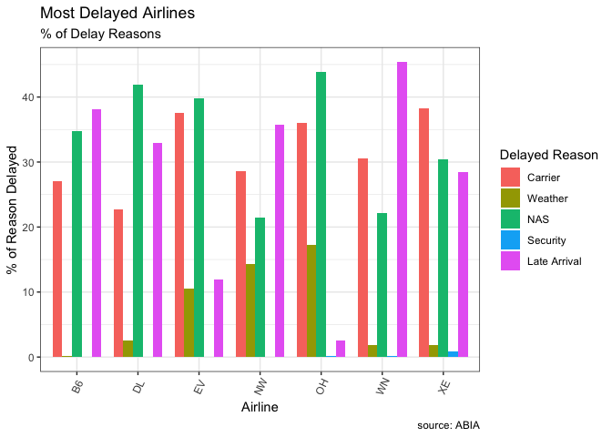
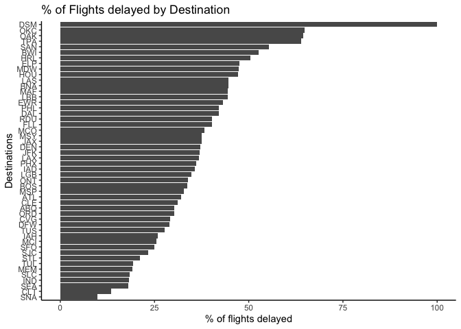

Green buildings
===============

``` r
library(mosaic)
```

    ## Loading required package: dplyr

    ## 
    ## Attaching package: 'dplyr'

    ## The following objects are masked from 'package:stats':
    ## 
    ##     filter, lag

    ## The following objects are masked from 'package:base':
    ## 
    ##     intersect, setdiff, setequal, union

    ## Loading required package: lattice

    ## Loading required package: ggformula

    ## Loading required package: ggplot2

    ## Loading required package: ggstance

    ## 
    ## Attaching package: 'ggstance'

    ## The following objects are masked from 'package:ggplot2':
    ## 
    ##     geom_errorbarh, GeomErrorbarh

    ## 
    ## New to ggformula?  Try the tutorials: 
    ##  learnr::run_tutorial("introduction", package = "ggformula")
    ##  learnr::run_tutorial("refining", package = "ggformula")

    ## Loading required package: mosaicData

    ## Loading required package: Matrix

    ## Registered S3 method overwritten by 'mosaic':
    ##   method                           from   
    ##   fortify.SpatialPolygonsDataFrame ggplot2

    ## 
    ## The 'mosaic' package masks several functions from core packages in order to add 
    ## additional features.  The original behavior of these functions should not be affected by this.
    ## 
    ## Note: If you use the Matrix package, be sure to load it BEFORE loading mosaic.

    ## 
    ## Attaching package: 'mosaic'

    ## The following object is masked from 'package:Matrix':
    ## 
    ##     mean

    ## The following object is masked from 'package:ggplot2':
    ## 
    ##     stat

    ## The following objects are masked from 'package:dplyr':
    ## 
    ##     count, do, tally

    ## The following objects are masked from 'package:stats':
    ## 
    ##     binom.test, cor, cor.test, cov, fivenum, IQR, median,
    ##     prop.test, quantile, sd, t.test, var

    ## The following objects are masked from 'package:base':
    ## 
    ##     max, mean, min, prod, range, sample, sum

``` r
greenbuildingsdata = read.csv('data/greenbuildings.csv')

data(greenbuildingsdata)
```

    ## Warning in data(greenbuildingsdata): data set 'greenbuildingsdata' not
    ## found

``` r
greenbuildingsdata
```

    ##      CS_PropertyID cluster    size empl_gr  Rent leasing_rate stories age
    ## 1           379105       1  260300    2.22 38.56        91.39      14  16
    ## 2           122151       1   67861    2.22 28.57        87.14       5  27
    ## 3           379839       1  164848    2.22 33.31        88.94      13  36
    ## 4            94614       1   93372    2.22 35.00        97.04      13  46
    ## 5           379285       1  174307    2.22 40.69        96.58      16   5
    ## 6            94765       1  231633    2.22 43.16        92.74      14  20
    ## 7           236739       6  210038    4.01 12.50        94.33      11  38
    ## 8           234578       6  225895    4.01 14.77        91.02      15  24
    ## 9            42087       6  912011    4.01 17.00        99.32      31  34
    ## 10          233989       6  518578    4.01 17.00        93.54      21  36
    ## 11          236704       6  241294    4.01 17.00        83.61      11  32
    ## 12          234263       6  255305    4.01 18.00        95.69      15  25
    ## 13          234298       6  254920    4.01 18.00       100.00      15  26
    ## 14          233940       6  745956    4.01 19.00        95.62      31  28
    ## 15          233941       6  746824    4.01 19.00        67.48      31  29
    ## 16          239670       6   85000    4.01 19.50        85.41       7  40
    ## 17          431225       8  409889   67.78 30.50        97.06      20   6
    ## 18          104642       8   28000   67.78 12.51        63.87       3  56
    ## 19          224619       8   69142   67.78 15.20        79.65       8  56
    ## 20          625220       8   72500   67.78 18.58         0.00      10  57
    ## 21          224594       8  204278   67.78 20.00        95.59      12  46
    ## 22           51815       8  127313   67.78 22.90        86.95       8  77
    ## 23          224553       8  723922   67.78 25.50       100.00      40  34
    ## 24          224579       8  244651   67.78 25.50        41.66      18  43
    ## 25          224554       8  371727   67.78 25.73        86.08      31  31
    ## 26          224558       8  491623   67.78 29.62        92.04      26  20
    ## 27          224556       8  470464   67.78 31.25        98.31      28  19
    ## 28          224565       8  567163   67.78 33.00        97.36      24   7
    ## 29          656670       8  137000   67.78 33.00        96.75      11  76
    ## 30          204299      11  525422    1.74 25.00        71.10      16  23
    ## 31          520856      11  184549    1.74 17.50       100.00       6   5
    ## 32          204385      11   76087    1.74 21.00        89.26       3  21
    ## 33          204378      11  101711    1.74 22.00        85.19       4  17
    ## 34          204295      11  487027    1.74 27.00        73.64      27  16
    ## 35          437486      13  378538    3.27 26.61        95.54      17  22
    ## 36          437487      13  386596    3.27 23.50        79.79      17  20
    ## 37          755727      14  841498    1.74 24.50        99.46      40   2
    ## 38          144515      14  136800    1.74 14.75        83.33      13  84
    ## 39            1588      14   39761    1.74 15.00        93.08      13  83
    ## 40          144402      14  625696    1.74 16.23        94.36      23  97
    ## 41          144297      14 1601744    1.74 16.29        93.77      48  34
    ## 42          144337      14  733633    1.74 16.78        79.31      37  21
    ## 43          144318      14  803046    1.74 17.37        72.44      40  26
    ## 44            1586      14  401000    1.74 18.06        86.28      19  93
    ## 45          144411      14   78100    1.74 19.00        91.35      22  94
    ## 46          144491      14  173612    1.74 19.00        95.46      14 104
    ## 47          144492      14  111323    1.74 19.00        87.90      14  78
    ## 48          144523      14  281325    1.74 19.00        96.02      12 119
    ## 49          144410      14  130976    1.74 19.13        94.22      22  80
    ## 50          144403      14  125729    1.74 19.50        87.12      23  79
    ## 51            1597      14   66600    1.74 20.00        47.14       6 107
    ## 52          144294      14 1056408    1.74 20.00        92.46      50  15
    ## 53          145034      14   13909    1.74 20.00        22.35       4  77
    ## 54          144466      14  159000    1.74 20.50        96.09      17  46
    ## 55          144306      14  988171    1.74 20.53        94.35      44  33
    ## 56          144342      14  591430    1.74 20.91        86.79      37  32
    ## 57            1587      14  243040    1.74 21.50        91.82      19 103
    ## 58          123313      14  940639    1.74 21.97        91.63      50  17
    ## 59          144474      14  158100    1.74 22.11        93.96      16 114
    ## 60          144473      14  200187    1.74 22.50        83.02      16  95
    ## 61          144494      14  219273    1.74 22.50        83.62      15 114
    ## 62          144499      14  197621    1.74 22.66        77.60      12 107
    ## 63          144388      14  157409    1.74 22.75       100.00      25  80
    ## 64          144425      14  178000    1.74 23.12        96.44      21  84
    ## 65          144331      14  174000    1.74 23.43        95.64      38  78
    ## 66          144286      14 1904229    1.74 23.50        99.42      57  40
    ## 67          144329      14  798782    1.74 23.50        68.55      40  21
    ## 68          144434      14  420000    1.74 24.00        96.28      21  93
    ## 69          144460      14  884004    1.74 24.00        72.32      17 102
    ## 70          576483      14   43049    1.74 24.35        20.21       5 107
    ## 71          148528      14  896769    1.74 24.47        60.55      15  87
    ## 72          144319      14  455813    1.74 24.50        84.60      41  80
    ## 73          144445      14  237070    1.74 24.50        76.61      19  50
    ## 74          144420      14  206000    1.74 24.55        68.80      22  81
    ## 75          144347      14  384510    1.74 24.62        93.17      36  27
    ## 76          144472      14  640554    1.74 25.00        52.46      16  95
    ## 77          144433      14  285000    1.74 25.45        91.20      22  97
    ## 78          144298      14  486602    1.74 25.51        84.78      47  78
    ## 79          354086      14 1504364    1.74 26.45        93.27      37   4
    ## 80          144322      14  402010    1.74 26.49        91.54      38  76
    ## 81          144429      14  294000    1.74 26.63        95.02      21  93
    ## 82          403900      14   53642    1.74 26.84        87.74       4   7
    ## 83          144371      14  879000    1.74 28.00        87.62      28  26
    ## 84          144361      14  363657    1.74 28.26        85.87      30  37
    ## 85          803427      14  104518    1.74 29.73        40.39      57   2
    ## 86          144348      14  290000    1.74 29.76        54.37      35  91
    ## 87          144426      14  579778    1.74 38.47        95.86      22  93
    ## 88           86260      14  259000    1.74 40.00        75.19      22  93
    ## 89          144381      14  691410    1.74 80.00       100.00      26  29
    ## 90          320838      16  550101    1.97 29.00        87.79      43  24
    ## 91          320800      16   65625    1.97 19.76        93.91       9  91
    ## 92          320796      16   23534    1.97 22.95        84.47       5  90
    ## 93          320726      16  216000    1.97 23.00       100.00      12  67
    ## 94          320642      16   53577    1.97 24.00       100.00      14  90
    ## 95          320922      16   13400    1.97 24.00       100.00       6  77
    ## 96          320943      16  120000    1.97 24.00        95.42      13  98
    ## 97          321012      16    9729    1.97 24.00        80.47       5 100
    ## 98          320406      16  233654    1.97 25.00        81.39      28  77
    ## 99          320573      16   22355    1.97 26.00        80.00       5  66
    ## 100         320577      16   30000    1.97 27.00        83.25       5 100
    ## 101         320635      16   64955    1.97 27.00        72.02       7  83
    ## 102         320876      16   30000    1.97 27.00       100.00       7  80
    ## 103         320518      16   19260    1.97 27.09        64.18       8 100
    ## 104         122010      16    7050    1.97 28.60        18.44       3 101
    ## 105         320647      16  116300    1.97 29.00        98.22      21 109
    ## 106         323202      16   24250    1.97 29.23        96.82       4 100
    ## 107         320719      16  430523    1.97 29.93        78.55      25  52
    ## 108          44637      16  572041    1.97 30.00        95.52      22  85
    ## 109          89098      16   15832    1.97 30.00        68.85       6  99
    ## 110         320608      16   25600    1.97 30.00        24.02       7 100
    ## 111          36158      16  128838    1.97 30.37        89.35      14  94
    ## 112         320640      16   99465    1.97 30.50        98.46      21  85
    ## 113         320847      16   19600    1.97 31.50        85.71       6  82
    ## 114         320439      16  106000    1.97 31.99        92.20      11  94
    ## 115         320811      16  103000    1.97 32.00        96.16       7  99
    ## 116         320756      16   65000    1.97 33.00        98.96       8  93
    ## 117         321423      16   19000    1.97 33.00       100.00       5 100
    ## 118         320607      16   32800    1.97 34.00        93.54       8  99
    ## 119         320434      16  711000    1.97 34.18        95.71      48  21
    ## 120         320432      16   89927    1.97 34.50        88.46      11  85
    ## 121         320723      16  434569    1.97 34.55        90.60      22 115
    ## 122         323237      16   39900    1.97 34.75       100.00       7 100
    ## 123          43473      16   15150    1.97 35.00       100.00       6 100
    ## 124         320845      16   51086    1.97 35.00        79.30      16  81
    ## 125         320877      16   33000    1.97 35.00        84.85       6 100
    ## 126         320799      16   18021    1.97 35.14        66.12       7  79
    ## 127         320441      16  265363    1.97 35.20        98.20      16 104
    ## 128         321023      16   37544    1.97 35.50        88.70      10  97
    ## 129         320428      16   51051    1.97 36.14        95.36       6  93
    ## 130         320643      16   71345    1.97 37.50       100.00      15 100
    ## 131         320426      16  240546    1.97 38.00        88.38      17  27
    ## 132         320630      16  623352    1.97 38.00        83.10      38  28
    ## 133         320600      16  228470    1.97 39.00        98.76      22  21
    ## 134          87648      16  180000    1.97 39.56        41.58      14  99
    ## 135         115915      16   79280    1.97 41.50        31.60       7  98
    ## 136         320637      16  486711    1.97 41.50        83.81      42  32
    ## 137         320431      16   51376    1.97 42.00       100.00      11  99
    ## 138         320405      16  303645    1.97 43.00       100.00      18  48
    ## 139         320628      16  220000    1.97 45.00        91.92      26  21
    ## 140         320923      16  108691    1.97 45.00       100.00       9 103
    ## 141         320641      16  428420    1.97 45.95       100.00      30  29
    ## 142         320721      16   56000    1.97 50.25        95.27      16  86
    ## 143          36160      16   43956    1.97 55.00       100.00      10 101
    ## 144          89257      16  186072    1.97 85.00        59.21      10 101
    ## 145         320443      16 1708748    1.97 99.42        95.10      52  38
    ## 146         144535      18   80228    1.74 12.75        55.82      11  84
    ## 147         144515      18  136800    1.74 14.75        83.33      13  84
    ## 148           1588      18   39761    1.74 15.00        93.08      13  83
    ## 149         144402      18  625696    1.74 16.23        94.36      23  97
    ## 150         144297      18 1601744    1.74 16.29        93.77      48  34
    ## 151         144337      18  733633    1.74 16.78        79.31      37  21
    ## 152         144318      18  803046    1.74 17.37        72.44      40  26
    ## 153           1586      18  401000    1.74 18.06        86.28      19  93
    ## 154         144411      18   78100    1.74 19.00        91.35      22  94
    ## 155         144491      18  173612    1.74 19.00        95.46      14 104
    ## 156         144492      18  111323    1.74 19.00        87.90      14  78
    ## 157         144523      18  281325    1.74 19.00        96.02      12 119
    ## 158         144410      18  130976    1.74 19.13        94.22      22  80
    ## 159         144403      18  125729    1.74 19.50        87.12      23  79
    ## 160           1597      18   66600    1.74 20.00        47.14       6 107
    ## 161         144294      18 1056408    1.74 20.00        92.46      50  15
    ## 162         145034      18   13909    1.74 20.00        22.35       4  77
    ## 163         144466      18  159000    1.74 20.50        96.09      17  46
    ## 164         144306      18  988171    1.74 20.53        94.35      44  33
    ## 165         144342      18  591430    1.74 20.91        86.79      37  32
    ## 166           1587      18  243040    1.74 21.50        91.82      19 103
    ## 167         123313      18  940639    1.74 21.97        91.63      50  17
    ## 168         144474      18  158100    1.74 22.11        93.96      16 114
    ## 169         144494      18  219273    1.74 22.50        83.62      15 114
    ## 170         144499      18  197621    1.74 22.66        77.60      12 107
    ## 171         144388      18  157409    1.74 22.75       100.00      25  80
    ## 172         144425      18  178000    1.74 23.12        96.44      21  84
    ## 173         144331      18  174000    1.74 23.43        95.64      38  78
    ## 174         144286      18 1904229    1.74 23.50        99.42      57  40
    ## 175         144329      18  798782    1.74 23.50        68.55      40  21
    ## 176         144434      18  420000    1.74 24.00        96.28      21  93
    ## 177         144460      18  884004    1.74 24.00        72.32      17 102
    ## 178         576483      18   43049    1.74 24.35        20.21       5 107
    ## 179         148528      18  896769    1.74 24.47        60.55      15  87
    ## 180         144319      18  455813    1.74 24.50        84.60      41  80
    ## 181         144445      18  237070    1.74 24.50        76.61      19  50
    ## 182         144420      18  206000    1.74 24.55        68.80      22  81
    ## 183         144347      18  384510    1.74 24.62        93.17      36  27
    ## 184         144472      18  640554    1.74 25.00        52.46      16  95
    ## 185         144433      18  285000    1.74 25.45        91.20      22  97
    ## 186         144298      18  486602    1.74 25.51        84.78      47  78
    ## 187         354086      18 1504364    1.74 26.45        93.27      37   4
    ## 188         144322      18  402010    1.74 26.49        91.54      38  76
    ## 189         144429      18  294000    1.74 26.63        95.02      21  93
    ## 190         403900      18   53642    1.74 26.84        87.74       4   7
    ## 191         144371      18  879000    1.74 28.00        87.62      28  26
    ## 192         144361      18  363657    1.74 28.26        85.87      30  37
    ## 193         803427      18  104518    1.74 29.73        40.39      57   2
    ## 194         144348      18  290000    1.74 29.76        54.37      35  91
    ## 195         144426      18  579778    1.74 38.47        95.86      22  93
    ## 196          86260      18  259000    1.74 40.00        75.19      22  93
    ## 197         144381      18  691410    1.74 80.00       100.00      26  29
    ## 198        1212036      20  385469      NA 17.97        99.49      14  20
    ## 199        1211872      20  127982      NA 15.00        82.27      18  86
    ## 200        1212027      20   63150      NA 15.00        66.22       6  85
    ## 201        1216881      20   98725      NA 15.54        85.82       6  97
    ## 202        1211896      20    3000      NA 16.00        50.00       4 127
    ## 203        1216662      20   13100      NA 16.00        11.05       1  45
    ## 204        1211247      20  850000      NA 16.50        95.90      11  90
    ## 205        1211853      20   70377      NA 18.00        75.39       6  45
    ## 206        1215535      20  300000      NA 18.00        63.40      27  40
    ## 207        1216862      20  309686      NA 18.62        86.14       8  81
    ## 208        1183800      20  330901      NA 19.34        97.65      30  18
    ## 209        1211834      20  187190      NA 20.00        94.66       9  52
    ## 210        1211865      20  598540      NA 20.61        96.79      26  33
    ## 211        1215530      20  281189      NA 20.80        72.37      17  18
    ## 212        1211751      20  391234      NA 21.50        42.60      23  26
    ## 213         826141      20  673061      NA 21.98        85.07      29  23
    ## 214        1211897      20  108000      NA 22.00         0.00       3   1
    ## 215        1215914      20  818000      NA 22.58        95.51      38  27
    ## 216        1212003      20  221410      NA 23.00        58.23      18  45
    ## 217        1211838      20  258721      NA 24.00        86.82      20  44
    ## 218        1152870      20  379914      NA 24.50        95.90      14  20
    ## 219        1215918      20  277120      NA 24.53        73.35      18  18
    ## 220          48101      22  465363    1.97 32.04        67.20      27  19
    ## 221         320642      22   53577    1.97 24.00       100.00      14  90
    ## 222         320406      22  233654    1.97 25.00        81.39      28  77
    ## 223         320573      22   22355    1.97 26.00        80.00       5  66
    ## 224         320577      22   30000    1.97 27.00        83.25       5 100
    ## 225         320635      22   64955    1.97 27.00        72.02       7  83
    ## 226         320876      22   30000    1.97 27.00       100.00       7  80
    ## 227         323202      22   24250    1.97 29.23        96.82       4 100
    ## 228          44637      22  572041    1.97 30.00        95.52      22  85
    ## 229          89098      22   15832    1.97 30.00        68.85       6  99
    ## 230         402791      22    4000    1.97 30.00         0.00       3  99
    ## 231          36158      22  128838    1.97 30.37        89.35      14  94
    ## 232         320640      22   99465    1.97 30.50        98.46      21  85
    ## 233         321040      22   57000    1.97 32.00        85.26       6 100
    ## 234         320756      22   65000    1.97 33.00        98.96       8  93
    ## 235         321423      22   19000    1.97 33.00       100.00       5 100
    ## 236         323237      22   39900    1.97 34.75       100.00       7 100
    ## 237          43473      22   15150    1.97 35.00       100.00       6 100
    ## 238         320877      22   33000    1.97 35.00        84.85       6 100
    ## 239         321023      22   37544    1.97 35.50        88.70      10  97
    ## 240         320507      22  373470    1.97 36.00        98.23       8  79
    ## 241         320643      22   71345    1.97 37.50       100.00      15 100
    ## 242         320426      22  240546    1.97 38.00        88.38      17  27
    ## 243         320630      22  623352    1.97 38.00        83.10      38  28
    ## 244          87648      22  180000    1.97 39.56        41.58      14  99
    ## 245         320637      22  486711    1.97 41.50        83.81      42  32
    ## 246         320405      22  303645    1.97 43.00       100.00      18  48
    ## 247         320618      22  249918    1.97 43.01        67.08      22  17
    ## 248         320628      22  220000    1.97 45.00        91.92      26  21
    ## 249         320641      22  428420    1.97 45.95       100.00      30  29
    ## 250         171708      23   90045    1.15 19.79        85.59       3  20
    ## 251         171706      23  177820    1.15 21.86        95.13       3  18
    ## 252         171707      23  146448    1.15 22.00        61.47       3  21
    ## 253         246750      25  490803    2.38 31.80        80.81      20  25
    ## 254         246774      25  321800    2.38 28.20        53.11      15  35
    ## 255         479467      26 1117000    3.86 26.00       100.00      60  15
    ## 256         479402      26   88993    3.86 10.00        93.19       5  79
    ## 257         479433      26   25184    3.86 13.50        78.16       2  57
    ## 258         479420      26   22400    3.86 15.60        80.84       7  82
    ## 259         502638      26   30520    3.86 17.00        85.91       3  77
    ## 260         479416      26  210426    3.86 19.50        95.97      17  45
    ## 261         479418      26  172385    3.86 19.50        79.50      17  83
    ## 262         479452      26  163742    3.86 19.77        89.97      16  50
    ## 263         479413      26  529817    3.86 22.00        99.16      20  24
    ## 264         479473      26  475043    3.86 22.00        96.87      23  21
    ## 265         479447      26  716000    3.86 22.05        99.09      30  36
    ## 266         479436      26  625026    3.86 28.00        98.51      27  26
    ## 267         479410      26   23294    3.86 29.14        63.78       2  93
    ## 268        1029816      28  413895    2.06 11.75        78.76      25  22
    ## 269        1289797      28  197000    2.06  5.50        64.88       8  27
    ## 270        1029911      28   38673    2.06  6.00        56.82       4  60
    ## 271        1029479      28  115452    2.06  6.50        77.02       9  25
    ## 272        1029570      28  259000    2.06  8.00        85.62      12  98
    ## 273        1029794      28  198716    2.06  8.00        78.03      13  85
    ## 274        1029892      28  157600    2.06  8.00        86.60      12  91
    ## 275        1289830      28  178858    2.06  8.93        86.92      12  78
    ## 276         766407      28  537000    2.06  9.00        92.82      17  45
    ## 277        1029443      28   23210    2.06  9.00        62.09       5 107
    ## 278        1029848      28  141558    2.06  9.00        77.52      26  78
    ## 279        1034029      28  350547    2.06  9.00        88.00      12  81
    ## 280        1036680      28  299908    2.06  9.00        84.77      14  41
    ## 281        1129684      28   96476    2.06  9.00        77.00      12  81
    ## 282         766428      28  276000    2.06 10.00        87.47      13  45
    ## 283        1035248      28  300000    2.06 10.00        87.95      18  84
    ## 284        1029658      28 1308000    2.06 11.64        94.03      52  35
    ## 285        1029857      28  415824    2.06 11.77        93.07      20  37
    ## 286        1025843      28  438197    2.06 12.00        76.33      16  20
    ## 287        1029452      28  235441    2.06 14.00        87.14      11 122
    ## 288        1029506      28  109942    2.06 14.50        82.15      12  78
    ## 289        1029515      28  393902    2.06 14.50        85.81      27  47
    ## 290        1039722      28  315783    2.06 14.50        91.06      36  20
    ## 291        1013868      28  592953    2.06 15.50        95.14      40  18
    ## 292        1029565      28 1081641    2.06 15.50        98.75      50  24
    ## 293          86081      29  388325    4.72 23.00        76.82      22  22
    ## 294         380531      29   10000    4.72 15.90        44.50       2  87
    ## 295         110000      29   46182    4.72 19.00        68.86       6  33
    ## 296         380519      29  509701    4.72 19.21        87.04      36  35
    ## 297         380475      29  515965    4.72 20.00        65.94      31  19
    ## 298         380557      29  745911    4.72 20.98        77.73      38  26
    ## 299         380221      29  789636    4.72 24.50        93.15      40  21
    ## 300         380226      29  552080    4.72 27.00        97.62      42  15
    ## 301         324738      32  326174    1.97 28.59        82.62       6  25
    ## 302         329534      32   50160    1.97 16.47         5.10      11  92
    ## 303         328730      32    7552    1.97 18.00        66.90       3  78
    ## 304         329415      32   25000    1.97 19.80        62.78       4  92
    ## 305         324765      32   77000    1.97 20.74        87.35      16  80
    ## 306        5513026      32   16280    1.97 21.00        92.44       4  18
    ## 307         328244      32   54553    1.97 21.59        38.57       7  83
    ## 308         324744      32   73312    1.97 21.60        75.35      10  96
    ## 309          51396      32   60000    1.97 23.08        82.11       4  95
    ## 310         325464      32  136769    1.97 23.40        77.55      10  81
    ## 311         328584      32   28000    1.97 24.00        97.86       3  20
    ## 312         326289      32   19474    1.97 25.20        85.42       7  93
    ## 313         324764      32   82298    1.97 25.80        24.58      20 101
    ## 314         117990      32   20000    1.97 26.92        21.00       4  21
    ## 315         110824      32  325000    1.97 27.87        83.05      15  50
    ## 316         326298      32   24681    1.97 28.80       100.00       3  21
    ## 317         326303      32   17103    1.97 28.80        95.74       3  97
    ## 318         324747      32  183178    1.97 28.97        85.31      11  17
    ## 319         324743      32  238392    1.97 30.09        66.46      10  35
    ## 320         532350      32  676596    1.97 30.72        99.01      20   5
    ## 321         324739      32  580000    1.97 36.00        93.65      24  17
    ## 322         246763      33  113352    2.38 31.80        92.62       6  23
    ## 323         246849      33   40000    2.38 23.40        78.74       2  19
    ## 324         249413      33  100890    2.38 26.40        92.37       5  21
    ## 325         254562      33   57822    2.38 30.00        81.33       5  14
    ## 326         233899      34 1721242    4.01 27.75        77.16      71  24
    ## 327          91251      34   71000    4.01  9.60         0.00      10  77
    ## 328         233981      34  203888    4.01 12.00        46.35      23  98
    ## 329         234027      34  380220    4.01 13.00        63.87      18  52
    ## 330         119911      34  218511    4.01 15.00        47.78      21  26
    ## 331         233936      34  809997    4.01 15.18        92.39      35  78
    ## 332         233953      34  599107    4.01 15.64        75.63      27  81
    ## 333         234438      34  182018    4.01 18.00        26.16      15  46
    ## 334         238412      34   82568    4.01 18.05        67.57      10  84
    ## 335         233943      34  594595    4.01 18.09        95.97      29  46
    ## 336         233977      34  542458    4.01 19.84        77.45      24  51
    ## 337         119822      34  844000    4.01 20.00        90.50      35  36
    ## 338         239636      34  105145    4.01 20.50         9.73       8  29
    ## 339          42088      34  264885    4.01 21.39        96.19      20  26
    ## 340         239996      34   70000    4.01 22.00        35.13       4  79
    ## 341         233966      34  837161    4.01 22.38        97.56      36   4
    ## 342          45249      34  116000    4.01 22.51        84.22      11  87
    ## 343         765114      34  500000    4.01 23.50        98.07      25  79
    ## 344          56248      34  664940    4.01 23.57        95.92      34  32
    ## 345         233935      34  993298    4.01 24.00        98.45      34  35
    ## 346         233921      34 1194717    4.01 24.02        88.87      50  27
    ## 347         233934      34  995505    4.01 24.22        95.76      36  29
    ## 348         246769      37  471692    2.38 21.69        83.21      22  20
    ## 349         246806      37  615647    2.38 14.00       100.00      33  19
    ## 350         260630      37   41000    2.38 18.60         0.00       2  57
    ## 351         110423      37   24152    2.38 19.20        83.43       4  59
    ## 352         249199      37 1028852    2.38 20.97        88.28      62  33
    ## 353         249220      37  915316    2.38 22.83        93.58      41  22
    ## 354         249291      37  349213    2.38 23.31        54.07      21  47
    ## 355         115514      37   29823    2.38 24.00        63.02       5  76
    ## 356         249410      37  160000    2.38 24.00        87.11      15  55
    ## 357          42209      37  458149    2.38 24.86        94.14      25  15
    ## 358         249299      37  377400    2.38 25.34        86.67      12  81
    ## 359         249273      37  213079    2.38 25.66        96.66      18  34
    ## 360          26995      37  281000    2.38 25.69        90.13      19  21
    ## 361         254428      37   35086    2.38 26.00        52.86       3  49
    ## 362         249290      37  113070    2.38 26.69        77.89      12  81
    ## 363         249265      37  126700    2.38 27.50        84.31      12  22
    ## 364         249188      37  678500    2.38 29.76        87.98      33  34
    ## 365         249190      37   74141    2.38 30.47        69.15       7  41
    ## 366         248955      37  278900    2.38 33.00        86.90      24  18
    ## 367         246888      37  143491    2.38 37.99        87.80      17  42
    ## 368        1326604      38  259317    1.93  2.98       100.00      21  29
    ## 369        1369881      38   25148    1.93 14.57        41.26       3 111
    ## 370        5737391      38  153966    1.93 15.00       100.00      25  37
    ## 371        5521767      38  325000    1.93 15.92        98.13      31  14
    ## 372        5625732      38   66380    1.93 16.20        98.47       9  32
    ## 373        5768846      38    6452    1.93 17.40         0.00       5  31
    ## 374        1377346      38  275408    1.93 18.24        81.87      30  14
    ## 375        1440533      38   84180    1.93 19.39        77.58       8  28
    ## 376        1395373      38  201241    1.93 19.61        97.80      24  18
    ## 377        1380540      38  186138    1.93 19.80        98.56      25  13
    ## 378        1386436      38  355802    1.93 20.40       100.00      20  35
    ## 379        1453932      38   99175    1.93 20.62        66.47       8  19
    ## 380        1176923      38  477045    1.93 20.77        92.90      20  38
    ## 381        1380142      38  105332    1.93 24.00        87.36      10  42
    ## 382         233985      41  371192    4.01 17.80        84.56      23  60
    ## 383          23293      41   90000    4.01  9.00         0.00      16  59
    ## 384          91251      41   71000    4.01  9.60         0.00      10  77
    ## 385         233981      41  203888    4.01 12.00        46.35      23  98
    ## 386         234027      41  380220    4.01 13.00        63.87      18  52
    ## 387         119911      41  218511    4.01 15.00        47.78      21  26
    ## 388         233995      41  507247    4.01 15.06        93.30      21  52
    ## 389         233936      41  809997    4.01 15.18        92.39      35  78
    ## 390         233953      41  599107    4.01 15.64        75.63      27  81
    ## 391         233968      41  795115    4.01 15.66        89.08      25  24
    ## 392         237400      41   92277    4.01 16.00        89.53      10  93
    ## 393         234438      41  182018    4.01 18.00        26.16      15  46
    ## 394         238412      41   82568    4.01 18.05        67.57      10  84
    ## 395         233943      41  594595    4.01 18.09        95.97      29  46
    ## 396         233977      41  542458    4.01 19.84        77.45      24  51
    ## 397         119822      41  844000    4.01 20.00        90.50      35  36
    ## 398         239636      41  105145    4.01 20.50         9.73       8  29
    ## 399         234056      41  674246    4.01 20.52        89.06      16  24
    ## 400          42088      41  264885    4.01 21.39        96.19      20  26
    ## 401         233966      41  837161    4.01 22.38        97.56      36   4
    ## 402          45249      41  116000    4.01 22.51        84.22      11  87
    ## 403         765114      41  500000    4.01 23.50        98.07      25  79
    ## 404          56248      41  664940    4.01 23.57        95.92      34  32
    ## 405         233923      41 1333312    4.01 24.00        93.65      49  27
    ## 406         233918      41 1247061    4.01 24.75        93.25      51  25
    ## 407         320422      47 1203065    1.97 42.00        97.49      48  25
    ## 408         320796      47   23534    1.97 22.95        84.47       5  90
    ## 409         320406      47  233654    1.97 25.00        81.39      28  77
    ## 410          36158      47  128838    1.97 30.37        89.35      14  94
    ## 411         320847      47   19600    1.97 31.50        85.71       6  82
    ## 412         320439      47  106000    1.97 31.99        92.20      11  94
    ## 413          42661      47   58383    1.97 32.00        87.76       7  99
    ## 414         320434      47  711000    1.97 34.18        95.71      48  21
    ## 415         320432      47   89927    1.97 34.50        88.46      11  85
    ## 416         320362      47  151942    1.97 35.00        92.76       7  83
    ## 417         320845      47   51086    1.97 35.00        79.30      16  81
    ## 418         320428      47   51051    1.97 36.14        95.36       6  93
    ## 419         320426      47  240546    1.97 38.00        88.38      17  27
    ## 420         320630      47  623352    1.97 38.00        83.10      38  28
    ## 421          87648      47  180000    1.97 39.56        41.58      14  99
    ## 422         320364      47   27000    1.97 39.74        34.92       3 100
    ## 423         320431      47   51376    1.97 42.00       100.00      11  99
    ## 424         320405      47  303645    1.97 43.00       100.00      18  48
    ## 425         320618      47  249918    1.97 43.01        67.08      22  17
    ## 426         320420      47  655173    1.97 44.00        95.99      37  35
    ## 427         320628      47  220000    1.97 45.00        91.92      26  21
    ## 428         320472      47  934764    1.97 50.00        95.50      40  25
    ## 429          48100      47  273084    1.97 50.04        85.21      13  48
    ## 430         320469      47  818711    1.97 50.67        90.95      41  36
    ## 431          44565      47  137011    1.97 68.21        96.88      16  40
    ## 432         320622      47  883778    1.97 74.76        92.19      42  31
    ## 433         333792      50   85115    1.97 43.00        94.90       4   5
    ## 434         333655      50   82511    1.97 30.00        82.45       9  39
    ## 435         333618      50   69043    1.97 34.20        98.32       7  39
    ## 436         479412      51  887079    3.86 32.76        99.73      40  33
    ## 437         479402      51   88993    3.86 10.00        93.19       5  79
    ## 438         479433      51   25184    3.86 13.50        78.16       2  57
    ## 439         479420      51   22400    3.86 15.60        80.84       7  82
    ## 440         502638      51   30520    3.86 17.00        85.91       3  77
    ## 441         479416      51  210426    3.86 19.50        95.97      17  45
    ## 442         479418      51  172385    3.86 19.50        79.50      17  83
    ## 443         479452      51  163742    3.86 19.77        89.97      16  50
    ## 444         479413      51  529817    3.86 22.00        99.16      20  24
    ## 445         479473      51  475043    3.86 22.00        96.87      23  21
    ## 446         479447      51  716000    3.86 22.05        99.09      30  36
    ## 447         479436      51  625026    3.86 28.00        98.51      27  26
    ## 448         479410      51   23294    3.86 29.14        63.78       2  93
    ## 449         717047      52  315133    3.39 25.17        81.25      20  25
    ## 450         717151      52   33030    3.39 15.01        89.42       6  98
    ## 451         716918      52   26145    3.39 18.31        90.43       5 117
    ## 452         743307      52   93947    3.39 18.40        83.10       5  43
    ## 453         716934      52  140000    3.39 18.48        99.24      10  55
    ## 454         717077      52  491528    3.39 19.00        97.38      30  23
    ## 455         716916      52  202200    3.39 19.15        95.06      11  36
    ## 456         716881      52   17645    3.39 19.85        78.28       4 113
    ## 457         716966      52   59000    3.39 19.95        84.75       4 131
    ## 458         716981      52  253000    3.39 20.39        99.32      15  27
    ## 459         716922      52   67869    3.39 21.01        91.93       9  97
    ## 460         717090      52   49060    3.39 22.00        86.26       6  25
    ## 461         717149      52  429499    3.39 23.85        99.41      17  30
    ## 462         717099      52  283000    3.39 24.00        94.69      16  17
    ## 463         717108      52  451058    3.39 24.27        97.87      29  36
    ## 464         716915      52  273198    3.39 26.02        93.72      19  33
    ## 465         716907      52  355705    3.39 26.28        86.80      35  23
    ## 466         717136      52  694000    3.39 26.71        95.91      38  35
    ## 467         716885      52  328346    3.39 27.00        92.94      19  20
    ## 468         313233      53  324341    1.77 25.80        97.18      25  44
    ## 469         313296      53   79670    1.77 19.10        87.75       6  78
    ## 470         103311      53    8963    1.77 19.80       100.00       1  45
    ## 471         313380      53   29922    1.77 19.80        94.32       3  24
    ## 472         350252      53   20000    1.77 20.40        46.78       4  47
    ## 473         352799      53   16670    1.77 20.40        92.80       4  57
    ## 474         313253      53   81273    1.77 22.06        47.54      12  80
    ## 475         313238      53  177725    1.77 23.42        86.82      23  44
    ## 476         365017      53   15000    1.77 24.00        95.03       3  27
    ## 477         624505      53   40000    1.77 24.74        87.25       4  47
    ## 478         114699      53   24500    1.77 25.20        98.16       4 119
    ## 479         313297      53  110400    1.77 25.87        75.58       6  95
    ## 480          35335      53   38325    1.77 26.40        97.80       4 111
    ## 481         313242      53  277000    1.77 27.95        65.94      20  25
    ## 482         313254      53  223475    1.77 30.90        74.08      14  82
    ## 483         313239      53  447159    1.77 31.42        87.96      22  38
    ## 484         596446      53   48161    1.77 45.00        84.18       4  62
    ## 485         246786      55  605657    2.38 45.00        99.82      26  35
    ## 486         247390      55  484154    2.38 31.97        71.50      21  37
    ## 487          27050      55   50000    2.38 33.00        95.60       4  42
    ## 488         247343      55  280500    2.38 36.00        91.75      14  44
    ## 489         247386      55  311400    2.38 39.33        98.16      15  37
    ## 490         254039      55   12000    2.38 42.00        56.67       3  16
    ## 491          42171      55  450000    2.38 48.00        97.50      23  25
    ## 492         247400      55  492139    2.38 49.69        96.33      20  39
    ## 493          42172      55  824106    2.38 91.04        98.50      39  17
    ## 494          71650      56  624464    1.19 19.50        98.56      16  31
    ## 495          71999      56   13200    1.19  9.50        15.15       4 107
    ## 496          61878      56   54000    1.19 10.00        65.48      12  82
    ## 497          71581      56   10800    1.19 10.00        75.00       4  57
    ## 498          71542      56   56940    1.19 12.00        46.15      13  43
    ## 499          62036      56   76657    1.19 12.50        85.65       2  20
    ## 500          71645      56  189405    1.19 13.67        61.35      13  83
    ## 501          71630      56  127530    1.19 13.90        64.71      12  51
    ## 502          71634      56   31000    1.19 14.00        95.48      13  80
    ## 503         553620      56   55000    1.19 14.00        92.29       6 102
    ## 504          71639      56  112000    1.19 14.02        91.36      14  77
    ## 505          71649      56   62000    1.19 14.75        88.55       4  77
    ## 506          61874      56   67000    1.19 15.00        67.61      10 102
    ## 507          71572      56   33000    1.19 15.17        72.85      10  93
    ## 508          71569      56   52019    1.19 15.50        83.68       4  47
    ## 509          72441      56   80000    1.19 15.50        85.37      13 100
    ## 510         554757      56   76000    1.19 15.50        92.70      17  94
    ## 511          71631      56   30000    1.19 15.82        26.06       9  86
    ## 512          71570      56   42956    1.19 16.00        96.21       8  47
    ## 513          71576      56  147610    1.19 16.00        86.61       8  97
    ## 514          71648      56   62000    1.19 16.00        86.34       5  38
    ## 515        1515971      56  166000    1.19 16.50        31.33       1  12
    ## 516          71658      56   87493    1.19 16.82        24.22       8  59
    ## 517          61881      56   67000    1.19 16.92        93.38       7  87
    ## 518         553630      56  662000    1.19 18.50        75.44      37  38
    ## 519         553727      56  339611    1.19 18.75        98.12      22  20
    ## 520         553614      56  152719    1.19 18.80        98.19      12  48
    ## 521          80840      56  296173    1.19 19.00        66.39      11 102
    ## 522         553574      56  161984    1.19 19.19        86.01      12  27
    ## 523         553734      56  532000    1.19 19.43        66.57      28  19
    ## 524          82129      56   42011    1.19 20.00         2.41       5  88
    ## 525         553732      56  318978    1.19 20.50        79.27      23  21
    ## 526         553742      56 1057852    1.19 20.88        97.93      48  17
    ## 527          74987      56   50000    1.19 22.50        86.58       5 107
    ## 528         129172      57   99916    0.97 39.50        95.79      11  37
    ## 529         129932      57  194000    0.97 29.00       100.00      12  26
    ## 530         129070      57   22329    0.97 29.50        83.11       8  90
    ## 531         130449      57  241695    0.97 31.00       100.00      10   6
    ## 532         129632      57   19500    0.97 32.00        27.37       4  33
    ## 533         122998      57  269000    0.97 33.00       100.00       9  28
    ## 534         129089      57  563795    0.97 33.00        95.41      13  35
    ## 535         129166      57   93915    0.97 35.00       100.00      12  80
    ## 536         130585      57    8359    0.97 35.00       100.00       4  93
    ## 537         129054      57   80490    0.97 35.08        94.27       9  46
    ## 538         129098      57   35485    0.97 35.82        68.10       8  40
    ## 539         129363      57  169549    0.97 36.50       100.00      12  67
    ## 540         766722      57   51907    0.97 36.50        19.03       9   1
    ## 541         129117      57   86942    0.97 36.53        95.59      11  43
    ## 542         129360      57  202514    0.97 37.00       100.00      12  43
    ## 543         129167      57  154413    0.97 37.10       100.00      12  32
    ## 544         112223      57  133000    0.97 38.00        93.12       8  40
    ## 545         129468      57  105152    0.97 38.91        67.26       8  36
    ## 546         129465      57  195000    0.97 38.97       100.00      11  43
    ## 547          41194      57  313984    0.97 39.09        99.49      12  47
    ## 548          41195      57   53034    0.97 39.25        93.24      10  47
    ## 549         129118      57  535253    0.97 39.45        95.84      10  32
    ## 550         129460      57  102631    0.97 39.48       100.00      10  44
    ## 551         129152      57  174934    0.97 39.50        98.07      12  38
    ## 552         129080      57   62251    0.97 39.67        99.04      12  53
    ## 553         130522      57   68669    0.97 39.82        91.73      12  45
    ## 554         129066      57  102822    0.97 40.00       100.00      12  94
    ## 555         129086      57  140000    0.97 40.00        99.17      11  38
    ## 556         129171      57  105643    0.97 40.61       100.00      10  26
    ## 557         129076      57  105721    0.97 40.79        98.22      12  43
    ## 558         129168      57  146474    0.97 41.00        98.77      12  44
    ## 559         129036      57   90017    0.97 41.18        90.69      12  32
    ## 560         129037      57  155214    0.97 41.32        94.72      12  54
    ## 561         129181      57   45834    0.97 41.50        94.20       8  22
    ## 562         129103      57  156272    0.97 41.88        96.96      12  18
    ## 563         129095      57  135000    0.97 42.00       100.00       8  21
    ## 564         129144      57   97000    0.97 42.00        99.13      11  47
    ## 565         129169      57  210000    0.97 42.00       100.00      13  43
    ## 566         129109      57  104394    0.97 42.17        99.48       9  42
    ## 567         129040      57  163764    0.97 42.50       100.00      13  40
    ## 568         663366      57  390000    0.97 42.69        97.33      12   2
    ## 569         129068      57  179383    0.97 43.31       100.00      11  43
    ## 570         129143      57  155639    0.97 43.38        91.93      12  32
    ## 571         129107      57  285167    0.97 43.41        98.63      12  38
    ## 572         129045      57  184000    0.97 43.49        99.09      12  41
    ## 573         129090      57  237746    0.97 43.49        95.92      13  41
    ## 574         129179      57  252014    0.97 44.05        95.42      12  28
    ## 575         129046      57  180891    0.97 44.09        98.12      12  32
    ## 576         129614      57  230000    0.97 44.24        99.59      13  37
    ## 577         129108      57  139478    0.97 44.50       100.00      12  29
    ## 578         129105      57  131708    0.97 44.92        86.78       8  30
    ## 579         129449      57  111329    0.97 44.98        98.08      12  66
    ## 580         130603      57  187624    0.97 44.99       100.00      12   5
    ## 581         108460      57  119000    0.97 45.00        85.34       8  23
    ## 582         129044      57  175000    0.97 45.00       100.00      12  19
    ## 583         129111      57  153161    0.97 45.00        89.38      10  22
    ## 584         130511      57   72020    0.97 45.00        89.73       9  39
    ## 585         129178      57  107338    0.97 45.40        93.37       8  25
    ## 586         129097      57  159981    0.97 45.48        92.18       8  35
    ## 587         129069      57  213475    0.97 45.86        92.48      10  20
    ## 588         129041      57  184696    0.97 45.97        96.65      12  29
    ## 589         129423      57  320032    0.97 46.00       100.00      11  17
    ## 590         129038      57  295000    0.97 46.15        96.13      12  38
    ## 591         129189      57  320000    0.97 46.17        87.81      10  27
    ## 592         129047      57   94793    0.97 46.40        82.97      12  23
    ## 593         129461      57  101317    0.97 46.50        97.43       8  44
    ## 594         112279      57  183043    0.97 46.53       100.00      12  24
    ## 595         130356      57  235311    0.97 47.00       100.00      11   7
    ## 596         129119      57  238481    0.97 47.38        83.79      12  21
    ## 597         130609      57  423205    0.97 49.00        99.61      12  25
    ## 598         129110      57  383000    0.97 50.00        98.32      10  40
    ## 599         129165      57  145127    0.97 50.27        94.22      12  44
    ## 600         129043      57  218571    0.97 51.26        96.18      12  21
    ## 601          41196      57  206314    0.97 51.68        97.69      11  37
    ## 602         129146      57  274532    0.97 52.53        97.43       8  28
    ## 603         129175      57  113574    0.97 53.26       100.00       8  21
    ## 604         130705      57  303466    0.97 53.54        91.65      12  27
    ## 605         129092      57  428970    0.97 54.23        84.99      12  30
    ## 606          55107      57   32529    0.97 55.00       100.00       9   7
    ## 607         129035      57   21309    0.97 55.00        91.39      12  19
    ## 608         129096      57  398286    0.97 55.48       100.00      11  32
    ## 609         121296      57  414195    0.97 55.75       100.00      13  23
    ## 610         129141      57  166377    0.97 57.66       100.00      12  37
    ## 611         129514      57  200414    0.97 61.37        99.31      13  45
    ## 612        1258500      58   60185    0.47 16.00        94.46       3  27
    ## 613        1258102      58   60000    0.47 12.50       100.00       3  27
    ## 614        1261622      58   38128    0.47 15.00       100.00       2  28
    ## 615        1260666      58   62700    0.47 15.63        55.81       3  24
    ## 616         607950      61  775037    2.38 69.00        98.90      35   4
    ## 617         247343      61  280500    2.38 36.00        91.75      14  44
    ## 618         247400      61  492139    2.38 49.69        96.33      20  39
    ## 619         679445      61  775541    2.38 60.00        85.01      12   0
    ## 620          42172      61  824106    2.38 91.04        98.50      39  17
    ## 621         246799      63   42292    2.38 42.00        91.30       3  28
    ## 622          48078      63   26135    2.38 26.64        95.18       4  22
    ## 623         246857      63   19849    2.38 31.69        81.97       4  22
    ## 624         246875      63   21302    2.38 34.20       100.00       2  38
    ## 625         246870      63  292056    2.38 53.67        98.21      20  18
    ## 626         246800      64   96251    2.38 41.55        67.54       4  23
    ## 627         246801      64   76976    2.38 33.07        95.84       4  21
    ## 628         234717      65  310296    4.01 21.49        99.20      14  24
    ## 629         235903      65  218507    4.01 16.69        99.61      11  24
    ## 630         240308      65   61461    4.01 18.50        89.22       2  27
    ## 631         233992      65  362226    4.01 20.05        98.05      21  25
    ## 632         132142      66  235000    0.97 26.50        75.77       3  38
    ## 633          41219      66  141366    0.97 29.60        64.01       6  27
    ## 634         130748      66  128150    0.97 29.86        89.23       6  26
    ## 635         130725      66  117778    0.97 35.00        98.39       6  36
    ## 636         130753      66  127302    0.97 35.00        96.70       6  30
    ## 637         131263      66  185154    0.97 36.61        65.80       9  23
    ## 638         130751      66  311000    0.97 38.36        85.69      15  22
    ## 639         130749      66  219345    0.97 38.44        95.38       8  25
    ## 640         393792      69  567287    1.43 26.78        97.77      25  35
    ## 641         399294      69   16377    1.43  8.13        81.99       5 114
    ## 642         393507      69   36523    1.43  9.00       100.00       5  31
    ## 643         393923      69   94259    1.43 12.00       100.00       7 109
    ## 644         393924      69   19600    1.43 14.24        66.33       4 102
    ## 645         393691      69   25679    1.43 14.50        71.52       5 118
    ## 646         393866      69  103300    1.43 14.84        89.12      12  95
    ## 647        1254193      69    6000    1.43 18.00        76.67       4  76
    ## 648         393795      69  494323    1.43 18.65        96.35      26  33
    ## 649         931899      69   85000    1.43 20.00       100.00       3  26
    ## 650         393622      69  110211    1.43 23.00        89.78       8  28
    ## 651         393904      69   39486    1.43 23.00       100.00       6  97
    ## 652         399347      69  120919    1.43 24.11        72.85       4 117
    ## 653         393834      69  212681    1.43 24.50        94.69      24  22
    ## 654         393788      69  696027    1.43 24.64        96.95      30  23
    ## 655         393481      69  126400    1.43 24.79         3.00       6  92
    ## 656         393893      69  143135    1.43 25.00        75.72      10  97
    ## 657         623243      69  139964    1.43 25.00        32.38       4  22
    ## 658         393910      69  173155    1.43 25.58        89.60      20  25
    ## 659         393512      69  185737    1.43 27.00        96.86      15  25
    ## 660         393501      69  553944    1.43 27.85        97.76      16  34
    ## 661         393917      69 1274867    1.43 29.67        99.23      52  25
    ## 662         393831      69  550805    1.43 30.00        96.46      42  26
    ## 663         393619      69  118696    1.43 30.50        91.36      10  26
    ## 664         353981      70  174000    2.38 28.87        98.07       5   6
    ## 665          27000      70   18000    2.38 27.60        88.33       4  24
    ## 666         259756      70    5760    2.38 28.20        77.95       2  82
    ## 667         735211      70    5598    2.38 31.20        73.92       1  50
    ## 668         253265      70   73971    2.38 32.31        97.78       3  62
    ## 669         256024      70   38346    2.38 32.64        98.83       2  78
    ## 670         248185      70   11616    2.38 34.20        83.64       2  80
    ## 671          93458      70    5905    2.38 38.09        94.50       2  43
    ## 672         248698      70  208244    2.38 54.33        59.14       9  16
    ## 673         246817      77   92486    2.38 39.76        98.06       4  23
    ## 674          96346      77    9616    2.38 23.92        87.52       2  66
    ## 675          93244      77   34065    2.38 36.00        91.07       4  22
    ## 676         586222      78  390480    2.10 22.80       100.00       2  20
    ## 677         200633      78   44219    2.10 16.20        54.75       1  18
    ## 678         200819      78   26506    2.10 16.20       100.00       1  20
    ## 679         591697      79   76797    5.72 20.00        96.76       3   5
    ## 680         591698      79  104909    5.72 23.00       100.00       4   4
    ## 681         469978      81  408459    2.44 37.94        92.62      24  24
    ## 682         509628      81    6420    2.44 21.56        79.22       2  41
    ## 683         469977      81  128832    2.44 22.77        92.54       8  21
    ## 684         600249      81   44535    2.44 24.00       100.00       2  40
    ## 685         470141      81   96691    2.44 25.00        90.25       6  12
    ## 686         470046      81  225000    2.44 29.50        98.42      10  27
    ## 687         470075      81   25600    2.44 30.00        97.67       2  28
    ## 688         470091      81   65521    2.44 30.00        90.44       7  39
    ## 689         478009      81  172046    2.44 31.00       100.00       8   6
    ## 690        1149211      81    8509    2.44 33.00        65.89       1   7
    ## 691         470092      81   19766    2.44 34.00       100.00       2  29
    ## 692         470059      81  243381    2.44 35.10        83.25       7  26
    ## 693         470010      81   64220    2.44 35.74        88.85       4  26
    ## 694         470000      81   96179    2.44 37.00        87.97       9  36
    ## 695         469990      81   34000    2.44 45.00        98.50       4  27
    ## 696        1036838      82  300000    2.06 13.81       100.00       9   8
    ## 697        1035651      82   55633    2.06 12.00        57.09       3  32
    ## 698        1393348      84  340657    1.93 18.09        93.45      23  15
    ## 699        1326604      84  259317    1.93  2.98       100.00      21  29
    ## 700        5737391      84  153966    1.93 15.00       100.00      25  37
    ## 701        5521767      84  325000    1.93 15.92        98.13      31  14
    ## 702        5768846      84    6452    1.93 17.40         0.00       5  31
    ## 703        1395373      84  201241    1.93 19.61        97.80      24  18
    ## 704        1380540      84  186138    1.93 19.80        98.56      25  13
    ## 705        1386436      84  355802    1.93 20.40       100.00      20  35
    ## 706        1380142      84  105332    1.93 24.00        87.36      10  42
    ## 707          42051      87   56303    2.44 24.17        89.69       5  97
    ## 708         470780      87   80000    2.44  6.00        50.00       4  77
    ## 709         533888      87   37300    2.44 15.00        85.72       5 100
    ## 710         470734      87   80000    2.44 17.50        75.00      19  11
    ## 711         470802      87   94889    2.44 18.45        99.44       3  16
    ## 712         478275      87   26570    2.44 19.50        79.68       5  96
    ## 713         470529      87   93811    2.44 20.00        94.75      12  78
    ## 714         470569      87   39940    2.44 20.16        67.80       8  89
    ## 715         470556      87   98699    2.44 21.00        85.75      10  98
    ## 716         470550      87  115400    2.44 22.00        94.79      10  79
    ## 717         470564      87   34000    2.44 22.00        93.02       4  88
    ## 718         470654      87   35880    2.44 22.63        76.79       6 100
    ## 719         470585      87  178269    2.44 23.65        95.23      13  23
    ## 720         470535      87  124136    2.44 23.89        82.80      14  78
    ## 721         470563      87   51179    2.44 24.00        47.95       8  87
    ## 722         470576      87  115442    2.44 24.36        92.12      15  79
    ## 723         470525      87  104478    2.44 25.00        97.01       7  97
    ## 724         579150      87   36807    2.44 25.00        85.64      25   7
    ## 725         470580      87   82491    2.44 25.29        76.65      10  79
    ## 726         470526      87 1079013    2.44 26.66        97.62      54  19
    ## 727         470518      87  128763    2.44 27.00        97.35       6 103
    ## 728         470504      87   16678    2.44 27.27        75.82       3  93
    ## 729         470538      87  161412    2.44 27.79        77.34      27  78
    ## 730         470572      87  113700    2.44 28.00        93.11      10  93
    ## 731         470583      87   67182    2.44 28.00        88.54      23  25
    ## 732         470508      87  150055    2.44 28.24        91.18      13  86
    ## 733         470588      87  755000    2.44 29.55        93.09      30  21
    ## 734         470541      87   60299    2.44 30.61       100.00      10  98
    ## 735         470577      87  558822    2.44 32.33        95.12      34  27
    ## 736         470561      87  277996    2.44 33.41        78.38      28  35
    ## 737         470542      87  507355    2.44 33.54        95.57      40  30
    ## 738         470534      87  218533    2.44 36.64        95.42      21  47
    ## 739         470533      87   90700    2.44 40.00        87.62      12  20
    ## 740         470555      87   74330    2.44 45.00        97.98       3  83
    ## 741         760963      87    8640    2.44 61.00        72.29       1  66
    ## 742         470506      87   83160    2.44 75.00        97.92       6  22
    ## 743         129694      90  466336    0.97 35.94        99.87      12  16
    ## 744         790208      90   11822    0.97 23.50         0.00       2 101
    ## 745         129658      90   27811    0.97 30.05        94.92       8  81
    ## 746         130437      90    9500    0.97 32.00        63.16       3  62
    ## 747         129260      90  110286    0.97 32.30        82.30      11  38
    ## 748         129417      90  108558    0.97 33.87        91.87      12  65
    ## 749         129419      90   73893    0.97 35.42        97.21      12  43
    ## 750         129233      90  413003    0.97 36.51        98.85      13  20
    ## 751         129261      90  324000    0.97 37.00        91.48      12  18
    ## 752         129226      90  278772    0.97 38.97        91.16      12  25
    ## 753         129207      90  269000    0.97 40.00       100.00      12   6
    ## 754         129428      90  225000    0.97 40.49        96.07      12  21
    ## 755         129234      90  105836    0.97 41.91        98.58      12  20
    ## 756         129203      90  195711    0.97 42.00        95.98      12  16
    ## 757         129227      90   79294    0.97 42.00        96.61      12  21
    ## 758         359859      90  498920    0.97 42.37        87.98      10 105
    ## 759         753213      90  310748    0.97 42.79        33.19      10   1
    ## 760         129405      90  133849    0.97 43.63        93.71      10  25
    ## 761         129981      90  539229    0.97 45.00        99.32      11   3
    ## 762         130130      90    6398    0.97 45.00        84.51       4 108
    ## 763          94482      90  306563    0.97 45.60        99.15      10  38
    ## 764        1486835      90   34707    0.97 45.85         0.44       6 104
    ## 765         129211      90  342014    0.97 46.99       100.00      12  18
    ## 766         129212      90  167233    0.97 47.34        97.03      12  25
    ## 767         129693      90  224873    0.97 48.00       100.00      12   7
    ## 768         129209      90  172937    0.97 51.00        92.81      12  25
    ## 769         129206      90  244585    0.97 52.03        94.36      12  25
    ## 770         130483      90  345018    0.97 56.27        63.21       9   7
    ## 771         129202      90  183808    0.97 60.00       100.00      11  16
    ## 772         129265      90  243717    0.97 62.13        99.02      12  18
    ## 773         788161      91  761500  -24.95 18.06        93.05      39  23
    ## 774        1555450      91   25288  -24.95 11.00       100.00       3  97
    ## 775        1300312      91  526041  -24.95 12.00        99.39      28  25
    ## 776         804325      93  239250    2.44 37.50        97.34      14  13
    ## 777         776728      93   20801    2.44 15.48        88.09       2  61
    ## 778         529723      93   84980    2.44 29.92        92.79      19  32
    ## 779         994652      93   52500    2.44 32.42        34.87       5   0
    ## 780         513319      93   71007    2.44 33.40        92.14       3  79
    ## 781         817883      94  393568    0.97 50.53        94.52      12   1
    ## 782         129658      94   27811    0.97 30.05        94.92       8  81
    ## 783         130437      94    9500    0.97 32.00        63.16       3  62
    ## 784         129260      94  110286    0.97 32.30        82.30      11  38
    ## 785         129417      94  108558    0.97 33.87        91.87      12  65
    ## 786         129419      94   73893    0.97 35.42        97.21      12  43
    ## 787         129233      94  413003    0.97 36.51        98.85      13  20
    ## 788         129261      94  324000    0.97 37.00        91.48      12  18
    ## 789         129226      94  278772    0.97 38.97        91.16      12  25
    ## 790         129207      94  269000    0.97 40.00       100.00      12   6
    ## 791         129428      94  225000    0.97 40.49        96.07      12  21
    ## 792         129234      94  105836    0.97 41.91        98.58      12  20
    ## 793         129227      94   79294    0.97 42.00        96.61      12  21
    ## 794         359859      94  498920    0.97 42.37        87.98      10 105
    ## 795         753213      94  310748    0.97 42.79        33.19      10   1
    ## 796         129405      94  133849    0.97 43.63        93.71      10  25
    ## 797         129981      94  539229    0.97 45.00        99.32      11   3
    ## 798        1486835      94   34707    0.97 45.85         0.44       6 104
    ## 799         129211      94  342014    0.97 46.99       100.00      12  18
    ## 800         129209      94  172937    0.97 51.00        92.81      12  25
    ## 801         129997      94  350975    0.97 51.56        94.02      11   3
    ## 802         129206      94  244585    0.97 52.03        94.36      12  25
    ## 803         130483      94  345018    0.97 56.27        63.21       9   7
    ## 804         129202      94  183808    0.97 60.00       100.00      11  16
    ## 805         129265      94  243717    0.97 62.13        99.02      12  18
    ## 806        1326604     141  259317    1.93  2.98       100.00      21  29
    ## 807        1369881     141   25148    1.93 14.57        41.26       3 111
    ## 808        5737391     141  153966    1.93 15.00       100.00      25  37
    ## 809        5521767     141  325000    1.93 15.92        98.13      31  14
    ## 810        5768846     141    6452    1.93 17.40         0.00       5  31
    ## 811        1377346     141  275408    1.93 18.24        81.87      30  14
    ## 812        1395373     141  201241    1.93 19.61        97.80      24  18
    ## 813        1380540     141  186138    1.93 19.80        98.56      25  13
    ## 814        1386436     141  355802    1.93 20.40       100.00      20  35
    ## 815        1176923     141  477045    1.93 20.77        92.90      20  38
    ## 816        1380142     141  105332    1.93 24.00        87.36      10  42
    ## 817        5532926     142    7979    1.20 13.50         0.00       2  10
    ## 818        1025692     143  487753    2.06  8.87        94.73      22  26
    ## 819        1029911     143   38673    2.06  6.00        56.82       4  60
    ## 820        1029570     143  259000    2.06  8.00        85.62      12  98
    ## 821        1029794     143  198716    2.06  8.00        78.03      13  85
    ## 822        1029892     143  157600    2.06  8.00        86.60      12  91
    ## 823        1289830     143  178858    2.06  8.93        86.92      12  78
    ## 824         766407     143  537000    2.06  9.00        92.82      17  45
    ## 825        1029274     143   91680    2.06  9.00        59.81       5 116
    ## 826        1029443     143   23210    2.06  9.00        62.09       5 107
    ## 827        1029848     143  141558    2.06  9.00        77.52      26  78
    ## 828        1029663     143  128000    2.06 10.00       100.00       8 107
    ## 829        1035248     143  300000    2.06 10.00        87.95      18  84
    ## 830        1029658     143 1308000    2.06 11.64        94.03      52  35
    ## 831        1029857     143  415824    2.06 11.77        93.07      20  37
    ## 832        1029224     143  367717    2.06 12.75        97.64       9 101
    ## 833        1029452     143  235441    2.06 14.00        87.14      11 122
    ## 834        1039722     143  315783    2.06 14.50        91.06      36  20
    ## 835        1013868     143  592953    2.06 15.50        95.14      40  18
    ## 836        1029565     143 1081641    2.06 15.50        98.75      50  24
    ## 837        1029204     143  210924    2.06 16.00        75.11      12  90
    ## 838         765854     143  588908    2.06 16.70        86.22      30  16
    ## 839        1029254     143  225000    2.06 18.50        96.07       7 106
    ## 840        1029434     143   27456    2.06 19.00        88.34       6  95
    ## 841        1440283     144   27100    1.93  9.00       100.00       6 106
    ## 842        1326604     144  259317    1.93  2.98       100.00      21  29
    ## 843        1369881     144   25148    1.93 14.57        41.26       3 111
    ## 844        5737391     144  153966    1.93 15.00       100.00      25  37
    ## 845        5521767     144  325000    1.93 15.92        98.13      31  14
    ## 846        5625732     144   66380    1.93 16.20        98.47       9  32
    ## 847        5768846     144    6452    1.93 17.40         0.00       5  31
    ## 848        1377346     144  275408    1.93 18.24        81.87      30  14
    ## 849        1395373     144  201241    1.93 19.61        97.80      24  18
    ## 850        1380540     144  186138    1.93 19.80        98.56      25  13
    ## 851        1386436     144  355802    1.93 20.40       100.00      20  35
    ## 852        1453932     144   99175    1.93 20.62        66.47       8  19
    ## 853        1176923     144  477045    1.93 20.77        92.90      20  38
    ## 854        1380142     144  105332    1.93 24.00        87.36      10  42
    ## 855        1057671     145  135300    5.10 10.51        73.05      10  98
    ## 856        1058642     145   36690    5.10 12.20       100.00       6 102
    ## 857        1058001     145   49896    5.10 12.98        80.13       9  98
    ## 858        1058134     145   55341    5.10 15.00        68.23       6  26
    ## 859        1057434     145   60000    5.10 15.50        73.43       3  97
    ## 860        1133512     145   48354    5.10 16.00        90.28       7 115
    ## 861        1057484     145   65056    5.10 16.25        87.88       5  28
    ## 862        1059342     145  333122    5.10 16.50        93.18      26  27
    ## 863        1059189     145   67602    5.10 17.00       100.00       5  30
    ## 864        1058489     145   15000    5.10 18.00        60.00       2  85
    ## 865        1058786     145  113564    5.10 19.00        87.28      12  27
    ## 866        1059835     145  235255    5.10 19.00       100.00      19  10
    ## 867        1057134     145  148340    5.10 20.00        82.58       7  26
    ## 868         702799     145  128528    5.10 20.34        68.23      18  95
    ## 869        1059713     145   85000    5.10 20.64        98.82       9  88
    ## 870        1057049     145  166000    5.10 21.09        87.96      13  25
    ## 871        1059147     145  438683    5.10 21.27        99.90      24  16
    ## 872        1058661     145  190320    5.10 22.50       100.00      13  23
    ## 873        1057972     145  249152    5.10 23.55        83.93      15  23
    ## 874        1025708     146  832136    2.06 10.81        82.71      40  26
    ## 875        1289797     146  197000    2.06  5.50        64.88       8  27
    ## 876        1029911     146   38673    2.06  6.00        56.82       4  60
    ## 877        1029479     146  115452    2.06  6.50        77.02       9  25
    ## 878        1029570     146  259000    2.06  8.00        85.62      12  98
    ## 879        1029794     146  198716    2.06  8.00        78.03      13  85
    ## 880        1029892     146  157600    2.06  8.00        86.60      12  91
    ## 881        1289830     146  178858    2.06  8.93        86.92      12  78
    ## 882         766407     146  537000    2.06  9.00        92.82      17  45
    ## 883        1029848     146  141558    2.06  9.00        77.52      26  78
    ## 884        1034029     146  350547    2.06  9.00        88.00      12  81
    ## 885        1036680     146  299908    2.06  9.00        84.77      14  41
    ## 886        1129684     146   96476    2.06  9.00        77.00      12  81
    ## 887         766428     146  276000    2.06 10.00        87.47      13  45
    ## 888        1035248     146  300000    2.06 10.00        87.95      18  84
    ## 889        1029658     146 1308000    2.06 11.64        94.03      52  35
    ## 890        1029857     146  415824    2.06 11.77        93.07      20  37
    ## 891        1029452     146  235441    2.06 14.00        87.14      11 122
    ## 892        1031300     146  606579    2.06 14.00        88.14      33  16
    ## 893        1029506     146  109942    2.06 14.50        82.15      12  78
    ## 894        1029515     146  393902    2.06 14.50        85.81      27  47
    ## 895        1039722     146  315783    2.06 14.50        91.06      36  20
    ## 896        1013868     146  592953    2.06 15.50        95.14      40  18
    ## 897        1029565     146 1081641    2.06 15.50        98.75      50  24
    ## 898        1029806     148  632510    2.06 11.27        90.28      36  18
    ## 899        1289797     148  197000    2.06  5.50        64.88       8  27
    ## 900        1029911     148   38673    2.06  6.00        56.82       4  60
    ## 901        1029479     148  115452    2.06  6.50        77.02       9  25
    ## 902        1029570     148  259000    2.06  8.00        85.62      12  98
    ## 903        1029794     148  198716    2.06  8.00        78.03      13  85
    ## 904        1029892     148  157600    2.06  8.00        86.60      12  91
    ## 905        1289830     148  178858    2.06  8.93        86.92      12  78
    ## 906         766407     148  537000    2.06  9.00        92.82      17  45
    ## 907        1029848     148  141558    2.06  9.00        77.52      26  78
    ## 908        1034029     148  350547    2.06  9.00        88.00      12  81
    ## 909        1036680     148  299908    2.06  9.00        84.77      14  41
    ## 910        1129684     148   96476    2.06  9.00        77.00      12  81
    ## 911         766428     148  276000    2.06 10.00        87.47      13  45
    ## 912        1029312     148   72204    2.06 10.00        80.61       6 107
    ## 913        1029658     148 1308000    2.06 11.64        94.03      52  35
    ## 914        1025843     148  438197    2.06 12.00        76.33      16  20
    ## 915        1029452     148  235441    2.06 14.00        87.14      11 122
    ## 916        1029460     148  122887    2.06 14.00        41.57      10 105
    ## 917        1029506     148  109942    2.06 14.50        82.15      12  78
    ## 918        1029515     148  393902    2.06 14.50        85.81      27  47
    ## 919        1013868     148  592953    2.06 15.50        95.14      40  18
    ## 920        1029565     148 1081641    2.06 15.50        98.75      50  24
    ## 921        1054217     148  100000    2.06 16.50        56.33      12 115
    ## 922        1035029     148  535000    2.06 20.00        99.31      16  26
    ## 923        1031396     149  724734    2.06 12.05        77.42      41  24
    ## 924        1289830     149  178858    2.06  8.93        86.92      12  78
    ## 925         766407     149  537000    2.06  9.00        92.82      17  45
    ## 926        1034029     149  350547    2.06  9.00        88.00      12  81
    ## 927        1036680     149  299908    2.06  9.00        84.77      14  41
    ## 928        1129684     149   96476    2.06  9.00        77.00      12  81
    ## 929        1036747     149  280257    2.06  9.10       100.00      18  24
    ## 930         766428     149  276000    2.06 10.00        87.47      13  45
    ## 931        1035248     149  300000    2.06 10.00        87.95      18  84
    ## 932        1030389     149  280563    2.06 11.41        44.02      17  22
    ## 933        1029658     149 1308000    2.06 11.64        94.03      52  35
    ## 934        1029857     149  415824    2.06 11.77        93.07      20  37
    ## 935        1034248     149  335632    2.06 12.00        73.19      20  23
    ## 936        1031300     149  606579    2.06 14.00        88.14      33  16
    ## 937        1034252     149   33880    2.06 16.00        91.93       5  95
    ## 938        1054273     149   81000    2.06 16.00        84.84      27  21
    ## 939        1035534     149  485638    2.06 21.86        98.96      12   6
    ## 940         494335     150  150000    1.96 12.22       100.00       4   8
    ## 941         494264     150  102000    1.96 12.50        83.40       4   9
    ## 942          42094     151  209914    4.01 12.50        95.09      11  38
    ## 943         234578     151  225895    4.01 14.77        91.02      15  24
    ## 944          42087     151  912011    4.01 17.00        99.32      31  34
    ## 945         233989     151  518578    4.01 17.00        93.54      21  36
    ## 946         236704     151  241294    4.01 17.00        83.61      11  32
    ## 947         234263     151  255305    4.01 18.00        95.69      15  25
    ## 948         234298     151  254920    4.01 18.00       100.00      15  26
    ## 949         242019     151    9568    4.01 18.50         0.00       2  35
    ## 950         233940     151  745956    4.01 19.00        95.62      31  28
    ## 951         233941     151  746824    4.01 19.00        67.48      31  29
    ## 952         239670     151   85000    4.01 19.50        85.41       7  40
    ## 953         234022     152  386272    4.01 12.62        95.92      19  25
    ## 954          23518     152   78415    4.01 13.00        97.28       6  26
    ## 955          23519     152   78027    4.01 13.00        87.19       6  28
    ## 956         239723     152   78772    4.01 13.00        92.35       6  28
    ## 957         239848     152  145537    4.01 13.87        96.54       5  25
    ## 958         239719     152   78728    4.01 15.00        57.01       6  27
    ## 959        1530095     152  135030    4.01 15.50         0.01       2   0
    ## 960         239722     152   86328    4.01 16.50        73.61       6  28
    ## 961         239725     152   78030    4.01 16.50        71.50       6  23
    ## 962         239911     152  140596    4.01 16.83        73.00       4  27
    ## 963         239910     152  134277    4.01 17.00        87.03       4  27
    ## 964         239718     152  104834    4.01 21.88        83.57       6  26
    ## 965         144489     153  277300    1.74 13.00        94.05      14  25
    ## 966         151885     153  336509    1.74 17.00         0.00      11  20
    ## 967        1035178     154  621193    2.06 13.00        83.80      31  20
    ## 968        1289830     154  178858    2.06  8.93        86.92      12  78
    ## 969         766407     154  537000    2.06  9.00        92.82      17  45
    ## 970        1029848     154  141558    2.06  9.00        77.52      26  78
    ## 971        1034029     154  350547    2.06  9.00        88.00      12  81
    ## 972        1036680     154  299908    2.06  9.00        84.77      14  41
    ## 973        1129684     154   96476    2.06  9.00        77.00      12  81
    ## 974        1036747     154  280257    2.06  9.10       100.00      18  24
    ## 975         766428     154  276000    2.06 10.00        87.47      13  45
    ## 976        1030389     154  280563    2.06 11.41        44.02      17  22
    ## 977        1029658     154 1308000    2.06 11.64        94.03      52  35
    ## 978        1029857     154  415824    2.06 11.77        93.07      20  37
    ## 979        1034248     154  335632    2.06 12.00        73.19      20  23
    ## 980        1031300     154  606579    2.06 14.00        88.14      33  16
    ## 981        1029506     154  109942    2.06 14.50        82.15      12  78
    ## 982        1029515     154  393902    2.06 14.50        85.81      27  47
    ## 983        1054273     154   81000    2.06 16.00        84.84      27  21
    ## 984        1035029     154  535000    2.06 20.00        99.31      16  26
    ## 985          55446     155   40669   -1.49 13.50        95.45       2  98
    ## 986          41997     155   55207   -1.49  8.78        98.90       4 116
    ## 987         700737     155    7105   -1.49 12.98        74.55       3  28
    ## 988         399828     155   12424   -1.49 14.00        67.02       3  60
    ## 989         515676     155   17092   -1.49 14.38        99.29       2 126
    ## 990         393428     155   17326   -1.49 16.73        67.62       2  82
    ## 991         393383     155   19000   -1.49 17.06       100.00       5  27
    ## 992         393355     155   74000   -1.49 18.00        83.21       8  29
    ## 993         393395     155  111024   -1.49 19.91        90.83       5  23
    ## 994         393399     155   26652   -1.49 20.00        96.43       5  24
    ## 995         732239     155   24071   -1.49 20.00         0.00       3  10
    ## 996         744961     155   46407   -1.49 22.00        82.14       2  11
    ## 997         393346     155   27529   -1.49 25.98        94.13       3  50
    ## 998         852375     155   13600   -1.49 30.00        72.06       2 107
    ## 999          19274     155   45227   -1.49 32.00        80.28       5  26
    ## 1000        234013     156  509997    4.01 13.50        89.36      20  26
    ## 1001        234578     156  225895    4.01 14.77        91.02      15  24
    ## 1002        234263     156  255305    4.01 18.00        95.69      15  25
    ## 1003        234298     156  254920    4.01 18.00       100.00      15  26
    ## 1004        237575     156  465649    4.01 18.41        92.89      10  23
    ## 1005        233940     156  745956    4.01 19.00        95.62      31  28
    ## 1006        233941     156  746824    4.01 19.00        67.48      31  29
    ## 1007         41448     160  107843    1.15 13.90       100.00       5  24
    ## 1008        161441     160  187951    1.15 24.00        92.50       6  30
    ## 1009        161442     160  121314    1.15 24.00        88.30       5  28
    ## 1010        161430     160  278456    1.15 27.50       100.00       5  23
    ## 1011        204326     161  152634    1.74 13.91        88.07       6  21
    ## 1012        204356     161   91722    1.74 11.92        64.94       4  21
    ## 1013        204338     161  150586    1.74 13.00        77.83       5  21
    ## 1014        204471     161   68046    1.74 13.50        98.34       3  19
    ## 1015        204309     161  247046    1.74 14.44        54.69       9  17
    ## 1016       5048023     162   10560    0.98 14.00        62.12       1  47
    ## 1017       5912080     162   13520    0.98 14.00        89.64       2  37
    ## 1018        161613     163  138000    1.15 14.00        97.37       3  19
    ## 1019        161623     163   44000    1.15 22.00        95.23       3  23
    ## 1020       1271164     164   98567    0.47 14.00        98.17       3   5
    ## 1021       1271175     164   98567    0.47 13.75        58.38       3   8
    ## 1022       1271284     164   90731    0.47 14.75        94.07       3   6
    ## 1023       1271158     164   54909    0.47 19.50        84.21       3   8
    ## 1024       1029705     165 1392235    2.06 14.34        72.97      53  15
    ## 1025       1289797     165  197000    2.06  5.50        64.88       8  27
    ## 1026       1029911     165   38673    2.06  6.00        56.82       4  60
    ## 1027       1029479     165  115452    2.06  6.50        77.02       9  25
    ## 1028       1029794     165  198716    2.06  8.00        78.03      13  85
    ## 1029       1029892     165  157600    2.06  8.00        86.60      12  91
    ## 1030       1289830     165  178858    2.06  8.93        86.92      12  78
    ## 1031        766407     165  537000    2.06  9.00        92.82      17  45
    ## 1032       1029848     165  141558    2.06  9.00        77.52      26  78
    ## 1033       1034029     165  350547    2.06  9.00        88.00      12  81
    ## 1034       1036680     165  299908    2.06  9.00        84.77      14  41
    ## 1035       1129684     165   96476    2.06  9.00        77.00      12  81
    ## 1036       1036747     165  280257    2.06  9.10       100.00      18  24
    ## 1037        766428     165  276000    2.06 10.00        87.47      13  45
    ## 1038       1035248     165  300000    2.06 10.00        87.95      18  84
    ## 1039       1029658     165 1308000    2.06 11.64        94.03      52  35
    ## 1040       1029857     165  415824    2.06 11.77        93.07      20  37
    ## 1041       1029460     165  122887    2.06 14.00        41.57      10 105
    ## 1042       1029506     165  109942    2.06 14.50        82.15      12  78
    ## 1043       1029515     165  393902    2.06 14.50        85.81      27  47
    ## 1044       1013868     165  592953    2.06 15.50        95.14      40  18
    ## 1045       1029565     165 1081641    2.06 15.50        98.75      50  24
    ## 1046       1054273     165   81000    2.06 16.00        84.84      27  21
    ## 1047       1035029     165  535000    2.06 20.00        99.31      16  26
    ## 1048        763630     166   69983    1.56 14.45        94.15       3  24
    ## 1049       5074335     166   44394    1.56 14.00        87.16       3   6
    ## 1050       5793662     166   43721    1.56 16.00        80.56       2  25
    ## 1051       1376269     167  149426    4.02 14.50        93.87      14  39
    ## 1052       1366639     167   12076    4.02 10.75        75.16       2  58
    ## 1053       1565203     167   20086    4.02 12.00        65.65       4 107
    ## 1054       1565301     167   67507    4.02 12.00        86.54       6  36
    ## 1055       1565289     167   57859    4.02 12.51        69.19       6  86
    ## 1056       1372639     167  129749    4.02 14.00        81.96       5  19
    ## 1057       1510857     167   27815    4.02 14.14        60.45       5 107
    ## 1058       1547665     167   59253    4.02 14.50       100.00       1  29
    ## 1059       1420156     167   39618    4.02 16.53        80.16       4 107
    ## 1060       1538051     167   42315    4.02 20.00        93.98       4  44
    ## 1061       1369495     167  200000    4.02 21.50        96.95       5 107
    ## 1062        119729     170  623743    4.01 15.23        97.61      34  23
    ## 1063        240042     170   39340    4.01 16.00        88.87       3  45
    ## 1064         42087     170  912011    4.01 17.00        99.32      31  34
    ## 1065        233989     170  518578    4.01 17.00        93.54      21  36
    ## 1066        236704     170  241294    4.01 17.00        83.61      11  32
    ## 1067        239670     170   85000    4.01 19.50        85.41       7  40
    ## 1068       5976169     170   89551    4.01 19.87        82.39       6  36
    ## 1069        144365     171  875000    1.74 15.49        84.46      30  27
    ## 1070        144363     171  980362    1.74 14.50        96.89      32  35
    ## 1071        144907     171   44000    1.74 14.75        21.89       4  78
    ## 1072        119334     171 1002950    1.74 15.48        94.70      32  37
    ## 1073        144277     171 2650000    1.74 15.90        87.27      82  35
    ## 1074        144310     171 1202835    1.74 19.33        92.23      41  52
    ## 1075          1581     171  993507    1.74 20.00        92.32      64  17
    ## 1076        144343     171  850000    1.74 20.00        91.54      36  18
    ## 1077        144395     171  151000    1.74 21.00        91.80      24  83
    ## 1078        144345     171  737308    1.74 22.12        97.54      35  41
    ## 1079        144350     171  286279    1.74 23.35        88.54      35  79
    ## 1080        144352     171  525900    1.74 27.20       100.00      34  82
    ## 1081        144430     171  260823    1.74 27.40        96.95      21  84
    ## 1082        144387     171  969053    1.74 27.97        82.80      25  25
    ## 1083        144378     171  217000    1.74 39.02        81.59      16  86
    ## 1084        482090     172  497394    1.87 15.50        91.11      27  28
    ## 1085        510139     172    7728    1.87  5.07        41.77       4 112
    ## 1086         34885     172    9600    1.87  6.00        79.17       4 132
    ## 1087        482160     172   19200    1.87  6.00       100.00       6 127
    ## 1088        482146     172   26904    1.87  7.00        89.96       6 117
    ## 1089        482142     172   46000    1.87  7.50        74.35      10  86
    ## 1090        482058     172   45000    1.87 10.06        84.91       9  92
    ## 1091        482075     172   86750    1.87 10.33        85.96       6 102
    ## 1092        482069     172  162500    1.87 10.50        62.11      11 105
    ## 1093        927964     172    7800    1.87 10.67         0.00       3  87
    ## 1094        482081     172   81000    1.87 10.95        72.73      15 106
    ## 1095        504068     172   18564    1.87 10.95       100.00       3 157
    ## 1096        482181     172  578892    1.87 11.00        35.63      30  23
    ## 1097        482095     172   40000    1.87 11.19       100.00       8  97
    ## 1098        482136     172   84785    1.87 11.72        47.51       8  99
    ## 1099         34823     172   21450    1.87 11.95        50.00       6 126
    ## 1100        482158     172   29568    1.87 12.00        84.78       6  77
    ## 1101        504022     172   15000    1.87 12.00        81.33       4 102
    ## 1102        482062     172  378786    1.87 12.43        87.89      26  15
    ## 1103        482171     172   20000    1.87 12.50        60.00       5 127
    ## 1104        482187     172   78255    1.87 12.50        79.96       6  83
    ## 1105        788811     172   43520    1.87 12.50        25.00       4 142
    ## 1106        482163     172  122000    1.87 12.75        49.39      14  80
    ## 1107        104775     172   68612    1.87 13.00        53.56       4  47
    ## 1108        482076     172  660000    1.87 13.00        90.60      17  33
    ## 1109         34825     172   68000    1.87 13.38        65.86      15 104
    ## 1110        482094     172  128425    1.87 13.50        74.11      13  94
    ## 1111        482156     172  100151    1.87 13.50        32.60       7 117
    ## 1112        482082     172  215000    1.87 13.96        85.99      26  18
    ## 1113        929373     172   22498    1.87 14.08        90.24       2  38
    ## 1114        482061     172   90000    1.87 14.28        57.85       8  22
    ## 1115        482074     172  298067    1.87 14.50       100.00       7  82
    ## 1116        482155     172  243695    1.87 14.50        83.76      12 103
    ## 1117         34822     172  294841    1.87 14.97        85.78      28  94
    ## 1118         34955     172    8500    1.87 15.00        58.82       5 104
    ## 1119        482180     172  537400    1.87 15.32        81.66      29  23
    ## 1120        482167     172  356061    1.87 15.67        84.29      19 104
    ## 1121        482174     172  566509    1.87 16.00       100.00      20  26
    ## 1122        582426     172   16000    1.87 16.50        50.00       3  87
    ## 1123        482059     172  543616    1.87 16.65        90.22      36  18
    ## 1124        482072     172  500000    1.87 17.50        88.04      49  77
    ## 1125        482152     172  562000    1.87 18.87        96.29      26  26
    ## 1126        482071     172  394366    1.87 19.05        90.01      23  24
    ## 1127         42563     172  630000    1.87 22.00       100.00      20  59
    ## 1128         96061     173  294083    3.27 15.71        74.80      30  46
    ## 1129        441062     173   18000    3.27  9.50        50.00       2  87
    ## 1130         11728     173   20000    3.27 13.00        75.00       4  49
    ## 1131        659921     173    3600    3.27 14.67        75.00       2   6
    ## 1132        440846     173  105557    3.27 15.50        92.27       6 100
    ## 1133        440751     173  118487    3.27 17.70        89.86      10 106
    ## 1134         11716     173  614642    3.27 17.89        53.06      32  38
    ## 1135        440794     173  398000    3.27 17.93        77.20      29  54
    ## 1136        440748     173  173131    3.27 17.94        95.98      16  95
    ## 1137        440925     173   45461    3.27 18.00        64.80      11 110
    ## 1138        444657     173   14396    3.27 18.00        85.07       2  97
    ## 1139        440995     173  553468    3.27 18.50        70.84      19  24
    ## 1140        440923     173  212000    3.27 18.95        88.41      17 101
    ## 1141        444269     173  331249    3.27 20.00        83.25       6  41
    ## 1142        440793     173  638731    3.27 21.25        87.46      36  32
    ## 1143        440927     173 1133840    3.27 21.50        87.05      51  25
    ## 1144         41817     173  160000    3.27 50.00        89.30      10  90
    ## 1145        717026     174   30000    3.39 15.86        96.07       3  98
    ## 1146        717024     174   32000    3.39 16.14        76.87       4 127
    ## 1147        717713     174   40000    3.39 16.50        76.88       4  99
    ## 1148        717850     174   69060    3.39 24.00        90.73       4  92
    ## 1149        102132     175  215000    0.26 16.00        88.40       6  95
    ## 1150         33706     175   85000    0.26  8.00        96.24      15 107
    ## 1151        486659     175  440427    0.26  8.99        95.95      12  39
    ## 1152        486714     175   33498    0.26 10.00        94.03       3 127
    ## 1153        486719     175   10706    0.26 10.00         6.59       4  97
    ## 1154        486647     175  103000    0.26 11.95        63.50      11  87
    ## 1155        504119     175   30000    0.26 11.95       100.00       2  82
    ## 1156        504669     175   88400    0.26 12.00        92.08       5 101
    ## 1157         33703     175  156885    0.26 13.00        46.65      14  78
    ## 1158        486613     175 1357000    0.26 14.00        86.26      23  83
    ## 1159        486683     175  214632    0.26 14.00        88.30       9  86
    ## 1160        486643     175  437060    0.26 14.01        74.02      16  86
    ## 1161        486644     175  200000    0.26 14.72        96.99      21  84
    ## 1162        486679     175  400000    0.26 14.89        78.48      11  93
    ## 1163        486690     175   79266    0.26 14.95        72.62       5 102
    ## 1164        486678     175   30000    0.26 15.00        66.67       3 117
    ## 1165        509084     175   40000    0.26 15.00        93.00       6  61
    ## 1166         42531     175  198194    0.26 16.09        84.58       5  84
    ## 1167         33709     175   58428    0.26 17.00        45.71       4  84
    ## 1168        486697     175  262352    0.26 21.00        88.37      16  17
    ## 1169        235868     177  228883    4.01 16.05        99.08      12  24
    ## 1170        240491     177   47238    4.01 17.50         0.00       2  28
    ## 1171        363499     177  470000    4.01 20.22       100.00       9   8
    ## 1172       1337949     179   58012    1.42 16.44        83.65       3  28
    ## 1173       5660297     179   11000    1.42 12.00        37.08       2  36
    ## 1174        486669     180 1270000    0.26 16.52        88.21      45  22
    ## 1175        486665     180  133617    0.26 10.00        10.68       8 112
    ## 1176        486628     180  285000    0.26 10.95        60.01      15  95
    ## 1177        486615     180  137000    0.26 12.00        72.75      15 112
    ## 1178        486639     180  226000    0.26 12.95        69.32      16 102
    ## 1179        486656     180   45845    0.26 13.00        53.03      11  88
    ## 1180        486655     180  218142    0.26 13.09        56.13      21  82
    ## 1181        486673     180  429000    0.26 14.06        41.27       8  98
    ## 1182        486668     180  672913    0.26 14.40        22.44      13  76
    ## 1183        962987     180   14220    0.26 15.00        71.52       2 107
    ## 1184        486700     180  478000    0.26 15.44        92.32       5  73
    ## 1185        486634     180  900000    0.26 16.75       100.00      18  78
    ## 1186         93423     180  423821    0.26 16.83        82.54      22  49
    ## 1187        486635     180  577000    0.26 17.50        77.63      42  77
    ## 1188        486671     180  932000    0.26 19.50        46.57       9  84
    ## 1189         92186     180  508400    0.26 20.50        82.85      27  16
    ## 1190        486702     180  320870    0.26 21.50        72.41      12  17
    ## 1191        486698     180 1321000    0.26 29.31        94.74      57  16
    ## 1192       1020954     181  279483    2.06 16.58        88.07      10  23
    ## 1193       1030874     181   41810    2.06  9.00        85.33       3  38
    ## 1194       1032447     181  120587    2.06  9.00        98.73       5  29
    ## 1195       1032480     181   45000    2.06  9.00        68.38       3  38
    ## 1196       1037132     181   39143    2.06  9.00        68.48       3  38
    ## 1197       1033309     181   38840    2.06 10.54        91.61       3  37
    ## 1198       1135307     181  100681    2.06 10.68        75.49       4  24
    ## 1199        765896     183  929694    2.06 16.92        98.92      30   7
    ## 1200       1029911     183   38673    2.06  6.00        56.82       4  60
    ## 1201       1029570     183  259000    2.06  8.00        85.62      12  98
    ## 1202       1029794     183  198716    2.06  8.00        78.03      13  85
    ## 1203       1029892     183  157600    2.06  8.00        86.60      12  91
    ## 1204       1289830     183  178858    2.06  8.93        86.92      12  78
    ## 1205        766407     183  537000    2.06  9.00        92.82      17  45
    ## 1206       1029848     183  141558    2.06  9.00        77.52      26  78
    ## 1207       1034029     183  350547    2.06  9.00        88.00      12  81
    ## 1208       1036680     183  299908    2.06  9.00        84.77      14  41
    ## 1209       1129684     183   96476    2.06  9.00        77.00      12  81
    ## 1210        766428     183  276000    2.06 10.00        87.47      13  45
    ## 1211       1035248     183  300000    2.06 10.00        87.95      18  84
    ## 1212       1030389     183  280563    2.06 11.41        44.02      17  22
    ## 1213       1029658     183 1308000    2.06 11.64        94.03      52  35
    ## 1214       1029857     183  415824    2.06 11.77        93.07      20  37
    ## 1215       1034248     183  335632    2.06 12.00        73.19      20  23
    ## 1216       1031300     183  606579    2.06 14.00        88.14      33  16
    ## 1217       1029515     183  393902    2.06 14.50        85.81      27  47
    ## 1218       1039722     183  315783    2.06 14.50        91.06      36  20
    ## 1219       1013868     183  592953    2.06 15.50        95.14      40  18
    ## 1220       1029565     183 1081641    2.06 15.50        98.75      50  24
    ## 1221       1034252     183   33880    2.06 16.00        91.93       5  95
    ## 1222        765854     183  588908    2.06 16.70        86.22      30  16
    ## 1223       1035534     183  485638    2.06 21.86        98.96      12   6
    ## 1224       1565462     184  196621    4.02 17.00       100.00       8  24
    ## 1225       1565203     184   20086    4.02 12.00        65.65       4 107
    ## 1226       5879520     184    5214    4.02 12.00        76.99       2  19
    ## 1227       1565289     184   57859    4.02 12.51        69.19       6  86
    ## 1228       1372639     184  129749    4.02 14.00        81.96       5  19
    ## 1229       1510857     184   27815    4.02 14.14        60.45       5 107
    ## 1230       1547665     184   59253    4.02 14.50       100.00       1  29
    ## 1231       1420156     184   39618    4.02 16.53        80.16       4 107
    ## 1232       1538051     184   42315    4.02 20.00        93.98       4  44
    ## 1233       1369495     184  200000    4.02 21.50        96.95       5 107
    ## 1234        144527     185  223256    1.74 17.00       100.00      11  25
    ## 1235        151885     185  336509    1.74 17.00         0.00      11  20
    ## 1236        147323     186  732000    1.74 17.08        94.73      37   5
    ## 1237        145029     186   16250    1.74  8.44        80.31       4 107
    ## 1238          1588     186   39761    1.74 15.00        93.08      13  83
    ## 1239        144382     186  938314    1.74 15.68        85.80      26  80
    ## 1240        144332     186  770191    1.74 16.50        86.98      38  35
    ## 1241        144498     186   93610    1.74 19.00        82.58      13  79
    ## 1242        144898     186   44621    1.74 19.00        91.24       4 135
    ## 1243        144400     186  226550    1.74 19.56        88.19      23  93
    ## 1244        144344     186  770299    1.74 20.00        98.62      36  17
    ## 1245        145034     186   13909    1.74 20.00        22.35       4  77
    ## 1246          1583     186  845247    1.74 20.29        88.42      36  24
    ## 1247        144374     186  483497    1.74 21.00        89.14      28  20
    ## 1248        144339     186  643503    1.74 21.14        98.11      36  16
    ## 1249        144731     186   71478    1.74 21.29        64.04       6 117
    ## 1250        144367     186  540676    1.74 21.48        98.18      30  21
    ## 1251        144380     186  546835    1.74 22.00        97.18      26  78
    ## 1252        102828     186   37480    1.74 22.75        23.16       6 112
    ## 1253        144438     186  830000    1.74 23.00        74.00      20  84
    ## 1254        144399     186  243147    1.74 24.00        91.35      23  80
    ## 1255        144733     186   20400    1.74 24.00         0.00       6  80
    ## 1256        144420     186  206000    1.74 24.55        68.80      22  81
    ## 1257        149957     186   48100    1.74 25.00        66.74       6 101
    ## 1258        144391     186 3448680    1.74 25.74        95.45      24  77
    ## 1259        144554     186  130022    1.74 26.50        86.27      10  46
    ## 1260        144480     186 1208000    1.74 27.50        95.16      23  30
    ## 1261        144393     186  617114    1.74 27.55        93.73      24  27
    ## 1262        144302     186 1045659    1.74 31.22        93.93      44  78
    ## 1263       1165734     186   70853    1.74 40.17        80.04       4  22
    ## 1264        145581     186  190000    1.74 71.95       100.00      16  88
    ## 1265        717010     187  241248    3.39 17.24        97.83      16  37
    ## 1266        716867     187   35591    3.39 12.00        88.09       2  58
    ## 1267       5901080     187    3000    3.39 18.00        33.33       1  32
    ## 1268        716864     187   32345    3.39 19.55        86.10       2  59
    ## 1269        717013     187  428325    3.39 24.50        94.15      20  26
    ## 1270        197452     188   70069    2.10 17.37       100.00       4  15
    ## 1271        797976     188  119035    2.10 22.20        90.08       5   3
    ## 1272        458651     190  281989   15.14 17.50        68.87       6  20
    ## 1273        505957     190    5700   15.14 14.00        24.91       2  36
    ## 1274        455842     190   62574   15.14 20.00        87.71       3  21
    ## 1275        455860     190  294255   15.14 21.50        78.64      15  26
    ## 1276        455822     190  142290   15.14 23.00        78.83       6  19
    ## 1277        455850     190  139215   15.14 23.00        85.81       6  19
    ## 1278        455830     190  265400   15.14 27.00        85.68      14  19
    ## 1279        460377     190  250000   15.14 27.00        79.41      14   7
    ## 1280        551268     191  650000    2.15 17.50        97.95      35  14
    ## 1281         65423     191   18700    2.15 10.00        81.28       3 120
    ## 1282         65484     191   65000    2.15 10.00       100.00       5  77
    ## 1283        551234     191   28000    2.15 10.00        88.57       6 129
    ## 1284         65454     191  300000    2.15 11.00        97.98      23  35
    ## 1285         65467     191  346057    2.15 12.50        93.16      15  81
    ## 1286       1515089     191   56000    2.15 12.50         0.00       4  77
    ## 1287        551218     191  125000    2.15 12.99        76.22       7 149
    ## 1288         66201     191   19000    2.15 13.28         6.84       5  28
    ## 1289         65458     191  172941    2.15 13.50        88.44      20  94
    ## 1290         65453     191  135000    2.15 13.79        95.67       7 122
    ## 1291        551185     191   52500    2.15 14.00        79.14       5 107
    ## 1292         65432     191   55535    2.15 17.50        41.42       8  25
    ## 1293        551303     191  331054    2.15 18.68        94.31      24  25
    ## 1294         65435     191  287990    2.15 19.20        88.65      22  18
    ## 1295         65492     191  581430    2.15 19.50        94.98      29  35
    ## 1296         65418     191   80000    2.15 20.00        93.75       5  33
    ## 1297         65486     191  346213    2.15 20.00       100.00      26  25
    ## 1298         65455     191  712533    2.15 21.50        86.81      38  35
    ## 1299       1057670     192   96800    5.10 17.50       100.00       7   6
    ## 1300       1111084     192   47000    5.10 12.60        70.53       4  95
    ## 1301       1057909     192   42000    5.10 14.75       100.00       5  96
    ## 1302       1058217     192  139040    5.10 17.50        94.91       7   5
    ## 1303        731586     193  252193    2.97 17.50        85.63       7   4
    ## 1304       5833340     193   22400    2.97  6.00        25.00       4 107
    ## 1305        960376     193   46000    2.97  8.80         0.00       5  87
    ## 1306        109308     193  121600    2.97 12.00        39.14       6  52
    ## 1307       5974176     193   15887    2.97 15.00         0.00       3  87
    ## 1308       5542887     193   80000    2.97 17.50        66.00       6   0
    ## 1309       1474435     193   23043    2.97 25.00        93.92       3  87
    ## 1310       1152718     194  220830    4.02 17.50        90.65      16  17
    ## 1311        923341     194   20000    4.02  9.00        73.18       2 123
    ## 1312       1366639     194   12076    4.02 10.75        75.16       2  58
    ## 1313       1565203     194   20086    4.02 12.00        65.65       4 107
    ## 1314       1565301     194   67507    4.02 12.00        86.54       6  36
    ## 1315       1565289     194   57859    4.02 12.51        69.19       6  86
    ## 1316       1372639     194  129749    4.02 14.00        81.96       5  19
    ## 1317       1510857     194   27815    4.02 14.14        60.45       5 107
    ## 1318       1547665     194   59253    4.02 14.50       100.00       1  29
    ## 1319       1420156     194   39618    4.02 16.53        80.16       4 107
    ## 1320       1538051     194   42315    4.02 20.00        93.98       4  44
    ## 1321       1369495     194  200000    4.02 21.50        96.95       5 107
    ## 1322        455857     196  148977   15.14 17.85       100.00       5  22
    ## 1323        455684     196   15845   15.14 14.50        74.04       2  26
    ## 1324        460018     196    8800   15.14 14.75        72.73       2  33
    ## 1325        467495     196   10829   15.14 15.97        73.88       1  15
    ## 1326         42384     196  133175   15.14 17.50        82.10       5  21
    ## 1327        455765     196  118527   15.14 17.50        88.72       5  21
    ## 1328        730486     196   12500   15.14 21.00       100.00       3   2
    ## 1329        455860     196  294255   15.14 21.50        78.64      15  26
    ## 1330        115982     196   40000   15.14 22.00       100.00       3   6
    ## 1331        379067     199  183999    2.22 18.00        97.87       7  20
    ## 1332        378655     199  124462    2.22 16.50        69.51       5  22
    ## 1333        482091     200  551470    1.87 18.18        85.92      32  17
    ## 1334        482081     200   81000    1.87 10.95        72.73      15 106
    ## 1335        504068     200   18564    1.87 10.95       100.00       3 157
    ## 1336        504022     200   15000    1.87 12.00        81.33       4 102
    ## 1337         34825     200   68000    1.87 13.38        65.86      15 104
    ## 1338         34822     200  294841    1.87 14.97        85.78      28  94
    ## 1339        482072     200  500000    1.87 17.50        88.04      49  77
    ## 1340        482152     200  562000    1.87 18.87        96.29      26  26
    ## 1341        482071     200  394366    1.87 19.05        90.01      23  24
    ## 1342         42563     200  630000    1.87 22.00       100.00      20  59
    ## 1343        409676     201  355869    3.70 18.25        81.06      16  27
    ## 1344        409424     201  166750    3.70 15.36        91.05       9  52
    ## 1345        409512     201  112888    3.70 17.00        82.13      10  41
    ## 1346        410074     201   56442    3.70 17.75        96.31       3  21
    ## 1347        409450     202  254149    3.70 18.25        95.26      14  33
    ## 1348        409424     202  166750    3.70 15.36        91.05       9  52
    ## 1349        409512     202  112888    3.70 17.00        82.13      10  41
    ## 1350        409359     203 1113575    3.70 18.25        73.40      45  23
    ## 1351        409325     203  177159    3.70  8.00        42.25      13  48
    ## 1352        409327     203  359494    3.70  8.00       100.00       9  42
    ## 1353        409318     203 1096486    3.70 10.43        55.20      49  42
    ## 1354        409326     203   44128    3.70 13.50        92.75       4  78
    ## 1355        120920     203   29400    3.70 13.79        28.57       6  42
    ## 1356         41753     203 1010193    3.70 14.00        89.27      33  39
    ## 1357        409309     203  193070    3.70 14.20        69.12      26  53
    ## 1358        409352     203 1027363    3.70 14.50       100.00      48  23
    ## 1359        409349     203  612438    3.70 15.31        41.91      30  28
    ## 1360         88022     203 1340481    3.70 16.29        68.32      49  24
    ## 1361        409351     203  828314    3.70 16.48        87.72      34  27
    ## 1362        409340     203  434132    3.70 16.50        72.29      50  43
    ## 1363        429115     203  306484    3.70 16.50        90.11       8  27
    ## 1364        409757     203  731716    3.70 17.00        84.82      36  25
    ## 1365        409634     203 1353272    3.70 17.67        55.71      50  27
    ## 1366        409317     203 1738979    3.70 17.96        73.96      56  33
    ## 1367        409347     203 1124021    3.70 18.07        85.53      40  34
    ## 1368        106567     203   30000    3.70 20.00        45.40       5  95
    ## 1369        409336     203  273080    3.70 20.50        53.92      22  24
    ## 1370        440930     204  436340    3.27 18.41        74.72      18  94
    ## 1371        441062     204   18000    3.27  9.50        50.00       2  87
    ## 1372         11728     204   20000    3.27 13.00        75.00       4  49
    ## 1373        659921     204    3600    3.27 14.67        75.00       2   6
    ## 1374        440751     204  118487    3.27 17.70        89.86      10 106
    ## 1375         11716     204  614642    3.27 17.89        53.06      32  38
    ## 1376        440794     204  398000    3.27 17.93        77.20      29  54
    ## 1377        440748     204  173131    3.27 17.94        95.98      16  95
    ## 1378        440925     204   45461    3.27 18.00        64.80      11 110
    ## 1379        440995     204  553468    3.27 18.50        70.84      19  24
    ## 1380        440923     204  212000    3.27 18.95        88.41      17 101
    ## 1381        440927     204 1133840    3.27 21.50        87.05      51  25
    ## 1382         41817     204  160000    3.27 50.00        89.30      10  90
    ## 1383        144287     205 1419079    1.74 18.42        93.12      57  26
    ## 1384        144515     205  136800    1.74 14.75        83.33      13  84
    ## 1385          1588     205   39761    1.74 15.00        93.08      13  83
    ## 1386        144402     205  625696    1.74 16.23        94.36      23  97
    ## 1387        144337     205  733633    1.74 16.78        79.31      37  21
    ## 1388        144297     205 1601744    1.74 17.85        93.77      48  34
    ## 1389        144318     205  803046    1.74 18.04        72.44      40  26
    ## 1390          1586     205  401000    1.74 18.06        86.28      19  93
    ## 1391        144398     205  649265    1.74 19.00        92.16      23  34
    ## 1392        144411     205   78100    1.74 19.00        91.35      22  94
    ## 1393        144491     205  173612    1.74 19.00        95.46      14 104
    ## 1394        144492     205  111323    1.74 19.00        87.90      14  78
    ## 1395        144523     205  281325    1.74 19.00        96.02      12 119
    ## 1396        144410     205  130976    1.74 19.13        94.22      22  80
    ## 1397        144403     205  125729    1.74 19.50        88.35      23  79
    ## 1398          1597     205   66600    1.74 20.00        47.14       6 107
    ## 1399        144294     205 1056408    1.74 20.00        92.46      50  15
    ## 1400        145034     205   13909    1.74 20.00        22.35       4  77
    ## 1401        144466     205  159000    1.74 20.50        96.09      17  46
    ## 1402        144306     205  988171    1.74 20.53        94.35      44  33
    ## 1403        144342     205  591430    1.74 20.91        86.79      37  32
    ## 1404          1587     205  243040    1.74 21.50        91.82      19 103
    ## 1405         53227     205  920000    1.74 21.95        86.09      45  24
    ## 1406        123313     205  940639    1.74 21.97        91.63      50  17
    ## 1407        144474     205  158100    1.74 22.11        93.96      16 114
    ## 1408        144494     205  219273    1.74 22.50        84.05      15 114
    ## 1409        144499     205  197621    1.74 22.67        78.90      12 107
    ## 1410        144388     205  157409    1.74 22.75       100.00      25  80
    ## 1411        144425     205  178000    1.74 23.12        96.44      21  84
    ## 1412        144286     205 1904229    1.74 23.50        99.42      57  40
    ## 1413        144329     205  798782    1.74 23.50        68.55      40  21
    ## 1414        144434     205  420000    1.74 24.00        96.28      21  93
    ## 1415        144460     205  884004    1.74 24.00        72.32      17 102
    ## 1416        576483     205   43049    1.74 24.35        20.21       5 107
    ## 1417        148528     205  896769    1.74 24.47        60.55      15  87
    ## 1418        144319     205  455813    1.74 24.50        84.60      41  80
    ## 1419        144445     205  237070    1.74 24.50        76.61      19  50
    ## 1420        144420     205  206000    1.74 24.55        68.80      22  81
    ## 1421        144347     205  384510    1.74 24.62        93.17      36  27
    ## 1422        144472     205  640554    1.74 25.00        52.46      16  95
    ## 1423        144433     205  285000    1.74 25.45        91.20      22  97
    ## 1424        144298     205  486602    1.74 25.51        84.78      47  78
    ## 1425        354086     205 1504364    1.74 26.45        93.27      37   4
    ## 1426        144322     205  402010    1.74 26.49        91.54      38  76
    ## 1427        403900     205   53642    1.74 26.84        87.74       4   7
    ## 1428        144371     205  879000    1.74 28.00        87.62      28  26
    ## 1429        144361     205  363657    1.74 28.26        85.87      30  37
    ## 1430        144348     205  290000    1.74 29.61        52.65      35  91
    ## 1431        144426     205  579778    1.74 38.47        95.86      22  93
    ## 1432        144381     205  691410    1.74 80.00       100.00      26  29
    ## 1433        249355     206  686250    2.38 18.47        99.46      35  18
    ## 1434         47729     206  281000    2.38 22.77        91.98      11  82
    ## 1435        249220     206  915316    2.38 22.83        93.58      41  22
    ## 1436        115514     206   29823    2.38 24.00        63.02       5  76
    ## 1437         42209     206  458149    2.38 24.86        94.14      25  15
    ## 1438        249299     206  377400    2.38 25.34        86.67      12  81
    ## 1439        249281     206  207057    2.38 25.64        82.78      22  21
    ## 1440        249391     206  412000    2.38 25.72        72.07      21  22
    ## 1441        249267     206  242176    2.38 27.16        93.03       8  22
    ## 1442        249265     206  126700    2.38 27.50        84.31      12  22
    ## 1443        249188     206  678500    2.38 29.80        88.62      33  34
    ## 1444         83648     206   35452    2.38 30.00        87.31       5  83
    ## 1445        433020     207  519000    1.74 18.50        91.65      16   7
    ## 1446        144805     207  304000    1.74  8.25        82.29       5  61
    ## 1447          1598     207   70000    1.74 14.00        94.06       5 124
    ## 1448        144661     207   55000    1.74 16.00        63.23       7  85
    ## 1449        144469     207  311946    1.74 17.42        84.10      16  95
    ## 1450        144315     207  754751    1.74 17.69        84.04      40  26
    ## 1451        144346     207  512354    1.74 18.00        89.25      35  36
    ## 1452        144665     207   78014    1.74 19.00        97.55       7 103
    ## 1453        144401     207 1075907    1.74 19.09        85.21      23  24
    ## 1454        144901     207  405968    1.74 19.65        87.82      18   6
    ## 1455        144602     207  107200    1.74 20.00        77.67       8 103
    ## 1456         41278     207  537084    1.74 20.67        89.23      32  35
    ## 1457        144421     207  692778    1.74 21.50       100.00      22  42
    ## 1458        145328     207   21380    1.74 22.00        85.24       2  72
    ## 1459        144353     207 1184400    1.74 22.48        94.01      35  36
    ## 1460        144481     207  246840    1.74 24.00         7.28      16  49
    ## 1461        616465     207  479000    1.74 25.10        93.36      18   1
    ## 1462        144385     207  904593    1.74 26.99        93.67      25  24
    ## 1463        527467     207  420000    1.74 30.00        99.76      18   5
    ## 1464       1330697     208  120165    1.42 18.50        92.45       6  39
    ## 1465       1339805     208    6560    1.42 14.95        77.13       1  32
    ## 1466       1188819     208   63630    1.42 15.90        74.66       4  40
    ## 1467       1374452     208   92256    1.42 16.50       100.00       5  37
    ## 1468       1377574     208   62980    1.42 16.50         0.00       4  37
    ## 1469       1338541     208   11920    1.42 17.50        91.61       2  38
    ## 1470       1326604     209  259317    1.93  2.98       100.00      21  29
    ## 1471       1369881     209   25148    1.93 14.57        41.26       3 111
    ## 1472       5737391     209  153966    1.93 15.00       100.00      25  37
    ## 1473       5625732     209   66380    1.93 16.20        98.47       9  32
    ## 1474       1377346     209  275408    1.93 18.24        81.87      30  14
    ## 1475       1395373     209  201241    1.93 19.61        97.80      24  18
    ## 1476       1380540     209  186138    1.93 19.80        98.56      25  13
    ## 1477       1386436     209  355802    1.93 20.40       100.00      20  35
    ## 1478       1453932     209   99175    1.93 20.62        66.47       8  19
    ## 1479       1176923     209  477045    1.93 20.77        92.90      20  38
    ## 1480       1380142     209  105332    1.93 24.00        87.36      10  42
    ## 1481        144366     210  629040    1.74 18.61        92.67      30  23
    ## 1482        145029     210   16250    1.74  8.44        80.31       4 107
    ## 1483          1588     210   39761    1.74 15.00        93.08      13  83
    ## 1484        144382     210  938314    1.74 15.68        85.80      26  80
    ## 1485        144332     210  770191    1.74 16.50        86.98      38  35
    ## 1486        144349     210  885664    1.74 17.50        99.60      35  20
    ## 1487        144376     210  581107    1.74 17.73        94.19      27  21
    ## 1488        144492     210  111323    1.74 19.00        87.90      14  78
    ## 1489        144898     210   44621    1.74 19.00        91.24       4 135
    ## 1490        144400     210  226550    1.74 19.56        88.19      23  93
    ## 1491        144294     210 1056408    1.74 20.00        92.46      50  15
    ## 1492        145034     210   13909    1.74 20.00        22.35       4  77
    ## 1493          1583     210  845247    1.74 20.29        88.42      36  24
    ## 1494        144306     210  988171    1.74 20.53        94.35      44  33
    ## 1495        144650     210   98862    1.74 20.94       100.00       7  95
    ## 1496        144374     210  483497    1.74 21.00        89.14      28  20
    ## 1497        144367     210  540676    1.74 21.48        98.18      30  21
    ## 1498        102828     210   37480    1.74 22.75        23.16       6 112
    ## 1499        144388     210  157409    1.74 22.75       100.00      25  80
    ## 1500        144425     210  178000    1.74 23.12        96.44      21  84
    ## 1501        144293     210  959258    1.74 23.95        86.36      51  15
    ## 1502        144399     210  243147    1.74 24.00        91.35      23  80
    ## 1503        144733     210   20400    1.74 24.00         0.00       6  80
    ## 1504        144420     210  206000    1.74 24.55        68.80      22  81
    ## 1505        144347     210  384510    1.74 24.62        93.17      36  27
    ## 1506        149957     210   48100    1.74 25.00        66.74       6 101
    ## 1507        144298     210  486602    1.74 25.51        84.78      47  78
    ## 1508        144391     210 3448680    1.74 25.74        95.45      24  77
    ## 1509        144322     210  402010    1.74 26.49        91.54      38  76
    ## 1510        403900     210   53642    1.74 26.84        87.74       4   7
    ## 1511        144393     210  617114    1.74 27.55        93.73      24  27
    ## 1512        144312     210  416224    1.74 27.66        88.04      41  77
    ## 1513        144486     210  121153    1.74 29.00       100.00      15  18
    ## 1514        404757     210  315784    1.74 31.33        86.15      11  94
    ## 1515       1165734     210   70853    1.74 32.11        84.79       4  22
    ## 1516        627972     210   32046    1.74 35.29        89.34      11   6
    ## 1517        144426     210  579778    1.74 38.47        95.86      22  93
    ## 1518        144381     210  691410    1.74 80.00       100.00      26  29
    ## 1519        233903     211 1483308    4.01 18.65        91.43      64  24
    ## 1520       5670310     211   27396    4.01 33.60        92.70       3   5
    ## 1521       1037295     212  291264    2.06 18.75        92.50      16  18
    ## 1522       1028878     212  213500    2.06 19.00        98.20       5   7
    ## 1523        393846     213  683220    1.43 18.79        86.34      38  29
    ## 1524        393923     213   94259    1.43 12.00       100.00       7 109
    ## 1525        393924     213   19600    1.43 14.24        66.33       4 102
    ## 1526        393873     213   86257    1.43 15.00       100.00       9  29
    ## 1527        393841     213  571468    1.43 16.66        87.55      28  25
    ## 1528        393843     213  425104    1.43 17.91        46.32      28  50
    ## 1529         93102     213  374948    1.43 18.00        82.14      14  43
    ## 1530         18213     213  108862    1.43 18.96        88.36      10  25
    ## 1531        399333     213   42007    1.43 19.08        72.97       6 104
    ## 1532        393570     213  373496    1.43 19.50        86.36      28  28
    ## 1533        109073     213  232000    1.43 22.25        87.69      22  53
    ## 1534        393561     213   94800    1.43 23.00        98.10      13  38
    ## 1535        393904     213   39486    1.43 23.00       100.00       6  97
    ## 1536        741365     213   49000    1.43 23.00       100.00       3  42
    ## 1537        123616     213  147100    1.43 24.00        98.79      18  25
    ## 1538        393834     213  212681    1.43 24.50        94.69      24  22
    ## 1539        393481     213  126400    1.43 24.79         3.00       6  92
    ## 1540        393595     213  340872    1.43 25.50        84.69      32  25
    ## 1541        393910     213  173155    1.43 25.58        89.60      20  25
    ## 1542        393917     213 1274867    1.43 29.67        99.23      52  25
    ## 1543        393831     213  550805    1.43 30.00        95.60      42  26
    ## 1544        393856     213  151425    1.43 33.00       100.00      16  32
    ## 1545        620105     213   45239    1.43 36.55        94.91       3  23
    ## 1546       1587608     214  280000    4.02 19.00       100.00      12   8
    ## 1547       1565203     214   20086    4.02 12.00        65.65       4 107
    ## 1548       5879520     214    5214    4.02 12.00        76.99       2  19
    ## 1549       1565289     214   57859    4.02 12.51        69.19       6  86
    ## 1550       1372639     214  129749    4.02 14.00        81.96       5  19
    ## 1551       1510857     214   27815    4.02 14.14        60.45       5 107
    ## 1552       1547665     214   59253    4.02 14.50       100.00       1  29
    ## 1553       1420156     214   39618    4.02 16.53        80.16       4 107
    ## 1554       1538051     214   42315    4.02 20.00        93.98       4  44
    ## 1555       1369495     214  200000    4.02 21.50        96.95       5 107
    ## 1556        810508     215  648047    1.91 19.00       100.00      27  13
    ## 1557        820498     215   22500    1.91  7.00         0.00       3  97
    ## 1558        820117     215   48000    1.91  9.50        56.25       4 147
    ## 1559        810558     215   40350    1.91 11.50        65.55       7 107
    ## 1560        810469     215   44275    1.91 12.00        67.21       7  33
    ## 1561        810393     215   63724    1.91 13.83        73.11       4 125
    ## 1562        810691     215   77712    1.91 14.00        78.82       4 101
    ## 1563        833475     215   45776    1.91 14.00       100.00       3 127
    ## 1564        810707     215  392217    1.91 14.15        97.72      24  22
    ## 1565        810704     215   30238    1.91 15.00        53.70       5 126
    ## 1566        810804     215  210747    1.91 15.00        83.54       7 117
    ## 1567        810652     215  276818    1.91 15.50        96.42      31  52
    ## 1568        810454     215   36567    1.91 15.67        81.02       4  19
    ## 1569        810768     215   76588    1.91 15.92        69.11       6 137
    ## 1570        810763     215   13763    1.91 16.00        87.98       3  24
    ## 1571        810501     215  421513    1.91 16.27        92.66      21  30
    ## 1572        810449     215  116572    1.91 17.50        75.00      13  21
    ## 1573        810773     215  250566    1.91 17.50        85.90      20  39
    ## 1574        810744     215  111000    1.91 18.00        96.40      31  20
    ## 1575        810688     215   31703    1.91 18.20        83.48       5 107
    ## 1576        833158     215    6702    1.91 19.00         0.00       3  57
    ## 1577        810774     215  488853    1.91 20.50        77.32      30  21
    ## 1578        445836     216   93345    3.27 19.00        91.23       5  21
    ## 1579        446226     216   93353    3.27 18.50        80.59       4  17
    ## 1580        446191     216  211352    3.27 20.25        81.82      10  19
    ## 1581        248412     217  703382    2.38 19.00       100.00      26  25
    ## 1582        248437     217  142000    2.38 18.00        98.19      35  32
    ## 1583        248866     217   32000    2.38 21.21        76.47       4 100
    ## 1584        248277     217 1329810    2.38 21.97        93.09      52  15
    ## 1585        248096     217  982000    2.38 22.49        87.25      42  22
    ## 1586        248705     217  566434    2.38 22.98        93.36      28  16
    ## 1587         42187     217 1385325    2.38 23.24        96.27      54  25
    ## 1588        248715     217 1313409    2.38 23.49        95.21      50  16
    ## 1589        248299     217 1138850    2.38 23.54        95.45      45  24
    ## 1590        248662     217  163000    2.38 25.44        74.07      13  79
    ## 1591        248804     217  242200    2.38 25.77        93.07      13  77
    ## 1592        248276     217  370209    2.38 27.73        84.09      10  32
    ## 1593        248586     217  130410    2.38 31.02        56.18      24  21
    ## 1594        248615     217  219000    2.38 31.48        92.01      12  86
    ## 1595       5695320     217   29200    2.38 34.87        90.39       1   2
    ## 1596        247985     217   18800    2.38 42.00        75.61      27  18
    ## 1597        248448     217  105000    2.38 42.00       100.00      12  78
    ## 1598        378510     218  115310    2.22 19.00       100.00       4   4
    ## 1599        378655     218  124462    2.22 16.50        69.51       5  22
    ## 1600        233930     219 1070279    4.01 19.02        92.34      41  24
    ## 1601        239567     219  179266    4.01 17.50       100.00       8  31
    ## 1602        239692     219  103689    4.01 18.00        89.38       6  36
    ## 1603        239705     219   96306    4.01 18.00        90.50       6  35
    ## 1604        239695     219  109600    4.01 20.00        97.97       6  32
    ## 1605        248624     220  392626    2.38 19.07        99.51      21  26
    ## 1606        248437     220  142000    2.38 18.00        98.19      35  32
    ## 1607        260630     220   41000    2.38 18.60         0.00       2  57
    ## 1608        110423     220   24152    2.38 19.20        83.43       4  59
    ## 1609        249199     220 1028852    2.38 20.97        88.28      62  33
    ## 1610        248705     220  566434    2.38 22.98        93.36      28  16
    ## 1611        249291     220  349213    2.38 23.23        56.39      21  47
    ## 1612        249410     220  160000    2.38 24.00        87.11      15  55
    ## 1613        249273     220  213079    2.38 25.66        96.66      18  34
    ## 1614        248804     220  242200    2.38 25.77        93.07      13  77
    ## 1615        254428     220   35086    2.38 26.00        52.86       3  49
    ## 1616        249290     220  113070    2.38 26.69        77.89      12  81
    ## 1617        248276     220  370209    2.38 27.73        84.09      10  32
    ## 1618        249190     220   74141    2.38 30.47        69.15       7  41
    ## 1619        246966     220  450000    2.38 33.00        78.16      13  49
    ## 1620        248955     220  278900    2.38 33.00        86.90      24  18
    ## 1621       1029695     222 1196036    2.06 19.18        99.52      57  20
    ## 1622       1029911     222   38673    2.06  6.00        56.82       4  60
    ## 1623       1029570     222  259000    2.06  8.00        85.62      12  98
    ## 1624       1029794     222  198716    2.06  8.00        78.03      13  85
    ## 1625       1029892     222  157600    2.06  8.00        86.60      12  91
    ## 1626       1289830     222  178858    2.06  8.93        86.92      12  78
    ## 1627        766407     222  537000    2.06  9.00        92.82      17  45
    ## 1628       1029848     222  141558    2.06  9.00        77.52      26  78
    ## 1629       1034029     222  350547    2.06  9.00        88.00      12  81
    ## 1630       1036680     222  299908    2.06  9.00        84.77      14  41
    ## 1631       1129684     222   96476    2.06  9.00        77.00      12  81
    ## 1632        766428     222  276000    2.06 10.00        87.47      13  45
    ## 1633       1035248     222  300000    2.06 10.00        87.95      18  84
    ## 1634       1030389     222  280563    2.06 11.41        44.02      17  22
    ## 1635       1029658     222 1308000    2.06 11.64        94.03      52  35
    ## 1636       1029857     222  415824    2.06 11.77        93.07      20  37
    ## 1637       1034248     222  335632    2.06 12.00        73.19      20  23
    ## 1638       1029452     222  235441    2.06 14.00        87.14      11 122
    ## 1639       1031300     222  606579    2.06 14.00        88.14      33  16
    ## 1640       1029506     222  109942    2.06 14.50        82.15      12  78
    ## 1641       1029515     222  393902    2.06 14.50        85.81      27  47
    ## 1642       1039722     222  315783    2.06 14.50        91.06      36  20
    ## 1643       1013868     222  592953    2.06 15.50        95.14      40  18
    ## 1644       1029565     222 1081641    2.06 15.50        98.75      50  24
    ## 1645       1034252     222   33880    2.06 16.00        91.93       5  95
    ## 1646        765854     222  588908    2.06 16.70        86.22      30  16
    ## 1647       1035534     222  485638    2.06 21.86        98.96      12   6
    ## 1648        493366     225  494487    1.96 19.71        78.17      26  23
    ## 1649        493370     225   20000    1.96  6.00        96.53       4  37
    ## 1650        503168     225   30000    1.96  6.00        74.67       3  97
    ## 1651        508624     225   16000    1.96  8.65        81.25       5  96
    ## 1652       5362965     225   48747    1.96  9.00         0.00       5  93
    ## 1653        615117     225    4100    1.96  9.71        53.66       3 157
    ## 1654        493368     225   58408    1.96 10.39        78.77       5  36
    ## 1655        493295     225   10278    1.96 10.50        77.84       2  87
    ## 1656        493330     225  407472    1.96 10.56        73.13      26  21
    ## 1657        504483     225   15820    1.96 10.73        45.51       2  18
    ## 1658        493286     225  197382    1.96 10.95        83.17      13  26
    ## 1659        493269     225   47376    1.96 11.75        49.59       6  46
    ## 1660        513492     225   61000    1.96 12.00         0.00       1  18
    ## 1661         33382     225   11384    1.96 12.50        79.80       4  40
    ## 1662        493327     225   38000    1.96 12.50        90.91      11  80
    ## 1663        493335     225   27400    1.96 13.00        48.91       4 137
    ## 1664        493322     225   88000    1.96 13.38        88.41       6  78
    ## 1665        493374     225   17910    1.96 13.50        70.97       3  39
    ## 1666         33370     225   91199    1.96 14.00        94.08      10  91
    ## 1667        493400     225   21500    1.96 14.00        58.14       4  87
    ## 1668        509549     225   17088    1.96 14.06        66.74       3  67
    ## 1669        493332     225  353768    1.96 14.52        69.84      44  80
    ## 1670        493367     225  330849    1.96 14.74        92.43      23  79
    ## 1671         87234     225   48238    1.96 15.00        84.60       6 107
    ## 1672        493287     225   14932    1.96 15.00         3.62       3  52
    ## 1673        493369     225  169309    1.96 15.00        77.12      15  36
    ## 1674        825650     225    8000    1.96 15.00        50.00       2  77
    ## 1675        493339     225  310857    1.96 15.47        62.00      24  39
    ## 1676        708820     225   29652    1.96 15.50       100.00       4  87
    ## 1677         33374     225  260304    1.96 15.90        88.85      20  43
    ## 1678         33373     225   15435    1.96 17.00        67.61       3  97
    ## 1679        493342     225  568742    1.96 17.50        93.66      34  33
    ## 1680        493331     225  146020    1.96 18.00        85.97      12  43
    ## 1681        493360     225   10000    1.96 19.00        50.00       2  29
    ## 1682        493266     225  193551    1.96 19.06        68.10      13  97
    ## 1683        493341     225  319720    1.96 19.50        75.05      23  31
    ## 1684        510070     225   41000    1.96 19.50        35.79       3  32
    ## 1685        493289     225   35076    1.96 19.53        74.74       6  90
    ## 1686        197382     226   68955    2.10 19.80        85.00       2  19
    ## 1687        197505     226   11583    2.10 15.60        36.11       1  20
    ## 1688       6014883     226   52900    2.10 15.60       100.00       2   4
    ## 1689        822662     226   83635    2.10 22.68        74.17       2   2
    ## 1690        822666     226  104048    2.10 23.40        84.14       3   1
    ## 1691       1162903     226   77558    2.10 25.20         9.78       3   2
    ## 1692        410041     227  292624    3.70 19.98        87.05      16  21
    ## 1693        409424     227  166750    3.70 15.36        91.05       9  52
    ## 1694        409512     227  112888    3.70 17.00        82.13      10  41
    ## 1695        248814     228  195283    2.38 19.99        90.45      12  26
    ## 1696        248859     228  217515    2.38 16.11        71.12      12  43
    ## 1697        249530     228  270058    2.38 16.25        82.22      15  39
    ## 1698        248774     228  208587    2.38 16.37        67.27      14  41
    ## 1699        252395     228   82417    2.38 18.00        60.32       3  29
    ## 1700        248769     228  219645    2.38 20.33        60.09      12  25
    ## 1701        236007     229  158469    4.01 20.00        96.75      12  24
    ## 1702       5670310     229   27396    4.01 33.60        92.70       3   5
    ## 1703         75878     230  554524    1.39 20.00        93.93      28  30
    ## 1704         75918     230  216000    1.39 16.00        84.57       6  37
    ## 1705         75908     230  514073    1.39 16.44        71.64      11  21
    ## 1706         75877     230  330000    1.39 17.50        90.91      18  22
    ## 1707         76139     230   52250    1.39 18.00        87.26       4  81
    ## 1708        558678     230   84780    1.39 20.00        99.35       4  93
    ## 1709        726581     230   78400    1.39 20.00        67.12       4  29
    ## 1710        566850     230  315000    1.39 21.50        98.58      15  21
    ## 1711        717039     231  398412    3.39 20.00        98.65      24   8
    ## 1712        716951     231   77217    3.39 14.11        78.94      11  99
    ## 1713        717151     231   33030    3.39 15.01        89.42       6  98
    ## 1714        716993     231   27830    3.39 15.50        86.35       6 118
    ## 1715        717016     231   57600    3.39 15.65        77.95      12  79
    ## 1716        717060     231   59423    3.39 15.65        84.46       7  98
    ## 1717        716997     231   34801    3.39 15.95        97.62       4 114
    ## 1718        717095     231   92500    3.39 16.02        91.41      12  97
    ## 1719        716851     231    9750    3.39 16.75        55.49       2  87
    ## 1720        716919     231   63457    3.39 16.85        85.09       8 116
    ## 1721        717054     231   80100    3.39 17.00        99.69      12  97
    ## 1722        717152     231  102964    3.39 17.09        58.72      13 101
    ## 1723        717125     231   19724    3.39 17.18        72.80       8  94
    ## 1724        716945     231   38440    3.39 17.31        92.83       4 105
    ## 1725        722820     231   21000    3.39 18.00        92.12       3 107
    ## 1726        716918     231   26145    3.39 18.31        90.43       5 117
    ## 1727        716859     231  103077    3.39 18.50        87.66      12  97
    ## 1728        717105     231   39316    3.39 18.50        88.45       4 107
    ## 1729        716964     231   89850    3.39 18.69        92.04      12  81
    ## 1730        772294     231   50000    3.39 18.95        98.78       5  79
    ## 1731        717898     231   37225    3.39 19.19        68.07       4 123
    ## 1732        716914     231  150109    3.39 19.37        79.17      14  93
    ## 1733        717101     231   46825    3.39 19.50        38.59       5  95
    ## 1734        718105     231  204848    3.39 19.50        98.21      11  49
    ## 1735        716932     231  106324    3.39 19.75       100.00      11  52
    ## 1736        716881     231   17645    3.39 19.85        78.28       4 113
    ## 1737        716966     231   59000    3.39 19.95        84.75       4 131
    ## 1738        716922     231   67869    3.39 21.01        91.93       9  97
    ## 1739        717070     231  128702    3.39 21.49        90.73      10  81
    ## 1740        717090     231   49060    3.39 22.00        86.26       6  25
    ## 1741        717149     231  429499    3.39 23.85        99.41      17  30
    ## 1742        716984     231  219595    3.39 24.00        38.54      14  58
    ## 1743        717056     231   74110    3.39 24.00        99.62       6  94
    ## 1744        717099     231  283000    3.39 24.00        94.69      16  17
    ## 1745        723611     231  256454    3.39 24.00        60.38       7  60
    ## 1746        717108     231  451058    3.39 24.27        97.87      29  36
    ## 1747        716885     231  328346    3.39 27.00        92.94      19  20
    ## 1748       5329242     233  143200    1.93 20.40        97.85      18  18
    ## 1749       1359283     233  169918    1.93 19.69        87.38      18  24
    ## 1750       1375347     233   26937    1.93 22.43        82.92       2 107
    ## 1751       5634370     233  199362    1.93 28.36        96.15      22  46
    ## 1752       1376211     233  160000    1.93 34.74        96.94      21  28
    ## 1753        408425     234  260023    3.70 20.42        84.85      10  21
    ## 1754         10098     234    6446    3.70 10.50         0.00       2  23
    ## 1755        428578     234   10146    3.70 12.00         0.00       2  23
    ## 1756        793780     234   10146    3.70 16.00        60.58       2  24
    ## 1757        408374     234  212805    3.70 21.50        86.66      10  21
    ## 1758        409856     235  163584    3.70 20.42        83.08      16  22
    ## 1759        409447     235   73384    3.70 14.00        96.26       9  36
    ## 1760        409451     235   47732    3.70 16.00        95.41       5  42
    ## 1761        409418     235   68020    3.70 17.00       100.00       8  34
    ## 1762         41771     235   80966    3.70 20.00        78.95       7  20
    ## 1763        409774     235  101182    3.70 20.00        61.79       7  27
    ## 1764        409929     235  112205    3.70 20.50        93.85      13  24
    ## 1765        409852     235  367251    3.70 22.79        79.63      11  21
    ## 1766        420807     235   47322    3.70 24.45        70.08       4   8
    ## 1767        409567     235  233543    3.70 25.20        89.36      12  24
    ## 1768        239770     236  136926    4.01 20.63       100.00       6  26
    ## 1769        240491     236   47238    4.01 17.50         0.00       2  28
    ## 1770        363499     236  470000    4.01 20.22       100.00       9   8
    ## 1771       1326604     237  259317    1.93  2.98       100.00      21  29
    ## 1772       5737391     237  153966    1.93 15.00       100.00      25  37
    ## 1773       5521767     237  325000    1.93 15.92        98.13      31  14
    ## 1774       5768846     237    6452    1.93 17.40         0.00       5  31
    ## 1775       1395373     237  201241    1.93 19.61        97.80      24  18
    ## 1776       1380540     237  186138    1.93 19.80        98.56      25  13
    ## 1777        521942     238  186945    1.43 20.76        97.96       4   7
    ## 1778        401448     238   51523    1.43 19.00        86.96       2  22
    ## 1779        392871     238   60085    1.43 19.43        94.03       4   8
    ## 1780        401955     238  134691    1.43 20.24        59.14       4  22
    ## 1781        399365     238  111608    1.43 22.50        95.71       4  10
    ## 1782        402279     238   60086    1.43 22.50        89.54       4   8
    ## 1783        510767     240 1040829    0.85 20.82        93.40      42  18
    ## 1784        496712     240  226768    0.85 11.84        55.70      20  45
    ## 1785        497706     240   18587    0.85 12.00         0.00       3  87
    ## 1786       5894683     240   48000    0.85 12.00         0.00       3  50
    ## 1787        497697     240   52000    0.85 12.55        91.36       3  41
    ## 1788        496692     240  337088    0.85 13.50        89.46      21  24
    ## 1789        496734     240   60000    0.85 13.50        54.51       3  41
    ## 1790        497721     240  165000    0.85 13.72        77.58      15 111
    ## 1791        497709     240  193485    0.85 14.00        27.67       6 131
    ## 1792        496694     240  285211    0.85 14.50        59.38      22  36
    ## 1793         82711     240  266312    0.85 14.91        96.93      21  94
    ## 1794         42139     240  211208    0.85 16.50        86.25      20  42
    ## 1795        496713     240  441000    0.85 17.04        86.71      31  38
    ## 1796        497698     240  104000    0.85 17.68        81.20      11 116
    ## 1797        113185     240   27500    0.85 18.00        36.36       2  29
    ## 1798        496691     240  493984    0.85 18.00        79.73      22  31
    ## 1799        496667     240  375216    0.85 18.50        32.37      25  21
    ## 1800        496683     240  658000    0.85 19.00        95.86      36  32
    ## 1801        497615     240  434136    0.85 20.00        85.32      12  22
    ## 1802        496690     240  423634    0.85 20.05        90.29      21  36
    ## 1803        508174     240  750000    0.85 20.28        91.61      30  25
    ## 1804        496695     240  248651    0.85 20.53        97.95      12  21
    ## 1805        496728     240  401625    0.85 22.00       100.00      15  21
    ## 1806        497730     240  130000    0.85 23.00         0.00       6  32
    ## 1807        416455     242  195991    3.70 20.87        91.36       9   8
    ## 1808        409429     242   72938    3.70 20.00       100.00      10  33
    ## 1809        409385     242   95496    3.70 21.00        84.73       8  40
    ## 1810        409901     242   39324    3.70 23.50        94.92       2  23
    ## 1811        409628     242  161843    3.70 24.50        93.19      13  27
    ## 1812        409642     242   96543    3.70 25.00        90.15       9  26
    ## 1813         41763     242   96717    3.70 26.50        89.13       9  27
    ## 1814        409723     242   75718    3.70 27.00        77.40       9  26
    ## 1815        409714     242  302747    3.70 27.62        92.74      19  23
    ## 1816        409722     242  286426    3.70 30.00        96.68      20  24
    ## 1817        470568     243   98000    2.44 20.88        82.07       6 101
    ## 1818        470780     243   80000    2.44  6.00        50.00       4  77
    ## 1819        533888     243   37300    2.44 15.00        85.72       5 100
    ## 1820        470552     243  160000    2.44 17.15        93.88       5  97
    ## 1821        470734     243   80000    2.44 17.50        75.00      19  11
    ## 1822        470802     243   94889    2.44 18.45        99.44       3  16
    ## 1823        470510     243   27790    2.44 20.00        94.45       2  35
    ## 1824        470556     243   98699    2.44 21.00        85.75      10  98
    ## 1825        470569     243   39940    2.44 21.60        67.80       8  89
    ## 1826        470550     243  115400    2.44 22.00        94.79      10  79
    ## 1827        470585     243  178269    2.44 23.65        95.23      13  23
    ## 1828        470535     243  124136    2.44 23.89        82.80      14  78
    ## 1829        470563     243   51179    2.44 24.00        47.95       8  87
    ## 1830        470576     243  115442    2.44 24.36        92.12      15  79
    ## 1831        470525     243  104478    2.44 25.00        97.01       7  97
    ## 1832        579150     243   36807    2.44 25.00        85.64      25   7
    ## 1833        470570     243  171305    2.44 25.06        93.10       8  99
    ## 1834        470580     243   82491    2.44 25.29        76.65      10  79
    ## 1835        470526     243 1079013    2.44 26.66        97.62      54  19
    ## 1836        470518     243  128763    2.44 27.00        97.35       6 103
    ## 1837        470741     243  233000    2.44 27.00        90.46      13  54
    ## 1838        470554     243  113927    2.44 27.27        92.45      10  48
    ## 1839        470567     243  138294    2.44 27.38        88.27       6 103
    ## 1840        470547     243  247161    2.44 27.41        93.44      17  48
    ## 1841        470538     243  161412    2.44 27.79        77.34      27  78
    ## 1842        470551     243   45247    2.44 28.00       100.00       7  98
    ## 1843        470583     243   67182    2.44 28.00        88.54      23  25
    ## 1844        470508     243  150055    2.44 28.24        91.18      13  86
    ## 1845        470588     243  755000    2.44 29.55        93.09      30  21
    ## 1846        470528     243  434688    2.44 31.11        98.02      41  21
    ## 1847        470537     243   85414    2.44 32.00        74.73       8  81
    ## 1848        470540     243  746510    2.44 32.03        97.26      41  38
    ## 1849        470577     243  558822    2.44 32.33        95.12      34  27
    ## 1850        470558     243  225000    2.44 32.61        86.88      20  43
    ## 1851        470561     243  277996    2.44 33.41        78.38      28  35
    ## 1852        470542     243  507355    2.44 33.54        95.57      40  30
    ## 1853        470562     243  295515    2.44 34.50        67.44      22  77
    ## 1854        470573     243  536356    2.44 34.84        34.02      41  34
    ## 1855        470534     243  218533    2.44 36.64        95.42      21  47
    ## 1856        470555     243   74330    2.44 45.00        97.98       3  83
    ## 1857        760963     243    8640    2.44 61.00        72.29       1  66
    ## 1858        106570     244  177866   67.78 20.90        94.80       3  17
    ## 1859        102382     244   70174   67.78 26.50       100.00       2  21
    ## 1860        224749     244  125076   67.78 27.07        94.48       3   8
    ## 1861        227062     244  162318   67.78 27.50       100.00       4   7
    ## 1862        233973     245  491254    4.01 20.95        95.15      25  24
    ## 1863       5670310     245   27396    4.01 33.60        92.70       3   5
    ## 1864        667619     246  396312    1.97 21.00       100.00      12   9
    ## 1865        326317     246   27336    1.97 16.20        87.59       2  84
    ## 1866        329534     246   50160    1.97 16.47         5.10      11  92
    ## 1867         36831     246   17542    1.97 18.00        81.09       2  27
    ## 1868        328730     246    7552    1.97 18.00        66.90       3  78
    ## 1869        329415     246   25000    1.97 19.80        62.78       4  92
    ## 1870        326292     246   59213    1.97 20.27        79.91       4  86
    ## 1871        324765     246   77000    1.97 20.74        87.35      16  80
    ## 1872       5513026     246   16280    1.97 21.00        92.44       4  18
    ## 1873        328244     246   54553    1.97 21.59        38.57       7  83
    ## 1874        324744     246   73312    1.97 21.60        75.35      10  96
    ## 1875         51396     246   60000    1.97 23.08        82.11       4  95
    ## 1876        325464     246  136769    1.97 23.40        77.55      10  81
    ## 1877        328584     246   28000    1.97 24.00        97.86       3  20
    ## 1878        326289     246   19474    1.97 25.20        85.42       7  93
    ## 1879        324764     246   82298    1.97 25.80        24.58      20 101
    ## 1880        117990     246   20000    1.97 26.92        21.00       4  21
    ## 1881        110824     246  325000    1.97 27.87        83.05      15  50
    ## 1882        326298     246   24681    1.97 28.80       100.00       3  21
    ## 1883        326303     246   17103    1.97 28.80        95.74       3  97
    ## 1884        324747     246  183178    1.97 28.97        85.31      11  17
    ## 1885        324743     246  238392    1.97 30.09        66.46      10  35
    ## 1886        324739     246  580000    1.97 36.00        93.65      24  17
    ## 1887        297250     247   75000    2.97 21.00        51.90       3   1
    ## 1888        574055     247   71000    2.97 19.75        94.97       3   6
    ## 1889        437197     248  263765    3.27 21.00       100.00       5  25
    ## 1890        437561     248  572643    3.27 27.00        80.82      21  12
    ## 1891        246905     249  320952    2.38 21.24        95.33      11  44
    ## 1892        246760     249   21000    2.38 12.00       100.00       3  37
    ## 1893        622452     249   10648    2.38 12.00        48.35       3  57
    ## 1894        246904     249  471920    2.38 34.50       100.00      10  37
    ## 1895        246989     249   60000    2.38 36.00        88.97       6  49
    ## 1896        246909     249  564816    2.38 45.00        98.23      32  44
    ## 1897       1533602     250  195253    7.55 21.37        74.55      10  18
    ## 1898       1386644     250  193335    7.55 21.50        80.86      10   5
    ## 1899        197915     251  112791    2.10 21.42       100.00       6  18
    ## 1900        822662     251   83635    2.10 22.68        74.17       2   2
    ## 1901        233944     252  586086    4.01 21.45        99.04      30  24
    ## 1902       5670310     252   27396    4.01 33.60        92.70       3   5
    ## 1903        675870     253   45170    1.39 21.50        89.65       2   5
    ## 1904         78836     253   88988    1.39 18.50        85.05       2  19
    ## 1905        799407     254  509237    3.27 21.50        96.25      22   3
    ## 1906        445350     254   47318    3.27 17.00       100.00       5  38
    ## 1907        445351     254   83504    3.27 18.75        85.77       7  38
    ## 1908        888455     255  100000    0.95 21.50        98.00       5   1
    ## 1909       5965082     255    3300    0.95 13.00         0.00       3 118
    ## 1910         42123     255  240000    0.95 14.00        86.04       6  53
    ## 1911       5600811     255   14300    0.95 18.00         0.00       2  81
    ## 1912        455398     256  236921   15.14 21.50        87.79       2  24
    ## 1913         93507     256   32190   15.14 16.50        81.46       3  40
    ## 1914        456524     256   23567   15.14 18.50        82.09       1  29
    ## 1915         90213     256   21295   15.14 19.00        82.83       2  21
    ## 1916       1319294     257  200028    3.70 21.50         0.00       4   0
    ## 1917        504315     257   43955    3.70 17.75         0.00       1   7
    ## 1918        340732     258   79526    3.07 21.60        97.77       2  17
    ## 1919        346392     258  102840    3.07 19.20       100.00       3   7
    ## 1920        340624     258  105813    3.07 21.45       100.00       3  10
    ## 1921        341594     258   14650    3.07 21.60        50.85       1  17
    ## 1922        340507     258  126900    3.07 22.57        84.33       4  15
    ## 1923        588232     258  116746    3.07 23.40        90.45       3   6
    ## 1924        340459     258  162900    3.07 24.60        82.94       6  19
    ## 1925        238972     259  166347    4.01 21.69        88.60       9  24
    ## 1926        240090     259   93223    4.01 17.34        70.96       3  24
    ## 1927        239936     259   96228    4.01 18.00       100.00       5  27
    ## 1928        239772     259  115784    4.01 18.50        85.46       6  25
    ## 1929        241631     259   73213    4.01 19.00        82.41       3  26
    ## 1930        239768     259  163696    4.01 19.50        97.52       6  24
    ## 1931        241215     259  151398    4.01 20.78        91.15       6   8
    ## 1932        144530     262  212212    1.74 21.93        96.74      11  22
    ## 1933        144539     262  220466    1.74 13.00        91.14      11  21
    ## 1934        144598     262  160133    1.74 20.17        61.44       8  29
    ## 1935        410034     263  395901    3.70 21.94        95.20      21  21
    ## 1936        409483     263  224682    3.70 17.50        76.27       8  35
    ## 1937        409402     263  195024    3.70 18.50        99.67      15  40
    ## 1938        409379     263  503074    3.70 26.83        93.05      10   6
    ## 1939        221347     264   72584    2.12 22.00        82.09       3  22
    ## 1940        221400     264  283261    2.12 21.00        85.26       4  26
    ## 1941        221385     264   79123    2.12 23.00       100.00       3  16
    ## 1942        455840     265  170446   15.14 22.00        86.87       3  19
    ## 1943        460239     265  107000   15.14 14.75       100.00       3   7
    ## 1944        455818     265  127917   15.14 21.58        84.20       4  17
    ## 1945        234036     266  152045    4.01 22.00        92.33      18  23
    ## 1946        365102     266   29477    4.01 12.00         0.00       2  62
    ## 1947        365100     266   11220    4.01 14.00        56.33       3  77
    ## 1948        235170     266  219054    4.01 20.00        81.80      13  50
    ## 1949        234034     266  137296    4.01 20.05        53.80      18  43
    ## 1950        387315     269  318997    4.79 22.00        96.44      22  22
    ## 1951        387252     269   20000    4.79 13.00         0.00       2  91
    ## 1952        387273     269   19740    4.79 13.00        78.96       3  39
    ## 1953        387269     269    6828    4.79 14.00        67.78       2  82
    ## 1954        387306     269   40000    4.79 14.00        86.23       7  72
    ## 1955         92225     269   27891    4.79 14.32        72.48      10  82
    ## 1956         13718     269   42466    4.79 16.27        61.42       6  80
    ## 1957         93714     269   31910    4.79 18.00        81.82       4  82
    ## 1958        387295     269   17108    4.79 18.00         0.00       2  25
    ## 1959         93162     269  136500    4.79 18.50        28.21      10  45
    ## 1960        387272     269  956201    4.79 18.50        86.78      30  24
    ## 1961        387257     269   95000    4.79 18.64         2.31      10  82
    ## 1962        387271     269   36139    4.79 18.75        49.04       5  37
    ## 1963        387321     269  242000    4.79 19.00        59.00      14  25
    ## 1964         13721     269  269176    4.79 19.50        69.31      17  32
    ## 1965        387220     269  383239    4.79 19.50        59.26      23  18
    ## 1966        387275     269  892297    4.79 22.45        96.33      36  32
    ## 1967        387312     269  660776    4.79 24.33        81.14      42  17
    ## 1968        903915     270  165000    0.85 22.00        68.28       3   2
    ## 1969        233925     272 1061351    4.01 22.02        97.83      46  29
    ## 1970         23293     272   90000    4.01  9.00         0.00      16  59
    ## 1971         91251     272   71000    4.01  9.60         0.00      10  77
    ## 1972        233981     272  203888    4.01 12.00        46.35      23  98
    ## 1973        119911     272  218511    4.01 15.00        47.78      21  26
    ## 1974        233936     272  809997    4.01 15.18        92.39      35  78
    ## 1975        233953     272  599107    4.01 15.64        75.86      27  81
    ## 1976        233968     272  795115    4.01 15.66        89.08      25  24
    ## 1977        237400     272   92277    4.01 16.00        89.53      10  93
    ## 1978        238412     272   82568    4.01 18.05        67.57      10  84
    ## 1979        233943     272  594595    4.01 18.09        95.97      29  46
    ## 1980        233977     272  542458    4.01 19.84        77.45      24  51
    ## 1981        233966     272  837161    4.01 20.13        98.12      36   4
    ## 1982        234056     272  674246    4.01 20.52        89.06      16  24
    ## 1983         42088     272  264885    4.01 21.39        96.19      20  26
    ## 1984         45249     272  116000    4.01 22.51        84.22      11  87
    ## 1985        765114     272  500000    4.01 23.50        98.07      25  79
    ## 1986        233923     272 1333312    4.01 24.00        93.65      49  27
    ## 1987        233918     272 1247061    4.01 24.75        93.25      51  25
    ## 1988        171764     273  117402    1.15 22.03        75.50       4  26
    ## 1989        171775     273   50000    1.15 23.00        73.34       3  25
    ## 1990       1253132     274   59876    0.64 22.20       100.00       2   9
    ## 1991        194838     274   10240    0.64 21.60        83.47       2  26
    ## 1992        253466     275  195283    2.38 22.20        53.68      12  26
    ## 1993        248859     275  217515    2.38 16.11        71.12      12  43
    ## 1994        249530     275  270058    2.38 16.25        82.22      15  39
    ## 1995        248774     275  208587    2.38 16.37        67.27      14  41
    ## 1996        252395     275   82417    2.38 18.00        60.32       3  29
    ## 1997        248769     275  219645    2.38 20.33        60.09      12  25
    ## 1998        380299     276  161683    4.72 22.26        94.13       3  22
    ## 1999        380318     276   13000    4.72 11.00        68.15       1  27
    ## 2000        372792     276   43575    4.72 20.50        90.00       1  24
    ## 2001        380303     276   64510    4.72 23.00        49.92       4  22
    ## 2002        380347     276   52908    4.72 23.00        96.20       3  25
    ## 2003        248516     277  891056    2.38 22.44        89.18      48  25
    ## 2004        248437     277  142000    2.38 18.00        98.19      35  32
    ## 2005        110423     277   24152    2.38 19.20        83.43       4  59
    ## 2006        249199     277 1028852    2.38 20.97        88.28      62  33
    ## 2007        248866     277   32000    2.38 21.21        76.47       4 100
    ## 2008        248277     277 1329810    2.38 21.97        93.09      52  15
    ## 2009        248705     277  566434    2.38 22.98        93.36      28  16
    ## 2010        249291     277  349213    2.38 23.23        56.39      21  47
    ## 2011         42187     277 1385325    2.38 23.24        96.27      54  25
    ## 2012        248715     277 1313409    2.38 23.49        95.21      50  16
    ## 2013        248299     277 1138850    2.38 23.54        95.45      45  24
    ## 2014        248662     277  163000    2.38 25.44        74.07      13  79
    ## 2015        249273     277  213079    2.38 25.66        96.66      18  34
    ## 2016        248804     277  242200    2.38 25.77        93.07      13  77
    ## 2017        248276     277  370209    2.38 27.73        84.09      10  32
    ## 2018        248586     277  130410    2.38 31.02        56.18      24  21
    ## 2019        248615     277  219000    2.38 31.48        92.01      12  86
    ## 2020        394040     278  198916    1.43 22.50        93.99      10  25
    ## 2021         19788     278   43200    1.43 14.28        82.99       2  26
    ## 2022        394045     278   63600    1.43 17.00       100.00       4  22
    ## 2023        394076     278   54600    1.43 17.50       100.00       2  26
    ## 2024        394079     278   51803    1.43 17.75        90.60       3  26
    ## 2025        394042     278   98000    1.43 18.00        97.44       6  30
    ## 2026        394046     278  184460    1.43 22.07        86.55      10  25
    ## 2027       5317941     279  125280   -1.40 21.25       100.00      10   4
    ## 2028       1321354     279  133000   -1.40 25.45        86.80       9   1
    ## 2029        455702     280  488465   15.14 22.50        75.39      25  32
    ## 2030        455646     280   58806   15.14 13.50        69.70       1  22
    ## 2031        455751     280  104979   15.14 19.50        63.64       6  19
    ## 2032        113385     281  117564    1.39 22.50        92.69       6  21
    ## 2033        559161     281   42901    1.39 17.50         3.27       1  27
    ## 2034         78223     281   42290    1.39 19.50        54.72       2  21
    ## 2035         78217     281  229268    1.39 20.50        70.71      15  20
    ## 2036         78219     281  155522    1.39 21.03        86.74       9  21
    ## 2037        113468     282  117000    1.39 22.50        94.27       6  18
    ## 2038        559161     282   42901    1.39 17.50         3.27       1  27
    ## 2039         78223     282   42290    1.39 19.50        54.72       2  21
    ## 2040         78217     282  229268    1.39 20.50        70.71      15  20
    ## 2041        297384     283   86683    0.95 22.63       100.00       4  18
    ## 2042        298499     283  151000    0.95 15.50        84.93       2  45
    ## 2043        297378     283   54338    0.95 18.00        97.14       3  39
    ## 2044        297398     283   90000    0.95 18.50        63.83       3  32
    ## 2045         42483     283   93082    0.95 20.00        75.04       5  27
    ## 2046        297385     283  132000    0.95 23.65        65.27       6  16
    ## 2047        297403     283   62991    0.95 25.00        85.50       3  22
    ## 2048        300178     284  502531    0.95 22.67        92.29      20  43
    ## 2049        300157     284  129000    0.95 16.00        67.85      25  77
    ## 2050        300213     284  108000    0.95 16.00        90.01      12 110
    ## 2051        300264     284   40000    0.95 16.50        75.00       5 104
    ## 2052        300167     284  137012    0.95 19.00        97.83      17 105
    ## 2053        300210     284    7500    0.95 19.00        85.64       2  68
    ## 2054         87421     284  236956    0.95 20.00        82.52      20  23
    ## 2055        300306     284  433959    0.95 20.00        82.80      18  92
    ## 2056         48092     284  553349    0.95 20.50       100.00      27  34
    ## 2057         95816     284 1079487    0.95 21.00        96.67      12  96
    ## 2058        300138     284  240634    0.95 21.00        87.12      25  22
    ## 2059        300256     284 1028168    0.95 21.00       100.00      51  16
    ## 2060        300565     284   68000    0.95 21.00        94.85      16  83
    ## 2061        300191     284  286574    0.95 21.05        90.74      21  43
    ## 2062        300217     284   95000    0.95 21.37        75.96      30  47
    ## 2063         32849     284   38000    0.95 21.68        72.56       4  64
    ## 2064         87724     284  233769    0.95 22.00        99.44      23  27
    ## 2065         87096     284  123359    0.95 23.00        83.84      14  27
    ## 2066        300175     284  648057    0.95 23.39        86.48      20  77
    ## 2067        300177     284  522600    0.95 23.50        93.62      20  43
    ## 2068        300193     284  507180    0.95 24.50        89.89      20  47
    ## 2069        300164     284  561631    0.95 24.82        91.21      20  37
    ## 2070        300155     284  613513    0.95 24.91        97.96      20  32
    ## 2071        300192     284  825374    0.95 25.00        92.34      39  24
    ## 2072        300189     284  681289    0.95 25.19        91.58      36  37
    ## 2073        899766     284  801389    0.95 25.50        96.97      36  33
    ## 2074        300194     284 1000000    0.95 25.60        77.21      30  33
    ## 2075        300259     284 1327689    0.95 26.60        98.07      54  17
    ## 2076         32851     284  991620    0.95 27.50        77.19      36  17
    ## 2077        300212     284  407000    0.95 28.67        90.36      26  83
    ## 2078        300267     284 1200000    0.95 32.81        96.53      58  18
    ## 2079        300182     285  686503    0.95 22.87        87.24      29  21
    ## 2080        300195     285   12000    0.95 15.00        75.00       4  77
    ## 2081        300157     285  129000    0.95 16.00        67.85      25  77
    ## 2082        300276     285   33000    0.95 18.00        94.27      12  68
    ## 2083        300110     285   25040    0.95 18.77        88.02       8  97
    ## 2084        300210     285    7500    0.95 19.00        85.64       2  68
    ## 2085         87421     285  236956    0.95 20.00        82.52      20  23
    ## 2086         87676     285  236956    0.95 20.00        92.75      20  19
    ## 2087         48092     285  553349    0.95 20.50       100.00      27  34
    ## 2088        300138     285  240634    0.95 21.00        87.12      25  22
    ## 2089        300256     285 1028168    0.95 21.00       100.00      51  16
    ## 2090        300565     285   68000    0.95 21.00        94.85      16  83
    ## 2091        300191     285  286574    0.95 21.05        90.74      21  43
    ## 2092        300217     285   95000    0.95 21.37        75.96      30  47
    ## 2093         87724     285  233769    0.95 22.00        99.44      23  27
    ## 2094        300261     285  953276    0.95 22.16        97.92      41  15
    ## 2095         87096     285  123359    0.95 23.00        83.84      14  27
    ## 2096        300260     285  942866    0.95 23.24        96.56      41  20
    ## 2097        300175     285  648057    0.95 23.39        86.48      20  77
    ## 2098        300177     285  522600    0.95 23.50        93.62      20  43
    ## 2099        300219     285  347900    0.95 24.00        97.41      25  39
    ## 2100        300181     285  665819    0.95 24.50        85.27      29  34
    ## 2101        300193     285  507180    0.95 24.50        89.89      20  47
    ## 2102        300183     285  983160    0.95 24.59        95.91      37  36
    ## 2103        300155     285  613513    0.95 24.91        97.96      20  32
    ## 2104        300192     285  825374    0.95 25.00        92.34      39  24
    ## 2105        300189     285  681289    0.95 25.19        91.58      36  37
    ## 2106        899766     285  801389    0.95 25.50        96.97      36  33
    ## 2107        300194     285 1000000    0.95 25.60        77.21      30  33
    ## 2108        300259     285 1327689    0.95 26.60        98.07      54  17
    ## 2109         32851     285  991620    0.95 27.50        77.19      36  17
    ## 2110        300139     285  456922    0.95 27.81        96.57       8  26
    ## 2111        300258     285  701645    0.95 29.50       100.00      34  19
    ## 2112        302132     285   47264    0.95 30.00        46.05       8  56
    ## 2113        300267     285 1200000    0.95 32.81        96.53      58  18
    ## 2114        112837     285  125000    0.95 45.00        96.96      22  84
    ## 2115        233896     286 1683893    4.01 22.96        90.59      75  25
    ## 2116         23293     286   90000    4.01  9.00         0.00      16  59
    ## 2117         91251     286   71000    4.01  9.60         0.00      10  77
    ## 2118        819433     286    6171    4.01 11.00         0.00       1  23
    ## 2119        233981     286  203888    4.01 12.00        46.35      23  98
    ## 2120        234027     286  380220    4.01 13.00        63.87      18  52
    ## 2121         88138     286   50367    4.01 14.00        52.19      13  84
    ## 2122        119911     286  218511    4.01 15.00        47.78      21  26
    ## 2123        233936     286  809997    4.01 15.18        92.39      35  78
    ## 2124        233953     286  599107    4.01 15.64        75.86      27  81
    ## 2125        237400     286   92277    4.01 16.00        89.53      10  93
    ## 2126         23403     286   80000    4.01 18.05        93.11      11  98
    ## 2127        238412     286   82568    4.01 18.05        67.57      10  84
    ## 2128        239965     286   22000    4.01 18.16         0.00       4  57
    ## 2129         23541     286   44086    4.01 18.37        85.84       4  59
    ## 2130        233977     286  542458    4.01 19.84        77.45      24  51
    ## 2131        233966     286  837161    4.01 20.13        98.12      36   4
    ## 2132        239636     286  105145    4.01 20.50         9.73       8  29
    ## 2133         45249     286  116000    4.01 22.51        84.22      11  87
    ## 2134         23321     286  118370    4.01 23.00        86.57      14  25
    ## 2135        233964     286  377736    4.01 23.00        95.90      26  24
    ## 2136        765114     286  500000    4.01 23.50        98.07      25  79
    ## 2137         56248     286  664940    4.01 23.57        95.92      34  32
    ## 2138        380537     287  272714    4.72 23.00        92.93      19  26
    ## 2139        380528     287  100000    4.72 14.15        76.93      12  36
    ## 2140        380529     287   78948    4.72 15.00        44.80       9  45
    ## 2141        380531     287   10000    4.72 15.90        44.50       2  87
    ## 2142        380508     287   61260    4.72 16.00        75.00      12  78
    ## 2143        110000     287   46182    4.72 19.00        68.86       6  33
    ## 2144        389865     287  211244    4.72 19.00        46.48      22  20
    ## 2145        389870     287   45357    4.72 19.00        62.09       9  20
    ## 2146        380519     287  509701    4.72 19.21        87.04      36  35
    ## 2147        380475     287  515965    4.72 20.00        66.65      31  19
    ## 2148        380557     287  745911    4.72 20.98        77.73      38  26
    ## 2149        112912     287  281695    4.72 22.45        73.66      19  26
    ## 2150        380221     287  789636    4.72 24.50        93.15      40  21
    ## 2151        380226     287  552080    4.72 27.00        96.53      42  15
    ## 2152        382109     288  116723    4.72 23.00        50.07       6  22
    ## 2153        381886     288   99297    4.72 13.00        96.98       2   8
    ## 2154        389799     288   18966    4.72 18.00        55.18       1  22
    ## 2155       1326814     289   81000    7.55 23.00        87.81       3   1
    ## 2156        234032     290  359370    4.01 23.00       100.00      18  24
    ## 2157         50602     290  178844    4.01 21.00       100.00       3  39
    ## 2158        798001     290  214522    4.01 26.00        94.64       9   3
    ## 2159        233920     291 1228597    4.01 23.00        99.28      50  36
    ## 2160         91251     291   71000    4.01  9.60         0.00      10  77
    ## 2161        233981     291  203888    4.01 12.00        46.35      23  98
    ## 2162        234027     291  380220    4.01 13.00        63.87      18  52
    ## 2163        119911     291  218511    4.01 15.00        47.78      21  26
    ## 2164        233936     291  809997    4.01 15.18        92.39      35  78
    ## 2165        233953     291  599107    4.01 15.64        75.86      27  81
    ## 2166        237400     291   92277    4.01 16.00        89.53      10  93
    ## 2167        234438     291  182018    4.01 18.00        26.16      15  46
    ## 2168        238412     291   82568    4.01 18.05        67.57      10  84
    ## 2169        233943     291  594595    4.01 18.09        95.97      29  46
    ## 2170        233977     291  542458    4.01 19.84        77.45      24  51
    ## 2171        119822     291  844000    4.01 20.00        90.50      35  36
    ## 2172        233966     291  837161    4.01 20.13        98.12      36   4
    ## 2173        239636     291  105145    4.01 20.50         9.73       8  29
    ## 2174        239996     291   70000    4.01 22.00        35.13       4  79
    ## 2175         45249     291  116000    4.01 22.51        84.22      11  87
    ## 2176        765114     291  500000    4.01 23.50        98.07      25  79
    ## 2177         56248     291  664940    4.01 23.57        95.92      34  32
    ## 2178        233935     291  993298    4.01 24.00        98.45      34  35
    ## 2179        248215     292 1422000    2.38 23.07        95.18      55  33
    ## 2180        248437     292  142000    2.38 18.00        98.19      35  32
    ## 2181        248277     292 1329810    2.38 21.97        93.09      52  15
    ## 2182        248096     292  982000    2.38 22.49        87.25      42  22
    ## 2183         42187     292 1385325    2.38 23.24        96.27      54  25
    ## 2184        248715     292 1313409    2.38 23.49        95.21      50  16
    ## 2185        248299     292 1138850    2.38 23.54        95.45      45  24
    ## 2186        248662     292  163000    2.38 25.44        74.07      13  79
    ## 2187        248804     292  242200    2.38 25.77        93.07      13  77
    ## 2188        248276     292  370209    2.38 27.73        84.09      10  32
    ## 2189        247750     292   23250    2.38 27.96        83.95       3  30
    ## 2190        248006     292   88296    2.38 30.00        75.56       4  28
    ## 2191        248586     292  130410    2.38 31.02        56.18      24  21
    ## 2192        248615     292  219000    2.38 31.48        92.01      12  86
    ## 2193       5695320     292   29200    2.38 34.87        90.39       1   2
    ## 2194        247985     292   18800    2.38 42.00        75.61      27  18
    ## 2195        601904     292   19848    2.38 48.00        96.46       4  39
    ## 2196        248904     293 1432607    2.38 23.15        86.46      73  17
    ## 2197        248437     293  142000    2.38 18.00        98.19      35  32
    ## 2198        110423     293   24152    2.38 19.20        83.43       4  59
    ## 2199        249199     293 1028852    2.38 20.97        88.28      62  33
    ## 2200        248866     293   32000    2.38 21.21        76.47       4 100
    ## 2201        248277     293 1329810    2.38 21.97        93.09      52  15
    ## 2202        248862     293  107396    2.38 22.20        84.12      13  79
    ## 2203        248705     293  566434    2.38 22.98        93.36      28  16
    ## 2204        248827     293  285139    2.38 23.00       100.00      25  40
    ## 2205        249291     293  349213    2.38 23.23        56.39      21  47
    ## 2206         42187     293 1385325    2.38 23.24        96.27      54  25
    ## 2207        248715     293 1313409    2.38 23.49        95.21      50  16
    ## 2208        248299     293 1138850    2.38 23.54        95.45      45  24
    ## 2209         42203     293  146848    2.38 24.00        94.14      13  49
    ## 2210        248662     293  163000    2.38 25.44        74.07      13  79
    ## 2211        249273     293  213079    2.38 25.66        96.66      18  34
    ## 2212        248804     293  242200    2.38 25.77        93.07      13  77
    ## 2213        248886     293  148721    2.38 26.83        95.43      12  41
    ## 2214        248276     293  370209    2.38 27.73        84.09      10  32
    ## 2215        248898     293   88962    2.38 28.80        97.50       9  22
    ## 2216        249190     293   74141    2.38 30.47        69.15       7  41
    ## 2217        248586     293  130410    2.38 31.02        56.18      24  21
    ## 2218        248863     293  218016    2.38 31.34        43.63      13  79
    ## 2219        248615     293  219000    2.38 31.48        92.01      12  86
    ## 2220       5695320     293   29200    2.38 34.87        90.39       1   2
    ## 2221        248448     293  105000    2.38 42.00       100.00      12  78
    ## 2222        248876     293  662000    2.38 42.52        92.48      31  41
    ## 2223        591693     294  459000    5.72 23.20        87.11      23   5
    ## 2224        591366     294   59199    5.72 11.00        85.25       7  33
    ## 2225        591392     294   86148    5.72 15.12        67.62       8  82
    ## 2226        591335     294  130686    5.72 16.00        79.58       9  97
    ## 2227        591381     294  314886    5.72 16.00        56.93      15  26
    ## 2228         98002     294  119338    5.72 17.00        88.39      11  24
    ## 2229        591267     294  108676    5.72 17.00        91.13       9  97
    ## 2230       1016526     294   24500    5.72 18.50        42.86       6   0
    ## 2231        591137     294  389503    5.72 19.52        86.63      21  35
    ## 2232        591286     294  523000    5.72 19.85        81.25      32  23
    ## 2233        595521     294   14720    5.72 20.00        52.30       2 127
    ## 2234        591331     294   19606    5.72 21.00        63.77       3 142
    ## 2235        603345     294    8930    5.72 23.00         5.94       2  42
    ## 2236       6123050     294    3332    5.72 30.00       100.00       2 115
    ## 2237        591282     294  118786    5.72 30.69       100.00      15  78
    ## 2238        233960     295  566960    4.01 23.29        97.07      26  35
    ## 2239         91251     295   71000    4.01  9.60         0.00      10  77
    ## 2240        233981     295  203888    4.01 12.00        46.35      23  98
    ## 2241        234027     295  380220    4.01 13.00        63.87      18  52
    ## 2242        119911     295  218511    4.01 15.00        47.78      21  26
    ## 2243        233936     295  809997    4.01 15.18        92.39      35  78
    ## 2244        233953     295  599107    4.01 15.64        75.86      27  81
    ## 2245        237400     295   92277    4.01 16.00        89.53      10  93
    ## 2246        234438     295  182018    4.01 18.00        26.16      15  46
    ## 2247        238412     295   82568    4.01 18.05        67.57      10  84
    ## 2248        233943     295  594595    4.01 18.09        95.97      29  46
    ## 2249        233977     295  542458    4.01 19.84        77.45      24  51
    ## 2250        119822     295  844000    4.01 20.00        90.50      35  36
    ## 2251        233966     295  837161    4.01 20.13        98.12      36   4
    ## 2252        239636     295  105145    4.01 20.50         9.73       8  29
    ## 2253         42088     295  264885    4.01 21.39        96.19      20  26
    ## 2254        239996     295   70000    4.01 22.00        35.13       4  79
    ## 2255         45249     295  116000    4.01 22.51        84.22      11  87
    ## 2256        765114     295  500000    4.01 23.50        98.07      25  79
    ## 2257         56248     295  664940    4.01 23.57        95.92      34  32
    ## 2258        233923     295 1333312    4.01 24.00        93.65      49  27
    ## 2259        247587     296  289083    2.38 23.30        99.12       8  19
    ## 2260        248324     296   66407    2.38 23.68        95.95       4  23
    ## 2261        247598     296   38000    2.38 25.80        92.64       3  25
    ## 2262        247610     296   15509    2.38 28.20        23.45       2  39
    ## 2263        247606     296  214912    2.38 28.80        92.04      12  39
    ## 2264        247609     296   79996    2.38 28.80        83.20       5  39
    ## 2265        393836     298  675400    1.43 23.40        90.59      29  29
    ## 2266        393923     298   94259    1.43 12.00       100.00       7 109
    ## 2267        393924     298   19600    1.43 14.24        66.33       4 102
    ## 2268        393691     298   25679    1.43 14.50        71.52       5 118
    ## 2269        393866     298  103300    1.43 14.84        89.12      12  95
    ## 2270        393873     298   86257    1.43 15.00       100.00       9  29
    ## 2271        393841     298  571468    1.43 16.66        87.55      28  25
    ## 2272        393843     298  425104    1.43 17.91        46.32      28  50
    ## 2273        393795     298  494323    1.43 18.65        96.35      26  33
    ## 2274         18213     298  108862    1.43 18.96        88.36      10  25
    ## 2275        399333     298   42007    1.43 19.08        72.97       6 104
    ## 2276        931899     298   85000    1.43 20.00       100.00       3  26
    ## 2277        109073     298  232000    1.43 22.25        87.69      22  53
    ## 2278        393904     298   39486    1.43 23.00       100.00       6  97
    ## 2279        741365     298   49000    1.43 23.00       100.00       3  42
    ## 2280        393834     298  212681    1.43 24.50        94.69      24  22
    ## 2281        393481     298  126400    1.43 24.79         3.00       6  92
    ## 2282        623243     298  139964    1.43 25.00        32.38       4  22
    ## 2283        393910     298  173155    1.43 25.58        89.60      20  25
    ## 2284        393917     298 1274867    1.43 29.67        99.23      52  25
    ## 2285        393831     298  550805    1.43 30.00        95.60      42  26
    ## 2286        393856     298  151425    1.43 33.00       100.00      16  32
    ## 2287        717050     299  238772    3.39 23.50        90.71      13  24
    ## 2288        716997     299   34801    3.39 15.95        97.62       4 114
    ## 2289        716962     299   17138    3.39 16.00        86.74       2 107
    ## 2290        717024     299   32000    3.39 16.14        76.87       4 127
    ## 2291        717713     299   40000    3.39 16.50        76.88       4  99
    ## 2292        716937     299   40000    3.39 17.00        82.22       5 101
    ## 2293        717119     299   32500    3.39 18.50        87.08       4 119
    ## 2294        559366     300  111966    1.39 23.50       100.00       4   7
    ## 2295         78229     300  144081    1.39 15.49        94.88       7  20
    ## 2296         78217     300  229268    1.39 20.50        70.71      15  20
    ## 2297         78169     300  149787    1.39 20.53        78.83       7  23
    ## 2298         78197     300  147978    1.39 21.22        95.12      10  21
    ## 2299         78310     300   29583    1.39 28.00        91.85       1  23
    ## 2300        113421     301  241150    1.39 23.50        93.19      13  16
    ## 2301        559161     301   42901    1.39 17.50         3.27       1  27
    ## 2302         78223     301   42290    1.39 19.50        54.72       2  21
    ## 2303        776282     302  669711    3.27 23.63        92.84      41   1
    ## 2304        441691     302  774344    3.27 13.32        98.23      38  17
    ## 2305        441138     302  439388    3.27 18.46       100.00      20  20
    ## 2306        441139     302 1100312    3.27 19.06        81.76      50  20
    ## 2307        443107     302   28537    3.27 22.25        32.60       5  16
    ## 2308        440767     302  313096    3.27 23.21        92.62      24  35
    ## 2309        440768     302  385262    3.27 23.41        91.17      22  33
    ## 2310        443117     302   97000    3.27 27.56        66.85      53  14
    ## 2311        393100     303  335343    1.43 23.87        88.76       7  23
    ## 2312        398997     303   14983    1.43 13.25        50.24       3  26
    ## 2313        393095     303   71699    1.43 13.90        85.76       4  24
    ## 2314        115785     303   18024    1.43 14.00        98.24       3  23
    ## 2315        393141     303   35595    1.43 17.45        80.15       3  25
    ## 2316        399054     303   35595    1.43 17.45        82.54       3  25
    ## 2317        393092     303   53527    1.43 18.00        74.11       3  22
    ## 2318        399000     303   35595    1.43 18.48        87.39       3  25
    ## 2319        399278     303   44867    1.43 19.00        92.63       3   9
    ## 2320        393237     303  104366    1.43 20.50        39.82       3  26
    ## 2321        399207     303   96269    1.43 23.00        50.30       4   8
    ## 2322          2883     304  138005    1.15 24.00        54.82       3  30
    ## 2323        161430     304  278456    1.15 27.50       100.00       5  23
    ## 2324        247481     305  130818    2.38 24.00       100.00       6  19
    ## 2325        247996     305   25075    2.38 23.88        83.86       3  37
    ## 2326        247136     305  142249    2.38 36.00        89.57       9  36
    ## 2327        247761     305  160880    2.38 37.54        89.28       8  29
    ## 2328        247450     305  163194    2.38 39.00       100.00       8  22
    ## 2329        716836     306  384000    3.39 24.00        99.40      19  34
    ## 2330       4319015     306   34592    3.39 13.68        89.88       4  97
    ## 2331        743307     306   93947    3.39 18.40        83.10       5  43
    ## 2332        716934     306  140000    3.39 18.48        99.24      10  55
    ## 2333        717077     306  491528    3.39 19.00        97.38      30  23
    ## 2334        716916     306  202200    3.39 19.15        95.06      11  36
    ## 2335        716981     306  253000    3.39 20.39        99.32      15  27
    ## 2336        717071     306  137295    3.39 20.75        96.84       4  40
    ## 2337        716830     306  215983    3.39 20.90        84.25      10  26
    ## 2338        717067     306   38743    3.39 22.50        85.40       4  20
    ## 2339        716996     306  182000    3.39 22.76        99.29       6  34
    ## 2340        716874     306  123171    3.39 24.00        91.21       9  39
    ## 2341        716915     306  273198    3.39 26.02        93.72      19  33
    ## 2342        716907     306  355705    3.39 26.28        86.80      35  23
    ## 2343        717136     306  694000    3.39 26.71        95.91      38  35
    ## 2344        470747     307  335238    2.44 24.00        99.41       8   8
    ## 2345        470450     307   20004    2.44  5.82        52.22       3 107
    ## 2346        110978     307   65645    2.44 12.92        93.67       7 105
    ## 2347        620639     307   10285    2.44 12.96        94.17       3 118
    ## 2348        470509     307   35000    2.44 13.81        46.42       5  77
    ## 2349        470446     307   24000    2.44 16.76        48.13       3  68
    ## 2350        470429     307   57630    2.44 17.15        81.38       7 100
    ## 2351        470433     307  113424    2.44 18.13        96.82       5  99
    ## 2352        509952     307   11135    2.44 18.43        75.29       4 107
    ## 2353        470440     307   26590    2.44 18.52        85.10       4  70
    ## 2354        529565     307   30640    2.44 20.00        94.41       5  97
    ## 2355       1244162     307   12247    2.44 20.00        71.25       2 105
    ## 2356        470530     307   22980    2.44 20.64        82.92       7  97
    ## 2357        470443     307   75881    2.44 21.39        95.01       4  58
    ## 2358        470448     307  191621    2.44 22.00        95.62       7 101
    ## 2359        676357     307   12833    2.44 22.00        67.15       4 101
    ## 2360        470582     307   77553    2.44 22.10        97.96       7 118
    ## 2361       1478936     307   29884    2.44 22.68        88.17       3 107
    ## 2362        470581     307   50000    2.44 24.00        85.70       6  42
    ## 2363        597828     307   73200    2.44 24.00       100.00       6 107
    ## 2364        470442     307   54270    2.44 24.79        45.39       6 117
    ## 2365        470434     307   63814    2.44 25.00        96.25       6 100
    ## 2366        470432     307   69283    2.44 25.83        86.74       6  21
    ## 2367        470438     307   37390    2.44 26.00        89.22       6 102
    ## 2368        470441     307   31653    2.44 26.00        96.93       5 115
    ## 2369        470445     307   79539    2.44 26.00        90.80       6 105
    ## 2370        472381     307   56028    2.44 26.50       100.00       6  97
    ## 2371        470536     307  256481    2.44 29.00        91.38      38  93
    ## 2372        470772     307  145000    2.44 30.00        98.78      10   5
    ## 2373        837098     308  110000   -0.31 24.00        87.25       3   2
    ## 2374        722458     308   37293   -0.31 23.00        80.83       3   5
    ## 2375         70063     308  225000   -0.31 27.00        99.90       2  60
    ## 2376        324766     309  172077    1.97 24.00       100.00      11  25
    ## 2377       5876317     309    1624    1.97 12.00         0.00       3  89
    ## 2378        326317     309   27336    1.97 16.20        87.59       2  84
    ## 2379        329534     309   50160    1.97 16.47         5.10      11  92
    ## 2380       1192020     309   25000    1.97 16.50         0.00       3  61
    ## 2381         36586     309   26560    1.97 16.80        94.62       2  80
    ## 2382       4282659     309  130000    1.97 16.80        97.06       7  92
    ## 2383         36831     309   17542    1.97 18.00        81.09       2  27
    ## 2384        325316     309   15900    1.97 18.00        58.08       5  83
    ## 2385        328730     309    7552    1.97 18.00        66.90       3  78
    ## 2386        325321     309   53669    1.97 18.56        88.29       8  84
    ## 2387        326294     309   65000    1.97 19.68        65.88       5  95
    ## 2388        329415     309   25000    1.97 19.80        62.78       4  92
    ## 2389        326292     309   59213    1.97 20.27        79.91       4  86
    ## 2390        326293     309   32670    1.97 20.68        59.29       5  88
    ## 2391        324765     309   77000    1.97 20.74        87.35      16  80
    ## 2392        325327     309   78000    1.97 21.00        77.13      11  80
    ## 2393        328244     309   54553    1.97 21.59        38.57       7  83
    ## 2394        324744     309   73312    1.97 21.60        75.35      10  96
    ## 2395        329140     309   12000    1.97 21.60        51.67       4  54
    ## 2396        325312     309   52000    1.97 22.20        85.96      11  96
    ## 2397        330683     309   91698    1.97 22.20        81.90       4  82
    ## 2398        327105     309  129553    1.97 22.69        77.47      14  82
    ## 2399         51396     309   60000    1.97 23.08        82.11       4  95
    ## 2400        325464     309  136769    1.97 23.40        77.55      10  81
    ## 2401        326289     309   19474    1.97 25.20        85.42       7  93
    ## 2402        328368     309   33000    1.97 25.20        70.39       3  34
    ## 2403        324764     309   82298    1.97 25.80        24.58      20 101
    ## 2404        110824     309  325000    1.97 27.87        83.05      15  50
    ## 2405        324747     309  183178    1.97 28.97        85.31      11  17
    ## 2406        324743     309  238392    1.97 30.09        66.46      10  35
    ## 2407        324739     309  580000    1.97 36.00        93.65      24  17
    ## 2408        204298     310  450614    1.74 24.00        83.07      14  26
    ## 2409        204295     310  487027    1.74 27.00        73.64      27  16
    ## 2410        233932     312 1024956    4.01 24.00        96.09      40  33
    ## 2411         23293     312   90000    4.01  9.00         0.00      16  59
    ## 2412         91251     312   71000    4.01  9.60         0.00      10  77
    ## 2413        233981     312  203888    4.01 12.00        46.35      23  98
    ## 2414        234027     312  380220    4.01 13.00        63.87      18  52
    ## 2415        119911     312  218511    4.01 15.00        47.78      21  26
    ## 2416        233988     312  150000    4.01 15.00        72.65      21  81
    ## 2417        233936     312  809997    4.01 15.18        92.39      35  78
    ## 2418        233953     312  599107    4.01 15.64        75.86      27  81
    ## 2419        237400     312   92277    4.01 16.00        89.53      10  93
    ## 2420        234438     312  182018    4.01 18.00        26.16      15  46
    ## 2421        238412     312   82568    4.01 18.05        67.57      10  84
    ## 2422        233943     312  594595    4.01 18.09        95.97      29  46
    ## 2423        233977     312  542458    4.01 19.84        77.45      24  51
    ## 2424        233966     312  837161    4.01 20.13        98.12      36   4
    ## 2425        239636     312  105145    4.01 20.50         9.73       8  29
    ## 2426        234056     312  674246    4.01 20.52        89.06      16  24
    ## 2427         42088     312  264885    4.01 21.39        96.19      20  26
    ## 2428         45249     312  116000    4.01 22.51        84.22      11  87
    ## 2429         23321     312  118370    4.01 23.00        86.57      14  25
    ## 2430        765114     312  500000    4.01 23.50        98.07      25  79
    ## 2431         56248     312  664940    4.01 23.57        95.92      34  32
    ## 2432        233923     312 1333312    4.01 24.00        93.65      49  27
    ## 2433        233918     312 1247061    4.01 24.75        93.25      51  25
    ## 2434        649398     313  390139    3.27 24.11        64.46      17   4
    ## 2435        437561     313  572643    3.27 27.00        80.82      21  12
    ## 2436        524220     314  580875    4.01 24.14        98.77      27   5
    ## 2437        233988     314  150000    4.01 15.00        72.65      21  81
    ## 2438        233943     314  594595    4.01 18.09        95.97      29  46
    ## 2439        234056     314  674246    4.01 20.52        89.06      16  24
    ## 2440         42088     314  264885    4.01 21.39        96.19      20  26
    ## 2441        233923     314 1333312    4.01 24.00        93.65      49  27
    ## 2442        233918     314 1247061    4.01 24.75        93.25      51  25
    ## 2443        393243     315  259118    1.43 24.25        98.59       6  22
    ## 2444         41989     315  313319    1.43 18.73        97.81       3  26
    ## 2445        393228     315  102696    1.43 20.43        80.92       3  26
    ## 2446        393237     315  104366    1.43 20.50        39.82       3  26
    ## 2447        531913     315   49630    1.43 20.75         0.00       2  26
    ## 2448        399270     315   18012    1.43 21.00         0.78       1  28
    ## 2449        402530     315   16700    1.43 21.00         0.00       1  28
    ## 2450        531942     315   97168    1.43 21.00        53.60       4  26
    ## 2451        144458     316  388000    1.74 24.36        97.07      18 116
    ## 2452        144439     316  328019    1.74 11.00        94.51      20  97
    ## 2453        711606     316   36000    1.74 14.14        66.63      10  81
    ## 2454        144416     316  357777    1.74 14.35        91.71      22  49
    ## 2455        144464     316  379600    1.74 14.63        80.04      17 103
    ## 2456        144515     316  136800    1.74 14.75        83.33      13  84
    ## 2457        144559     316   84000    1.74 15.06        92.08      10  77
    ## 2458        144402     316  625696    1.74 16.23        94.36      23  97
    ## 2459        144448     316   87650    1.74 17.00        95.92      19  96
    ## 2460        144297     316 1601744    1.74 17.85        93.77      48  34
    ## 2461        144461     316  157406    1.74 18.00        60.68      17 113
    ## 2462        144318     316  803046    1.74 18.04        72.44      40  26
    ## 2463        147212     316  476711    1.74 18.56        93.43      28  36
    ## 2464        146116     316  936800    1.74 18.89        82.03      20  83
    ## 2465        144475     316   63520    1.74 19.00        82.66      16  88
    ## 2466        144491     316  173612    1.74 19.00        95.46      14 104
    ## 2467        144523     316  281325    1.74 19.00        96.02      12 119
    ## 2468        144410     316  130976    1.74 19.13        94.22      22  80
    ## 2469        144493     316   85277    1.74 20.00        85.49      14 116
    ## 2470        144320     316 1019325    1.74 20.50        91.49      39  23
    ## 2471        144466     316  159000    1.74 20.50        96.09      17  46
    ## 2472        144555     316  177000    1.74 20.60        97.99      10  78
    ## 2473        144342     316  591430    1.74 20.91        86.79      37  32
    ## 2474        144558     316  114530    1.74 21.02        92.08      10  81
    ## 2475        144462     316  144332    1.74 22.00        70.45      17  94
    ## 2476        144507     316  144465    1.74 22.00        97.79      12 111
    ## 2477         41280     316  272233    1.74 22.13        69.22      18  96
    ## 2478        144418     316  440000    1.74 22.50        88.47      22  46
    ## 2479        144494     316  219273    1.74 22.50        84.05      15 114
    ## 2480        144499     316  197621    1.74 22.67        78.90      12 107
    ## 2481        144286     316 1904229    1.74 23.50        99.42      57  40
    ## 2482        144329     316  798782    1.74 23.50        68.55      40  21
    ## 2483        576483     316   43049    1.74 24.35        20.21       5 107
    ## 2484        144319     316  455813    1.74 24.50        84.60      41  80
    ## 2485        144445     316  237070    1.74 24.50        76.61      19  50
    ## 2486        144394     316  528104    1.74 24.73        47.76      24  46
    ## 2487        144611     316  463232    1.74 26.00        62.47       8 115
    ## 2488        354086     316 1504364    1.74 26.45        93.27      37   4
    ## 2489        144309     316  765000    1.74 26.50        83.87      43  77
    ## 2490        144432     316  874742    1.74 26.65        56.63      20  91
    ## 2491        148621     316  500000    1.74 27.80        89.36      22  25
    ## 2492        144371     316  879000    1.74 28.00        87.62      28  26
    ## 2493        144476     316  718000    1.74 28.00        86.89      16  85
    ## 2494        144361     316  363657    1.74 28.26        85.87      30  37
    ## 2495        144415     316 1449067    1.74 31.21        95.87      23  95
    ## 2496        409037     317  256250    3.70 24.50        95.88      10   6
    ## 2497        409038     317  369313    3.70 26.25        40.71      14   1
    ## 2498        409036     318  256111    3.70 24.50        98.77      10   8
    ## 2499        409038     318  369313    3.70 26.25        40.71      14   1
    ## 2500        420373     319  226904    3.70 24.50        77.42       8   9
    ## 2501        409844     319   85553    3.70 14.50        70.04       2  25
    ## 2502        409704     319  223498    3.70 17.50        34.30      10  24
    ## 2503        420253     319  104804    3.70 18.50        53.71       4   9
    ## 2504        420621     319  200167    3.70 19.43        98.35       7   5
    ## 2505        234014     320  395637    4.01 24.52        87.78      20  25
    ## 2506        236459     320  118853    4.01 14.00        97.38      12  28
    ## 2507        233971     320  481222    4.01 17.00        98.40      25  29
    ## 2508        239944     320  220583    4.01 19.14        88.72       4  31
    ## 2509        239739     320   95221    4.01 22.00        96.87       6  26
    ## 2510        239856     320   71565    4.01 22.00        92.08       5  28
    ## 2511        234044     320  371000    4.01 25.15        91.64      17  26
    ## 2512        340570     321  188097    3.07 24.60        86.71       3  26
    ## 2513        340927     321   30000    3.07 19.20        90.06       2  22
    ## 2514        340571     321   27969    3.07 21.60        90.99       3  26
    ## 2515        340569     321   90000    3.07 22.20        87.31       3  24
    ## 2516        342038     321    6627    3.07 22.20         0.00       1  24
    ## 2517        340637     321   70000    3.07 22.80        78.43       3  22
    ## 2518        340931     321   34000    3.07 22.80       100.00       2  30
    ## 2519        655762     323  127750    2.38 24.86        56.00       2   4
    ## 2520        285756     323   37263    2.38 22.20        93.67       2  23
    ## 2521        139833     326  225000    0.32 25.00        88.00       9  96
    ## 2522        140224     326   25102    0.32 11.50        76.10       8  87
    ## 2523        140708     326    9000    0.32 12.50        50.00       2  57
    ## 2524        139988     326   24068    0.32 14.00        77.15       5 117
    ## 2525        599759     326   10396    0.32 14.00        16.67       6 102
    ## 2526        140980     326   20000    0.32 14.50        77.04       5  19
    ## 2527        139795     326  107127    0.32 15.00        98.62      26  21
    ## 2528        140417     326   25480    0.32 16.00        82.73       5  75
    ## 2529       5071741     326    8206    0.32 16.65        40.36       4  87
    ## 2530        140725     326  220500    0.32 18.00        61.23      13 101
    ## 2531        140780     326  168397    0.32 18.05        97.44      16  34
    ## 2532        140896     326   24800    0.32 18.06        69.02       7 102
    ## 2533        139837     326  154000    0.32 18.39        94.59      12  24
    ## 2534        139787     326  291600    0.32 18.50        72.08      25  44
    ## 2535        139823     326   60000    0.32 18.50        70.00       7  43
    ## 2536        139835     326  202838    0.32 18.50        69.86       7  22
    ## 2537        139793     326  261400    0.32 19.50        93.15      27  38
    ## 2538        139785     326   64450    0.32 20.00       100.00       6 116
    ## 2539        139838     326   24800    0.32 20.00         0.00       5  57
    ## 2540        139824     326  126000    0.32 20.60        40.19       7  77
    ## 2541        139831     326  404089    0.32 22.00       100.00      21  37
    ## 2542       5849472     326  171000    0.32 22.00        95.63      15  41
    ## 2543        141207     326   79360    0.32 22.50         0.00       8  23
    ## 2544        139788     326  341476    0.32 24.37        92.47      22  44
    ## 2545        139887     326  280000    0.32 25.03        86.60      28  18
    ## 2546        148523     327  154112    1.74 25.00        97.14      11  94
    ## 2547        145029     327   16250    1.74  8.44        80.31       4 107
    ## 2548        144782     327   37000    1.74 14.00       100.00       5  87
    ## 2549        144382     327  938314    1.74 15.68        85.80      26  80
    ## 2550        144332     327  770191    1.74 16.50        86.98      38  35
    ## 2551        144349     327  885664    1.74 17.50        99.60      35  20
    ## 2552        144376     327  581107    1.74 17.73        94.19      27  21
    ## 2553        144938     327   33500    1.74 18.50        70.41       4 127
    ## 2554        145155     327   14000    1.74 18.50        71.43       3 107
    ## 2555        144898     327   44621    1.74 19.00        91.24       4 135
    ## 2556        655916     327   18750    1.74 19.00       100.00       5 127
    ## 2557        144951     327   25000    1.74 19.24        75.82       4 117
    ## 2558        144939     327   53000    1.74 19.50        92.76       4 117
    ## 2559        144783     327   25000    1.74 19.59        58.60       5  84
    ## 2560          1583     327  845247    1.74 20.29        88.42      36  24
    ## 2561        144868     327   21560    1.74 20.50        59.71       5 118
    ## 2562        146829     327   26084    1.74 20.50        91.67       5 103
    ## 2563        144650     327   98862    1.74 20.94       100.00       7  95
    ## 2564        144655     327  107000    1.74 21.00        83.04       7 114
    ## 2565        144581     327  191155    1.74 21.55       100.00       8 131
    ## 2566        144594     327   96130    1.74 22.73        85.85       8  97
    ## 2567        102828     327   37480    1.74 22.75        23.16       6 112
    ## 2568        144293     327  959258    1.74 23.95        86.36      51  15
    ## 2569        144399     327  243147    1.74 24.00        91.35      23  80
    ## 2570        144861     327   16500    1.74 24.59        50.36       5  97
    ## 2571        144652     327   68546    1.74 25.00       100.00       7  96
    ## 2572       5059769     327   20000    1.74 25.00       100.00       1  95
    ## 2573        144391     327 3448680    1.74 25.74        95.45      24  77
    ## 2574        354949     327   46150    1.74 26.00       100.00       5  31
    ## 2575        144480     327 1208000    1.74 27.50        95.16      23  30
    ## 2576        144312     327  416224    1.74 27.66        88.04      41  77
    ## 2577       6066144     327   12609    1.74 28.25        33.38       5 107
    ## 2578        144486     327  121153    1.74 29.00       100.00      15  18
    ## 2579        144891     327   40000    1.74 31.23        75.03       4 134
    ## 2580        404757     327  315784    1.74 31.33        86.15      11  94
    ## 2581        109332     327   27200    1.74 31.67        61.40       8   2
    ## 2582        144765     327   93000    1.74 32.00        96.99       6  18
    ## 2583       1165734     327   70853    1.74 32.11        84.79       4  22
    ## 2584        627972     327   32046    1.74 35.29        89.34      11   6
    ## 2585        144957     327   30721    1.74 42.00       100.00       4 121
    ## 2586       1211824     328  411982      NA 25.00        94.11      24  24
    ## 2587       1211872     328  127982      NA 15.00        82.27      18  86
    ## 2588       1212027     328   63150      NA 15.00        66.22       6  85
    ## 2589       1216662     328   13100      NA 16.00        11.05       1  45
    ## 2590       1211853     328   70377      NA 18.00        75.39       6  45
    ## 2591       1215535     328  300000      NA 18.00        63.40      27  40
    ## 2592       1211865     328  598540      NA 20.61        96.79      26  33
    ## 2593       1212003     328  221410      NA 23.00        58.23      18  45
    ## 2594       1211838     328  258721      NA 24.00        86.82      20  44
    ## 2595       1152870     328  379914      NA 24.50        95.90      14  20
    ## 2596        461333     330  957365   15.14 25.15        69.65      45  16
    ## 2597         30081     330   22000   15.14  8.00        81.82       3  82
    ## 2598        461331     330  163000   15.14  9.11        51.96      33  78
    ## 2599        461430     330   82000   15.14 12.00         0.00       3 107
    ## 2600        501672     330   49947   15.14 12.00         0.01       8  81
    ## 2601        461315     330  289000   15.14 12.50        82.45       6  87
    ## 2602        461385     330   40000   15.14 13.14         0.01       7  57
    ## 2603        461308     330  187999   15.14 13.50        80.54      18  98
    ## 2604        461306     330   35000   15.14 14.00        80.25       5  87
    ## 2605        461307     330  164000   15.14 14.09        54.31      10 108
    ## 2606        461336     330 1008000   15.14 14.50        61.50      47  79
    ## 2607         95890     330  347632   15.14 15.00        78.31      40  81
    ## 2608        461304     330   45000   15.14 15.00        61.33       9  70
    ## 2609        478876     330   18300   15.14 15.00       100.00       3  82
    ## 2610       1044150     330   18993   15.14 15.00       100.00       6  82
    ## 2611        479238     330  176834   15.14 16.00         9.09       9  81
    ## 2612        461334     330  800000   15.14 16.13        64.23      25  83
    ## 2613         42399     330  643379   15.14 16.94        67.02      43  78
    ## 2614        467671     330   32000   15.14 18.00        84.38       6  77
    ## 2615        461311     330  134000   15.14 18.50        91.87      20  36
    ## 2616        461382     330  332735   15.14 19.42        61.84      26  45
    ## 2617        461358     330  320000   15.14 19.50        66.37      23  88
    ## 2618        464766     330   40000   15.14 19.60         0.00      10  85
    ## 2619        461357     330  385144   15.14 19.66        86.10      27  83
    ## 2620        461355     330  565000   15.14 19.70        85.04      26  45
    ## 2621        818644     330  130000   15.14 20.00        98.81       7  23
    ## 2622        462435     330  336000   15.14 20.75        50.62      23  42
    ## 2623        932514     330  246649   15.14 23.21        88.96      10   1
    ## 2624        461325     330  493000   15.14 29.95        67.67      25  18
    ## 2625        461419     332  544000   15.14 25.22        87.91      37  32
    ## 2626        461309     332  307277   15.14 15.00        98.33      21  26
    ## 2627        461427     332   70000   15.14 15.50        88.57       6 119
    ## 2628         30023     332   53217   15.14 17.50        53.73       4  82
    ## 2629        836587     332   12000   15.14 17.50        12.50       3  87
    ## 2630        467671     332   32000   15.14 18.00        84.38       6  77
    ## 2631        464766     332   40000   15.14 19.60         0.00      10  85
    ## 2632        818644     332  130000   15.14 20.00        98.81       7  23
    ## 2633        461426     332  544000   15.14 25.00        96.60      37  31
    ## 2634         92017     333  115190    2.38 25.23        87.74       7  25
    ## 2635        252148     333   20252    2.38 17.40        94.01       4  41
    ## 2636        248634     333   58879    2.38 17.77        79.09       7  39
    ## 2637        131255     334  238437    0.97 25.27        97.22       9  35
    ## 2638        131253     334   50250    0.97 20.00        85.07       5  41
    ## 2639        132168     334   28591    0.97 21.28        93.40       4  37
    ## 2640        130914     334   12000    0.97 24.00        77.27       2  27
    ## 2641        130912     334   50800    0.97 24.08        93.51       4  37
    ## 2642        130913     334  100000    0.97 24.46        58.87       7  27
    ## 2643        131584     334   13736    0.97 26.00       100.00       4  43
    ## 2644        300188     335  841172    0.95 25.44        95.15      32  38
    ## 2645        300157     335  129000    0.95 16.00        67.85      25  77
    ## 2646        300275     335  109808    0.95 16.18        96.51      15  77
    ## 2647        300264     335   40000    0.95 16.50        75.00       5 104
    ## 2648        300276     335   33000    0.95 18.00        94.27      12  68
    ## 2649        300187     335  219637    0.95 18.50        82.62      19  78
    ## 2650        300110     335   25040    0.95 18.77        88.02       8  97
    ## 2651        300167     335  137012    0.95 19.00        97.83      17 105
    ## 2652        300210     335    7500    0.95 19.00        85.64       2  68
    ## 2653         87421     335  236956    0.95 20.00        82.52      20  23
    ## 2654         87676     335  236956    0.95 20.00        92.75      20  19
    ## 2655        300221     335  220000    0.95 20.01        99.20      25  77
    ## 2656         48092     335  553349    0.95 20.50       100.00      27  34
    ## 2657        300138     335  240634    0.95 21.00        87.12      25  22
    ## 2658        300256     335 1028168    0.95 21.00       100.00      51  16
    ## 2659        300565     335   68000    0.95 21.00        94.85      16  83
    ## 2660        300191     335  286574    0.95 21.05        90.74      21  43
    ## 2661        300217     335   95000    0.95 21.37        75.96      30  47
    ## 2662         32849     335   38000    0.95 21.68        72.56       4  64
    ## 2663         87724     335  233769    0.95 22.00        99.44      23  27
    ## 2664         87096     335  123359    0.95 23.00        83.84      14  27
    ## 2665        300175     335  648057    0.95 23.39        86.48      20  77
    ## 2666        300177     335  522600    0.95 23.50        93.62      20  43
    ## 2667        300219     335  347900    0.95 24.00        97.41      25  39
    ## 2668        300193     335  507180    0.95 24.50        89.89      20  47
    ## 2669        300183     335  983160    0.95 24.59        95.91      37  36
    ## 2670        300164     335  561631    0.95 24.82        91.21      20  37
    ## 2671        300155     335  613513    0.95 24.91        97.96      20  32
    ## 2672        300192     335  825374    0.95 25.00        92.34      39  24
    ## 2673        300189     335  681289    0.95 25.19        91.58      36  37
    ## 2674        899766     335  801389    0.95 25.50        96.97      36  33
    ## 2675        300194     335 1000000    0.95 25.60        77.21      30  33
    ## 2676        300259     335 1327689    0.95 26.60        98.07      54  17
    ## 2677         32851     335  991620    0.95 27.50        77.19      36  17
    ## 2678        300139     335  456922    0.95 27.81        96.57       8  26
    ## 2679        300212     335  407000    0.95 28.67        90.36      26  83
    ## 2680        300258     335  701645    0.95 29.50       100.00      34  19
    ## 2681        302132     335   47264    0.95 30.00        46.05       8  56
    ## 2682        300267     335 1200000    0.95 32.81        96.53      58  18
    ## 2683        853447     336   52000    0.32 25.50        75.59       2   0
    ## 2684        404212     336  319330    0.32 19.00        96.61       3  28
    ## 2685        853427     336   86032    0.32 20.07        96.10       2   2
    ## 2686        389504     336   82953    0.32 24.00        37.87       2   6
    ## 2687       1063368     337  108579    5.10 25.53        95.06       5   9
    ## 2688       1063337     337   58718    5.10 20.00       100.00       3  10
    ## 2689       5622696     337  130174    5.10 25.50       100.00       6   3
    ## 2690        249344     338  160118    2.38 25.55        95.91       2  19
    ## 2691        247283     338   24856    2.38 20.51        94.37       3  21
    ## 2692        324831     339  190447    1.97 25.74        94.33       5  21
    ## 2693        324762     339   72080    1.97 28.20        74.10       3   9
    ## 2694        279520     340   60993    2.38 25.80        81.78       3  28
    ## 2695        281200     340  180202    2.38 27.00         0.00       3  32
    ## 2696        136882     342  244000    0.97 25.84        93.94       5   8
    ## 2697        135593     342  121189    0.97 26.50        79.55       6  21
    ## 2698        136674     342   79500    0.97 28.50        88.93       2  38
    ## 2699        135209     342  108409    0.97 31.00        41.18       4  20
    ## 2700        393802     343  666653    1.43 25.87        91.83      32  25
    ## 2701        399294     343   16377    1.43  8.13        81.99       5 114
    ## 2702        393691     343   25679    1.43 14.50        71.52       5 118
    ## 2703        393866     343  103300    1.43 14.84        89.12      12  95
    ## 2704        116828     343   11009    1.43 18.00        77.29       3 171
    ## 2705       1254193     343    6000    1.43 18.00        76.67       4  76
    ## 2706        393795     343  494323    1.43 18.65        96.35      26  33
    ## 2707        931899     343   85000    1.43 20.00       100.00       3  26
    ## 2708        655716     343   42345    1.43 21.00        95.28       2 127
    ## 2709       5783415     343    5000    1.43 21.00        50.00       2 119
    ## 2710        467525     343   30000    1.43 22.00        93.00       2 101
    ## 2711        393622     343  110211    1.43 23.00        89.78       8  28
    ## 2712        393904     343   39486    1.43 23.00       100.00       6  97
    ## 2713        399347     343  120919    1.43 24.11        72.85       4 117
    ## 2714        393788     343  696027    1.43 24.64        96.95      30  23
    ## 2715        393636     343   57800    1.43 24.73        87.42       4  47
    ## 2716        393481     343  126400    1.43 24.79         3.00       6  92
    ## 2717        393512     343  185737    1.43 27.00        96.86      15  25
    ## 2718        393630     343   91488    1.43 27.00       100.00      10  33
    ## 2719        393501     343  553944    1.43 27.85        97.76      16  34
    ## 2720        393815     343  191151    1.43 28.50        99.11      16  25
    ## 2721        111583     343   20220    1.43 29.73         0.00       3 111
    ## 2722        393619     343  118696    1.43 30.50        91.36      10  26
    ## 2723        233905     344 1268480    4.01 25.94        95.13      56  24
    ## 2724         91251     344   71000    4.01  9.60         0.00      10  77
    ## 2725        233981     344  203888    4.01 12.00        46.35      23  98
    ## 2726        234027     344  380220    4.01 13.00        63.87      18  52
    ## 2727        119911     344  218511    4.01 15.00        47.78      21  26
    ## 2728        233936     344  809997    4.01 15.18        92.39      35  78
    ## 2729        233953     344  599107    4.01 15.64        75.86      27  81
    ## 2730        237400     344   92277    4.01 16.00        89.53      10  93
    ## 2731        238412     344   82568    4.01 18.05        67.57      10  84
    ## 2732        233977     344  542458    4.01 19.84        77.45      24  51
    ## 2733        233966     344  837161    4.01 20.13        98.12      36   4
    ## 2734        239636     344  105145    4.01 20.50         9.73       8  29
    ## 2735         45249     344  116000    4.01 22.51        84.22      11  87
    ## 2736         23321     344  118370    4.01 23.00        86.57      14  25
    ## 2737        233964     344  377736    4.01 23.00        95.90      26  24
    ## 2738        662825     344  150000    4.01 23.00        86.67       2  69
    ## 2739        765114     344  500000    4.01 23.50        98.07      25  79
    ## 2740         56248     344  664940    4.01 23.57        95.92      34  32
    ## 2741        717562     345  219965    3.39 26.17        93.29      10  99
    ## 2742        717022     345   52820    3.39 10.67        85.22       7  81
    ## 2743        717083     345   16269    3.39 14.00        72.11       6  78
    ## 2744        716982     345   49795    3.39 14.46        42.98       6 101
    ## 2745        717030     345   80568    3.39 14.50        67.05       4  51
    ## 2746        717110     345   58340    3.39 14.50        87.80      12  93
    ## 2747        717148     345   45000    3.39 14.68        75.55       9  95
    ## 2748        721540     345   38489    3.39 14.89        62.18       8  78
    ## 2749        717150     345   45777    3.39 15.66        81.04       5  32
    ## 2750        717115     345  117628    3.39 15.79        81.48      13  81
    ## 2751       5715689     345   10000    3.39 18.00         0.00       1  90
    ## 2752        716852     345  124663    3.39 18.50        91.40      14  51
    ## 2753        722810     345   35232    3.39 19.00        75.87       4  85
    ## 2754       5749524     345   25000    3.39 19.50         0.00       5  96
    ## 2755        717029     345  130509    3.39 20.00        92.20       7  95
    ## 2756        717040     345   51960    3.39 22.00       100.00       1  61
    ## 2757        716886     345  197000    3.39 22.05        98.17      17  38
    ## 2758        718393     345   32480    3.39 23.17        30.55       4  87
    ## 2759        717850     345   69060    3.39 24.00        90.73       4  92
    ## 2760       1342969     345   87900    3.39 24.50        33.48       6  57
    ## 2761        717958     345  190151    3.39 25.00        98.00       5  99
    ## 2762        721157     345  160000    3.39 25.00         0.00       4  79
    ## 2763        717120     345  271941    3.39 28.00       100.00      10   5
    ## 2764        717670     345  162500    3.39 35.00        76.77       5  97
    ## 2765        306215     346  213595    2.94 26.19        83.69      12  23
    ## 2766        310744     346   12000    2.94 15.00         0.00       1  66
    ## 2767        309445     346  289965    2.94 27.00        98.53      16  22
    ## 2768        306217     346  156000    2.94 29.19        79.27      12  27
    ## 2769        306235     346  127952    2.94 29.40        85.33       5  37
    ## 2770         42588     346  121158    2.94 30.00        79.28      10  27
    ## 2771        306218     346  142500    2.94 30.00        87.67       8  26
    ## 2772        309656     346  209708    2.94 33.00        89.39      15  19
    ## 2773        311394     346  343391    2.94 33.85        97.09      15   6
    ## 2774        308014     346  200752    2.94 34.40        57.27      15  22
    ## 2775        308012     346  299685    2.94 40.07        97.48      14  19
    ## 2776        233980     347  437136    4.01 26.27        99.52      23  24
    ## 2777        240047     347   92184    4.01 19.79        75.65       3  27
    ## 2778        240149     347   88268    4.01 20.00        98.26       3  25
    ## 2779        240205     347  171673    4.01 20.00        94.73       3  27
    ## 2780       1063374     350  130780    5.10 26.50        85.92       6   8
    ## 2781       5622696     350  130174    5.10 25.50       100.00       6   3
    ## 2782        441199     351  348152    3.27 26.50        66.94      20  20
    ## 2783        444958     351  553017    3.27 20.00        93.06      20   6
    ## 2784        441019     351   98566    3.27 21.36        55.89       9  45
    ## 2785        120831     351  125603    3.27 21.64        82.55       9  43
    ## 2786        441133     351  410128    3.27 21.71        96.06      17  18
    ## 2787        440865     351  185698    3.27 21.95        79.86      17  44
    ## 2788        441130     351   68714    3.27 22.50        94.05       4  16
    ## 2789        440864     351  191112    3.27 23.19        78.28      17  44
    ## 2790        440958     351  368688    3.27 26.26        90.71      16  24
    ## 2791         92026     351  274074    3.27 27.00        63.46      12  25
    ## 2792         92141     351  382868    3.27 27.00        76.98      19  20
    ## 2793        470752     352  845533    2.44 26.75        99.29      40   5
    ## 2794        470552     352  160000    2.44 17.15        93.88       5  97
    ## 2795        470753     352  199076    2.44 19.50        91.89      21   6
    ## 2796        470510     352   27790    2.44 20.00        94.45       2  35
    ## 2797        470530     352   22980    2.44 20.64        82.92       7  97
    ## 2798        470559     352   97249    2.44 22.00        97.27      17  96
    ## 2799        470582     352   77553    2.44 22.10        97.96       7 118
    ## 2800        470585     352  178269    2.44 23.65        95.23      13  23
    ## 2801        528019     352   14519    2.44 24.00        55.70       4 101
    ## 2802        470570     352  171305    2.44 25.06        93.10       8  99
    ## 2803        470526     352 1079013    2.44 26.66        97.62      54  19
    ## 2804        470518     352  128763    2.44 27.00        97.35       6 103
    ## 2805        470741     352  233000    2.44 27.00        90.46      13  54
    ## 2806        470567     352  138294    2.44 27.38        88.27       6 103
    ## 2807        470547     352  247161    2.44 27.41        93.44      17  48
    ## 2808        470538     352  161412    2.44 27.79        77.34      27  78
    ## 2809        470583     352   67182    2.44 28.00        88.54      23  25
    ## 2810        470508     352  150055    2.44 28.24        91.18      13  86
    ## 2811        470589     352 1055547    2.44 30.00        99.99      62  17
    ## 2812         42050     352  123673    2.44 30.89        86.33      23  36
    ## 2813        470528     352  434688    2.44 31.11        98.02      41  21
    ## 2814        470537     352   85414    2.44 32.00        74.73       8  81
    ## 2815        470540     352  746510    2.44 32.03        97.26      41  38
    ## 2816        470577     352  558822    2.44 32.33        95.12      34  27
    ## 2817        470558     352  225000    2.44 32.61        86.88      20  43
    ## 2818        470565     352  313380    2.44 32.68        86.17      15  84
    ## 2819        470561     352  277996    2.44 33.41        78.38      28  35
    ## 2820        470542     352  507355    2.44 33.54        95.57      40  30
    ## 2821        470562     352  295515    2.44 34.50        67.44      22  77
    ## 2822        470573     352  536356    2.44 34.84        34.02      41  34
    ## 2823        401267     353  304051    1.43 26.78        75.26      13   8
    ## 2824        393894     353  194887    1.43 18.82        96.37      11  27
    ## 2825        393896     353   66713    1.43 21.93       100.00       6  25
    ## 2826        393673     353  188454    1.43 23.00        87.99      11  25
    ## 2827        431808     353  195627    1.43 24.53        88.35      12  25
    ## 2828        445225     354  499601    3.27 26.86        91.04      24   6
    ## 2829        441691     354  774344    3.27 13.32        98.23      38  17
    ## 2830        441012     354   34374    3.27 19.00       100.00       3  42
    ## 2831        441139     354 1100312    3.27 19.06        81.76      50  20
    ## 2832        440949     354  149541    3.27 19.50        92.32       8  37
    ## 2833        443117     354   97000    3.27 27.56        66.85      53  14
    ## 2834        234403     356  280435    4.01 27.00        98.07      15  23
    ## 2835         23531     356  104856    4.01 15.26       100.00       6  27
    ## 2836        239866     356   68400    4.01 16.00        79.00       5  28
    ## 2837        240745     356   54900    4.01 16.00        92.81       4  28
    ## 2838        237089     356  224630    4.01 19.23        90.75      11  25
    ## 2839        393606     357  678000    1.43 27.00        91.58      43  22
    ## 2840        860616     357    4000    1.43 10.00         0.00       2  71
    ## 2841        393841     357  571468    1.43 16.66        87.55      28  25
    ## 2842        393587     357   63890    1.43 17.00        90.66       7  25
    ## 2843        393843     357  425104    1.43 17.91        46.32      28  50
    ## 2844         93102     357  374948    1.43 18.00        82.14      14  43
    ## 2845        393583     357   53226    1.43 18.00        89.33      10  44
    ## 2846        109073     357  232000    1.43 22.25        87.69      22  53
    ## 2847        393561     357   94800    1.43 23.00        98.10      13  38
    ## 2848        393904     357   39486    1.43 23.00       100.00       6  97
    ## 2849        393834     357  212681    1.43 24.50        94.69      24  22
    ## 2850        393595     357  340872    1.43 25.50        84.69      32  25
    ## 2851        393917     357 1274867    1.43 29.67        99.23      52  25
    ## 2852        393831     357  550805    1.43 30.00        95.60      42  26
    ## 2853        393856     357  151425    1.43 33.00       100.00      16  32
    ## 2854        175170     358  176600    1.15 27.00        93.96       4  16
    ## 2855        175165     358   56000    1.15 23.00        87.91       3  34
    ## 2856        175172     358   67749    1.15 23.00        89.23       3  36
    ## 2857        175168     358   67189    1.15 23.29        60.78       3  38
    ## 2858        175166     358   90000    1.15 25.50        55.75       4  26
    ## 2859        305962     359  158000    2.94 27.00        85.82       4  33
    ## 2860        308722     359  123250    2.94 29.85        92.39       6   9
    ## 2861        311325     359   79388    2.94 30.00       100.00       5  22
    ## 2862        308471     359  118541    2.94 36.22        87.11       7  22
    ## 2863        305963     359  152326    2.94 36.45        86.17       7   9
    ## 2864        308006     359  122802    2.94 37.56        69.60       6  27
    ## 2865        308005     359  114211    2.94 38.18        71.66       6  25
    ## 2866        305964     359  115500    2.94 38.27        91.85       7  22
    ## 2867        439850     360  390882    3.27 27.00        91.65      17   7
    ## 2868        437561     360  572643    3.27 27.00        80.82      21  12
    ## 2869         92160     361  237782    3.27 27.00        89.45      12  18
    ## 2870        441019     361   98566    3.27 21.36        55.89       9  45
    ## 2871        120831     361  125603    3.27 21.64        82.55       9  43
    ## 2872        441133     361  410128    3.27 21.71        96.06      17  18
    ## 2873        440865     361  185698    3.27 21.95        79.86      17  44
    ## 2874        441130     361   68714    3.27 22.50        94.05       4  16
    ## 2875        440864     361  191112    3.27 23.19        78.28      17  44
    ## 2876        442949     361  609936    3.27 24.78        91.30      29  33
    ## 2877         92026     361  274074    3.27 27.00        63.46      12  25
    ## 2878         92141     361  382868    3.27 27.00        76.98      19  20
    ## 2879        444826     361  259888    3.27 27.65        70.05      14   9
    ## 2880        248318     362  104818    2.38 27.00        88.75       3  18
    ## 2881        429118     362   19260    2.38 20.40        95.20       2  31
    ## 2882        666344     363  550000    3.07 27.00       100.00       6   2
    ## 2883        342111     363   21340    3.07 21.00         0.00       2  21
    ## 2884        340495     363  197183    3.07 21.60        66.75       4  18
    ## 2885        341028     363   40000    3.07 22.20        96.38       2  24
    ## 2886        340468     363  215000    3.07 23.10        66.04       5  18
    ## 2887        341027     363   14000    3.07 23.40        80.34       2  28
    ## 2888        717007     364  270000    3.39 27.00        98.52      17  10
    ## 2889        716867     364   35591    3.39 12.00        88.09       2  58
    ## 2890       5901080     364    3000    3.39 18.00        33.33       1  32
    ## 2891        716864     364   32345    3.39 19.55        86.10       2  59
    ## 2892        717013     364  428325    3.39 24.50        94.15      20  26
    ## 2893        248861     365   84565    2.38 27.17       100.00       4  25
    ## 2894        248756     365   33500    2.38 23.40        91.76       2  28
    ## 2895        248758     365   44000    2.38 23.40        97.49       3  28
    ## 2896        248765     365  111067    2.38 23.40       100.00       4  27
    ## 2897        248817     365    8060    2.38 27.00       100.00       2  27
    ## 2898        248810     365    8156    2.38 27.60         0.00       2  27
    ## 2899        248824     365   12000    2.38 27.60        91.99       2  27
    ## 2900        248807     365    8030    2.38 31.20        80.72       2  27
    ## 2901        380795     366  640741    3.71 27.23        87.95      30  19
    ## 2902        380842     366   39392    3.71 17.00        77.15       4  95
    ## 2903        380850     366   13500    3.71 17.00        80.77       3  79
    ## 2904        380786     366   72000    3.71 19.00        61.33       6  85
    ## 2905        357898     366    6128    3.71 20.00        55.94       2  82
    ## 2906        112670     366   86903    3.71 21.50        88.47       6  30
    ## 2907         41938     366  273938    3.71 23.00        95.30      15  25
    ## 2908        380675     366   97579    3.71 23.50        95.89      11  84
    ## 2909        380780     366  270097    3.71 24.00        92.73      16  24
    ## 2910        380843     366  169600    3.71 24.23        86.05      12  25
    ## 2911        380794     366  260751    3.71 25.09        94.40      18  36
    ## 2912        764331     366  274946    3.71 28.73        84.07      12   2
    ## 2913        380695     366  345941    3.71 29.00        98.96      14   8
    ## 2914        380712     366  245411    3.71 29.00        96.19      16   7
    ## 2915        785760     366  433909    3.71 29.65        57.70      20   1
    ## 2916        247226     367  227223    2.38 27.60        99.52      13  32
    ## 2917        122838     367   32000    2.38 22.20       100.00       2  37
    ## 2918        247230     367   48791    2.38 26.92        99.16       4  43
    ## 2919        247214     367  150386    2.38 28.80       100.00       4  24
    ## 2920        247228     367   20224    2.38 29.40        95.02       2  52
    ## 2921        247225     367   90000    2.38 31.04       100.00       6  33
    ## 2922        247212     367  114000    2.38 32.53        97.23       5  26
    ## 2923         27030     367   60529    2.38 36.73        97.09       8  43
    ## 2924        194931     368   46170    0.64 27.60       100.00       2  18
    ## 2925        403926     368   39001    0.64 25.05        91.03       2   8
    ## 2926       1323612     368   21425    0.64 25.20        40.83       2  18
    ## 2927        610579     368   46000    0.64 27.00        98.41       2   6
    ## 2928        194851     368   34780    0.64 27.60        87.45       2  18
    ## 2929        334595     370  283015    1.97 27.63        63.76       5   6
    ## 2930        334518     370  141180    1.97  9.60       100.00       4   6
    ## 2931        334485     370  141180    1.97 15.00       100.00       5   6
    ## 2932        334619     370  164732    1.97 24.08        79.24       5   6
    ## 2933        334583     370  127342    1.97 28.20        59.05       5   6
    ## 2934        640301     370   98022    1.97 28.20         0.00       4   6
    ## 2935        393807     371  220275    1.43 27.89       100.00      12  25
    ## 2936        399294     371   16377    1.43  8.13        81.99       5 114
    ## 2937        399385     371   15080    1.43 16.50       100.00       3  77
    ## 2938        620116     371   13400    1.43 16.50        77.46       2  27
    ## 2939        623435     371   12000    1.43 17.50        53.33       1  97
    ## 2940        116828     371   11009    1.43 18.00        77.29       3 171
    ## 2941       1254193     371    6000    1.43 18.00        76.67       4  76
    ## 2942        393795     371  494323    1.43 18.65        96.35      26  33
    ## 2943        931899     371   85000    1.43 20.00       100.00       3  26
    ## 2944        655716     371   42345    1.43 21.00        95.28       2 127
    ## 2945       5783415     371    5000    1.43 21.00        50.00       2 119
    ## 2946        467525     371   30000    1.43 22.00        93.00       2 101
    ## 2947        393622     371  110211    1.43 23.00        89.78       8  28
    ## 2948        393674     371   74623    1.43 23.00        97.15       5  22
    ## 2949        393657     371   29202    1.43 23.78        72.60       6  59
    ## 2950        399347     371  120919    1.43 24.11        72.85       4 117
    ## 2951        393788     371  696027    1.43 24.64        96.95      30  23
    ## 2952        393636     371   57800    1.43 24.73        87.42       4  47
    ## 2953        393499     371   73358    1.43 25.00        85.24       6 100
    ## 2954        393812     371   37145    1.43 25.95        96.02       5  50
    ## 2955        393512     371  185737    1.43 27.00        96.86      15  25
    ## 2956        393630     371   91488    1.43 27.00       100.00      10  33
    ## 2957        393501     371  553944    1.43 27.85        97.76      16  34
    ## 2958        397047     371   53360    1.43 28.00        80.31       4 112
    ## 2959        398162     371   32000    1.43 28.00       100.00       4  43
    ## 2960        393809     371   35805    1.43 28.39        96.21       4  97
    ## 2961        393815     371  191151    1.43 28.50        99.11      16  25
    ## 2962         41970     371   62712    1.43 29.00        89.97      11  24
    ## 2963        111583     371   20220    1.43 29.73         0.00       3 111
    ## 2964        393619     371  118696    1.43 30.50        91.36      10  26
    ## 2965        313236     372  570323    1.77 27.93        89.81      24  25
    ## 2966        313321     372   19375    1.77 13.26        55.63       5  21
    ## 2967        313296     372   79670    1.77 19.10        87.75       6  78
    ## 2968        103311     372    8963    1.77 19.80       100.00       1  45
    ## 2969        313380     372   29922    1.77 19.80        94.32       3  24
    ## 2970        314124     372   10400    1.77 19.80       100.00       2  47
    ## 2971        313253     372   81273    1.77 22.06        47.54      12  80
    ## 2972        624505     372   40000    1.77 24.74        87.25       4  47
    ## 2973         35335     372   38325    1.77 26.40        97.80       4 111
    ## 2974        313242     372  277000    1.77 27.95        65.94      20  25
    ## 2975        313254     372  223475    1.77 30.90        74.08      14  82
    ## 2976        313239     372  447159    1.77 31.42        87.96      22  38
    ## 2977        313235     372  338905    1.77 32.30        86.38      24  33
    ## 2978        313229     372  559392    1.77 33.09        84.75      34  18
    ## 2979        313294     372   68031    1.77 36.00        91.74       6  21
    ## 2980        314127     372   21000    1.77 36.00         7.14       4  79
    ## 2981        596446     372   48161    1.77 45.00        84.18       4  62
    ## 2982        280589     373  147225    2.38 28.00        88.31       4  22
    ## 2983        281343     373   29509    2.38 22.20        77.21       2  29
    ## 2984        280624     373   95470    2.38 26.40        86.68       4  20
    ## 2985        403241     374  264149    1.43 28.00        91.53      10   7
    ## 2986        392951     374  120014    1.43 23.00        80.58       5   9
    ## 2987        399207     374   96269    1.43 23.00        50.30       4   8
    ## 2988        470539     375  887491    2.44 28.03        96.89      42  26
    ## 2989        470753     375  199076    2.44 19.50        91.89      21   6
    ## 2990        470510     375   27790    2.44 20.00        94.45       2  35
    ## 2991        470530     375   22980    2.44 20.64        82.92       7  97
    ## 2992        470559     375   97249    2.44 22.00        97.27      17  96
    ## 2993        470582     375   77553    2.44 22.10        97.96       7 118
    ## 2994        528019     375   14519    2.44 24.00        55.70       4 101
    ## 2995        470570     375  171305    2.44 25.06        93.10       8  99
    ## 2996        470741     375  233000    2.44 27.00        90.46      13  54
    ## 2997        470567     375  138294    2.44 27.38        88.27       6 103
    ## 2998        470547     375  247161    2.44 27.41        93.44      17  48
    ## 2999        470536     375  256481    2.44 29.00        91.38      38  93
    ## 3000        470589     375 1055547    2.44 30.00        99.99      62  17
    ## 3001         42050     375  123673    2.44 30.89        86.33      23  36
    ## 3002        470528     375  434688    2.44 31.11        98.02      41  21
    ## 3003        470540     375  746510    2.44 32.03        97.26      41  38
    ## 3004        470577     375  558822    2.44 32.33        95.12      34  27
    ## 3005        994652     375   52500    2.44 32.42        34.87       5   0
    ## 3006        470565     375  313380    2.44 32.68        86.17      15  84
    ## 3007        470562     375  295515    2.44 34.50        67.44      22  77
    ## 3008        470573     375  536356    2.44 34.84        34.02      41  34
    ## 3009        324830     376  113516    1.97 28.20        87.04       4  18
    ## 3010        324762     376   72080    1.97 28.20        74.10       3   9
    ## 3011        324832     377   73354    1.97 28.20        89.31       3  21
    ## 3012        324762     377   72080    1.97 28.20        74.10       3   9
    ## 3013        324833     378  110432    1.97 28.20        99.08       4  11
    ## 3014        324762     378   72080    1.97 28.20        74.10       3   9
    ## 3015        393908     379  829625    1.43 28.44        64.30      34  26
    ## 3016        393923     379   94259    1.43 12.00       100.00       7 109
    ## 3017        393924     379   19600    1.43 14.24        66.33       4 102
    ## 3018        393691     379   25679    1.43 14.50        71.52       5 118
    ## 3019        393866     379  103300    1.43 14.84        89.12      12  95
    ## 3020        393841     379  571468    1.43 16.66        87.55      28  25
    ## 3021        393843     379  425104    1.43 17.91        46.32      28  50
    ## 3022       1254193     379    6000    1.43 18.00        76.67       4  76
    ## 3023        393795     379  494323    1.43 18.65        96.35      26  33
    ## 3024        931899     379   85000    1.43 20.00       100.00       3  26
    ## 3025        393904     379   39486    1.43 23.00       100.00       6  97
    ## 3026        393834     379  212681    1.43 24.50        94.69      24  22
    ## 3027        393481     379  126400    1.43 24.79         3.00       6  92
    ## 3028        623243     379  139964    1.43 25.00        32.38       4  22
    ## 3029        393910     379  173155    1.43 25.58        89.60      20  25
    ## 3030        393512     379  185737    1.43 27.00        96.86      15  25
    ## 3031        393917     379 1274867    1.43 29.67        99.23      52  25
    ## 3032        393831     379  550805    1.43 30.00        95.60      42  26
    ## 3033        810431     380  365916    1.91 28.50        99.48      14   7
    ## 3034        810720     380  138836    1.91 22.58        92.65      12  31
    ## 3035        409896     381  184794    3.70 28.50        95.16      16  23
    ## 3036        409429     381   72938    3.70 20.00       100.00      10  33
    ## 3037        409385     381   95496    3.70 21.00        84.73       8  40
    ## 3038        409901     381   39324    3.70 23.50        94.92       2  23
    ## 3039        409628     381  161843    3.70 24.50        93.19      13  27
    ## 3040         41763     381   96717    3.70 26.50        89.13       9  27
    ## 3041        409723     381   75718    3.70 27.00        77.40       9  26
    ## 3042        409714     381  302747    3.70 27.62        92.74      19  23
    ## 3043        409722     381  286426    3.70 30.00        96.68      20  24
    ## 3044        249274     382  225728    2.38 28.50        87.33      16  35
    ## 3045        248931     382   71114    2.38 17.40        93.32      10  95
    ## 3046        110423     382   24152    2.38 19.20        83.43       4  59
    ## 3047        249199     382 1028852    2.38 20.97        88.28      62  33
    ## 3048        248862     382  107396    2.38 22.20        84.12      13  79
    ## 3049        249220     382  915316    2.38 22.83        93.58      41  22
    ## 3050        248705     382  566434    2.38 22.98        93.36      28  16
    ## 3051        249291     382  349213    2.38 23.23        56.39      21  47
    ## 3052         42203     382  146848    2.38 24.00        94.14      13  49
    ## 3053        115514     382   29823    2.38 24.00        63.02       5  76
    ## 3054        249410     382  160000    2.38 24.00        87.11      15  55
    ## 3055         42209     382  458149    2.38 24.86        94.14      25  15
    ## 3056        249299     382  377400    2.38 25.34        86.67      12  81
    ## 3057        249273     382  213079    2.38 25.66        96.66      18  34
    ## 3058        254428     382   35086    2.38 26.00        52.86       3  49
    ## 3059        249290     382  113070    2.38 26.69        77.89      12  81
    ## 3060        248886     382  148721    2.38 26.83        95.43      12  41
    ## 3061        249267     382  242176    2.38 27.16        93.03       8  22
    ## 3062        249265     382  126700    2.38 27.50        84.31      12  22
    ## 3063        248898     382   88962    2.38 28.80        97.50       9  22
    ## 3064        249188     382  678500    2.38 29.80        88.62      33  34
    ## 3065         83648     382   35452    2.38 30.00        87.31       5  83
    ## 3066        249190     382   74141    2.38 30.47        69.15       7  41
    ## 3067        248863     382  218016    2.38 31.34        43.63      13  79
    ## 3068        248955     382  278900    2.38 33.00        86.90      24  18
    ## 3069        432050     382  489722    2.38 42.00        97.51       7  93
    ## 3070        248876     382  662000    2.38 42.52        92.48      31  41
    ## 3071       1516146     383  379336    1.93 28.50       100.00      30  11
    ## 3072       1326604     383  259317    1.93  2.98       100.00      21  29
    ## 3073       1369881     383   25148    1.93 14.57        41.26       3 111
    ## 3074       5737391     383  153966    1.93 15.00       100.00      25  37
    ## 3075       5521767     383  325000    1.93 15.92        98.13      31  14
    ## 3076       5625732     383   66380    1.93 16.20        98.47       9  32
    ## 3077       5768846     383    6452    1.93 17.40         0.00       5  31
    ## 3078       1377346     383  275408    1.93 18.24        81.87      30  14
    ## 3079       1440533     383   84180    1.93 19.39        77.58       8  28
    ## 3080       1395373     383  201241    1.93 19.61        97.80      24  18
    ## 3081       1380540     383  186138    1.93 19.80        98.56      25  13
    ## 3082       1386436     383  355802    1.93 20.40       100.00      20  35
    ## 3083       1453932     383   99175    1.93 20.62        66.47       8  19
    ## 3084       1176923     383  477045    1.93 20.77        92.90      20  38
    ## 3085       1380142     383  105332    1.93 24.00        87.36      10  42
    ## 3086        144521     384  199103    1.74 28.65        78.49      12  12
    ## 3087        144680     384  148700    1.74 25.40        95.94       7  11
    ## 3088        353067     384  147215    1.74 27.36        93.76       6  11
    ## 3089       1447526     384   12908    1.74 28.76       100.00       2   1
    ## 3090        360730     385   83927    2.38 28.80        90.17       2  51
    ## 3091        256226     385  160766    2.38 28.80        89.32       3  49
    ## 3092       1585183     385  106190    2.38 31.20         0.00       2   8
    ## 3093        248795     386  296457    2.38 28.82        78.10      16  26
    ## 3094        248931     386   71114    2.38 17.40        93.32      10  95
    ## 3095        110423     386   24152    2.38 19.20        83.43       4  59
    ## 3096        252821     386   70530    2.38 19.80        50.38       6  90
    ## 3097        249199     386 1028852    2.38 20.97        88.28      62  33
    ## 3098        248866     386   32000    2.38 21.21        76.47       4 100
    ## 3099        248862     386  107396    2.38 22.20        84.12      13  79
    ## 3100        248705     386  566434    2.38 22.98        93.36      28  16
    ## 3101        248827     386  285139    2.38 23.00       100.00      25  40
    ## 3102        249291     386  349213    2.38 23.23        56.39      21  47
    ## 3103        248715     386 1313409    2.38 23.49        95.21      50  16
    ## 3104         42203     386  146848    2.38 24.00        94.14      13  49
    ## 3105        115514     386   29823    2.38 24.00        63.02       5  76
    ## 3106        249299     386  377400    2.38 25.34        86.67      12  81
    ## 3107        248662     386  163000    2.38 25.44        74.07      13  79
    ## 3108        249281     386  207057    2.38 25.64        82.78      22  21
    ## 3109        249273     386  213079    2.38 25.66        96.66      18  34
    ## 3110        248804     386  242200    2.38 25.77        93.07      13  77
    ## 3111        249290     386  113070    2.38 26.69        77.89      12  81
    ## 3112        248886     386  148721    2.38 26.83        95.43      12  41
    ## 3113        255983     386  110000    2.38 27.00        91.06      10  87
    ## 3114        256892     386  125000    2.38 27.00        89.00      10  87
    ## 3115        249267     386  242176    2.38 27.16        93.03       8  22
    ## 3116        248898     386   88962    2.38 28.80        97.50       9  22
    ## 3117        249188     386  678500    2.38 29.80        88.62      33  34
    ## 3118        249190     386   74141    2.38 30.47        69.15       7  41
    ## 3119        248586     386  130410    2.38 31.02        56.18      24  21
    ## 3120        248863     386  218016    2.38 31.34        43.63      13  79
    ## 3121        248615     386  219000    2.38 31.48        92.01      12  86
    ## 3122        248955     386  278900    2.38 33.00        86.90      24  18
    ## 3123        432050     386  489722    2.38 42.00        97.51       7  93
    ## 3124        248876     386  662000    2.38 42.52        92.48      31  41
    ## 3125        137350     387  133399    0.97 29.00        93.30      12  42
    ## 3126        137428     387  360049    0.97 12.00        77.23      15  36
    ## 3127        137354     387   49640    0.97 19.00        50.49       9  44
    ## 3128        137348     387  107000    0.97 19.95        85.07      12  39
    ## 3129         41249     387  280437    0.97 21.00        99.50      12  40
    ## 3130        137374     387  123442    0.97 29.00        88.68      11  42
    ## 3131        137359     387  143848    0.97 30.77        97.71      12  37
    ## 3132        137349     387  142683    0.97 32.83        99.01      12  37
    ## 3133        137344     387  294521    0.97 34.00       100.00      19  32
    ## 3134        137358     387  409749    0.97 35.16        97.68      23  28
    ## 3135        137352     387  240573    0.97 36.00        93.99      12  38
    ## 3136        137345     387  179407    0.97 36.56        94.86      13  26
    ## 3137        137360     387  519518    0.97 37.99        99.20      31  26
    ## 3138        137341     387  236887    0.97 40.00       100.00      20  18
    ## 3139        137340     387  380743    0.97 41.00        99.21      19  27
    ## 3140        137380     387  327427    0.97 43.00        77.30      23  18
    ## 3141         50689     388  325172    0.85 29.00        97.95      16   6
    ## 3142        496856     388   36400    0.85 14.00        80.49       2  47
    ## 3143        496873     388  110496    0.85 14.23        91.14      11  42
    ## 3144        496862     388  156932    0.85 15.00        80.84       8  41
    ## 3145        496895     388    9000    0.85 17.00        33.33       1  58
    ## 3146        496906     388   38880    0.85 18.50        94.98       4  48
    ## 3147        496869     388  343677    0.85 19.00       100.00      19  21
    ## 3148        496924     388   12000    0.85 19.00        33.33       3  87
    ## 3149        496903     388   78165    0.85 19.27        63.50       5  46
    ## 3150        496896     388  360129    0.85 22.66        91.60      24  37
    ## 3151        496910     388  196922    0.85 22.85        77.72      24  36
    ## 3152        529449     388    3447    0.85 24.00        45.43       1  89
    ## 3153        496890     388  217689    0.85 24.50        97.36      16  44
    ## 3154        496872     388  101327    0.85 25.00        84.06       7  18
    ## 3155        134762     389  267651    0.97 29.00       100.00       9  25
    ## 3156        134765     389  270679    0.97 27.13        91.16      16  28
    ## 3157        134766     389  275492    0.97 32.00        92.48      16  35
    ## 3158        393245     391  471948    1.43 29.00        93.16      22  20
    ## 3159        393144     391   26461    1.43 17.50        85.83       3  26
    ## 3160        393015     391  198365    1.43 18.67        47.85      10  24
    ## 3161        392951     391  120014    1.43 23.00        80.58       5   9
    ## 3162        131393     392  287216    0.97 29.00       100.00       5  14
    ## 3163        130756     392  151099    0.97 25.00       100.00       6  25
    ## 3164        130748     392  128150    0.97 29.86        89.23       6  26
    ## 3165        130755     392  156325    0.97 31.50        59.49       6  26
    ## 3166        249392     393   95490    2.38 29.00        56.95      15  35
    ## 3167        248437     393  142000    2.38 18.00        98.19      35  32
    ## 3168        260630     393   41000    2.38 18.60         0.00       2  57
    ## 3169        110423     393   24152    2.38 19.20        83.43       4  59
    ## 3170        249199     393 1028852    2.38 20.97        88.28      62  33
    ## 3171        249220     393  915316    2.38 22.83        93.58      41  22
    ## 3172        248705     393  566434    2.38 22.98        93.36      28  16
    ## 3173        249291     393  349213    2.38 23.23        56.39      21  47
    ## 3174         42203     393  146848    2.38 24.00        94.14      13  49
    ## 3175        249410     393  160000    2.38 24.00        87.11      15  55
    ## 3176        249299     393  377400    2.38 25.34        86.67      12  81
    ## 3177        249273     393  213079    2.38 25.66        96.66      18  34
    ## 3178        254428     393   35086    2.38 26.00        52.86       3  49
    ## 3179        249290     393  113070    2.38 26.69        77.89      12  81
    ## 3180        248886     393  148721    2.38 26.83        95.43      12  41
    ## 3181        249188     393  678500    2.38 29.80        88.62      33  34
    ## 3182        249190     393   74141    2.38 30.47        69.15       7  41
    ## 3183        248863     393  218016    2.38 31.34        43.63      13  79
    ## 3184        248955     393  278900    2.38 33.00        86.90      24  18
    ## 3185        432050     393  489722    2.38 42.00        97.51       7  93
    ## 3186        422543     394  954895    3.70 29.37        97.21      40  25
    ## 3187        426333     394   96418    3.70 14.55        79.30       8  82
    ## 3188        422480     394  300000    3.70 14.74        94.95      16  55
    ## 3189       1470033     394   56938    3.70 15.00        12.71       2  52
    ## 3190        426227     394   25000    3.70 15.50        92.80       5 101
    ## 3191        422478     394  439802    3.70 15.53        84.15      19  77
    ## 3192        636033     394    3850    3.70 17.00        74.03       1   8
    ## 3193        422482     394  277140    3.70 17.50        93.49      19  45
    ## 3194       1353974     394  112189    3.70 19.40         0.00       6  35
    ## 3195        422569     394  716533    3.70 19.50        98.86      33  25
    ## 3196        650575     394   11500    3.70 20.00         0.00       2  57
    ## 3197        422570     394  820509    3.70 25.46        98.14      38  23
    ## 3198        248803     395   74654    2.38 29.40        83.62       4  17
    ## 3199       4020996     395    2890    2.38 23.40         0.00       1  28
    ## 3200        144406     396  578107    1.74 29.50        95.87      23  79
    ## 3201          1588     396   39761    1.74 15.00        93.08      13  83
    ## 3202        144402     396  625696    1.74 16.23        94.36      23  97
    ## 3203        144337     396  733633    1.74 16.78        79.31      37  21
    ## 3204        144470     396  118088    1.74 17.00        80.71      16  80
    ## 3205        144275     396 3781045    1.74 17.72        81.85     110  34
    ## 3206        144318     396  803046    1.74 18.04        72.44      40  26
    ## 3207        144373     396  623524    1.74 18.19        92.19      29  36
    ## 3208        147212     396  476711    1.74 18.56        93.43      28  36
    ## 3209        146116     396  936800    1.74 18.89        82.03      20  83
    ## 3210        144398     396  649265    1.74 19.00        92.16      23  34
    ## 3211        144411     396   78100    1.74 19.00        91.35      22  94
    ## 3212        144491     396  173612    1.74 19.00        95.46      14 104
    ## 3213        144492     396  111323    1.74 19.00        87.90      14  78
    ## 3214        144523     396  281325    1.74 19.00        96.02      12 119
    ## 3215        144410     396  130976    1.74 19.13        94.22      22  80
    ## 3216        144403     396  125729    1.74 19.50        88.35      23  79
    ## 3217        144317     396 1164000    1.74 19.87        92.63      40  25
    ## 3218        145034     396   13909    1.74 20.00        22.35       4  77
    ## 3219        144384     396  310880    1.74 20.13        82.84      26  23
    ## 3220        144306     396  988171    1.74 20.53        94.35      44  33
    ## 3221        144356     396  517294    1.74 20.59        83.10      31  33
    ## 3222        144555     396  177000    1.74 20.60        97.99      10  78
    ## 3223        144342     396  591430    1.74 20.91        86.79      37  32
    ## 3224        144374     396  483497    1.74 21.00        89.14      28  20
    ## 3225        144354     396  920888    1.74 21.12        74.19      35  15
    ## 3226        144339     396  643503    1.74 21.14        98.11      36  16
    ## 3227        144509     396  167000    1.74 21.23        91.12      12  97
    ## 3228         53227     396  920000    1.74 21.95        86.09      45  24
    ## 3229        123313     396  940639    1.74 21.97        91.63      50  17
    ## 3230        144507     396  144465    1.74 22.00        97.79      12 111
    ## 3231        144474     396  158100    1.74 22.11        93.96      16 114
    ## 3232        144284     396 1572454    1.74 22.34        94.83      60  18
    ## 3233        144494     396  219273    1.74 22.50        84.05      15 114
    ## 3234        144499     396  197621    1.74 22.67        78.90      12 107
    ## 3235        144388     396  157409    1.74 22.75       100.00      25  80
    ## 3236        144425     396  178000    1.74 23.12        96.44      21  84
    ## 3237        144286     396 1904229    1.74 23.50        99.42      57  40
    ## 3238        144329     396  798782    1.74 23.50        68.55      40  21
    ## 3239        144460     396  884004    1.74 24.00        72.32      17 102
    ## 3240        576483     396   43049    1.74 24.35        20.21       5 107
    ## 3241        144319     396  455813    1.74 24.50        84.60      41  80
    ## 3242        144445     396  237070    1.74 24.50        76.61      19  50
    ## 3243        144347     396  384510    1.74 24.62        93.17      36  27
    ## 3244        144443     396  156750    1.74 24.66         0.00      19  87
    ## 3245        144394     396  528104    1.74 24.73        47.76      24  46
    ## 3246        144298     396  486602    1.74 25.51        84.78      47  78
    ## 3247        354086     396 1504364    1.74 26.45        93.27      37   4
    ## 3248        144322     396  402010    1.74 26.49        91.54      38  76
    ## 3249        144309     396  765000    1.74 26.50        83.87      43  77
    ## 3250        144432     396  874742    1.74 26.65        56.63      20  91
    ## 3251        144508     396  248088    1.74 26.81        59.07      12  79
    ## 3252        148621     396  500000    1.74 27.80        89.36      22  25
    ## 3253        144371     396  879000    1.74 28.00        87.62      28  26
    ## 3254        144476     396  718000    1.74 28.00        86.89      16  85
    ## 3255        684091     396  355000    1.74 28.00        86.54      15  38
    ## 3256        144361     396  363657    1.74 28.26        85.87      30  37
    ## 3257        144348     396  290000    1.74 29.61        52.65      35  91
    ## 3258        144415     396 1449067    1.74 31.21        95.87      23  95
    ## 3259        144426     396  579778    1.74 38.47        95.86      22  93
    ## 3260        144381     396  691410    1.74 80.00       100.00      26  29
    ## 3261        445264     398  527523    3.27 30.00        99.56      24   6
    ## 3262        441691     398  774344    3.27 13.32        98.23      38  17
    ## 3263        441138     398  439388    3.27 18.46       100.00      20  20
    ## 3264        441139     398 1100312    3.27 19.06        81.76      50  20
    ## 3265        443107     398   28537    3.27 22.25        32.60       5  16
    ## 3266        440767     398  313096    3.27 23.21        92.62      24  35
    ## 3267        440768     398  385262    3.27 23.41        91.17      22  33
    ## 3268        443117     398   97000    3.27 27.56        66.85      53  14
    ## 3269        306006     400   86240    2.94 30.00        93.31       6  35
    ## 3270        305992     400   12245    2.94  7.80         2.27       1  42
    ## 3271        306002     400  168300    2.94  7.80        46.52       2  30
    ## 3272        311110     400   64607    2.94 15.00       100.00       1  29
    ## 3273        305998     400   64000    2.94 18.00       100.00       3  27
    ## 3274        306003     400  198099    2.94 26.15        96.25       6  21
    ## 3275        305995     400   54850    2.94 28.44        94.69       2  27
    ## 3276        306004     400  130562    2.94 35.12        81.18       7  21
    ## 3277        308165     400  101840    2.94 35.52        75.37       8  22
    ## 3278        308786     400  130562    2.94 35.65        84.47       7  20
    ## 3279        308787     400  130562    2.94 39.00        80.82       7  21
    ## 3280        248594     401  166246    2.38 30.00        89.68       8  18
    ## 3281         27149     401   49139    2.38 23.61        96.73       2  23
    ## 3282         85450     401   73131    2.38 24.00       100.00       2  24
    ## 3283        470118     402  473988    2.44 30.00        98.45      22   7
    ## 3284        600249     402   44535    2.44 24.00       100.00       2  40
    ## 3285        470046     402  225000    2.44 29.50        98.42      10  27
    ## 3286        470091     402   65521    2.44 30.00        90.44       7  39
    ## 3287        478009     402  172046    2.44 31.00       100.00       8   6
    ## 3288        470011     402  137373    2.44 32.50        89.12      10  29
    ## 3289        469980     402  332476    2.44 32.73        97.87      16  25
    ## 3290        470092     402   19766    2.44 34.00       100.00       2  29
    ## 3291        470000     402   96179    2.44 37.00        87.97       9  36
    ## 3292        728654     403 1472460    1.74 30.00        95.73      47   3
    ## 3293          1588     403   39761    1.74 15.00        93.08      13  83
    ## 3294        144337     403  733633    1.74 16.78        79.31      37  21
    ## 3295        144315     403  754751    1.74 17.69        84.04      40  26
    ## 3296        144275     403 3781045    1.74 17.72        81.85     110  34
    ## 3297        144373     403  623524    1.74 18.19        92.19      29  36
    ## 3298        147212     403  476711    1.74 18.56        93.43      28  36
    ## 3299        144398     403  649265    1.74 19.00        92.16      23  34
    ## 3300        144411     403   78100    1.74 19.00        91.35      22  94
    ## 3301        144498     403   93610    1.74 19.00        82.58      13  79
    ## 3302        144400     403  226550    1.74 19.56        88.19      23  93
    ## 3303        144422     403  532233    1.74 19.63        86.16      21  46
    ## 3304        144317     403 1164000    1.74 19.87        92.63      40  25
    ## 3305        144344     403  770299    1.74 20.00        98.62      36  17
    ## 3306        145034     403   13909    1.74 20.00        22.35       4  77
    ## 3307        144384     403  310880    1.74 20.13        82.84      26  23
    ## 3308        144306     403  988171    1.74 20.53        94.35      44  33
    ## 3309        144356     403  517294    1.74 20.59        83.10      31  33
    ## 3310        144325     403 1457470    1.74 20.63        90.46      40  20
    ## 3311         41278     403  537084    1.74 20.67        89.23      32  35
    ## 3312        144374     403  483497    1.74 21.00        89.14      28  20
    ## 3313        144354     403  920888    1.74 21.12        74.19      35  15
    ## 3314        144339     403  643503    1.74 21.14        98.11      36  16
    ## 3315        144367     403  540676    1.74 21.48        98.18      30  21
    ## 3316        144421     403  692778    1.74 21.50       100.00      22  42
    ## 3317         53227     403  920000    1.74 21.95        86.09      45  24
    ## 3318        123313     403  940639    1.74 21.97        91.63      50  17
    ## 3319        144380     403  546835    1.74 22.00        97.18      26  78
    ## 3320        144474     403  158100    1.74 22.11        93.96      16 114
    ## 3321        144423     403  685000    1.74 22.22        96.01      22  42
    ## 3322        144284     403 1572454    1.74 22.34        94.83      60  18
    ## 3323        144353     403 1184400    1.74 22.48        94.01      35  36
    ## 3324        144494     403  219273    1.74 22.50        84.05      15 114
    ## 3325        144499     403  197621    1.74 22.67        78.90      12 107
    ## 3326        144326     403 1131621    1.74 22.96        97.41      40  20
    ## 3327        144316     403 1131622    1.74 23.00        96.08      40  23
    ## 3328        144438     403  830000    1.74 23.00        74.00      20  84
    ## 3329        144329     403  798782    1.74 23.50        68.55      40  21
    ## 3330        144481     403  246840    1.74 24.00         7.28      16  49
    ## 3331        144733     403   20400    1.74 24.00         0.00       6  80
    ## 3332        144443     403  156750    1.74 24.66         0.00      19  87
    ## 3333        149957     403   48100    1.74 25.00        66.74       6 101
    ## 3334        144298     403  486602    1.74 25.51        84.78      47  78
    ## 3335        144307     403  973000    1.74 26.32        92.39      44  16
    ## 3336        144322     403  402010    1.74 26.49        91.54      38  76
    ## 3337        144554     403  130022    1.74 26.50        86.27      10  46
    ## 3338        144508     403  248088    1.74 26.81        59.07      12  79
    ## 3339        144385     403  904593    1.74 26.99        93.67      25  24
    ## 3340        144393     403  617114    1.74 27.55        93.73      24  27
    ## 3341        684091     403  355000    1.74 28.00        86.54      15  38
    ## 3342        144348     403  290000    1.74 29.61        52.65      35  91
    ## 3343        144302     403 1045659    1.74 31.22        93.93      44  78
    ## 3344        144381     403  691410    1.74 80.00       100.00      26  29
    ## 3345        248088     404  235246    2.38 30.30        99.47       6  21
    ## 3346        247489     404   51744    2.38 22.20       100.00       3  28
    ## 3347         42191     404  110000    2.38 25.47        80.09       3  27
    ## 3348        248092     404  110000    2.38 26.40        26.50       3  27
    ## 3349        248699     404   95376    2.38 27.65        96.68       3  21
    ## 3350        246774     404  321800    2.38 28.20        53.11      15  35
    ## 3351        256298     404  121124    2.38 30.04        49.25       4   6
    ## 3352        255273     404  238388    2.38 31.80        89.54       6   8
    ## 3353        393791     406  507837    1.43 30.50        78.84      25  28
    ## 3354        399294     406   16377    1.43  8.13        81.99       5 114
    ## 3355        393691     406   25679    1.43 14.50        71.52       5 118
    ## 3356        393866     406  103300    1.43 14.84        89.12      12  95
    ## 3357       1254193     406    6000    1.43 18.00        76.67       4  76
    ## 3358        393795     406  494323    1.43 18.65        96.35      26  33
    ## 3359        931899     406   85000    1.43 20.00       100.00       3  26
    ## 3360        655716     406   42345    1.43 21.00        95.28       2 127
    ## 3361        393622     406  110211    1.43 23.00        89.78       8  28
    ## 3362        393904     406   39486    1.43 23.00       100.00       6  97
    ## 3363        399347     406  120919    1.43 24.11        72.85       4 117
    ## 3364        393788     406  696027    1.43 24.64        96.95      30  23
    ## 3365        393636     406   57800    1.43 24.73        87.42       4  47
    ## 3366        393481     406  126400    1.43 24.79         3.00       6  92
    ## 3367        393893     406  143135    1.43 25.00        75.72      10  97
    ## 3368        623243     406  139964    1.43 25.00        32.38       4  22
    ## 3369        393910     406  173155    1.43 25.58        89.60      20  25
    ## 3370        393512     406  185737    1.43 27.00        96.86      15  25
    ## 3371        393501     406  553944    1.43 27.85        97.76      16  34
    ## 3372        393815     406  191151    1.43 28.50        99.11      16  25
    ## 3373        111583     406   20220    1.43 29.73         0.00       3 111
    ## 3374        393619     406  118696    1.43 30.50        91.36      10  26
    ## 3375        247088     407   85490    2.38 30.60        94.17       2  19
    ## 3376         27504     407   42000    2.38 30.00       100.00       2   8
    ## 3377        256846     407  134858    2.38 34.45        97.07       3   5
    ## 3378        313678     408   70683    1.77 30.60       100.00       3  20
    ## 3379        314315     408   38335    1.77 22.43        89.86       2  21
    ## 3380        314330     408   42600    1.77 23.40        92.07       2  21
    ## 3381        247477     409  507850    2.38 30.66        71.11      20  25
    ## 3382        247489     409   51744    2.38 22.20       100.00       3  28
    ## 3383         42191     409  110000    2.38 25.47        80.09       3  27
    ## 3384        248092     409  110000    2.38 26.40        26.50       3  27
    ## 3385        248311     409  106771    2.38 26.40        69.13       3  27
    ## 3386        224803     410  262875   67.78 31.00        88.76       3  22
    ## 3387        226636     410    6867   67.78 22.00        34.47       1  54
    ## 3388         20140     410   91331   67.78 26.00        81.73       2  21
    ## 3389        226199     410   19384   67.78 30.00        94.21       1  24
    ## 3390        247658     412  572389    2.38 31.06        91.06      24  23
    ## 3391        247489     412   51744    2.38 22.20       100.00       3  28
    ## 3392         42191     412  110000    2.38 25.47        80.09       3  27
    ## 3393        248092     412  110000    2.38 26.40        26.50       3  27
    ## 3394        248311     412  106771    2.38 26.40        69.13       3  27
    ## 3395        247655     413   44317    2.38 31.20        79.45       4  17
    ## 3396        247653     413   39612    2.38 25.20       100.00       3  23
    ## 3397        257282     413   12098    2.38 27.60        50.00       3  19
    ## 3398        251011     413    9971    2.38 30.00        92.98       2  24
    ## 3399        279815     414  151699    2.38 31.22        81.41       8  25
    ## 3400        279803     414  150660    2.38 31.80        85.92       8  24
    ## 3401        280510     414  279475    2.38 33.20        85.46      14  20
    ## 3402        280326     414  210041    2.38 33.24        77.08      10  19
    ## 3403        280573     414  263190    2.38 36.43        62.15      14  18
    ## 3404        320717     415  622219    1.97 31.50        93.35      42  41
    ## 3405        323906     415   51150    1.97 14.00        98.71       6  98
    ## 3406        320800     415   65625    1.97 19.76        93.91       9  91
    ## 3407        321017     415  108500    1.97 21.00        63.87      10 102
    ## 3408        320796     415   23534    1.97 22.95        84.47       5  90
    ## 3409        320726     415  216000    1.97 23.00       100.00      12  67
    ## 3410        320642     415   53577    1.97 24.00       100.00      14  90
    ## 3411        320922     415   13400    1.97 24.00       100.00       6  77
    ## 3412        320943     415  120000    1.97 24.00        95.42      13  98
    ## 3413        321012     415    9729    1.97 24.00        80.47       5 100
    ## 3414        320635     415   64955    1.97 27.00        72.02       7  83
    ## 3415        320876     415   30000    1.97 27.00       100.00       7  80
    ## 3416        320518     415   19260    1.97 27.09        64.18       8 100
    ## 3417        320416     415   18750    1.97 28.00        94.60       4 100
    ## 3418        320647     415  116300    1.97 29.00        98.22      21 109
    ## 3419        323202     415   24250    1.97 29.23        96.82       4 100
    ## 3420        320719     415  430523    1.97 29.93        78.55      25  52
    ## 3421         44637     415  572041    1.97 30.00        95.52      22  85
    ## 3422         89098     415   15832    1.97 30.00        68.85       6  99
    ## 3423        320608     415   25600    1.97 30.00        24.02       7 100
    ## 3424        320649     415   48000    1.97 30.00        89.49      10  19
    ## 3425         36158     415  128838    1.97 30.37        89.35      14  94
    ## 3426        320640     415   99465    1.97 30.50        98.46      21  85
    ## 3427        320847     415   19600    1.97 31.50        85.71       6  82
    ## 3428        324214     415  120334    1.97 31.50        62.74       6  87
    ## 3429        320439     415  106000    1.97 31.99        92.20      11  94
    ## 3430        320811     415  103000    1.97 32.00        96.16       7  99
    ## 3431        320756     415   65000    1.97 33.00        98.96       8  93
    ## 3432        321423     415   19000    1.97 33.00       100.00       5 100
    ## 3433        323704     415   11000    1.97 33.33        60.45       6  99
    ## 3434        320607     415   32800    1.97 34.00        93.54       8  99
    ## 3435        320434     415  711000    1.97 34.18        95.71      48  21
    ## 3436        320432     415   89927    1.97 34.50        88.46      11  85
    ## 3437        320723     415  434569    1.97 34.55        90.60      22 115
    ## 3438        323237     415   39900    1.97 34.75       100.00       7 100
    ## 3439         43473     415   15150    1.97 35.00       100.00       6 100
    ## 3440        320845     415   51086    1.97 35.00        79.30      16  81
    ## 3441        320877     415   33000    1.97 35.00        84.85       6 100
    ## 3442        320799     415   18021    1.97 35.14        66.12       7  79
    ## 3443        320441     415  265363    1.97 35.20        98.20      16 104
    ## 3444        321023     415   37544    1.97 35.50        88.70      10  97
    ## 3445        320643     415   71345    1.97 37.50       100.00      15 100
    ## 3446        320630     415  623352    1.97 38.00        83.10      38  28
    ## 3447        320600     415  228470    1.97 39.00        98.76      22  21
    ## 3448         87648     415  180000    1.97 39.56        41.58      14  99
    ## 3449        115915     415   79280    1.97 41.50        31.60       7  98
    ## 3450        320637     415  486711    1.97 41.50        83.81      42  32
    ## 3451        320405     415  303645    1.97 43.00       100.00      18  48
    ## 3452        320923     415  108691    1.97 45.00       100.00       9 103
    ## 3453        320641     415  428420    1.97 45.95       100.00      30  29
    ## 3454        320721     415   56000    1.97 50.25        95.27      16  86
    ## 3455         36160     415   43956    1.97 55.00       100.00      10 101
    ## 3456        320650     415   81000    1.97 56.24        68.26       6  99
    ## 3457        122010     415    7050    1.97 72.00        80.14       3 101
    ## 3458        320521     415   78221    1.97 75.00       100.00       5  89
    ## 3459         89257     415  186072    1.97 85.00        59.21      10 101
    ## 3460        320443     415 1708748    1.97 99.42        95.10      52  38
    ## 3461        280255     416   76671    2.38 31.64        74.41       3  26
    ## 3462        281494     416   18000    2.38 18.60        93.33       2  39
    ## 3463        279857     416   10750    2.38 22.20       100.00       2  18
    ## 3464       4070629     416   26895    2.38 22.80        90.04       2  19
    ## 3465        279845     416    8650    2.38 23.40        85.04       2  21
    ## 3466        279844     416   10161    2.38 25.01        86.22       2  16
    ## 3467         31398     416   36000    2.38 28.20       100.00       3   8
    ## 3468        279858     416   34704    2.38 33.00       100.00       3  18
    ## 3469         31239     416   49110    2.38 33.60        93.00       3   6
    ## 3470        279818     416   33615    2.38 43.56        99.67       2  21
    ## 3471        656914     416   16000    2.38 47.88        92.50       2   3
    ## 3472        333656     417   63000    1.97 31.78        98.25       3  26
    ## 3473        334449     417  167505    1.97 16.80       100.00       5   7
    ## 3474        334590     417  141500    1.97 16.80       100.00       5   7
    ## 3475         53304     417  169000    1.97 30.00        89.38       7  22
    ## 3476        333658     417  173270    1.97 36.00        89.72      10  22
    ## 3477        333667     417  121224    1.97 38.71        84.11       7  25
    ## 3478        333629     417   62869    1.97 39.00        72.92       5  20
    ## 3479        333666     417  119400    1.97 40.80        85.42       7  25
    ## 3480        224643     418  205351   67.78 31.78        98.44       4  22
    ## 3481        226967     418    7080   67.78 23.00        72.88       1  34
    ## 3482        224716     418  152600   67.78 23.50        75.81       4   9
    ## 3483        225233     418   34692   67.78 25.50        68.79       2  34
    ## 3484         20139     418   19523   67.78 26.00         0.00       2  29
    ## 3485        120380     418   56023   67.78 26.00        95.36       3  24
    ## 3486        225224     418   47783   67.78 27.00        97.12       2  33
    ## 3487        224719     418  158118   67.78 27.73        84.14       4  22
    ## 3488        225222     418   30662   67.78 28.00        94.00       2  29
    ## 3489        815154     418  158118   67.78 28.50        87.89       4  22
    ## 3490        224611     418  234282   67.78 35.00        93.63       9   6
    ## 3491        224636     418  206401   67.78 36.50        84.95       6  24
    ## 3492        224691     418  130538   67.78 36.50        88.33       4  21
    ## 3493        224600     418  235077   67.78 42.89        84.03      11  18
    ## 3494        247011     419   78290    2.38 31.80        85.88       4  23
    ## 3495        247979     419   76637    2.38 27.00        85.72       2  21
    ## 3496        279612     420   69055    2.38 31.80        78.85       2  22
    ## 3497        290805     420   30800    2.38 12.00        59.33       2  25
    ## 3498        279607     420   43456    2.38 21.48        97.86       2  22
    ## 3499        280865     420  100461    2.38 23.24        82.58       1  27
    ## 3500        279605     420  102910    2.38 27.00        52.45       2  28
    ## 3501        279606     420   51593    2.38 31.80        92.71       2  22
    ## 3502        279899     420   52140    2.38 31.80        68.64       2  23
    ## 3503        247408     421  223731    2.38 31.80        96.56      10  25
    ## 3504        247423     421   85501    2.38 18.24        85.31       2  29
    ## 3505        246792     421   68378    2.38 22.46        90.03       4  23
    ## 3506        249518     421  215837    2.38 29.27        92.74       9  23
    ## 3507        247430     422  246625    2.38 31.80        86.58      12  20
    ## 3508        247489     422   51744    2.38 22.20       100.00       3  28
    ## 3509         42191     422  110000    2.38 25.47        80.09       3  27
    ## 3510        248092     422  110000    2.38 26.40        26.50       3  27
    ## 3511        248311     422  106771    2.38 26.40        69.13       3  27
    ## 3512        246774     422  321800    2.38 28.20        53.11      15  35
    ## 3513        255273     422  238388    2.38 31.80        89.54       6   8
    ## 3514        313284     424  139727    1.77 31.80        73.54       7  28
    ## 3515        314253     424   27484    1.77 16.80        84.60       2  30
    ## 3516        313610     424   34000    1.77 22.20        94.24       3  28
    ## 3517        313631     424   23000    1.77 22.20        67.61       3  28
    ## 3518        248200     425  323315    2.38 31.90        85.58      12  25
    ## 3519        672040     425    5950    2.38 18.00        53.45       2  77
    ## 3520        247692     425   41511    2.38 25.07        92.03       3  25
    ## 3521        248679     425  106657    2.38 31.20        89.41      10  34
    ## 3522        248447     425   83588    2.38 31.73        94.31       6  18
    ## 3523        638450     425   15675    2.38 33.00        33.29       2  17
    ## 3524        248608     425  319864    2.38 34.20        61.89      16  21
    ## 3525        248250     425    5000    2.38 42.00       100.00       2  64
    ## 3526        252175     425   46043    2.38 42.00        85.05       3  16
    ## 3527        233453     426  302209   67.78 31.94        94.76       8   7
    ## 3528        224716     426  152600   67.78 23.50        75.81       4   9
    ## 3529        120380     426   56023   67.78 26.00        95.36       3  24
    ## 3530        225224     426   47783   67.78 27.00        97.12       2  33
    ## 3531        224719     426  158118   67.78 27.73        84.14       4  22
    ## 3532        225222     426   30662   67.78 28.00        94.00       2  29
    ## 3533        815154     426  158118   67.78 28.50        87.89       4  22
    ## 3534        224611     426  234282   67.78 35.00        93.63       9   6
    ## 3535        224636     426  206401   67.78 36.50        84.95       6  24
    ## 3536        224691     426  130538   67.78 36.50        88.33       4  21
    ## 3537        224600     426  235077   67.78 42.89        84.03      11  18
    ## 3538        224601     426  235077   67.78 44.25        90.66      11  17
    ## 3539         87060     428  288309    1.97 32.00        63.66      19  22
    ## 3540        320896     428  197198    1.97 31.29        87.90       5  67
    ## 3541        320897     428  234300    1.97 32.00       100.00      22  18
    ## 3542        320901     428  230604    1.97 35.09        91.58      18  22
    ## 3543        320507     428  373470    1.97 36.00        98.23       8  79
    ## 3544        320618     428  249918    1.97 43.01        67.08      22  17
    ## 3545        320622     428  883778    1.97 74.76        92.19      42  31
    ## 3546        137336     429  162374    0.97 32.00        84.16      12  40
    ## 3547        137542     429  154940    0.97 25.00        96.50      11  39
    ## 3548        137387     429  159260    0.97 25.50        84.33      12  43
    ## 3549        137559     429   98750    0.97 34.00        75.34       5  17
    ## 3550        137495     429  253096    0.97 34.85        81.37      11  39
    ## 3551        137521     429  278737    0.97 35.16        33.88      11  39
    ## 3552        137390     429  326675    0.97 35.53        99.19      12  29
    ## 3553        137391     429  305551    0.97 36.00        93.36      12  32
    ## 3554        224576     430  418613   67.78 32.00        95.36      20  18
    ## 3555        224940     430   18892   67.78 13.00        72.37       2  33
    ## 3556        224916     430    9170   67.78 15.00        69.85       2  32
    ## 3557        224585     430  189000   67.78 22.00        64.82      15  32
    ## 3558        224581     430  220949   67.78 23.00        83.59      15  22
    ## 3559        224613     430  140840   67.78 23.00        66.87       9  47
    ## 3560        224572     430  364533   67.78 23.50        82.75      20  19
    ## 3561        224587     430   98490   67.78 23.62        54.34      14  22
    ## 3562        224584     430  266166   67.78 24.00        77.55      16  27
    ## 3563         42009     430  445811   67.78 24.12        85.30      26  43
    ## 3564        224577     431  417446   67.78 32.00        90.78      20  17
    ## 3565        224940     431   18892   67.78 13.00        72.37       2  33
    ## 3566        224916     431    9170   67.78 15.00        69.85       2  32
    ## 3567        224585     431  189000   67.78 22.00        64.82      15  32
    ## 3568        224667     431   99245   67.78 22.18        75.83       4  22
    ## 3569        224581     431  220949   67.78 23.00        83.59      15  22
    ## 3570        224613     431  140840   67.78 23.00        66.87       9  47
    ## 3571        224572     431  364533   67.78 23.50        82.75      20  19
    ## 3572        224587     431   98490   67.78 23.62        54.34      14  22
    ## 3573        224584     431  266166   67.78 24.00        77.55      16  27
    ## 3574         42009     431  445811   67.78 24.12        85.30      26  43
    ## 3575        134761     432  308533    0.97 32.00        97.93       9  22
    ## 3576        134765     432  270679    0.97 27.13        91.16      16  28
    ## 3577        134766     432  275492    0.97 32.00        92.48      16  35
    ## 3578        134763     433  298468    0.97 32.00        93.56       9  24
    ## 3579        134765     433  270679    0.97 27.13        91.16      16  28
    ## 3580        134766     433  275492    0.97 32.00        92.48      16  35
    ## 3581        134764     434  269786    0.97 32.00        91.39      16  27
    ## 3582        134765     434  270679    0.97 27.13        91.16      16  28
    ## 3583        134766     434  275492    0.97 32.00        92.48      16  35
    ## 3584        249431     435  385455    2.38 32.00        91.87      22  27
    ## 3585        246806     435  615647    2.38 14.00       100.00      33  19
    ## 3586        260630     435   41000    2.38 18.60         0.00       2  57
    ## 3587        110423     435   24152    2.38 19.20        83.43       4  59
    ## 3588        249199     435 1028852    2.38 20.97        88.28      62  33
    ## 3589        249220     435  915316    2.38 22.83        93.58      41  22
    ## 3590        248705     435  566434    2.38 22.98        93.36      28  16
    ## 3591        249291     435  349213    2.38 23.23        56.39      21  47
    ## 3592         42203     435  146848    2.38 24.00        94.14      13  49
    ## 3593        115514     435   29823    2.38 24.00        63.02       5  76
    ## 3594        249410     435  160000    2.38 24.00        87.11      15  55
    ## 3595         42209     435  458149    2.38 24.86        94.14      25  15
    ## 3596        249299     435  377400    2.38 25.34        86.67      12  81
    ## 3597        249273     435  213079    2.38 25.66        96.66      18  34
    ## 3598        254428     435   35086    2.38 26.00        52.86       3  49
    ## 3599        249290     435  113070    2.38 26.69        77.89      12  81
    ## 3600        248886     435  148721    2.38 26.83        95.43      12  41
    ## 3601        249265     435  126700    2.38 27.50        84.31      12  22
    ## 3602        249188     435  678500    2.38 29.80        88.62      33  34
    ## 3603         83648     435   35452    2.38 30.00        87.31       5  83
    ## 3604        249190     435   74141    2.38 30.47        69.15       7  41
    ## 3605        248863     435  218016    2.38 31.34        43.63      13  79
    ## 3606        248955     435  278900    2.38 33.00        86.90      24  18
    ## 3607        432050     435  489722    2.38 42.00        97.51       7  93
    ## 3608        248652     436  424598    2.38 32.04        83.24      12  71
    ## 3609        248931     436   71114    2.38 17.40        93.32      10  95
    ## 3610        110423     436   24152    2.38 19.20        83.43       4  59
    ## 3611        252821     436   70530    2.38 19.80        50.38       6  90
    ## 3612        249199     436 1028852    2.38 20.97        88.28      62  33
    ## 3613         52227     436  110642    2.38 21.00       100.00      13  83
    ## 3614        248866     436   32000    2.38 21.21        76.47       4 100
    ## 3615        249198     436   75000    2.38 22.02        79.80      12  87
    ## 3616        248862     436  107396    2.38 22.20        84.12      13  79
    ## 3617        248705     436  566434    2.38 22.98        93.36      28  16
    ## 3618        248827     436  285139    2.38 23.00       100.00      25  40
    ## 3619        249291     436  349213    2.38 23.23        56.39      21  47
    ## 3620        248715     436 1313409    2.38 23.49        95.21      50  16
    ## 3621         42203     436  146848    2.38 24.00        94.14      13  49
    ## 3622        248662     436  163000    2.38 25.44        74.07      13  79
    ## 3623        249273     436  213079    2.38 25.66        96.66      18  34
    ## 3624        248804     436  242200    2.38 25.77        93.07      13  77
    ## 3625        249290     436  113070    2.38 26.69        77.89      12  81
    ## 3626        248886     436  148721    2.38 26.83        95.43      12  41
    ## 3627        255983     436  110000    2.38 27.00        91.06      10  87
    ## 3628        256892     436  125000    2.38 27.00        89.00      10  87
    ## 3629        248898     436   88962    2.38 28.80        97.50       9  22
    ## 3630        249188     436  678500    2.38 29.80        88.62      33  34
    ## 3631        249190     436   74141    2.38 30.47        69.15       7  41
    ## 3632        248586     436  130410    2.38 31.02        56.18      24  21
    ## 3633        248863     436  218016    2.38 31.34        43.63      13  79
    ## 3634        248615     436  219000    2.38 31.48        92.01      12  86
    ## 3635       5695320     436   29200    2.38 34.87        90.39       1   2
    ## 3636        248448     436  105000    2.38 42.00       100.00      12  78
    ## 3637        432050     436  489722    2.38 42.00        97.51       7  93
    ## 3638        829199     436   36975    2.38 42.00        91.89       5 102
    ## 3639        248876     436  662000    2.38 42.52        92.48      31  41
    ## 3640        248520     437  625838    2.38 32.37        98.30      40  40
    ## 3641        248437     437  142000    2.38 18.00        98.19      35  32
    ## 3642        260630     437   41000    2.38 18.60         0.00       2  57
    ## 3643        110423     437   24152    2.38 19.20        83.43       4  59
    ## 3644        249199     437 1028852    2.38 20.97        88.28      62  33
    ## 3645        248705     437  566434    2.38 22.98        93.36      28  16
    ## 3646        249291     437  349213    2.38 23.23        56.39      21  47
    ## 3647        248299     437 1138850    2.38 23.54        95.45      45  24
    ## 3648        249273     437  213079    2.38 25.66        96.66      18  34
    ## 3649        248804     437  242200    2.38 25.77        93.07      13  77
    ## 3650        248276     437  370209    2.38 27.73        84.09      10  32
    ## 3651        246966     437  450000    2.38 33.00        78.16      13  49
    ## 3652        247553     438   53297    2.38 32.40        90.82       4  34
    ## 3653        247584     438   81748    2.38 25.20        98.10       2  36
    ## 3654        247636     439   89203    2.38 33.00       100.00       3  22
    ## 3655        247632     439  129480    2.38 28.80        96.44       3  18
    ## 3656        247633     439  120500    2.38 28.80        73.36       3  18
    ## 3657        247629     439   58886    2.38 33.00       100.00       3  21
    ## 3658        306086     440   71514    2.94 33.00        81.23       3  22
    ## 3659        308872     440   73816    2.94 27.00        72.10       2  22
    ## 3660        308873     440   71328    2.94 27.00        81.27       2  22
    ## 3661        308880     440  107931    2.94 27.00        96.54       2  25
    ## 3662        308881     440  122619    2.94 27.99        56.23       3  22
    ## 3663        306084     440   82084    2.94 33.00        92.78       4  21
    ## 3664        306085     440   69952    2.94 33.00        74.65       5  23
    ## 3665        308876     440   69956    2.94 33.00        69.65       5  23
    ## 3666        308877     440   77659    2.94 33.00        93.71       3  22
    ## 3667        308878     440   67982    2.94 33.00        85.69       5  22
    ## 3668        248118     441  176675    2.38 33.00        98.90      10  24
    ## 3669        247760     441   23000    2.38 27.00       100.00       6  44
    ## 3670        248210     441   84263    2.38 30.27        96.66       6  29
    ## 3671        248407     442  165989    2.38 33.00        98.85       8  20
    ## 3672        252301     442   66208    2.38 23.21        25.47       2  28
    ## 3673        248722     442   83148    2.38 24.00        97.67       2  28
    ## 3674        248735     442   15500    2.38 24.00        89.73       2  27
    ## 3675        248737     442   15500    2.38 24.00        79.56       2  27
    ## 3676        248739     442   30510    2.38 28.20        89.20       2  28
    ## 3677        246742     442  110135    2.38 29.56        89.75       3  22
    ## 3678        247472     442   90209    2.38 36.00        95.01       5  22
    ## 3679        248089     442  114403    2.38 36.00        94.27       5  22
    ## 3680        248583     444  404085    2.38 33.00        83.60      22  18
    ## 3681        248787     444   96000    2.38 30.00        33.44       7  31
    ## 3682        248679     444  106657    2.38 31.20        89.41      10  34
    ## 3683        248447     444   83588    2.38 31.73        94.31       6  18
    ## 3684        638450     444   15675    2.38 33.00        33.29       2  17
    ## 3685        248608     444  319864    2.38 34.20        61.89      16  21
    ## 3686        248250     444    5000    2.38 42.00       100.00       2  64
    ## 3687        252175     444   46043    2.38 42.00        85.05       3  16
    ## 3688        248644     445  174118    2.38 33.00       100.00       8  16
    ## 3689        106733     445   20755    2.38 28.20        86.99       1  49
    ## 3690        313245     446  172830    1.77 33.00        95.62      20  21
    ## 3691        350252     446   20000    1.77 20.40        46.78       4  47
    ## 3692        352799     446   16670    1.77 20.40        92.80       4  57
    ## 3693         35336     446   28275    1.77 25.80        85.36       3  26
    ## 3694         59921     446   82634    1.77 27.00        94.15       5  24
    ## 3695        350246     446   28542    1.77 27.00        25.57       3  19
    ## 3696        313256     446  143574    1.77 28.20        97.04      12  17
    ## 3697        313377     446   26439    1.77 28.80        88.10       4  21
    ## 3698        313247     446  321948    1.77 30.00        96.64      20  36
    ## 3699        313231     446  364160    1.77 33.10        80.02      30  17
    ## 3700        313243     446  357477    1.77 34.03        95.69      20  18
    ## 3701        280605     447   71946    2.38 33.00       100.00       3  21
    ## 3702        280670     447   26323    2.38 21.00        86.29       2  32
    ## 3703        282153     447   22288    2.38 21.00        91.91       2  32
    ## 3704        281376     447   22000    2.38 22.20        87.76       2  32
    ## 3705        283267     447   26323    2.38 22.20        85.60       2  32
    ## 3706        284626     447   22000    2.38 22.20        92.18       2  32
    ## 3707        280618     447   89063    2.38 28.20       100.00       5  22
    ## 3708        286547     447   40000    2.38 30.60        95.58       2  27
    ## 3709         30767     447   20000    2.38 31.80        89.37       2  28
    ## 3710         30659     447   25000    2.38 34.20        88.86       2  27
    ## 3711         30960     447   20000    2.38 34.20        95.50       1  41
    ## 3712        280197     448  197817    2.38 33.14        97.06      10  22
    ## 3713        279803     448  150660    2.38 31.80        85.92       8  24
    ## 3714        280198     448  246763    2.38 32.56        91.01      11  16
    ## 3715        280510     448  279475    2.38 33.20        85.46      14  20
    ## 3716        280326     448  210041    2.38 33.24        77.08      10  19
    ## 3717        351234     448  205320    2.38 33.60        94.23       9   6
    ## 3718        288807     450  366210    2.38 33.17        81.95      15  18
    ## 3719        280638     450  366227    2.38 43.40        90.49      15  18
    ## 3720        997808     451  266603    2.38 33.36        36.17      12   0
    ## 3721        279877     451   36000    2.38 21.60        94.83       2  28
    ## 3722        281027     451   18031    2.38 23.59        79.88       2  37
    ## 3723        279914     451   94600    2.38 27.00        93.10       2  24
    ## 3724        280999     451   11240    2.38 27.00        57.00       2  22
    ## 3725        279730     451   60351    2.38 32.25        89.70       4  36
    ## 3726        279714     451  218506    2.38 35.40        93.98      11  22
    ## 3727        279724     451  218922    2.38 38.38        78.69      11  21
    ## 3728        279717     451  219537    2.38 40.20        77.05      11  18
    ## 3729        281016     451   35612    2.38 42.00       100.00       2  29
    ## 3730        279708     452  390144    2.38 33.43        81.15      19  16
    ## 3731        279877     452   36000    2.38 21.60        94.83       2  28
    ## 3732        279884     452   82331    2.38 32.40        73.88       4  22
    ## 3733        279712     452  219952    2.38 34.16        85.58      11  25
    ## 3734        279714     452  218506    2.38 35.40        93.98      11  22
    ## 3735        279716     452  210048    2.38 35.59        95.32      11  25
    ## 3736        279724     452  218922    2.38 38.38        78.69      11  21
    ## 3737        650403     452  231178    2.38 39.75         3.14      10   0
    ## 3738        279717     452  219537    2.38 40.20        77.05      11  18
    ## 3739        281016     452   35612    2.38 42.00       100.00       2  29
    ## 3740        392260     453  231458    2.38 33.46        81.43      10   7
    ## 3741        279877     453   36000    2.38 21.60        94.83       2  28
    ## 3742        279884     453   82331    2.38 32.40        73.88       4  22
    ## 3743        279712     453  219952    2.38 34.16        85.58      11  25
    ## 3744        279714     453  218506    2.38 35.40        93.98      11  22
    ## 3745        279716     453  210048    2.38 35.59        95.32      11  25
    ## 3746        279724     453  218922    2.38 38.38        78.69      11  21
    ## 3747        650403     453  231178    2.38 39.75         3.14      10   0
    ## 3748        279717     453  219537    2.38 40.20        77.05      11  18
    ## 3749        281016     453   35612    2.38 42.00       100.00       2  29
    ## 3750        393555     454 1201957    1.43 33.59        95.27      50  24
    ## 3751        393517     454   22515    1.43 14.00       100.00       3  46
    ## 3752        393439     454   48873    1.43 16.00        81.75       4  47
    ## 3753        393884     454  168185    1.43 16.00        96.70      14  51
    ## 3754        393587     454   63890    1.43 17.00        90.66       7  25
    ## 3755         93102     454  374948    1.43 18.00        82.14      14  43
    ## 3756        393583     454   53226    1.43 18.00        89.33      10  44
    ## 3757         41968     454  119155    1.43 18.50        64.84      12  35
    ## 3758        393570     454  373496    1.43 19.50        86.36      28  28
    ## 3759        399246     454  181385    1.43 20.08        96.28      12  16
    ## 3760        393565     454  283553    1.43 20.57        85.08      30  35
    ## 3761        393829     454  265521    1.43 22.00        92.98      12  24
    ## 3762        109073     454  232000    1.43 22.25        87.69      22  53
    ## 3763        393561     454   94800    1.43 23.00        98.10      13  38
    ## 3764        741365     454   49000    1.43 23.00       100.00       3  42
    ## 3765        123616     454  147100    1.43 24.00        98.79      18  25
    ## 3766        393595     454  340872    1.43 25.50        84.69      32  25
    ## 3767        393579     454  431963    1.43 26.43        73.05      27  35
    ## 3768        393856     454  151425    1.43 33.00       100.00      16  32
    ## 3769        620105     454   45239    1.43 36.55        94.91       3  23
    ## 3770        313232     455  553715    1.77 33.95        69.28      24  24
    ## 3771        350252     455   20000    1.77 20.40        46.78       4  47
    ## 3772        352799     455   16670    1.77 20.40        92.80       4  57
    ## 3773        313238     455  177725    1.77 23.42        86.82      23  44
    ## 3774         35336     455   28275    1.77 25.80        85.36       3  26
    ## 3775         59921     455   82634    1.77 27.00        94.15       5  24
    ## 3776        350246     455   28542    1.77 27.00        25.57       3  19
    ## 3777        313256     455  143574    1.77 28.20        97.04      12  17
    ## 3778        313377     455   26439    1.77 28.80        88.10       4  21
    ## 3779        313247     455  321948    1.77 30.00        96.64      20  36
    ## 3780        313231     455  364160    1.77 33.10        80.02      30  17
    ## 3781        313243     455  357477    1.77 34.03        95.69      20  18
    ## 3782        313241     455  372828    1.77 36.60        94.46      21  18
    ## 3783        313230     455  622580    1.77 40.36        93.33      34  16
    ## 3784        529470     456  135276      NA 34.00        79.77       4   6
    ## 3785        214381     456   24000      NA 18.00        78.33       3  25
    ## 3786        214360     456  125000      NA 32.00        73.75       4  18
    ## 3787        214693     456  119702      NA 32.00        95.75       4   9
    ## 3788        338035     457  249000    1.97 34.20        69.02       6  20
    ## 3789        338038     457   56420    1.97 28.80        96.14       3  27
    ## 3790        338051     457   99061    1.97 31.47        27.87       6  16
    ## 3791        338058     457  145464    1.97 36.00        89.68       5  21
    ## 3792        339512     457  183656    1.97 36.00        97.43      10   8
    ## 3793        339379     457  183657    1.97 38.80        68.20      10   8
    ## 3794        249187     458  132417    2.38 34.20        92.10       8  28
    ## 3795        248195     458   20000    2.38 24.00       100.00       2  21
    ## 3796         26990     458   34500    2.38 27.00       100.00       4  24
    ## 3797        248787     458   96000    2.38 30.00        33.44       7  31
    ## 3798        248679     458  106657    2.38 31.20        89.41      10  34
    ## 3799        249186     458  212206    2.38 33.38        84.89      14  25
    ## 3800        252175     458   46043    2.38 42.00        85.05       3  16
    ## 3801        649276     459  196004    0.97 34.30        89.50       7   2
    ## 3802        137267     459   67934    0.97 29.95        79.51       8  41
    ## 3803        137399     459  224978    0.97 32.61       100.00      11   8
    ## 3804        137405     459  334279    0.97 32.62        99.01      14  19
    ## 3805        137302     459   96765    0.97 33.50        81.08       8  19
    ## 3806        137441     459  249709    0.97 35.51        91.35      12   7
    ## 3807        137300     459  245663    0.97 36.47       100.00      12  19
    ## 3808        137301     459  248245    0.97 37.63        88.85      12  21
    ## 3809        137411     460  272516    0.97 34.34        94.77      14  17
    ## 3810        137267     460   67934    0.97 29.95        79.51       8  41
    ## 3811        137399     460  224978    0.97 32.61       100.00      11   8
    ## 3812        137405     460  334279    0.97 32.62        99.01      14  19
    ## 3813        137302     460   96765    0.97 33.50        81.08       8  19
    ## 3814        137441     460  249709    0.97 35.51        91.35      12   7
    ## 3815        137300     460  245663    0.97 36.47       100.00      12  19
    ## 3816        137301     460  248245    0.97 37.63        88.85      12  21
    ## 3817        132145     461  288000    0.97 34.50        89.78       5  14
    ## 3818        130756     461  151099    0.97 25.00       100.00       6  25
    ## 3819        130748     461  128150    0.97 29.86        89.23       6  26
    ## 3820        130755     461  156325    0.97 31.50        59.49       6  26
    ## 3821        279779     462  324955    2.38 34.58        95.12      14   5
    ## 3822        279884     462   82331    2.38 32.40        73.88       4  22
    ## 3823        279687     462  104375    2.38 37.20        95.00       5  26
    ## 3824        291057     462  172259    2.38 37.80        46.91       8   6
    ## 3825        279817     462  280882    2.38 42.33        71.86      12  19
    ## 3826        279762     462  305662    2.38 43.20        87.04      12  19
    ## 3827        137434     463  433026    0.97 34.63        87.62      11  17
    ## 3828        137542     463  154940    0.97 25.00        96.50      11  39
    ## 3829        137387     463  159260    0.97 25.50        84.33      12  43
    ## 3830        137389     463  193336    0.97 29.50        90.25      12  22
    ## 3831        137338     463  243683    0.97 33.29        69.41      13  31
    ## 3832        137495     463  253096    0.97 34.85        81.37      11  39
    ## 3833        137337     463  377846    0.97 35.57        46.92      13  31
    ## 3834        339295     464   75000    1.97 34.69        96.16       6  22
    ## 3835        338175     464   37900    1.97 27.00        94.22       4  41
    ## 3836        597259     464   10000    1.97 27.60        87.65       2  39
    ## 3837        338177     464   33353    1.97 27.61        89.81       4  29
    ## 3838        338183     464   50500    1.97 30.00       100.00       3  22
    ## 3839        338245     464    4150    1.97 34.20        90.36       2  24
    ## 3840        339221     464    4635    1.97 34.20        91.37       2  20
    ## 3841        338054     464  109304    1.97 35.87        88.77       6  22
    ## 3842        338180     464   81555    1.97 36.92        79.77       6  22
    ## 3843        338240     464  338737    1.97 39.66        96.71       7  20
    ## 3844        338123     464  131490    1.97 40.80        98.57       7  18
    ## 3845        340416     465  383238    3.07 34.80        97.93      18  23
    ## 3846        340492     465   15000    3.07 10.77        57.48       4 157
    ## 3847        340430     465   43000    3.07 23.70        62.79      10  93
    ## 3848        340435     465   81192    3.07 23.93        97.70       8  93
    ## 3849        340434     465  201707    3.07 25.43        82.31       8  15
    ## 3850        340437     465   95005    3.07 29.61        81.06       8  40
    ## 3851        340419     465  376432    3.07 39.00        95.20      16  37
    ## 3852        137477     466  465998    0.97 34.90        92.67      11  20
    ## 3853        137542     466  154940    0.97 25.00        96.50      11  39
    ## 3854        137387     466  159260    0.97 25.50        84.33      12  43
    ## 3855        137338     466  243683    0.97 33.29        69.41      13  31
    ## 3856        137559     466   98750    0.97 34.00        75.34       5  17
    ## 3857        137495     466  253096    0.97 34.85        81.37      11  39
    ## 3858        137521     466  278737    0.97 35.16        33.88      11  39
    ## 3859        137337     466  377846    0.97 35.57        46.92      13  31
    ## 3860        320912     467   45260    1.97 35.00        92.04      10 100
    ## 3861        323906     467   51150    1.97 14.00        98.71       6  98
    ## 3862        320656     467  116850    1.97 18.00        85.78      11  99
    ## 3863        320931     467   20225    1.97 22.00        94.39       4  97
    ## 3864        320922     467   13400    1.97 24.00       100.00       6  77
    ## 3865        320943     467  120000    1.97 24.00        95.42      13  98
    ## 3866        320518     467   19260    1.97 27.09        64.18       8 100
    ## 3867        320416     467   18750    1.97 28.00        94.60       4 100
    ## 3868        320929     467  215000    1.97 28.00        99.65      23  78
    ## 3869        320647     467  116300    1.97 29.00        98.22      21 109
    ## 3870        320649     467   48000    1.97 30.00        89.49      10  19
    ## 3871        321224     467   81120    1.97 30.00        82.13       9  91
    ## 3872        324214     467  120334    1.97 31.50        62.74       6  87
    ## 3873        320811     467  103000    1.97 32.00        96.16       7  99
    ## 3874        323704     467   11000    1.97 33.33        60.45       6  99
    ## 3875        320607     467   32800    1.97 34.00        93.54       8  99
    ## 3876        320821     467   95000    1.97 35.86        94.87      11  35
    ## 3877        320930     467   54283    1.97 36.00        84.38       9  88
    ## 3878        320600     467  228470    1.97 39.00        98.76      22  21
    ## 3879        115915     467   79280    1.97 41.50        31.60       7  98
    ## 3880        320524     467   41385    1.97 41.53        75.05       7 100
    ## 3881        320913     467   10800    1.97 42.00        83.33       6  99
    ## 3882        320923     467  108691    1.97 45.00       100.00       9 103
    ## 3883        320650     467   81000    1.97 56.24        68.26       6  99
    ## 3884        122010     467    7050    1.97 72.00        80.14       3 101
    ## 3885        320521     467   78221    1.97 75.00       100.00       5  89
    ## 3886         89257     467  186072    1.97 85.00        59.21      10 101
    ## 3887        333657     468   63000    1.97 35.03        88.34       3  26
    ## 3888        334590     468  141500    1.97 16.80       100.00       5   7
    ## 3889        333658     468  173270    1.97 36.00        89.72      10  22
    ## 3890        333667     468  121224    1.97 38.71        84.11       7  25
    ## 3891        333629     468   62869    1.97 39.00        72.92       5  20
    ## 3892        333666     468  119400    1.97 40.80        85.42       7  25
    ## 3893         52655     469   92878    2.38 35.40        86.81       3   5
    ## 3894        247595     469   36300    2.38 29.40        73.51       2  33
    ## 3895        248771     469   90941    2.38 31.29        90.47      11  28
    ## 3896        247615     469  368170    2.38 33.13        85.96      20  25
    ## 3897        252315     469   46244    2.38 33.48        51.13       4  28
    ## 3898        178485     470  158000    1.15 35.50        89.57       3  39
    ## 3899        178482     470   87444    1.15 35.50        78.36       4  37
    ## 3900        340421     472  165919    3.07 35.75        93.74      14  35
    ## 3901        346217     472   26475    3.07 15.00        67.52       3  41
    ## 3902         38484     472    6000    3.07 15.96        50.00       2  23
    ## 3903        340455     472   48000    3.07 19.50        95.34       5  27
    ## 3904        340501     472   12517    3.07 20.58        47.47       4  30
    ## 3905        340476     472   43533    3.07 22.17        87.41       5  98
    ## 3906        340473     472   42725    3.07 22.18        87.86       5  72
    ## 3907       4384675     472   67475    3.07 22.80        96.89       7  92
    ## 3908        341001     472   84997    3.07 24.00         0.00       6  30
    ## 3909        340429     472  114000    3.07 24.46        94.39      10  96
    ## 3910         37663     472   26000    3.07 25.20        93.15       5  57
    ## 3911         37660     472   73000    3.07 25.74        82.98      14  83
    ## 3912        340410     472  336104    3.07 29.40        82.79      28  18
    ## 3913        340424     472  168995    3.07 30.33        93.95      14  23
    ## 3914        340427     472  171679    3.07 33.00        98.17      10  83
    ## 3915        341007     472    6290    3.07 33.00        68.20       2  26
    ## 3916        340417     472  245000    3.07 34.20        97.37      18  17
    ## 3917        340413     472  248016    3.07 35.16        97.93      22   8
    ## 3918        279726     473  217239    2.38 35.83        90.65      11  20
    ## 3919        279877     473   36000    2.38 21.60        94.83       2  28
    ## 3920        279914     473   94600    2.38 27.00        93.10       2  24
    ## 3921        279712     473  219952    2.38 34.16        85.58      11  25
    ## 3922        279714     473  218506    2.38 35.40        93.98      11  22
    ## 3923        279716     473  210048    2.38 35.59        95.32      11  25
    ## 3924        279724     473  218922    2.38 38.38        78.69      11  21
    ## 3925        650403     473  231178    2.38 39.75         3.14      10   0
    ## 3926        279717     473  219537    2.38 40.20        77.05      11  18
    ## 3927        281016     473   35612    2.38 42.00       100.00       2  29
    ## 3928        280523     474  192030    2.38 35.99        79.46      10  24
    ## 3929        288953     474   10200    2.38 21.00         0.00       1  27
    ## 3930        284737     474   14470    2.38 22.20        71.63       1  25
    ## 3931        280373     474   64849    2.38 23.40       100.00       4  31
    ## 3932        286360     474    7850    2.38 25.80        75.80       1  27
    ## 3933        287790     474    7100    2.38 28.80        24.51       2  29
    ## 3934        281292     474   52452    2.38 29.40       100.00       4  22
    ## 3935        282520     474   11100    2.38 29.74        98.34       1  29
    ## 3936        280377     474   23275    2.38 30.95        93.13       2  30
    ## 3937        280378     474   42904    2.38 32.28        81.11       3  32
    ## 3938        287000     474   98380    2.38 34.20        83.82       6  24
    ## 3939        280537     474    9000    2.38 34.95       100.00       2  26
    ## 3940        249277     475  279667    2.38 36.00        87.39      13  20
    ## 3941        248195     475   20000    2.38 24.00       100.00       2  21
    ## 3942         26990     475   34500    2.38 27.00       100.00       4  24
    ## 3943        248787     475   96000    2.38 30.00        33.44       7  31
    ## 3944        249186     475  212206    2.38 33.38        84.89      14  25
    ## 3945        137328     476  336653    0.97 36.08       100.00       8  20
    ## 3946        137332     476  360490    0.97 33.06        88.74      15  26
    ## 3947        137531     476  250000    0.97 33.75        94.12      13  37
    ## 3948        137333     476  445013    0.97 34.80       100.00      13  27
    ## 3949        137331     476  278121    0.97 36.00        90.91      15  25
    ## 3950        137575     476  200382    0.97 37.25        92.47      15  22
    ## 3951        279764     477  143744    2.38 36.12        97.39      10  21
    ## 3952        284737     477   14470    2.38 22.20        71.63       1  25
    ## 3953        280030     477   41000    2.38 24.15        12.16       2  28
    ## 3954        279918     477   33791    2.38 24.60        87.44       3  32
    ## 3955        279939     477   30932    2.38 24.60        87.26       2  31
    ## 3956        279972     477   45023    2.38 24.60        28.14       2  38
    ## 3957        279975     477   54801    2.38 24.60       100.00       4  28
    ## 3958        282520     477   11100    2.38 29.74        98.34       1  29
    ## 3959        280504     477   20016    2.38 31.00        79.11       2  25
    ## 3960         30551     477   67241    2.38 32.13        84.91       4  27
    ## 3961        280046     477   38461    2.38 32.40        88.30       2  28
    ## 3962        279740     477  231600    2.38 33.54        64.82      17  20
    ## 3963        279973     477   99593    2.38 34.20        99.12       5  21
    ## 3964        287940     477  144432    2.38 38.40       100.00      10  21
    ## 3965        280501     477  285944    2.38 42.28        95.54      15  20
    ## 3966        137593     479  503816    0.97 36.33        72.72      11  19
    ## 3967        137542     479  154940    0.97 25.00        96.50      11  39
    ## 3968        137387     479  159260    0.97 25.50        84.33      12  43
    ## 3969        137389     479  193336    0.97 29.50        90.25      12  22
    ## 3970        137338     479  243683    0.97 33.29        69.41      13  31
    ## 3971        137495     479  253096    0.97 34.85        81.37      11  39
    ## 3972        137521     479  278737    0.97 35.16        33.88      11  39
    ## 3973        137337     479  377846    0.97 35.57        46.92      13  31
    ## 3974        470586     480  944141    2.44 36.36        77.92      47  24
    ## 3975        470450     480   20004    2.44  5.82        52.22       3 107
    ## 3976        470552     480  160000    2.44 17.15        93.88       5  97
    ## 3977        470753     480  199076    2.44 19.50        91.89      21   6
    ## 3978        470510     480   27790    2.44 20.00        94.45       2  35
    ## 3979        470530     480   22980    2.44 20.64        82.92       7  97
    ## 3980        470559     480   97249    2.44 22.00        97.27      17  96
    ## 3981        676357     480   12833    2.44 22.00        67.15       4 101
    ## 3982        470582     480   77553    2.44 22.10        97.96       7 118
    ## 3983        470585     480  178269    2.44 23.65        95.23      13  23
    ## 3984        470581     480   50000    2.44 24.00        85.70       6  42
    ## 3985        470442     480   54270    2.44 24.79        45.39       6 117
    ## 3986        579150     480   36807    2.44 25.00        85.64      25   7
    ## 3987        470570     480  171305    2.44 25.06        93.10       8  99
    ## 3988        470432     480   69283    2.44 25.83        86.74       6  21
    ## 3989        470441     480   31653    2.44 26.00        96.93       5 115
    ## 3990        470526     480 1079013    2.44 26.66        97.62      54  19
    ## 3991        470518     480  128763    2.44 27.00        97.35       6 103
    ## 3992        470741     480  233000    2.44 27.00        90.46      13  54
    ## 3993        470567     480  138294    2.44 27.38        88.27       6 103
    ## 3994        470547     480  247161    2.44 27.41        93.44      17  48
    ## 3995        470538     480  161412    2.44 27.79        77.34      27  78
    ## 3996        470583     480   67182    2.44 28.00        88.54      23  25
    ## 3997        470508     480  150055    2.44 28.24        91.18      13  86
    ## 3998        470536     480  256481    2.44 29.00        91.38      38  93
    ## 3999        470589     480 1055547    2.44 30.00        99.99      62  17
    ## 4000         42050     480  123673    2.44 30.89        86.33      23  36
    ## 4001        470528     480  434688    2.44 31.11        98.02      41  21
    ## 4002        470540     480  746510    2.44 32.03        97.26      41  38
    ## 4003        470577     480  558822    2.44 32.33        95.12      34  27
    ## 4004        470558     480  225000    2.44 32.61        86.88      20  43
    ## 4005        470565     480  313380    2.44 32.68        86.17      15  84
    ## 4006        470561     480  277996    2.44 33.41        78.38      28  35
    ## 4007        470562     480  295515    2.44 34.50        67.44      22  77
    ## 4008        470573     480  536356    2.44 34.84        34.02      41  34
    ## 4009        137591     481  441730    0.97 36.50        99.49      11  23
    ## 4010        137542     481  154940    0.97 25.00        96.50      11  39
    ## 4011        137387     481  159260    0.97 25.50        84.33      12  43
    ## 4012        137559     481   98750    0.97 34.00        75.34       5  17
    ## 4013        137495     481  253096    0.97 34.85        81.37      11  39
    ## 4014        137521     481  278737    0.97 35.16        33.88      11  39
    ## 4015        137390     481  326675    0.97 35.53        99.19      12  29
    ## 4016        137337     481  377846    0.97 35.57        46.92      13  31
    ## 4017        137391     481  305551    0.97 36.00        93.36      12  32
    ## 4018        470546     482  657531    2.44 36.50        96.96      36  26
    ## 4019        470780     482   80000    2.44  6.00        50.00       4  77
    ## 4020        533888     482   37300    2.44 15.00        85.72       5 100
    ## 4021        470734     482   80000    2.44 17.50        75.00      19  11
    ## 4022        470748     482   99688    2.44 19.00        78.73       4  86
    ## 4023        470847     482  149882    2.44 20.00       100.00       5  34
    ## 4024        470556     482   98699    2.44 21.00        85.75      10  98
    ## 4025        470584     482  368000    2.44 21.00        98.25      29  23
    ## 4026        470654     482   35880    2.44 22.63        76.79       6 100
    ## 4027        470535     482  124136    2.44 23.89        82.80      14  78
    ## 4028        470563     482   51179    2.44 24.00        47.95       8  87
    ## 4029        470576     482  115442    2.44 24.36        92.12      15  79
    ## 4030        470580     482   82491    2.44 25.29        76.65      10  79
    ## 4031       1504822     482   97720    2.44 26.00       100.00       6  81
    ## 4032        470526     482 1079013    2.44 26.66        97.62      54  19
    ## 4033        470741     482  233000    2.44 27.00        90.46      13  54
    ## 4034        470554     482  113927    2.44 27.27        92.45      10  48
    ## 4035        470538     482  161412    2.44 27.79        77.34      27  78
    ## 4036        470508     482  150055    2.44 28.24        91.18      13  86
    ## 4037        470588     482  755000    2.44 29.55        93.09      30  21
    ## 4038        470541     482   60299    2.44 30.61       100.00      10  98
    ## 4039        470537     482   85414    2.44 32.00        74.73       8  81
    ## 4040        470540     482  746510    2.44 32.03        97.26      41  38
    ## 4041        470577     482  558822    2.44 32.33        95.12      34  27
    ## 4042        994652     482   52500    2.44 32.42        34.87       5   0
    ## 4043        470558     482  225000    2.44 32.61        86.88      20  43
    ## 4044        470561     482  277996    2.44 33.41        78.38      28  35
    ## 4045        470542     482  507355    2.44 33.54        95.57      40  30
    ## 4046        470573     482  536356    2.44 34.84        34.02      41  34
    ## 4047        470503     482  932437    2.44 34.94        98.48      44  18
    ## 4048        473285     482   52000    2.44 35.00       100.00       4  93
    ## 4049        470760     482  309400    2.44 36.00        94.09      22   7
    ## 4050        470534     482  218533    2.44 36.64        95.42      21  47
    ## 4051        470579     482   37800    2.44 39.35        89.01      10  82
    ## 4052        470555     482   74330    2.44 45.00        97.98       3  83
    ## 4053        760963     482    8640    2.44 61.00        72.29       1  66
    ## 4054        470506     482   83160    2.44 75.00        97.92       6  22
    ## 4055        137499     483  503938    0.97 36.61        12.39      12  22
    ## 4056        137542     483  154940    0.97 25.00        96.50      11  39
    ## 4057        137387     483  159260    0.97 25.50        84.33      12  43
    ## 4058        137338     483  243683    0.97 33.29        69.41      13  31
    ## 4059        137559     483   98750    0.97 34.00        75.34       5  17
    ## 4060        137495     483  253096    0.97 34.85        81.37      11  39
    ## 4061        137521     483  278737    0.97 35.16        33.88      11  39
    ## 4062        137337     483  377846    0.97 35.57        46.92      13  31
    ## 4063        137391     483  305551    0.97 36.00        93.36      12  32
    ## 4064        224599     484  288964   67.78 37.19        94.36      11  18
    ## 4065        224716     484  152600   67.78 23.50        75.81       4   9
    ## 4066         20139     484   19523   67.78 26.00         0.00       2  29
    ## 4067        120380     484   56023   67.78 26.00        95.36       3  24
    ## 4068        225224     484   47783   67.78 27.00        97.12       2  33
    ## 4069        224719     484  158118   67.78 27.73        84.14       4  22
    ## 4070        225222     484   30662   67.78 28.00        94.00       2  29
    ## 4071        815154     484  158118   67.78 28.50        87.89       4  22
    ## 4072        224611     484  234282   67.78 35.00        93.63       9   6
    ## 4073        224636     484  206401   67.78 36.50        84.95       6  24
    ## 4074        224691     484  130538   67.78 36.50        88.33       4  21
    ## 4075        224600     484  235077   67.78 42.89        84.03      11  18
    ## 4076        224601     484  235077   67.78 44.25        90.66      11  17
    ## 4077        279685     485  272887    2.38 37.20        97.89      12  22
    ## 4078        120314     485   20702    2.38 19.08       100.00       1  28
    ## 4079        280028     485   80337    2.38 29.40        93.12       2  23
    ## 4080        279684     485   67159    2.38 31.80       100.00       3  27
    ## 4081        279884     485   82331    2.38 32.40        73.88       4  22
    ## 4082        706254     485   20874    2.38 34.20        83.15       2  21
    ## 4083        279687     485  104375    2.38 37.20        95.00       5  26
    ## 4084        279817     485  280882    2.38 42.33        71.86      12  19
    ## 4085        279762     485  305662    2.38 43.20        87.04      12  19
    ## 4086        393862     487 1221239    1.43 37.33        98.27      56  23
    ## 4087        393517     487   22515    1.43 14.00       100.00       3  46
    ## 4088        393873     487   86257    1.43 15.00       100.00       9  29
    ## 4089        393439     487   48873    1.43 16.00        81.75       4  47
    ## 4090        393884     487  168185    1.43 16.00        96.70      14  51
    ## 4091        393841     487  571468    1.43 16.66        87.55      28  25
    ## 4092        393587     487   63890    1.43 17.00        90.66       7  25
    ## 4093        393843     487  425104    1.43 17.91        46.32      28  50
    ## 4094         93102     487  374948    1.43 18.00        82.14      14  43
    ## 4095        393583     487   53226    1.43 18.00        89.33      10  44
    ## 4096         41968     487  119155    1.43 18.50        64.84      12  35
    ## 4097         18213     487  108862    1.43 18.96        88.36      10  25
    ## 4098        393570     487  373496    1.43 19.50        86.36      28  28
    ## 4099        399246     487  181385    1.43 20.08        96.28      12  16
    ## 4100        393565     487  283553    1.43 20.57        85.08      30  35
    ## 4101        393829     487  265521    1.43 22.00        92.98      12  24
    ## 4102        109073     487  232000    1.43 22.25        87.69      22  53
    ## 4103        393561     487   94800    1.43 23.00        98.10      13  38
    ## 4104        741365     487   49000    1.43 23.00       100.00       3  42
    ## 4105        123616     487  147100    1.43 24.00        98.79      18  25
    ## 4106        393595     487  340872    1.43 25.50        84.69      32  25
    ## 4107        393579     487  431963    1.43 26.43        73.05      27  35
    ## 4108        393856     487  151425    1.43 33.00       100.00      16  32
    ## 4109        620105     487   45239    1.43 36.55        94.91       3  23
    ## 4110        284094     488  268838    2.38 37.35        90.52      12   8
    ## 4111        279884     488   82331    2.38 32.40        73.88       4  22
    ## 4112        279687     488  104375    2.38 37.20        95.00       5  26
    ## 4113        291057     488  172259    2.38 37.80        46.91       8   6
    ## 4114        279817     488  280882    2.38 42.33        71.86      12  19
    ## 4115        279762     488  305662    2.38 43.20        87.04      12  19
    ## 4116        247152     489   52929    2.38 37.39        96.71       4  22
    ## 4117        247155     489   25000    2.38 22.20        96.52       3  51
    ## 4118        247131     489   17000    2.38 33.00        94.12       3  35
    ## 4119        259266     489   18000    2.38 34.15        88.89       3   8
    ## 4120         42167     489   63346    2.38 35.40       100.00       3  20
    ## 4121        306236     490  334333    2.94 37.39        88.78      17  18
    ## 4122         47427     490   40000    2.94 15.00        98.12      10  77
    ## 4123        306977     490   42000    2.94 17.67        86.54       4  21
    ## 4124        306221     490  110000    2.94 18.60        64.52       8  32
    ## 4125        308855     490   48900    2.94 18.60        83.44       6 107
    ## 4126        311778     490   13000    2.94 18.78        61.69       2  67
    ## 4127        306204     490  102000    2.94 19.80        52.75       5  60
    ## 4128        309654     490   69000    2.94 19.80        79.11       9  56
    ## 4129        306227     490  106700    2.94 20.23        65.49       6  30
    ## 4130         35202     490   30498    2.94 21.00        76.65       5  26
    ## 4131        306987     490   33900    2.94 21.60        48.64       3  98
    ## 4132        308960     490  216531    2.94 23.40        31.21      13  33
    ## 4133        311777     490  188469    2.94 23.74        59.33      14  35
    ## 4134        309444     490   40000    2.94 24.00        71.13       7  23
    ## 4135        309445     490  289965    2.94 27.00        98.53      16  22
    ## 4136        745896     490    7621    2.94 27.60        14.95       1  22
    ## 4137        310890     490  159216    2.94 28.68        98.46      13  37
    ## 4138        306235     490  127952    2.94 29.40        85.33       5  37
    ## 4139        309446     490  206000    2.94 32.88        53.48      15  21
    ## 4140        306231     490   33563    2.94 33.00        57.97       3  33
    ## 4141        309656     490  209708    2.94 33.00        89.39      15  19
    ## 4142        308014     490  200752    2.94 34.40        57.27      15  22
    ## 4143        311158     490    9478    2.94 36.00        24.68       2  82
    ## 4144        379382     491 1153545    2.22 37.52        98.58      55  23
    ## 4145         93438     491  156960    2.22 23.07        75.98      12  80
    ## 4146        379365     491  125000    2.22 23.96        87.45      14  41
    ## 4147        379363     491  141500    2.22 24.30        87.74      14  37
    ## 4148        379462     491   71200    2.22 24.69        60.75      13  82
    ## 4149        379386     491  312896    2.22 26.50        96.01      19  48
    ## 4150        379393     491  279411    2.22 29.60        76.83      30  41
    ## 4151        379372     491  418916    2.22 32.21        92.91      31  34
    ## 4152        379390     491  619684    2.22 35.12        89.93      39  34
    ## 4153        379477     491  782211    2.22 42.66        89.55      34  24
    ## 4154        313366     492   77979    1.77 37.80        78.36       3  24
    ## 4155        313560     492   81531    1.77 30.49        88.80       4  19
    ## 4156        313559     492   73061    1.77 32.21        98.06       3  25
    ## 4157        363851     492   91693    1.77 35.51       100.00       4   6
    ## 4158        313557     492   46884    1.77 37.20        92.69       3  23
    ## 4159        313370     492   77979    1.77 37.80       100.00       3  24
    ## 4160        313272     492  147119    1.77 39.68        91.65       9  20
    ## 4161        313369     492  114202    1.77 40.52        79.07       3  19
    ## 4162        313268     492  164636    1.77 46.20        99.51      11  21
    ## 4163        247206     493  175242    2.38 37.92        98.40      12  27
    ## 4164        252263     493   36000    2.38 12.00        99.38       4  33
    ## 4165        122838     493   32000    2.38 22.20       100.00       2  37
    ## 4166        247230     493   48791    2.38 26.92        99.16       4  43
    ## 4167        250521     493   28706    2.38 27.00        98.76       2  24
    ## 4168        247214     493  150386    2.38 28.80       100.00       4  24
    ## 4169        247228     493   20224    2.38 29.40        95.02       2  52
    ## 4170        247225     493   90000    2.38 31.04       100.00       6  33
    ## 4171        247212     493  114000    2.38 32.53        97.23       5  26
    ## 4172        137445     494  352130    0.97 38.25        99.13      15  24
    ## 4173        137332     494  360490    0.97 33.06        88.74      15  26
    ## 4174        137531     494  250000    0.97 33.75        94.12      13  37
    ## 4175        137333     494  445013    0.97 34.80       100.00      13  27
    ## 4176        137331     494  278121    0.97 36.00        90.91      15  25
    ## 4177        137575     494  200382    0.97 37.25        92.47      15  22
    ## 4178        247427     495  103673    2.38 38.40        89.00       3  19
    ## 4179        247371     495   42848    2.38 31.80        88.38       7  23
    ## 4180        247373     495   22000    2.38 34.80       100.00       4  18
    ## 4181        702657     495    3360    2.38 35.40       100.00       2  59
    ## 4182        313252     496  268645    1.77 38.40        89.36      15  17
    ## 4183        313605     496   33570    1.77 21.00        89.19       4  33
    ## 4184        121716     496   37633    1.77 22.20        76.61       4  34
    ## 4185         35348     496   63505    1.77 26.40        91.21       3  30
    ## 4186         35347     496   64190    1.77 27.00        76.05       3  30
    ## 4187        313285     496  140421    1.77 28.68        74.93       7  25
    ## 4188        135821     497  270000    0.97 38.65        95.63       9   8
    ## 4189        135425     497  176300    0.97 23.00        90.36      12  32
    ## 4190        135383     497  135989    0.97 26.00        90.35       7  23
    ## 4191        135359     497  272968    0.97 34.79        92.28      13  26
    ## 4192        135358     497  205000    0.97 35.00        97.84       9  22
    ## 4193         41243     497   88236    0.97 36.77       100.00       7   9
    ## 4194        136302     497  209151    0.97 39.35       100.00      10   6
    ## 4195        338053     498  201028    1.97 39.00        94.87      10  16
    ## 4196        338052     498   50580    1.97 27.60       100.00       3  20
    ## 4197        338038     498   56420    1.97 28.80        96.14       3  27
    ## 4198        338051     498   99061    1.97 31.47        27.87       6  16
    ## 4199        338058     498  145464    1.97 36.00        89.68       5  21
    ## 4200        339512     498  183656    1.97 36.00        97.43      10   8
    ## 4201        339379     498  183657    1.97 38.80        68.20      10   8
    ## 4202        247469     499  200703    2.38 39.37        99.27      11  25
    ## 4203        252082     499   13326    2.38 22.20       100.00       2  49
    ## 4204        576074     499   30000    2.38 24.00        97.85       3  80
    ## 4205        653599     499    6688    2.38 25.80        92.73       2  92
    ## 4206        252918     499   19636    2.38 27.00        77.42       3  51
    ## 4207        259756     499    5760    2.38 28.20        77.95       2  82
    ## 4208        363320     499    8458    2.38 31.10        73.34       2  83
    ## 4209        735211     499    5598    2.38 31.20        73.92       1  50
    ## 4210        253265     499   73971    2.38 32.31        97.78       3  62
    ## 4211        256024     499   38346    2.38 32.64        98.83       2  78
    ## 4212         93458     499    5905    2.38 38.09        94.50       2  43
    ## 4213        249254     499  130811    2.38 51.60        84.31       9  26
    ## 4214        249261     499  208283    2.38 51.81        96.65       9  16
    ## 4215        247185     499  205653    2.38 52.80        95.71      11  23
    ## 4216        248270     499  148201    2.38 52.80        93.52       9  24
    ## 4217        248698     499  208244    2.38 54.33        59.14       9  16
    ## 4218        248091     500  283586    2.38 39.40        89.80      13  18
    ## 4219       1190790     500   10933    2.38 21.00        88.93       2  44
    ## 4220        248108     500  204000    2.38 35.59        86.58      11  18
    ## 4221        249499     500   33653    2.38 36.00        96.82       2  30
    ## 4222         93458     500    5905    2.38 38.09        94.50       2  43
    ## 4223        247185     500  205653    2.38 52.80        95.71      11  23
    ## 4224        247486     501  101125    2.38 39.43        94.63       6  27
    ## 4225        247571     501   24104    2.38 22.20        87.97       2  29
    ## 4226        254907     501   63355    2.38 45.00        96.95       7  42
    ## 4227        247354     501   42791    2.38 48.00        91.08       6  27
    ## 4228       5622424     501    6126    2.38 63.00       100.00       1  69
    ## 4229        469956     502  465765    2.44 39.58        95.30      27  21
    ## 4230        509628     502    6420    2.44 21.56        79.22       2  41
    ## 4231        469977     502  128832    2.44 22.77        92.54       8  21
    ## 4232        600249     502   44535    2.44 24.00       100.00       2  40
    ## 4233        470141     502   96691    2.44 25.00        90.25       6  12
    ## 4234        470046     502  225000    2.44 29.50        98.42      10  27
    ## 4235        470075     502   25600    2.44 30.00        97.67       2  28
    ## 4236        470091     502   65521    2.44 30.00        90.44       7  39
    ## 4237        478009     502  172046    2.44 31.00       100.00       8   6
    ## 4238       1149211     502    8509    2.44 33.00        65.89       1   7
    ## 4239        470092     502   19766    2.44 34.00       100.00       2  29
    ## 4240        470059     502  243381    2.44 35.10        83.25       7  26
    ## 4241        470000     502   96179    2.44 37.00        87.97       9  36
    ## 4242        279791     503  275757    2.38 39.87        89.91      14  17
    ## 4243        279786     503   20806    2.38 25.80        72.55       2  28
    ## 4244        120180     503   37738    2.38 27.00        93.82       3  28
    ## 4245        279782     503   24592    2.38 27.00        97.65       2  28
    ## 4246        279788     503   24960    2.38 27.65        94.22       2  28
    ## 4247        279789     503   41403    2.38 28.20        94.68       3  28
    ## 4248        279780     503   55322    2.38 35.44        88.06       3  28
    ## 4249        279777     503   55084    2.38 35.45        81.68       3  28
    ## 4250        279790     503  295809    2.38 44.58        94.09      14  20
    ## 4251        224607     505  217500   67.78 40.00        98.64      10  10
    ## 4252        224719     505  158118   67.78 27.73        84.14       4  22
    ## 4253        225222     505   30662   67.78 28.00        94.00       2  29
    ## 4254        815154     505  158118   67.78 28.50        87.89       4  22
    ## 4255        224611     505  234282   67.78 35.00        93.63       9   6
    ## 4256        224691     505  130538   67.78 36.50        88.33       4  21
    ## 4257        224600     505  235077   67.78 42.89        84.03      11  18
    ## 4258        224601     505  235077   67.78 44.25        90.66      11  17
    ## 4259        246858     506   35696    2.38 40.20        74.15       3  24
    ## 4260         48078     506   26135    2.38 26.64        95.18       4  22
    ## 4261        246857     506   19849    2.38 31.69        81.97       4  22
    ## 4262        246875     506   21302    2.38 34.20       100.00       2  38
    ## 4263        246870     506  292056    2.38 53.67        98.21      20  18
    ## 4264        248849     507  207658    2.38 40.20        85.47      16  21
    ## 4265        252402     507  116362    2.38 29.40        88.75      17  35
    ## 4266        248873     507   52543    2.38 29.65        90.46       6  50
    ## 4267        248874     507   86736    2.38 35.18        81.13       6  21
    ## 4268        252318     507   89861    2.38 42.00        88.87       5  23
    ## 4269        136178     508  216926    0.97 40.50       100.00       9   7
    ## 4270        135425     508  176300    0.97 23.00        90.36      12  32
    ## 4271        135383     508  135989    0.97 26.00        90.35       7  23
    ## 4272        135359     508  272968    0.97 34.79        92.28      13  26
    ## 4273        135358     508  205000    0.97 35.00        97.84       9  22
    ## 4274         41243     508   88236    0.97 36.77       100.00       7   9
    ## 4275        135362     508  204784    0.97 38.00       100.00       9   8
    ## 4276        136302     508  209151    0.97 39.35       100.00      10   6
    ## 4277        249318     509  417459    2.38 40.73        92.32      10  36
    ## 4278         92966     509   31645    2.38 28.17        80.46       3  52
    ## 4279         27422     509   66070    2.38 28.80       100.00       5  22
    ## 4280         27241     509   10000    2.38 30.00        47.00       1  61
    ## 4281        248933     509   40880    2.38 30.60        91.40       5  56
    ## 4282        249317     509   25571    2.38 35.70       100.00       3  25
    ## 4283        249336     509   85000    2.38 37.31        80.15       3  23
    ## 4284        249316     509   36099    2.38 40.08        94.81       3  27
    ## 4285        249326     509   63000    2.38 40.80       100.00       5  44
    ## 4286        249335     509  103316    2.38 43.81        97.94      10  44
    ## 4287       5360564     509    2495    2.38 50.51         0.00       2  71
    ## 4288        248578     509   74950    2.38 51.24        89.19       3  24
    ## 4289         98457     509  227437    2.38 58.57        93.35      10  35
    ## 4290        247337     510  255528    2.38 41.26        98.51      15  37
    ## 4291        247390     510  484154    2.38 31.97        71.50      21  37
    ## 4292         27050     510   50000    2.38 33.00        95.60       4  42
    ## 4293        247343     510  280500    2.38 36.00        91.75      14  44
    ## 4294        247386     510  311400    2.38 39.33        98.16      15  37
    ## 4295        254039     510   12000    2.38 42.00        56.67       3  16
    ## 4296         42171     510  450000    2.38 48.00        97.50      23  25
    ## 4297        247400     510  492139    2.38 49.69        96.33      20  39
    ## 4298        248729     511  536027    2.38 41.40        81.51       6  20
    ## 4299        600551     511   13000    2.38 24.00       100.00       2  66
    ## 4300        248747     511  530000    2.38 29.19        92.10      11  60
    ## 4301        248723     511   42880    2.38 29.87        94.86       5  58
    ## 4302        248724     511  409118    2.38 38.09        91.18      27  43
    ## 4303        703590     513   84174    0.97 41.63        83.53      11   1
    ## 4304        790208     513   11822    0.97 23.50         0.00       2 101
    ## 4305        129279     513   51153    0.97 25.00        93.82      12  22
    ## 4306        129892     513   20000    0.97 27.00        87.50       9  68
    ## 4307       1134116     513    3546    0.97 27.52        52.06       2 107
    ## 4308        129220     513   65297    0.97 34.49        99.03      14  51
    ## 4309        130157     513    9496    0.97 35.00         0.01       3  48
    ## 4310        129248     513  149568    0.97 36.18        96.31      12  27
    ## 4311         41201     513   40459    0.97 36.39        58.38       7 102
    ## 4312        129530     513  114801    0.97 37.00       100.00      12  44
    ## 4313        129531     513   44258    0.97 37.50        90.79      11  86
    ## 4314        129447     513   78850    0.97 37.90        89.65      11  43
    ## 4315        129213     513   71489    0.97 38.00        91.16      11  24
    ## 4316        129270     513   80403    0.97 38.00        93.63      15  53
    ## 4317        129277     513  239174    0.97 38.72        24.40      12  19
    ## 4318        129226     513  278772    0.97 38.97        91.16      12  25
    ## 4319        129282     513  205319    0.97 39.08        83.68      12  38
    ## 4320        723164     513   74028    0.97 39.19        47.55      12   1
    ## 4321        129280     513  170000    0.97 39.39        71.49      12  34
    ## 4322        129586     513   40000    0.97 39.50        93.41      12  89
    ## 4323        129896     513  269626    0.97 40.00        96.77      12   3
    ## 4324        129428     513  225000    0.97 40.49        96.07      12  21
    ## 4325        129589     513  165933    0.97 40.90        87.22      12  40
    ## 4326        129283     513  123000    0.97 41.00       100.00      12  44
    ## 4327        129529     513   67997    0.97 41.38        97.51      11  81
    ## 4328        129528     513   78470    0.97 41.45        86.66      12  57
    ## 4329        129221     513   60321    0.97 42.00       100.00      11  21
    ## 4330        129227     513   79294    0.97 42.00        96.61      12  21
    ## 4331        129272     513  120276    0.97 42.23        96.85      14  26
    ## 4332        129155     513  140500    0.97 42.50       100.00      12  25
    ## 4333        753213     513  310748    0.97 42.79        33.19      10   1
    ## 4334        130253     513  216192    0.97 44.06       100.00      12  15
    ## 4335        129250     513  174589    0.97 44.75        69.56      12  25
    ## 4336        129252     513  444235    0.97 45.00       100.00      12  26
    ## 4337        129748     513  381068    0.97 45.00        97.16      12   6
    ## 4338        129251     513  298207    0.97 46.09        69.81      12  27
    ## 4339        129441     513  189000    0.97 46.42        97.78      12  25
    ## 4340        129211     513  342014    0.97 46.99       100.00      12  18
    ## 4341        129212     513  167233    0.97 47.34        97.03      12  25
    ## 4342        129278     513  201657    0.97 49.68        97.32      12  29
    ## 4343        129223     513  214029    0.97 53.50        98.34      12  37
    ## 4344        806613     513  393926    0.97 55.00        54.88      12   0
    ## 4345        129744     513  156686    0.97 55.56        51.34      11  16
    ## 4346        246985     514  103529    2.38 41.72        86.63       6  31
    ## 4347        247478     514    6600    2.38 31.22        72.73       2  42
    ##      renovated class_a class_b LEED Energystar green_rating net amenities
    ## 1            0       1       0    0          1            1   0         1
    ## 2            0       0       1    0          0            0   0         1
    ## 3            1       0       1    0          0            0   0         1
    ## 4            1       0       1    0          0            0   0         0
    ## 5            0       1       0    0          0            0   0         1
    ## 6            0       1       0    0          0            0   0         1
    ## 7            0       0       1    0          1            1   0         1
    ## 8            0       1       0    0          0            0   0         1
    ## 9            0       1       0    0          0            0   0         1
    ## 10           1       1       0    0          0            0   0         1
    ## 11           0       1       0    0          0            0   0         1
    ## 12           0       1       0    0          0            0   0         1
    ## 13           0       1       0    0          0            0   0         1
    ## 14           0       1       0    0          0            0   0         1
    ## 15           0       1       0    0          0            0   0         1
    ## 16           1       0       1    0          0            0   0         0
    ## 17           0       1       0    0          1            1   0         0
    ## 18           0       0       0    0          0            0   0         0
    ## 19           0       0       0    0          0            0   0         0
    ## 20           0       0       1    0          0            0   0         0
    ## 21           1       0       1    0          0            0   0         0
    ## 22           1       0       1    0          0            0   0         1
    ## 23           0       1       0    0          0            0   0         0
    ## 24           1       0       1    0          0            0   0         1
    ## 25           0       0       1    0          0            0   0         1
    ## 26           0       1       0    0          0            0   0         1
    ## 27           0       1       0    0          0            0   0         1
    ## 28           0       1       0    0          0            0   0         1
    ## 29           0       0       0    0          0            0   0         0
    ## 30           0       1       0    0          1            1   0         1
    ## 31           0       1       0    0          0            0   0         0
    ## 32           0       1       0    0          0            0   0         0
    ## 33           0       1       0    0          0            0   0         0
    ## 34           0       1       0    0          0            0   0         1
    ## 35           0       1       0    0          1            1   0         1
    ## 36           0       1       0    0          0            0   0         1
    ## 37           0       1       0    1          0            1   0         1
    ## 38           0       0       0    0          0            0   0         1
    ## 39           1       0       0    0          0            0   0         0
    ## 40           1       0       1    0          0            0   0         1
    ## 41           1       1       0    0          0            0   0         1
    ## 42           0       1       0    0          0            0   0         1
    ## 43           1       1       0    0          0            0   0         1
    ## 44           1       0       0    0          0            0   0         0
    ## 45           1       0       1    0          0            0   0         0
    ## 46           1       0       0    0          0            0   0         1
    ## 47           1       0       0    0          0            0   0         1
    ## 48           1       1       0    0          0            0   0         1
    ## 49           1       0       0    0          0            0   0         0
    ## 50           1       0       1    0          0            0   0         1
    ## 51           1       0       0    0          0            0   0         1
    ## 52           0       1       0    0          0            0   0         1
    ## 53           0       0       0    0          0            0   0         1
    ## 54           1       0       0    0          0            0   0         1
    ## 55           1       0       1    0          0            0   0         1
    ## 56           1       1       0    0          0            0   0         1
    ## 57           1       0       1    0          0            0   0         1
    ## 58           0       1       0    0          0            0   0         1
    ## 59           1       0       0    0          0            0   0         1
    ## 60           1       0       0    0          0            0   0         1
    ## 61           1       0       0    0          0            0   0         1
    ## 62           1       0       0    0          0            0   0         1
    ## 63           1       0       1    0          0            0   0         1
    ## 64           1       0       1    0          0            0   0         1
    ## 65           1       0       0    0          0            0   0         1
    ## 66           1       1       0    0          0            0   0         1
    ## 67           0       1       0    0          0            0   1         1
    ## 68           1       0       1    0          0            0   0         1
    ## 69           1       0       1    0          0            0   0         1
    ## 70           1       0       0    0          0            0   0         0
    ## 71           0       0       1    0          0            0   0         1
    ## 72           1       0       1    0          0            0   0         1
    ## 73           0       0       1    0          0            0   0         1
    ## 74           0       0       0    0          0            0   0         1
    ## 75           0       0       1    0          0            0   0         1
    ## 76           0       0       1    0          0            0   0         0
    ## 77           1       0       0    0          0            0   0         1
    ## 78           0       0       1    0          0            0   0         1
    ## 79           0       1       0    0          0            0   0         0
    ## 80           1       1       0    0          0            0   0         0
    ## 81           1       0       0    0          0            0   0         1
    ## 82           0       1       0    0          0            0   0         1
    ## 83           1       1       0    0          0            0   0         1
    ## 84           0       0       1    0          0            0   0         1
    ## 85           0       1       0    0          0            0   0         0
    ## 86           1       0       1    0          0            0   0         1
    ## 87           1       0       1    0          0            0   0         1
    ## 88           1       0       0    0          0            0   0         1
    ## 89           1       0       1    0          0            0   0         1
    ## 90           0       1       0    0          1            1   0         1
    ## 91           0       0       1    0          0            0   0         1
    ## 92           0       0       0    0          0            0   0         0
    ## 93           1       0       1    0          0            0   0         0
    ## 94           1       0       1    0          0            0   0         0
    ## 95           0       0       0    0          0            0   0         0
    ## 96           1       0       1    0          0            0   0         0
    ## 97           0       0       0    0          0            0   0         0
    ## 98           1       0       1    0          0            0   0         0
    ## 99           1       0       0    0          0            0   0         0
    ## 100          1       0       1    0          0            0   0         0
    ## 101          1       0       0    0          0            0   0         0
    ## 102          0       0       0    0          0            0   1         0
    ## 103          1       0       0    0          0            0   0         0
    ## 104          0       0       0    0          0            0   0         0
    ## 105          1       0       1    0          0            0   0         0
    ## 106          1       0       1    0          0            0   0         0
    ## 107          1       0       1    0          0            0   0         1
    ## 108          0       0       1    0          0            0   0         0
    ## 109          1       0       1    0          0            0   0         0
    ## 110          0       0       0    0          0            0   0         0
    ## 111          1       0       1    0          0            0   0         0
    ## 112          0       0       1    0          0            0   0         0
    ## 113          1       0       0    0          0            0   0         0
    ## 114          1       0       1    0          0            0   0         0
    ## 115          1       0       1    0          0            0   0         0
    ## 116          0       0       0    0          0            0   0         0
    ## 117          0       0       0    0          0            0   0         0
    ## 118          1       0       1    0          0            0   0         0
    ## 119          0       1       0    0          0            0   0         0
    ## 120          1       0       1    0          0            0   0         0
    ## 121          1       0       1    0          0            0   0         0
    ## 122          1       0       1    0          0            0   0         0
    ## 123          1       0       1    0          0            0   0         0
    ## 124          1       0       1    0          0            0   0         0
    ## 125          0       0       1    0          0            0   0         0
    ## 126          1       0       0    0          0            0   0         0
    ## 127          0       0       1    0          0            0   0         0
    ## 128          0       0       1    0          0            0   0         0
    ## 129          1       0       1    0          0            0   0         0
    ## 130          1       0       1    0          0            0   0         1
    ## 131          0       1       0    0          0            0   0         1
    ## 132          0       1       0    0          0            0   0         1
    ## 133          0       1       0    0          0            0   0         1
    ## 134          1       0       1    0          0            0   0         0
    ## 135          1       0       1    0          0            0   0         0
    ## 136          0       1       0    0          0            0   0         0
    ## 137          1       0       1    0          0            0   0         1
    ## 138          1       1       0    0          0            0   0         1
    ## 139          0       1       0    0          0            0   0         1
    ## 140          1       0       1    0          0            0   0         0
    ## 141          0       1       0    0          0            0   0         1
    ## 142          1       0       1    0          0            0   0         0
    ## 143          1       0       1    0          0            0   0         0
    ## 144          1       0       1    0          0            0   0         1
    ## 145          0       1       0    0          0            0   0         1
    ## 146          1       0       1    1          0            1   0         1
    ## 147          0       0       0    0          0            0   0         1
    ## 148          1       0       0    0          0            0   0         0
    ## 149          1       0       1    0          0            0   0         1
    ## 150          1       1       0    0          0            0   0         1
    ## 151          0       1       0    0          0            0   0         1
    ## 152          1       1       0    0          0            0   0         1
    ## 153          1       0       0    0          0            0   0         0
    ## 154          1       0       1    0          0            0   0         0
    ## 155          1       0       0    0          0            0   0         1
    ## 156          1       0       0    0          0            0   0         1
    ## 157          1       1       0    0          0            0   0         1
    ## 158          1       0       0    0          0            0   0         0
    ## 159          1       0       1    0          0            0   0         1
    ## 160          1       0       0    0          0            0   0         1
    ## 161          0       1       0    0          0            0   0         1
    ## 162          0       0       0    0          0            0   0         1
    ## 163          1       0       0    0          0            0   0         1
    ## 164          1       0       1    0          0            0   0         1
    ## 165          1       1       0    0          0            0   0         1
    ## 166          1       0       1    0          0            0   0         1
    ## 167          0       1       0    0          0            0   0         1
    ## 168          1       0       0    0          0            0   0         1
    ## 169          1       0       0    0          0            0   0         1
    ## 170          1       0       0    0          0            0   0         1
    ## 171          1       0       1    0          0            0   0         1
    ## 172          1       0       1    0          0            0   0         1
    ## 173          1       0       0    0          0            0   0         1
    ## 174          1       1       0    0          0            0   0         1
    ## 175          0       1       0    0          0            0   1         1
    ## 176          1       0       1    0          0            0   0         1
    ## 177          1       0       1    0          0            0   0         1
    ## 178          1       0       0    0          0            0   0         0
    ## 179          0       0       1    0          0            0   0         1
    ## 180          1       0       1    0          0            0   0         1
    ## 181          0       0       1    0          0            0   0         1
    ## 182          0       0       0    0          0            0   0         1
    ## 183          0       0       1    0          0            0   0         1
    ## 184          0       0       1    0          0            0   0         0
    ## 185          1       0       0    0          0            0   0         1
    ## 186          0       0       1    0          0            0   0         1
    ## 187          0       1       0    0          0            0   0         0
    ## 188          1       1       0    0          0            0   0         0
    ## 189          1       0       0    0          0            0   0         1
    ## 190          0       1       0    0          0            0   0         1
    ## 191          1       1       0    0          0            0   0         1
    ## 192          0       0       1    0          0            0   0         1
    ## 193          0       1       0    0          0            0   0         0
    ## 194          1       0       1    0          0            0   0         1
    ## 195          1       0       1    0          0            0   0         1
    ## 196          1       0       0    0          0            0   0         1
    ## 197          1       0       1    0          0            0   0         1
    ## 198          1       1       0    0          1            1   0         1
    ## 199          0       0       1    0          0            0   0         1
    ## 200          0       0       1    0          0            0   0         1
    ## 201          0       0       1    0          0            0   0         0
    ## 202          0       0       1    0          0            0   0         0
    ## 203          1       0       1    0          0            0   0         0
    ## 204          0       1       0    0          0            0   0         1
    ## 205          0       0       1    0          0            0   0         1
    ## 206          0       0       1    0          0            0   0         1
    ## 207          1       0       1    0          0            0   0         0
    ## 208          0       1       0    0          0            0   0         0
    ## 209          0       0       1    0          0            0   0         1
    ## 210          1       1       0    0          0            0   0         1
    ## 211          0       1       0    0          0            0   0         1
    ## 212          0       1       0    0          0            0   0         1
    ## 213          0       1       0    0          0            0   0         1
    ## 214          0       0       1    0          0            0   0         0
    ## 215          0       1       0    0          0            0   0         1
    ## 216          1       1       0    0          0            0   0         1
    ## 217          0       1       0    0          0            0   0         1
    ## 218          1       1       0    0          0            0   0         0
    ## 219          0       1       0    0          0            0   0         1
    ## 220          0       1       0    0          1            1   0         1
    ## 221          1       0       1    0          0            0   0         0
    ## 222          1       0       1    0          0            0   0         0
    ## 223          1       0       0    0          0            0   0         0
    ## 224          1       0       1    0          0            0   0         0
    ## 225          1       0       0    0          0            0   0         0
    ## 226          0       0       0    0          0            0   1         0
    ## 227          1       0       1    0          0            0   0         0
    ## 228          0       0       1    0          0            0   0         0
    ## 229          1       0       1    0          0            0   0         0
    ## 230          0       0       0    0          0            0   0         0
    ## 231          1       0       1    0          0            0   0         0
    ## 232          0       0       1    0          0            0   0         0
    ## 233          1       0       1    0          0            0   0         0
    ## 234          0       0       0    0          0            0   0         0
    ## 235          0       0       0    0          0            0   0         0
    ## 236          1       0       1    0          0            0   0         0
    ## 237          1       0       1    0          0            0   0         0
    ## 238          0       0       1    0          0            0   0         0
    ## 239          0       0       1    0          0            0   0         0
    ## 240          1       1       0    0          0            0   0         0
    ## 241          1       0       1    0          0            0   0         1
    ## 242          0       1       0    0          0            0   0         1
    ## 243          0       1       0    0          0            0   0         1
    ## 244          1       0       1    0          0            0   0         0
    ## 245          0       1       0    0          0            0   0         0
    ## 246          1       1       0    0          0            0   0         1
    ## 247          0       1       0    0          0            0   0         0
    ## 248          0       1       0    0          0            0   0         1
    ## 249          0       1       0    0          0            0   0         1
    ## 250          0       1       0    0          1            1   1         0
    ## 251          0       1       0    0          0            0   1         1
    ## 252          0       1       0    0          0            0   0         0
    ## 253          1       1       0    0          1            1   0         1
    ## 254          0       1       0    0          0            0   0         1
    ## 255          0       1       0    1          0            1   0         1
    ## 256          1       0       1    0          0            0   0         0
    ## 257          1       0       1    0          0            0   0         0
    ## 258          1       0       0    0          0            0   0         0
    ## 259          1       0       1    0          0            0   0         0
    ## 260          1       1       0    0          0            0   0         0
    ## 261          1       0       1    0          0            0   0         1
    ## 262          0       0       1    0          0            0   0         1
    ## 263          1       1       0    0          0            0   0         1
    ## 264          1       1       0    0          0            0   0         1
    ## 265          0       0       1    0          0            0   0         1
    ## 266          1       1       0    0          0            0   0         1
    ## 267          1       0       0    0          0            0   0         1
    ## 268          0       1       0    0          1            1   0         1
    ## 269          0       0       1    0          0            0   0         1
    ## 270          0       0       1    0          0            0   0         0
    ## 271          1       0       1    0          0            0   0         0
    ## 272          0       0       1    0          0            0   0         1
    ## 273          0       0       1    0          0            0   0         0
    ## 274          0       0       1    0          0            0   0         0
    ## 275          0       0       1    0          0            0   0         1
    ## 276          1       0       1    0          0            0   0         1
    ## 277          1       0       0    0          0            0   0         0
    ## 278          1       0       1    0          0            0   0         0
    ## 279          1       0       1    0          0            0   0         1
    ## 280          1       0       1    0          0            0   0         1
    ## 281          1       0       1    0          0            0   0         0
    ## 282          1       0       1    0          0            0   0         1
    ## 283          0       0       1    0          0            0   0         0
    ## 284          1       1       0    0          0            0   1         1
    ## 285          1       0       1    0          0            0   0         0
    ## 286          1       0       1    0          0            0   0         0
    ## 287          0       0       1    0          0            0   0         0
    ## 288          0       0       1    0          0            0   0         0
    ## 289          1       1       0    0          0            0   0         1
    ## 290          1       1       0    0          0            0   0         1
    ## 291          0       1       0    0          0            0   0         0
    ## 292          0       1       0    0          0            0   0         1
    ## 293          0       1       0    0          1            1   0         1
    ## 294          1       0       0    0          0            0   0         0
    ## 295          1       0       1    0          0            0   0         1
    ## 296          1       1       0    0          0            0   0         1
    ## 297          0       1       0    0          0            0   0         1
    ## 298          1       1       0    0          0            0   0         1
    ## 299          0       1       0    0          0            0   0         1
    ## 300          0       1       0    0          0            0   0         1
    ## 301          0       0       1    0          1            1   0         0
    ## 302          1       0       1    0          0            0   0         0
    ## 303          1       0       0    0          0            0   0         0
    ## 304          0       0       0    0          0            0   0         0
    ## 305          0       0       1    0          0            0   0         1
    ## 306          0       0       0    0          0            0   0         0
    ## 307          1       0       1    0          0            0   0         1
    ## 308          1       0       1    0          0            0   0         0
    ## 309          1       0       1    0          0            0   0         0
    ## 310          1       1       0    0          0            0   0         1
    ## 311          0       0       0    0          0            0   0         0
    ## 312          1       0       0    0          0            0   0         0
    ## 313          1       0       1    0          0            0   0         0
    ## 314          0       0       1    0          0            0   0         0
    ## 315          0       1       0    0          0            0   0         1
    ## 316          0       0       1    0          0            0   0         0
    ## 317          0       0       1    0          0            0   0         0
    ## 318          0       1       0    0          0            0   0         1
    ## 319          1       1       0    0          0            0   0         1
    ## 320          0       1       0    0          0            0   0         0
    ## 321          0       1       0    0          0            0   0         1
    ## 322          0       1       0    0          1            1   0         0
    ## 323          0       0       1    0          0            0   0         0
    ## 324          0       1       0    0          0            0   0         0
    ## 325          0       1       0    0          0            0   0         1
    ## 326          0       1       0    0          1            1   0         1
    ## 327          1       0       0    0          0            0   0         0
    ## 328          1       0       0    0          0            0   0         1
    ## 329          0       0       1    0          0            0   0         1
    ## 330          1       0       1    0          0            0   0         1
    ## 331          0       0       1    0          0            0   0         1
    ## 332          1       0       1    0          0            0   0         1
    ## 333          0       0       1    0          0            0   0         1
    ## 334          1       0       1    0          0            0   0         1
    ## 335          1       1       0    0          0            0   0         1
    ## 336          1       0       1    0          0            0   0         1
    ## 337          1       1       0    0          0            0   0         1
    ## 338          1       0       1    0          0            0   0         1
    ## 339          0       0       1    0          0            0   0         1
    ## 340          1       0       0    0          0            0   0         1
    ## 341          0       1       0    0          0            0   0         1
    ## 342          1       0       0    0          0            0   0         1
    ## 343          1       0       0    0          0            0   0         1
    ## 344          0       1       0    0          0            0   0         1
    ## 345          1       1       0    0          0            0   1         1
    ## 346          0       1       0    0          0            0   0         1
    ## 347          1       1       0    0          0            0   0         1
    ## 348          0       1       0    0          1            1   0         1
    ## 349          0       1       0    0          0            0   0         1
    ## 350          0       0       1    0          0            0   0         0
    ## 351          1       0       1    0          0            0   0         0
    ## 352          1       1       0    0          0            0   0         1
    ## 353          1       1       0    0          0            0   1         1
    ## 354          1       1       0    0          0            0   0         1
    ## 355          1       0       1    0          0            0   0         1
    ## 356          1       1       0    0          0            0   0         1
    ## 357          0       1       0    0          0            0   0         0
    ## 358          1       1       0    0          0            0   0         1
    ## 359          0       1       0    0          0            0   0         1
    ## 360          0       1       0    0          0            0   0         1
    ## 361          0       0       1    0          0            0   0         0
    ## 362          1       0       1    0          0            0   0         1
    ## 363          0       1       0    0          0            0   0         0
    ## 364          1       1       0    0          0            0   0         1
    ## 365          0       1       0    0          0            0   0         0
    ## 366          0       1       0    0          0            0   0         1
    ## 367          1       0       1    0          0            0   0         1
    ## 368          1       0       1    0          0            0   0         0
    ## 369          1       0       0    0          0            0   0         0
    ## 370          0       1       0    0          0            0   0         0
    ## 371          0       1       0    0          0            0   0         0
    ## 372          0       0       1    0          0            0   0         0
    ## 373          0       0       0    0          0            0   0         0
    ## 374          0       1       0    0          0            0   0         0
    ## 375          0       1       0    0          0            0   0         0
    ## 376          0       1       0    0          0            0   0         0
    ## 377          0       1       0    0          0            0   1         0
    ## 378          1       1       0    0          0            0   0         0
    ## 379          0       1       0    0          0            0   1         0
    ## 380          0       1       0    0          0            0   1         1
    ## 381          0       0       1    0          0            0   1         1
    ## 382          1       0       1    0          1            1   0         1
    ## 383          0       0       0    0          0            0   0         0
    ## 384          1       0       0    0          0            0   0         0
    ## 385          1       0       0    0          0            0   0         1
    ## 386          0       0       1    0          0            0   0         1
    ## 387          1       0       1    0          0            0   0         1
    ## 388          1       0       1    0          0            0   0         1
    ## 389          0       0       1    0          0            0   0         1
    ## 390          1       0       1    0          0            0   0         1
    ## 391          1       1       0    0          0            0   0         1
    ## 392          0       0       0    0          0            0   0         1
    ## 393          0       0       1    0          0            0   0         1
    ## 394          1       0       1    0          0            0   0         1
    ## 395          1       1       0    0          0            0   0         1
    ## 396          1       0       1    0          0            0   0         1
    ## 397          1       1       0    0          0            0   0         1
    ## 398          1       0       1    0          0            0   0         1
    ## 399          0       0       1    0          0            0   0         1
    ## 400          0       0       1    0          0            0   0         1
    ## 401          0       1       0    0          0            0   0         1
    ## 402          1       0       0    0          0            0   0         1
    ## 403          1       0       0    0          0            0   0         1
    ## 404          0       1       0    0          0            0   0         1
    ## 405          0       1       0    0          0            0   0         1
    ## 406          1       1       0    0          0            0   0         1
    ## 407          1       1       0    0          1            1   0         1
    ## 408          0       0       0    0          0            0   0         0
    ## 409          1       0       1    0          0            0   0         0
    ## 410          1       0       1    0          0            0   0         0
    ## 411          1       0       0    0          0            0   0         0
    ## 412          1       0       1    0          0            0   0         0
    ## 413          1       0       1    0          0            0   0         0
    ## 414          0       1       0    0          0            0   0         0
    ## 415          1       0       1    0          0            0   0         0
    ## 416          1       0       1    0          0            0   0         0
    ## 417          1       0       1    0          0            0   0         0
    ## 418          1       0       1    0          0            0   0         0
    ## 419          0       1       0    0          0            0   0         1
    ## 420          0       1       0    0          0            0   0         1
    ## 421          1       0       1    0          0            0   0         0
    ## 422          1       0       1    0          0            0   0         0
    ## 423          1       0       1    0          0            0   0         1
    ## 424          1       1       0    0          0            0   0         1
    ## 425          0       1       0    0          0            0   0         0
    ## 426          0       1       0    0          0            0   0         1
    ## 427          0       1       0    0          0            0   0         1
    ## 428          0       1       0    0          0            0   0         1
    ## 429          1       1       0    0          0            0   0         1
    ## 430          0       1       0    0          0            0   0         1
    ## 431          0       0       1    0          0            0   0         1
    ## 432          0       1       0    0          0            0   0         1
    ## 433          0       1       0    0          1            1   1         0
    ## 434          0       0       1    0          0            0   0         0
    ## 435          1       0       1    0          0            0   0         0
    ## 436          1       1       0    0          1            1   0         1
    ## 437          1       0       1    0          0            0   0         0
    ## 438          1       0       1    0          0            0   0         0
    ## 439          1       0       0    0          0            0   0         0
    ## 440          1       0       1    0          0            0   0         0
    ## 441          1       1       0    0          0            0   0         0
    ## 442          1       0       1    0          0            0   0         1
    ## 443          0       0       1    0          0            0   0         1
    ## 444          1       1       0    0          0            0   0         1
    ## 445          1       1       0    0          0            0   0         1
    ## 446          0       0       1    0          0            0   0         1
    ## 447          1       1       0    0          0            0   0         1
    ## 448          1       0       0    0          0            0   0         1
    ## 449          0       1       0    0          1            1   0         1
    ## 450          1       0       0    0          0            0   0         1
    ## 451          1       0       0    0          0            0   0         0
    ## 452          0       0       1    0          0            0   0         1
    ## 453          0       0       1    0          0            0   0         1
    ## 454          0       1       0    0          0            0   0         1
    ## 455          1       1       0    0          0            0   0         0
    ## 456          1       0       0    0          0            0   0         0
    ## 457          1       0       1    0          0            0   0         1
    ## 458          1       1       0    0          0            0   0         1
    ## 459          1       0       1    0          0            0   0         0
    ## 460          0       0       1    0          0            0   0         1
    ## 461          0       1       0    0          0            0   0         1
    ## 462          0       1       0    0          0            0   0         0
    ## 463          0       1       0    0          0            0   0         0
    ## 464          1       1       0    0          0            0   0         1
    ## 465          0       1       0    0          0            0   0         1
    ## 466          0       1       0    0          0            0   0         0
    ## 467          0       1       0    0          0            0   0         1
    ## 468          1       0       0    0          1            1   0         1
    ## 469          1       0       1    0          0            0   1         0
    ## 470          1       0       0    0          0            0   0         0
    ## 471          0       0       0    0          0            0   0         0
    ## 472          0       0       0    0          0            0   0         0
    ## 473          0       0       0    0          0            0   0         0
    ## 474          0       0       0    0          0            0   0         0
    ## 475          1       0       1    0          0            0   0         0
    ## 476          0       0       0    0          0            0   0         0
    ## 477          0       0       1    0          0            0   0         0
    ## 478          1       0       1    0          0            0   0         1
    ## 479          1       0       0    0          0            0   0         0
    ## 480          1       0       1    0          0            0   0         0
    ## 481          0       0       1    0          0            0   0         0
    ## 482          1       0       1    0          0            0   0         1
    ## 483          1       1       0    0          0            0   0         0
    ## 484          1       0       1    0          0            0   0         0
    ## 485          1       1       0    0          1            1   0         1
    ## 486          0       1       0    0          0            0   0         1
    ## 487          1       0       1    0          0            0   0         0
    ## 488          0       1       0    0          0            0   0         1
    ## 489          1       1       0    0          0            0   0         1
    ## 490          0       0       1    0          0            0   0         0
    ## 491          0       1       0    0          0            0   0         1
    ## 492          1       1       0    0          0            0   0         1
    ## 493          0       1       0    0          0            0   0         1
    ## 494          0       1       0    0          1            1   0         1
    ## 495          1       0       0    0          0            0   0         0
    ## 496          1       0       1    0          0            0   0         1
    ## 497          1       0       0    0          0            0   0         0
    ## 498          1       0       1    0          0            0   0         0
    ## 499          0       1       0    0          0            0   0         0
    ## 500          1       0       1    0          0            0   0         0
    ## 501          1       0       1    0          0            0   0         0
    ## 502          1       0       0    0          0            0   0         0
    ## 503          0       0       1    0          0            0   0         0
    ## 504          1       0       1    0          0            0   0         0
    ## 505          1       0       1    0          0            0   0         0
    ## 506          1       0       1    0          0            0   0         1
    ## 507          1       0       0    0          0            0   0         0
    ## 508          1       0       1    0          0            0   0         0
    ## 509          1       1       0    0          0            0   0         1
    ## 510          1       0       1    0          0            0   0         0
    ## 511          1       0       0    0          0            0   0         0
    ## 512          1       0       1    0          0            0   0         0
    ## 513          1       0       1    0          0            0   0         0
    ## 514          0       0       0    0          0            0   0         0
    ## 515          0       1       0    0          0            0   0         0
    ## 516          1       0       1    0          0            0   0         0
    ## 517          1       0       1    0          0            0   0         0
    ## 518          0       1       0    0          0            0   0         1
    ## 519          0       1       0    0          0            0   0         1
    ## 520          1       1       0    0          0            0   0         1
    ## 521          1       1       0    0          0            0   0         1
    ## 522          0       1       0    0          0            0   0         1
    ## 523          0       1       0    0          0            0   0         1
    ## 524          1       0       0    0          0            0   0         1
    ## 525          0       1       0    0          0            0   0         1
    ## 526          0       1       0    0          0            0   0         1
    ## 527          1       0       0    0          0            0   0         0
    ## 528          1       0       1    1          0            1   0         1
    ## 529          0       0       0    0          0            0   0         0
    ## 530          1       0       1    0          0            0   0         0
    ## 531          0       1       0    0          0            0   0         1
    ## 532          0       0       0    0          0            0   0         0
    ## 533          0       0       1    0          0            0   0         0
    ## 534          0       1       0    0          0            0   0         1
    ## 535          1       0       1    0          0            0   0         0
    ## 536          0       0       0    0          0            0   0         0
    ## 537          0       0       1    0          0            0   0         0
    ## 538          1       0       1    0          0            0   0         0
    ## 539          1       0       1    0          0            0   0         1
    ## 540          0       1       0    0          0            0   0         0
    ## 541          0       0       1    0          0            0   0         1
    ## 542          1       1       0    0          0            0   0         1
    ## 543          1       0       1    0          0            0   0         0
    ## 544          0       0       1    0          0            0   0         0
    ## 545          0       0       1    0          0            0   0         0
    ## 546          0       0       1    0          0            0   0         0
    ## 547          0       0       1    0          0            0   0         1
    ## 548          0       0       1    0          0            0   0         1
    ## 549          1       0       1    0          0            0   0         1
    ## 550          0       0       1    0          0            0   0         0
    ## 551          0       0       1    0          0            0   0         1
    ## 552          1       0       1    0          0            0   0         1
    ## 553          0       0       1    0          0            0   0         0
    ## 554          1       1       0    0          0            0   0         1
    ## 555          0       0       1    0          0            0   0         1
    ## 556          0       1       0    0          0            0   0         1
    ## 557          0       0       1    0          0            0   0         1
    ## 558          0       0       1    0          0            0   0         1
    ## 559          0       0       1    0          0            0   0         1
    ## 560          0       0       1    0          0            0   0         0
    ## 561          0       0       1    0          0            0   0         1
    ## 562          0       1       0    0          0            0   0         0
    ## 563          0       1       0    0          0            0   0         1
    ## 564          1       0       1    0          0            0   0         1
    ## 565          0       0       1    0          0            0   0         1
    ## 566          1       0       1    0          0            0   0         1
    ## 567          0       0       1    0          0            0   0         1
    ## 568          0       1       0    0          0            0   0         1
    ## 569          1       1       0    0          0            0   0         1
    ## 570          0       0       1    0          0            0   0         0
    ## 571          0       0       1    0          0            0   0         1
    ## 572          0       0       1    0          0            0   0         0
    ## 573          0       0       1    0          0            0   0         0
    ## 574          0       0       1    0          0            0   0         1
    ## 575          0       0       1    0          0            0   0         1
    ## 576          0       0       1    0          0            0   0         1
    ## 577          1       1       0    0          0            0   0         1
    ## 578          0       0       1    0          0            0   0         0
    ## 579          1       0       1    0          0            0   0         0
    ## 580          0       1       0    0          0            0   0         1
    ## 581          0       1       0    0          0            0   0         1
    ## 582          0       1       0    0          0            0   0         0
    ## 583          0       1       0    0          0            0   0         1
    ## 584          0       0       1    0          0            0   0         0
    ## 585          0       1       0    0          0            0   0         1
    ## 586          0       0       1    0          0            0   0         1
    ## 587          0       1       0    0          0            0   0         1
    ## 588          1       1       0    0          0            0   0         1
    ## 589          0       1       0    0          0            0   0         1
    ## 590          1       0       1    0          0            0   0         1
    ## 591          1       1       0    0          0            0   0         1
    ## 592          0       1       0    0          0            0   1         0
    ## 593          1       0       1    0          0            0   0         0
    ## 594          0       1       0    0          0            0   0         1
    ## 595          0       1       0    0          0            0   0         1
    ## 596          0       1       0    0          0            0   0         1
    ## 597          0       1       0    0          0            0   0         1
    ## 598          0       1       0    0          0            0   0         1
    ## 599          1       1       0    0          0            0   0         0
    ## 600          0       1       0    0          0            0   0         1
    ## 601          1       1       0    0          0            0   0         1
    ## 602          0       1       0    0          0            0   0         1
    ## 603          0       1       0    0          0            0   0         0
    ## 604          0       1       0    0          0            0   0         1
    ## 605          0       1       0    0          0            0   0         1
    ## 606          0       1       0    0          0            0   0         0
    ## 607          0       0       1    0          0            0   0         0
    ## 608          1       1       0    0          0            0   0         1
    ## 609          1       1       0    0          0            0   1         1
    ## 610          0       1       0    0          0            0   0         1
    ## 611          1       1       0    0          0            0   0         1
    ## 612          0       0       1    0          1            1   0         0
    ## 613          0       0       1    0          0            0   0         0
    ## 614          0       0       1    0          0            0   0         0
    ## 615          0       0       1    0          0            0   0         0
    ## 616          0       1       0    0          1            1   0         1
    ## 617          0       1       0    0          0            0   0         1
    ## 618          1       1       0    0          0            0   0         1
    ## 619          0       1       0    0          0            0   0         1
    ## 620          0       1       0    0          0            0   0         1
    ## 621          0       1       0    0          1            1   0         0
    ## 622          0       0       1    0          0            0   0         0
    ## 623          0       0       1    0          0            0   0         0
    ## 624          0       0       1    0          0            0   0         0
    ## 625          0       1       0    0          0            0   0         1
    ## 626          0       1       0    0          1            1   0         1
    ## 627          0       1       0    0          0            0   0         0
    ## 628          0       1       0    0          1            1   0         1
    ## 629          0       1       0    0          0            0   0         1
    ## 630          0       0       1    0          0            0   0         0
    ## 631          1       1       0    0          0            0   0         1
    ## 632          0       1       0    0          1            1   0         0
    ## 633          0       1       0    0          0            0   0         1
    ## 634          0       0       1    0          0            0   0         1
    ## 635          0       0       1    0          0            0   0         1
    ## 636          0       1       0    0          0            0   0         1
    ## 637          0       1       0    0          0            0   0         1
    ## 638          0       1       0    0          0            0   0         1
    ## 639          0       1       0    0          0            0   0         1
    ## 640          1       1       0    0          1            1   0         1
    ## 641          0       0       1    0          0            0   0         0
    ## 642          0       0       1    0          0            0   0         0
    ## 643          0       0       1    0          0            0   0         0
    ## 644          1       0       0    0          0            0   0         0
    ## 645          1       0       1    0          0            0   0         1
    ## 646          1       0       1    0          0            0   0         1
    ## 647          0       0       0    0          0            0   0         0
    ## 648          0       1       0    0          0            0   0         1
    ## 649          0       0       1    0          0            0   0         1
    ## 650          0       0       1    0          0            0   0         0
    ## 651          1       0       1    0          0            0   0         0
    ## 652          1       0       1    0          0            0   0         0
    ## 653          1       1       0    0          0            0   0         1
    ## 654          1       1       0    0          0            0   1         1
    ## 655          0       0       1    0          0            0   0         0
    ## 656          1       0       1    0          0            0   0         0
    ## 657          0       0       1    0          0            0   0         0
    ## 658          0       1       0    0          0            0   0         1
    ## 659          0       0       1    0          0            0   0         0
    ## 660          1       0       1    0          0            0   0         1
    ## 661          0       1       0    0          0            0   0         1
    ## 662          1       1       0    0          0            0   0         1
    ## 663          0       0       1    0          0            0   0         1
    ## 664          0       1       0    0          1            1   0         1
    ## 665          0       0       1    0          0            0   0         0
    ## 666          0       0       1    0          0            0   0         0
    ## 667          0       0       0    0          0            0   0         0
    ## 668          1       0       1    0          0            0   0         0
    ## 669          0       0       0    0          0            0   0         0
    ## 670          0       0       0    0          0            0   0         0
    ## 671          0       0       1    0          0            0   0         0
    ## 672          0       1       0    0          0            0   0         1
    ## 673          0       1       0    0          1            1   0         1
    ## 674          1       0       0    0          0            0   0         0
    ## 675          1       0       1    0          0            0   0         0
    ## 676          1       0       1    0          1            1   0         0
    ## 677          1       0       1    0          0            0   0         0
    ## 678          0       0       1    0          0            0   0         0
    ## 679          0       1       0    0          1            1   0         0
    ## 680          0       1       0    0          0            0   0         0
    ## 681          0       1       0    0          1            1   0         1
    ## 682          0       0       0    0          0            0   0         0
    ## 683          0       1       0    0          0            0   1         1
    ## 684          0       0       1    0          0            0   0         1
    ## 685          0       1       0    0          0            0   0         1
    ## 686          0       0       1    0          0            0   0         1
    ## 687          0       0       1    0          0            0   0         0
    ## 688          0       0       1    0          0            0   0         1
    ## 689          0       1       0    0          0            0   0         1
    ## 690          0       0       1    0          0            0   0         0
    ## 691          1       0       1    0          0            0   0         0
    ## 692          0       1       0    0          0            0   0         1
    ## 693          0       1       0    0          0            0   0         0
    ## 694          1       1       0    0          0            0   0         1
    ## 695          0       0       1    0          0            0   0         0
    ## 696          0       1       0    0          1            1   0         1
    ## 697          0       0       0    0          0            0   0         0
    ## 698          0       1       0    0          1            1   1         0
    ## 699          1       0       1    0          0            0   0         0
    ## 700          0       1       0    0          0            0   0         0
    ## 701          0       1       0    0          0            0   0         0
    ## 702          0       0       0    0          0            0   0         0
    ## 703          0       1       0    0          0            0   0         0
    ## 704          0       1       0    0          0            0   1         0
    ## 705          1       1       0    0          0            0   0         0
    ## 706          0       0       1    0          0            0   1         1
    ## 707          1       0       1    1          0            1   0         0
    ## 708          1       0       1    0          0            0   0         0
    ## 709          1       0       1    0          0            0   0         0
    ## 710          0       0       1    0          0            0   0         0
    ## 711          1       0       1    0          0            0   1         0
    ## 712          0       0       0    0          0            0   0         0
    ## 713          1       0       1    0          0            0   0         0
    ## 714          1       0       1    0          0            0   0         0
    ## 715          1       0       1    0          0            0   0         0
    ## 716          1       0       1    0          0            0   0         0
    ## 717          1       0       1    0          0            0   0         0
    ## 718          1       0       1    0          0            0   0         0
    ## 719          0       0       1    0          0            0   0         0
    ## 720          1       0       1    0          0            0   0         1
    ## 721          1       0       1    0          0            0   0         0
    ## 722          1       0       1    0          0            0   0         1
    ## 723          1       0       1    0          0            0   0         0
    ## 724          0       0       1    0          0            0   0         1
    ## 725          1       0       1    0          0            0   0         0
    ## 726          0       1       0    0          0            0   0         1
    ## 727          1       0       1    0          0            0   0         0
    ## 728          1       0       1    0          0            0   0         0
    ## 729          1       0       1    0          0            0   0         0
    ## 730          1       0       1    0          0            0   0         0
    ## 731          0       1       0    0          0            0   0         1
    ## 732          1       0       1    0          0            0   0         0
    ## 733          0       1       0    0          0            0   0         0
    ## 734          0       0       1    0          0            0   0         0
    ## 735          1       1       0    0          0            0   0         1
    ## 736          0       1       0    0          0            0   0         1
    ## 737          0       1       0    0          0            0   0         0
    ## 738          0       1       0    0          0            0   0         1
    ## 739          1       1       0    0          0            0   0         0
    ## 740          1       0       1    0          0            0   0         0
    ## 741          1       0       0    0          0            0   0         0
    ## 742          0       1       0    0          0            0   0         0
    ## 743          0       1       0    0          1            1   0         1
    ## 744          0       0       0    0          0            0   0         0
    ## 745          1       0       0    0          0            0   0         1
    ## 746          0       0       0    0          0            0   0         0
    ## 747          0       0       1    0          0            0   0         0
    ## 748          1       0       1    0          0            0   0         0
    ## 749          0       0       1    0          0            0   0         1
    ## 750          0       1       0    0          0            0   0         1
    ## 751          0       1       0    0          0            0   0         1
    ## 752          0       0       1    0          0            0   0         1
    ## 753          0       1       0    0          0            0   0         1
    ## 754          0       0       1    0          0            0   0         1
    ## 755          0       0       1    0          0            0   0         1
    ## 756          0       1       0    0          0            0   0         1
    ## 757          0       0       1    0          0            0   0         1
    ## 758          1       1       0    0          0            0   0         1
    ## 759          0       1       0    0          0            0   0         1
    ## 760          1       1       0    0          0            0   0         0
    ## 761          0       1       0    0          0            0   0         1
    ## 762          0       0       0    0          0            0   0         0
    ## 763          1       0       1    0          0            0   0         1
    ## 764          1       0       1    0          0            0   0         0
    ## 765          0       1       0    0          0            0   0         1
    ## 766          1       0       1    0          0            0   0         0
    ## 767          0       1       0    0          0            0   0         1
    ## 768          0       0       1    0          0            0   0         1
    ## 769          0       1       0    0          0            0   0         1
    ## 770          0       1       0    0          0            0   0         1
    ## 771          0       1       0    0          0            0   0         1
    ## 772          0       1       0    0          0            0   0         1
    ## 773          0       0       1    0          1            1   0         1
    ## 774          1       0       0    0          0            0   0         0
    ## 775          0       0       1    0          0            0   0         0
    ## 776          0       0       1    0          1            1   0         0
    ## 777          0       0       0    0          0            0   0         0
    ## 778          0       0       1    0          0            0   0         0
    ## 779          0       0       1    0          0            0   0         0
    ## 780          1       0       1    0          0            0   0         0
    ## 781          0       1       0    1          0            1   1         1
    ## 782          1       0       0    0          0            0   0         1
    ## 783          0       0       0    0          0            0   0         0
    ## 784          0       0       1    0          0            0   0         0
    ## 785          1       0       1    0          0            0   0         0
    ## 786          0       0       1    0          0            0   0         1
    ## 787          0       1       0    0          0            0   0         1
    ## 788          0       1       0    0          0            0   0         1
    ## 789          0       0       1    0          0            0   0         1
    ## 790          0       1       0    0          0            0   0         1
    ## 791          0       0       1    0          0            0   0         1
    ## 792          0       0       1    0          0            0   0         1
    ## 793          0       0       1    0          0            0   0         1
    ## 794          1       1       0    0          0            0   0         1
    ## 795          0       1       0    0          0            0   0         1
    ## 796          1       1       0    0          0            0   0         0
    ## 797          0       1       0    0          0            0   0         1
    ## 798          1       0       1    0          0            0   0         0
    ## 799          0       1       0    0          0            0   0         1
    ## 800          0       0       1    0          0            0   0         1
    ## 801          0       1       0    0          0            0   0         1
    ## 802          0       1       0    0          0            0   0         1
    ## 803          0       1       0    0          0            0   0         1
    ## 804          0       1       0    0          0            0   0         1
    ## 805          0       1       0    0          0            0   0         1
    ## 806          1       0       1    0          0            0   0         0
    ## 807          1       0       0    0          0            0   0         0
    ## 808          0       1       0    0          0            0   0         0
    ## 809          0       1       0    0          0            0   0         0
    ## 810          0       0       0    0          0            0   0         0
    ## 811          0       1       0    0          0            0   0         0
    ## 812          0       1       0    0          0            0   0         0
    ## 813          0       1       0    0          0            0   1         0
    ## 814          1       1       0    0          0            0   0         0
    ## 815          0       1       0    0          0            0   1         1
    ## 816          0       0       1    0          0            0   1         1
    ## 817          0       0       1    0          0            0   0         0
    ## 818          0       1       0    0          1            1   0         1
    ## 819          0       0       1    0          0            0   0         0
    ## 820          0       0       1    0          0            0   0         1
    ## 821          0       0       1    0          0            0   0         0
    ## 822          0       0       1    0          0            0   0         0
    ## 823          0       0       1    0          0            0   0         1
    ## 824          1       0       1    0          0            0   0         1
    ## 825          0       0       1    0          0            0   0         0
    ## 826          1       0       0    0          0            0   0         0
    ## 827          1       0       1    0          0            0   0         0
    ## 828          0       0       1    0          0            0   0         0
    ## 829          0       0       1    0          0            0   0         0
    ## 830          1       1       0    0          0            0   1         1
    ## 831          1       0       1    0          0            0   0         0
    ## 832          1       0       1    0          0            0   1         1
    ## 833          0       0       1    0          0            0   0         0
    ## 834          1       1       0    0          0            0   0         1
    ## 835          0       1       0    0          0            0   0         0
    ## 836          0       1       0    0          0            0   0         1
    ## 837          0       0       1    0          0            0   0         0
    ## 838          0       1       0    0          0            0   0         1
    ## 839          1       0       1    0          0            0   0         1
    ## 840          1       0       0    0          0            0   0         0
    ## 841          0       0       1    1          0            1   0         0
    ## 842          1       0       1    0          0            0   0         0
    ## 843          1       0       0    0          0            0   0         0
    ## 844          0       1       0    0          0            0   0         0
    ## 845          0       1       0    0          0            0   0         0
    ## 846          0       0       1    0          0            0   0         0
    ## 847          0       0       0    0          0            0   0         0
    ## 848          0       1       0    0          0            0   0         0
    ## 849          0       1       0    0          0            0   0         0
    ## 850          0       1       0    0          0            0   1         0
    ## 851          1       1       0    0          0            0   0         0
    ## 852          0       1       0    0          0            0   1         0
    ## 853          0       1       0    0          0            0   1         1
    ## 854          0       0       1    0          0            0   1         1
    ## 855          0       0       1    0          1            1   0         0
    ## 856          1       0       1    0          0            0   0         0
    ## 857          0       0       1    0          0            0   0         1
    ## 858          0       0       1    0          0            0   0         0
    ## 859          0       0       1    0          0            0   0         1
    ## 860          0       0       1    0          0            0   0         1
    ## 861          0       0       1    0          0            0   0         0
    ## 862          0       0       1    0          0            0   0         1
    ## 863          0       0       1    0          0            0   0         1
    ## 864          0       0       1    0          0            0   0         0
    ## 865          0       0       1    0          0            0   0         1
    ## 866          0       1       0    0          0            0   0         1
    ## 867          0       0       1    0          0            0   0         0
    ## 868          1       0       0    0          0            0   0         0
    ## 869          0       0       1    0          0            0   0         1
    ## 870          0       0       1    0          0            0   0         1
    ## 871          0       1       0    0          0            0   1         1
    ## 872          0       1       0    0          0            0   0         1
    ## 873          0       1       0    0          0            0   0         1
    ## 874          0       1       0    0          1            1   0         1
    ## 875          0       0       1    0          0            0   0         1
    ## 876          0       0       1    0          0            0   0         0
    ## 877          1       0       1    0          0            0   0         0
    ## 878          0       0       1    0          0            0   0         1
    ## 879          0       0       1    0          0            0   0         0
    ## 880          0       0       1    0          0            0   0         0
    ## 881          0       0       1    0          0            0   0         1
    ## 882          1       0       1    0          0            0   0         1
    ## 883          1       0       1    0          0            0   0         0
    ## 884          1       0       1    0          0            0   0         1
    ## 885          1       0       1    0          0            0   0         1
    ## 886          1       0       1    0          0            0   0         0
    ## 887          1       0       1    0          0            0   0         1
    ## 888          0       0       1    0          0            0   0         0
    ## 889          1       1       0    0          0            0   1         1
    ## 890          1       0       1    0          0            0   0         0
    ## 891          0       0       1    0          0            0   0         0
    ## 892          0       1       0    0          0            0   0         1
    ## 893          0       0       1    0          0            0   0         0
    ## 894          1       1       0    0          0            0   0         1
    ## 895          1       1       0    0          0            0   0         1
    ## 896          0       1       0    0          0            0   0         0
    ## 897          0       1       0    0          0            0   0         1
    ## 898          0       1       0    0          1            1   1         1
    ## 899          0       0       1    0          0            0   0         1
    ## 900          0       0       1    0          0            0   0         0
    ## 901          1       0       1    0          0            0   0         0
    ## 902          0       0       1    0          0            0   0         1
    ## 903          0       0       1    0          0            0   0         0
    ## 904          0       0       1    0          0            0   0         0
    ## 905          0       0       1    0          0            0   0         1
    ## 906          1       0       1    0          0            0   0         1
    ## 907          1       0       1    0          0            0   0         0
    ## 908          1       0       1    0          0            0   0         1
    ## 909          1       0       1    0          0            0   0         1
    ## 910          1       0       1    0          0            0   0         0
    ## 911          1       0       1    0          0            0   0         1
    ## 912          0       0       1    0          0            0   0         0
    ## 913          1       1       0    0          0            0   1         1
    ## 914          1       0       1    0          0            0   0         0
    ## 915          0       0       1    0          0            0   0         0
    ## 916          0       0       1    0          0            0   0         1
    ## 917          0       0       1    0          0            0   0         0
    ## 918          1       1       0    0          0            0   0         1
    ## 919          0       1       0    0          0            0   0         0
    ## 920          0       1       0    0          0            0   0         1
    ## 921          0       0       1    0          0            0   0         0
    ## 922          0       0       1    0          0            0   0         1
    ## 923          0       1       0    0          1            1   0         1
    ## 924          0       0       1    0          0            0   0         1
    ## 925          1       0       1    0          0            0   0         1
    ## 926          1       0       1    0          0            0   0         1
    ## 927          1       0       1    0          0            0   0         1
    ## 928          1       0       1    0          0            0   0         0
    ## 929          0       0       1    0          0            0   0         1
    ## 930          1       0       1    0          0            0   0         1
    ## 931          0       0       1    0          0            0   0         0
    ## 932          0       1       0    0          0            0   0         1
    ## 933          1       1       0    0          0            0   1         1
    ## 934          1       0       1    0          0            0   0         0
    ## 935          0       1       0    0          0            0   0         1
    ## 936          0       1       0    0          0            0   0         1
    ## 937          1       0       1    0          0            0   0         1
    ## 938          0       0       1    0          0            0   0         0
    ## 939          0       1       0    0          0            0   0         1
    ## 940          0       1       0    0          1            1   0         0
    ## 941          0       1       0    0          0            0   0         0
    ## 942          0       0       1    0          1            1   0         1
    ## 943          0       1       0    0          0            0   0         1
    ## 944          0       1       0    0          0            0   0         1
    ## 945          1       1       0    0          0            0   0         1
    ## 946          0       1       0    0          0            0   0         1
    ## 947          0       1       0    0          0            0   0         1
    ## 948          0       1       0    0          0            0   0         1
    ## 949          0       0       0    0          0            0   0         0
    ## 950          0       1       0    0          0            0   0         1
    ## 951          0       1       0    0          0            0   0         1
    ## 952          1       0       1    0          0            0   0         0
    ## 953          0       1       0    0          1            1   0         1
    ## 954          0       0       0    0          0            0   0         1
    ## 955          0       0       0    0          0            0   0         1
    ## 956          0       0       0    0          0            0   0         1
    ## 957          0       0       1    0          0            0   0         1
    ## 958          1       0       1    0          0            0   0         1
    ## 959          0       0       1    0          0            0   0         0
    ## 960          1       0       1    0          0            0   0         0
    ## 961          1       0       1    0          0            0   0         0
    ## 962          0       0       1    0          0            0   0         1
    ## 963          0       0       1    0          0            0   0         1
    ## 964          1       0       1    0          0            0   0         1
    ## 965          1       1       0    0          1            1   0         1
    ## 966          0       1       0    0          0            0   0         1
    ## 967          0       1       0    0          1            1   0         1
    ## 968          0       0       1    0          0            0   0         1
    ## 969          1       0       1    0          0            0   0         1
    ## 970          1       0       1    0          0            0   0         0
    ## 971          1       0       1    0          0            0   0         1
    ## 972          1       0       1    0          0            0   0         1
    ## 973          1       0       1    0          0            0   0         0
    ## 974          0       0       1    0          0            0   0         1
    ## 975          1       0       1    0          0            0   0         1
    ## 976          0       1       0    0          0            0   0         1
    ## 977          1       1       0    0          0            0   1         1
    ## 978          1       0       1    0          0            0   0         0
    ## 979          0       1       0    0          0            0   0         1
    ## 980          0       1       0    0          0            0   0         1
    ## 981          0       0       1    0          0            0   0         0
    ## 982          1       1       0    0          0            0   0         1
    ## 983          0       0       1    0          0            0   0         0
    ## 984          0       0       1    0          0            0   0         1
    ## 985          0       0       1    0          1            1   0         0
    ## 986          0       0       1    0          0            0   0         0
    ## 987          0       0       1    0          0            0   0         0
    ## 988          0       0       1    0          0            0   0         0
    ## 989          0       0       1    0          0            0   0         0
    ## 990          1       0       1    0          0            0   1         1
    ## 991          1       0       1    0          0            0   0         0
    ## 992          0       0       1    0          0            0   1         0
    ## 993          1       0       1    0          0            0   0         0
    ## 994          0       0       1    0          0            0   0         0
    ## 995          0       0       1    0          0            0   0         0
    ## 996          0       0       0    0          0            0   0         0
    ## 997          1       0       1    0          0            0   0         1
    ## 998          0       0       1    0          0            0   0         0
    ## 999          1       0       1    0          0            0   0         1
    ## 1000         1       1       0    0          1            1   0         1
    ## 1001         0       1       0    0          0            0   0         1
    ## 1002         0       1       0    0          0            0   0         1
    ## 1003         0       1       0    0          0            0   0         1
    ## 1004         1       1       0    0          0            0   0         1
    ## 1005         0       1       0    0          0            0   0         1
    ## 1006         0       1       0    0          0            0   0         1
    ## 1007         0       1       0    0          1            1   0         0
    ## 1008         0       1       0    0          0            0   0         0
    ## 1009         0       1       0    0          0            0   0         0
    ## 1010         0       1       0    0          0            0   0         0
    ## 1011         0       1       0    0          1            1   0         1
    ## 1012         0       1       0    0          0            0   0         1
    ## 1013         0       1       0    0          0            0   0         1
    ## 1014         0       1       0    0          0            0   0         1
    ## 1015         0       1       0    0          0            0   0         1
    ## 1016         0       0       0    1          0            1   0         0
    ## 1017         0       0       1    0          0            0   0         0
    ## 1018         0       1       0    0          1            1   0         1
    ## 1019         0       0       1    0          0            0   0         0
    ## 1020         0       1       0    0          1            1   0         0
    ## 1021         0       0       1    0          0            0   0         0
    ## 1022         0       1       0    0          0            0   0         0
    ## 1023         0       0       1    0          0            0   0         0
    ## 1024         0       1       0    0          1            1   1         1
    ## 1025         0       0       1    0          0            0   0         1
    ## 1026         0       0       1    0          0            0   0         0
    ## 1027         1       0       1    0          0            0   0         0
    ## 1028         0       0       1    0          0            0   0         0
    ## 1029         0       0       1    0          0            0   0         0
    ## 1030         0       0       1    0          0            0   0         1
    ## 1031         1       0       1    0          0            0   0         1
    ## 1032         1       0       1    0          0            0   0         0
    ## 1033         1       0       1    0          0            0   0         1
    ## 1034         1       0       1    0          0            0   0         1
    ## 1035         1       0       1    0          0            0   0         0
    ## 1036         0       0       1    0          0            0   0         1
    ## 1037         1       0       1    0          0            0   0         1
    ## 1038         0       0       1    0          0            0   0         0
    ## 1039         1       1       0    0          0            0   1         1
    ## 1040         1       0       1    0          0            0   0         0
    ## 1041         0       0       1    0          0            0   0         1
    ## 1042         0       0       1    0          0            0   0         0
    ## 1043         1       1       0    0          0            0   0         1
    ## 1044         0       1       0    0          0            0   0         0
    ## 1045         0       1       0    0          0            0   0         1
    ## 1046         0       0       1    0          0            0   0         0
    ## 1047         0       0       1    0          0            0   0         1
    ## 1048         0       0       1    0          1            1   0         0
    ## 1049         0       0       1    0          0            0   0         0
    ## 1050         0       0       1    0          0            0   0         0
    ## 1051         1       1       0    0          1            1   0         0
    ## 1052         0       0       1    0          0            0   0         0
    ## 1053         0       0       1    0          0            0   0         1
    ## 1054         0       0       1    0          0            0   1         0
    ## 1055         0       0       1    0          0            0   1         1
    ## 1056         0       0       1    0          0            0   0         1
    ## 1057         0       0       1    0          0            0   0         0
    ## 1058         0       1       0    0          0            0   0         1
    ## 1059         0       0       1    0          0            0   0         0
    ## 1060         0       0       1    0          0            0   0         1
    ## 1061         0       0       1    0          0            0   0         1
    ## 1062         0       1       0    0          1            1   0         1
    ## 1063         0       0       0    0          0            0   0         0
    ## 1064         0       1       0    0          0            0   0         1
    ## 1065         1       1       0    0          0            0   0         1
    ## 1066         0       1       0    0          0            0   0         1
    ## 1067         1       0       1    0          0            0   0         0
    ## 1068         0       0       1    0          0            0   0         1
    ## 1069         0       1       0    0          1            1   0         1
    ## 1070         1       1       0    0          0            0   0         1
    ## 1071         1       0       0    0          0            0   0         0
    ## 1072         1       1       0    0          0            0   0         1
    ## 1073         0       1       0    0          0            0   0         1
    ## 1074         1       1       0    0          0            0   0         1
    ## 1075         0       1       0    0          0            0   0         1
    ## 1076         0       1       0    0          0            0   0         1
    ## 1077         1       0       0    0          0            0   0         1
    ## 1078         1       1       0    0          0            0   0         1
    ## 1079         0       0       0    0          0            0   0         0
    ## 1080         1       0       1    0          0            0   0         1
    ## 1081         1       0       1    0          0            0   0         1
    ## 1082         1       1       0    0          0            0   0         1
    ## 1083         0       0       1    0          0            0   0         1
    ## 1084         0       1       0    0          1            1   0         1
    ## 1085         1       0       0    0          0            0   0         0
    ## 1086         0       0       0    0          0            0   0         0
    ## 1087         1       0       0    0          0            0   0         1
    ## 1088         1       0       0    0          0            0   0         0
    ## 1089         1       0       0    0          0            0   0         0
    ## 1090         1       0       0    0          0            0   0         0
    ## 1091         1       0       1    0          0            0   0         0
    ## 1092         0       0       1    0          0            0   0         0
    ## 1093         0       0       1    0          0            0   0         0
    ## 1094         1       0       1    0          0            0   0         1
    ## 1095         1       0       1    0          0            0   0         0
    ## 1096         0       1       0    0          0            0   0         1
    ## 1097         1       0       1    0          0            0   1         0
    ## 1098         1       0       1    0          0            0   0         0
    ## 1099         0       0       0    0          0            0   0         0
    ## 1100         1       0       1    0          0            0   0         0
    ## 1101         1       0       0    0          0            0   0         1
    ## 1102         0       1       0    0          0            0   1         1
    ## 1103         1       0       1    0          0            0   0         0
    ## 1104         1       0       1    0          0            0   0         0
    ## 1105         0       0       0    0          0            0   0         0
    ## 1106         1       0       1    0          0            0   0         0
    ## 1107         1       0       1    0          0            0   0         0
    ## 1108         0       1       0    0          0            0   0         1
    ## 1109         1       0       0    0          0            0   0         0
    ## 1110         1       0       1    0          0            0   0         0
    ## 1111         1       0       1    0          0            0   0         0
    ## 1112         0       1       0    0          0            0   0         0
    ## 1113         0       0       1    0          0            0   0         0
    ## 1114         0       0       1    0          0            0   0         0
    ## 1115         0       0       1    0          0            0   0         0
    ## 1116         0       0       1    0          0            0   0         1
    ## 1117         1       0       1    0          0            0   0         0
    ## 1118         0       0       0    0          0            0   0         0
    ## 1119         0       1       0    0          0            0   0         1
    ## 1120         1       0       1    0          0            0   1         1
    ## 1121         0       1       0    0          0            0   0         1
    ## 1122         0       0       1    0          0            0   0         0
    ## 1123         0       1       0    0          0            0   0         1
    ## 1124         1       0       1    0          0            0   0         1
    ## 1125         0       1       0    0          0            0   0         1
    ## 1126         0       1       0    0          0            0   0         1
    ## 1127         0       0       1    0          0            0   0         1
    ## 1128         0       0       1    0          1            1   0         1
    ## 1129         0       0       0    0          0            0   0         0
    ## 1130         1       0       0    0          0            0   0         0
    ## 1131         0       0       0    0          0            0   0         0
    ## 1132         1       0       0    0          0            0   0         0
    ## 1133         1       0       1    0          0            0   0         1
    ## 1134         1       1       0    0          0            0   0         1
    ## 1135         1       0       1    0          0            0   0         1
    ## 1136         1       0       0    0          0            0   0         1
    ## 1137         1       0       0    0          0            0   0         0
    ## 1138         1       0       0    0          0            0   0         0
    ## 1139         0       1       0    0          0            0   0         1
    ## 1140         0       0       1    0          0            0   0         1
    ## 1141         0       0       1    0          0            0   0         0
    ## 1142         1       1       0    0          0            0   0         0
    ## 1143         0       1       0    0          0            0   0         1
    ## 1144         0       0       1    0          0            0   0         1
    ## 1145         1       0       1    1          0            1   0         0
    ## 1146         1       0       0    0          0            0   0         0
    ## 1147         0       0       0    0          0            0   0         0
    ## 1148         1       0       0    0          0            0   0         0
    ## 1149         1       0       1    1          0            1   0         0
    ## 1150         0       0       1    0          0            0   0         1
    ## 1151         0       0       1    0          0            0   0         1
    ## 1152         1       0       0    0          0            0   0         0
    ## 1153         1       0       0    0          0            0   0         0
    ## 1154         1       0       1    0          0            0   0         1
    ## 1155         1       0       1    0          0            0   0         1
    ## 1156         0       0       0    0          0            0   0         0
    ## 1157         0       0       1    0          0            0   0         0
    ## 1158         1       0       1    0          0            0   0         1
    ## 1159         1       0       1    0          0            0   0         1
    ## 1160         1       0       1    0          0            0   0         1
    ## 1161         1       0       1    0          0            0   0         0
    ## 1162         1       0       1    0          0            0   1         1
    ## 1163         1       0       1    0          0            0   0         0
    ## 1164         1       0       0    0          0            0   0         0
    ## 1165         0       0       1    0          0            0   0         0
    ## 1166         1       0       1    0          0            0   0         0
    ## 1167         1       0       1    0          0            0   0         1
    ## 1168         0       1       0    0          0            0   0         1
    ## 1169         0       1       0    0          1            1   0         0
    ## 1170         0       0       1    0          0            0   0         0
    ## 1171         0       1       0    0          0            0   0         1
    ## 1172         0       0       1    0          1            1   0         0
    ## 1173         0       0       1    0          0            0   0         0
    ## 1174         0       1       0    0          1            1   0         1
    ## 1175         1       0       1    0          0            0   0         0
    ## 1176         0       0       1    0          0            0   0         1
    ## 1177         0       0       1    0          0            0   0         1
    ## 1178         0       0       1    0          0            0   0         1
    ## 1179         1       0       1    0          0            0   0         0
    ## 1180         1       0       1    0          0            0   0         1
    ## 1181         1       0       0    0          0            0   0         1
    ## 1182         0       0       1    0          0            0   0         1
    ## 1183         0       0       1    0          0            0   0         0
    ## 1184         1       0       1    0          0            0   0         1
    ## 1185         1       0       1    0          0            0   0         1
    ## 1186         0       0       1    0          0            0   0         1
    ## 1187         0       0       1    0          0            0   0         1
    ## 1188         0       0       1    0          0            0   0         0
    ## 1189         0       1       0    0          0            0   0         1
    ## 1190         0       1       0    0          0            0   0         1
    ## 1191         0       1       0    0          0            0   0         1
    ## 1192         0       1       0    0          1            1   0         1
    ## 1193         0       0       0    0          0            0   0         0
    ## 1194         0       0       0    0          0            0   0         1
    ## 1195         0       0       0    0          0            0   0         0
    ## 1196         0       0       0    0          0            0   0         0
    ## 1197         0       0       0    0          0            0   0         0
    ## 1198         0       0       1    0          0            0   0         1
    ## 1199         0       1       0    0          1            1   1         1
    ## 1200         0       0       1    0          0            0   0         0
    ## 1201         0       0       1    0          0            0   0         1
    ## 1202         0       0       1    0          0            0   0         0
    ## 1203         0       0       1    0          0            0   0         0
    ## 1204         0       0       1    0          0            0   0         1
    ## 1205         1       0       1    0          0            0   0         1
    ## 1206         1       0       1    0          0            0   0         0
    ## 1207         1       0       1    0          0            0   0         1
    ## 1208         1       0       1    0          0            0   0         1
    ## 1209         1       0       1    0          0            0   0         0
    ## 1210         1       0       1    0          0            0   0         1
    ## 1211         0       0       1    0          0            0   0         0
    ## 1212         0       1       0    0          0            0   0         1
    ## 1213         1       1       0    0          0            0   1         1
    ## 1214         1       0       1    0          0            0   0         0
    ## 1215         0       1       0    0          0            0   0         1
    ## 1216         0       1       0    0          0            0   0         1
    ## 1217         1       1       0    0          0            0   0         1
    ## 1218         1       1       0    0          0            0   0         1
    ## 1219         0       1       0    0          0            0   0         0
    ## 1220         0       1       0    0          0            0   0         1
    ## 1221         1       0       1    0          0            0   0         1
    ## 1222         0       1       0    0          0            0   0         1
    ## 1223         0       1       0    0          0            0   0         1
    ## 1224         0       0       1    0          1            1   0         0
    ## 1225         0       0       1    0          0            0   0         1
    ## 1226         0       0       1    0          0            0   0         0
    ## 1227         0       0       1    0          0            0   1         1
    ## 1228         0       0       1    0          0            0   0         1
    ## 1229         0       0       1    0          0            0   0         0
    ## 1230         0       1       0    0          0            0   0         1
    ## 1231         0       0       1    0          0            0   0         0
    ## 1232         0       0       1    0          0            0   0         1
    ## 1233         0       0       1    0          0            0   0         1
    ## 1234         1       1       0    0          1            1   0         1
    ## 1235         0       1       0    0          0            0   0         1
    ## 1236         0       1       0    0          1            1   0         1
    ## 1237         1       0       0    0          0            0   0         1
    ## 1238         1       0       0    0          0            0   0         0
    ## 1239         1       0       1    0          0            0   0         1
    ## 1240         1       1       0    0          0            0   0         1
    ## 1241         1       0       0    0          0            0   0         1
    ## 1242         1       0       0    0          0            0   0         1
    ## 1243         1       0       0    0          0            0   0         1
    ## 1244         0       1       0    0          0            0   0         1
    ## 1245         0       0       0    0          0            0   0         1
    ## 1246         0       1       0    0          0            0   0         1
    ## 1247         0       1       0    0          0            0   0         1
    ## 1248         0       1       0    0          0            0   1         1
    ## 1249         1       0       1    0          0            0   0         1
    ## 1250         1       1       0    0          0            0   0         1
    ## 1251         1       0       0    0          0            0   0         1
    ## 1252         1       0       0    0          0            0   0         0
    ## 1253         1       0       1    0          0            0   0         1
    ## 1254         1       0       1    0          0            0   0         1
    ## 1255         1       0       0    0          0            0   0         0
    ## 1256         0       0       0    0          0            0   0         1
    ## 1257         1       0       0    0          0            0   0         0
    ## 1258         0       0       1    0          0            0   0         1
    ## 1259         1       0       1    0          0            0   0         1
    ## 1260         1       0       1    0          0            0   0         1
    ## 1261         1       0       1    0          0            0   0         1
    ## 1262         1       0       1    0          0            0   0         1
    ## 1263         0       0       1    0          0            0   0         0
    ## 1264         1       0       1    0          0            0   0         0
    ## 1265         1       1       0    0          1            1   0         1
    ## 1266         1       0       1    0          0            0   0         0
    ## 1267         0       0       0    0          0            0   0         0
    ## 1268         1       0       1    0          0            0   0         0
    ## 1269         0       1       0    0          0            0   0         1
    ## 1270         0       1       0    0          1            1   0         0
    ## 1271         0       1       0    0          0            0   0         1
    ## 1272         1       0       1    0          1            1   0         1
    ## 1273         0       0       0    0          0            0   0         0
    ## 1274         0       0       1    0          0            0   0         0
    ## 1275         1       1       0    0          0            0   0         0
    ## 1276         0       1       0    0          0            0   0         1
    ## 1277         0       1       0    0          0            0   0         1
    ## 1278         0       1       0    0          0            0   0         1
    ## 1279         0       1       0    0          0            0   0         1
    ## 1280         0       1       0    0          1            1   0         1
    ## 1281         1       0       0    0          0            0   0         0
    ## 1282         1       0       0    0          0            0   0         0
    ## 1283         1       0       0    0          0            0   0         0
    ## 1284         0       0       0    0          0            0   0         1
    ## 1285         1       0       1    0          0            0   0         1
    ## 1286         0       0       1    0          0            0   0         0
    ## 1287         1       0       1    0          0            0   0         0
    ## 1288         0       0       0    0          0            0   0         0
    ## 1289         0       0       1    0          0            0   0         0
    ## 1290         0       0       1    0          0            0   0         1
    ## 1291         1       0       0    0          0            0   0         0
    ## 1292         0       0       1    0          0            0   0         1
    ## 1293         1       1       0    0          0            0   0         1
    ## 1294         0       1       0    0          0            0   0         1
    ## 1295         1       1       0    0          0            0   0         1
    ## 1296         0       0       1    0          0            0   0         0
    ## 1297         0       1       0    0          0            0   0         1
    ## 1298         1       1       0    0          0            0   0         1
    ## 1299         0       1       0    1          0            1   0         0
    ## 1300         0       0       1    0          0            0   0         0
    ## 1301         1       0       1    0          0            0   0         1
    ## 1302         0       1       0    0          0            0   0         0
    ## 1303         0       1       0    1          1            1   0         1
    ## 1304         0       0       1    0          0            0   0         0
    ## 1305         0       0       0    0          0            0   0         0
    ## 1306         0       0       1    0          0            0   0         0
    ## 1307         0       0       0    0          0            0   0         0
    ## 1308         0       1       0    0          0            0   0         0
    ## 1309         0       0       0    0          0            0   0         0
    ## 1310         0       1       0    0          1            1   1         0
    ## 1311         0       0       0    0          0            0   0         0
    ## 1312         0       0       1    0          0            0   0         0
    ## 1313         0       0       1    0          0            0   0         1
    ## 1314         0       0       1    0          0            0   1         0
    ## 1315         0       0       1    0          0            0   1         1
    ## 1316         0       0       1    0          0            0   0         1
    ## 1317         0       0       1    0          0            0   0         0
    ## 1318         0       1       0    0          0            0   0         1
    ## 1319         0       0       1    0          0            0   0         0
    ## 1320         0       0       1    0          0            0   0         1
    ## 1321         0       0       1    0          0            0   0         1
    ## 1322         0       0       1    0          1            1   0         1
    ## 1323         0       0       0    0          0            0   0         0
    ## 1324         0       0       0    0          0            0   0         0
    ## 1325         0       0       0    0          0            0   0         0
    ## 1326         1       0       1    0          0            0   0         1
    ## 1327         1       0       1    0          0            0   0         1
    ## 1328         0       0       1    0          0            0   0         0
    ## 1329         1       1       0    0          0            0   0         0
    ## 1330         0       0       1    0          0            0   0         1
    ## 1331         1       1       0    0          1            1   0         1
    ## 1332         1       1       0    0          0            0   1         0
    ## 1333         0       1       0    0          1            1   0         1
    ## 1334         1       0       1    0          0            0   0         1
    ## 1335         1       0       1    0          0            0   0         0
    ## 1336         1       0       0    0          0            0   0         1
    ## 1337         1       0       0    0          0            0   0         0
    ## 1338         1       0       1    0          0            0   0         0
    ## 1339         1       0       1    0          0            0   0         1
    ## 1340         0       1       0    0          0            0   0         1
    ## 1341         0       1       0    0          0            0   0         1
    ## 1342         0       0       1    0          0            0   0         1
    ## 1343         1       0       1    0          1            1   0         1
    ## 1344         0       0       1    0          0            0   0         1
    ## 1345         1       0       0    0          0            0   0         1
    ## 1346         0       0       1    0          0            0   0         0
    ## 1347         1       0       1    0          1            1   0         1
    ## 1348         0       0       1    0          0            0   0         1
    ## 1349         1       0       0    0          0            0   0         1
    ## 1350         1       1       0    0          1            1   1         1
    ## 1351         0       0       0    0          0            0   0         1
    ## 1352         0       0       0    0          0            0   0         1
    ## 1353         0       0       1    0          0            0   0         1
    ## 1354         1       0       0    0          0            0   0         0
    ## 1355         0       0       0    0          0            0   0         0
    ## 1356         1       0       1    0          0            0   1         1
    ## 1357         1       0       1    0          0            0   0         1
    ## 1358         0       1       0    0          0            0   0         1
    ## 1359         0       1       0    0          0            0   1         1
    ## 1360         1       1       0    0          0            0   1         1
    ## 1361         1       1       0    0          0            0   0         1
    ## 1362         1       0       1    0          0            0   0         0
    ## 1363         1       0       1    0          0            0   0         0
    ## 1364         0       1       0    0          0            0   1         0
    ## 1365         1       1       0    0          0            0   0         1
    ## 1366         1       1       0    0          0            0   1         1
    ## 1367         1       1       0    0          0            0   1         1
    ## 1368         0       0       1    0          0            0   0         0
    ## 1369         0       1       0    0          0            0   0         0
    ## 1370         1       1       0    0          1            1   0         1
    ## 1371         0       0       0    0          0            0   0         0
    ## 1372         1       0       0    0          0            0   0         0
    ## 1373         0       0       0    0          0            0   0         0
    ## 1374         1       0       1    0          0            0   0         1
    ## 1375         1       1       0    0          0            0   0         1
    ## 1376         1       0       1    0          0            0   0         1
    ## 1377         1       0       0    0          0            0   0         1
    ## 1378         1       0       0    0          0            0   0         0
    ## 1379         0       1       0    0          0            0   0         1
    ## 1380         0       0       1    0          0            0   0         1
    ## 1381         0       1       0    0          0            0   0         1
    ## 1382         0       0       1    0          0            0   0         1
    ## 1383         0       1       0    1          0            1   0         1
    ## 1384         0       0       0    0          0            0   0         1
    ## 1385         1       0       0    0          0            0   0         0
    ## 1386         1       0       1    0          0            0   0         1
    ## 1387         0       1       0    0          0            0   0         1
    ## 1388         1       1       0    0          0            0   0         1
    ## 1389         1       1       0    0          0            0   0         1
    ## 1390         1       0       0    0          0            0   0         0
    ## 1391         1       0       1    0          0            0   0         1
    ## 1392         1       0       1    0          0            0   0         0
    ## 1393         1       0       0    0          0            0   0         1
    ## 1394         1       0       0    0          0            0   0         1
    ## 1395         1       1       0    0          0            0   0         1
    ## 1396         1       0       0    0          0            0   0         0
    ## 1397         1       0       1    0          0            0   0         1
    ## 1398         1       0       0    0          0            0   0         1
    ## 1399         0       1       0    0          0            0   0         1
    ## 1400         0       0       0    0          0            0   0         1
    ## 1401         1       0       0    0          0            0   0         1
    ## 1402         1       0       1    0          0            0   0         1
    ## 1403         1       1       0    0          0            0   0         1
    ## 1404         1       0       1    0          0            0   0         1
    ## 1405         0       1       0    0          0            0   1         1
    ## 1406         0       1       0    0          0            0   0         1
    ## 1407         1       0       0    0          0            0   0         1
    ## 1408         1       0       0    0          0            0   0         1
    ## 1409         1       0       0    0          0            0   0         1
    ## 1410         1       0       1    0          0            0   0         1
    ## 1411         1       0       1    0          0            0   0         1
    ## 1412         1       1       0    0          0            0   0         1
    ## 1413         0       1       0    0          0            0   1         1
    ## 1414         1       0       1    0          0            0   0         1
    ## 1415         1       0       1    0          0            0   0         1
    ## 1416         1       0       0    0          0            0   0         0
    ## 1417         0       0       1    0          0            0   0         1
    ## 1418         1       0       1    0          0            0   0         1
    ## 1419         0       0       1    0          0            0   0         1
    ## 1420         0       0       0    0          0            0   0         1
    ## 1421         0       0       1    0          0            0   0         1
    ## 1422         0       0       1    0          0            0   0         0
    ## 1423         1       0       0    0          0            0   0         1
    ## 1424         0       0       1    0          0            0   0         1
    ## 1425         0       1       0    0          0            0   0         0
    ## 1426         1       1       0    0          0            0   0         0
    ## 1427         0       1       0    0          0            0   0         1
    ## 1428         1       1       0    0          0            0   0         1
    ## 1429         0       0       1    0          0            0   0         1
    ## 1430         1       0       1    0          0            0   0         1
    ## 1431         1       0       1    0          0            0   0         1
    ## 1432         1       0       1    0          0            0   0         1
    ## 1433         0       1       0    0          1            1   0         1
    ## 1434         1       0       1    0          0            0   0         1
    ## 1435         1       1       0    0          0            0   1         1
    ## 1436         1       0       1    0          0            0   0         1
    ## 1437         0       1       0    0          0            0   0         0
    ## 1438         1       1       0    0          0            0   0         1
    ## 1439         0       1       0    0          0            0   0         1
    ## 1440         0       1       0    0          0            0   0         1
    ## 1441         1       1       0    0          0            0   0         0
    ## 1442         0       1       0    0          0            0   0         0
    ## 1443         1       1       0    0          0            0   0         1
    ## 1444         1       0       1    0          0            0   0         1
    ## 1445         0       1       0    0          1            1   0         1
    ## 1446         0       0       0    0          0            0   0         0
    ## 1447         1       0       1    0          0            0   0         0
    ## 1448         1       0       0    0          0            0   0         0
    ## 1449         1       0       0    0          0            0   0         1
    ## 1450         0       1       0    0          0            0   0         1
    ## 1451         1       1       0    0          0            0   0         1
    ## 1452         1       0       0    0          0            0   0         1
    ## 1453         0       1       0    0          0            0   0         1
    ## 1454         0       1       0    0          0            0   0         1
    ## 1455         0       0       0    0          0            0   0         0
    ## 1456         0       0       1    0          0            0   0         1
    ## 1457         1       0       1    0          0            0   0         1
    ## 1458         1       0       1    0          0            0   0         0
    ## 1459         1       0       1    0          0            0   0         1
    ## 1460         1       1       0    0          0            0   0         1
    ## 1461         0       1       0    0          0            0   0         0
    ## 1462         1       1       0    0          0            0   0         1
    ## 1463         0       1       0    0          0            0   0         1
    ## 1464         0       0       1    0          1            1   0         0
    ## 1465         0       0       1    0          0            0   0         0
    ## 1466         1       0       0    0          0            0   0         0
    ## 1467         0       0       1    0          0            0   0         0
    ## 1468         0       0       1    0          0            0   0         0
    ## 1469         0       0       1    0          0            0   0         0
    ## 1470         1       0       1    0          0            0   0         0
    ## 1471         1       0       0    0          0            0   0         0
    ## 1472         0       1       0    0          0            0   0         0
    ## 1473         0       0       1    0          0            0   0         0
    ## 1474         0       1       0    0          0            0   0         0
    ## 1475         0       1       0    0          0            0   0         0
    ## 1476         0       1       0    0          0            0   1         0
    ## 1477         1       1       0    0          0            0   0         0
    ## 1478         0       1       0    0          0            0   1         0
    ## 1479         0       1       0    0          0            0   1         1
    ## 1480         0       0       1    0          0            0   1         1
    ## 1481         0       1       0    0          1            1   0         1
    ## 1482         1       0       0    0          0            0   0         1
    ## 1483         1       0       0    0          0            0   0         0
    ## 1484         1       0       1    0          0            0   0         1
    ## 1485         1       1       0    0          0            0   0         1
    ## 1486         0       1       0    0          0            0   0         1
    ## 1487         0       1       0    0          0            0   0         1
    ## 1488         1       0       0    0          0            0   0         1
    ## 1489         1       0       0    0          0            0   0         1
    ## 1490         1       0       0    0          0            0   0         1
    ## 1491         0       1       0    0          0            0   0         1
    ## 1492         0       0       0    0          0            0   0         1
    ## 1493         0       1       0    0          0            0   0         1
    ## 1494         1       0       1    0          0            0   0         1
    ## 1495         1       0       0    0          0            0   0         1
    ## 1496         0       1       0    0          0            0   0         1
    ## 1497         1       1       0    0          0            0   0         1
    ## 1498         1       0       0    0          0            0   0         0
    ## 1499         1       0       1    0          0            0   0         1
    ## 1500         1       0       1    0          0            0   0         1
    ## 1501         0       1       0    0          0            0   0         1
    ## 1502         1       0       1    0          0            0   0         1
    ## 1503         1       0       0    0          0            0   0         0
    ## 1504         0       0       0    0          0            0   0         1
    ## 1505         0       0       1    0          0            0   0         1
    ## 1506         1       0       0    0          0            0   0         0
    ## 1507         0       0       1    0          0            0   0         1
    ## 1508         0       0       1    0          0            0   0         1
    ## 1509         1       1       0    0          0            0   0         0
    ## 1510         0       1       0    0          0            0   0         1
    ## 1511         1       0       1    0          0            0   0         1
    ## 1512         1       0       1    0          0            0   0         1
    ## 1513         0       1       0    0          0            0   0         0
    ## 1514         1       0       1    0          0            0   0         1
    ## 1515         0       0       1    0          0            0   0         0
    ## 1516         0       0       1    0          0            0   0         0
    ## 1517         1       0       1    0          0            0   0         1
    ## 1518         1       0       1    0          0            0   0         1
    ## 1519         0       1       0    0          1            1   0         1
    ## 1520         0       0       1    0          0            0   0         0
    ## 1521         0       1       0    0          1            1   0         1
    ## 1522         0       1       0    0          0            0   0         1
    ## 1523         1       1       0    0          1            1   0         1
    ## 1524         0       0       1    0          0            0   0         0
    ## 1525         1       0       0    0          0            0   0         0
    ## 1526         1       0       1    0          0            0   0         1
    ## 1527         0       1       0    0          0            0   0         1
    ## 1528         1       0       1    0          0            0   0         1
    ## 1529         1       0       1    0          0            0   0         1
    ## 1530         0       0       1    0          0            0   0         1
    ## 1531         0       0       1    0          0            0   0         0
    ## 1532         0       1       0    0          0            0   0         1
    ## 1533         0       0       1    0          0            0   0         1
    ## 1534         0       0       1    0          0            0   0         0
    ## 1535         1       0       1    0          0            0   0         0
    ## 1536         0       0       1    0          0            0   0         1
    ## 1537         0       1       0    0          0            0   0         1
    ## 1538         1       1       0    0          0            0   0         1
    ## 1539         0       0       1    0          0            0   0         0
    ## 1540         0       1       0    0          0            0   0         1
    ## 1541         0       1       0    0          0            0   0         1
    ## 1542         0       1       0    0          0            0   0         1
    ## 1543         1       1       0    0          0            0   0         1
    ## 1544         0       0       1    0          0            0   0         1
    ## 1545         0       0       1    0          0            0   0         0
    ## 1546         0       1       0    0          1            1   0         1
    ## 1547         0       0       1    0          0            0   0         1
    ## 1548         0       0       1    0          0            0   0         0
    ## 1549         0       0       1    0          0            0   1         1
    ## 1550         0       0       1    0          0            0   0         1
    ## 1551         0       0       1    0          0            0   0         0
    ## 1552         0       1       0    0          0            0   0         1
    ## 1553         0       0       1    0          0            0   0         0
    ## 1554         0       0       1    0          0            0   0         1
    ## 1555         0       0       1    0          0            0   0         1
    ## 1556         0       1       0    0          1            1   0         0
    ## 1557         0       0       0    0          0            0   0         0
    ## 1558         0       0       1    0          0            0   0         1
    ## 1559         1       0       0    0          0            0   0         0
    ## 1560         1       0       1    0          0            0   0         0
    ## 1561         1       0       0    0          0            0   0         0
    ## 1562         0       0       1    0          0            0   0         0
    ## 1563         0       0       1    0          0            0   0         0
    ## 1564         0       1       0    0          0            0   0         0
    ## 1565         1       0       1    0          0            0   0         0
    ## 1566         1       0       1    0          0            0   0         0
    ## 1567         1       0       1    0          0            0   0         0
    ## 1568         0       0       1    0          0            0   0         0
    ## 1569         1       0       1    0          0            0   0         0
    ## 1570         0       0       1    0          0            0   0         0
    ## 1571         1       1       0    0          0            0   0         0
    ## 1572         1       1       0    0          0            0   0         0
    ## 1573         1       0       1    0          0            0   0         0
    ## 1574         0       1       0    0          0            0   0         0
    ## 1575         1       0       1    0          0            0   0         0
    ## 1576         1       0       1    0          0            0   0         0
    ## 1577         0       1       0    0          0            0   0         0
    ## 1578         0       1       0    0          1            1   0         1
    ## 1579         0       1       0    0          0            0   0         0
    ## 1580         0       1       0    0          0            0   0         1
    ## 1581         0       1       0    0          1            1   0         1
    ## 1582         1       1       0    0          0            0   0         1
    ## 1583         1       0       0    0          0            0   0         0
    ## 1584         1       1       0    0          0            0   0         1
    ## 1585         0       1       0    0          0            0   1         1
    ## 1586         0       1       0    0          0            0   0         1
    ## 1587         1       1       0    0          0            0   0         1
    ## 1588         0       1       0    0          0            0   0         1
    ## 1589         0       1       0    0          0            0   0         1
    ## 1590         1       0       1    0          0            0   0         0
    ## 1591         1       1       0    0          0            0   0         1
    ## 1592         0       0       1    0          0            0   0         1
    ## 1593         0       1       0    0          0            0   0         1
    ## 1594         1       0       1    0          0            0   0         1
    ## 1595         0       0       1    0          0            0   0         0
    ## 1596         0       0       1    0          0            0   0         1
    ## 1597         1       0       1    0          0            0   0         0
    ## 1598         0       1       0    0          1            1   0         0
    ## 1599         1       1       0    0          0            0   1         0
    ## 1600         0       1       0    0          1            1   0         1
    ## 1601         0       0       1    0          0            0   0         1
    ## 1602         0       0       1    0          0            0   0         0
    ## 1603         0       0       1    0          0            0   0         1
    ## 1604         0       0       1    0          0            0   0         1
    ## 1605         1       1       0    0          1            1   0         1
    ## 1606         1       1       0    0          0            0   0         1
    ## 1607         0       0       1    0          0            0   0         0
    ## 1608         1       0       1    0          0            0   0         0
    ## 1609         1       1       0    0          0            0   0         1
    ## 1610         0       1       0    0          0            0   0         1
    ## 1611         1       1       0    0          0            0   0         1
    ## 1612         1       1       0    0          0            0   0         1
    ## 1613         0       1       0    0          0            0   0         1
    ## 1614         1       1       0    0          0            0   0         1
    ## 1615         0       0       1    0          0            0   0         0
    ## 1616         1       0       1    0          0            0   0         1
    ## 1617         0       0       1    0          0            0   0         1
    ## 1618         0       1       0    0          0            0   0         0
    ## 1619         1       0       1    0          0            0   0         1
    ## 1620         0       1       0    0          0            0   0         1
    ## 1621         0       1       0    0          1            1   0         0
    ## 1622         0       0       1    0          0            0   0         0
    ## 1623         0       0       1    0          0            0   0         1
    ## 1624         0       0       1    0          0            0   0         0
    ## 1625         0       0       1    0          0            0   0         0
    ## 1626         0       0       1    0          0            0   0         1
    ## 1627         1       0       1    0          0            0   0         1
    ## 1628         1       0       1    0          0            0   0         0
    ## 1629         1       0       1    0          0            0   0         1
    ## 1630         1       0       1    0          0            0   0         1
    ## 1631         1       0       1    0          0            0   0         0
    ## 1632         1       0       1    0          0            0   0         1
    ## 1633         0       0       1    0          0            0   0         0
    ## 1634         0       1       0    0          0            0   0         1
    ## 1635         1       1       0    0          0            0   1         1
    ## 1636         1       0       1    0          0            0   0         0
    ## 1637         0       1       0    0          0            0   0         1
    ## 1638         0       0       1    0          0            0   0         0
    ## 1639         0       1       0    0          0            0   0         1
    ## 1640         0       0       1    0          0            0   0         0
    ## 1641         1       1       0    0          0            0   0         1
    ## 1642         1       1       0    0          0            0   0         1
    ## 1643         0       1       0    0          0            0   0         0
    ## 1644         0       1       0    0          0            0   0         1
    ## 1645         1       0       1    0          0            0   0         1
    ## 1646         0       1       0    0          0            0   0         1
    ## 1647         0       1       0    0          0            0   0         1
    ## 1648         0       1       0    0          1            1   0         1
    ## 1649         0       0       0    0          0            0   0         0
    ## 1650         0       0       1    0          0            0   0         0
    ## 1651         1       0       0    0          0            0   0         0
    ## 1652         1       0       1    0          0            0   0         0
    ## 1653         1       0       0    0          0            0   0         0
    ## 1654         1       0       1    0          0            0   0         0
    ## 1655         0       0       0    0          0            0   0         0
    ## 1656         0       1       0    0          0            0   0         1
    ## 1657         0       0       0    0          0            0   0         0
    ## 1658         0       1       0    0          0            0   0         1
    ## 1659         0       0       0    0          0            0   0         0
    ## 1660         0       0       0    0          0            0   0         0
    ## 1661         1       0       0    0          0            0   0         0
    ## 1662         1       0       0    0          0            0   0         1
    ## 1663         1       0       1    0          0            0   0         0
    ## 1664         1       0       0    0          0            0   0         1
    ## 1665         1       0       0    0          0            0   0         0
    ## 1666         1       0       1    0          0            0   0         0
    ## 1667         1       0       0    0          0            0   0         0
    ## 1668         0       0       0    0          0            0   0         0
    ## 1669         1       0       1    0          0            0   0         1
    ## 1670         0       1       0    0          0            0   0         1
    ## 1671         1       0       1    0          0            0   0         0
    ## 1672         0       0       0    0          0            0   0         0
    ## 1673         0       0       1    0          0            0   0         0
    ## 1674         0       0       0    0          0            0   0         0
    ## 1675         1       1       0    0          0            0   0         1
    ## 1676         0       0       0    0          0            0   0         0
    ## 1677         1       1       0    0          0            0   0         1
    ## 1678         1       0       0    0          0            0   0         0
    ## 1679         1       1       0    0          0            0   0         1
    ## 1680         1       0       1    0          0            0   0         0
    ## 1681         0       0       0    0          0            0   0         0
    ## 1682         1       0       1    0          0            0   0         1
    ## 1683         0       1       0    0          0            0   0         1
    ## 1684         1       0       1    0          0            0   0         0
    ## 1685         0       0       0    0          0            0   0         0
    ## 1686         0       0       1    0          1            1   0         0
    ## 1687         0       0       0    0          0            0   0         0
    ## 1688         0       0       1    0          0            0   0         0
    ## 1689         0       0       1    0          0            0   0         0
    ## 1690         0       0       1    0          0            0   0         0
    ## 1691         0       1       0    0          0            0   0         0
    ## 1692         0       1       0    0          1            1   1         1
    ## 1693         0       0       1    0          0            0   0         1
    ## 1694         1       0       0    0          0            0   0         1
    ## 1695         0       1       0    0          1            1   0         1
    ## 1696         1       1       0    0          0            0   0         0
    ## 1697         1       1       0    0          0            0   0         1
    ## 1698         1       1       0    0          0            0   0         1
    ## 1699         0       0       1    0          0            0   0         0
    ## 1700         1       1       0    0          0            0   0         1
    ## 1701         0       1       0    0          1            1   0         1
    ## 1702         0       0       1    0          0            0   0         0
    ## 1703         0       0       1    1          1            1   0         1
    ## 1704         0       0       1    0          0            0   0         1
    ## 1705         0       1       0    0          0            0   0         1
    ## 1706         0       0       1    0          0            0   0         1
    ## 1707         0       0       1    0          0            0   0         0
    ## 1708         0       0       1    0          0            0   0         1
    ## 1709         0       1       0    0          0            0   0         1
    ## 1710         0       1       0    0          0            0   0         1
    ## 1711         0       1       0    0          1            1   1         1
    ## 1712         0       0       0    0          0            0   0         0
    ## 1713         1       0       0    0          0            0   0         1
    ## 1714         1       0       1    0          0            0   0         0
    ## 1715         1       0       0    0          0            0   0         0
    ## 1716         1       0       1    0          0            0   0         1
    ## 1717         1       0       0    0          0            0   0         1
    ## 1718         1       0       1    0          0            0   0         1
    ## 1719         0       0       1    0          0            0   0         0
    ## 1720         1       0       1    0          0            0   0         0
    ## 1721         0       0       0    0          0            0   0         0
    ## 1722         1       0       1    0          0            0   0         0
    ## 1723         0       0       0    0          0            0   0         0
    ## 1724         1       0       0    0          0            0   0         0
    ## 1725         1       0       1    0          0            0   0         0
    ## 1726         1       0       0    0          0            0   0         0
    ## 1727         1       0       1    0          0            0   0         0
    ## 1728         1       0       1    0          0            0   0         0
    ## 1729         1       0       1    0          0            0   0         1
    ## 1730         0       0       1    0          0            0   0         0
    ## 1731         1       0       0    0          0            0   0         0
    ## 1732         0       0       1    0          0            0   0         1
    ## 1733         1       0       1    0          0            0   0         0
    ## 1734         1       1       0    0          0            0   0         1
    ## 1735         1       0       1    0          0            0   0         1
    ## 1736         1       0       0    0          0            0   0         0
    ## 1737         1       0       1    0          0            0   0         1
    ## 1738         1       0       1    0          0            0   0         0
    ## 1739         1       0       1    0          0            0   0         0
    ## 1740         0       0       1    0          0            0   0         1
    ## 1741         0       1       0    0          0            0   0         1
    ## 1742         1       0       1    0          0            0   0         1
    ## 1743         1       0       0    0          0            0   0         1
    ## 1744         0       1       0    0          0            0   0         0
    ## 1745         0       0       1    0          0            0   0         0
    ## 1746         0       1       0    0          0            0   0         0
    ## 1747         0       1       0    0          0            0   0         1
    ## 1748         0       0       1    0          1            1   0         0
    ## 1749         0       0       1    0          0            0   0         0
    ## 1750         0       0       0    0          0            0   0         0
    ## 1751         1       0       1    0          0            0   0         0
    ## 1752         0       0       1    0          0            0   1         0
    ## 1753         0       1       0    0          1            1   0         1
    ## 1754         0       0       0    0          0            0   0         0
    ## 1755         0       0       1    0          0            0   0         0
    ## 1756         0       0       1    0          0            0   0         0
    ## 1757         0       1       0    0          0            0   0         1
    ## 1758         0       1       0    0          1            1   0         1
    ## 1759         0       0       1    0          0            0   0         0
    ## 1760         0       0       1    0          0            0   0         0
    ## 1761         0       0       1    0          0            0   0         0
    ## 1762         1       0       1    0          0            0   0         1
    ## 1763         1       0       1    0          0            0   0         0
    ## 1764         0       1       0    0          0            0   0         1
    ## 1765         0       1       0    0          0            0   1         1
    ## 1766         0       0       1    0          0            0   0         0
    ## 1767         0       1       0    0          0            0   0         0
    ## 1768         0       0       1    0          1            1   0         0
    ## 1769         0       0       1    0          0            0   0         0
    ## 1770         0       1       0    0          0            0   0         1
    ## 1771         1       0       1    0          0            0   0         0
    ## 1772         0       1       0    0          0            0   0         0
    ## 1773         0       1       0    0          0            0   0         0
    ## 1774         0       0       0    0          0            0   0         0
    ## 1775         0       1       0    0          0            0   0         0
    ## 1776         0       1       0    0          0            0   1         0
    ## 1777         0       1       0    0          1            1   0         0
    ## 1778         0       0       1    0          0            0   0         0
    ## 1779         0       1       0    0          0            0   0         1
    ## 1780         0       0       1    0          0            0   0         1
    ## 1781         0       1       0    0          0            0   0         0
    ## 1782         0       1       0    0          0            0   0         0
    ## 1783         0       1       0    1          0            1   0         1
    ## 1784         1       0       1    0          0            0   0         1
    ## 1785         0       0       1    0          0            0   0         0
    ## 1786         0       1       0    0          0            0   0         0
    ## 1787         0       0       1    0          0            0   0         1
    ## 1788         1       1       0    0          0            0   0         1
    ## 1789         1       0       1    0          0            0   0         1
    ## 1790         1       0       0    0          0            0   0         1
    ## 1791         1       0       1    0          0            0   0         0
    ## 1792         0       0       1    0          0            0   0         1
    ## 1793         1       1       0    0          0            0   0         0
    ## 1794         1       0       1    0          0            0   0         1
    ## 1795         1       0       1    0          0            0   0         1
    ## 1796         1       0       1    0          0            0   0         0
    ## 1797         1       0       1    0          0            0   0         0
    ## 1798         0       1       0    0          0            0   0         1
    ## 1799         0       1       0    0          0            0   0         1
    ## 1800         1       1       0    0          0            0   0         1
    ## 1801         0       1       0    0          0            0   0         1
    ## 1802         1       1       0    0          0            0   0         1
    ## 1803         0       1       0    0          0            0   0         1
    ## 1804         0       1       0    0          0            0   0         1
    ## 1805         0       1       0    0          0            0   0         1
    ## 1806         0       0       1    0          0            0   0         1
    ## 1807         0       1       0    0          1            1   1         0
    ## 1808         1       0       1    0          0            0   1         1
    ## 1809         0       0       1    0          0            0   0         0
    ## 1810         0       0       1    0          0            0   0         0
    ## 1811         0       0       1    0          0            0   0         1
    ## 1812         0       0       1    0          0            0   0         1
    ## 1813         1       1       0    0          0            0   0         1
    ## 1814         1       1       0    0          0            0   0         1
    ## 1815         1       1       0    0          0            0   0         1
    ## 1816         0       1       0    0          0            0   0         1
    ## 1817         1       0       1    1          0            1   0         1
    ## 1818         1       0       1    0          0            0   0         0
    ## 1819         1       0       1    0          0            0   0         0
    ## 1820         1       0       1    0          0            0   0         0
    ## 1821         0       0       1    0          0            0   0         0
    ## 1822         1       0       1    0          0            0   1         0
    ## 1823         1       0       1    0          0            0   0         1
    ## 1824         1       0       1    0          0            0   0         0
    ## 1825         1       0       1    0          0            0   0         0
    ## 1826         1       0       1    0          0            0   0         0
    ## 1827         0       0       1    0          0            0   0         0
    ## 1828         1       0       1    0          0            0   0         1
    ## 1829         1       0       1    0          0            0   0         0
    ## 1830         1       0       1    0          0            0   0         1
    ## 1831         1       0       1    0          0            0   0         0
    ## 1832         0       0       1    0          0            0   0         1
    ## 1833         1       0       1    0          0            0   0         1
    ## 1834         1       0       1    0          0            0   0         0
    ## 1835         0       1       0    0          0            0   0         1
    ## 1836         1       0       1    0          0            0   0         0
    ## 1837         1       1       0    0          0            0   0         0
    ## 1838         1       0       1    0          0            0   0         1
    ## 1839         1       0       1    0          0            0   0         1
    ## 1840         1       1       0    0          0            0   0         1
    ## 1841         1       0       1    0          0            0   0         0
    ## 1842         1       0       1    0          0            0   0         0
    ## 1843         0       1       0    0          0            0   0         1
    ## 1844         1       0       1    0          0            0   0         0
    ## 1845         0       1       0    0          0            0   0         0
    ## 1846         1       1       0    0          0            0   0         0
    ## 1847         0       0       1    0          0            0   0         0
    ## 1848         1       1       0    0          0            0   0         1
    ## 1849         1       1       0    0          0            0   0         1
    ## 1850         1       1       0    0          0            0   0         0
    ## 1851         0       1       0    0          0            0   0         1
    ## 1852         0       1       0    0          0            0   0         0
    ## 1853         1       0       1    0          0            0   0         1
    ## 1854         0       1       0    0          0            0   0         1
    ## 1855         0       1       0    0          0            0   0         1
    ## 1856         1       0       1    0          0            0   0         0
    ## 1857         1       0       0    0          0            0   0         0
    ## 1858         0       0       1    0          1            1   0         0
    ## 1859         0       0       1    0          0            0   0         0
    ## 1860         0       1       0    0          0            0   0         1
    ## 1861         0       1       0    0          0            0   0         1
    ## 1862         0       1       0    0          1            1   0         1
    ## 1863         0       0       1    0          0            0   0         0
    ## 1864         0       1       0    1          0            1   0         0
    ## 1865         1       0       1    0          0            0   0         0
    ## 1866         1       0       1    0          0            0   0         0
    ## 1867         0       0       0    0          0            0   0         0
    ## 1868         1       0       0    0          0            0   0         0
    ## 1869         0       0       0    0          0            0   0         0
    ## 1870         1       0       1    0          0            0   0         0
    ## 1871         0       0       1    0          0            0   0         1
    ## 1872         0       0       0    0          0            0   0         0
    ## 1873         1       0       1    0          0            0   0         1
    ## 1874         1       0       1    0          0            0   0         0
    ## 1875         1       0       1    0          0            0   0         0
    ## 1876         1       1       0    0          0            0   0         1
    ## 1877         0       0       0    0          0            0   0         0
    ## 1878         1       0       0    0          0            0   0         0
    ## 1879         1       0       1    0          0            0   0         0
    ## 1880         0       0       1    0          0            0   0         0
    ## 1881         0       1       0    0          0            0   0         1
    ## 1882         0       0       1    0          0            0   0         0
    ## 1883         0       0       1    0          0            0   0         0
    ## 1884         0       1       0    0          0            0   0         1
    ## 1885         1       1       0    0          0            0   0         1
    ## 1886         0       1       0    0          0            0   0         1
    ## 1887         0       1       0    1          0            1   0         0
    ## 1888         0       1       0    0          0            0   0         0
    ## 1889         0       1       0    0          1            1   0         1
    ## 1890         0       1       0    0          0            0   0         0
    ## 1891         0       1       0    0          1            1   0         1
    ## 1892         1       0       0    0          0            0   0         0
    ## 1893         0       0       0    0          0            0   0         0
    ## 1894         1       1       0    0          0            0   0         1
    ## 1895         0       0       1    0          0            0   0         0
    ## 1896         1       1       0    0          0            0   0         1
    ## 1897         0       0       1    0          1            1   1         0
    ## 1898         0       1       0    0          0            0   0         0
    ## 1899         0       1       0    0          1            1   0         0
    ## 1900         0       0       1    0          0            0   0         0
    ## 1901         0       1       0    0          1            1   0         1
    ## 1902         0       0       1    0          0            0   0         0
    ## 1903         0       1       0    1          0            1   0         0
    ## 1904         0       0       1    0          0            0   0         0
    ## 1905         0       1       0    1          0            1   0         0
    ## 1906         1       0       1    0          0            0   0         1
    ## 1907         1       1       0    0          0            0   0         1
    ## 1908         0       0       1    1          0            1   0         0
    ## 1909         0       0       0    0          0            0   0         0
    ## 1910         0       0       0    0          0            0   0         0
    ## 1911         0       0       1    0          0            0   0         0
    ## 1912         1       1       0    0          1            1   1         1
    ## 1913         1       0       1    0          0            0   0         0
    ## 1914         0       0       1    0          0            0   0         0
    ## 1915         0       0       1    0          0            0   0         0
    ## 1916         0       0       1    0          1            1   0         0
    ## 1917         0       0       1    0          0            0   0         0
    ## 1918         1       0       1    1          0            1   0         0
    ## 1919         0       1       0    0          0            0   0         0
    ## 1920         0       0       1    0          0            0   0         0
    ## 1921         1       0       1    0          0            0   0         0
    ## 1922         0       1       0    0          0            0   0         1
    ## 1923         0       1       0    0          0            0   0         0
    ## 1924         0       1       0    0          0            0   0         1
    ## 1925         0       1       0    0          1            1   0         0
    ## 1926         1       0       1    0          0            0   0         1
    ## 1927         0       0       1    0          0            0   0         1
    ## 1928         1       0       1    0          0            0   0         0
    ## 1929         0       0       1    0          0            0   0         0
    ## 1930         0       0       1    0          0            0   0         1
    ## 1931         0       1       0    0          0            0   0         1
    ## 1932         0       1       0    0          1            1   0         1
    ## 1933         0       1       0    0          0            0   0         1
    ## 1934         1       0       1    0          0            0   0         0
    ## 1935         0       1       0    0          1            1   1         1
    ## 1936         1       0       1    0          0            0   0         1
    ## 1937         0       0       1    0          0            0   0         1
    ## 1938         0       0       1    0          0            0   1         1
    ## 1939         1       1       0    0          1            1   0         1
    ## 1940         0       1       0    0          0            0   0         1
    ## 1941         0       1       0    0          0            0   0         1
    ## 1942         1       1       0    0          1            1   0         1
    ## 1943         0       0       1    0          0            0   0         0
    ## 1944         0       1       0    0          0            0   1         0
    ## 1945         0       0       1    0          1            1   0         0
    ## 1946         0       0       0    0          0            0   0         0
    ## 1947         0       0       0    0          0            0   0         0
    ## 1948         1       0       1    0          0            0   0         0
    ## 1949         1       0       1    0          0            0   0         1
    ## 1950         0       1       0    0          1            1   0         1
    ## 1951         1       0       0    0          0            0   0         0
    ## 1952         1       0       0    0          0            0   0         0
    ## 1953         1       0       0    0          0            0   0         0
    ## 1954         1       0       0    0          0            0   0         0
    ## 1955         1       0       0    0          0            0   0         0
    ## 1956         0       0       0    0          0            0   0         0
    ## 1957         1       0       1    0          0            0   0         0
    ## 1958         0       0       1    0          0            0   0         0
    ## 1959         1       0       1    0          0            0   0         0
    ## 1960         0       1       0    0          0            0   0         1
    ## 1961         1       0       1    0          0            0   0         1
    ## 1962         1       0       1    0          0            0   0         0
    ## 1963         0       0       1    0          0            0   0         1
    ## 1964         1       1       0    0          0            0   0         1
    ## 1965         1       1       0    0          0            0   0         0
    ## 1966         1       1       0    0          0            0   0         1
    ## 1967         0       1       0    0          0            0   0         1
    ## 1968         0       1       0    1          0            1   0         0
    ## 1969         1       1       0    0          1            1   0         1
    ## 1970         0       0       0    0          0            0   0         0
    ## 1971         1       0       0    0          0            0   0         0
    ## 1972         1       0       0    0          0            0   0         1
    ## 1973         1       0       1    0          0            0   0         1
    ## 1974         0       0       1    0          0            0   0         1
    ## 1975         1       0       1    0          0            0   0         1
    ## 1976         1       1       0    0          0            0   0         1
    ## 1977         0       0       0    0          0            0   0         1
    ## 1978         1       0       1    0          0            0   0         1
    ## 1979         1       1       0    0          0            0   0         1
    ## 1980         1       0       1    0          0            0   0         1
    ## 1981         0       1       0    0          0            0   0         1
    ## 1982         0       0       1    0          0            0   0         1
    ## 1983         0       0       1    0          0            0   0         1
    ## 1984         1       0       0    0          0            0   0         1
    ## 1985         1       0       0    0          0            0   0         1
    ## 1986         0       1       0    0          0            0   0         1
    ## 1987         1       1       0    0          0            0   0         1
    ## 1988         0       1       0    0          1            1   0         1
    ## 1989         0       1       0    0          0            0   0         1
    ## 1990         0       1       0    0          1            1   0         0
    ## 1991         0       0       1    0          0            0   0         0
    ## 1992         0       1       0    0          1            1   0         1
    ## 1993         1       1       0    0          0            0   0         0
    ## 1994         1       1       0    0          0            0   0         1
    ## 1995         1       1       0    0          0            0   0         1
    ## 1996         0       0       1    0          0            0   0         0
    ## 1997         1       1       0    0          0            0   0         1
    ## 1998         0       0       1    0          1            1   0         0
    ## 1999         0       0       0    0          0            0   0         0
    ## 2000         0       0       0    0          0            0   0         0
    ## 2001         0       0       1    0          0            0   0         0
    ## 2002         0       0       1    0          0            0   0         0
    ## 2003         0       1       0    0          1            1   0         1
    ## 2004         1       1       0    0          0            0   0         1
    ## 2005         1       0       1    0          0            0   0         0
    ## 2006         1       1       0    0          0            0   0         1
    ## 2007         1       0       0    0          0            0   0         0
    ## 2008         1       1       0    0          0            0   0         1
    ## 2009         0       1       0    0          0            0   0         1
    ## 2010         1       1       0    0          0            0   0         1
    ## 2011         1       1       0    0          0            0   0         1
    ## 2012         0       1       0    0          0            0   0         1
    ## 2013         0       1       0    0          0            0   0         1
    ## 2014         1       0       1    0          0            0   0         0
    ## 2015         0       1       0    0          0            0   0         1
    ## 2016         1       1       0    0          0            0   0         1
    ## 2017         0       0       1    0          0            0   0         1
    ## 2018         0       1       0    0          0            0   0         1
    ## 2019         1       0       1    0          0            0   0         1
    ## 2020         0       1       0    0          1            1   0         1
    ## 2021         1       0       1    0          0            0   0         0
    ## 2022         0       0       1    0          0            0   0         1
    ## 2023         0       0       1    0          0            0   0         0
    ## 2024         0       0       1    0          0            0   0         0
    ## 2025         0       0       1    0          0            0   0         1
    ## 2026         0       1       0    0          0            0   0         1
    ## 2027         0       1       0    0          0            0   1         0
    ## 2028         0       1       0    0          0            0   0         0
    ## 2029         1       1       0    0          1            1   0         1
    ## 2030         1       0       1    0          0            0   0         0
    ## 2031         0       0       1    0          0            0   0         1
    ## 2032         0       1       0    0          1            1   0         0
    ## 2033         0       0       1    0          0            0   0         0
    ## 2034         0       0       1    0          0            0   0         0
    ## 2035         0       1       0    0          0            0   0         1
    ## 2036         0       1       0    0          0            0   0         1
    ## 2037         0       1       0    0          1            1   0         1
    ## 2038         0       0       1    0          0            0   0         0
    ## 2039         0       0       1    0          0            0   0         0
    ## 2040         0       1       0    0          0            0   0         1
    ## 2041         0       1       0    0          1            1   0         1
    ## 2042         1       1       0    0          0            0   1         1
    ## 2043         0       0       1    0          0            0   0         0
    ## 2044         0       0       1    0          0            0   0         1
    ## 2045         0       0       1    0          0            0   1         1
    ## 2046         0       1       0    0          0            0   1         0
    ## 2047         0       1       0    0          0            0   0         1
    ## 2048         0       1       0    0          1            1   0         1
    ## 2049         0       0       1    0          0            0   0         0
    ## 2050         1       0       0    0          0            0   0         0
    ## 2051         1       0       1    0          0            0   0         0
    ## 2052         1       0       1    0          0            0   0         1
    ## 2053         0       0       0    0          0            0   0         0
    ## 2054         0       1       0    0          0            0   0         1
    ## 2055         1       1       0    0          0            0   0         0
    ## 2056         1       1       0    0          0            0   0         0
    ## 2057         1       1       0    0          0            0   0         1
    ## 2058         0       1       0    0          0            0   0         1
    ## 2059         0       1       0    0          0            0   1         1
    ## 2060         1       1       0    0          0            0   0         1
    ## 2061         1       1       0    0          0            0   0         1
    ## 2062         1       0       1    0          0            0   0         0
    ## 2063         1       0       0    0          0            0   0         0
    ## 2064         0       1       0    0          0            0   0         1
    ## 2065         0       1       0    0          0            0   0         0
    ## 2066         1       1       0    0          0            0   0         1
    ## 2067         1       1       0    0          0            0   0         1
    ## 2068         1       1       0    0          0            0   1         1
    ## 2069         1       1       0    0          0            0   0         1
    ## 2070         0       1       0    0          0            0   1         1
    ## 2071         0       1       0    0          0            0   0         1
    ## 2072         1       1       0    0          0            0   0         1
    ## 2073         1       1       0    0          0            0   0         1
    ## 2074         1       1       0    0          0            0   0         1
    ## 2075         0       1       0    0          0            0   0         1
    ## 2076         0       1       0    0          0            0   0         1
    ## 2077         0       0       1    0          0            0   0         0
    ## 2078         0       1       0    0          0            0   0         1
    ## 2079         0       1       0    0          1            1   0         1
    ## 2080         0       0       0    0          0            0   0         0
    ## 2081         0       0       1    0          0            0   0         0
    ## 2082         1       0       1    0          0            0   0         0
    ## 2083         1       0       1    0          0            0   0         0
    ## 2084         0       0       0    0          0            0   0         0
    ## 2085         0       1       0    0          0            0   0         1
    ## 2086         0       1       0    0          0            0   0         1
    ## 2087         1       1       0    0          0            0   0         0
    ## 2088         0       1       0    0          0            0   0         1
    ## 2089         0       1       0    0          0            0   1         1
    ## 2090         1       1       0    0          0            0   0         1
    ## 2091         1       1       0    0          0            0   0         1
    ## 2092         1       0       1    0          0            0   0         0
    ## 2093         0       1       0    0          0            0   0         1
    ## 2094         0       1       0    0          0            0   0         1
    ## 2095         0       1       0    0          0            0   0         0
    ## 2096         0       1       0    0          0            0   1         1
    ## 2097         1       1       0    0          0            0   0         1
    ## 2098         1       1       0    0          0            0   0         1
    ## 2099         1       1       0    0          0            0   0         1
    ## 2100         1       1       0    0          0            0   0         1
    ## 2101         1       1       0    0          0            0   1         1
    ## 2102         1       1       0    0          0            0   1         1
    ## 2103         0       1       0    0          0            0   1         1
    ## 2104         0       1       0    0          0            0   0         1
    ## 2105         1       1       0    0          0            0   0         1
    ## 2106         1       1       0    0          0            0   0         1
    ## 2107         1       1       0    0          0            0   0         1
    ## 2108         0       1       0    0          0            0   0         1
    ## 2109         0       1       0    0          0            0   0         1
    ## 2110         1       1       0    0          0            0   0         1
    ## 2111         0       1       0    0          0            0   0         1
    ## 2112         0       0       1    0          0            0   0         0
    ## 2113         0       1       0    0          0            0   0         1
    ## 2114         1       0       0    0          0            0   0         1
    ## 2115         0       1       0    0          1            1   1         1
    ## 2116         0       0       0    0          0            0   0         0
    ## 2117         1       0       0    0          0            0   0         0
    ## 2118         1       0       0    0          0            0   0         0
    ## 2119         1       0       0    0          0            0   0         1
    ## 2120         0       0       1    0          0            0   0         1
    ## 2121         1       0       0    0          0            0   0         0
    ## 2122         1       0       1    0          0            0   0         1
    ## 2123         0       0       1    0          0            0   0         1
    ## 2124         1       0       1    0          0            0   0         1
    ## 2125         0       0       0    0          0            0   0         1
    ## 2126         1       0       1    0          0            0   0         1
    ## 2127         1       0       1    0          0            0   0         1
    ## 2128         0       0       0    0          0            0   0         0
    ## 2129         1       0       0    0          0            0   0         0
    ## 2130         1       0       1    0          0            0   0         1
    ## 2131         0       1       0    0          0            0   0         1
    ## 2132         1       0       1    0          0            0   0         1
    ## 2133         1       0       0    0          0            0   0         1
    ## 2134         1       0       1    0          0            0   0         1
    ## 2135         0       0       1    0          0            0   0         1
    ## 2136         1       0       0    0          0            0   0         1
    ## 2137         0       1       0    0          0            0   0         1
    ## 2138         0       1       0    0          1            1   0         1
    ## 2139         0       0       1    0          0            0   0         0
    ## 2140         1       0       1    0          0            0   0         0
    ## 2141         1       0       0    0          0            0   0         0
    ## 2142         1       0       1    0          0            0   0         1
    ## 2143         1       0       1    0          0            0   0         1
    ## 2144         1       1       0    0          0            0   0         0
    ## 2145         0       0       0    0          0            0   0         0
    ## 2146         1       1       0    0          0            0   0         1
    ## 2147         0       1       0    0          0            0   0         1
    ## 2148         1       1       0    0          0            0   0         1
    ## 2149         1       1       0    0          0            0   0         1
    ## 2150         0       1       0    0          0            0   0         1
    ## 2151         0       1       0    0          0            0   0         1
    ## 2152         0       1       0    0          1            1   0         0
    ## 2153         0       1       0    0          0            0   0         0
    ## 2154         0       0       0    0          0            0   0         0
    ## 2155         0       0       1    1          0            1   0         0
    ## 2156         0       1       0    0          1            1   0         1
    ## 2157         0       0       1    0          0            0   0         1
    ## 2158         0       1       0    0          0            0   0         0
    ## 2159         1       1       0    0          1            1   0         1
    ## 2160         1       0       0    0          0            0   0         0
    ## 2161         1       0       0    0          0            0   0         1
    ## 2162         0       0       1    0          0            0   0         1
    ## 2163         1       0       1    0          0            0   0         1
    ## 2164         0       0       1    0          0            0   0         1
    ## 2165         1       0       1    0          0            0   0         1
    ## 2166         0       0       0    0          0            0   0         1
    ## 2167         0       0       1    0          0            0   0         1
    ## 2168         1       0       1    0          0            0   0         1
    ## 2169         1       1       0    0          0            0   0         1
    ## 2170         1       0       1    0          0            0   0         1
    ## 2171         1       1       0    0          0            0   0         1
    ## 2172         0       1       0    0          0            0   0         1
    ## 2173         1       0       1    0          0            0   0         1
    ## 2174         1       0       0    0          0            0   0         1
    ## 2175         1       0       0    0          0            0   0         1
    ## 2176         1       0       0    0          0            0   0         1
    ## 2177         0       1       0    0          0            0   0         1
    ## 2178         1       1       0    0          0            0   1         1
    ## 2179         0       1       0    0          1            1   0         1
    ## 2180         1       1       0    0          0            0   0         1
    ## 2181         1       1       0    0          0            0   0         1
    ## 2182         0       1       0    0          0            0   1         1
    ## 2183         1       1       0    0          0            0   0         1
    ## 2184         0       1       0    0          0            0   0         1
    ## 2185         0       1       0    0          0            0   0         1
    ## 2186         1       0       1    0          0            0   0         0
    ## 2187         1       1       0    0          0            0   0         1
    ## 2188         0       0       1    0          0            0   0         1
    ## 2189         0       0       1    0          0            0   0         0
    ## 2190         0       0       1    0          0            0   0         0
    ## 2191         0       1       0    0          0            0   0         1
    ## 2192         1       0       1    0          0            0   0         1
    ## 2193         0       0       1    0          0            0   0         0
    ## 2194         0       0       1    0          0            0   0         1
    ## 2195         0       0       0    0          0            0   0         0
    ## 2196         0       1       0    0          1            1   0         1
    ## 2197         1       1       0    0          0            0   0         1
    ## 2198         1       0       1    0          0            0   0         0
    ## 2199         1       1       0    0          0            0   0         1
    ## 2200         1       0       0    0          0            0   0         0
    ## 2201         1       1       0    0          0            0   0         1
    ## 2202         1       0       1    0          0            0   0         1
    ## 2203         0       1       0    0          0            0   0         1
    ## 2204         1       1       0    0          0            0   0         1
    ## 2205         1       1       0    0          0            0   0         1
    ## 2206         1       1       0    0          0            0   0         1
    ## 2207         0       1       0    0          0            0   0         1
    ## 2208         0       1       0    0          0            0   0         1
    ## 2209         1       1       0    0          0            0   0         0
    ## 2210         1       0       1    0          0            0   0         0
    ## 2211         0       1       0    0          0            0   0         1
    ## 2212         1       1       0    0          0            0   0         1
    ## 2213         1       1       0    0          0            0   0         1
    ## 2214         0       0       1    0          0            0   0         1
    ## 2215         0       1       0    0          0            0   0         1
    ## 2216         0       1       0    0          0            0   0         0
    ## 2217         0       1       0    0          0            0   0         1
    ## 2218         1       1       0    0          0            0   0         0
    ## 2219         1       0       1    0          0            0   0         1
    ## 2220         0       0       1    0          0            0   0         0
    ## 2221         1       0       1    0          0            0   0         0
    ## 2222         1       1       0    0          0            0   0         1
    ## 2223         0       1       0    1          0            1   1         1
    ## 2224         1       0       1    0          0            0   0         0
    ## 2225         0       0       0    0          0            0   0         0
    ## 2226         1       0       1    0          0            0   0         0
    ## 2227         0       0       1    0          0            0   1         1
    ## 2228         0       1       0    0          0            0   0         1
    ## 2229         1       1       0    0          0            0   0         1
    ## 2230         0       0       1    0          0            0   0         0
    ## 2231         1       1       0    0          0            0   1         1
    ## 2232         1       1       0    0          0            0   1         1
    ## 2233         1       0       1    0          0            0   0         0
    ## 2234         1       0       1    0          0            0   0         1
    ## 2235         0       0       0    0          0            0   0         0
    ## 2236         0       0       0    0          0            0   0         0
    ## 2237         1       1       0    0          0            0   0         1
    ## 2238         1       0       1    0          1            1   0         1
    ## 2239         1       0       0    0          0            0   0         0
    ## 2240         1       0       0    0          0            0   0         1
    ## 2241         0       0       1    0          0            0   0         1
    ## 2242         1       0       1    0          0            0   0         1
    ## 2243         0       0       1    0          0            0   0         1
    ## 2244         1       0       1    0          0            0   0         1
    ## 2245         0       0       0    0          0            0   0         1
    ## 2246         0       0       1    0          0            0   0         1
    ## 2247         1       0       1    0          0            0   0         1
    ## 2248         1       1       0    0          0            0   0         1
    ## 2249         1       0       1    0          0            0   0         1
    ## 2250         1       1       0    0          0            0   0         1
    ## 2251         0       1       0    0          0            0   0         1
    ## 2252         1       0       1    0          0            0   0         1
    ## 2253         0       0       1    0          0            0   0         1
    ## 2254         1       0       0    0          0            0   0         1
    ## 2255         1       0       0    0          0            0   0         1
    ## 2256         1       0       0    0          0            0   0         1
    ## 2257         0       1       0    0          0            0   0         1
    ## 2258         0       1       0    0          0            0   0         1
    ## 2259         0       1       0    0          1            1   0         1
    ## 2260         0       1       0    0          0            0   0         1
    ## 2261         0       0       1    0          0            0   0         0
    ## 2262         0       0       1    0          0            0   0         1
    ## 2263         0       1       0    0          0            0   0         1
    ## 2264         0       1       0    0          0            0   0         1
    ## 2265         0       1       0    0          1            1   0         1
    ## 2266         0       0       1    0          0            0   0         0
    ## 2267         1       0       0    0          0            0   0         0
    ## 2268         1       0       1    0          0            0   0         1
    ## 2269         1       0       1    0          0            0   0         1
    ## 2270         1       0       1    0          0            0   0         1
    ## 2271         0       1       0    0          0            0   0         1
    ## 2272         1       0       1    0          0            0   0         1
    ## 2273         0       1       0    0          0            0   0         1
    ## 2274         0       0       1    0          0            0   0         1
    ## 2275         0       0       1    0          0            0   0         0
    ## 2276         0       0       1    0          0            0   0         1
    ## 2277         0       0       1    0          0            0   0         1
    ## 2278         1       0       1    0          0            0   0         0
    ## 2279         0       0       1    0          0            0   0         1
    ## 2280         1       1       0    0          0            0   0         1
    ## 2281         0       0       1    0          0            0   0         0
    ## 2282         0       0       1    0          0            0   0         0
    ## 2283         0       1       0    0          0            0   0         1
    ## 2284         0       1       0    0          0            0   0         1
    ## 2285         1       1       0    0          0            0   0         1
    ## 2286         0       0       1    0          0            0   0         1
    ## 2287         1       1       0    0          1            1   0         1
    ## 2288         1       0       0    0          0            0   0         1
    ## 2289         1       0       1    0          0            0   0         0
    ## 2290         1       0       0    0          0            0   0         0
    ## 2291         0       0       0    0          0            0   0         0
    ## 2292         1       0       0    0          0            0   0         0
    ## 2293         1       0       1    0          0            0   0         0
    ## 2294         0       1       0    0          1            1   0         0
    ## 2295         0       1       0    0          0            0   0         1
    ## 2296         0       1       0    0          0            0   0         1
    ## 2297         0       1       0    0          0            0   0         1
    ## 2298         0       1       0    0          0            0   0         1
    ## 2299         0       0       1    0          0            0   0         1
    ## 2300         0       1       0    0          1            1   0         1
    ## 2301         0       0       1    0          0            0   0         0
    ## 2302         0       0       1    0          0            0   0         0
    ## 2303         0       1       0    1          0            1   0         1
    ## 2304         0       1       0    0          0            0   0         1
    ## 2305         0       1       0    0          0            0   0         1
    ## 2306         0       1       0    0          0            0   0         1
    ## 2307         0       0       1    0          0            0   0         1
    ## 2308         1       1       0    0          0            0   0         1
    ## 2309         1       1       0    0          0            0   0         1
    ## 2310         0       1       0    0          0            0   0         1
    ## 2311         0       1       0    0          1            1   0         1
    ## 2312         0       0       1    0          0            0   0         0
    ## 2313         0       0       1    0          0            0   0         1
    ## 2314         0       0       0    0          0            0   0         0
    ## 2315         1       0       1    0          0            0   0         0
    ## 2316         1       0       1    0          0            0   0         0
    ## 2317         1       0       1    0          0            0   0         0
    ## 2318         1       0       1    0          0            0   0         0
    ## 2319         0       1       0    0          0            0   0         0
    ## 2320         0       0       1    0          0            0   0         1
    ## 2321         0       1       0    0          0            0   0         0
    ## 2322         1       1       0    0          1            1   0         1
    ## 2323         0       1       0    0          0            0   0         0
    ## 2324         0       1       0    0          1            1   0         0
    ## 2325         0       0       1    0          0            0   0         0
    ## 2326         0       1       0    0          0            0   0         1
    ## 2327         1       1       0    0          0            0   0         1
    ## 2328         0       1       0    0          0            0   0         1
    ## 2329         1       1       0    1          0            1   0         1
    ## 2330         0       0       0    0          0            0   0         0
    ## 2331         0       0       1    0          0            0   0         1
    ## 2332         0       0       1    0          0            0   0         1
    ## 2333         0       1       0    0          0            0   0         1
    ## 2334         1       1       0    0          0            0   0         0
    ## 2335         1       1       0    0          0            0   0         1
    ## 2336         1       0       1    0          0            0   0         0
    ## 2337         0       1       0    0          0            0   0         1
    ## 2338         0       0       1    0          0            0   0         0
    ## 2339         1       1       0    0          0            0   0         1
    ## 2340         1       1       0    0          0            0   0         0
    ## 2341         1       1       0    0          0            0   0         1
    ## 2342         0       1       0    0          0            0   0         1
    ## 2343         0       1       0    0          0            0   0         0
    ## 2344         0       1       0    1          0            1   0         1
    ## 2345         0       0       0    0          0            0   0         0
    ## 2346         1       0       1    0          0            0   0         0
    ## 2347         0       0       1    0          0            0   0         0
    ## 2348         0       0       0    0          0            0   0         1
    ## 2349         1       0       1    0          0            0   0         1
    ## 2350         1       0       1    0          0            0   0         0
    ## 2351         1       0       1    0          0            0   0         1
    ## 2352         1       0       0    0          0            0   0         0
    ## 2353         1       0       0    0          0            0   0         1
    ## 2354         1       0       1    0          0            0   0         0
    ## 2355         0       0       0    0          0            0   0         0
    ## 2356         1       0       1    0          0            0   0         1
    ## 2357         0       0       0    0          0            0   0         0
    ## 2358         1       0       1    0          0            0   0         1
    ## 2359         1       0       0    0          0            0   0         0
    ## 2360         1       0       1    0          0            0   0         1
    ## 2361         1       0       0    0          0            0   0         0
    ## 2362         1       0       1    0          0            0   0         1
    ## 2363         1       0       1    0          0            0   0         0
    ## 2364         1       0       1    0          0            0   0         0
    ## 2365         1       0       1    0          0            0   0         1
    ## 2366         0       1       0    0          0            0   0         1
    ## 2367         1       0       1    0          0            0   0         0
    ## 2368         1       0       1    0          0            0   0         0
    ## 2369         0       0       0    0          0            0   0         1
    ## 2370         1       0       1    0          0            0   0         0
    ## 2371         1       1       0    0          0            0   0         1
    ## 2372         0       1       0    0          0            0   0         0
    ## 2373         0       1       0    1          0            1   0         0
    ## 2374         0       1       0    0          0            0   0         0
    ## 2375         1       0       1    0          0            0   0         0
    ## 2376         0       1       0    0          1            1   0         1
    ## 2377         0       0       0    0          0            0   0         0
    ## 2378         1       0       1    0          0            0   0         0
    ## 2379         1       0       1    0          0            0   0         0
    ## 2380         0       0       0    0          0            0   0         0
    ## 2381         0       0       0    0          0            0   0         0
    ## 2382         0       0       1    0          0            0   0         0
    ## 2383         0       0       0    0          0            0   0         0
    ## 2384         1       0       1    0          0            0   0         0
    ## 2385         1       0       0    0          0            0   0         0
    ## 2386         1       0       1    0          0            0   0         0
    ## 2387         1       0       1    0          0            0   0         0
    ## 2388         0       0       0    0          0            0   0         0
    ## 2389         1       0       1    0          0            0   0         0
    ## 2390         0       0       0    0          0            0   0         0
    ## 2391         0       0       1    0          0            0   0         1
    ## 2392         0       0       1    0          0            0   0         0
    ## 2393         1       0       1    0          0            0   0         1
    ## 2394         1       0       1    0          0            0   0         0
    ## 2395         0       0       0    0          0            0   0         0
    ## 2396         0       0       1    0          0            0   0         0
    ## 2397         1       0       1    0          0            0   0         0
    ## 2398         1       0       1    0          0            0   0         1
    ## 2399         1       0       1    0          0            0   0         0
    ## 2400         1       1       0    0          0            0   0         1
    ## 2401         1       0       0    0          0            0   0         0
    ## 2402         0       0       1    0          0            0   0         0
    ## 2403         1       0       1    0          0            0   0         0
    ## 2404         0       1       0    0          0            0   0         1
    ## 2405         0       1       0    0          0            0   0         1
    ## 2406         1       1       0    0          0            0   0         1
    ## 2407         0       1       0    0          0            0   0         1
    ## 2408         1       1       0    0          1            1   0         1
    ## 2409         0       1       0    0          0            0   0         1
    ## 2410         1       1       0    0          1            1   0         1
    ## 2411         0       0       0    0          0            0   0         0
    ## 2412         1       0       0    0          0            0   0         0
    ## 2413         1       0       0    0          0            0   0         1
    ## 2414         0       0       1    0          0            0   0         1
    ## 2415         1       0       1    0          0            0   0         1
    ## 2416         1       0       1    0          0            0   0         1
    ## 2417         0       0       1    0          0            0   0         1
    ## 2418         1       0       1    0          0            0   0         1
    ## 2419         0       0       0    0          0            0   0         1
    ## 2420         0       0       1    0          0            0   0         1
    ## 2421         1       0       1    0          0            0   0         1
    ## 2422         1       1       0    0          0            0   0         1
    ## 2423         1       0       1    0          0            0   0         1
    ## 2424         0       1       0    0          0            0   0         1
    ## 2425         1       0       1    0          0            0   0         1
    ## 2426         0       0       1    0          0            0   0         1
    ## 2427         0       0       1    0          0            0   0         1
    ## 2428         1       0       0    0          0            0   0         1
    ## 2429         1       0       1    0          0            0   0         1
    ## 2430         1       0       0    0          0            0   0         1
    ## 2431         0       1       0    0          0            0   0         1
    ## 2432         0       1       0    0          0            0   0         1
    ## 2433         1       1       0    0          0            0   0         1
    ## 2434         0       1       0    0          1            1   0         1
    ## 2435         0       1       0    0          0            0   0         0
    ## 2436         0       1       0    0          1            1   1         0
    ## 2437         1       0       1    0          0            0   0         1
    ## 2438         1       1       0    0          0            0   0         1
    ## 2439         0       0       1    0          0            0   0         1
    ## 2440         0       0       1    0          0            0   0         1
    ## 2441         0       1       0    0          0            0   0         1
    ## 2442         1       1       0    0          0            0   0         1
    ## 2443         0       1       0    0          1            1   0         1
    ## 2444         0       0       1    0          0            0   0         0
    ## 2445         0       0       1    0          0            0   0         1
    ## 2446         0       0       1    0          0            0   0         1
    ## 2447         0       0       1    0          0            0   0         0
    ## 2448         0       0       1    0          0            0   0         0
    ## 2449         0       0       1    0          0            0   0         0
    ## 2450         0       0       1    0          0            0   0         0
    ## 2451         1       0       1    1          0            1   0         1
    ## 2452         1       0       1    0          0            0   0         1
    ## 2453         0       0       0    0          0            0   0         0
    ## 2454         1       0       1    0          0            0   0         1
    ## 2455         1       0       1    0          0            0   0         1
    ## 2456         0       0       0    0          0            0   0         1
    ## 2457         1       0       0    0          0            0   0         0
    ## 2458         1       0       1    0          0            0   0         1
    ## 2459         1       0       0    0          0            0   0         1
    ## 2460         1       1       0    0          0            0   0         1
    ## 2461         1       0       0    0          0            0   0         1
    ## 2462         1       1       0    0          0            0   0         1
    ## 2463         0       0       1    0          0            0   0         1
    ## 2464         1       0       1    0          0            0   0         1
    ## 2465         1       0       0    0          0            0   0         1
    ## 2466         1       0       0    0          0            0   0         1
    ## 2467         1       1       0    0          0            0   0         1
    ## 2468         1       0       0    0          0            0   0         0
    ## 2469         1       0       0    0          0            0   0         1
    ## 2470         0       1       0    0          0            0   0         1
    ## 2471         1       0       0    0          0            0   0         1
    ## 2472         1       0       0    0          0            0   0         1
    ## 2473         1       1       0    0          0            0   0         1
    ## 2474         0       0       0    0          0            0   0         0
    ## 2475         1       0       1    0          0            0   0         1
    ## 2476         1       0       1    0          0            0   0         1
    ## 2477         1       0       1    0          0            0   0         1
    ## 2478         0       0       1    0          0            0   0         1
    ## 2479         1       0       0    0          0            0   0         1
    ## 2480         1       0       0    0          0            0   0         1
    ## 2481         1       1       0    0          0            0   0         1
    ## 2482         0       1       0    0          0            0   1         1
    ## 2483         1       0       0    0          0            0   0         0
    ## 2484         1       0       1    0          0            0   0         1
    ## 2485         0       0       1    0          0            0   0         1
    ## 2486         0       0       1    0          0            0   0         1
    ## 2487         1       0       1    0          0            0   0         1
    ## 2488         0       1       0    0          0            0   0         0
    ## 2489         1       0       1    0          0            0   0         1
    ## 2490         1       0       1    0          0            0   0         1
    ## 2491         0       0       1    0          0            0   0         1
    ## 2492         1       1       0    0          0            0   0         1
    ## 2493         0       0       1    0          0            0   0         1
    ## 2494         0       0       1    0          0            0   0         1
    ## 2495         1       1       0    0          0            0   0         1
    ## 2496         0       1       0    0          1            1   0         1
    ## 2497         0       1       0    0          0            0   0         1
    ## 2498         0       1       0    0          1            1   0         1
    ## 2499         0       1       0    0          0            0   0         1
    ## 2500         0       1       0    0          1            1   0         0
    ## 2501         0       0       1    0          0            0   0         0
    ## 2502         1       0       1    0          0            0   0         1
    ## 2503         0       0       1    0          0            0   0         0
    ## 2504         0       1       0    0          0            0   1         0
    ## 2505         1       1       0    0          1            1   0         1
    ## 2506         0       0       1    0          0            0   0         0
    ## 2507         0       1       0    0          0            0   1         1
    ## 2508         1       0       1    0          0            0   0         1
    ## 2509         0       0       1    0          0            0   1         0
    ## 2510         0       0       1    0          0            0   0         0
    ## 2511         0       1       0    0          0            0   0         1
    ## 2512         0       0       1    0          1            1   0         0
    ## 2513         0       0       1    0          0            0   0         0
    ## 2514         0       0       1    0          0            0   0         0
    ## 2515         0       0       1    0          0            0   0         0
    ## 2516         0       0       0    0          0            0   0         0
    ## 2517         1       0       1    0          0            0   0         0
    ## 2518         0       0       1    0          0            0   0         0
    ## 2519         0       1       0    0          1            1   0         0
    ## 2520         0       0       1    0          0            0   0         0
    ## 2521         1       0       1    1          0            1   0         0
    ## 2522         1       0       0    0          0            0   0         1
    ## 2523         0       0       0    0          0            0   0         0
    ## 2524         1       0       1    0          0            0   0         0
    ## 2525         1       0       0    0          0            0   0         0
    ## 2526         0       0       0    0          0            0   0         0
    ## 2527         0       0       1    0          0            0   0         1
    ## 2528         0       0       0    0          0            0   0         0
    ## 2529         1       0       0    0          0            0   0         0
    ## 2530         1       0       1    0          0            0   0         1
    ## 2531         0       0       1    0          0            0   0         1
    ## 2532         1       0       1    0          0            0   0         0
    ## 2533         0       0       1    0          0            0   0         0
    ## 2534         0       0       1    0          0            0   0         1
    ## 2535         0       0       1    0          0            0   0         0
    ## 2536         0       1       0    0          0            0   0         0
    ## 2537         1       0       1    0          0            0   0         1
    ## 2538         1       0       1    0          0            0   0         0
    ## 2539         0       0       0    0          0            0   0         0
    ## 2540         1       0       1    0          0            0   0         0
    ## 2541         0       0       1    0          0            0   0         0
    ## 2542         1       0       1    0          0            0   0         0
    ## 2543         0       0       0    0          0            0   0         0
    ## 2544         0       1       0    0          0            0   0         0
    ## 2545         0       1       0    0          0            0   0         1
    ## 2546         1       0       1    1          0            1   0         0
    ## 2547         1       0       0    0          0            0   0         1
    ## 2548         0       0       0    0          0            0   0         0
    ## 2549         1       0       1    0          0            0   0         1
    ## 2550         1       1       0    0          0            0   0         1
    ## 2551         0       1       0    0          0            0   0         1
    ## 2552         0       1       0    0          0            0   0         1
    ## 2553         1       0       1    0          0            0   0         1
    ## 2554         1       0       1    0          0            0   0         1
    ## 2555         1       0       0    0          0            0   0         1
    ## 2556         0       0       1    0          0            0   0         0
    ## 2557         1       0       0    0          0            0   0         0
    ## 2558         1       0       0    0          0            0   0         1
    ## 2559         1       0       0    0          0            0   1         0
    ## 2560         0       1       0    0          0            0   0         1
    ## 2561         1       0       1    0          0            0   0         0
    ## 2562         0       0       0    0          0            0   0         1
    ## 2563         1       0       0    0          0            0   0         1
    ## 2564         1       0       1    0          0            0   0         0
    ## 2565         1       1       0    0          0            0   0         0
    ## 2566         1       0       0    0          0            0   1         0
    ## 2567         1       0       0    0          0            0   0         0
    ## 2568         0       1       0    0          0            0   0         1
    ## 2569         1       0       1    0          0            0   0         1
    ## 2570         1       0       1    0          0            0   0         1
    ## 2571         1       0       1    0          0            0   0         1
    ## 2572         0       0       1    0          0            0   0         0
    ## 2573         0       0       1    0          0            0   0         1
    ## 2574         1       0       1    0          0            0   0         0
    ## 2575         1       0       1    0          0            0   0         1
    ## 2576         1       0       1    0          0            0   0         1
    ## 2577         0       0       0    0          0            0   0         0
    ## 2578         0       1       0    0          0            0   0         0
    ## 2579         1       0       1    0          0            0   0         1
    ## 2580         1       0       1    0          0            0   0         1
    ## 2581         0       0       1    0          0            0   0         0
    ## 2582         0       0       1    0          0            0   0         0
    ## 2583         0       0       1    0          0            0   0         0
    ## 2584         0       0       1    0          0            0   0         0
    ## 2585         1       0       0    0          0            0   0         0
    ## 2586         0       1       0    0          1            1   0         1
    ## 2587         0       0       1    0          0            0   0         1
    ## 2588         0       0       1    0          0            0   0         1
    ## 2589         1       0       1    0          0            0   0         0
    ## 2590         0       0       1    0          0            0   0         1
    ## 2591         0       0       1    0          0            0   0         1
    ## 2592         1       1       0    0          0            0   0         1
    ## 2593         1       1       0    0          0            0   0         1
    ## 2594         0       1       0    0          0            0   0         1
    ## 2595         1       1       0    0          0            0   0         0
    ## 2596         0       1       0    0          1            1   0         1
    ## 2597         0       0       0    0          0            0   0         1
    ## 2598         0       0       1    0          0            0   0         1
    ## 2599         0       0       1    0          0            0   0         0
    ## 2600         0       0       1    0          0            0   0         0
    ## 2601         0       0       1    0          0            0   0         0
    ## 2602         0       0       1    0          0            0   0         0
    ## 2603         0       0       1    0          0            0   0         1
    ## 2604         1       0       1    0          0            0   0         1
    ## 2605         0       0       1    0          0            0   0         1
    ## 2606         1       0       1    0          0            0   1         1
    ## 2607         1       0       1    0          0            0   0         0
    ## 2608         0       0       1    0          0            0   0         0
    ## 2609         0       0       1    0          0            0   0         0
    ## 2610         0       0       1    0          0            0   0         0
    ## 2611         0       0       1    0          0            0   0         0
    ## 2612         1       0       1    0          0            0   0         0
    ## 2613         1       0       1    0          0            0   0         0
    ## 2614         1       0       1    0          0            0   0         0
    ## 2615         0       1       0    0          0            0   0         0
    ## 2616         0       1       0    0          0            0   0         1
    ## 2617         1       1       0    0          0            0   1         0
    ## 2618         0       0       0    0          0            0   0         0
    ## 2619         1       0       1    0          0            0   1         1
    ## 2620         1       1       0    0          0            0   0         1
    ## 2621         1       0       1    0          0            0   0         0
    ## 2622         0       0       1    0          0            0   0         1
    ## 2623         0       1       0    0          0            0   1         0
    ## 2624         0       1       0    0          0            0   0         0
    ## 2625         1       1       0    0          1            1   0         0
    ## 2626         1       1       0    0          0            0   1         1
    ## 2627         1       0       1    0          0            0   0         0
    ## 2628         1       0       1    0          0            0   0         0
    ## 2629         1       0       1    0          0            0   0         0
    ## 2630         1       0       1    0          0            0   0         0
    ## 2631         0       0       0    0          0            0   0         0
    ## 2632         1       0       1    0          0            0   0         0
    ## 2633         1       1       0    0          0            0   0         0
    ## 2634         0       1       0    0          1            1   0         1
    ## 2635         0       0       0    0          0            0   0         0
    ## 2636         0       0       1    0          0            0   0         1
    ## 2637         1       1       0    0          1            1   0         1
    ## 2638         0       0       0    0          0            0   0         1
    ## 2639         0       0       0    0          0            0   0         0
    ## 2640         0       0       1    0          0            0   0         0
    ## 2641         0       0       0    0          0            0   0         1
    ## 2642         0       0       1    0          0            0   0         1
    ## 2643         0       0       0    0          0            0   0         0
    ## 2644         1       1       0    1          0            1   0         1
    ## 2645         0       0       1    0          0            0   0         0
    ## 2646         1       0       1    0          0            0   0         0
    ## 2647         1       0       1    0          0            0   0         0
    ## 2648         1       0       1    0          0            0   0         0
    ## 2649         1       0       1    0          0            0   0         1
    ## 2650         1       0       1    0          0            0   0         0
    ## 2651         1       0       1    0          0            0   0         1
    ## 2652         0       0       0    0          0            0   0         0
    ## 2653         0       1       0    0          0            0   0         1
    ## 2654         0       1       0    0          0            0   0         1
    ## 2655         1       0       1    0          0            0   0         1
    ## 2656         1       1       0    0          0            0   0         0
    ## 2657         0       1       0    0          0            0   0         1
    ## 2658         0       1       0    0          0            0   1         1
    ## 2659         1       1       0    0          0            0   0         1
    ## 2660         1       1       0    0          0            0   0         1
    ## 2661         1       0       1    0          0            0   0         0
    ## 2662         1       0       0    0          0            0   0         0
    ## 2663         0       1       0    0          0            0   0         1
    ## 2664         0       1       0    0          0            0   0         0
    ## 2665         1       1       0    0          0            0   0         1
    ## 2666         1       1       0    0          0            0   0         1
    ## 2667         1       1       0    0          0            0   0         1
    ## 2668         1       1       0    0          0            0   1         1
    ## 2669         1       1       0    0          0            0   1         1
    ## 2670         1       1       0    0          0            0   0         1
    ## 2671         0       1       0    0          0            0   1         1
    ## 2672         0       1       0    0          0            0   0         1
    ## 2673         1       1       0    0          0            0   0         1
    ## 2674         1       1       0    0          0            0   0         1
    ## 2675         1       1       0    0          0            0   0         1
    ## 2676         0       1       0    0          0            0   0         1
    ## 2677         0       1       0    0          0            0   0         1
    ## 2678         1       1       0    0          0            0   0         1
    ## 2679         0       0       1    0          0            0   0         0
    ## 2680         0       1       0    0          0            0   0         1
    ## 2681         0       0       1    0          0            0   0         0
    ## 2682         0       1       0    0          0            0   0         1
    ## 2683         0       1       0    1          0            1   0         0
    ## 2684         1       1       0    0          0            0   0         1
    ## 2685         0       1       0    0          0            0   0         0
    ## 2686         0       1       0    0          0            0   0         0
    ## 2687         0       1       0    0          1            1   0         0
    ## 2688         0       0       1    0          0            0   0         0
    ## 2689         0       1       0    0          0            0   0         1
    ## 2690         0       0       1    0          1            1   0         0
    ## 2691         0       0       1    0          0            0   0         0
    ## 2692         0       1       0    0          1            1   0         1
    ## 2693         0       1       0    0          0            0   0         0
    ## 2694         1       0       1    0          1            1   0         0
    ## 2695         1       0       1    0          0            0   0         0
    ## 2696         0       1       0    0          1            1   0         1
    ## 2697         0       1       0    0          0            0   0         1
    ## 2698         1       0       1    0          0            0   0         0
    ## 2699         0       1       0    0          0            0   0         0
    ## 2700         0       1       0    0          1            1   1         1
    ## 2701         0       0       1    0          0            0   0         0
    ## 2702         1       0       1    0          0            0   0         1
    ## 2703         1       0       1    0          0            0   0         1
    ## 2704         0       0       1    0          0            0   0         1
    ## 2705         0       0       0    0          0            0   0         0
    ## 2706         0       1       0    0          0            0   0         1
    ## 2707         0       0       1    0          0            0   0         1
    ## 2708         1       0       0    0          0            0   0         1
    ## 2709         0       0       0    0          0            0   0         0
    ## 2710         1       0       1    0          0            0   0         0
    ## 2711         0       0       1    0          0            0   0         0
    ## 2712         1       0       1    0          0            0   0         0
    ## 2713         1       0       1    0          0            0   0         0
    ## 2714         1       1       0    0          0            0   1         1
    ## 2715         1       0       1    0          0            0   0         0
    ## 2716         0       0       1    0          0            0   0         0
    ## 2717         0       0       1    0          0            0   0         0
    ## 2718         1       0       1    0          0            0   0         1
    ## 2719         1       0       1    0          0            0   0         1
    ## 2720         0       1       0    0          0            0   0         1
    ## 2721         1       0       1    0          0            0   0         0
    ## 2722         0       0       1    0          0            0   0         1
    ## 2723         0       1       0    0          1            1   1         1
    ## 2724         1       0       0    0          0            0   0         0
    ## 2725         1       0       0    0          0            0   0         1
    ## 2726         0       0       1    0          0            0   0         1
    ## 2727         1       0       1    0          0            0   0         1
    ## 2728         0       0       1    0          0            0   0         1
    ## 2729         1       0       1    0          0            0   0         1
    ## 2730         0       0       0    0          0            0   0         1
    ## 2731         1       0       1    0          0            0   0         1
    ## 2732         1       0       1    0          0            0   0         1
    ## 2733         0       1       0    0          0            0   0         1
    ## 2734         1       0       1    0          0            0   0         1
    ## 2735         1       0       0    0          0            0   0         1
    ## 2736         1       0       1    0          0            0   0         1
    ## 2737         0       0       1    0          0            0   0         1
    ## 2738         1       0       1    0          0            0   0         0
    ## 2739         1       0       0    0          0            0   0         1
    ## 2740         0       1       0    0          0            0   0         1
    ## 2741         1       1       0    1          0            1   0         1
    ## 2742         1       0       1    0          0            0   0         1
    ## 2743         1       0       1    0          0            0   0         0
    ## 2744         1       0       0    0          0            0   0         0
    ## 2745         0       0       0    0          0            0   0         0
    ## 2746         1       0       1    0          0            0   0         0
    ## 2747         0       0       0    0          0            0   0         0
    ## 2748         0       0       0    0          0            0   0         0
    ## 2749         0       0       1    0          0            0   0         0
    ## 2750         0       0       0    0          0            0   0         1
    ## 2751         0       0       0    0          0            0   0         0
    ## 2752         0       0       1    0          0            0   0         1
    ## 2753         1       0       1    0          0            0   0         0
    ## 2754         0       0       1    0          0            0   0         0
    ## 2755         0       0       1    0          0            0   0         0
    ## 2756         0       0       1    0          0            0   0         0
    ## 2757         1       1       0    0          0            0   0         1
    ## 2758         1       0       1    0          0            0   0         0
    ## 2759         1       0       0    0          0            0   0         0
    ## 2760         0       0       1    0          0            0   0         0
    ## 2761         1       1       0    0          0            0   0         0
    ## 2762         0       0       0    0          0            0   0         0
    ## 2763         0       0       1    0          0            0   0         0
    ## 2764         1       0       1    0          0            0   0         0
    ## 2765         0       1       0    0          1            1   0         1
    ## 2766         0       0       0    0          0            0   0         0
    ## 2767         0       0       1    0          0            0   0         1
    ## 2768         1       0       1    0          0            0   0         1
    ## 2769         0       1       0    0          0            0   0         1
    ## 2770         0       1       0    0          0            0   0         1
    ## 2771         0       0       1    0          0            0   0         1
    ## 2772         0       1       0    0          0            0   0         0
    ## 2773         0       1       0    0          0            0   0         1
    ## 2774         0       1       0    0          0            0   0         1
    ## 2775         0       1       0    0          0            0   0         1
    ## 2776         0       1       0    0          1            1   0         1
    ## 2777         0       0       1    0          0            0   0         1
    ## 2778         0       0       1    0          0            0   0         1
    ## 2779         0       0       1    0          0            0   0         1
    ## 2780         0       1       0    0          1            1   0         1
    ## 2781         0       1       0    0          0            0   0         1
    ## 2782         0       1       0    0          1            1   0         1
    ## 2783         0       1       0    0          0            0   0         1
    ## 2784         1       0       1    0          0            0   0         1
    ## 2785         1       1       0    0          0            0   0         1
    ## 2786         0       1       0    0          0            0   0         1
    ## 2787         1       0       1    0          0            0   0         1
    ## 2788         0       1       0    0          0            0   0         1
    ## 2789         1       0       1    0          0            0   0         1
    ## 2790         0       1       0    0          0            0   0         0
    ## 2791         0       1       0    0          0            0   0         1
    ## 2792         0       1       0    0          0            0   0         1
    ## 2793         0       1       0    0          1            1   1         1
    ## 2794         1       0       1    0          0            0   0         0
    ## 2795         0       1       0    0          0            0   0         1
    ## 2796         1       0       1    0          0            0   0         1
    ## 2797         1       0       1    0          0            0   0         1
    ## 2798         1       0       1    0          0            0   0         1
    ## 2799         1       0       1    0          0            0   0         1
    ## 2800         0       0       1    0          0            0   0         0
    ## 2801         1       0       1    0          0            0   0         0
    ## 2802         1       0       1    0          0            0   0         1
    ## 2803         0       1       0    0          0            0   0         1
    ## 2804         1       0       1    0          0            0   0         0
    ## 2805         1       1       0    0          0            0   0         0
    ## 2806         1       0       1    0          0            0   0         1
    ## 2807         1       1       0    0          0            0   0         1
    ## 2808         1       0       1    0          0            0   0         0
    ## 2809         0       1       0    0          0            0   0         1
    ## 2810         1       0       1    0          0            0   0         0
    ## 2811         0       1       0    0          0            0   0         1
    ## 2812         0       0       1    0          0            0   0         0
    ## 2813         1       1       0    0          0            0   0         0
    ## 2814         0       0       1    0          0            0   0         0
    ## 2815         1       1       0    0          0            0   0         1
    ## 2816         1       1       0    0          0            0   0         1
    ## 2817         1       1       0    0          0            0   0         0
    ## 2818         1       0       1    0          0            0   0         0
    ## 2819         0       1       0    0          0            0   0         1
    ## 2820         0       1       0    0          0            0   0         0
    ## 2821         1       0       1    0          0            0   0         1
    ## 2822         0       1       0    0          0            0   0         1
    ## 2823         0       1       0    0          1            1   0         1
    ## 2824         0       0       1    0          0            0   0         0
    ## 2825         0       0       1    0          0            0   0         0
    ## 2826         0       0       1    0          0            0   0         1
    ## 2827         1       1       0    0          0            0   0         0
    ## 2828         0       1       0    1          0            1   0         1
    ## 2829         0       1       0    0          0            0   0         1
    ## 2830         1       0       1    0          0            0   0         1
    ## 2831         0       1       0    0          0            0   0         1
    ## 2832         0       0       1    0          0            0   0         1
    ## 2833         0       1       0    0          0            0   0         1
    ## 2834         0       1       0    0          1            1   0         1
    ## 2835         0       0       0    0          0            0   0         1
    ## 2836         0       0       0    0          0            0   0         1
    ## 2837         0       0       0    0          0            0   0         1
    ## 2838         0       0       1    0          0            0   0         0
    ## 2839         0       1       0    0          1            1   0         1
    ## 2840         0       0       1    0          0            0   0         0
    ## 2841         0       1       0    0          0            0   0         1
    ## 2842         0       0       1    0          0            0   0         0
    ## 2843         1       0       1    0          0            0   0         1
    ## 2844         1       0       1    0          0            0   0         1
    ## 2845         1       0       1    0          0            0   0         0
    ## 2846         0       0       1    0          0            0   0         1
    ## 2847         0       0       1    0          0            0   0         0
    ## 2848         1       0       1    0          0            0   0         0
    ## 2849         1       1       0    0          0            0   0         1
    ## 2850         0       1       0    0          0            0   0         1
    ## 2851         0       1       0    0          0            0   0         1
    ## 2852         1       1       0    0          0            0   0         1
    ## 2853         0       0       1    0          0            0   0         1
    ## 2854         0       1       0    0          1            1   0         1
    ## 2855         0       1       0    0          0            0   0         0
    ## 2856         0       0       1    0          0            0   0         0
    ## 2857         0       0       1    0          0            0   0         0
    ## 2858         0       1       0    0          0            0   0         0
    ## 2859         0       0       1    0          1            1   0         1
    ## 2860         0       1       0    0          0            0   0         1
    ## 2861         0       1       0    0          0            0   0         1
    ## 2862         0       1       0    0          0            0   0         1
    ## 2863         0       1       0    0          0            0   0         1
    ## 2864         0       1       0    0          0            0   0         1
    ## 2865         0       1       0    0          0            0   0         1
    ## 2866         0       1       0    0          0            0   0         1
    ## 2867         0       1       0    0          1            1   0         1
    ## 2868         0       1       0    0          0            0   0         0
    ## 2869         0       1       0    0          1            1   0         1
    ## 2870         1       0       1    0          0            0   0         1
    ## 2871         1       1       0    0          0            0   0         1
    ## 2872         0       1       0    0          0            0   0         1
    ## 2873         1       0       1    0          0            0   0         1
    ## 2874         0       1       0    0          0            0   0         1
    ## 2875         1       0       1    0          0            0   0         1
    ## 2876         1       1       0    0          0            0   0         1
    ## 2877         0       1       0    0          0            0   0         1
    ## 2878         0       1       0    0          0            0   0         1
    ## 2879         0       1       0    0          0            0   0         0
    ## 2880         0       1       0    0          1            1   0         1
    ## 2881         0       0       1    0          0            0   0         0
    ## 2882         0       1       0    1          0            1   0         0
    ## 2883         1       0       0    0          0            0   0         0
    ## 2884         0       0       1    0          0            0   0         0
    ## 2885         0       0       0    0          0            0   0         0
    ## 2886         0       1       0    0          0            0   0         1
    ## 2887         0       0       0    0          0            0   0         0
    ## 2888         0       1       0    0          1            1   0         1
    ## 2889         1       0       1    0          0            0   0         0
    ## 2890         0       0       0    0          0            0   0         0
    ## 2891         1       0       1    0          0            0   0         0
    ## 2892         0       1       0    0          0            0   0         1
    ## 2893         0       1       0    0          1            1   0         0
    ## 2894         0       0       1    0          0            0   0         0
    ## 2895         0       0       1    0          0            0   0         0
    ## 2896         1       0       1    0          0            0   0         0
    ## 2897         0       0       1    0          0            0   0         0
    ## 2898         1       0       1    0          0            0   0         0
    ## 2899         1       0       1    0          0            0   0         0
    ## 2900         0       0       1    0          0            0   0         0
    ## 2901         0       1       0    0          1            1   0         1
    ## 2902         1       0       0    0          0            0   0         1
    ## 2903         1       0       0    0          0            0   0         0
    ## 2904         1       0       1    0          0            0   1         0
    ## 2905         1       0       1    0          0            0   0         0
    ## 2906         1       0       1    0          0            0   0         0
    ## 2907         1       1       0    0          0            0   0         1
    ## 2908         1       0       1    0          0            0   0         0
    ## 2909         1       0       1    0          0            0   0         1
    ## 2910         0       0       1    0          0            0   0         1
    ## 2911         0       0       1    0          0            0   0         1
    ## 2912         0       1       0    0          0            0   0         0
    ## 2913         0       1       0    0          0            0   0         1
    ## 2914         0       1       0    0          0            0   0         0
    ## 2915         0       1       0    0          0            0   0         1
    ## 2916         1       1       0    0          1            1   0         1
    ## 2917         1       0       1    0          0            0   0         0
    ## 2918         1       0       1    0          0            0   0         1
    ## 2919         0       1       0    0          0            0   0         1
    ## 2920         0       0       0    0          0            0   0         1
    ## 2921         1       1       0    0          0            0   0         1
    ## 2922         1       1       0    0          0            0   0         1
    ## 2923         1       1       0    0          0            0   0         1
    ## 2924         0       0       1    0          1            1   0         0
    ## 2925         0       0       1    0          0            0   0         0
    ## 2926         0       0       1    0          0            0   0         0
    ## 2927         0       0       1    0          0            0   0         0
    ## 2928         0       0       1    0          0            0   0         0
    ## 2929         0       1       0    1          0            1   1         1
    ## 2930         0       1       0    0          0            0   0         1
    ## 2931         0       1       0    0          0            0   0         1
    ## 2932         0       1       0    0          0            0   1         1
    ## 2933         0       1       0    0          0            0   0         1
    ## 2934         0       1       0    0          0            0   0         0
    ## 2935         1       0       1    0          1            1   0         1
    ## 2936         0       0       1    0          0            0   0         0
    ## 2937         0       0       0    0          0            0   0         0
    ## 2938         0       0       1    0          0            0   0         1
    ## 2939         1       0       1    0          0            0   1         0
    ## 2940         0       0       1    0          0            0   0         1
    ## 2941         0       0       0    0          0            0   0         0
    ## 2942         0       1       0    0          0            0   0         1
    ## 2943         0       0       1    0          0            0   0         1
    ## 2944         1       0       0    0          0            0   0         1
    ## 2945         0       0       0    0          0            0   0         0
    ## 2946         1       0       1    0          0            0   0         0
    ## 2947         0       0       1    0          0            0   0         0
    ## 2948         0       0       1    0          0            0   0         0
    ## 2949         1       0       1    0          0            0   0         0
    ## 2950         1       0       1    0          0            0   0         0
    ## 2951         1       1       0    0          0            0   1         1
    ## 2952         1       0       1    0          0            0   0         0
    ## 2953         1       0       1    0          0            0   0         0
    ## 2954         1       0       1    0          0            0   0         0
    ## 2955         0       0       1    0          0            0   0         0
    ## 2956         1       0       1    0          0            0   0         1
    ## 2957         1       0       1    0          0            0   0         1
    ## 2958         1       0       1    0          0            0   0         0
    ## 2959         1       0       0    0          0            0   0         0
    ## 2960         1       0       1    0          0            0   0         0
    ## 2961         0       1       0    0          0            0   0         1
    ## 2962         0       0       1    0          0            0   0         0
    ## 2963         1       0       1    0          0            0   0         0
    ## 2964         0       0       1    0          0            0   0         1
    ## 2965         1       1       0    0          1            1   0         1
    ## 2966         0       0       1    0          0            0   0         0
    ## 2967         1       0       1    0          0            0   1         0
    ## 2968         1       0       0    0          0            0   0         0
    ## 2969         0       0       0    0          0            0   0         0
    ## 2970         0       0       0    0          0            0   0         0
    ## 2971         0       0       0    0          0            0   0         0
    ## 2972         0       0       1    0          0            0   0         0
    ## 2973         1       0       1    0          0            0   0         0
    ## 2974         0       0       1    0          0            0   0         0
    ## 2975         1       0       1    0          0            0   0         1
    ## 2976         1       1       0    0          0            0   0         0
    ## 2977         1       0       1    0          0            0   0         0
    ## 2978         0       1       0    0          0            0   0         1
    ## 2979         0       0       1    0          0            0   0         0
    ## 2980         1       0       0    0          0            0   0         0
    ## 2981         1       0       1    0          0            0   0         0
    ## 2982         0       0       1    0          1            1   0         1
    ## 2983         0       0       1    0          0            0   0         0
    ## 2984         0       0       1    0          0            0   0         1
    ## 2985         0       1       0    0          1            1   0         0
    ## 2986         0       1       0    0          0            0   0         1
    ## 2987         0       1       0    0          0            0   0         0
    ## 2988         0       1       0    0          1            1   0         1
    ## 2989         0       1       0    0          0            0   0         1
    ## 2990         1       0       1    0          0            0   0         1
    ## 2991         1       0       1    0          0            0   0         1
    ## 2992         1       0       1    0          0            0   0         1
    ## 2993         1       0       1    0          0            0   0         1
    ## 2994         1       0       1    0          0            0   0         0
    ## 2995         1       0       1    0          0            0   0         1
    ## 2996         1       1       0    0          0            0   0         0
    ## 2997         1       0       1    0          0            0   0         1
    ## 2998         1       1       0    0          0            0   0         1
    ## 2999         1       1       0    0          0            0   0         1
    ## 3000         0       1       0    0          0            0   0         1
    ## 3001         0       0       1    0          0            0   0         0
    ## 3002         1       1       0    0          0            0   0         0
    ## 3003         1       1       0    0          0            0   0         1
    ## 3004         1       1       0    0          0            0   0         1
    ## 3005         0       0       1    0          0            0   0         0
    ## 3006         1       0       1    0          0            0   0         0
    ## 3007         1       0       1    0          0            0   0         1
    ## 3008         0       1       0    0          0            0   0         1
    ## 3009         0       1       0    0          1            1   0         1
    ## 3010         0       1       0    0          0            0   0         0
    ## 3011         0       1       0    0          1            1   0         1
    ## 3012         0       1       0    0          0            0   0         0
    ## 3013         0       1       0    0          1            1   0         0
    ## 3014         0       1       0    0          0            0   0         0
    ## 3015         0       1       0    1          1            1   0         1
    ## 3016         0       0       1    0          0            0   0         0
    ## 3017         1       0       0    0          0            0   0         0
    ## 3018         1       0       1    0          0            0   0         1
    ## 3019         1       0       1    0          0            0   0         1
    ## 3020         0       1       0    0          0            0   0         1
    ## 3021         1       0       1    0          0            0   0         1
    ## 3022         0       0       0    0          0            0   0         0
    ## 3023         0       1       0    0          0            0   0         1
    ## 3024         0       0       1    0          0            0   0         1
    ## 3025         1       0       1    0          0            0   0         0
    ## 3026         1       1       0    0          0            0   0         1
    ## 3027         0       0       1    0          0            0   0         0
    ## 3028         0       0       1    0          0            0   0         0
    ## 3029         0       1       0    0          0            0   0         1
    ## 3030         0       0       1    0          0            0   0         0
    ## 3031         0       1       0    0          0            0   0         1
    ## 3032         1       1       0    0          0            0   0         1
    ## 3033         0       1       0    0          1            1   0         0
    ## 3034         0       0       1    0          0            0   0         0
    ## 3035         1       1       0    0          1            1   1         1
    ## 3036         1       0       1    0          0            0   1         1
    ## 3037         0       0       1    0          0            0   0         0
    ## 3038         0       0       1    0          0            0   0         0
    ## 3039         0       0       1    0          0            0   0         1
    ## 3040         1       1       0    0          0            0   0         1
    ## 3041         1       1       0    0          0            0   0         1
    ## 3042         1       1       0    0          0            0   0         1
    ## 3043         0       1       0    0          0            0   0         1
    ## 3044         1       1       0    0          1            1   0         0
    ## 3045         1       0       1    0          0            0   0         0
    ## 3046         1       0       1    0          0            0   0         0
    ## 3047         1       1       0    0          0            0   0         1
    ## 3048         1       0       1    0          0            0   0         1
    ## 3049         1       1       0    0          0            0   1         1
    ## 3050         0       1       0    0          0            0   0         1
    ## 3051         1       1       0    0          0            0   0         1
    ## 3052         1       1       0    0          0            0   0         0
    ## 3053         1       0       1    0          0            0   0         1
    ## 3054         1       1       0    0          0            0   0         1
    ## 3055         0       1       0    0          0            0   0         0
    ## 3056         1       1       0    0          0            0   0         1
    ## 3057         0       1       0    0          0            0   0         1
    ## 3058         0       0       1    0          0            0   0         0
    ## 3059         1       0       1    0          0            0   0         1
    ## 3060         1       1       0    0          0            0   0         1
    ## 3061         1       1       0    0          0            0   0         0
    ## 3062         0       1       0    0          0            0   0         0
    ## 3063         0       1       0    0          0            0   0         1
    ## 3064         1       1       0    0          0            0   0         1
    ## 3065         1       0       1    0          0            0   0         1
    ## 3066         0       1       0    0          0            0   0         0
    ## 3067         1       1       0    0          0            0   0         0
    ## 3068         0       1       0    0          0            0   0         1
    ## 3069         1       0       0    0          0            0   0         0
    ## 3070         1       1       0    0          0            0   0         1
    ## 3071         0       1       0    0          1            1   0         0
    ## 3072         1       0       1    0          0            0   0         0
    ## 3073         1       0       0    0          0            0   0         0
    ## 3074         0       1       0    0          0            0   0         0
    ## 3075         0       1       0    0          0            0   0         0
    ## 3076         0       0       1    0          0            0   0         0
    ## 3077         0       0       0    0          0            0   0         0
    ## 3078         0       1       0    0          0            0   0         0
    ## 3079         0       1       0    0          0            0   0         0
    ## 3080         0       1       0    0          0            0   0         0
    ## 3081         0       1       0    0          0            0   1         0
    ## 3082         1       1       0    0          0            0   0         0
    ## 3083         0       1       0    0          0            0   1         0
    ## 3084         0       1       0    0          0            0   1         1
    ## 3085         0       0       1    0          0            0   1         1
    ## 3086         0       1       0    0          1            1   0         1
    ## 3087         0       1       0    0          0            0   0         1
    ## 3088         0       1       0    0          0            0   0         1
    ## 3089         0       0       1    0          0            0   0         0
    ## 3090         1       1       0    0          1            1   0         0
    ## 3091         1       1       0    0          0            0   0         1
    ## 3092         0       0       1    0          0            0   0         0
    ## 3093         1       1       0    0          1            1   0         1
    ## 3094         1       0       1    0          0            0   0         0
    ## 3095         1       0       1    0          0            0   0         0
    ## 3096         1       0       0    0          0            0   0         0
    ## 3097         1       1       0    0          0            0   0         1
    ## 3098         1       0       0    0          0            0   0         0
    ## 3099         1       0       1    0          0            0   0         1
    ## 3100         0       1       0    0          0            0   0         1
    ## 3101         1       1       0    0          0            0   0         1
    ## 3102         1       1       0    0          0            0   0         1
    ## 3103         0       1       0    0          0            0   0         1
    ## 3104         1       1       0    0          0            0   0         0
    ## 3105         1       0       1    0          0            0   0         1
    ## 3106         1       1       0    0          0            0   0         1
    ## 3107         1       0       1    0          0            0   0         0
    ## 3108         0       1       0    0          0            0   0         1
    ## 3109         0       1       0    0          0            0   0         1
    ## 3110         1       1       0    0          0            0   0         1
    ## 3111         1       0       1    0          0            0   0         1
    ## 3112         1       1       0    0          0            0   0         1
    ## 3113         0       0       1    0          0            0   0         0
    ## 3114         1       0       1    0          0            0   0         0
    ## 3115         1       1       0    0          0            0   0         0
    ## 3116         0       1       0    0          0            0   0         1
    ## 3117         1       1       0    0          0            0   0         1
    ## 3118         0       1       0    0          0            0   0         0
    ## 3119         0       1       0    0          0            0   0         1
    ## 3120         1       1       0    0          0            0   0         0
    ## 3121         1       0       1    0          0            0   0         1
    ## 3122         0       1       0    0          0            0   0         1
    ## 3123         1       0       0    0          0            0   0         0
    ## 3124         1       1       0    0          0            0   0         1
    ## 3125         0       0       1    0          1            1   0         0
    ## 3126         1       1       0    0          0            0   0         1
    ## 3127         0       0       0    0          0            0   0         1
    ## 3128         0       0       1    0          0            0   0         1
    ## 3129         1       0       1    0          0            0   0         1
    ## 3130         0       0       0    0          0            0   0         0
    ## 3131         0       0       1    0          0            0   0         1
    ## 3132         1       0       1    0          0            0   0         1
    ## 3133         0       1       0    0          0            0   0         1
    ## 3134         0       0       1    0          0            0   0         1
    ## 3135         0       0       1    0          0            0   0         0
    ## 3136         0       1       0    0          0            0   0         1
    ## 3137         1       1       0    0          0            0   0         1
    ## 3138         0       1       0    0          0            0   0         1
    ## 3139         0       1       0    0          0            0   0         1
    ## 3140         0       1       0    0          0            0   0         1
    ## 3141         0       1       0    0          1            1   0         1
    ## 3142         0       0       0    0          0            0   0         0
    ## 3143         1       0       1    0          0            0   0         1
    ## 3144         1       0       1    0          0            0   0         1
    ## 3145         0       0       0    0          0            0   0         0
    ## 3146         1       0       1    0          0            0   0         1
    ## 3147         0       1       0    0          0            0   0         1
    ## 3148         0       0       1    0          0            0   0         0
    ## 3149         1       0       1    0          0            0   0         1
    ## 3150         1       1       0    0          0            0   0         1
    ## 3151         1       1       0    0          0            0   0         1
    ## 3152         0       0       0    0          0            0   0         0
    ## 3153         1       1       0    0          0            0   0         1
    ## 3154         0       1       0    0          0            0   0         1
    ## 3155         0       1       0    0          1            1   0         1
    ## 3156         0       1       0    0          0            0   0         1
    ## 3157         0       1       0    0          0            0   0         1
    ## 3158         0       1       0    0          1            1   0         1
    ## 3159         0       0       1    0          0            0   0         1
    ## 3160         0       0       1    0          0            0   0         0
    ## 3161         0       1       0    0          0            0   0         1
    ## 3162         0       1       0    0          1            1   0         0
    ## 3163         0       1       0    0          0            0   0         0
    ## 3164         0       0       1    0          0            0   0         1
    ## 3165         0       1       0    0          0            0   0         0
    ## 3166         1       1       0    0          1            1   0         0
    ## 3167         1       1       0    0          0            0   0         1
    ## 3168         0       0       1    0          0            0   0         0
    ## 3169         1       0       1    0          0            0   0         0
    ## 3170         1       1       0    0          0            0   0         1
    ## 3171         1       1       0    0          0            0   1         1
    ## 3172         0       1       0    0          0            0   0         1
    ## 3173         1       1       0    0          0            0   0         1
    ## 3174         1       1       0    0          0            0   0         0
    ## 3175         1       1       0    0          0            0   0         1
    ## 3176         1       1       0    0          0            0   0         1
    ## 3177         0       1       0    0          0            0   0         1
    ## 3178         0       0       1    0          0            0   0         0
    ## 3179         1       0       1    0          0            0   0         1
    ## 3180         1       1       0    0          0            0   0         1
    ## 3181         1       1       0    0          0            0   0         1
    ## 3182         0       1       0    0          0            0   0         0
    ## 3183         1       1       0    0          0            0   0         0
    ## 3184         0       1       0    0          0            0   0         1
    ## 3185         1       0       0    0          0            0   0         0
    ## 3186         0       1       0    0          1            1   0         0
    ## 3187         1       0       1    0          0            0   0         0
    ## 3188         0       0       0    0          0            0   0         0
    ## 3189         0       0       1    0          0            0   0         0
    ## 3190         1       0       1    0          0            0   0         0
    ## 3191         1       0       1    0          0            0   0         1
    ## 3192         0       0       0    0          0            0   0         0
    ## 3193         1       0       1    0          0            0   0         1
    ## 3194         0       0       1    0          0            0   0         0
    ## 3195         0       1       0    0          0            0   0         1
    ## 3196         0       0       0    0          0            0   0         0
    ## 3197         0       1       0    0          0            0   0         1
    ## 3198         0       0       1    0          1            1   0         1
    ## 3199         0       0       0    0          0            0   0         0
    ## 3200         1       0       1    0          1            1   0         1
    ## 3201         1       0       0    0          0            0   0         0
    ## 3202         1       0       1    0          0            0   0         1
    ## 3203         0       1       0    0          0            0   0         1
    ## 3204         1       0       0    0          0            0   0         1
    ## 3205         1       1       0    0          0            0   0         1
    ## 3206         1       1       0    0          0            0   0         1
    ## 3207         1       0       1    0          0            0   0         1
    ## 3208         0       0       1    0          0            0   0         1
    ## 3209         1       0       1    0          0            0   0         1
    ## 3210         1       0       1    0          0            0   0         1
    ## 3211         1       0       1    0          0            0   0         0
    ## 3212         1       0       0    0          0            0   0         1
    ## 3213         1       0       0    0          0            0   0         1
    ## 3214         1       1       0    0          0            0   0         1
    ## 3215         1       0       0    0          0            0   0         0
    ## 3216         1       0       1    0          0            0   0         1
    ## 3217         0       1       0    0          0            0   0         1
    ## 3218         0       0       0    0          0            0   0         1
    ## 3219         1       1       0    0          0            0   0         1
    ## 3220         1       0       1    0          0            0   0         1
    ## 3221         1       0       1    0          0            0   0         1
    ## 3222         1       0       0    0          0            0   0         1
    ## 3223         1       1       0    0          0            0   0         1
    ## 3224         0       1       0    0          0            0   0         1
    ## 3225         0       1       0    0          0            0   0         1
    ## 3226         0       1       0    0          0            0   1         1
    ## 3227         1       0       0    0          0            0   0         1
    ## 3228         0       1       0    0          0            0   1         1
    ## 3229         0       1       0    0          0            0   0         1
    ## 3230         1       0       1    0          0            0   0         1
    ## 3231         1       0       0    0          0            0   0         1
    ## 3232         0       1       0    0          0            0   0         1
    ## 3233         1       0       0    0          0            0   0         1
    ## 3234         1       0       0    0          0            0   0         1
    ## 3235         1       0       1    0          0            0   0         1
    ## 3236         1       0       1    0          0            0   0         1
    ## 3237         1       1       0    0          0            0   0         1
    ## 3238         0       1       0    0          0            0   1         1
    ## 3239         1       0       1    0          0            0   0         1
    ## 3240         1       0       0    0          0            0   0         0
    ## 3241         1       0       1    0          0            0   0         1
    ## 3242         0       0       1    0          0            0   0         1
    ## 3243         0       0       1    0          0            0   0         1
    ## 3244         1       0       0    0          0            0   0         1
    ## 3245         0       0       1    0          0            0   0         1
    ## 3246         0       0       1    0          0            0   0         1
    ## 3247         0       1       0    0          0            0   0         0
    ## 3248         1       1       0    0          0            0   0         0
    ## 3249         1       0       1    0          0            0   0         1
    ## 3250         1       0       1    0          0            0   0         1
    ## 3251         1       0       0    0          0            0   0         1
    ## 3252         0       0       1    0          0            0   0         1
    ## 3253         1       1       0    0          0            0   0         1
    ## 3254         0       0       1    0          0            0   0         1
    ## 3255         0       0       1    0          0            0   0         1
    ## 3256         0       0       1    0          0            0   0         1
    ## 3257         1       0       1    0          0            0   0         1
    ## 3258         1       1       0    0          0            0   0         1
    ## 3259         1       0       1    0          0            0   0         1
    ## 3260         1       0       1    0          0            0   0         1
    ## 3261         0       1       0    0          1            1   0         1
    ## 3262         0       1       0    0          0            0   0         1
    ## 3263         0       1       0    0          0            0   0         1
    ## 3264         0       1       0    0          0            0   0         1
    ## 3265         0       0       1    0          0            0   0         1
    ## 3266         1       1       0    0          0            0   0         1
    ## 3267         1       1       0    0          0            0   0         1
    ## 3268         0       1       0    0          0            0   0         1
    ## 3269         0       0       1    0          1            1   0         0
    ## 3270         0       0       0    0          0            0   0         0
    ## 3271         0       0       1    0          0            0   0         0
    ## 3272         0       0       0    0          0            0   0         0
    ## 3273         0       0       1    0          0            0   0         1
    ## 3274         1       1       0    0          0            0   0         1
    ## 3275         1       0       1    0          0            0   0         0
    ## 3276         0       1       0    0          0            0   0         1
    ## 3277         0       1       0    0          0            0   0         1
    ## 3278         0       1       0    0          0            0   0         1
    ## 3279         0       1       0    0          0            0   0         1
    ## 3280         1       1       0    0          1            1   0         1
    ## 3281         1       1       0    0          0            0   0         1
    ## 3282         0       1       0    0          0            0   0         1
    ## 3283         0       1       0    0          1            1   1         1
    ## 3284         0       0       1    0          0            0   0         1
    ## 3285         0       0       1    0          0            0   0         1
    ## 3286         0       0       1    0          0            0   0         1
    ## 3287         0       1       0    0          0            0   0         1
    ## 3288         0       0       1    0          0            0   0         1
    ## 3289         0       1       0    0          0            0   0         1
    ## 3290         1       0       1    0          0            0   0         0
    ## 3291         1       1       0    0          0            0   0         1
    ## 3292         0       1       0    1          0            1   0         0
    ## 3293         1       0       0    0          0            0   0         0
    ## 3294         0       1       0    0          0            0   0         1
    ## 3295         0       1       0    0          0            0   0         1
    ## 3296         1       1       0    0          0            0   0         1
    ## 3297         1       0       1    0          0            0   0         1
    ## 3298         0       0       1    0          0            0   0         1
    ## 3299         1       0       1    0          0            0   0         1
    ## 3300         1       0       1    0          0            0   0         0
    ## 3301         1       0       0    0          0            0   0         1
    ## 3302         1       0       0    0          0            0   0         1
    ## 3303         1       0       1    0          0            0   0         1
    ## 3304         0       1       0    0          0            0   0         1
    ## 3305         0       1       0    0          0            0   0         1
    ## 3306         0       0       0    0          0            0   0         1
    ## 3307         1       1       0    0          0            0   0         1
    ## 3308         1       0       1    0          0            0   0         1
    ## 3309         1       0       1    0          0            0   0         1
    ## 3310         1       1       0    0          0            0   0         1
    ## 3311         0       0       1    0          0            0   0         1
    ## 3312         0       1       0    0          0            0   0         1
    ## 3313         0       1       0    0          0            0   0         1
    ## 3314         0       1       0    0          0            0   1         1
    ## 3315         1       1       0    0          0            0   0         1
    ## 3316         1       0       1    0          0            0   0         1
    ## 3317         0       1       0    0          0            0   1         1
    ## 3318         0       1       0    0          0            0   0         1
    ## 3319         1       0       0    0          0            0   0         1
    ## 3320         1       0       0    0          0            0   0         1
    ## 3321         1       0       1    0          0            0   0         1
    ## 3322         0       1       0    0          0            0   0         1
    ## 3323         1       0       1    0          0            0   0         1
    ## 3324         1       0       0    0          0            0   0         1
    ## 3325         1       0       0    0          0            0   0         1
    ## 3326         0       1       0    0          0            0   1         1
    ## 3327         0       1       0    0          0            0   0         1
    ## 3328         1       0       1    0          0            0   0         1
    ## 3329         0       1       0    0          0            0   1         1
    ## 3330         1       1       0    0          0            0   0         1
    ## 3331         1       0       0    0          0            0   0         0
    ## 3332         1       0       0    0          0            0   0         1
    ## 3333         1       0       0    0          0            0   0         0
    ## 3334         0       0       1    0          0            0   0         1
    ## 3335         0       1       0    0          0            0   0         1
    ## 3336         1       1       0    0          0            0   0         0
    ## 3337         1       0       1    0          0            0   0         1
    ## 3338         1       0       0    0          0            0   0         1
    ## 3339         1       1       0    0          0            0   0         1
    ## 3340         1       0       1    0          0            0   0         1
    ## 3341         0       0       1    0          0            0   0         1
    ## 3342         1       0       1    0          0            0   0         1
    ## 3343         1       0       1    0          0            0   0         1
    ## 3344         1       0       1    0          0            0   0         1
    ## 3345         1       1       0    0          1            1   0         1
    ## 3346         0       1       0    0          0            0   0         0
    ## 3347         0       1       0    0          0            0   0         1
    ## 3348         0       1       0    0          0            0   0         1
    ## 3349         0       0       1    0          0            0   0         0
    ## 3350         0       1       0    0          0            0   0         1
    ## 3351         0       1       0    0          0            0   0         0
    ## 3352         0       1       0    0          0            0   0         1
    ## 3353         0       1       0    0          1            1   0         1
    ## 3354         0       0       1    0          0            0   0         0
    ## 3355         1       0       1    0          0            0   0         1
    ## 3356         1       0       1    0          0            0   0         1
    ## 3357         0       0       0    0          0            0   0         0
    ## 3358         0       1       0    0          0            0   0         1
    ## 3359         0       0       1    0          0            0   0         1
    ## 3360         1       0       0    0          0            0   0         1
    ## 3361         0       0       1    0          0            0   0         0
    ## 3362         1       0       1    0          0            0   0         0
    ## 3363         1       0       1    0          0            0   0         0
    ## 3364         1       1       0    0          0            0   1         1
    ## 3365         1       0       1    0          0            0   0         0
    ## 3366         0       0       1    0          0            0   0         0
    ## 3367         1       0       1    0          0            0   0         0
    ## 3368         0       0       1    0          0            0   0         0
    ## 3369         0       1       0    0          0            0   0         1
    ## 3370         0       0       1    0          0            0   0         0
    ## 3371         1       0       1    0          0            0   0         1
    ## 3372         0       1       0    0          0            0   0         1
    ## 3373         1       0       1    0          0            0   0         0
    ## 3374         0       0       1    0          0            0   0         1
    ## 3375         0       0       1    0          1            1   0         1
    ## 3376         0       0       1    0          0            0   0         1
    ## 3377         0       0       1    0          0            0   0         1
    ## 3378         0       0       1    0          1            1   0         1
    ## 3379         0       0       1    0          0            0   0         0
    ## 3380         0       0       1    0          0            0   0         0
    ## 3381         1       1       0    0          1            1   0         1
    ## 3382         0       1       0    0          0            0   0         0
    ## 3383         0       1       0    0          0            0   0         1
    ## 3384         0       1       0    0          0            0   0         1
    ## 3385         0       1       0    0          0            0   0         1
    ## 3386         0       1       0    0          1            1   0         1
    ## 3387         0       0       0    0          0            0   0         0
    ## 3388         0       0       1    0          0            0   0         0
    ## 3389         0       0       1    0          0            0   0         0
    ## 3390         1       1       0    0          1            1   0         1
    ## 3391         0       1       0    0          0            0   0         0
    ## 3392         0       1       0    0          0            0   0         1
    ## 3393         0       1       0    0          0            0   0         1
    ## 3394         0       1       0    0          0            0   0         1
    ## 3395         0       1       0    0          1            1   0         0
    ## 3396         0       0       1    0          0            0   0         0
    ## 3397         0       0       1    0          0            0   0         0
    ## 3398         0       0       0    0          0            0   0         1
    ## 3399         0       1       0    0          1            1   0         1
    ## 3400         0       1       0    0          0            0   0         1
    ## 3401         0       1       0    0          0            0   0         1
    ## 3402         1       1       0    0          0            0   0         1
    ## 3403         0       1       0    0          0            0   0         1
    ## 3404         1       1       0    0          1            1   0         1
    ## 3405         0       0       1    0          0            0   0         0
    ## 3406         0       0       1    0          0            0   0         1
    ## 3407         1       0       1    0          0            0   0         0
    ## 3408         0       0       0    0          0            0   0         0
    ## 3409         1       0       1    0          0            0   0         0
    ## 3410         1       0       1    0          0            0   0         0
    ## 3411         0       0       0    0          0            0   0         0
    ## 3412         1       0       1    0          0            0   0         0
    ## 3413         0       0       0    0          0            0   0         0
    ## 3414         1       0       0    0          0            0   0         0
    ## 3415         0       0       0    0          0            0   1         0
    ## 3416         1       0       0    0          0            0   0         0
    ## 3417         0       0       0    0          0            0   0         0
    ## 3418         1       0       1    0          0            0   0         0
    ## 3419         1       0       1    0          0            0   0         0
    ## 3420         1       0       1    0          0            0   0         1
    ## 3421         0       0       1    0          0            0   0         0
    ## 3422         1       0       1    0          0            0   0         0
    ## 3423         0       0       0    0          0            0   0         0
    ## 3424         0       0       1    0          0            0   0         0
    ## 3425         1       0       1    0          0            0   0         0
    ## 3426         0       0       1    0          0            0   0         0
    ## 3427         1       0       0    0          0            0   0         0
    ## 3428         0       0       0    0          0            0   0         0
    ## 3429         1       0       1    0          0            0   0         0
    ## 3430         1       0       1    0          0            0   0         0
    ## 3431         0       0       0    0          0            0   0         0
    ## 3432         0       0       0    0          0            0   0         0
    ## 3433         0       0       1    0          0            0   0         0
    ## 3434         1       0       1    0          0            0   0         0
    ## 3435         0       1       0    0          0            0   0         0
    ## 3436         1       0       1    0          0            0   0         0
    ## 3437         1       0       1    0          0            0   0         0
    ## 3438         1       0       1    0          0            0   0         0
    ## 3439         1       0       1    0          0            0   0         0
    ## 3440         1       0       1    0          0            0   0         0
    ## 3441         0       0       1    0          0            0   0         0
    ## 3442         1       0       0    0          0            0   0         0
    ## 3443         0       0       1    0          0            0   0         0
    ## 3444         0       0       1    0          0            0   0         0
    ## 3445         1       0       1    0          0            0   0         1
    ## 3446         0       1       0    0          0            0   0         1
    ## 3447         0       1       0    0          0            0   0         1
    ## 3448         1       0       1    0          0            0   0         0
    ## 3449         1       0       1    0          0            0   0         0
    ## 3450         0       1       0    0          0            0   0         0
    ## 3451         1       1       0    0          0            0   0         1
    ## 3452         1       0       1    0          0            0   0         0
    ## 3453         0       1       0    0          0            0   0         1
    ## 3454         1       0       1    0          0            0   0         0
    ## 3455         1       0       1    0          0            0   0         0
    ## 3456         1       0       1    0          0            0   0         0
    ## 3457         0       0       0    0          0            0   0         0
    ## 3458         0       0       1    0          0            0   0         0
    ## 3459         1       0       1    0          0            0   0         1
    ## 3460         0       1       0    0          0            0   0         1
    ## 3461         1       0       1    0          1            1   0         0
    ## 3462         0       0       0    0          0            0   0         0
    ## 3463         0       0       1    0          0            0   0         0
    ## 3464         0       0       1    0          0            0   0         0
    ## 3465         1       0       1    0          0            0   0         0
    ## 3466         0       0       1    0          0            0   0         0
    ## 3467         0       0       1    0          0            0   0         0
    ## 3468         0       0       1    0          0            0   0         0
    ## 3469         0       0       1    0          0            0   0         0
    ## 3470         0       0       1    0          0            0   0         0
    ## 3471         0       0       1    0          0            0   0         0
    ## 3472         0       1       0    0          1            1   0         1
    ## 3473         0       1       0    0          0            0   0         0
    ## 3474         0       1       0    0          0            0   0         0
    ## 3475         0       1       0    0          0            0   0         1
    ## 3476         0       1       0    0          0            0   0         0
    ## 3477         0       1       0    0          0            0   0         1
    ## 3478         1       1       0    0          0            0   0         1
    ## 3479         0       1       0    0          0            0   0         1
    ## 3480         0       1       0    0          1            1   0         1
    ## 3481         0       0       1    0          0            0   0         0
    ## 3482         0       1       0    0          0            0   0         0
    ## 3483         1       0       1    0          0            0   0         0
    ## 3484         0       0       1    0          0            0   0         0
    ## 3485         0       0       1    0          0            0   0         0
    ## 3486         1       0       1    0          0            0   0         0
    ## 3487         0       1       0    0          0            0   0         1
    ## 3488         0       0       1    0          0            0   0         1
    ## 3489         0       1       0    0          0            0   0         1
    ## 3490         0       1       0    0          0            0   0         0
    ## 3491         0       1       0    0          0            0   0         1
    ## 3492         0       1       0    0          0            0   0         1
    ## 3493         0       1       0    0          0            0   0         1
    ## 3494         0       1       0    0          1            1   0         0
    ## 3495         0       0       1    0          0            0   0         0
    ## 3496         0       0       1    0          1            1   0         0
    ## 3497         1       0       1    0          0            0   0         0
    ## 3498         0       0       1    0          0            0   0         1
    ## 3499         0       0       1    0          0            0   0         0
    ## 3500         0       0       1    0          0            0   0         0
    ## 3501         0       0       1    0          0            0   0         1
    ## 3502         0       0       1    0          0            0   0         0
    ## 3503         1       1       0    0          1            1   0         1
    ## 3504         0       0       1    0          0            0   0         1
    ## 3505         0       1       0    0          0            0   0         0
    ## 3506         0       1       0    0          0            0   0         1
    ## 3507         0       1       0    0          1            1   0         1
    ## 3508         0       1       0    0          0            0   0         0
    ## 3509         0       1       0    0          0            0   0         1
    ## 3510         0       1       0    0          0            0   0         1
    ## 3511         0       1       0    0          0            0   0         1
    ## 3512         0       1       0    0          0            0   0         1
    ## 3513         0       1       0    0          0            0   0         1
    ## 3514         0       0       1    0          1            1   0         0
    ## 3515         0       0       0    0          0            0   0         0
    ## 3516         0       0       0    0          0            0   0         0
    ## 3517         0       0       0    0          0            0   0         0
    ## 3518         0       1       0    0          1            1   0         1
    ## 3519         0       0       0    0          0            0   1         0
    ## 3520         0       0       1    0          0            0   0         0
    ## 3521         1       1       0    0          0            0   0         1
    ## 3522         0       1       0    0          0            0   0         0
    ## 3523         0       0       1    0          0            0   0         0
    ## 3524         0       1       0    0          0            0   0         1
    ## 3525         1       0       1    0          0            0   0         0
    ## 3526         0       1       0    0          0            0   0         1
    ## 3527         0       1       0    0          1            1   0         0
    ## 3528         0       1       0    0          0            0   0         0
    ## 3529         0       0       1    0          0            0   0         0
    ## 3530         1       0       1    0          0            0   0         0
    ## 3531         0       1       0    0          0            0   0         1
    ## 3532         0       0       1    0          0            0   0         1
    ## 3533         0       1       0    0          0            0   0         1
    ## 3534         0       1       0    0          0            0   0         0
    ## 3535         0       1       0    0          0            0   0         1
    ## 3536         0       1       0    0          0            0   0         1
    ## 3537         0       1       0    0          0            0   0         1
    ## 3538         0       1       0    0          0            0   0         1
    ## 3539         0       1       0    0          1            1   0         1
    ## 3540         1       0       1    0          0            0   0         0
    ## 3541         0       1       0    0          0            0   0         1
    ## 3542         0       1       0    0          0            0   0         1
    ## 3543         1       1       0    0          0            0   0         0
    ## 3544         0       1       0    0          0            0   0         0
    ## 3545         0       1       0    0          0            0   0         1
    ## 3546         0       0       0    0          1            1   0         0
    ## 3547         0       0       0    0          0            0   0         0
    ## 3548         0       0       0    0          0            0   0         1
    ## 3549         0       1       0    0          0            0   0         0
    ## 3550         0       0       0    0          0            0   0         0
    ## 3551         0       0       1    0          0            0   0         0
    ## 3552         0       0       1    0          0            0   0         1
    ## 3553         0       0       1    0          0            0   0         1
    ## 3554         0       1       0    0          1            1   0         1
    ## 3555         1       0       0    0          0            0   0         0
    ## 3556         0       0       0    0          0            0   0         0
    ## 3557         0       0       1    0          0            0   0         1
    ## 3558         0       1       0    0          0            0   0         1
    ## 3559         1       0       1    0          0            0   0         1
    ## 3560         0       1       0    0          0            0   0         1
    ## 3561         0       0       1    0          0            0   0         0
    ## 3562         0       1       0    0          0            0   0         1
    ## 3563         1       0       1    0          0            0   0         1
    ## 3564         0       1       0    0          1            1   0         1
    ## 3565         1       0       0    0          0            0   0         0
    ## 3566         0       0       0    0          0            0   0         0
    ## 3567         0       0       1    0          0            0   0         1
    ## 3568         0       0       1    0          0            0   0         0
    ## 3569         0       1       0    0          0            0   0         1
    ## 3570         1       0       1    0          0            0   0         1
    ## 3571         0       1       0    0          0            0   0         1
    ## 3572         0       0       1    0          0            0   0         0
    ## 3573         0       1       0    0          0            0   0         1
    ## 3574         1       0       1    0          0            0   0         1
    ## 3575         0       1       0    0          1            1   0         1
    ## 3576         0       1       0    0          0            0   0         1
    ## 3577         0       1       0    0          0            0   0         1
    ## 3578         0       1       0    0          1            1   0         1
    ## 3579         0       1       0    0          0            0   0         1
    ## 3580         0       1       0    0          0            0   0         1
    ## 3581         0       1       0    0          1            1   0         1
    ## 3582         0       1       0    0          0            0   0         1
    ## 3583         0       1       0    0          0            0   0         1
    ## 3584         0       1       0    0          1            1   0         1
    ## 3585         0       1       0    0          0            0   0         1
    ## 3586         0       0       1    0          0            0   0         0
    ## 3587         1       0       1    0          0            0   0         0
    ## 3588         1       1       0    0          0            0   0         1
    ## 3589         1       1       0    0          0            0   1         1
    ## 3590         0       1       0    0          0            0   0         1
    ## 3591         1       1       0    0          0            0   0         1
    ## 3592         1       1       0    0          0            0   0         0
    ## 3593         1       0       1    0          0            0   0         1
    ## 3594         1       1       0    0          0            0   0         1
    ## 3595         0       1       0    0          0            0   0         0
    ## 3596         1       1       0    0          0            0   0         1
    ## 3597         0       1       0    0          0            0   0         1
    ## 3598         0       0       1    0          0            0   0         0
    ## 3599         1       0       1    0          0            0   0         1
    ## 3600         1       1       0    0          0            0   0         1
    ## 3601         0       1       0    0          0            0   0         0
    ## 3602         1       1       0    0          0            0   0         1
    ## 3603         1       0       1    0          0            0   0         1
    ## 3604         0       1       0    0          0            0   0         0
    ## 3605         1       1       0    0          0            0   0         0
    ## 3606         0       1       0    0          0            0   0         1
    ## 3607         1       0       0    0          0            0   0         0
    ## 3608         1       1       0    1          0            1   0         1
    ## 3609         1       0       1    0          0            0   0         0
    ## 3610         1       0       1    0          0            0   0         0
    ## 3611         1       0       0    0          0            0   0         0
    ## 3612         1       1       0    0          0            0   0         1
    ## 3613         1       0       0    0          0            0   0         0
    ## 3614         1       0       0    0          0            0   0         0
    ## 3615         0       0       0    0          0            0   0         1
    ## 3616         1       0       1    0          0            0   0         1
    ## 3617         0       1       0    0          0            0   0         1
    ## 3618         1       1       0    0          0            0   0         1
    ## 3619         1       1       0    0          0            0   0         1
    ## 3620         0       1       0    0          0            0   0         1
    ## 3621         1       1       0    0          0            0   0         0
    ## 3622         1       0       1    0          0            0   0         0
    ## 3623         0       1       0    0          0            0   0         1
    ## 3624         1       1       0    0          0            0   0         1
    ## 3625         1       0       1    0          0            0   0         1
    ## 3626         1       1       0    0          0            0   0         1
    ## 3627         0       0       1    0          0            0   0         0
    ## 3628         1       0       1    0          0            0   0         0
    ## 3629         0       1       0    0          0            0   0         1
    ## 3630         1       1       0    0          0            0   0         1
    ## 3631         0       1       0    0          0            0   0         0
    ## 3632         0       1       0    0          0            0   0         1
    ## 3633         1       1       0    0          0            0   0         0
    ## 3634         1       0       1    0          0            0   0         1
    ## 3635         0       0       1    0          0            0   0         0
    ## 3636         1       0       1    0          0            0   0         0
    ## 3637         1       0       0    0          0            0   0         0
    ## 3638         0       0       0    0          0            0   0         0
    ## 3639         1       1       0    0          0            0   0         1
    ## 3640         1       1       0    0          1            1   0         1
    ## 3641         1       1       0    0          0            0   0         1
    ## 3642         0       0       1    0          0            0   0         0
    ## 3643         1       0       1    0          0            0   0         0
    ## 3644         1       1       0    0          0            0   0         1
    ## 3645         0       1       0    0          0            0   0         1
    ## 3646         1       1       0    0          0            0   0         1
    ## 3647         0       1       0    0          0            0   0         1
    ## 3648         0       1       0    0          0            0   0         1
    ## 3649         1       1       0    0          0            0   0         1
    ## 3650         0       0       1    0          0            0   0         1
    ## 3651         1       0       1    0          0            0   0         1
    ## 3652         1       0       0    0          1            1   0         1
    ## 3653         1       0       1    0          0            0   0         0
    ## 3654         0       1       0    0          1            1   0         1
    ## 3655         0       1       0    0          0            0   0         1
    ## 3656         0       0       0    0          0            0   0         1
    ## 3657         0       1       0    0          0            0   0         0
    ## 3658         0       0       1    0          1            1   0         0
    ## 3659         0       0       1    0          0            0   0         1
    ## 3660         0       0       1    0          0            0   0         0
    ## 3661         0       0       1    0          0            0   0         0
    ## 3662         0       0       0    0          0            0   0         0
    ## 3663         0       0       1    0          0            0   0         1
    ## 3664         0       0       1    0          0            0   0         1
    ## 3665         0       0       1    0          0            0   0         1
    ## 3666         0       0       1    0          0            0   0         1
    ## 3667         0       0       1    0          0            0   0         1
    ## 3668         1       1       0    0          1            1   0         1
    ## 3669         1       0       1    0          0            0   0         0
    ## 3670         1       1       0    0          0            0   0         1
    ## 3671         0       1       0    0          1            1   0         1
    ## 3672         0       0       1    0          0            0   0         0
    ## 3673         0       0       1    0          0            0   0         1
    ## 3674         0       0       1    0          0            0   0         1
    ## 3675         0       0       1    0          0            0   0         1
    ## 3676         0       0       1    0          0            0   0         0
    ## 3677         0       1       0    0          0            0   0         0
    ## 3678         0       1       0    0          0            0   0         1
    ## 3679         0       1       0    0          0            0   0         1
    ## 3680         0       1       0    0          1            1   0         1
    ## 3681         1       1       0    0          0            0   0         1
    ## 3682         1       1       0    0          0            0   0         1
    ## 3683         0       1       0    0          0            0   0         0
    ## 3684         0       0       1    0          0            0   0         0
    ## 3685         0       1       0    0          0            0   0         1
    ## 3686         1       0       1    0          0            0   0         0
    ## 3687         0       1       0    0          0            0   0         1
    ## 3688         0       1       0    0          1            1   0         1
    ## 3689         1       0       1    0          0            0   0         0
    ## 3690         0       0       1    0          1            1   0         1
    ## 3691         0       0       0    0          0            0   0         0
    ## 3692         0       0       0    0          0            0   0         0
    ## 3693         0       0       1    0          0            0   0         0
    ## 3694         0       0       1    0          0            0   0         1
    ## 3695         0       0       1    0          0            0   0         0
    ## 3696         0       0       1    0          0            0   0         0
    ## 3697         0       0       1    0          0            0   0         0
    ## 3698         0       0       1    0          0            0   0         1
    ## 3699         0       1       0    0          0            0   0         1
    ## 3700         0       1       0    0          0            0   0         1
    ## 3701         0       1       0    0          1            1   0         1
    ## 3702         0       0       1    0          0            0   0         1
    ## 3703         0       0       1    0          0            0   0         0
    ## 3704         0       0       1    0          0            0   0         0
    ## 3705         0       0       1    0          0            0   0         0
    ## 3706         0       0       1    0          0            0   0         1
    ## 3707         0       1       0    0          0            0   0         0
    ## 3708         1       0       0    0          0            0   0         0
    ## 3709         1       0       1    0          0            0   0         0
    ## 3710         1       0       1    0          0            0   0         0
    ## 3711         1       0       1    0          0            0   0         0
    ## 3712         0       1       0    0          1            1   0         1
    ## 3713         0       1       0    0          0            0   0         1
    ## 3714         0       1       0    0          0            0   0         1
    ## 3715         0       1       0    0          0            0   0         1
    ## 3716         1       1       0    0          0            0   0         1
    ## 3717         0       1       0    0          0            0   0         0
    ## 3718         0       1       0    0          1            1   0         1
    ## 3719         0       1       0    0          0            0   0         1
    ## 3720         0       1       0    1          0            1   0         0
    ## 3721         0       0       0    0          0            0   0         0
    ## 3722         0       0       1    0          0            0   0         0
    ## 3723         1       0       1    0          0            0   0         0
    ## 3724         0       0       1    0          0            0   0         0
    ## 3725         0       0       1    0          0            0   0         1
    ## 3726         0       1       0    0          0            0   0         1
    ## 3727         0       1       0    0          0            0   0         1
    ## 3728         0       1       0    0          0            0   0         1
    ## 3729         0       0       1    0          0            0   0         1
    ## 3730         0       1       0    0          1            1   0         1
    ## 3731         0       0       0    0          0            0   0         0
    ## 3732         0       1       0    0          0            0   0         1
    ## 3733         0       1       0    0          0            0   0         1
    ## 3734         0       1       0    0          0            0   0         1
    ## 3735         0       1       0    0          0            0   0         1
    ## 3736         0       1       0    0          0            0   0         1
    ## 3737         0       1       0    0          0            0   0         0
    ## 3738         0       1       0    0          0            0   0         1
    ## 3739         0       0       1    0          0            0   0         1
    ## 3740         0       1       0    0          1            1   0         1
    ## 3741         0       0       0    0          0            0   0         0
    ## 3742         0       1       0    0          0            0   0         1
    ## 3743         0       1       0    0          0            0   0         1
    ## 3744         0       1       0    0          0            0   0         1
    ## 3745         0       1       0    0          0            0   0         1
    ## 3746         0       1       0    0          0            0   0         1
    ## 3747         0       1       0    0          0            0   0         0
    ## 3748         0       1       0    0          0            0   0         1
    ## 3749         0       0       1    0          0            0   0         1
    ## 3750         1       1       0    0          1            1   0         1
    ## 3751         0       0       0    0          0            0   0         0
    ## 3752         1       0       1    0          0            0   0         0
    ## 3753         0       0       1    0          0            0   0         0
    ## 3754         0       0       1    0          0            0   0         0
    ## 3755         1       0       1    0          0            0   0         1
    ## 3756         1       0       1    0          0            0   0         0
    ## 3757         0       0       1    0          0            0   0         1
    ## 3758         0       1       0    0          0            0   0         1
    ## 3759         0       0       1    0          0            0   0         0
    ## 3760         1       1       0    0          0            0   0         1
    ## 3761         0       1       0    0          0            0   0         1
    ## 3762         0       0       1    0          0            0   0         1
    ## 3763         0       0       1    0          0            0   0         0
    ## 3764         0       0       1    0          0            0   0         1
    ## 3765         0       1       0    0          0            0   0         1
    ## 3766         0       1       0    0          0            0   0         1
    ## 3767         1       1       0    0          0            0   0         1
    ## 3768         0       0       1    0          0            0   0         1
    ## 3769         0       0       1    0          0            0   0         0
    ## 3770         0       1       0    0          1            1   0         1
    ## 3771         0       0       0    0          0            0   0         0
    ## 3772         0       0       0    0          0            0   0         0
    ## 3773         1       0       1    0          0            0   0         0
    ## 3774         0       0       1    0          0            0   0         0
    ## 3775         0       0       1    0          0            0   0         1
    ## 3776         0       0       1    0          0            0   0         0
    ## 3777         0       0       1    0          0            0   0         0
    ## 3778         0       0       1    0          0            0   0         0
    ## 3779         0       0       1    0          0            0   0         1
    ## 3780         0       1       0    0          0            0   0         1
    ## 3781         0       1       0    0          0            0   0         1
    ## 3782         0       1       0    0          0            0   0         1
    ## 3783         0       1       0    0          0            0   0         1
    ## 3784         0       1       0    0          1            1   0         1
    ## 3785         0       0       1    0          0            0   0         0
    ## 3786         0       1       0    0          0            0   0         1
    ## 3787         0       1       0    0          0            0   0         1
    ## 3788         0       1       0    0          1            1   0         1
    ## 3789         0       0       1    0          0            0   0         0
    ## 3790         0       1       0    0          0            0   0         0
    ## 3791         0       1       0    0          0            0   0         0
    ## 3792         0       1       0    0          0            0   0         1
    ## 3793         0       1       0    0          0            0   0         1
    ## 3794         0       1       0    0          1            1   0         0
    ## 3795         0       0       0    0          0            0   0         0
    ## 3796         0       0       1    0          0            0   0         0
    ## 3797         1       1       0    0          0            0   0         1
    ## 3798         1       1       0    0          0            0   0         1
    ## 3799         0       1       0    0          0            0   0         1
    ## 3800         0       1       0    0          0            0   0         1
    ## 3801         0       1       0    1          0            1   0         1
    ## 3802         0       0       0    0          0            0   0         1
    ## 3803         0       1       0    0          0            0   0         0
    ## 3804         0       1       0    0          0            0   0         0
    ## 3805         0       1       0    0          0            0   0         1
    ## 3806         0       1       0    0          0            0   0         0
    ## 3807         0       1       0    0          0            0   0         1
    ## 3808         0       1       0    0          0            0   0         1
    ## 3809         0       1       0    0          1            1   0         0
    ## 3810         0       0       0    0          0            0   0         1
    ## 3811         0       1       0    0          0            0   0         0
    ## 3812         0       1       0    0          0            0   0         0
    ## 3813         0       1       0    0          0            0   0         1
    ## 3814         0       1       0    0          0            0   0         0
    ## 3815         0       1       0    0          0            0   0         1
    ## 3816         0       1       0    0          0            0   0         1
    ## 3817         0       1       0    0          1            1   0         0
    ## 3818         0       1       0    0          0            0   0         0
    ## 3819         0       0       1    0          0            0   0         1
    ## 3820         0       1       0    0          0            0   0         0
    ## 3821         0       1       0    0          1            1   0         1
    ## 3822         0       1       0    0          0            0   0         1
    ## 3823         0       1       0    0          0            0   0         1
    ## 3824         0       1       0    0          0            0   0         1
    ## 3825         0       1       0    0          0            0   0         1
    ## 3826         0       1       0    0          0            0   0         1
    ## 3827         0       1       0    0          1            1   0         1
    ## 3828         0       0       0    0          0            0   0         0
    ## 3829         0       0       0    0          0            0   0         1
    ## 3830         0       1       0    0          0            0   0         0
    ## 3831         0       0       1    0          0            0   0         1
    ## 3832         0       0       0    0          0            0   0         0
    ## 3833         0       0       1    0          0            0   0         1
    ## 3834         0       1       0    0          1            1   0         1
    ## 3835         0       0       0    0          0            0   0         0
    ## 3836         0       0       0    0          0            0   0         0
    ## 3837         0       0       1    0          0            0   0         0
    ## 3838         0       0       1    0          0            0   0         1
    ## 3839         0       0       1    0          0            0   0         0
    ## 3840         0       0       1    0          0            0   0         0
    ## 3841         0       0       1    0          0            0   0         0
    ## 3842         0       1       0    0          0            0   0         1
    ## 3843         0       1       0    0          0            0   0         1
    ## 3844         0       1       0    0          0            0   0         1
    ## 3845         0       1       0    0          1            1   0         1
    ## 3846         1       0       0    0          0            0   0         1
    ## 3847         1       0       1    0          0            0   0         0
    ## 3848         1       0       1    0          0            0   0         0
    ## 3849         0       1       0    0          0            0   0         1
    ## 3850         0       1       0    0          0            0   0         1
    ## 3851         0       1       0    0          0            0   0         1
    ## 3852         0       1       0    0          1            1   0         1
    ## 3853         0       0       0    0          0            0   0         0
    ## 3854         0       0       0    0          0            0   0         1
    ## 3855         0       0       1    0          0            0   0         1
    ## 3856         0       1       0    0          0            0   0         0
    ## 3857         0       0       0    0          0            0   0         0
    ## 3858         0       0       1    0          0            0   0         0
    ## 3859         0       0       1    0          0            0   0         1
    ## 3860         1       0       0    0          1            1   0         0
    ## 3861         0       0       1    0          0            0   0         0
    ## 3862         1       0       1    0          0            0   0         1
    ## 3863         1       0       1    0          0            0   0         0
    ## 3864         0       0       0    0          0            0   0         0
    ## 3865         1       0       1    0          0            0   0         0
    ## 3866         1       0       0    0          0            0   0         0
    ## 3867         0       0       0    0          0            0   0         0
    ## 3868         0       0       1    0          0            0   0         1
    ## 3869         1       0       1    0          0            0   0         0
    ## 3870         0       0       1    0          0            0   0         0
    ## 3871         1       0       1    0          0            0   0         0
    ## 3872         0       0       0    0          0            0   0         0
    ## 3873         1       0       1    0          0            0   0         0
    ## 3874         0       0       1    0          0            0   0         0
    ## 3875         1       0       1    0          0            0   0         0
    ## 3876         0       0       1    0          0            0   0         0
    ## 3877         1       0       1    0          0            0   0         0
    ## 3878         0       1       0    0          0            0   0         1
    ## 3879         1       0       1    0          0            0   0         0
    ## 3880         1       0       1    0          0            0   0         0
    ## 3881         1       0       1    0          0            0   0         0
    ## 3882         1       0       1    0          0            0   0         0
    ## 3883         1       0       1    0          0            0   0         0
    ## 3884         0       0       0    0          0            0   0         0
    ## 3885         0       0       1    0          0            0   0         0
    ## 3886         1       0       1    0          0            0   0         1
    ## 3887         0       0       1    0          1            1   0         0
    ## 3888         0       1       0    0          0            0   0         0
    ## 3889         0       1       0    0          0            0   0         0
    ## 3890         0       1       0    0          0            0   0         1
    ## 3891         1       1       0    0          0            0   0         1
    ## 3892         0       1       0    0          0            0   0         1
    ## 3893         0       1       0    0          1            1   0         1
    ## 3894         0       0       1    0          0            0   0         0
    ## 3895         0       1       0    0          0            0   0         1
    ## 3896         0       1       0    0          0            0   0         1
    ## 3897         0       1       0    0          0            0   0         0
    ## 3898         0       0       1    0          1            1   0         1
    ## 3899         0       1       0    0          0            0   0         1
    ## 3900         0       1       0    0          1            1   0         1
    ## 3901         0       0       1    0          0            0   0         0
    ## 3902         0       0       0    0          0            0   0         0
    ## 3903         0       0       1    0          0            0   0         0
    ## 3904         0       0       1    0          0            0   0         0
    ## 3905         1       0       1    0          0            0   0         0
    ## 3906         1       0       1    0          0            0   0         0
    ## 3907         0       0       1    0          0            0   0         0
    ## 3908         0       0       1    0          0            0   0         0
    ## 3909         1       0       1    0          0            0   0         0
    ## 3910         1       0       0    0          0            0   0         0
    ## 3911         1       0       0    0          0            0   0         0
    ## 3912         0       1       0    0          0            0   0         1
    ## 3913         0       1       0    0          0            0   0         1
    ## 3914         1       1       0    0          0            0   0         0
    ## 3915         0       0       0    0          0            0   0         0
    ## 3916         0       1       0    0          0            0   0         1
    ## 3917         0       1       0    0          0            0   0         1
    ## 3918         0       1       0    0          1            1   0         1
    ## 3919         0       0       0    0          0            0   0         0
    ## 3920         1       0       1    0          0            0   0         0
    ## 3921         0       1       0    0          0            0   0         1
    ## 3922         0       1       0    0          0            0   0         1
    ## 3923         0       1       0    0          0            0   0         1
    ## 3924         0       1       0    0          0            0   0         1
    ## 3925         0       1       0    0          0            0   0         0
    ## 3926         0       1       0    0          0            0   0         1
    ## 3927         0       0       1    0          0            0   0         1
    ## 3928         0       1       0    0          1            1   0         1
    ## 3929         0       0       1    0          0            0   0         0
    ## 3930         1       0       1    0          0            0   0         0
    ## 3931         0       0       1    0          0            0   0         0
    ## 3932         0       0       1    0          0            0   0         0
    ## 3933         0       0       1    0          0            0   0         0
    ## 3934         0       0       1    0          0            0   0         1
    ## 3935         0       0       1    0          0            0   0         0
    ## 3936         0       0       0    0          0            0   0         0
    ## 3937         0       0       1    0          0            0   0         0
    ## 3938         0       1       0    0          0            0   0         1
    ## 3939         0       0       0    0          0            0   0         0
    ## 3940         0       1       0    0          1            1   0         1
    ## 3941         0       0       0    0          0            0   0         0
    ## 3942         0       0       1    0          0            0   0         0
    ## 3943         1       1       0    0          0            0   0         1
    ## 3944         0       1       0    0          0            0   0         1
    ## 3945         0       1       0    0          1            1   0         1
    ## 3946         0       0       1    0          0            0   0         1
    ## 3947         0       0       1    0          0            0   0         0
    ## 3948         0       0       1    0          0            0   0         1
    ## 3949         0       0       1    0          0            0   0         1
    ## 3950         0       0       1    0          0            0   0         1
    ## 3951         0       1       0    0          1            1   0         1
    ## 3952         1       0       1    0          0            0   0         0
    ## 3953         0       0       1    0          0            0   0         1
    ## 3954         0       0       1    0          0            0   0         1
    ## 3955         0       0       1    0          0            0   0         1
    ## 3956         0       0       0    0          0            0   0         0
    ## 3957         0       0       1    0          0            0   0         1
    ## 3958         0       0       1    0          0            0   0         0
    ## 3959         0       0       1    0          0            0   0         1
    ## 3960         1       1       0    0          0            0   0         1
    ## 3961         0       0       1    0          0            0   0         0
    ## 3962         0       1       0    0          0            0   1         1
    ## 3963         0       1       0    0          0            0   0         1
    ## 3964         0       1       0    0          0            0   0         1
    ## 3965         0       1       0    0          0            0   0         1
    ## 3966         0       1       0    0          1            1   0         1
    ## 3967         0       0       0    0          0            0   0         0
    ## 3968         0       0       0    0          0            0   0         1
    ## 3969         0       1       0    0          0            0   0         0
    ## 3970         0       0       1    0          0            0   0         1
    ## 3971         0       0       0    0          0            0   0         0
    ## 3972         0       0       1    0          0            0   0         0
    ## 3973         0       0       1    0          0            0   0         1
    ## 3974         0       1       0    0          1            1   0         1
    ## 3975         0       0       0    0          0            0   0         0
    ## 3976         1       0       1    0          0            0   0         0
    ## 3977         0       1       0    0          0            0   0         1
    ## 3978         1       0       1    0          0            0   0         1
    ## 3979         1       0       1    0          0            0   0         1
    ## 3980         1       0       1    0          0            0   0         1
    ## 3981         1       0       0    0          0            0   0         0
    ## 3982         1       0       1    0          0            0   0         1
    ## 3983         0       0       1    0          0            0   0         0
    ## 3984         1       0       1    0          0            0   0         1
    ## 3985         1       0       1    0          0            0   0         0
    ## 3986         0       0       1    0          0            0   0         1
    ## 3987         1       0       1    0          0            0   0         1
    ## 3988         0       1       0    0          0            0   0         1
    ## 3989         1       0       1    0          0            0   0         0
    ## 3990         0       1       0    0          0            0   0         1
    ## 3991         1       0       1    0          0            0   0         0
    ## 3992         1       1       0    0          0            0   0         0
    ## 3993         1       0       1    0          0            0   0         1
    ## 3994         1       1       0    0          0            0   0         1
    ## 3995         1       0       1    0          0            0   0         0
    ## 3996         0       1       0    0          0            0   0         1
    ## 3997         1       0       1    0          0            0   0         0
    ## 3998         1       1       0    0          0            0   0         1
    ## 3999         0       1       0    0          0            0   0         1
    ## 4000         0       0       1    0          0            0   0         0
    ## 4001         1       1       0    0          0            0   0         0
    ## 4002         1       1       0    0          0            0   0         1
    ## 4003         1       1       0    0          0            0   0         1
    ## 4004         1       1       0    0          0            0   0         0
    ## 4005         1       0       1    0          0            0   0         0
    ## 4006         0       1       0    0          0            0   0         1
    ## 4007         1       0       1    0          0            0   0         1
    ## 4008         0       1       0    0          0            0   0         1
    ## 4009         0       1       0    0          1            1   0         1
    ## 4010         0       0       0    0          0            0   0         0
    ## 4011         0       0       0    0          0            0   0         1
    ## 4012         0       1       0    0          0            0   0         0
    ## 4013         0       0       0    0          0            0   0         0
    ## 4014         0       0       1    0          0            0   0         0
    ## 4015         0       0       1    0          0            0   0         1
    ## 4016         0       0       1    0          0            0   0         1
    ## 4017         0       0       1    0          0            0   0         1
    ## 4018         0       1       0    0          1            1   0         1
    ## 4019         1       0       1    0          0            0   0         0
    ## 4020         1       0       1    0          0            0   0         0
    ## 4021         0       0       1    0          0            0   0         0
    ## 4022         1       0       1    0          0            0   0         0
    ## 4023         1       1       0    0          0            0   0         1
    ## 4024         1       0       1    0          0            0   0         0
    ## 4025         1       1       0    0          0            0   0         1
    ## 4026         1       0       1    0          0            0   0         0
    ## 4027         1       0       1    0          0            0   0         1
    ## 4028         1       0       1    0          0            0   0         0
    ## 4029         1       0       1    0          0            0   0         1
    ## 4030         1       0       1    0          0            0   0         0
    ## 4031         0       0       1    0          0            0   0         0
    ## 4032         0       1       0    0          0            0   0         1
    ## 4033         1       1       0    0          0            0   0         0
    ## 4034         1       0       1    0          0            0   0         1
    ## 4035         1       0       1    0          0            0   0         0
    ## 4036         1       0       1    0          0            0   0         0
    ## 4037         0       1       0    0          0            0   0         0
    ## 4038         0       0       1    0          0            0   0         0
    ## 4039         0       0       1    0          0            0   0         0
    ## 4040         1       1       0    0          0            0   0         1
    ## 4041         1       1       0    0          0            0   0         1
    ## 4042         0       0       1    0          0            0   0         0
    ## 4043         1       1       0    0          0            0   0         0
    ## 4044         0       1       0    0          0            0   0         1
    ## 4045         0       1       0    0          0            0   0         0
    ## 4046         0       1       0    0          0            0   0         1
    ## 4047         0       1       0    0          0            0   0         1
    ## 4048         1       1       0    0          0            0   0         1
    ## 4049         0       1       0    0          0            0   0         0
    ## 4050         0       1       0    0          0            0   0         1
    ## 4051         0       0       0    0          0            0   0         0
    ## 4052         1       0       1    0          0            0   0         0
    ## 4053         1       0       0    0          0            0   0         0
    ## 4054         0       1       0    0          0            0   0         0
    ## 4055         1       1       0    0          1            1   0         1
    ## 4056         0       0       0    0          0            0   0         0
    ## 4057         0       0       0    0          0            0   0         1
    ## 4058         0       0       1    0          0            0   0         1
    ## 4059         0       1       0    0          0            0   0         0
    ## 4060         0       0       0    0          0            0   0         0
    ## 4061         0       0       1    0          0            0   0         0
    ## 4062         0       0       1    0          0            0   0         1
    ## 4063         0       0       1    0          0            0   0         1
    ## 4064         0       1       0    0          1            1   0         1
    ## 4065         0       1       0    0          0            0   0         0
    ## 4066         0       0       1    0          0            0   0         0
    ## 4067         0       0       1    0          0            0   0         0
    ## 4068         1       0       1    0          0            0   0         0
    ## 4069         0       1       0    0          0            0   0         1
    ## 4070         0       0       1    0          0            0   0         1
    ## 4071         0       1       0    0          0            0   0         1
    ## 4072         0       1       0    0          0            0   0         0
    ## 4073         0       1       0    0          0            0   0         1
    ## 4074         0       1       0    0          0            0   0         1
    ## 4075         0       1       0    0          0            0   0         1
    ## 4076         0       1       0    0          0            0   0         1
    ## 4077         0       1       0    0          1            1   0         1
    ## 4078         0       0       1    0          0            0   0         0
    ## 4079         0       0       1    0          0            0   0         0
    ## 4080         0       0       1    0          0            0   0         1
    ## 4081         0       1       0    0          0            0   0         1
    ## 4082         0       0       1    0          0            0   0         0
    ## 4083         0       1       0    0          0            0   0         1
    ## 4084         0       1       0    0          0            0   0         1
    ## 4085         0       1       0    0          0            0   0         1
    ## 4086         0       1       0    0          1            1   0         1
    ## 4087         0       0       0    0          0            0   0         0
    ## 4088         1       0       1    0          0            0   0         1
    ## 4089         1       0       1    0          0            0   0         0
    ## 4090         0       0       1    0          0            0   0         0
    ## 4091         0       1       0    0          0            0   0         1
    ## 4092         0       0       1    0          0            0   0         0
    ## 4093         1       0       1    0          0            0   0         1
    ## 4094         1       0       1    0          0            0   0         1
    ## 4095         1       0       1    0          0            0   0         0
    ## 4096         0       0       1    0          0            0   0         1
    ## 4097         0       0       1    0          0            0   0         1
    ## 4098         0       1       0    0          0            0   0         1
    ## 4099         0       0       1    0          0            0   0         0
    ## 4100         1       1       0    0          0            0   0         1
    ## 4101         0       1       0    0          0            0   0         1
    ## 4102         0       0       1    0          0            0   0         1
    ## 4103         0       0       1    0          0            0   0         0
    ## 4104         0       0       1    0          0            0   0         1
    ## 4105         0       1       0    0          0            0   0         1
    ## 4106         0       1       0    0          0            0   0         1
    ## 4107         1       1       0    0          0            0   0         1
    ## 4108         0       0       1    0          0            0   0         1
    ## 4109         0       0       1    0          0            0   0         0
    ## 4110         0       1       0    0          1            1   0         1
    ## 4111         0       1       0    0          0            0   0         1
    ## 4112         0       1       0    0          0            0   0         1
    ## 4113         0       1       0    0          0            0   0         1
    ## 4114         0       1       0    0          0            0   0         1
    ## 4115         0       1       0    0          0            0   0         1
    ## 4116         1       1       0    0          1            1   0         1
    ## 4117         0       0       0    0          0            0   0         0
    ## 4118         1       0       1    0          0            0   0         0
    ## 4119         0       0       1    0          0            0   0         0
    ## 4120         0       1       0    0          0            0   0         1
    ## 4121         0       1       0    0          1            1   0         1
    ## 4122         1       0       1    0          0            0   0         1
    ## 4123         0       0       0    0          0            0   0         1
    ## 4124         0       0       1    0          0            0   0         1
    ## 4125         1       0       1    0          0            0   0         1
    ## 4126         0       0       0    0          0            0   0         1
    ## 4127         1       0       1    0          0            0   0         1
    ## 4128         0       0       1    0          0            0   0         1
    ## 4129         0       0       1    0          0            0   0         1
    ## 4130         0       0       1    0          0            0   0         0
    ## 4131         1       0       1    0          0            0   0         1
    ## 4132         1       0       1    0          0            0   0         1
    ## 4133         1       0       1    0          0            0   0         1
    ## 4134         1       0       1    0          0            0   0         0
    ## 4135         0       0       1    0          0            0   0         1
    ## 4136         0       0       1    0          0            0   0         1
    ## 4137         0       0       1    0          0            0   0         1
    ## 4138         0       1       0    0          0            0   0         1
    ## 4139         0       1       0    0          0            0   0         1
    ## 4140         0       0       1    0          0            0   0         1
    ## 4141         0       1       0    0          0            0   0         0
    ## 4142         0       1       0    0          0            0   0         1
    ## 4143         0       0       0    0          0            0   0         1
    ## 4144         0       1       0    0          1            1   0         1
    ## 4145         1       0       1    0          0            0   0         0
    ## 4146         1       0       1    0          0            0   0         0
    ## 4147         1       0       1    0          0            0   0         1
    ## 4148         0       0       1    0          0            0   0         0
    ## 4149         1       0       1    0          0            0   0         1
    ## 4150         1       0       1    0          0            0   0         1
    ## 4151         1       0       1    0          0            0   0         1
    ## 4152         1       1       0    0          0            0   0         1
    ## 4153         0       1       0    0          0            0   0         1
    ## 4154         0       0       1    0          1            1   0         0
    ## 4155         0       1       0    0          0            0   0         1
    ## 4156         0       0       1    0          0            0   0         1
    ## 4157         0       1       0    0          0            0   1         0
    ## 4158         0       0       1    0          0            0   0         1
    ## 4159         0       0       1    0          0            0   0         1
    ## 4160         0       1       0    0          0            0   0         1
    ## 4161         0       1       0    0          0            0   0         1
    ## 4162         0       1       0    0          0            0   0         1
    ## 4163         1       1       0    0          1            1   0         1
    ## 4164         0       0       1    0          0            0   0         0
    ## 4165         1       0       1    0          0            0   0         0
    ## 4166         1       0       1    0          0            0   0         1
    ## 4167         0       0       0    0          0            0   0         0
    ## 4168         0       1       0    0          0            0   0         1
    ## 4169         0       0       0    0          0            0   0         1
    ## 4170         1       1       0    0          0            0   0         1
    ## 4171         1       1       0    0          0            0   0         1
    ## 4172         0       0       1    0          1            1   0         1
    ## 4173         0       0       1    0          0            0   0         1
    ## 4174         0       0       1    0          0            0   0         0
    ## 4175         0       0       1    0          0            0   0         1
    ## 4176         0       0       1    0          0            0   0         1
    ## 4177         0       0       1    0          0            0   0         1
    ## 4178         1       1       0    0          1            1   0         0
    ## 4179         0       1       0    0          0            0   0         0
    ## 4180         0       0       1    0          0            0   0         0
    ## 4181         0       0       0    0          0            0   0         0
    ## 4182         0       1       0    0          1            1   0         1
    ## 4183         0       0       0    0          0            0   0         0
    ## 4184         0       0       0    0          0            0   0         0
    ## 4185         0       0       1    0          0            0   0         1
    ## 4186         0       0       1    0          0            0   0         1
    ## 4187         0       0       1    0          0            0   1         0
    ## 4188         0       1       0    0          1            1   0         1
    ## 4189         0       0       1    0          0            0   0         1
    ## 4190         1       1       0    0          0            0   0         1
    ## 4191         0       1       0    0          0            0   0         1
    ## 4192         0       1       0    0          0            0   0         1
    ## 4193         0       1       0    0          0            0   0         0
    ## 4194         0       1       0    0          0            0   0         0
    ## 4195         0       1       0    0          1            1   0         1
    ## 4196         0       1       0    0          0            0   0         0
    ## 4197         0       0       1    0          0            0   0         0
    ## 4198         0       1       0    0          0            0   0         0
    ## 4199         0       1       0    0          0            0   0         0
    ## 4200         0       1       0    0          0            0   0         1
    ## 4201         0       1       0    0          0            0   0         1
    ## 4202         0       1       0    0          1            1   0         1
    ## 4203         0       0       0    0          0            0   0         0
    ## 4204         0       0       1    0          0            0   0         1
    ## 4205         0       0       0    0          0            0   0         0
    ## 4206         0       0       0    0          0            0   0         0
    ## 4207         0       0       1    0          0            0   0         0
    ## 4208         0       0       0    0          0            0   0         0
    ## 4209         0       0       0    0          0            0   0         0
    ## 4210         1       0       1    0          0            0   0         0
    ## 4211         0       0       0    0          0            0   0         0
    ## 4212         0       0       1    0          0            0   0         0
    ## 4213         0       1       0    0          0            0   0         1
    ## 4214         0       1       0    0          0            0   0         1
    ## 4215         0       1       0    0          0            0   0         1
    ## 4216         1       1       0    0          0            0   0         0
    ## 4217         0       1       0    0          0            0   0         1
    ## 4218         0       1       0    0          1            1   0         1
    ## 4219         0       0       1    0          0            0   0         0
    ## 4220         0       1       0    0          0            0   0         0
    ## 4221         0       0       1    0          0            0   0         0
    ## 4222         0       0       1    0          0            0   0         0
    ## 4223         0       1       0    0          0            0   0         1
    ## 4224         0       1       0    0          1            1   0         1
    ## 4225         0       0       0    0          0            0   0         0
    ## 4226         0       1       0    0          0            0   0         1
    ## 4227         0       1       0    0          0            0   0         0
    ## 4228         0       0       0    0          0            0   0         0
    ## 4229         0       1       0    0          1            1   0         1
    ## 4230         0       0       0    0          0            0   0         0
    ## 4231         0       1       0    0          0            0   1         1
    ## 4232         0       0       1    0          0            0   0         1
    ## 4233         0       1       0    0          0            0   0         1
    ## 4234         0       0       1    0          0            0   0         1
    ## 4235         0       0       1    0          0            0   0         0
    ## 4236         0       0       1    0          0            0   0         1
    ## 4237         0       1       0    0          0            0   0         1
    ## 4238         0       0       1    0          0            0   0         0
    ## 4239         1       0       1    0          0            0   0         0
    ## 4240         0       1       0    0          0            0   0         1
    ## 4241         1       1       0    0          0            0   0         1
    ## 4242         0       1       0    0          1            1   0         1
    ## 4243         0       0       1    0          0            0   0         1
    ## 4244         1       0       1    0          0            0   0         1
    ## 4245         0       0       1    0          0            0   0         1
    ## 4246         0       0       1    0          0            0   0         1
    ## 4247         0       0       1    0          0            0   0         1
    ## 4248         0       0       1    0          0            0   0         1
    ## 4249         0       0       1    0          0            0   0         1
    ## 4250         0       1       0    0          0            0   0         1
    ## 4251         0       1       0    0          1            1   0         0
    ## 4252         0       1       0    0          0            0   0         1
    ## 4253         0       0       1    0          0            0   0         1
    ## 4254         0       1       0    0          0            0   0         1
    ## 4255         0       1       0    0          0            0   0         0
    ## 4256         0       1       0    0          0            0   0         1
    ## 4257         0       1       0    0          0            0   0         1
    ## 4258         0       1       0    0          0            0   0         1
    ## 4259         0       0       1    0          1            1   0         0
    ## 4260         0       0       1    0          0            0   0         0
    ## 4261         0       0       1    0          0            0   0         0
    ## 4262         0       0       1    0          0            0   0         0
    ## 4263         0       1       0    0          0            0   0         1
    ## 4264         0       1       0    0          1            1   0         1
    ## 4265         0       1       0    0          0            0   0         0
    ## 4266         1       0       1    0          0            0   0         0
    ## 4267         0       1       0    0          0            0   0         0
    ## 4268         0       0       1    0          0            0   0         0
    ## 4269         0       1       0    0          1            1   0         0
    ## 4270         0       0       1    0          0            0   0         1
    ## 4271         1       1       0    0          0            0   0         1
    ## 4272         0       1       0    0          0            0   0         1
    ## 4273         0       1       0    0          0            0   0         1
    ## 4274         0       1       0    0          0            0   0         0
    ## 4275         0       1       0    0          0            0   0         0
    ## 4276         0       1       0    0          0            0   0         0
    ## 4277         1       1       0    0          1            1   0         1
    ## 4278         1       0       1    0          0            0   0         0
    ## 4279         0       1       0    0          0            0   0         0
    ## 4280         1       0       0    0          0            0   0         0
    ## 4281         1       0       1    0          0            0   0         0
    ## 4282         0       0       1    0          0            0   0         0
    ## 4283         0       1       0    0          0            0   0         1
    ## 4284         0       0       1    0          0            0   0         0
    ## 4285         1       1       0    0          0            0   0         0
    ## 4286         1       1       0    0          0            0   0         1
    ## 4287         0       0       0    0          0            0   0         0
    ## 4288         0       1       0    0          0            0   0         1
    ## 4289         1       1       0    0          0            0   0         1
    ## 4290         1       1       0    0          1            1   0         1
    ## 4291         0       1       0    0          0            0   0         1
    ## 4292         1       0       1    0          0            0   0         0
    ## 4293         0       1       0    0          0            0   0         1
    ## 4294         1       1       0    0          0            0   0         1
    ## 4295         0       0       1    0          0            0   0         0
    ## 4296         0       1       0    0          0            0   0         1
    ## 4297         1       1       0    0          0            0   0         1
    ## 4298         0       1       0    0          1            1   0         1
    ## 4299         1       0       1    0          0            0   0         0
    ## 4300         1       1       0    0          0            0   0         1
    ## 4301         1       1       0    0          0            0   0         1
    ## 4302         1       1       0    0          0            0   0         1
    ## 4303         0       1       0    1          0            1   0         1
    ## 4304         0       0       0    0          0            0   0         0
    ## 4305         0       0       1    0          0            0   0         0
    ## 4306         0       0       0    0          0            0   0         0
    ## 4307         1       0       0    0          0            0   0         0
    ## 4308         1       0       1    0          0            0   0         0
    ## 4309         1       0       0    0          0            0   0         0
    ## 4310         0       0       1    0          0            0   0         1
    ## 4311         0       0       0    0          0            0   0         0
    ## 4312         1       0       1    0          0            0   0         0
    ## 4313         1       0       1    0          0            0   0         1
    ## 4314         0       0       1    0          0            0   0         0
    ## 4315         0       0       1    0          0            0   0         1
    ## 4316         0       0       0    0          0            0   0         0
    ## 4317         0       1       0    0          0            0   0         0
    ## 4318         0       0       1    0          0            0   0         1
    ## 4319         0       0       1    0          0            0   0         0
    ## 4320         0       1       0    0          0            0   0         0
    ## 4321         0       0       1    0          0            0   0         1
    ## 4322         1       0       1    0          0            0   0         0
    ## 4323         0       1       0    0          0            0   0         1
    ## 4324         0       0       1    0          0            0   0         1
    ## 4325         1       0       1    0          0            0   0         0
    ## 4326         0       1       0    0          0            0   0         1
    ## 4327         0       0       0    0          0            0   0         0
    ## 4328         1       0       1    0          0            0   0         1
    ## 4329         0       0       1    0          0            0   0         1
    ## 4330         0       0       1    0          0            0   0         1
    ## 4331         0       0       1    0          0            0   0         1
    ## 4332         0       0       1    0          0            0   0         1
    ## 4333         0       1       0    0          0            0   0         1
    ## 4334         0       1       0    0          0            0   0         1
    ## 4335         0       0       1    0          0            0   0         0
    ## 4336         0       0       1    0          0            0   0         0
    ## 4337         0       1       0    0          0            0   0         1
    ## 4338         1       0       1    0          0            0   0         1
    ## 4339         0       0       1    0          0            0   0         1
    ## 4340         0       1       0    0          0            0   0         1
    ## 4341         1       0       1    0          0            0   0         0
    ## 4342         0       0       1    0          0            0   0         1
    ## 4343         1       1       0    0          0            0   0         1
    ## 4344         0       1       0    0          0            0   0         1
    ## 4345         0       1       0    0          0            0   0         0
    ## 4346         1       1       0    0          1            1   0         1
    ## 4347         0       0       1    0          0            0   0         0
    ##      cd_total_07 hd_total07 total_dd_07 Precipitation   Gas_Costs
    ## 1           4988         58        5046         42.57 0.013700000
    ## 2           4988         58        5046         42.57 0.013731491
    ## 3           4988         58        5046         42.57 0.013731491
    ## 4           4988         58        5046         42.57 0.013731491
    ## 5           4988         58        5046         42.57 0.013731491
    ## 6           4988         58        5046         42.57 0.013731491
    ## 7           2746       1670        4416         25.55 0.010100000
    ## 8           2746       1670        4416         25.55 0.010118460
    ## 9           2746       1670        4416         25.55 0.010118460
    ## 10          2746       1670        4416         25.55 0.010118460
    ## 11          2746       1670        4416         25.55 0.010118460
    ## 12          2746       1670        4416         25.55 0.010118460
    ## 13          2746       1670        4416         25.55 0.010118460
    ## 14          2746       1670        4416         25.55 0.010118460
    ## 15          2746       1670        4416         25.55 0.010118460
    ## 16          2746       1670        4416         25.55 0.010118460
    ## 17          5240        956        6196         10.46 0.012000000
    ## 18          5240        956        6196         10.46 0.011954590
    ## 19          5240        956        6196         10.46 0.011954590
    ## 20          5240        956        6196         10.46 0.011954590
    ## 21          5240        956        6196         10.46 0.011954590
    ## 22          5240        956        6196         10.46 0.011954590
    ## 23          5240        956        6196         10.46 0.011954590
    ## 24          5240        956        6196         10.46 0.011954590
    ## 25          5240        956        6196         10.46 0.011954590
    ## 26          5240        956        6196         10.46 0.011954590
    ## 27          5240        956        6196         10.46 0.011954590
    ## 28          5240        956        6196         10.46 0.011954590
    ## 29          5240        956        6196         10.46 0.011954590
    ## 30          1113       6001        7114         41.32 0.010800000
    ## 31          1113       6001        7114         41.32 0.010769990
    ## 32          1113       6001        7114         41.32 0.010769990
    ## 33          1113       6001        7114         41.32 0.010769990
    ## 34          1113       6001        7114         41.32 0.010769990
    ## 35          2269       2382        4651         40.70 0.013800000
    ## 36          2269       2382        4651         40.70 0.013810464
    ## 37          1113       6001        7114         41.32 0.010800000
    ## 38          1113       6001        7114         41.32 0.010769990
    ## 39          1113       6001        7114         41.32 0.010769990
    ## 40          1113       6001        7114         41.32 0.010769990
    ## 41          1113       6001        7114         41.32 0.010769990
    ## 42          1113       6001        7114         41.32 0.010769990
    ## 43          1113       6001        7114         41.32 0.010769990
    ## 44          1113       6001        7114         41.32 0.010769990
    ## 45          1113       6001        7114         41.32 0.010769990
    ## 46          1113       6001        7114         41.32 0.010769990
    ## 47          1113       6001        7114         41.32 0.010769990
    ## 48          1113       6001        7114         41.32 0.010769990
    ## 49          1113       6001        7114         41.32 0.010769990
    ## 50          1113       6001        7114         41.32 0.010769990
    ## 51          1113       6001        7114         41.32 0.010769990
    ## 52          1113       6001        7114         41.32 0.010769990
    ## 53          1113       6001        7114         41.32 0.010769990
    ## 54          1113       6001        7114         41.32 0.010769990
    ## 55          1113       6001        7114         41.32 0.010769990
    ## 56          1113       6001        7114         41.32 0.010769990
    ## 57          1113       6001        7114         41.32 0.010769990
    ## 58          1113       6001        7114         41.32 0.010769990
    ## 59          1113       6001        7114         41.32 0.010769990
    ## 60          1113       6001        7114         41.32 0.010769990
    ## 61          1113       6001        7114         41.32 0.010769990
    ## 62          1113       6001        7114         41.32 0.010769990
    ## 63          1113       6001        7114         41.32 0.010769990
    ## 64          1113       6001        7114         41.32 0.010769990
    ## 65          1113       6001        7114         41.32 0.010769990
    ## 66          1113       6001        7114         41.32 0.010769990
    ## 67          1113       6001        7114         41.32 0.010769990
    ## 68          1113       6001        7114         41.32 0.010769990
    ## 69          1113       6001        7114         41.32 0.010769990
    ## 70          1113       6001        7114         41.32 0.010769990
    ## 71          1113       6001        7114         41.32 0.010769990
    ## 72          1113       6001        7114         41.32 0.010769990
    ## 73          1113       6001        7114         41.32 0.010769990
    ## 74          1113       6001        7114         41.32 0.010769990
    ## 75          1113       6001        7114         41.32 0.010769990
    ## 76          1113       6001        7114         41.32 0.010769990
    ## 77          1113       6001        7114         41.32 0.010769990
    ## 78          1113       6001        7114         41.32 0.010769990
    ## 79          1113       6001        7114         41.32 0.010769990
    ## 80          1113       6001        7114         41.32 0.010769990
    ## 81          1113       6001        7114         41.32 0.010769990
    ## 82          1113       6001        7114         41.32 0.010769990
    ## 83          1113       6001        7114         41.32 0.010769990
    ## 84          1113       6001        7114         41.32 0.010769990
    ## 85          1113       6001        7114         41.32 0.010769990
    ## 86          1113       6001        7114         41.32 0.010769990
    ## 87          1113       6001        7114         41.32 0.010769990
    ## 88          1113       6001        7114         41.32 0.010769990
    ## 89          1113       6001        7114         41.32 0.010769990
    ## 90           130       2739        2869         22.71 0.010300000
    ## 91           130       2739        2869         22.71 0.010296150
    ## 92           130       2739        2869         22.71 0.010296150
    ## 93           130       2739        2869         22.71 0.010296150
    ## 94           130       2739        2869         22.71 0.010296150
    ## 95           130       2739        2869         22.71 0.010296150
    ## 96           130       2739        2869         22.71 0.010296150
    ## 97           130       2739        2869         22.71 0.010296150
    ## 98           130       2739        2869         22.71 0.010296150
    ## 99           130       2739        2869         22.71 0.010296150
    ## 100          130       2739        2869         22.71 0.010296150
    ## 101          130       2739        2869         22.71 0.010296150
    ## 102          130       2739        2869         22.71 0.010296150
    ## 103          130       2739        2869         22.71 0.010296150
    ## 104          130       2739        2869         22.71 0.010296150
    ## 105          130       2739        2869         22.71 0.010296150
    ## 106          130       2739        2869         22.71 0.010296150
    ## 107          130       2739        2869         22.71 0.010296150
    ## 108          130       2739        2869         22.71 0.010296150
    ## 109          130       2739        2869         22.71 0.010296150
    ## 110          130       2739        2869         22.71 0.010296150
    ## 111          130       2739        2869         22.71 0.010296150
    ## 112          130       2739        2869         22.71 0.010296150
    ## 113          130       2739        2869         22.71 0.010296150
    ## 114          130       2739        2869         22.71 0.010296150
    ## 115          130       2739        2869         22.71 0.010296150
    ## 116          130       2739        2869         22.71 0.010296150
    ## 117          130       2739        2869         22.71 0.010296150
    ## 118          130       2739        2869         22.71 0.010296150
    ## 119          130       2739        2869         22.71 0.010296150
    ## 120          130       2739        2869         22.71 0.010296150
    ## 121          130       2739        2869         22.71 0.010296150
    ## 122          130       2739        2869         22.71 0.010296150
    ## 123          130       2739        2869         22.71 0.010296150
    ## 124          130       2739        2869         22.71 0.010296150
    ## 125          130       2739        2869         22.71 0.010296150
    ## 126          130       2739        2869         22.71 0.010296150
    ## 127          130       2739        2869         22.71 0.010296150
    ## 128          130       2739        2869         22.71 0.010296150
    ## 129          130       2739        2869         22.71 0.010296150
    ## 130          130       2739        2869         22.71 0.010296150
    ## 131          130       2739        2869         22.71 0.010296150
    ## 132          130       2739        2869         22.71 0.010296150
    ## 133          130       2739        2869         22.71 0.010296150
    ## 134          130       2739        2869         22.71 0.010296150
    ## 135          130       2739        2869         22.71 0.010296150
    ## 136          130       2739        2869         22.71 0.010296150
    ## 137          130       2739        2869         22.71 0.010296150
    ## 138          130       2739        2869         22.71 0.010296150
    ## 139          130       2739        2869         22.71 0.010296150
    ## 140          130       2739        2869         22.71 0.010296150
    ## 141          130       2739        2869         22.71 0.010296150
    ## 142          130       2739        2869         22.71 0.010296150
    ## 143          130       2739        2869         22.71 0.010296150
    ## 144          130       2739        2869         22.71 0.010296150
    ## 145          130       2739        2869         22.71 0.010296150
    ## 146         1113       6001        7114         41.32 0.010800000
    ## 147         1113       6001        7114         41.32 0.010769990
    ## 148         1113       6001        7114         41.32 0.010769990
    ## 149         1113       6001        7114         41.32 0.010769990
    ## 150         1113       6001        7114         41.32 0.010769990
    ## 151         1113       6001        7114         41.32 0.010769990
    ## 152         1113       6001        7114         41.32 0.010769990
    ## 153         1113       6001        7114         41.32 0.010769990
    ## 154         1113       6001        7114         41.32 0.010769990
    ## 155         1113       6001        7114         41.32 0.010769990
    ## 156         1113       6001        7114         41.32 0.010769990
    ## 157         1113       6001        7114         41.32 0.010769990
    ## 158         1113       6001        7114         41.32 0.010769990
    ## 159         1113       6001        7114         41.32 0.010769990
    ## 160         1113       6001        7114         41.32 0.010769990
    ## 161         1113       6001        7114         41.32 0.010769990
    ## 162         1113       6001        7114         41.32 0.010769990
    ## 163         1113       6001        7114         41.32 0.010769990
    ## 164         1113       6001        7114         41.32 0.010769990
    ## 165         1113       6001        7114         41.32 0.010769990
    ## 166         1113       6001        7114         41.32 0.010769990
    ## 167         1113       6001        7114         41.32 0.010769990
    ## 168         1113       6001        7114         41.32 0.010769990
    ## 169         1113       6001        7114         41.32 0.010769990
    ## 170         1113       6001        7114         41.32 0.010769990
    ## 171         1113       6001        7114         41.32 0.010769990
    ## 172         1113       6001        7114         41.32 0.010769990
    ## 173         1113       6001        7114         41.32 0.010769990
    ## 174         1113       6001        7114         41.32 0.010769990
    ## 175         1113       6001        7114         41.32 0.010769990
    ## 176         1113       6001        7114         41.32 0.010769990
    ## 177         1113       6001        7114         41.32 0.010769990
    ## 178         1113       6001        7114         41.32 0.010769990
    ## 179         1113       6001        7114         41.32 0.010769990
    ## 180         1113       6001        7114         41.32 0.010769990
    ## 181         1113       6001        7114         41.32 0.010769990
    ## 182         1113       6001        7114         41.32 0.010769990
    ## 183         1113       6001        7114         41.32 0.010769990
    ## 184         1113       6001        7114         41.32 0.010769990
    ## 185         1113       6001        7114         41.32 0.010769990
    ## 186         1113       6001        7114         41.32 0.010769990
    ## 187         1113       6001        7114         41.32 0.010769990
    ## 188         1113       6001        7114         41.32 0.010769990
    ## 189         1113       6001        7114         41.32 0.010769990
    ## 190         1113       6001        7114         41.32 0.010769990
    ## 191         1113       6001        7114         41.32 0.010769990
    ## 192         1113       6001        7114         41.32 0.010769990
    ## 193         1113       6001        7114         41.32 0.010769990
    ## 194         1113       6001        7114         41.32 0.010769990
    ## 195         1113       6001        7114         41.32 0.010769990
    ## 196         1113       6001        7114         41.32 0.010769990
    ## 197         1113       6001        7114         41.32 0.010769990
    ## 198          921       5908        6829         58.02 0.013400000
    ## 199          921       5908        6829         58.02 0.013425469
    ## 200          921       5908        6829         58.02 0.013425469
    ## 201          921       5908        6829         58.02 0.013425469
    ## 202          921       5908        6829         58.02 0.013425469
    ## 203          921       5908        6829         58.02 0.013425469
    ## 204          921       5908        6829         58.02 0.013425469
    ## 205          921       5908        6829         58.02 0.013425469
    ## 206          921       5908        6829         58.02 0.013425469
    ## 207          921       5908        6829         58.02 0.013425469
    ## 208          921       5908        6829         58.02 0.013425469
    ## 209          921       5908        6829         58.02 0.013425469
    ## 210          921       5908        6829         58.02 0.013425469
    ## 211          921       5908        6829         58.02 0.013425469
    ## 212          921       5908        6829         58.02 0.013425469
    ## 213          921       5908        6829         58.02 0.013425469
    ## 214          921       5908        6829         58.02 0.013425469
    ## 215          921       5908        6829         58.02 0.013425469
    ## 216          921       5908        6829         58.02 0.013425469
    ## 217          921       5908        6829         58.02 0.013425469
    ## 218          921       5908        6829         58.02 0.013425469
    ## 219          921       5908        6829         58.02 0.013425469
    ## 220          130       2739        2869         22.71 0.010300000
    ## 221          130       2739        2869         22.71 0.010296150
    ## 222          130       2739        2869         22.71 0.010296150
    ## 223          130       2739        2869         22.71 0.010296150
    ## 224          130       2739        2869         22.71 0.010296150
    ## 225          130       2739        2869         22.71 0.010296150
    ## 226          130       2739        2869         22.71 0.010296150
    ## 227          130       2739        2869         22.71 0.010296150
    ## 228          130       2739        2869         22.71 0.010296150
    ## 229          130       2739        2869         22.71 0.010296150
    ## 230          130       2739        2869         22.71 0.010296150
    ## 231          130       2739        2869         22.71 0.010296150
    ## 232          130       2739        2869         22.71 0.010296150
    ## 233          130       2739        2869         22.71 0.010296150
    ## 234          130       2739        2869         22.71 0.010296150
    ## 235          130       2739        2869         22.71 0.010296150
    ## 236          130       2739        2869         22.71 0.010296150
    ## 237          130       2739        2869         22.71 0.010296150
    ## 238          130       2739        2869         22.71 0.010296150
    ## 239          130       2739        2869         22.71 0.010296150
    ## 240          130       2739        2869         22.71 0.010296150
    ## 241          130       2739        2869         22.71 0.010296150
    ## 242          130       2739        2869         22.71 0.010296150
    ## 243          130       2739        2869         22.71 0.010296150
    ## 244          130       2739        2869         22.71 0.010296150
    ## 245          130       2739        2869         22.71 0.010296150
    ## 246          130       2739        2869         22.71 0.010296150
    ## 247          130       2739        2869         22.71 0.010296150
    ## 248          130       2739        2869         22.71 0.010296150
    ## 249          130       2739        2869         22.71 0.010296150
    ## 250         1299       4796        6095         52.08 0.012800000
    ## 251         1299       4796        6095         52.08 0.012813425
    ## 252         1299       4796        6095         52.08 0.012813425
    ## 253          684       1419        2103         22.71 0.010300000
    ## 254          684       1419        2103         22.71 0.010296150
    ## 255         1929       2891        4820         52.84 0.013900000
    ## 256         1929       2891        4820         52.84 0.013879566
    ## 257         1929       2891        4820         52.84 0.013879566
    ## 258         1929       2891        4820         52.84 0.013879566
    ## 259         1929       2891        4820         52.84 0.013879566
    ## 260         1929       2891        4820         52.84 0.013879566
    ## 261         1929       2891        4820         52.84 0.013879566
    ## 262         1929       2891        4820         52.84 0.013879566
    ## 263         1929       2891        4820         52.84 0.013879566
    ## 264         1929       2891        4820         52.84 0.013879566
    ## 265         1929       2891        4820         52.84 0.013879566
    ## 266         1929       2891        4820         52.84 0.013879566
    ## 267         1929       2891        4820         52.84 0.013879566
    ## 268         1073       7171        8244         23.16 0.010200000
    ## 269         1073       7171        8244         23.16 0.010177690
    ## 270         1073       7171        8244         23.16 0.010177690
    ## 271         1073       7171        8244         23.16 0.010177690
    ## 272         1073       7171        8244         23.16 0.010177690
    ## 273         1073       7171        8244         23.16 0.010177690
    ## 274         1073       7171        8244         23.16 0.010177690
    ## 275         1073       7171        8244         23.16 0.010177690
    ## 276         1073       7171        8244         23.16 0.010177690
    ## 277         1073       7171        8244         23.16 0.010177690
    ## 278         1073       7171        8244         23.16 0.010177690
    ## 279         1073       7171        8244         23.16 0.010177690
    ## 280         1073       7171        8244         23.16 0.010177690
    ## 281         1073       7171        8244         23.16 0.010177690
    ## 282         1073       7171        8244         23.16 0.010177690
    ## 283         1073       7171        8244         23.16 0.010177690
    ## 284         1073       7171        8244         23.16 0.010177690
    ## 285         1073       7171        8244         23.16 0.010177690
    ## 286         1073       7171        8244         23.16 0.010177690
    ## 287         1073       7171        8244         23.16 0.010177690
    ## 288         1073       7171        8244         23.16 0.010177690
    ## 289         1073       7171        8244         23.16 0.010177690
    ## 290         1073       7171        8244         23.16 0.010177690
    ## 291         1073       7171        8244         23.16 0.010177690
    ## 292         1073       7171        8244         23.16 0.010177690
    ## 293         3939        376        4315         42.57 0.013700000
    ## 294         3939        376        4315         42.57 0.013731491
    ## 295         3939        376        4315         42.57 0.013731491
    ## 296         3939        376        4315         42.57 0.013731491
    ## 297         3939        376        4315         42.57 0.013731491
    ## 298         3939        376        4315         42.57 0.013731491
    ## 299         3939        376        4315         42.57 0.013731491
    ## 300         3939        376        4315         42.57 0.013731491
    ## 301          130       2739        2869         22.71 0.010300000
    ## 302          130       2739        2869         22.71 0.010296150
    ## 303          130       2739        2869         22.71 0.010296150
    ## 304          130       2739        2869         22.71 0.010296150
    ## 305          130       2739        2869         22.71 0.010296150
    ## 306          130       2739        2869         22.71 0.010296150
    ## 307          130       2739        2869         22.71 0.010296150
    ## 308          130       2739        2869         22.71 0.010296150
    ## 309          130       2739        2869         22.71 0.010296150
    ## 310          130       2739        2869         22.71 0.010296150
    ## 311          130       2739        2869         22.71 0.010296150
    ## 312          130       2739        2869         22.71 0.010296150
    ## 313          130       2739        2869         22.71 0.010296150
    ## 314          130       2739        2869         22.71 0.010296150
    ## 315          130       2739        2869         22.71 0.010296150
    ## 316          130       2739        2869         22.71 0.010296150
    ## 317          130       2739        2869         22.71 0.010296150
    ## 318          130       2739        2869         22.71 0.010296150
    ## 319          130       2739        2869         22.71 0.010296150
    ## 320          130       2739        2869         22.71 0.010296150
    ## 321          130       2739        2869         22.71 0.010296150
    ## 322          684       1419        2103         22.71 0.010300000
    ## 323          684       1419        2103         22.71 0.010296150
    ## 324          684       1419        2103         22.71 0.010296150
    ## 325          684       1419        2103         22.71 0.010296150
    ## 326         2746       1670        4416         25.55 0.010100000
    ## 327         2746       1670        4416         25.55 0.010118460
    ## 328         2746       1670        4416         25.55 0.010118460
    ## 329         2746       1670        4416         25.55 0.010118460
    ## 330         2746       1670        4416         25.55 0.010118460
    ## 331         2746       1670        4416         25.55 0.010118460
    ## 332         2746       1670        4416         25.55 0.010118460
    ## 333         2746       1670        4416         25.55 0.010118460
    ## 334         2746       1670        4416         25.55 0.010118460
    ## 335         2746       1670        4416         25.55 0.010118460
    ## 336         2746       1670        4416         25.55 0.010118460
    ## 337         2746       1670        4416         25.55 0.010118460
    ## 338         2746       1670        4416         25.55 0.010118460
    ## 339         2746       1670        4416         25.55 0.010118460
    ## 340         2746       1670        4416         25.55 0.010118460
    ## 341         2746       1670        4416         25.55 0.010118460
    ## 342         2746       1670        4416         25.55 0.010118460
    ## 343         2746       1670        4416         25.55 0.010118460
    ## 344         2746       1670        4416         25.55 0.010118460
    ## 345         2746       1670        4416         25.55 0.010118460
    ## 346         2746       1670        4416         25.55 0.010118460
    ## 347         2746       1670        4416         25.55 0.010118460
    ## 348          684       1419        2103         22.71 0.010300000
    ## 349          684       1419        2103         22.71 0.010296150
    ## 350          684       1419        2103         22.71 0.010296150
    ## 351          684       1419        2103         22.71 0.010296150
    ## 352          684       1419        2103         22.71 0.010296150
    ## 353          684       1419        2103         22.71 0.010296150
    ## 354          684       1419        2103         22.71 0.010296150
    ## 355          684       1419        2103         22.71 0.010296150
    ## 356          684       1419        2103         22.71 0.010296150
    ## 357          684       1419        2103         22.71 0.010296150
    ## 358          684       1419        2103         22.71 0.010296150
    ## 359          684       1419        2103         22.71 0.010296150
    ## 360          684       1419        2103         22.71 0.010296150
    ## 361          684       1419        2103         22.71 0.010296150
    ## 362          684       1419        2103         22.71 0.010296150
    ## 363          684       1419        2103         22.71 0.010296150
    ## 364          684       1419        2103         22.71 0.010296150
    ## 365          684       1419        2103         22.71 0.010296150
    ## 366          684       1419        2103         22.71 0.010296150
    ## 367          684       1419        2103         22.71 0.010296150
    ## 368         4854          0        4854         47.95 0.028914116
    ## 369         4854          0        4854         47.95 0.028914116
    ## 370         4854          0        4854         47.95 0.028914116
    ## 371         4854          0        4854         47.95 0.028914116
    ## 372         4854          0        4854         47.95 0.028914116
    ## 373         4854          0        4854         47.95 0.028914116
    ## 374         4854          0        4854         47.95 0.028914116
    ## 375         4854          0        4854         47.95 0.028914116
    ## 376         4854          0        4854         47.95 0.028914116
    ## 377         4854          0        4854         47.95 0.028914116
    ## 378         4854          0        4854         47.95 0.028914116
    ## 379         4854          0        4854         47.95 0.028914116
    ## 380         4854          0        4854         47.95 0.028914116
    ## 381         4854          0        4854         47.95 0.028914116
    ## 382         2746       1670        4416         25.55 0.010100000
    ## 383         2746       1670        4416         25.55 0.010118460
    ## 384         2746       1670        4416         25.55 0.010118460
    ## 385         2746       1670        4416         25.55 0.010118460
    ## 386         2746       1670        4416         25.55 0.010118460
    ## 387         2746       1670        4416         25.55 0.010118460
    ## 388         2746       1670        4416         25.55 0.010118460
    ## 389         2746       1670        4416         25.55 0.010118460
    ## 390         2746       1670        4416         25.55 0.010118460
    ## 391         2746       1670        4416         25.55 0.010118460
    ## 392         2746       1670        4416         25.55 0.010118460
    ## 393         2746       1670        4416         25.55 0.010118460
    ## 394         2746       1670        4416         25.55 0.010118460
    ## 395         2746       1670        4416         25.55 0.010118460
    ## 396         2746       1670        4416         25.55 0.010118460
    ## 397         2746       1670        4416         25.55 0.010118460
    ## 398         2746       1670        4416         25.55 0.010118460
    ## 399         2746       1670        4416         25.55 0.010118460
    ## 400         2746       1670        4416         25.55 0.010118460
    ## 401         2746       1670        4416         25.55 0.010118460
    ## 402         2746       1670        4416         25.55 0.010118460
    ## 403         2746       1670        4416         25.55 0.010118460
    ## 404         2746       1670        4416         25.55 0.010118460
    ## 405         2746       1670        4416         25.55 0.010118460
    ## 406         2746       1670        4416         25.55 0.010118460
    ## 407          130       2739        2869         22.71 0.010300000
    ## 408          130       2739        2869         22.71 0.010296150
    ## 409          130       2739        2869         22.71 0.010296150
    ## 410          130       2739        2869         22.71 0.010296150
    ## 411          130       2739        2869         22.71 0.010296150
    ## 412          130       2739        2869         22.71 0.010296150
    ## 413          130       2739        2869         22.71 0.010296150
    ## 414          130       2739        2869         22.71 0.010296150
    ## 415          130       2739        2869         22.71 0.010296150
    ## 416          130       2739        2869         22.71 0.010296150
    ## 417          130       2739        2869         22.71 0.010296150
    ## 418          130       2739        2869         22.71 0.010296150
    ## 419          130       2739        2869         22.71 0.010296150
    ## 420          130       2739        2869         22.71 0.010296150
    ## 421          130       2739        2869         22.71 0.010296150
    ## 422          130       2739        2869         22.71 0.010296150
    ## 423          130       2739        2869         22.71 0.010296150
    ## 424          130       2739        2869         22.71 0.010296150
    ## 425          130       2739        2869         22.71 0.010296150
    ## 426          130       2739        2869         22.71 0.010296150
    ## 427          130       2739        2869         22.71 0.010296150
    ## 428          130       2739        2869         22.71 0.010296150
    ## 429          130       2739        2869         22.71 0.010296150
    ## 430          130       2739        2869         22.71 0.010296150
    ## 431          130       2739        2869         22.71 0.010296150
    ## 432          130       2739        2869         22.71 0.010296150
    ## 433          130       2739        2869         22.71 0.010300000
    ## 434          130       2739        2869         22.71 0.010296150
    ## 435          130       2739        2869         22.71 0.010296150
    ## 436         1929       2891        4820         52.84 0.013900000
    ## 437         1929       2891        4820         52.84 0.013879566
    ## 438         1929       2891        4820         52.84 0.013879566
    ## 439         1929       2891        4820         52.84 0.013879566
    ## 440         1929       2891        4820         52.84 0.013879566
    ## 441         1929       2891        4820         52.84 0.013879566
    ## 442         1929       2891        4820         52.84 0.013879566
    ## 443         1929       2891        4820         52.84 0.013879566
    ## 444         1929       2891        4820         52.84 0.013879566
    ## 445         1929       2891        4820         52.84 0.013879566
    ## 446         1929       2891        4820         52.84 0.013879566
    ## 447         1929       2891        4820         52.84 0.013879566
    ## 448         1929       2891        4820         52.84 0.013879566
    ## 449          407       7200        7607         30.32 0.012800000
    ## 450          407       7200        7607         30.32 0.012773939
    ## 451          407       7200        7607         30.32 0.012773939
    ## 452          407       7200        7607         30.32 0.012773939
    ## 453          407       7200        7607         30.32 0.012773939
    ## 454          407       7200        7607         30.32 0.012773939
    ## 455          407       7200        7607         30.32 0.012773939
    ## 456          407       7200        7607         30.32 0.012773939
    ## 457          407       7200        7607         30.32 0.012773939
    ## 458          407       7200        7607         30.32 0.012773939
    ## 459          407       7200        7607         30.32 0.012773939
    ## 460          407       7200        7607         30.32 0.012773939
    ## 461          407       7200        7607         30.32 0.012773939
    ## 462          407       7200        7607         30.32 0.012773939
    ## 463          407       7200        7607         30.32 0.012773939
    ## 464          407       7200        7607         30.32 0.012773939
    ## 465          407       7200        7607         30.32 0.012773939
    ## 466          407       7200        7607         30.32 0.012773939
    ## 467          407       7200        7607         30.32 0.012773939
    ## 468          744       1402        2146         22.71 0.010300000
    ## 469          744       1402        2146         22.71 0.010296150
    ## 470          744       1402        2146         22.71 0.010296150
    ## 471          744       1402        2146         22.71 0.010296150
    ## 472          744       1402        2146         22.71 0.010296150
    ## 473          744       1402        2146         22.71 0.010296150
    ## 474          744       1402        2146         22.71 0.010296150
    ## 475          744       1402        2146         22.71 0.010296150
    ## 476          744       1402        2146         22.71 0.010296150
    ## 477          744       1402        2146         22.71 0.010296150
    ## 478          744       1402        2146         22.71 0.010296150
    ## 479          744       1402        2146         22.71 0.010296150
    ## 480          744       1402        2146         22.71 0.010296150
    ## 481          744       1402        2146         22.71 0.010296150
    ## 482          744       1402        2146         22.71 0.010296150
    ## 483          744       1402        2146         22.71 0.010296150
    ## 484          744       1402        2146         22.71 0.010296150
    ## 485          684       1419        2103         22.71 0.010300000
    ## 486          684       1419        2103         22.71 0.010296150
    ## 487          684       1419        2103         22.71 0.010296150
    ## 488          684       1419        2103         22.71 0.010296150
    ## 489          684       1419        2103         22.71 0.010296150
    ## 490          684       1419        2103         22.71 0.010296150
    ## 491          684       1419        2103         22.71 0.010296150
    ## 492          684       1419        2103         22.71 0.010296150
    ## 493          684       1419        2103         22.71 0.010296150
    ## 494         1534       5042        6576         51.96 0.011400000
    ## 495         1534       5042        6576         51.96 0.011401777
    ## 496         1534       5042        6576         51.96 0.011401777
    ## 497         1534       5042        6576         51.96 0.011401777
    ## 498         1534       5042        6576         51.96 0.011401777
    ## 499         1534       5042        6576         51.96 0.011401777
    ## 500         1534       5042        6576         51.96 0.011401777
    ## 501         1534       5042        6576         51.96 0.011401777
    ## 502         1534       5042        6576         51.96 0.011401777
    ## 503         1534       5042        6576         51.96 0.011401777
    ## 504         1534       5042        6576         51.96 0.011401777
    ## 505         1534       5042        6576         51.96 0.011401777
    ## 506         1534       5042        6576         51.96 0.011401777
    ## 507         1534       5042        6576         51.96 0.011401777
    ## 508         1534       5042        6576         51.96 0.011401777
    ## 509         1534       5042        6576         51.96 0.011401777
    ## 510         1534       5042        6576         51.96 0.011401777
    ## 511         1534       5042        6576         51.96 0.011401777
    ## 512         1534       5042        6576         51.96 0.011401777
    ## 513         1534       5042        6576         51.96 0.011401777
    ## 514         1534       5042        6576         51.96 0.011401777
    ## 515         1534       5042        6576         51.96 0.011401777
    ## 516         1534       5042        6576         51.96 0.011401777
    ## 517         1534       5042        6576         51.96 0.011401777
    ## 518         1534       5042        6576         51.96 0.011401777
    ## 519         1534       5042        6576         51.96 0.011401777
    ## 520         1534       5042        6576         51.96 0.011401777
    ## 521         1534       5042        6576         51.96 0.011401777
    ## 522         1534       5042        6576         51.96 0.011401777
    ## 523         1534       5042        6576         51.96 0.011401777
    ## 524         1534       5042        6576         51.96 0.011401777
    ## 525         1534       5042        6576         51.96 0.011401777
    ## 526         1534       5042        6576         51.96 0.011401777
    ## 527         1534       5042        6576         51.96 0.011401777
    ## 528         1813       3904        5717         45.73 0.014500000
    ## 529         1813       3904        5717         45.73 0.014481737
    ## 530         1813       3904        5717         45.73 0.014481737
    ## 531         1813       3904        5717         45.73 0.014481737
    ## 532         1813       3904        5717         45.73 0.014481737
    ## 533         1813       3904        5717         45.73 0.014481737
    ## 534         1813       3904        5717         45.73 0.014481737
    ## 535         1813       3904        5717         45.73 0.014481737
    ## 536         1813       3904        5717         45.73 0.014481737
    ## 537         1813       3904        5717         45.73 0.014481737
    ## 538         1813       3904        5717         45.73 0.014481737
    ## 539         1813       3904        5717         45.73 0.014481737
    ## 540         1813       3904        5717         45.73 0.014481737
    ## 541         1813       3904        5717         45.73 0.014481737
    ## 542         1813       3904        5717         45.73 0.014481737
    ## 543         1813       3904        5717         45.73 0.014481737
    ## 544         1813       3904        5717         45.73 0.014481737
    ## 545         1813       3904        5717         45.73 0.014481737
    ## 546         1813       3904        5717         45.73 0.014481737
    ## 547         1813       3904        5717         45.73 0.014481737
    ## 548         1813       3904        5717         45.73 0.014481737
    ## 549         1813       3904        5717         45.73 0.014481737
    ## 550         1813       3904        5717         45.73 0.014481737
    ## 551         1813       3904        5717         45.73 0.014481737
    ## 552         1813       3904        5717         45.73 0.014481737
    ## 553         1813       3904        5717         45.73 0.014481737
    ## 554         1813       3904        5717         45.73 0.014481737
    ## 555         1813       3904        5717         45.73 0.014481737
    ## 556         1813       3904        5717         45.73 0.014481737
    ## 557         1813       3904        5717         45.73 0.014481737
    ## 558         1813       3904        5717         45.73 0.014481737
    ## 559         1813       3904        5717         45.73 0.014481737
    ## 560         1813       3904        5717         45.73 0.014481737
    ## 561         1813       3904        5717         45.73 0.014481737
    ## 562         1813       3904        5717         45.73 0.014481737
    ## 563         1813       3904        5717         45.73 0.014481737
    ## 564         1813       3904        5717         45.73 0.014481737
    ## 565         1813       3904        5717         45.73 0.014481737
    ## 566         1813       3904        5717         45.73 0.014481737
    ## 567         1813       3904        5717         45.73 0.014481737
    ## 568         1813       3904        5717         45.73 0.014481737
    ## 569         1813       3904        5717         45.73 0.014481737
    ## 570         1813       3904        5717         45.73 0.014481737
    ## 571         1813       3904        5717         45.73 0.014481737
    ## 572         1813       3904        5717         45.73 0.014481737
    ## 573         1813       3904        5717         45.73 0.014481737
    ## 574         1813       3904        5717         45.73 0.014481737
    ## 575         1813       3904        5717         45.73 0.014481737
    ## 576         1813       3904        5717         45.73 0.014481737
    ## 577         1813       3904        5717         45.73 0.014481737
    ## 578         1813       3904        5717         45.73 0.014481737
    ## 579         1813       3904        5717         45.73 0.014481737
    ## 580         1813       3904        5717         45.73 0.014481737
    ## 581         1813       3904        5717         45.73 0.014481737
    ## 582         1813       3904        5717         45.73 0.014481737
    ## 583         1813       3904        5717         45.73 0.014481737
    ## 584         1813       3904        5717         45.73 0.014481737
    ## 585         1813       3904        5717         45.73 0.014481737
    ## 586         1813       3904        5717         45.73 0.014481737
    ## 587         1813       3904        5717         45.73 0.014481737
    ## 588         1813       3904        5717         45.73 0.014481737
    ## 589         1813       3904        5717         45.73 0.014481737
    ## 590         1813       3904        5717         45.73 0.014481737
    ## 591         1813       3904        5717         45.73 0.014481737
    ## 592         1813       3904        5717         45.73 0.014481737
    ## 593         1813       3904        5717         45.73 0.014481737
    ## 594         1813       3904        5717         45.73 0.014481737
    ## 595         1813       3904        5717         45.73 0.014481737
    ## 596         1813       3904        5717         45.73 0.014481737
    ## 597         1813       3904        5717         45.73 0.014481737
    ## 598         1813       3904        5717         45.73 0.014481737
    ## 599         1813       3904        5717         45.73 0.014481737
    ## 600         1813       3904        5717         45.73 0.014481737
    ## 601         1813       3904        5717         45.73 0.014481737
    ## 602         1813       3904        5717         45.73 0.014481737
    ## 603         1813       3904        5717         45.73 0.014481737
    ## 604         1813       3904        5717         45.73 0.014481737
    ## 605         1813       3904        5717         45.73 0.014481737
    ## 606         1813       3904        5717         45.73 0.014481737
    ## 607         1813       3904        5717         45.73 0.014481737
    ## 608         1813       3904        5717         45.73 0.014481737
    ## 609         1813       3904        5717         45.73 0.014481737
    ## 610         1813       3904        5717         45.73 0.014481737
    ## 611         1813       3904        5717         45.73 0.014481737
    ## 612          807       6496        7303         30.49 0.010100000
    ## 613          807       6496        7303         30.49 0.010138203
    ## 614          807       6496        7303         30.49 0.010138203
    ## 615          807       6496        7303         30.49 0.010138203
    ## 616          684       1419        2103         22.71 0.010300000
    ## 617          684       1419        2103         22.71 0.010296150
    ## 618          684       1419        2103         22.71 0.010296150
    ## 619          684       1419        2103         22.71 0.010296150
    ## 620          684       1419        2103         22.71 0.010296150
    ## 621          684       1419        2103         22.71 0.010300000
    ## 622          684       1419        2103         22.71 0.010296150
    ## 623          684       1419        2103         22.71 0.010296150
    ## 624          684       1419        2103         22.71 0.010296150
    ## 625          684       1419        2103         22.71 0.010296150
    ## 626          684       1419        2103         22.71 0.010300000
    ## 627          684       1419        2103         22.71 0.010296150
    ## 628         2746       1670        4416         25.55 0.010100000
    ## 629         2746       1670        4416         25.55 0.010118460
    ## 630         2746       1670        4416         25.55 0.010118460
    ## 631         2746       1670        4416         25.55 0.010118460
    ## 632         1813       3904        5717         45.73 0.013100000
    ## 633         1813       3904        5717         45.73 0.013109576
    ## 634         1813       3904        5717         45.73 0.013109576
    ## 635         1813       3904        5717         45.73 0.013109576
    ## 636         1813       3904        5717         45.73 0.013109576
    ## 637         1813       3904        5717         45.73 0.013109576
    ## 638         1813       3904        5717         45.73 0.013109576
    ## 639         1813       3904        5717         45.73 0.013109576
    ## 640          966       6040        7006         16.67 0.009500000
    ## 641          966       6040        7006         16.67 0.009486673
    ## 642          966       6040        7006         16.67 0.009486673
    ## 643          966       6040        7006         16.67 0.009486673
    ## 644          966       6040        7006         16.67 0.009486673
    ## 645          966       6040        7006         16.67 0.009486673
    ## 646          966       6040        7006         16.67 0.009486673
    ## 647          966       6040        7006         16.67 0.009486673
    ## 648          966       6040        7006         16.67 0.009486673
    ## 649          966       6040        7006         16.67 0.009486673
    ## 650          966       6040        7006         16.67 0.009486673
    ## 651          966       6040        7006         16.67 0.009486673
    ## 652          966       6040        7006         16.67 0.009486673
    ## 653          966       6040        7006         16.67 0.009486673
    ## 654          966       6040        7006         16.67 0.009486673
    ## 655          966       6040        7006         16.67 0.009486673
    ## 656          966       6040        7006         16.67 0.009486673
    ## 657          966       6040        7006         16.67 0.009486673
    ## 658          966       6040        7006         16.67 0.009486673
    ## 659          966       6040        7006         16.67 0.009486673
    ## 660          966       6040        7006         16.67 0.009486673
    ## 661          966       6040        7006         16.67 0.009486673
    ## 662          966       6040        7006         16.67 0.009486673
    ## 663          966       6040        7006         16.67 0.009486673
    ## 664          684       1419        2103         22.71 0.010300000
    ## 665          684       1419        2103         22.71 0.010296150
    ## 666          684       1419        2103         22.71 0.010296150
    ## 667          684       1419        2103         22.71 0.010296150
    ## 668          684       1419        2103         22.71 0.010296150
    ## 669          684       1419        2103         22.71 0.010296150
    ## 670          684       1419        2103         22.71 0.010296150
    ## 671          684       1419        2103         22.71 0.010296150
    ## 672          684       1419        2103         22.71 0.010296150
    ## 673          684       1419        2103         22.71 0.010300000
    ## 674          684       1419        2103         22.71 0.010296150
    ## 675          684       1419        2103         22.71 0.010296150
    ## 676         4607       1113        5720         22.71 0.010300000
    ## 677         4607       1113        5720         22.71 0.010296150
    ## 678         4607       1113        5720         22.71 0.010296150
    ## 679         2629       1923        4552         25.55 0.010100000
    ## 680         2629       1923        4552         25.55 0.010118460
    ## 681          196       4783        4979         45.55 0.011800000
    ## 682          196       4783        4979         45.55 0.011816387
    ## 683          196       4783        4979         45.55 0.011816387
    ## 684          196       4783        4979         45.55 0.011816387
    ## 685          196       4783        4979         45.55 0.011816387
    ## 686          196       4783        4979         45.55 0.011816387
    ## 687          196       4783        4979         45.55 0.011816387
    ## 688          196       4783        4979         45.55 0.011816387
    ## 689          196       4783        4979         45.55 0.011816387
    ## 690          196       4783        4979         45.55 0.011816387
    ## 691          196       4783        4979         45.55 0.011816387
    ## 692          196       4783        4979         45.55 0.011816387
    ## 693          196       4783        4979         45.55 0.011816387
    ## 694          196       4783        4979         45.55 0.011816387
    ## 695          196       4783        4979         45.55 0.011816387
    ## 696         1073       7171        8244         23.16 0.010200000
    ## 697         1073       7171        8244         23.16 0.010177690
    ## 698         4854          0        4854         47.95 0.028900000
    ## 699         4854          0        4854         47.95 0.028914116
    ## 700         4854          0        4854         47.95 0.028914116
    ## 701         4854          0        4854         47.95 0.028914116
    ## 702         4854          0        4854         47.95 0.028914116
    ## 703         4854          0        4854         47.95 0.028914116
    ## 704         4854          0        4854         47.95 0.028914116
    ## 705         4854          0        4854         47.95 0.028914116
    ## 706         4854          0        4854         47.95 0.028914116
    ## 707          196       4783        4979         45.55 0.011800000
    ## 708          196       4783        4979         45.55 0.011816387
    ## 709          196       4783        4979         45.55 0.011816387
    ## 710          196       4783        4979         45.55 0.011816387
    ## 711          196       4783        4979         45.55 0.011816387
    ## 712          196       4783        4979         45.55 0.011816387
    ## 713          196       4783        4979         45.55 0.011816387
    ## 714          196       4783        4979         45.55 0.011816387
    ## 715          196       4783        4979         45.55 0.011816387
    ## 716          196       4783        4979         45.55 0.011816387
    ## 717          196       4783        4979         45.55 0.011816387
    ## 718          196       4783        4979         45.55 0.011816387
    ## 719          196       4783        4979         45.55 0.011816387
    ## 720          196       4783        4979         45.55 0.011816387
    ## 721          196       4783        4979         45.55 0.011816387
    ## 722          196       4783        4979         45.55 0.011816387
    ## 723          196       4783        4979         45.55 0.011816387
    ## 724          196       4783        4979         45.55 0.011816387
    ## 725          196       4783        4979         45.55 0.011816387
    ## 726          196       4783        4979         45.55 0.011816387
    ## 727          196       4783        4979         45.55 0.011816387
    ## 728          196       4783        4979         45.55 0.011816387
    ## 729          196       4783        4979         45.55 0.011816387
    ## 730          196       4783        4979         45.55 0.011816387
    ## 731          196       4783        4979         45.55 0.011816387
    ## 732          196       4783        4979         45.55 0.011816387
    ## 733          196       4783        4979         45.55 0.011816387
    ## 734          196       4783        4979         45.55 0.011816387
    ## 735          196       4783        4979         45.55 0.011816387
    ## 736          196       4783        4979         45.55 0.011816387
    ## 737          196       4783        4979         45.55 0.011816387
    ## 738          196       4783        4979         45.55 0.011816387
    ## 739          196       4783        4979         45.55 0.011816387
    ## 740          196       4783        4979         45.55 0.011816387
    ## 741          196       4783        4979         45.55 0.011816387
    ## 742          196       4783        4979         45.55 0.011816387
    ## 743         1813       3904        5717         45.73 0.014500000
    ## 744         1813       3904        5717         45.73 0.014481737
    ## 745         1813       3904        5717         45.73 0.014481737
    ## 746         1813       3904        5717         45.73 0.014481737
    ## 747         1813       3904        5717         45.73 0.014481737
    ## 748         1813       3904        5717         45.73 0.014481737
    ## 749         1813       3904        5717         45.73 0.014481737
    ## 750         1813       3904        5717         45.73 0.014481737
    ## 751         1813       3904        5717         45.73 0.014481737
    ## 752         1813       3904        5717         45.73 0.014481737
    ## 753         1813       3904        5717         45.73 0.014481737
    ## 754         1813       3904        5717         45.73 0.014481737
    ## 755         1813       3904        5717         45.73 0.014481737
    ## 756         1813       3904        5717         45.73 0.014481737
    ## 757         1813       3904        5717         45.73 0.014481737
    ## 758         1813       3904        5717         45.73 0.014481737
    ## 759         1813       3904        5717         45.73 0.014481737
    ## 760         1813       3904        5717         45.73 0.014481737
    ## 761         1813       3904        5717         45.73 0.014481737
    ## 762         1813       3904        5717         45.73 0.014481737
    ## 763         1813       3904        5717         45.73 0.014481737
    ## 764         1813       3904        5717         45.73 0.014481737
    ## 765         1813       3904        5717         45.73 0.014481737
    ## 766         1813       3904        5717         45.73 0.014481737
    ## 767         1813       3904        5717         45.73 0.014481737
    ## 768         1813       3904        5717         45.73 0.014481737
    ## 769         1813       3904        5717         45.73 0.014481737
    ## 770         1813       3904        5717         45.73 0.014481737
    ## 771         1813       3904        5717         45.73 0.014481737
    ## 772         1813       3904        5717         45.73 0.014481737
    ## 773         3158       1178        4336         57.00 0.011700000
    ## 774         3158       1178        4336         57.00 0.011688055
    ## 775         3158       1178        4336         57.00 0.011688055
    ## 776          196       4783        4979         45.55 0.011800000
    ## 777          196       4783        4979         45.55 0.011816387
    ## 778          196       4783        4979         45.55 0.011816387
    ## 779          196       4783        4979         45.55 0.011816387
    ## 780          196       4783        4979         45.55 0.011816387
    ## 781         1813       3904        5717         45.73 0.014500000
    ## 782         1813       3904        5717         45.73 0.014481737
    ## 783         1813       3904        5717         45.73 0.014481737
    ## 784         1813       3904        5717         45.73 0.014481737
    ## 785         1813       3904        5717         45.73 0.014481737
    ## 786         1813       3904        5717         45.73 0.014481737
    ## 787         1813       3904        5717         45.73 0.014481737
    ## 788         1813       3904        5717         45.73 0.014481737
    ## 789         1813       3904        5717         45.73 0.014481737
    ## 790         1813       3904        5717         45.73 0.014481737
    ## 791         1813       3904        5717         45.73 0.014481737
    ## 792         1813       3904        5717         45.73 0.014481737
    ## 793         1813       3904        5717         45.73 0.014481737
    ## 794         1813       3904        5717         45.73 0.014481737
    ## 795         1813       3904        5717         45.73 0.014481737
    ## 796         1813       3904        5717         45.73 0.014481737
    ## 797         1813       3904        5717         45.73 0.014481737
    ## 798         1813       3904        5717         45.73 0.014481737
    ## 799         1813       3904        5717         45.73 0.014481737
    ## 800         1813       3904        5717         45.73 0.014481737
    ## 801         1813       3904        5717         45.73 0.014481737
    ## 802         1813       3904        5717         45.73 0.014481737
    ## 803         1813       3904        5717         45.73 0.014481737
    ## 804         1813       3904        5717         45.73 0.014481737
    ## 805         1813       3904        5717         45.73 0.014481737
    ## 806         4854          0        4854         47.95 0.028914116
    ## 807         4854          0        4854         47.95 0.028914116
    ## 808         4854          0        4854         47.95 0.028914116
    ## 809         4854          0        4854         47.95 0.028914116
    ## 810         4854          0        4854         47.95 0.028914116
    ## 811         4854          0        4854         47.95 0.028914116
    ## 812         4854          0        4854         47.95 0.028914116
    ## 813         4854          0        4854         47.95 0.028914116
    ## 814         4854          0        4854         47.95 0.028914116
    ## 815         4854          0        4854         47.95 0.028914116
    ## 816         4854          0        4854         47.95 0.028914116
    ## 817          583       6482        7065         45.55 0.011816387
    ## 818         1073       7171        8244         23.16 0.010200000
    ## 819         1073       7171        8244         23.16 0.010177690
    ## 820         1073       7171        8244         23.16 0.010177690
    ## 821         1073       7171        8244         23.16 0.010177690
    ## 822         1073       7171        8244         23.16 0.010177690
    ## 823         1073       7171        8244         23.16 0.010177690
    ## 824         1073       7171        8244         23.16 0.010177690
    ## 825         1073       7171        8244         23.16 0.010177690
    ## 826         1073       7171        8244         23.16 0.010177690
    ## 827         1073       7171        8244         23.16 0.010177690
    ## 828         1073       7171        8244         23.16 0.010177690
    ## 829         1073       7171        8244         23.16 0.010177690
    ## 830         1073       7171        8244         23.16 0.010177690
    ## 831         1073       7171        8244         23.16 0.010177690
    ## 832         1073       7171        8244         23.16 0.010177690
    ## 833         1073       7171        8244         23.16 0.010177690
    ## 834         1073       7171        8244         23.16 0.010177690
    ## 835         1073       7171        8244         23.16 0.010177690
    ## 836         1073       7171        8244         23.16 0.010177690
    ## 837         1073       7171        8244         23.16 0.010177690
    ## 838         1073       7171        8244         23.16 0.010177690
    ## 839         1073       7171        8244         23.16 0.010177690
    ## 840         1073       7171        8244         23.16 0.010177690
    ## 841         4854          0        4854         47.95 0.028900000
    ## 842         4854          0        4854         47.95 0.028914116
    ## 843         4854          0        4854         47.95 0.028914116
    ## 844         4854          0        4854         47.95 0.028914116
    ## 845         4854          0        4854         47.95 0.028914116
    ## 846         4854          0        4854         47.95 0.028914116
    ## 847         4854          0        4854         47.95 0.028914116
    ## 848         4854          0        4854         47.95 0.028914116
    ## 849         4854          0        4854         47.95 0.028914116
    ## 850         4854          0        4854         47.95 0.028914116
    ## 851         4854          0        4854         47.95 0.028914116
    ## 852         4854          0        4854         47.95 0.028914116
    ## 853         4854          0        4854         47.95 0.028914116
    ## 854         4854          0        4854         47.95 0.028914116
    ## 855         1644       5599        7243         12.95 0.009500000
    ## 856         1644       5599        7243         12.95 0.009486673
    ## 857         1644       5599        7243         12.95 0.009486673
    ## 858         1644       5599        7243         12.95 0.009486673
    ## 859         1644       5599        7243         12.95 0.009486673
    ## 860         1644       5599        7243         12.95 0.009486673
    ## 861         1644       5599        7243         12.95 0.009486673
    ## 862         1644       5599        7243         12.95 0.009486673
    ## 863         1644       5599        7243         12.95 0.009486673
    ## 864         1644       5599        7243         12.95 0.009486673
    ## 865         1644       5599        7243         12.95 0.009486673
    ## 866         1644       5599        7243         12.95 0.009486673
    ## 867         1644       5599        7243         12.95 0.009486673
    ## 868         1644       5599        7243         12.95 0.009486673
    ## 869         1644       5599        7243         12.95 0.009486673
    ## 870         1644       5599        7243         12.95 0.009486673
    ## 871         1644       5599        7243         12.95 0.009486673
    ## 872         1644       5599        7243         12.95 0.009486673
    ## 873         1644       5599        7243         12.95 0.009486673
    ## 874         1073       7171        8244         23.16 0.010200000
    ## 875         1073       7171        8244         23.16 0.010177690
    ## 876         1073       7171        8244         23.16 0.010177690
    ## 877         1073       7171        8244         23.16 0.010177690
    ## 878         1073       7171        8244         23.16 0.010177690
    ## 879         1073       7171        8244         23.16 0.010177690
    ## 880         1073       7171        8244         23.16 0.010177690
    ## 881         1073       7171        8244         23.16 0.010177690
    ## 882         1073       7171        8244         23.16 0.010177690
    ## 883         1073       7171        8244         23.16 0.010177690
    ## 884         1073       7171        8244         23.16 0.010177690
    ## 885         1073       7171        8244         23.16 0.010177690
    ## 886         1073       7171        8244         23.16 0.010177690
    ## 887         1073       7171        8244         23.16 0.010177690
    ## 888         1073       7171        8244         23.16 0.010177690
    ## 889         1073       7171        8244         23.16 0.010177690
    ## 890         1073       7171        8244         23.16 0.010177690
    ## 891         1073       7171        8244         23.16 0.010177690
    ## 892         1073       7171        8244         23.16 0.010177690
    ## 893         1073       7171        8244         23.16 0.010177690
    ## 894         1073       7171        8244         23.16 0.010177690
    ## 895         1073       7171        8244         23.16 0.010177690
    ## 896         1073       7171        8244         23.16 0.010177690
    ## 897         1073       7171        8244         23.16 0.010177690
    ## 898         1073       7171        8244         23.16 0.010200000
    ## 899         1073       7171        8244         23.16 0.010177690
    ## 900         1073       7171        8244         23.16 0.010177690
    ## 901         1073       7171        8244         23.16 0.010177690
    ## 902         1073       7171        8244         23.16 0.010177690
    ## 903         1073       7171        8244         23.16 0.010177690
    ## 904         1073       7171        8244         23.16 0.010177690
    ## 905         1073       7171        8244         23.16 0.010177690
    ## 906         1073       7171        8244         23.16 0.010177690
    ## 907         1073       7171        8244         23.16 0.010177690
    ## 908         1073       7171        8244         23.16 0.010177690
    ## 909         1073       7171        8244         23.16 0.010177690
    ## 910         1073       7171        8244         23.16 0.010177690
    ## 911         1073       7171        8244         23.16 0.010177690
    ## 912         1073       7171        8244         23.16 0.010177690
    ## 913         1073       7171        8244         23.16 0.010177690
    ## 914         1073       7171        8244         23.16 0.010177690
    ## 915         1073       7171        8244         23.16 0.010177690
    ## 916         1073       7171        8244         23.16 0.010177690
    ## 917         1073       7171        8244         23.16 0.010177690
    ## 918         1073       7171        8244         23.16 0.010177690
    ## 919         1073       7171        8244         23.16 0.010177690
    ## 920         1073       7171        8244         23.16 0.010177690
    ## 921         1073       7171        8244         23.16 0.010177690
    ## 922         1073       7171        8244         23.16 0.010177690
    ## 923         1073       7171        8244         23.16 0.010200000
    ## 924         1073       7171        8244         23.16 0.010177690
    ## 925         1073       7171        8244         23.16 0.010177690
    ## 926         1073       7171        8244         23.16 0.010177690
    ## 927         1073       7171        8244         23.16 0.010177690
    ## 928         1073       7171        8244         23.16 0.010177690
    ## 929         1073       7171        8244         23.16 0.010177690
    ## 930         1073       7171        8244         23.16 0.010177690
    ## 931         1073       7171        8244         23.16 0.010177690
    ## 932         1073       7171        8244         23.16 0.010177690
    ## 933         1073       7171        8244         23.16 0.010177690
    ## 934         1073       7171        8244         23.16 0.010177690
    ## 935         1073       7171        8244         23.16 0.010177690
    ## 936         1073       7171        8244         23.16 0.010177690
    ## 937         1073       7171        8244         23.16 0.010177690
    ## 938         1073       7171        8244         23.16 0.010177690
    ## 939         1073       7171        8244         23.16 0.010177690
    ## 940         1353       1891        3244         43.89 0.012700000
    ## 941         1353       1891        3244         43.89 0.012665350
    ## 942         2746       1670        4416         25.55 0.010100000
    ## 943         2746       1670        4416         25.55 0.010118460
    ## 944         2746       1670        4416         25.55 0.010118460
    ## 945         2746       1670        4416         25.55 0.010118460
    ## 946         2746       1670        4416         25.55 0.010118460
    ## 947         2746       1670        4416         25.55 0.010118460
    ## 948         2746       1670        4416         25.55 0.010118460
    ## 949         2746       1670        4416         25.55 0.010118460
    ## 950         2746       1670        4416         25.55 0.010118460
    ## 951         2746       1670        4416         25.55 0.010118460
    ## 952         2746       1670        4416         25.55 0.010118460
    ## 953         2746       1670        4416         25.55 0.010100000
    ## 954         2746       1670        4416         25.55 0.010118460
    ## 955         2746       1670        4416         25.55 0.010118460
    ## 956         2746       1670        4416         25.55 0.010118460
    ## 957         2746       1670        4416         25.55 0.010118460
    ## 958         2746       1670        4416         25.55 0.010118460
    ## 959         2746       1670        4416         25.55 0.010118460
    ## 960         2746       1670        4416         25.55 0.010118460
    ## 961         2746       1670        4416         25.55 0.010118460
    ## 962         2746       1670        4416         25.55 0.010118460
    ## 963         2746       1670        4416         25.55 0.010118460
    ## 964         2746       1670        4416         25.55 0.010118460
    ## 965         1113       6001        7114         41.32 0.010800000
    ## 966         1113       6001        7114         41.32 0.010769990
    ## 967         1073       7171        8244         23.16 0.010200000
    ## 968         1073       7171        8244         23.16 0.010177690
    ## 969         1073       7171        8244         23.16 0.010177690
    ## 970         1073       7171        8244         23.16 0.010177690
    ## 971         1073       7171        8244         23.16 0.010177690
    ## 972         1073       7171        8244         23.16 0.010177690
    ## 973         1073       7171        8244         23.16 0.010177690
    ## 974         1073       7171        8244         23.16 0.010177690
    ## 975         1073       7171        8244         23.16 0.010177690
    ## 976         1073       7171        8244         23.16 0.010177690
    ## 977         1073       7171        8244         23.16 0.010177690
    ## 978         1073       7171        8244         23.16 0.010177690
    ## 979         1073       7171        8244         23.16 0.010177690
    ## 980         1073       7171        8244         23.16 0.010177690
    ## 981         1073       7171        8244         23.16 0.010177690
    ## 982         1073       7171        8244         23.16 0.010177690
    ## 983         1073       7171        8244         23.16 0.010177690
    ## 984         1073       7171        8244         23.16 0.010177690
    ## 985          966       6040        7006         16.67 0.009500000
    ## 986          966       6040        7006         16.67 0.009486673
    ## 987          966       6040        7006         16.67 0.009486673
    ## 988          966       6040        7006         16.67 0.009486673
    ## 989          966       6040        7006         16.67 0.009486673
    ## 990          966       6040        7006         16.67 0.009486673
    ## 991          966       6040        7006         16.67 0.009486673
    ## 992          966       6040        7006         16.67 0.009486673
    ## 993          966       6040        7006         16.67 0.009486673
    ## 994          966       6040        7006         16.67 0.009486673
    ## 995          966       6040        7006         16.67 0.009486673
    ## 996          966       6040        7006         16.67 0.009486673
    ## 997          966       6040        7006         16.67 0.009486673
    ## 998          966       6040        7006         16.67 0.009486673
    ## 999          966       6040        7006         16.67 0.009486673
    ## 1000        2746       1670        4416         25.55 0.010100000
    ## 1001        2746       1670        4416         25.55 0.010118460
    ## 1002        2746       1670        4416         25.55 0.010118460
    ## 1003        2746       1670        4416         25.55 0.010118460
    ## 1004        2746       1670        4416         25.55 0.010118460
    ## 1005        2746       1670        4416         25.55 0.010118460
    ## 1006        2746       1670        4416         25.55 0.010118460
    ## 1007        1299       4796        6095         52.08 0.012800000
    ## 1008        1299       4796        6095         52.08 0.012813425
    ## 1009        1299       4796        6095         52.08 0.012813425
    ## 1010        1299       4796        6095         52.08 0.012813425
    ## 1011        1113       6001        7114         41.32 0.010800000
    ## 1012        1113       6001        7114         41.32 0.010769990
    ## 1013        1113       6001        7114         41.32 0.010769990
    ## 1014        1113       6001        7114         41.32 0.010769990
    ## 1015        1113       6001        7114         41.32 0.010769990
    ## 1016         694       1543        2237         48.35 0.011800000
    ## 1017         694       1543        2237         48.35 0.011757157
    ## 1018        1299       4796        6095         52.08 0.012800000
    ## 1019        1299       4796        6095         52.08 0.012813425
    ## 1020         807       6496        7303         30.49 0.010100000
    ## 1021         807       6496        7303         30.49 0.010138203
    ## 1022         807       6496        7303         30.49 0.010138203
    ## 1023         807       6496        7303         30.49 0.010138203
    ## 1024        1073       7171        8244         23.16 0.010200000
    ## 1025        1073       7171        8244         23.16 0.010177690
    ## 1026        1073       7171        8244         23.16 0.010177690
    ## 1027        1073       7171        8244         23.16 0.010177690
    ## 1028        1073       7171        8244         23.16 0.010177690
    ## 1029        1073       7171        8244         23.16 0.010177690
    ## 1030        1073       7171        8244         23.16 0.010177690
    ## 1031        1073       7171        8244         23.16 0.010177690
    ## 1032        1073       7171        8244         23.16 0.010177690
    ## 1033        1073       7171        8244         23.16 0.010177690
    ## 1034        1073       7171        8244         23.16 0.010177690
    ## 1035        1073       7171        8244         23.16 0.010177690
    ## 1036        1073       7171        8244         23.16 0.010177690
    ## 1037        1073       7171        8244         23.16 0.010177690
    ## 1038        1073       7171        8244         23.16 0.010177690
    ## 1039        1073       7171        8244         23.16 0.010177690
    ## 1040        1073       7171        8244         23.16 0.010177690
    ## 1041        1073       7171        8244         23.16 0.010177690
    ## 1042        1073       7171        8244         23.16 0.010177690
    ## 1043        1073       7171        8244         23.16 0.010177690
    ## 1044        1073       7171        8244         23.16 0.010177690
    ## 1045        1073       7171        8244         23.16 0.010177690
    ## 1046        1073       7171        8244         23.16 0.010177690
    ## 1047        1073       7171        8244         23.16 0.010177690
    ## 1048        1304       6119        7423         32.57 0.010200000
    ## 1049        1304       6119        7423         32.57 0.010246792
    ## 1050        1304       6119        7423         32.57 0.010246792
    ## 1051         615       6003        6618         16.67 0.009500000
    ## 1052         615       6003        6618         16.67 0.009486673
    ## 1053         615       6003        6618         16.67 0.009486673
    ## 1054         615       6003        6618         16.67 0.009486673
    ## 1055         615       6003        6618         16.67 0.009486673
    ## 1056         615       6003        6618         16.67 0.009486673
    ## 1057         615       6003        6618         16.67 0.009486673
    ## 1058         615       6003        6618         16.67 0.009486673
    ## 1059         615       6003        6618         16.67 0.009486673
    ## 1060         615       6003        6618         16.67 0.009486673
    ## 1061         615       6003        6618         16.67 0.009486673
    ## 1062        2746       1670        4416         25.55 0.010100000
    ## 1063        2746       1670        4416         25.55 0.010118460
    ## 1064        2746       1670        4416         25.55 0.010118460
    ## 1065        2746       1670        4416         25.55 0.010118460
    ## 1066        2746       1670        4416         25.55 0.010118460
    ## 1067        2746       1670        4416         25.55 0.010118460
    ## 1068        2746       1670        4416         25.55 0.010118460
    ## 1069        1113       6001        7114         41.32 0.010800000
    ## 1070        1113       6001        7114         41.32 0.010769990
    ## 1071        1113       6001        7114         41.32 0.010769990
    ## 1072        1113       6001        7114         41.32 0.010769990
    ## 1073        1113       6001        7114         41.32 0.010769990
    ## 1074        1113       6001        7114         41.32 0.010769990
    ## 1075        1113       6001        7114         41.32 0.010769990
    ## 1076        1113       6001        7114         41.32 0.010769990
    ## 1077        1113       6001        7114         41.32 0.010769990
    ## 1078        1113       6001        7114         41.32 0.010769990
    ## 1079        1113       6001        7114         41.32 0.010769990
    ## 1080        1113       6001        7114         41.32 0.010769990
    ## 1081        1113       6001        7114         41.32 0.010769990
    ## 1082        1113       6001        7114         41.32 0.010769990
    ## 1083        1113       6001        7114         41.32 0.010769990
    ## 1084        1620       4743        6363         43.89 0.012700000
    ## 1085        1620       4743        6363         43.89 0.012665350
    ## 1086        1620       4743        6363         43.89 0.012665350
    ## 1087        1620       4743        6363         43.89 0.012665350
    ## 1088        1620       4743        6363         43.89 0.012665350
    ## 1089        1620       4743        6363         43.89 0.012665350
    ## 1090        1620       4743        6363         43.89 0.012665350
    ## 1091        1620       4743        6363         43.89 0.012665350
    ## 1092        1620       4743        6363         43.89 0.012665350
    ## 1093        1620       4743        6363         43.89 0.012665350
    ## 1094        1620       4743        6363         43.89 0.012665350
    ## 1095        1620       4743        6363         43.89 0.012665350
    ## 1096        1620       4743        6363         43.89 0.012665350
    ## 1097        1620       4743        6363         43.89 0.012665350
    ## 1098        1620       4743        6363         43.89 0.012665350
    ## 1099        1620       4743        6363         43.89 0.012665350
    ## 1100        1620       4743        6363         43.89 0.012665350
    ## 1101        1620       4743        6363         43.89 0.012665350
    ## 1102        1620       4743        6363         43.89 0.012665350
    ## 1103        1620       4743        6363         43.89 0.012665350
    ## 1104        1620       4743        6363         43.89 0.012665350
    ## 1105        1620       4743        6363         43.89 0.012665350
    ## 1106        1620       4743        6363         43.89 0.012665350
    ## 1107        1620       4743        6363         43.89 0.012665350
    ## 1108        1620       4743        6363         43.89 0.012665350
    ## 1109        1620       4743        6363         43.89 0.012665350
    ## 1110        1620       4743        6363         43.89 0.012665350
    ## 1111        1620       4743        6363         43.89 0.012665350
    ## 1112        1620       4743        6363         43.89 0.012665350
    ## 1113        1620       4743        6363         43.89 0.012665350
    ## 1114        1620       4743        6363         43.89 0.012665350
    ## 1115        1620       4743        6363         43.89 0.012665350
    ## 1116        1620       4743        6363         43.89 0.012665350
    ## 1117        1620       4743        6363         43.89 0.012665350
    ## 1118        1620       4743        6363         43.89 0.012665350
    ## 1119        1620       4743        6363         43.89 0.012665350
    ## 1120        1620       4743        6363         43.89 0.012665350
    ## 1121        1620       4743        6363         43.89 0.012665350
    ## 1122        1620       4743        6363         43.89 0.012665350
    ## 1123        1620       4743        6363         43.89 0.012665350
    ## 1124        1620       4743        6363         43.89 0.012665350
    ## 1125        1620       4743        6363         43.89 0.012665350
    ## 1126        1620       4743        6363         43.89 0.012665350
    ## 1127        1620       4743        6363         43.89 0.012665350
    ## 1128        2269       2382        4651         40.70 0.013800000
    ## 1129        2269       2382        4651         40.70 0.013810464
    ## 1130        2269       2382        4651         40.70 0.013810464
    ## 1131        2269       2382        4651         40.70 0.013810464
    ## 1132        2269       2382        4651         40.70 0.013810464
    ## 1133        2269       2382        4651         40.70 0.013810464
    ## 1134        2269       2382        4651         40.70 0.013810464
    ## 1135        2269       2382        4651         40.70 0.013810464
    ## 1136        2269       2382        4651         40.70 0.013810464
    ## 1137        2269       2382        4651         40.70 0.013810464
    ## 1138        2269       2382        4651         40.70 0.013810464
    ## 1139        2269       2382        4651         40.70 0.013810464
    ## 1140        2269       2382        4651         40.70 0.013810464
    ## 1141        2269       2382        4651         40.70 0.013810464
    ## 1142        2269       2382        4651         40.70 0.013810464
    ## 1143        2269       2382        4651         40.70 0.013810464
    ## 1144        2269       2382        4651         40.70 0.013810464
    ## 1145         407       7200        7607         30.32 0.012800000
    ## 1146         407       7200        7607         30.32 0.012773939
    ## 1147         407       7200        7607         30.32 0.012773939
    ## 1148         407       7200        7607         30.32 0.012773939
    ## 1149         883       5841        6724         43.89 0.012700000
    ## 1150         883       5841        6724         43.89 0.012665350
    ## 1151         883       5841        6724         43.89 0.012665350
    ## 1152         883       5841        6724         43.89 0.012665350
    ## 1153         883       5841        6724         43.89 0.012665350
    ## 1154         883       5841        6724         43.89 0.012665350
    ## 1155         883       5841        6724         43.89 0.012665350
    ## 1156         883       5841        6724         43.89 0.012665350
    ## 1157         883       5841        6724         43.89 0.012665350
    ## 1158         883       5841        6724         43.89 0.012665350
    ## 1159         883       5841        6724         43.89 0.012665350
    ## 1160         883       5841        6724         43.89 0.012665350
    ## 1161         883       5841        6724         43.89 0.012665350
    ## 1162         883       5841        6724         43.89 0.012665350
    ## 1163         883       5841        6724         43.89 0.012665350
    ## 1164         883       5841        6724         43.89 0.012665350
    ## 1165         883       5841        6724         43.89 0.012665350
    ## 1166         883       5841        6724         43.89 0.012665350
    ## 1167         883       5841        6724         43.89 0.012665350
    ## 1168         883       5841        6724         43.89 0.012665350
    ## 1169        2746       1670        4416         25.55 0.010100000
    ## 1170        2746       1670        4416         25.55 0.010118460
    ## 1171        2746       1670        4416         25.55 0.010118460
    ## 1172        1389       6068        7457         21.97 0.009500000
    ## 1173        1389       6068        7457         21.97 0.009496545
    ## 1174         883       5841        6724         43.89 0.012700000
    ## 1175         883       5841        6724         43.89 0.012665350
    ## 1176         883       5841        6724         43.89 0.012665350
    ## 1177         883       5841        6724         43.89 0.012665350
    ## 1178         883       5841        6724         43.89 0.012665350
    ## 1179         883       5841        6724         43.89 0.012665350
    ## 1180         883       5841        6724         43.89 0.012665350
    ## 1181         883       5841        6724         43.89 0.012665350
    ## 1182         883       5841        6724         43.89 0.012665350
    ## 1183         883       5841        6724         43.89 0.012665350
    ## 1184         883       5841        6724         43.89 0.012665350
    ## 1185         883       5841        6724         43.89 0.012665350
    ## 1186         883       5841        6724         43.89 0.012665350
    ## 1187         883       5841        6724         43.89 0.012665350
    ## 1188         883       5841        6724         43.89 0.012665350
    ## 1189         883       5841        6724         43.89 0.012665350
    ## 1190         883       5841        6724         43.89 0.012665350
    ## 1191         883       5841        6724         43.89 0.012665350
    ## 1192        1073       7171        8244         23.16 0.010200000
    ## 1193        1073       7171        8244         23.16 0.010177690
    ## 1194        1073       7171        8244         23.16 0.010177690
    ## 1195        1073       7171        8244         23.16 0.010177690
    ## 1196        1073       7171        8244         23.16 0.010177690
    ## 1197        1073       7171        8244         23.16 0.010177690
    ## 1198        1073       7171        8244         23.16 0.010177690
    ## 1199        1073       7171        8244         23.16 0.010200000
    ## 1200        1073       7171        8244         23.16 0.010177690
    ## 1201        1073       7171        8244         23.16 0.010177690
    ## 1202        1073       7171        8244         23.16 0.010177690
    ## 1203        1073       7171        8244         23.16 0.010177690
    ## 1204        1073       7171        8244         23.16 0.010177690
    ## 1205        1073       7171        8244         23.16 0.010177690
    ## 1206        1073       7171        8244         23.16 0.010177690
    ## 1207        1073       7171        8244         23.16 0.010177690
    ## 1208        1073       7171        8244         23.16 0.010177690
    ## 1209        1073       7171        8244         23.16 0.010177690
    ## 1210        1073       7171        8244         23.16 0.010177690
    ## 1211        1073       7171        8244         23.16 0.010177690
    ## 1212        1073       7171        8244         23.16 0.010177690
    ## 1213        1073       7171        8244         23.16 0.010177690
    ## 1214        1073       7171        8244         23.16 0.010177690
    ## 1215        1073       7171        8244         23.16 0.010177690
    ## 1216        1073       7171        8244         23.16 0.010177690
    ## 1217        1073       7171        8244         23.16 0.010177690
    ## 1218        1073       7171        8244         23.16 0.010177690
    ## 1219        1073       7171        8244         23.16 0.010177690
    ## 1220        1073       7171        8244         23.16 0.010177690
    ## 1221        1073       7171        8244         23.16 0.010177690
    ## 1222        1073       7171        8244         23.16 0.010177690
    ## 1223        1073       7171        8244         23.16 0.010177690
    ## 1224         615       6003        6618         16.67 0.009500000
    ## 1225         615       6003        6618         16.67 0.009486673
    ## 1226         615       6003        6618         16.67 0.009486673
    ## 1227         615       6003        6618         16.67 0.009486673
    ## 1228         615       6003        6618         16.67 0.009486673
    ## 1229         615       6003        6618         16.67 0.009486673
    ## 1230         615       6003        6618         16.67 0.009486673
    ## 1231         615       6003        6618         16.67 0.009486673
    ## 1232         615       6003        6618         16.67 0.009486673
    ## 1233         615       6003        6618         16.67 0.009486673
    ## 1234        1113       6001        7114         41.32 0.010800000
    ## 1235        1113       6001        7114         41.32 0.010769990
    ## 1236        1113       6001        7114         41.32 0.010800000
    ## 1237        1113       6001        7114         41.32 0.010769990
    ## 1238        1113       6001        7114         41.32 0.010769990
    ## 1239        1113       6001        7114         41.32 0.010769990
    ## 1240        1113       6001        7114         41.32 0.010769990
    ## 1241        1113       6001        7114         41.32 0.010769990
    ## 1242        1113       6001        7114         41.32 0.010769990
    ## 1243        1113       6001        7114         41.32 0.010769990
    ## 1244        1113       6001        7114         41.32 0.010769990
    ## 1245        1113       6001        7114         41.32 0.010769990
    ## 1246        1113       6001        7114         41.32 0.010769990
    ## 1247        1113       6001        7114         41.32 0.010769990
    ## 1248        1113       6001        7114         41.32 0.010769990
    ## 1249        1113       6001        7114         41.32 0.010769990
    ## 1250        1113       6001        7114         41.32 0.010769990
    ## 1251        1113       6001        7114         41.32 0.010769990
    ## 1252        1113       6001        7114         41.32 0.010769990
    ## 1253        1113       6001        7114         41.32 0.010769990
    ## 1254        1113       6001        7114         41.32 0.010769990
    ## 1255        1113       6001        7114         41.32 0.010769990
    ## 1256        1113       6001        7114         41.32 0.010769990
    ## 1257        1113       6001        7114         41.32 0.010769990
    ## 1258        1113       6001        7114         41.32 0.010769990
    ## 1259        1113       6001        7114         41.32 0.010769990
    ## 1260        1113       6001        7114         41.32 0.010769990
    ## 1261        1113       6001        7114         41.32 0.010769990
    ## 1262        1113       6001        7114         41.32 0.010769990
    ## 1263        1113       6001        7114         41.32 0.010769990
    ## 1264        1113       6001        7114         41.32 0.010769990
    ## 1265         407       7200        7607         30.32 0.012800000
    ## 1266         407       7200        7607         30.32 0.012773939
    ## 1267         407       7200        7607         30.32 0.012773939
    ## 1268         407       7200        7607         30.32 0.012773939
    ## 1269         407       7200        7607         30.32 0.012773939
    ## 1270        4607       1113        5720         22.71 0.010300000
    ## 1271        4607       1113        5720         22.71 0.010296150
    ## 1272         969       5979        6948         36.03 0.010600000
    ## 1273         969       5979        6948         36.03 0.010612043
    ## 1274         969       5979        6948         36.03 0.010612043
    ## 1275         969       5979        6948         36.03 0.010612043
    ## 1276         969       5979        6948         36.03 0.010612043
    ## 1277         969       5979        6948         36.03 0.010612043
    ## 1278         969       5979        6948         36.03 0.010612043
    ## 1279         969       5979        6948         36.03 0.010612043
    ## 1280        2201       3804        6005         53.93 0.013100000
    ## 1281        2201       3804        6005         53.93 0.013050346
    ## 1282        2201       3804        6005         53.93 0.013050346
    ## 1283        2201       3804        6005         53.93 0.013050346
    ## 1284        2201       3804        6005         53.93 0.013050346
    ## 1285        2201       3804        6005         53.93 0.013050346
    ## 1286        2201       3804        6005         53.93 0.013050346
    ## 1287        2201       3804        6005         53.93 0.013050346
    ## 1288        2201       3804        6005         53.93 0.013050346
    ## 1289        2201       3804        6005         53.93 0.013050346
    ## 1290        2201       3804        6005         53.93 0.013050346
    ## 1291        2201       3804        6005         53.93 0.013050346
    ## 1292        2201       3804        6005         53.93 0.013050346
    ## 1293        2201       3804        6005         53.93 0.013050346
    ## 1294        2201       3804        6005         53.93 0.013050346
    ## 1295        2201       3804        6005         53.93 0.013050346
    ## 1296        2201       3804        6005         53.93 0.013050346
    ## 1297        2201       3804        6005         53.93 0.013050346
    ## 1298        2201       3804        6005         53.93 0.013050346
    ## 1299        1644       5599        7243         12.95 0.009500000
    ## 1300        1644       5599        7243         12.95 0.009486673
    ## 1301        1644       5599        7243         12.95 0.009486673
    ## 1302        1644       5599        7243         12.95 0.009486673
    ## 1303         939       5584        6523         47.68 0.014100000
    ## 1304         939       5584        6523         47.68 0.014116486
    ## 1305         939       5584        6523         47.68 0.014116486
    ## 1306         939       5584        6523         47.68 0.014116486
    ## 1307         939       5584        6523         47.68 0.014116486
    ## 1308         939       5584        6523         47.68 0.014116486
    ## 1309         939       5584        6523         47.68 0.014116486
    ## 1310         615       6003        6618         16.67 0.009500000
    ## 1311         615       6003        6618         16.67 0.009486673
    ## 1312         615       6003        6618         16.67 0.009486673
    ## 1313         615       6003        6618         16.67 0.009486673
    ## 1314         615       6003        6618         16.67 0.009486673
    ## 1315         615       6003        6618         16.67 0.009486673
    ## 1316         615       6003        6618         16.67 0.009486673
    ## 1317         615       6003        6618         16.67 0.009486673
    ## 1318         615       6003        6618         16.67 0.009486673
    ## 1319         615       6003        6618         16.67 0.009486673
    ## 1320         615       6003        6618         16.67 0.009486673
    ## 1321         615       6003        6618         16.67 0.009486673
    ## 1322         969       5979        6948         36.03 0.010600000
    ## 1323         969       5979        6948         36.03 0.010612043
    ## 1324         969       5979        6948         36.03 0.010612043
    ## 1325         969       5979        6948         36.03 0.010612043
    ## 1326         969       5979        6948         36.03 0.010612043
    ## 1327         969       5979        6948         36.03 0.010612043
    ## 1328         969       5979        6948         36.03 0.010612043
    ## 1329         969       5979        6948         36.03 0.010612043
    ## 1330         969       5979        6948         36.03 0.010612043
    ## 1331        4988         58        5046         42.57 0.013700000
    ## 1332        4988         58        5046         42.57 0.013731491
    ## 1333        1620       4743        6363         43.89 0.012700000
    ## 1334        1620       4743        6363         43.89 0.012665350
    ## 1335        1620       4743        6363         43.89 0.012665350
    ## 1336        1620       4743        6363         43.89 0.012665350
    ## 1337        1620       4743        6363         43.89 0.012665350
    ## 1338        1620       4743        6363         43.89 0.012665350
    ## 1339        1620       4743        6363         43.89 0.012665350
    ## 1340        1620       4743        6363         43.89 0.012665350
    ## 1341        1620       4743        6363         43.89 0.012665350
    ## 1342        1620       4743        6363         43.89 0.012665350
    ## 1343        3125       2080        5205         25.55 0.010100000
    ## 1344        3125       2080        5205         25.55 0.010118460
    ## 1345        3125       2080        5205         25.55 0.010118460
    ## 1346        3125       2080        5205         25.55 0.010118460
    ## 1347        3125       2080        5205         25.55 0.010100000
    ## 1348        3125       2080        5205         25.55 0.010118460
    ## 1349        3125       2080        5205         25.55 0.010118460
    ## 1350        3125       2080        5205         25.55 0.010100000
    ## 1351        3125       2080        5205         25.55 0.010118460
    ## 1352        3125       2080        5205         25.55 0.010118460
    ## 1353        3125       2080        5205         25.55 0.010118460
    ## 1354        3125       2080        5205         25.55 0.010118460
    ## 1355        3125       2080        5205         25.55 0.010118460
    ## 1356        3125       2080        5205         25.55 0.010118460
    ## 1357        3125       2080        5205         25.55 0.010118460
    ## 1358        3125       2080        5205         25.55 0.010118460
    ## 1359        3125       2080        5205         25.55 0.010118460
    ## 1360        3125       2080        5205         25.55 0.010118460
    ## 1361        3125       2080        5205         25.55 0.010118460
    ## 1362        3125       2080        5205         25.55 0.010118460
    ## 1363        3125       2080        5205         25.55 0.010118460
    ## 1364        3125       2080        5205         25.55 0.010118460
    ## 1365        3125       2080        5205         25.55 0.010118460
    ## 1366        3125       2080        5205         25.55 0.010118460
    ## 1367        3125       2080        5205         25.55 0.010118460
    ## 1368        3125       2080        5205         25.55 0.010118460
    ## 1369        3125       2080        5205         25.55 0.010118460
    ## 1370        2269       2382        4651         40.70 0.013800000
    ## 1371        2269       2382        4651         40.70 0.013810464
    ## 1372        2269       2382        4651         40.70 0.013810464
    ## 1373        2269       2382        4651         40.70 0.013810464
    ## 1374        2269       2382        4651         40.70 0.013810464
    ## 1375        2269       2382        4651         40.70 0.013810464
    ## 1376        2269       2382        4651         40.70 0.013810464
    ## 1377        2269       2382        4651         40.70 0.013810464
    ## 1378        2269       2382        4651         40.70 0.013810464
    ## 1379        2269       2382        4651         40.70 0.013810464
    ## 1380        2269       2382        4651         40.70 0.013810464
    ## 1381        2269       2382        4651         40.70 0.013810464
    ## 1382        2269       2382        4651         40.70 0.013810464
    ## 1383        1113       6001        7114         41.32 0.010800000
    ## 1384        1113       6001        7114         41.32 0.010769990
    ## 1385        1113       6001        7114         41.32 0.010769990
    ## 1386        1113       6001        7114         41.32 0.010769990
    ## 1387        1113       6001        7114         41.32 0.010769990
    ## 1388        1113       6001        7114         41.32 0.010769990
    ## 1389        1113       6001        7114         41.32 0.010769990
    ## 1390        1113       6001        7114         41.32 0.010769990
    ## 1391        1113       6001        7114         41.32 0.010769990
    ## 1392        1113       6001        7114         41.32 0.010769990
    ## 1393        1113       6001        7114         41.32 0.010769990
    ## 1394        1113       6001        7114         41.32 0.010769990
    ## 1395        1113       6001        7114         41.32 0.010769990
    ## 1396        1113       6001        7114         41.32 0.010769990
    ## 1397        1113       6001        7114         41.32 0.010769990
    ## 1398        1113       6001        7114         41.32 0.010769990
    ## 1399        1113       6001        7114         41.32 0.010769990
    ## 1400        1113       6001        7114         41.32 0.010769990
    ## 1401        1113       6001        7114         41.32 0.010769990
    ## 1402        1113       6001        7114         41.32 0.010769990
    ## 1403        1113       6001        7114         41.32 0.010769990
    ## 1404        1113       6001        7114         41.32 0.010769990
    ## 1405        1113       6001        7114         41.32 0.010769990
    ## 1406        1113       6001        7114         41.32 0.010769990
    ## 1407        1113       6001        7114         41.32 0.010769990
    ## 1408        1113       6001        7114         41.32 0.010769990
    ## 1409        1113       6001        7114         41.32 0.010769990
    ## 1410        1113       6001        7114         41.32 0.010769990
    ## 1411        1113       6001        7114         41.32 0.010769990
    ## 1412        1113       6001        7114         41.32 0.010769990
    ## 1413        1113       6001        7114         41.32 0.010769990
    ## 1414        1113       6001        7114         41.32 0.010769990
    ## 1415        1113       6001        7114         41.32 0.010769990
    ## 1416        1113       6001        7114         41.32 0.010769990
    ## 1417        1113       6001        7114         41.32 0.010769990
    ## 1418        1113       6001        7114         41.32 0.010769990
    ## 1419        1113       6001        7114         41.32 0.010769990
    ## 1420        1113       6001        7114         41.32 0.010769990
    ## 1421        1113       6001        7114         41.32 0.010769990
    ## 1422        1113       6001        7114         41.32 0.010769990
    ## 1423        1113       6001        7114         41.32 0.010769990
    ## 1424        1113       6001        7114         41.32 0.010769990
    ## 1425        1113       6001        7114         41.32 0.010769990
    ## 1426        1113       6001        7114         41.32 0.010769990
    ## 1427        1113       6001        7114         41.32 0.010769990
    ## 1428        1113       6001        7114         41.32 0.010769990
    ## 1429        1113       6001        7114         41.32 0.010769990
    ## 1430        1113       6001        7114         41.32 0.010769990
    ## 1431        1113       6001        7114         41.32 0.010769990
    ## 1432        1113       6001        7114         41.32 0.010769990
    ## 1433         684       1419        2103         22.71 0.010300000
    ## 1434         684       1419        2103         22.71 0.010296150
    ## 1435         684       1419        2103         22.71 0.010296150
    ## 1436         684       1419        2103         22.71 0.010296150
    ## 1437         684       1419        2103         22.71 0.010296150
    ## 1438         684       1419        2103         22.71 0.010296150
    ## 1439         684       1419        2103         22.71 0.010296150
    ## 1440         684       1419        2103         22.71 0.010296150
    ## 1441         684       1419        2103         22.71 0.010296150
    ## 1442         684       1419        2103         22.71 0.010296150
    ## 1443         684       1419        2103         22.71 0.010296150
    ## 1444         684       1419        2103         22.71 0.010296150
    ## 1445        1113       6001        7114         41.32 0.010800000
    ## 1446        1113       6001        7114         41.32 0.010769990
    ## 1447        1113       6001        7114         41.32 0.010769990
    ## 1448        1113       6001        7114         41.32 0.010769990
    ## 1449        1113       6001        7114         41.32 0.010769990
    ## 1450        1113       6001        7114         41.32 0.010769990
    ## 1451        1113       6001        7114         41.32 0.010769990
    ## 1452        1113       6001        7114         41.32 0.010769990
    ## 1453        1113       6001        7114         41.32 0.010769990
    ## 1454        1113       6001        7114         41.32 0.010769990
    ## 1455        1113       6001        7114         41.32 0.010769990
    ## 1456        1113       6001        7114         41.32 0.010769990
    ## 1457        1113       6001        7114         41.32 0.010769990
    ## 1458        1113       6001        7114         41.32 0.010769990
    ## 1459        1113       6001        7114         41.32 0.010769990
    ## 1460        1113       6001        7114         41.32 0.010769990
    ## 1461        1113       6001        7114         41.32 0.010769990
    ## 1462        1113       6001        7114         41.32 0.010769990
    ## 1463        1113       6001        7114         41.32 0.010769990
    ## 1464        1389       6068        7457         21.97 0.009500000
    ## 1465        1389       6068        7457         21.97 0.009496545
    ## 1466        1389       6068        7457         21.97 0.009496545
    ## 1467        1389       6068        7457         21.97 0.009496545
    ## 1468        1389       6068        7457         21.97 0.009496545
    ## 1469        1389       6068        7457         21.97 0.009496545
    ## 1470        4854          0        4854         47.95 0.028914116
    ## 1471        4854          0        4854         47.95 0.028914116
    ## 1472        4854          0        4854         47.95 0.028914116
    ## 1473        4854          0        4854         47.95 0.028914116
    ## 1474        4854          0        4854         47.95 0.028914116
    ## 1475        4854          0        4854         47.95 0.028914116
    ## 1476        4854          0        4854         47.95 0.028914116
    ## 1477        4854          0        4854         47.95 0.028914116
    ## 1478        4854          0        4854         47.95 0.028914116
    ## 1479        4854          0        4854         47.95 0.028914116
    ## 1480        4854          0        4854         47.95 0.028914116
    ## 1481        1113       6001        7114         41.32 0.010800000
    ## 1482        1113       6001        7114         41.32 0.010769990
    ## 1483        1113       6001        7114         41.32 0.010769990
    ## 1484        1113       6001        7114         41.32 0.010769990
    ## 1485        1113       6001        7114         41.32 0.010769990
    ## 1486        1113       6001        7114         41.32 0.010769990
    ## 1487        1113       6001        7114         41.32 0.010769990
    ## 1488        1113       6001        7114         41.32 0.010769990
    ## 1489        1113       6001        7114         41.32 0.010769990
    ## 1490        1113       6001        7114         41.32 0.010769990
    ## 1491        1113       6001        7114         41.32 0.010769990
    ## 1492        1113       6001        7114         41.32 0.010769990
    ## 1493        1113       6001        7114         41.32 0.010769990
    ## 1494        1113       6001        7114         41.32 0.010769990
    ## 1495        1113       6001        7114         41.32 0.010769990
    ## 1496        1113       6001        7114         41.32 0.010769990
    ## 1497        1113       6001        7114         41.32 0.010769990
    ## 1498        1113       6001        7114         41.32 0.010769990
    ## 1499        1113       6001        7114         41.32 0.010769990
    ## 1500        1113       6001        7114         41.32 0.010769990
    ## 1501        1113       6001        7114         41.32 0.010769990
    ## 1502        1113       6001        7114         41.32 0.010769990
    ## 1503        1113       6001        7114         41.32 0.010769990
    ## 1504        1113       6001        7114         41.32 0.010769990
    ## 1505        1113       6001        7114         41.32 0.010769990
    ## 1506        1113       6001        7114         41.32 0.010769990
    ## 1507        1113       6001        7114         41.32 0.010769990
    ## 1508        1113       6001        7114         41.32 0.010769990
    ## 1509        1113       6001        7114         41.32 0.010769990
    ## 1510        1113       6001        7114         41.32 0.010769990
    ## 1511        1113       6001        7114         41.32 0.010769990
    ## 1512        1113       6001        7114         41.32 0.010769990
    ## 1513        1113       6001        7114         41.32 0.010769990
    ## 1514        1113       6001        7114         41.32 0.010769990
    ## 1515        1113       6001        7114         41.32 0.010769990
    ## 1516        1113       6001        7114         41.32 0.010769990
    ## 1517        1113       6001        7114         41.32 0.010769990
    ## 1518        1113       6001        7114         41.32 0.010769990
    ## 1519        2746       1670        4416         25.55 0.010100000
    ## 1520        2746       1670        4416         25.55 0.010118460
    ## 1521        1073       7171        8244         23.16 0.010200000
    ## 1522        1073       7171        8244         23.16 0.010177690
    ## 1523         966       6040        7006         16.67 0.009500000
    ## 1524         966       6040        7006         16.67 0.009486673
    ## 1525         966       6040        7006         16.67 0.009486673
    ## 1526         966       6040        7006         16.67 0.009486673
    ## 1527         966       6040        7006         16.67 0.009486673
    ## 1528         966       6040        7006         16.67 0.009486673
    ## 1529         966       6040        7006         16.67 0.009486673
    ## 1530         966       6040        7006         16.67 0.009486673
    ## 1531         966       6040        7006         16.67 0.009486673
    ## 1532         966       6040        7006         16.67 0.009486673
    ## 1533         966       6040        7006         16.67 0.009486673
    ## 1534         966       6040        7006         16.67 0.009486673
    ## 1535         966       6040        7006         16.67 0.009486673
    ## 1536         966       6040        7006         16.67 0.009486673
    ## 1537         966       6040        7006         16.67 0.009486673
    ## 1538         966       6040        7006         16.67 0.009486673
    ## 1539         966       6040        7006         16.67 0.009486673
    ## 1540         966       6040        7006         16.67 0.009486673
    ## 1541         966       6040        7006         16.67 0.009486673
    ## 1542         966       6040        7006         16.67 0.009486673
    ## 1543         966       6040        7006         16.67 0.009486673
    ## 1544         966       6040        7006         16.67 0.009486673
    ## 1545         966       6040        7006         16.67 0.009486673
    ## 1546         615       6003        6618         16.67 0.009500000
    ## 1547         615       6003        6618         16.67 0.009486673
    ## 1548         615       6003        6618         16.67 0.009486673
    ## 1549         615       6003        6618         16.67 0.009486673
    ## 1550         615       6003        6618         16.67 0.009486673
    ## 1551         615       6003        6618         16.67 0.009486673
    ## 1552         615       6003        6618         16.67 0.009486673
    ## 1553         615       6003        6618         16.67 0.009486673
    ## 1554         615       6003        6618         16.67 0.009486673
    ## 1555         615       6003        6618         16.67 0.009486673
    ## 1556        2334       3155        5489         49.32 0.012900000
    ## 1557        2334       3155        5489         49.32 0.012892399
    ## 1558        2334       3155        5489         49.32 0.012892399
    ## 1559        2334       3155        5489         49.32 0.012892399
    ## 1560        2334       3155        5489         49.32 0.012892399
    ## 1561        2334       3155        5489         49.32 0.012892399
    ## 1562        2334       3155        5489         49.32 0.012892399
    ## 1563        2334       3155        5489         49.32 0.012892399
    ## 1564        2334       3155        5489         49.32 0.012892399
    ## 1565        2334       3155        5489         49.32 0.012892399
    ## 1566        2334       3155        5489         49.32 0.012892399
    ## 1567        2334       3155        5489         49.32 0.012892399
    ## 1568        2334       3155        5489         49.32 0.012892399
    ## 1569        2334       3155        5489         49.32 0.012892399
    ## 1570        2334       3155        5489         49.32 0.012892399
    ## 1571        2334       3155        5489         49.32 0.012892399
    ## 1572        2334       3155        5489         49.32 0.012892399
    ## 1573        2334       3155        5489         49.32 0.012892399
    ## 1574        2334       3155        5489         49.32 0.012892399
    ## 1575        2334       3155        5489         49.32 0.012892399
    ## 1576        2334       3155        5489         49.32 0.012892399
    ## 1577        2334       3155        5489         49.32 0.012892399
    ## 1578        2269       2382        4651         40.70 0.013800000
    ## 1579        2269       2382        4651         40.70 0.013810464
    ## 1580        2269       2382        4651         40.70 0.013810464
    ## 1581         684       1419        2103         22.71 0.010300000
    ## 1582         684       1419        2103         22.71 0.010296150
    ## 1583         684       1419        2103         22.71 0.010296150
    ## 1584         684       1419        2103         22.71 0.010296150
    ## 1585         684       1419        2103         22.71 0.010296150
    ## 1586         684       1419        2103         22.71 0.010296150
    ## 1587         684       1419        2103         22.71 0.010296150
    ## 1588         684       1419        2103         22.71 0.010296150
    ## 1589         684       1419        2103         22.71 0.010296150
    ## 1590         684       1419        2103         22.71 0.010296150
    ## 1591         684       1419        2103         22.71 0.010296150
    ## 1592         684       1419        2103         22.71 0.010296150
    ## 1593         684       1419        2103         22.71 0.010296150
    ## 1594         684       1419        2103         22.71 0.010296150
    ## 1595         684       1419        2103         22.71 0.010296150
    ## 1596         684       1419        2103         22.71 0.010296150
    ## 1597         684       1419        2103         22.71 0.010296150
    ## 1598        4988         58        5046         42.57 0.013700000
    ## 1599        4988         58        5046         42.57 0.013731491
    ## 1600        2746       1670        4416         25.55 0.010100000
    ## 1601        2746       1670        4416         25.55 0.010118460
    ## 1602        2746       1670        4416         25.55 0.010118460
    ## 1603        2746       1670        4416         25.55 0.010118460
    ## 1604        2746       1670        4416         25.55 0.010118460
    ## 1605         684       1419        2103         22.71 0.010300000
    ## 1606         684       1419        2103         22.71 0.010296150
    ## 1607         684       1419        2103         22.71 0.010296150
    ## 1608         684       1419        2103         22.71 0.010296150
    ## 1609         684       1419        2103         22.71 0.010296150
    ## 1610         684       1419        2103         22.71 0.010296150
    ## 1611         684       1419        2103         22.71 0.010296150
    ## 1612         684       1419        2103         22.71 0.010296150
    ## 1613         684       1419        2103         22.71 0.010296150
    ## 1614         684       1419        2103         22.71 0.010296150
    ## 1615         684       1419        2103         22.71 0.010296150
    ## 1616         684       1419        2103         22.71 0.010296150
    ## 1617         684       1419        2103         22.71 0.010296150
    ## 1618         684       1419        2103         22.71 0.010296150
    ## 1619         684       1419        2103         22.71 0.010296150
    ## 1620         684       1419        2103         22.71 0.010296150
    ## 1621        1073       7171        8244         23.16 0.010200000
    ## 1622        1073       7171        8244         23.16 0.010177690
    ## 1623        1073       7171        8244         23.16 0.010177690
    ## 1624        1073       7171        8244         23.16 0.010177690
    ## 1625        1073       7171        8244         23.16 0.010177690
    ## 1626        1073       7171        8244         23.16 0.010177690
    ## 1627        1073       7171        8244         23.16 0.010177690
    ## 1628        1073       7171        8244         23.16 0.010177690
    ## 1629        1073       7171        8244         23.16 0.010177690
    ## 1630        1073       7171        8244         23.16 0.010177690
    ## 1631        1073       7171        8244         23.16 0.010177690
    ## 1632        1073       7171        8244         23.16 0.010177690
    ## 1633        1073       7171        8244         23.16 0.010177690
    ## 1634        1073       7171        8244         23.16 0.010177690
    ## 1635        1073       7171        8244         23.16 0.010177690
    ## 1636        1073       7171        8244         23.16 0.010177690
    ## 1637        1073       7171        8244         23.16 0.010177690
    ## 1638        1073       7171        8244         23.16 0.010177690
    ## 1639        1073       7171        8244         23.16 0.010177690
    ## 1640        1073       7171        8244         23.16 0.010177690
    ## 1641        1073       7171        8244         23.16 0.010177690
    ## 1642        1073       7171        8244         23.16 0.010177690
    ## 1643        1073       7171        8244         23.16 0.010177690
    ## 1644        1073       7171        8244         23.16 0.010177690
    ## 1645        1073       7171        8244         23.16 0.010177690
    ## 1646        1073       7171        8244         23.16 0.010177690
    ## 1647        1073       7171        8244         23.16 0.010177690
    ## 1648        1353       1891        3244         43.89 0.012700000
    ## 1649        1353       1891        3244         43.89 0.012665350
    ## 1650        1353       1891        3244         43.89 0.012665350
    ## 1651        1353       1891        3244         43.89 0.012665350
    ## 1652        1353       1891        3244         43.89 0.012665350
    ## 1653        1353       1891        3244         43.89 0.012665350
    ## 1654        1353       1891        3244         43.89 0.012665350
    ## 1655        1353       1891        3244         43.89 0.012665350
    ## 1656        1353       1891        3244         43.89 0.012665350
    ## 1657        1353       1891        3244         43.89 0.012665350
    ## 1658        1353       1891        3244         43.89 0.012665350
    ## 1659        1353       1891        3244         43.89 0.012665350
    ## 1660        1353       1891        3244         43.89 0.012665350
    ## 1661        1353       1891        3244         43.89 0.012665350
    ## 1662        1353       1891        3244         43.89 0.012665350
    ## 1663        1353       1891        3244         43.89 0.012665350
    ## 1664        1353       1891        3244         43.89 0.012665350
    ## 1665        1353       1891        3244         43.89 0.012665350
    ## 1666        1353       1891        3244         43.89 0.012665350
    ## 1667        1353       1891        3244         43.89 0.012665350
    ## 1668        1353       1891        3244         43.89 0.012665350
    ## 1669        1353       1891        3244         43.89 0.012665350
    ## 1670        1353       1891        3244         43.89 0.012665350
    ## 1671        1353       1891        3244         43.89 0.012665350
    ## 1672        1353       1891        3244         43.89 0.012665350
    ## 1673        1353       1891        3244         43.89 0.012665350
    ## 1674        1353       1891        3244         43.89 0.012665350
    ## 1675        1353       1891        3244         43.89 0.012665350
    ## 1676        1353       1891        3244         43.89 0.012665350
    ## 1677        1353       1891        3244         43.89 0.012665350
    ## 1678        1353       1891        3244         43.89 0.012665350
    ## 1679        1353       1891        3244         43.89 0.012665350
    ## 1680        1353       1891        3244         43.89 0.012665350
    ## 1681        1353       1891        3244         43.89 0.012665350
    ## 1682        1353       1891        3244         43.89 0.012665350
    ## 1683        1353       1891        3244         43.89 0.012665350
    ## 1684        1353       1891        3244         43.89 0.012665350
    ## 1685        1353       1891        3244         43.89 0.012665350
    ## 1686        4607       1113        5720         22.71 0.010300000
    ## 1687        4607       1113        5720         22.71 0.010296150
    ## 1688        4607       1113        5720         22.71 0.010296150
    ## 1689        4607       1113        5720         22.71 0.010296150
    ## 1690        4607       1113        5720         22.71 0.010296150
    ## 1691        4607       1113        5720         22.71 0.010296150
    ## 1692        3125       2080        5205         25.55 0.010100000
    ## 1693        3125       2080        5205         25.55 0.010118460
    ## 1694        3125       2080        5205         25.55 0.010118460
    ## 1695         684       1419        2103         22.71 0.010300000
    ## 1696         684       1419        2103         22.71 0.010296150
    ## 1697         684       1419        2103         22.71 0.010296150
    ## 1698         684       1419        2103         22.71 0.010296150
    ## 1699         684       1419        2103         22.71 0.010296150
    ## 1700         684       1419        2103         22.71 0.010296150
    ## 1701        2746       1670        4416         25.55 0.010100000
    ## 1702        2746       1670        4416         25.55 0.010118460
    ## 1703        1653       4916        6569         38.50 0.012800000
    ## 1704        1653       4916        6569         38.50 0.012773939
    ## 1705        1653       4916        6569         38.50 0.012773939
    ## 1706        1653       4916        6569         38.50 0.012773939
    ## 1707        1653       4916        6569         38.50 0.012773939
    ## 1708        1653       4916        6569         38.50 0.012773939
    ## 1709        1653       4916        6569         38.50 0.012773939
    ## 1710        1653       4916        6569         38.50 0.012773939
    ## 1711         407       7200        7607         30.32 0.012800000
    ## 1712         407       7200        7607         30.32 0.012773939
    ## 1713         407       7200        7607         30.32 0.012773939
    ## 1714         407       7200        7607         30.32 0.012773939
    ## 1715         407       7200        7607         30.32 0.012773939
    ## 1716         407       7200        7607         30.32 0.012773939
    ## 1717         407       7200        7607         30.32 0.012773939
    ## 1718         407       7200        7607         30.32 0.012773939
    ## 1719         407       7200        7607         30.32 0.012773939
    ## 1720         407       7200        7607         30.32 0.012773939
    ## 1721         407       7200        7607         30.32 0.012773939
    ## 1722         407       7200        7607         30.32 0.012773939
    ## 1723         407       7200        7607         30.32 0.012773939
    ## 1724         407       7200        7607         30.32 0.012773939
    ## 1725         407       7200        7607         30.32 0.012773939
    ## 1726         407       7200        7607         30.32 0.012773939
    ## 1727         407       7200        7607         30.32 0.012773939
    ## 1728         407       7200        7607         30.32 0.012773939
    ## 1729         407       7200        7607         30.32 0.012773939
    ## 1730         407       7200        7607         30.32 0.012773939
    ## 1731         407       7200        7607         30.32 0.012773939
    ## 1732         407       7200        7607         30.32 0.012773939
    ## 1733         407       7200        7607         30.32 0.012773939
    ## 1734         407       7200        7607         30.32 0.012773939
    ## 1735         407       7200        7607         30.32 0.012773939
    ## 1736         407       7200        7607         30.32 0.012773939
    ## 1737         407       7200        7607         30.32 0.012773939
    ## 1738         407       7200        7607         30.32 0.012773939
    ## 1739         407       7200        7607         30.32 0.012773939
    ## 1740         407       7200        7607         30.32 0.012773939
    ## 1741         407       7200        7607         30.32 0.012773939
    ## 1742         407       7200        7607         30.32 0.012773939
    ## 1743         407       7200        7607         30.32 0.012773939
    ## 1744         407       7200        7607         30.32 0.012773939
    ## 1745         407       7200        7607         30.32 0.012773939
    ## 1746         407       7200        7607         30.32 0.012773939
    ## 1747         407       7200        7607         30.32 0.012773939
    ## 1748        4854          0        4854         47.95 0.028900000
    ## 1749        4854          0        4854         47.95 0.028914116
    ## 1750        4854          0        4854         47.95 0.028914116
    ## 1751        4854          0        4854         47.95 0.028914116
    ## 1752        4854          0        4854         47.95 0.028914116
    ## 1753        3125       2080        5205         25.55 0.010100000
    ## 1754        3125       2080        5205         25.55 0.010118460
    ## 1755        3125       2080        5205         25.55 0.010118460
    ## 1756        3125       2080        5205         25.55 0.010118460
    ## 1757        3125       2080        5205         25.55 0.010118460
    ## 1758        3125       2080        5205         25.55 0.010100000
    ## 1759        3125       2080        5205         25.55 0.010118460
    ## 1760        3125       2080        5205         25.55 0.010118460
    ## 1761        3125       2080        5205         25.55 0.010118460
    ## 1762        3125       2080        5205         25.55 0.010118460
    ## 1763        3125       2080        5205         25.55 0.010118460
    ## 1764        3125       2080        5205         25.55 0.010118460
    ## 1765        3125       2080        5205         25.55 0.010118460
    ## 1766        3125       2080        5205         25.55 0.010118460
    ## 1767        3125       2080        5205         25.55 0.010118460
    ## 1768        2746       1670        4416         25.55 0.010100000
    ## 1769        2746       1670        4416         25.55 0.010118460
    ## 1770        2746       1670        4416         25.55 0.010118460
    ## 1771        4854          0        4854         47.95 0.028914116
    ## 1772        4854          0        4854         47.95 0.028914116
    ## 1773        4854          0        4854         47.95 0.028914116
    ## 1774        4854          0        4854         47.95 0.028914116
    ## 1775        4854          0        4854         47.95 0.028914116
    ## 1776        4854          0        4854         47.95 0.028914116
    ## 1777         966       6040        7006         16.67 0.009500000
    ## 1778         966       6040        7006         16.67 0.009486673
    ## 1779         966       6040        7006         16.67 0.009486673
    ## 1780         966       6040        7006         16.67 0.009486673
    ## 1781         966       6040        7006         16.67 0.009486673
    ## 1782         966       6040        7006         16.67 0.009486673
    ## 1783        2066       4347        6413         38.50 0.012800000
    ## 1784        2066       4347        6413         38.50 0.012773939
    ## 1785        2066       4347        6413         38.50 0.012773939
    ## 1786        2066       4347        6413         38.50 0.012773939
    ## 1787        2066       4347        6413         38.50 0.012773939
    ## 1788        2066       4347        6413         38.50 0.012773939
    ## 1789        2066       4347        6413         38.50 0.012773939
    ## 1790        2066       4347        6413         38.50 0.012773939
    ## 1791        2066       4347        6413         38.50 0.012773939
    ## 1792        2066       4347        6413         38.50 0.012773939
    ## 1793        2066       4347        6413         38.50 0.012773939
    ## 1794        2066       4347        6413         38.50 0.012773939
    ## 1795        2066       4347        6413         38.50 0.012773939
    ## 1796        2066       4347        6413         38.50 0.012773939
    ## 1797        2066       4347        6413         38.50 0.012773939
    ## 1798        2066       4347        6413         38.50 0.012773939
    ## 1799        2066       4347        6413         38.50 0.012773939
    ## 1800        2066       4347        6413         38.50 0.012773939
    ## 1801        2066       4347        6413         38.50 0.012773939
    ## 1802        2066       4347        6413         38.50 0.012773939
    ## 1803        2066       4347        6413         38.50 0.012773939
    ## 1804        2066       4347        6413         38.50 0.012773939
    ## 1805        2066       4347        6413         38.50 0.012773939
    ## 1806        2066       4347        6413         38.50 0.012773939
    ## 1807        3125       2080        5205         25.55 0.010100000
    ## 1808        3125       2080        5205         25.55 0.010118460
    ## 1809        3125       2080        5205         25.55 0.010118460
    ## 1810        3125       2080        5205         25.55 0.010118460
    ## 1811        3125       2080        5205         25.55 0.010118460
    ## 1812        3125       2080        5205         25.55 0.010118460
    ## 1813        3125       2080        5205         25.55 0.010118460
    ## 1814        3125       2080        5205         25.55 0.010118460
    ## 1815        3125       2080        5205         25.55 0.010118460
    ## 1816        3125       2080        5205         25.55 0.010118460
    ## 1817         196       4783        4979         45.55 0.011800000
    ## 1818         196       4783        4979         45.55 0.011816387
    ## 1819         196       4783        4979         45.55 0.011816387
    ## 1820         196       4783        4979         45.55 0.011816387
    ## 1821         196       4783        4979         45.55 0.011816387
    ## 1822         196       4783        4979         45.55 0.011816387
    ## 1823         196       4783        4979         45.55 0.011816387
    ## 1824         196       4783        4979         45.55 0.011816387
    ## 1825         196       4783        4979         45.55 0.011816387
    ## 1826         196       4783        4979         45.55 0.011816387
    ## 1827         196       4783        4979         45.55 0.011816387
    ## 1828         196       4783        4979         45.55 0.011816387
    ## 1829         196       4783        4979         45.55 0.011816387
    ## 1830         196       4783        4979         45.55 0.011816387
    ## 1831         196       4783        4979         45.55 0.011816387
    ## 1832         196       4783        4979         45.55 0.011816387
    ## 1833         196       4783        4979         45.55 0.011816387
    ## 1834         196       4783        4979         45.55 0.011816387
    ## 1835         196       4783        4979         45.55 0.011816387
    ## 1836         196       4783        4979         45.55 0.011816387
    ## 1837         196       4783        4979         45.55 0.011816387
    ## 1838         196       4783        4979         45.55 0.011816387
    ## 1839         196       4783        4979         45.55 0.011816387
    ## 1840         196       4783        4979         45.55 0.011816387
    ## 1841         196       4783        4979         45.55 0.011816387
    ## 1842         196       4783        4979         45.55 0.011816387
    ## 1843         196       4783        4979         45.55 0.011816387
    ## 1844         196       4783        4979         45.55 0.011816387
    ## 1845         196       4783        4979         45.55 0.011816387
    ## 1846         196       4783        4979         45.55 0.011816387
    ## 1847         196       4783        4979         45.55 0.011816387
    ## 1848         196       4783        4979         45.55 0.011816387
    ## 1849         196       4783        4979         45.55 0.011816387
    ## 1850         196       4783        4979         45.55 0.011816387
    ## 1851         196       4783        4979         45.55 0.011816387
    ## 1852         196       4783        4979         45.55 0.011816387
    ## 1853         196       4783        4979         45.55 0.011816387
    ## 1854         196       4783        4979         45.55 0.011816387
    ## 1855         196       4783        4979         45.55 0.011816387
    ## 1856         196       4783        4979         45.55 0.011816387
    ## 1857         196       4783        4979         45.55 0.011816387
    ## 1858        5240        956        6196         10.46 0.012000000
    ## 1859        5240        956        6196         10.46 0.011954590
    ## 1860        5240        956        6196         10.46 0.011954590
    ## 1861        5240        956        6196         10.46 0.011954590
    ## 1862        2746       1670        4416         25.55 0.010100000
    ## 1863        2746       1670        4416         25.55 0.010118460
    ## 1864         130       2739        2869         22.71 0.010300000
    ## 1865         130       2739        2869         22.71 0.010296150
    ## 1866         130       2739        2869         22.71 0.010296150
    ## 1867         130       2739        2869         22.71 0.010296150
    ## 1868         130       2739        2869         22.71 0.010296150
    ## 1869         130       2739        2869         22.71 0.010296150
    ## 1870         130       2739        2869         22.71 0.010296150
    ## 1871         130       2739        2869         22.71 0.010296150
    ## 1872         130       2739        2869         22.71 0.010296150
    ## 1873         130       2739        2869         22.71 0.010296150
    ## 1874         130       2739        2869         22.71 0.010296150
    ## 1875         130       2739        2869         22.71 0.010296150
    ## 1876         130       2739        2869         22.71 0.010296150
    ## 1877         130       2739        2869         22.71 0.010296150
    ## 1878         130       2739        2869         22.71 0.010296150
    ## 1879         130       2739        2869         22.71 0.010296150
    ## 1880         130       2739        2869         22.71 0.010296150
    ## 1881         130       2739        2869         22.71 0.010296150
    ## 1882         130       2739        2869         22.71 0.010296150
    ## 1883         130       2739        2869         22.71 0.010296150
    ## 1884         130       2739        2869         22.71 0.010296150
    ## 1885         130       2739        2869         22.71 0.010296150
    ## 1886         130       2739        2869         22.71 0.010296150
    ## 1887         939       5584        6523         47.68 0.014100000
    ## 1888         939       5584        6523         47.68 0.014116486
    ## 1889        2269       2382        4651         40.70 0.013800000
    ## 1890        2269       2382        4651         40.70 0.013810464
    ## 1891         684       1419        2103         22.71 0.010300000
    ## 1892         684       1419        2103         22.71 0.010296150
    ## 1893         684       1419        2103         22.71 0.010296150
    ## 1894         684       1419        2103         22.71 0.010296150
    ## 1895         684       1419        2103         22.71 0.010296150
    ## 1896         684       1419        2103         22.71 0.010296150
    ## 1897        1536       3972        5508         16.37 0.010500000
    ## 1898        1536       3972        5508         16.37 0.010513327
    ## 1899        4607       1113        5720         22.71 0.010300000
    ## 1900        4607       1113        5720         22.71 0.010296150
    ## 1901        2746       1670        4416         25.55 0.010100000
    ## 1902        2746       1670        4416         25.55 0.010118460
    ## 1903        1653       4916        6569         26.01 0.012300000
    ## 1904        1653       4916        6569         26.01 0.012280355
    ## 1905        2269       2382        4651         40.70 0.013800000
    ## 1906        2269       2382        4651         40.70 0.013810464
    ## 1907        2269       2382        4651         40.70 0.013810464
    ## 1908        1360       4645        6005         52.08 0.012800000
    ## 1909        1360       4645        6005         52.08 0.012813425
    ## 1910        1360       4645        6005         52.08 0.012813425
    ## 1911        1360       4645        6005         52.08 0.012813425
    ## 1912         969       5979        6948         36.03 0.010600000
    ## 1913         969       5979        6948         36.03 0.010612043
    ## 1914         969       5979        6948         36.03 0.010612043
    ## 1915         969       5979        6948         36.03 0.010612043
    ## 1916        3125       2080        5205         25.55 0.010100000
    ## 1917        3125       2080        5205         25.55 0.010118460
    ## 1918        1148       2472        3620         22.71 0.010300000
    ## 1919        1148       2472        3620         22.71 0.010296150
    ## 1920        1148       2472        3620         22.71 0.010296150
    ## 1921        1148       2472        3620         22.71 0.010296150
    ## 1922        1148       2472        3620         22.71 0.010296150
    ## 1923        1148       2472        3620         22.71 0.010296150
    ## 1924        1148       2472        3620         22.71 0.010296150
    ## 1925        2746       1670        4416         25.55 0.010100000
    ## 1926        2746       1670        4416         25.55 0.010118460
    ## 1927        2746       1670        4416         25.55 0.010118460
    ## 1928        2746       1670        4416         25.55 0.010118460
    ## 1929        2746       1670        4416         25.55 0.010118460
    ## 1930        2746       1670        4416         25.55 0.010118460
    ## 1931        2746       1670        4416         25.55 0.010118460
    ## 1932        1113       6001        7114         41.32 0.010800000
    ## 1933        1113       6001        7114         41.32 0.010769990
    ## 1934        1113       6001        7114         41.32 0.010769990
    ## 1935        3125       2080        5205         25.55 0.010100000
    ## 1936        3125       2080        5205         25.55 0.010118460
    ## 1937        3125       2080        5205         25.55 0.010118460
    ## 1938        3125       2080        5205         25.55 0.010118460
    ## 1939         648       6645        7293         54.91 0.015500000
    ## 1940         648       6645        7293         54.91 0.015538006
    ## 1941         648       6645        7293         54.91 0.015538006
    ## 1942         969       5979        6948         36.03 0.010600000
    ## 1943         969       5979        6948         36.03 0.010612043
    ## 1944         969       5979        6948         36.03 0.010612043
    ## 1945        2746       1670        4416         25.55 0.010100000
    ## 1946        2746       1670        4416         25.55 0.010118460
    ## 1947        2746       1670        4416         25.55 0.010118460
    ## 1948        2746       1670        4416         25.55 0.010118460
    ## 1949        2746       1670        4416         25.55 0.010118460
    ## 1950        2647       1148        3795         42.57 0.013700000
    ## 1951        2647       1148        3795         42.57 0.013731491
    ## 1952        2647       1148        3795         42.57 0.013731491
    ## 1953        2647       1148        3795         42.57 0.013731491
    ## 1954        2647       1148        3795         42.57 0.013731491
    ## 1955        2647       1148        3795         42.57 0.013731491
    ## 1956        2647       1148        3795         42.57 0.013731491
    ## 1957        2647       1148        3795         42.57 0.013731491
    ## 1958        2647       1148        3795         42.57 0.013731491
    ## 1959        2647       1148        3795         42.57 0.013731491
    ## 1960        2647       1148        3795         42.57 0.013731491
    ## 1961        2647       1148        3795         42.57 0.013731491
    ## 1962        2647       1148        3795         42.57 0.013731491
    ## 1963        2647       1148        3795         42.57 0.013731491
    ## 1964        2647       1148        3795         42.57 0.013731491
    ## 1965        2647       1148        3795         42.57 0.013731491
    ## 1966        2647       1148        3795         42.57 0.013731491
    ## 1967        2647       1148        3795         42.57 0.013731491
    ## 1968        2066       4347        6413         38.50 0.012800000
    ## 1969        2746       1670        4416         25.55 0.010100000
    ## 1970        2746       1670        4416         25.55 0.010118460
    ## 1971        2746       1670        4416         25.55 0.010118460
    ## 1972        2746       1670        4416         25.55 0.010118460
    ## 1973        2746       1670        4416         25.55 0.010118460
    ## 1974        2746       1670        4416         25.55 0.010118460
    ## 1975        2746       1670        4416         25.55 0.010118460
    ## 1976        2746       1670        4416         25.55 0.010118460
    ## 1977        2746       1670        4416         25.55 0.010118460
    ## 1978        2746       1670        4416         25.55 0.010118460
    ## 1979        2746       1670        4416         25.55 0.010118460
    ## 1980        2746       1670        4416         25.55 0.010118460
    ## 1981        2746       1670        4416         25.55 0.010118460
    ## 1982        2746       1670        4416         25.55 0.010118460
    ## 1983        2746       1670        4416         25.55 0.010118460
    ## 1984        2746       1670        4416         25.55 0.010118460
    ## 1985        2746       1670        4416         25.55 0.010118460
    ## 1986        2746       1670        4416         25.55 0.010118460
    ## 1987        2746       1670        4416         25.55 0.010118460
    ## 1988        1299       4796        6095         52.08 0.012800000
    ## 1989        1299       4796        6095         52.08 0.012813425
    ## 1990         684       1419        2103         22.71 0.010300000
    ## 1991         684       1419        2103         22.71 0.010296150
    ## 1992         684       1419        2103         22.71 0.010300000
    ## 1993         684       1419        2103         22.71 0.010296150
    ## 1994         684       1419        2103         22.71 0.010296150
    ## 1995         684       1419        2103         22.71 0.010296150
    ## 1996         684       1419        2103         22.71 0.010296150
    ## 1997         684       1419        2103         22.71 0.010296150
    ## 1998        3939        376        4315         42.57 0.013700000
    ## 1999        3939        376        4315         42.57 0.013731491
    ## 2000        3939        376        4315         42.57 0.013731491
    ## 2001        3939        376        4315         42.57 0.013731491
    ## 2002        3939        376        4315         42.57 0.013731491
    ## 2003         684       1419        2103         22.71 0.010300000
    ## 2004         684       1419        2103         22.71 0.010296150
    ## 2005         684       1419        2103         22.71 0.010296150
    ## 2006         684       1419        2103         22.71 0.010296150
    ## 2007         684       1419        2103         22.71 0.010296150
    ## 2008         684       1419        2103         22.71 0.010296150
    ## 2009         684       1419        2103         22.71 0.010296150
    ## 2010         684       1419        2103         22.71 0.010296150
    ## 2011         684       1419        2103         22.71 0.010296150
    ## 2012         684       1419        2103         22.71 0.010296150
    ## 2013         684       1419        2103         22.71 0.010296150
    ## 2014         684       1419        2103         22.71 0.010296150
    ## 2015         684       1419        2103         22.71 0.010296150
    ## 2016         684       1419        2103         22.71 0.010296150
    ## 2017         684       1419        2103         22.71 0.010296150
    ## 2018         684       1419        2103         22.71 0.010296150
    ## 2019         684       1419        2103         22.71 0.010296150
    ## 2020         966       6040        7006         16.67 0.009500000
    ## 2021         966       6040        7006         16.67 0.009486673
    ## 2022         966       6040        7006         16.67 0.009486673
    ## 2023         966       6040        7006         16.67 0.009486673
    ## 2024         966       6040        7006         16.67 0.009486673
    ## 2025         966       6040        7006         16.67 0.009486673
    ## 2026         966       6040        7006         16.67 0.009486673
    ## 2027         786       6926        7712         30.49 0.010138203
    ## 2028         786       6926        7712         30.49 0.010138203
    ## 2029         969       5979        6948         36.03 0.010600000
    ## 2030         969       5979        6948         36.03 0.010612043
    ## 2031         969       5979        6948         36.03 0.010612043
    ## 2032        1653       4916        6569         26.01 0.012300000
    ## 2033        1653       4916        6569         26.01 0.012280355
    ## 2034        1653       4916        6569         26.01 0.012280355
    ## 2035        1653       4916        6569         26.01 0.012280355
    ## 2036        1653       4916        6569         26.01 0.012280355
    ## 2037        1653       4916        6569         26.01 0.012300000
    ## 2038        1653       4916        6569         26.01 0.012280355
    ## 2039        1653       4916        6569         26.01 0.012280355
    ## 2040        1653       4916        6569         26.01 0.012280355
    ## 2041        1360       4645        6005         47.68 0.014100000
    ## 2042        1360       4645        6005         47.68 0.014116486
    ## 2043        1360       4645        6005         47.68 0.014116486
    ## 2044        1360       4645        6005         47.68 0.014116486
    ## 2045        1360       4645        6005         47.68 0.014116486
    ## 2046        1360       4645        6005         47.68 0.014116486
    ## 2047        1360       4645        6005         47.68 0.014116486
    ## 2048        1360       4645        6005         47.68 0.014100000
    ## 2049        1360       4645        6005         47.68 0.014116486
    ## 2050        1360       4645        6005         47.68 0.014116486
    ## 2051        1360       4645        6005         47.68 0.014116486
    ## 2052        1360       4645        6005         47.68 0.014116486
    ## 2053        1360       4645        6005         47.68 0.014116486
    ## 2054        1360       4645        6005         47.68 0.014116486
    ## 2055        1360       4645        6005         47.68 0.014116486
    ## 2056        1360       4645        6005         47.68 0.014116486
    ## 2057        1360       4645        6005         47.68 0.014116486
    ## 2058        1360       4645        6005         47.68 0.014116486
    ## 2059        1360       4645        6005         47.68 0.014116486
    ## 2060        1360       4645        6005         47.68 0.014116486
    ## 2061        1360       4645        6005         47.68 0.014116486
    ## 2062        1360       4645        6005         47.68 0.014116486
    ## 2063        1360       4645        6005         47.68 0.014116486
    ## 2064        1360       4645        6005         47.68 0.014116486
    ## 2065        1360       4645        6005         47.68 0.014116486
    ## 2066        1360       4645        6005         47.68 0.014116486
    ## 2067        1360       4645        6005         47.68 0.014116486
    ## 2068        1360       4645        6005         47.68 0.014116486
    ## 2069        1360       4645        6005         47.68 0.014116486
    ## 2070        1360       4645        6005         47.68 0.014116486
    ## 2071        1360       4645        6005         47.68 0.014116486
    ## 2072        1360       4645        6005         47.68 0.014116486
    ## 2073        1360       4645        6005         47.68 0.014116486
    ## 2074        1360       4645        6005         47.68 0.014116486
    ## 2075        1360       4645        6005         47.68 0.014116486
    ## 2076        1360       4645        6005         47.68 0.014116486
    ## 2077        1360       4645        6005         47.68 0.014116486
    ## 2078        1360       4645        6005         47.68 0.014116486
    ## 2079        1360       4645        6005         47.68 0.014100000
    ## 2080        1360       4645        6005         47.68 0.014116486
    ## 2081        1360       4645        6005         47.68 0.014116486
    ## 2082        1360       4645        6005         47.68 0.014116486
    ## 2083        1360       4645        6005         47.68 0.014116486
    ## 2084        1360       4645        6005         47.68 0.014116486
    ## 2085        1360       4645        6005         47.68 0.014116486
    ## 2086        1360       4645        6005         47.68 0.014116486
    ## 2087        1360       4645        6005         47.68 0.014116486
    ## 2088        1360       4645        6005         47.68 0.014116486
    ## 2089        1360       4645        6005         47.68 0.014116486
    ## 2090        1360       4645        6005         47.68 0.014116486
    ## 2091        1360       4645        6005         47.68 0.014116486
    ## 2092        1360       4645        6005         47.68 0.014116486
    ## 2093        1360       4645        6005         47.68 0.014116486
    ## 2094        1360       4645        6005         47.68 0.014116486
    ## 2095        1360       4645        6005         47.68 0.014116486
    ## 2096        1360       4645        6005         47.68 0.014116486
    ## 2097        1360       4645        6005         47.68 0.014116486
    ## 2098        1360       4645        6005         47.68 0.014116486
    ## 2099        1360       4645        6005         47.68 0.014116486
    ## 2100        1360       4645        6005         47.68 0.014116486
    ## 2101        1360       4645        6005         47.68 0.014116486
    ## 2102        1360       4645        6005         47.68 0.014116486
    ## 2103        1360       4645        6005         47.68 0.014116486
    ## 2104        1360       4645        6005         47.68 0.014116486
    ## 2105        1360       4645        6005         47.68 0.014116486
    ## 2106        1360       4645        6005         47.68 0.014116486
    ## 2107        1360       4645        6005         47.68 0.014116486
    ## 2108        1360       4645        6005         47.68 0.014116486
    ## 2109        1360       4645        6005         47.68 0.014116486
    ## 2110        1360       4645        6005         47.68 0.014116486
    ## 2111        1360       4645        6005         47.68 0.014116486
    ## 2112        1360       4645        6005         47.68 0.014116486
    ## 2113        1360       4645        6005         47.68 0.014116486
    ## 2114        1360       4645        6005         47.68 0.014116486
    ## 2115        2746       1670        4416         25.55 0.010100000
    ## 2116        2746       1670        4416         25.55 0.010118460
    ## 2117        2746       1670        4416         25.55 0.010118460
    ## 2118        2746       1670        4416         25.55 0.010118460
    ## 2119        2746       1670        4416         25.55 0.010118460
    ## 2120        2746       1670        4416         25.55 0.010118460
    ## 2121        2746       1670        4416         25.55 0.010118460
    ## 2122        2746       1670        4416         25.55 0.010118460
    ## 2123        2746       1670        4416         25.55 0.010118460
    ## 2124        2746       1670        4416         25.55 0.010118460
    ## 2125        2746       1670        4416         25.55 0.010118460
    ## 2126        2746       1670        4416         25.55 0.010118460
    ## 2127        2746       1670        4416         25.55 0.010118460
    ## 2128        2746       1670        4416         25.55 0.010118460
    ## 2129        2746       1670        4416         25.55 0.010118460
    ## 2130        2746       1670        4416         25.55 0.010118460
    ## 2131        2746       1670        4416         25.55 0.010118460
    ## 2132        2746       1670        4416         25.55 0.010118460
    ## 2133        2746       1670        4416         25.55 0.010118460
    ## 2134        2746       1670        4416         25.55 0.010118460
    ## 2135        2746       1670        4416         25.55 0.010118460
    ## 2136        2746       1670        4416         25.55 0.010118460
    ## 2137        2746       1670        4416         25.55 0.010118460
    ## 2138        3939        376        4315         42.57 0.013700000
    ## 2139        3939        376        4315         42.57 0.013731491
    ## 2140        3939        376        4315         42.57 0.013731491
    ## 2141        3939        376        4315         42.57 0.013731491
    ## 2142        3939        376        4315         42.57 0.013731491
    ## 2143        3939        376        4315         42.57 0.013731491
    ## 2144        3939        376        4315         42.57 0.013731491
    ## 2145        3939        376        4315         42.57 0.013731491
    ## 2146        3939        376        4315         42.57 0.013731491
    ## 2147        3939        376        4315         42.57 0.013731491
    ## 2148        3939        376        4315         42.57 0.013731491
    ## 2149        3939        376        4315         42.57 0.013731491
    ## 2150        3939        376        4315         42.57 0.013731491
    ## 2151        3939        376        4315         42.57 0.013731491
    ## 2152        3939        376        4315         42.57 0.013700000
    ## 2153        3939        376        4315         42.57 0.013731491
    ## 2154        3939        376        4315         42.57 0.013731491
    ## 2155        1536       3972        5508         16.37 0.010500000
    ## 2156        2746       1670        4416         25.55 0.010100000
    ## 2157        2746       1670        4416         25.55 0.010118460
    ## 2158        2746       1670        4416         25.55 0.010118460
    ## 2159        2746       1670        4416         25.55 0.010100000
    ## 2160        2746       1670        4416         25.55 0.010118460
    ## 2161        2746       1670        4416         25.55 0.010118460
    ## 2162        2746       1670        4416         25.55 0.010118460
    ## 2163        2746       1670        4416         25.55 0.010118460
    ## 2164        2746       1670        4416         25.55 0.010118460
    ## 2165        2746       1670        4416         25.55 0.010118460
    ## 2166        2746       1670        4416         25.55 0.010118460
    ## 2167        2746       1670        4416         25.55 0.010118460
    ## 2168        2746       1670        4416         25.55 0.010118460
    ## 2169        2746       1670        4416         25.55 0.010118460
    ## 2170        2746       1670        4416         25.55 0.010118460
    ## 2171        2746       1670        4416         25.55 0.010118460
    ## 2172        2746       1670        4416         25.55 0.010118460
    ## 2173        2746       1670        4416         25.55 0.010118460
    ## 2174        2746       1670        4416         25.55 0.010118460
    ## 2175        2746       1670        4416         25.55 0.010118460
    ## 2176        2746       1670        4416         25.55 0.010118460
    ## 2177        2746       1670        4416         25.55 0.010118460
    ## 2178        2746       1670        4416         25.55 0.010118460
    ## 2179         684       1419        2103         22.71 0.010300000
    ## 2180         684       1419        2103         22.71 0.010296150
    ## 2181         684       1419        2103         22.71 0.010296150
    ## 2182         684       1419        2103         22.71 0.010296150
    ## 2183         684       1419        2103         22.71 0.010296150
    ## 2184         684       1419        2103         22.71 0.010296150
    ## 2185         684       1419        2103         22.71 0.010296150
    ## 2186         684       1419        2103         22.71 0.010296150
    ## 2187         684       1419        2103         22.71 0.010296150
    ## 2188         684       1419        2103         22.71 0.010296150
    ## 2189         684       1419        2103         22.71 0.010296150
    ## 2190         684       1419        2103         22.71 0.010296150
    ## 2191         684       1419        2103         22.71 0.010296150
    ## 2192         684       1419        2103         22.71 0.010296150
    ## 2193         684       1419        2103         22.71 0.010296150
    ## 2194         684       1419        2103         22.71 0.010296150
    ## 2195         684       1419        2103         22.71 0.010296150
    ## 2196         684       1419        2103         22.71 0.010300000
    ## 2197         684       1419        2103         22.71 0.010296150
    ## 2198         684       1419        2103         22.71 0.010296150
    ## 2199         684       1419        2103         22.71 0.010296150
    ## 2200         684       1419        2103         22.71 0.010296150
    ## 2201         684       1419        2103         22.71 0.010296150
    ## 2202         684       1419        2103         22.71 0.010296150
    ## 2203         684       1419        2103         22.71 0.010296150
    ## 2204         684       1419        2103         22.71 0.010296150
    ## 2205         684       1419        2103         22.71 0.010296150
    ## 2206         684       1419        2103         22.71 0.010296150
    ## 2207         684       1419        2103         22.71 0.010296150
    ## 2208         684       1419        2103         22.71 0.010296150
    ## 2209         684       1419        2103         22.71 0.010296150
    ## 2210         684       1419        2103         22.71 0.010296150
    ## 2211         684       1419        2103         22.71 0.010296150
    ## 2212         684       1419        2103         22.71 0.010296150
    ## 2213         684       1419        2103         22.71 0.010296150
    ## 2214         684       1419        2103         22.71 0.010296150
    ## 2215         684       1419        2103         22.71 0.010296150
    ## 2216         684       1419        2103         22.71 0.010296150
    ## 2217         684       1419        2103         22.71 0.010296150
    ## 2218         684       1419        2103         22.71 0.010296150
    ## 2219         684       1419        2103         22.71 0.010296150
    ## 2220         684       1419        2103         22.71 0.010296150
    ## 2221         684       1419        2103         22.71 0.010296150
    ## 2222         684       1419        2103         22.71 0.010296150
    ## 2223        2629       1923        4552         25.55 0.010100000
    ## 2224        2629       1923        4552         25.55 0.010118460
    ## 2225        2629       1923        4552         25.55 0.010118460
    ## 2226        2629       1923        4552         25.55 0.010118460
    ## 2227        2629       1923        4552         25.55 0.010118460
    ## 2228        2629       1923        4552         25.55 0.010118460
    ## 2229        2629       1923        4552         25.55 0.010118460
    ## 2230        2629       1923        4552         25.55 0.010118460
    ## 2231        2629       1923        4552         25.55 0.010118460
    ## 2232        2629       1923        4552         25.55 0.010118460
    ## 2233        2629       1923        4552         25.55 0.010118460
    ## 2234        2629       1923        4552         25.55 0.010118460
    ## 2235        2629       1923        4552         25.55 0.010118460
    ## 2236        2629       1923        4552         25.55 0.010118460
    ## 2237        2629       1923        4552         25.55 0.010118460
    ## 2238        2746       1670        4416         25.55 0.010100000
    ## 2239        2746       1670        4416         25.55 0.010118460
    ## 2240        2746       1670        4416         25.55 0.010118460
    ## 2241        2746       1670        4416         25.55 0.010118460
    ## 2242        2746       1670        4416         25.55 0.010118460
    ## 2243        2746       1670        4416         25.55 0.010118460
    ## 2244        2746       1670        4416         25.55 0.010118460
    ## 2245        2746       1670        4416         25.55 0.010118460
    ## 2246        2746       1670        4416         25.55 0.010118460
    ## 2247        2746       1670        4416         25.55 0.010118460
    ## 2248        2746       1670        4416         25.55 0.010118460
    ## 2249        2746       1670        4416         25.55 0.010118460
    ## 2250        2746       1670        4416         25.55 0.010118460
    ## 2251        2746       1670        4416         25.55 0.010118460
    ## 2252        2746       1670        4416         25.55 0.010118460
    ## 2253        2746       1670        4416         25.55 0.010118460
    ## 2254        2746       1670        4416         25.55 0.010118460
    ## 2255        2746       1670        4416         25.55 0.010118460
    ## 2256        2746       1670        4416         25.55 0.010118460
    ## 2257        2746       1670        4416         25.55 0.010118460
    ## 2258        2746       1670        4416         25.55 0.010118460
    ## 2259         684       1419        2103         22.71 0.010300000
    ## 2260         684       1419        2103         22.71 0.010296150
    ## 2261         684       1419        2103         22.71 0.010296150
    ## 2262         684       1419        2103         22.71 0.010296150
    ## 2263         684       1419        2103         22.71 0.010296150
    ## 2264         684       1419        2103         22.71 0.010296150
    ## 2265         966       6040        7006         16.67 0.009500000
    ## 2266         966       6040        7006         16.67 0.009486673
    ## 2267         966       6040        7006         16.67 0.009486673
    ## 2268         966       6040        7006         16.67 0.009486673
    ## 2269         966       6040        7006         16.67 0.009486673
    ## 2270         966       6040        7006         16.67 0.009486673
    ## 2271         966       6040        7006         16.67 0.009486673
    ## 2272         966       6040        7006         16.67 0.009486673
    ## 2273         966       6040        7006         16.67 0.009486673
    ## 2274         966       6040        7006         16.67 0.009486673
    ## 2275         966       6040        7006         16.67 0.009486673
    ## 2276         966       6040        7006         16.67 0.009486673
    ## 2277         966       6040        7006         16.67 0.009486673
    ## 2278         966       6040        7006         16.67 0.009486673
    ## 2279         966       6040        7006         16.67 0.009486673
    ## 2280         966       6040        7006         16.67 0.009486673
    ## 2281         966       6040        7006         16.67 0.009486673
    ## 2282         966       6040        7006         16.67 0.009486673
    ## 2283         966       6040        7006         16.67 0.009486673
    ## 2284         966       6040        7006         16.67 0.009486673
    ## 2285         966       6040        7006         16.67 0.009486673
    ## 2286         966       6040        7006         16.67 0.009486673
    ## 2287         407       7200        7607         30.32 0.012800000
    ## 2288         407       7200        7607         30.32 0.012773939
    ## 2289         407       7200        7607         30.32 0.012773939
    ## 2290         407       7200        7607         30.32 0.012773939
    ## 2291         407       7200        7607         30.32 0.012773939
    ## 2292         407       7200        7607         30.32 0.012773939
    ## 2293         407       7200        7607         30.32 0.012773939
    ## 2294        1653       4916        6569         26.01 0.012300000
    ## 2295        1653       4916        6569         26.01 0.012280355
    ## 2296        1653       4916        6569         26.01 0.012280355
    ## 2297        1653       4916        6569         26.01 0.012280355
    ## 2298        1653       4916        6569         26.01 0.012280355
    ## 2299        1653       4916        6569         26.01 0.012280355
    ## 2300        1653       4916        6569         26.01 0.012300000
    ## 2301        1653       4916        6569         26.01 0.012280355
    ## 2302        1653       4916        6569         26.01 0.012280355
    ## 2303        2269       2382        4651         40.70 0.013800000
    ## 2304        2269       2382        4651         40.70 0.013810464
    ## 2305        2269       2382        4651         40.70 0.013810464
    ## 2306        2269       2382        4651         40.70 0.013810464
    ## 2307        2269       2382        4651         40.70 0.013810464
    ## 2308        2269       2382        4651         40.70 0.013810464
    ## 2309        2269       2382        4651         40.70 0.013810464
    ## 2310        2269       2382        4651         40.70 0.013810464
    ## 2311         966       6040        7006         16.67 0.009500000
    ## 2312         966       6040        7006         16.67 0.009486673
    ## 2313         966       6040        7006         16.67 0.009486673
    ## 2314         966       6040        7006         16.67 0.009486673
    ## 2315         966       6040        7006         16.67 0.009486673
    ## 2316         966       6040        7006         16.67 0.009486673
    ## 2317         966       6040        7006         16.67 0.009486673
    ## 2318         966       6040        7006         16.67 0.009486673
    ## 2319         966       6040        7006         16.67 0.009486673
    ## 2320         966       6040        7006         16.67 0.009486673
    ## 2321         966       6040        7006         16.67 0.009486673
    ## 2322        1299       4796        6095         52.08 0.012800000
    ## 2323        1299       4796        6095         52.08 0.012813425
    ## 2324         684       1419        2103         22.71 0.010300000
    ## 2325         684       1419        2103         22.71 0.010296150
    ## 2326         684       1419        2103         22.71 0.010296150
    ## 2327         684       1419        2103         22.71 0.010296150
    ## 2328         684       1419        2103         22.71 0.010296150
    ## 2329         407       7200        7607         30.32 0.012800000
    ## 2330         407       7200        7607         30.32 0.012773939
    ## 2331         407       7200        7607         30.32 0.012773939
    ## 2332         407       7200        7607         30.32 0.012773939
    ## 2333         407       7200        7607         30.32 0.012773939
    ## 2334         407       7200        7607         30.32 0.012773939
    ## 2335         407       7200        7607         30.32 0.012773939
    ## 2336         407       7200        7607         30.32 0.012773939
    ## 2337         407       7200        7607         30.32 0.012773939
    ## 2338         407       7200        7607         30.32 0.012773939
    ## 2339         407       7200        7607         30.32 0.012773939
    ## 2340         407       7200        7607         30.32 0.012773939
    ## 2341         407       7200        7607         30.32 0.012773939
    ## 2342         407       7200        7607         30.32 0.012773939
    ## 2343         407       7200        7607         30.32 0.012773939
    ## 2344         196       4783        4979         45.55 0.011800000
    ## 2345         196       4783        4979         45.55 0.011816387
    ## 2346         196       4783        4979         45.55 0.011816387
    ## 2347         196       4783        4979         45.55 0.011816387
    ## 2348         196       4783        4979         45.55 0.011816387
    ## 2349         196       4783        4979         45.55 0.011816387
    ## 2350         196       4783        4979         45.55 0.011816387
    ## 2351         196       4783        4979         45.55 0.011816387
    ## 2352         196       4783        4979         45.55 0.011816387
    ## 2353         196       4783        4979         45.55 0.011816387
    ## 2354         196       4783        4979         45.55 0.011816387
    ## 2355         196       4783        4979         45.55 0.011816387
    ## 2356         196       4783        4979         45.55 0.011816387
    ## 2357         196       4783        4979         45.55 0.011816387
    ## 2358         196       4783        4979         45.55 0.011816387
    ## 2359         196       4783        4979         45.55 0.011816387
    ## 2360         196       4783        4979         45.55 0.011816387
    ## 2361         196       4783        4979         45.55 0.011816387
    ## 2362         196       4783        4979         45.55 0.011816387
    ## 2363         196       4783        4979         45.55 0.011816387
    ## 2364         196       4783        4979         45.55 0.011816387
    ## 2365         196       4783        4979         45.55 0.011816387
    ## 2366         196       4783        4979         45.55 0.011816387
    ## 2367         196       4783        4979         45.55 0.011816387
    ## 2368         196       4783        4979         45.55 0.011816387
    ## 2369         196       4783        4979         45.55 0.011816387
    ## 2370         196       4783        4979         45.55 0.011816387
    ## 2371         196       4783        4979         45.55 0.011816387
    ## 2372         196       4783        4979         45.55 0.011816387
    ## 2373         881       5493        6374         47.68 0.014100000
    ## 2374         881       5493        6374         47.68 0.014116486
    ## 2375         881       5493        6374         47.68 0.014116486
    ## 2376         130       2739        2869         22.71 0.010300000
    ## 2377         130       2739        2869         22.71 0.010296150
    ## 2378         130       2739        2869         22.71 0.010296150
    ## 2379         130       2739        2869         22.71 0.010296150
    ## 2380         130       2739        2869         22.71 0.010296150
    ## 2381         130       2739        2869         22.71 0.010296150
    ## 2382         130       2739        2869         22.71 0.010296150
    ## 2383         130       2739        2869         22.71 0.010296150
    ## 2384         130       2739        2869         22.71 0.010296150
    ## 2385         130       2739        2869         22.71 0.010296150
    ## 2386         130       2739        2869         22.71 0.010296150
    ## 2387         130       2739        2869         22.71 0.010296150
    ## 2388         130       2739        2869         22.71 0.010296150
    ## 2389         130       2739        2869         22.71 0.010296150
    ## 2390         130       2739        2869         22.71 0.010296150
    ## 2391         130       2739        2869         22.71 0.010296150
    ## 2392         130       2739        2869         22.71 0.010296150
    ## 2393         130       2739        2869         22.71 0.010296150
    ## 2394         130       2739        2869         22.71 0.010296150
    ## 2395         130       2739        2869         22.71 0.010296150
    ## 2396         130       2739        2869         22.71 0.010296150
    ## 2397         130       2739        2869         22.71 0.010296150
    ## 2398         130       2739        2869         22.71 0.010296150
    ## 2399         130       2739        2869         22.71 0.010296150
    ## 2400         130       2739        2869         22.71 0.010296150
    ## 2401         130       2739        2869         22.71 0.010296150
    ## 2402         130       2739        2869         22.71 0.010296150
    ## 2403         130       2739        2869         22.71 0.010296150
    ## 2404         130       2739        2869         22.71 0.010296150
    ## 2405         130       2739        2869         22.71 0.010296150
    ## 2406         130       2739        2869         22.71 0.010296150
    ## 2407         130       2739        2869         22.71 0.010296150
    ## 2408        1113       6001        7114         41.32 0.010800000
    ## 2409        1113       6001        7114         41.32 0.010769990
    ## 2410        2746       1670        4416         25.55 0.010100000
    ## 2411        2746       1670        4416         25.55 0.010118460
    ## 2412        2746       1670        4416         25.55 0.010118460
    ## 2413        2746       1670        4416         25.55 0.010118460
    ## 2414        2746       1670        4416         25.55 0.010118460
    ## 2415        2746       1670        4416         25.55 0.010118460
    ## 2416        2746       1670        4416         25.55 0.010118460
    ## 2417        2746       1670        4416         25.55 0.010118460
    ## 2418        2746       1670        4416         25.55 0.010118460
    ## 2419        2746       1670        4416         25.55 0.010118460
    ## 2420        2746       1670        4416         25.55 0.010118460
    ## 2421        2746       1670        4416         25.55 0.010118460
    ## 2422        2746       1670        4416         25.55 0.010118460
    ## 2423        2746       1670        4416         25.55 0.010118460
    ## 2424        2746       1670        4416         25.55 0.010118460
    ## 2425        2746       1670        4416         25.55 0.010118460
    ## 2426        2746       1670        4416         25.55 0.010118460
    ## 2427        2746       1670        4416         25.55 0.010118460
    ## 2428        2746       1670        4416         25.55 0.010118460
    ## 2429        2746       1670        4416         25.55 0.010118460
    ## 2430        2746       1670        4416         25.55 0.010118460
    ## 2431        2746       1670        4416         25.55 0.010118460
    ## 2432        2746       1670        4416         25.55 0.010118460
    ## 2433        2746       1670        4416         25.55 0.010118460
    ## 2434        2269       2382        4651         40.70 0.013800000
    ## 2435        2269       2382        4651         40.70 0.013810464
    ## 2436        2746       1670        4416         25.55 0.010100000
    ## 2437        2746       1670        4416         25.55 0.010118460
    ## 2438        2746       1670        4416         25.55 0.010118460
    ## 2439        2746       1670        4416         25.55 0.010118460
    ## 2440        2746       1670        4416         25.55 0.010118460
    ## 2441        2746       1670        4416         25.55 0.010118460
    ## 2442        2746       1670        4416         25.55 0.010118460
    ## 2443         966       6040        7006         16.67 0.009500000
    ## 2444         966       6040        7006         16.67 0.009486673
    ## 2445         966       6040        7006         16.67 0.009486673
    ## 2446         966       6040        7006         16.67 0.009486673
    ## 2447         966       6040        7006         16.67 0.009486673
    ## 2448         966       6040        7006         16.67 0.009486673
    ## 2449         966       6040        7006         16.67 0.009486673
    ## 2450         966       6040        7006         16.67 0.009486673
    ## 2451        1113       6001        7114         41.32 0.010800000
    ## 2452        1113       6001        7114         41.32 0.010769990
    ## 2453        1113       6001        7114         41.32 0.010769990
    ## 2454        1113       6001        7114         41.32 0.010769990
    ## 2455        1113       6001        7114         41.32 0.010769990
    ## 2456        1113       6001        7114         41.32 0.010769990
    ## 2457        1113       6001        7114         41.32 0.010769990
    ## 2458        1113       6001        7114         41.32 0.010769990
    ## 2459        1113       6001        7114         41.32 0.010769990
    ## 2460        1113       6001        7114         41.32 0.010769990
    ## 2461        1113       6001        7114         41.32 0.010769990
    ## 2462        1113       6001        7114         41.32 0.010769990
    ## 2463        1113       6001        7114         41.32 0.010769990
    ## 2464        1113       6001        7114         41.32 0.010769990
    ## 2465        1113       6001        7114         41.32 0.010769990
    ## 2466        1113       6001        7114         41.32 0.010769990
    ## 2467        1113       6001        7114         41.32 0.010769990
    ## 2468        1113       6001        7114         41.32 0.010769990
    ## 2469        1113       6001        7114         41.32 0.010769990
    ## 2470        1113       6001        7114         41.32 0.010769990
    ## 2471        1113       6001        7114         41.32 0.010769990
    ## 2472        1113       6001        7114         41.32 0.010769990
    ## 2473        1113       6001        7114         41.32 0.010769990
    ## 2474        1113       6001        7114         41.32 0.010769990
    ## 2475        1113       6001        7114         41.32 0.010769990
    ## 2476        1113       6001        7114         41.32 0.010769990
    ## 2477        1113       6001        7114         41.32 0.010769990
    ## 2478        1113       6001        7114         41.32 0.010769990
    ## 2479        1113       6001        7114         41.32 0.010769990
    ## 2480        1113       6001        7114         41.32 0.010769990
    ## 2481        1113       6001        7114         41.32 0.010769990
    ## 2482        1113       6001        7114         41.32 0.010769990
    ## 2483        1113       6001        7114         41.32 0.010769990
    ## 2484        1113       6001        7114         41.32 0.010769990
    ## 2485        1113       6001        7114         41.32 0.010769990
    ## 2486        1113       6001        7114         41.32 0.010769990
    ## 2487        1113       6001        7114         41.32 0.010769990
    ## 2488        1113       6001        7114         41.32 0.010769990
    ## 2489        1113       6001        7114         41.32 0.010769990
    ## 2490        1113       6001        7114         41.32 0.010769990
    ## 2491        1113       6001        7114         41.32 0.010769990
    ## 2492        1113       6001        7114         41.32 0.010769990
    ## 2493        1113       6001        7114         41.32 0.010769990
    ## 2494        1113       6001        7114         41.32 0.010769990
    ## 2495        1113       6001        7114         41.32 0.010769990
    ## 2496        3125       2080        5205         25.55 0.010100000
    ## 2497        3125       2080        5205         25.55 0.010118460
    ## 2498        3125       2080        5205         25.55 0.010100000
    ## 2499        3125       2080        5205         25.55 0.010118460
    ## 2500        3125       2080        5205         25.55 0.010100000
    ## 2501        3125       2080        5205         25.55 0.010118460
    ## 2502        3125       2080        5205         25.55 0.010118460
    ## 2503        3125       2080        5205         25.55 0.010118460
    ## 2504        3125       2080        5205         25.55 0.010118460
    ## 2505        2746       1670        4416         25.55 0.010100000
    ## 2506        2746       1670        4416         25.55 0.010118460
    ## 2507        2746       1670        4416         25.55 0.010118460
    ## 2508        2746       1670        4416         25.55 0.010118460
    ## 2509        2746       1670        4416         25.55 0.010118460
    ## 2510        2746       1670        4416         25.55 0.010118460
    ## 2511        2746       1670        4416         25.55 0.010118460
    ## 2512        1148       2472        3620         22.71 0.010300000
    ## 2513        1148       2472        3620         22.71 0.010296150
    ## 2514        1148       2472        3620         22.71 0.010296150
    ## 2515        1148       2472        3620         22.71 0.010296150
    ## 2516        1148       2472        3620         22.71 0.010296150
    ## 2517        1148       2472        3620         22.71 0.010296150
    ## 2518        1148       2472        3620         22.71 0.010296150
    ## 2519         684       1419        2103         22.71 0.010300000
    ## 2520         684       1419        2103         22.71 0.010296150
    ## 2521        1447       4502        5949         45.73 0.013100000
    ## 2522        1447       4502        5949         45.73 0.013109576
    ## 2523        1447       4502        5949         45.73 0.013109576
    ## 2524        1447       4502        5949         45.73 0.013109576
    ## 2525        1447       4502        5949         45.73 0.013109576
    ## 2526        1447       4502        5949         45.73 0.013109576
    ## 2527        1447       4502        5949         45.73 0.013109576
    ## 2528        1447       4502        5949         45.73 0.013109576
    ## 2529        1447       4502        5949         45.73 0.013109576
    ## 2530        1447       4502        5949         45.73 0.013109576
    ## 2531        1447       4502        5949         45.73 0.013109576
    ## 2532        1447       4502        5949         45.73 0.013109576
    ## 2533        1447       4502        5949         45.73 0.013109576
    ## 2534        1447       4502        5949         45.73 0.013109576
    ## 2535        1447       4502        5949         45.73 0.013109576
    ## 2536        1447       4502        5949         45.73 0.013109576
    ## 2537        1447       4502        5949         45.73 0.013109576
    ## 2538        1447       4502        5949         45.73 0.013109576
    ## 2539        1447       4502        5949         45.73 0.013109576
    ## 2540        1447       4502        5949         45.73 0.013109576
    ## 2541        1447       4502        5949         45.73 0.013109576
    ## 2542        1447       4502        5949         45.73 0.013109576
    ## 2543        1447       4502        5949         45.73 0.013109576
    ## 2544        1447       4502        5949         45.73 0.013109576
    ## 2545        1447       4502        5949         45.73 0.013109576
    ## 2546        1113       6001        7114         41.32 0.010800000
    ## 2547        1113       6001        7114         41.32 0.010769990
    ## 2548        1113       6001        7114         41.32 0.010769990
    ## 2549        1113       6001        7114         41.32 0.010769990
    ## 2550        1113       6001        7114         41.32 0.010769990
    ## 2551        1113       6001        7114         41.32 0.010769990
    ## 2552        1113       6001        7114         41.32 0.010769990
    ## 2553        1113       6001        7114         41.32 0.010769990
    ## 2554        1113       6001        7114         41.32 0.010769990
    ## 2555        1113       6001        7114         41.32 0.010769990
    ## 2556        1113       6001        7114         41.32 0.010769990
    ## 2557        1113       6001        7114         41.32 0.010769990
    ## 2558        1113       6001        7114         41.32 0.010769990
    ## 2559        1113       6001        7114         41.32 0.010769990
    ## 2560        1113       6001        7114         41.32 0.010769990
    ## 2561        1113       6001        7114         41.32 0.010769990
    ## 2562        1113       6001        7114         41.32 0.010769990
    ## 2563        1113       6001        7114         41.32 0.010769990
    ## 2564        1113       6001        7114         41.32 0.010769990
    ## 2565        1113       6001        7114         41.32 0.010769990
    ## 2566        1113       6001        7114         41.32 0.010769990
    ## 2567        1113       6001        7114         41.32 0.010769990
    ## 2568        1113       6001        7114         41.32 0.010769990
    ## 2569        1113       6001        7114         41.32 0.010769990
    ## 2570        1113       6001        7114         41.32 0.010769990
    ## 2571        1113       6001        7114         41.32 0.010769990
    ## 2572        1113       6001        7114         41.32 0.010769990
    ## 2573        1113       6001        7114         41.32 0.010769990
    ## 2574        1113       6001        7114         41.32 0.010769990
    ## 2575        1113       6001        7114         41.32 0.010769990
    ## 2576        1113       6001        7114         41.32 0.010769990
    ## 2577        1113       6001        7114         41.32 0.010769990
    ## 2578        1113       6001        7114         41.32 0.010769990
    ## 2579        1113       6001        7114         41.32 0.010769990
    ## 2580        1113       6001        7114         41.32 0.010769990
    ## 2581        1113       6001        7114         41.32 0.010769990
    ## 2582        1113       6001        7114         41.32 0.010769990
    ## 2583        1113       6001        7114         41.32 0.010769990
    ## 2584        1113       6001        7114         41.32 0.010769990
    ## 2585        1113       6001        7114         41.32 0.010769990
    ## 2586         921       5908        6829         58.02 0.013400000
    ## 2587         921       5908        6829         58.02 0.013425469
    ## 2588         921       5908        6829         58.02 0.013425469
    ## 2589         921       5908        6829         58.02 0.013425469
    ## 2590         921       5908        6829         58.02 0.013425469
    ## 2591         921       5908        6829         58.02 0.013425469
    ## 2592         921       5908        6829         58.02 0.013425469
    ## 2593         921       5908        6829         58.02 0.013425469
    ## 2594         921       5908        6829         58.02 0.013425469
    ## 2595         921       5908        6829         58.02 0.013425469
    ## 2596         969       5979        6948         36.03 0.010600000
    ## 2597         969       5979        6948         36.03 0.010612043
    ## 2598         969       5979        6948         36.03 0.010612043
    ## 2599         969       5979        6948         36.03 0.010612043
    ## 2600         969       5979        6948         36.03 0.010612043
    ## 2601         969       5979        6948         36.03 0.010612043
    ## 2602         969       5979        6948         36.03 0.010612043
    ## 2603         969       5979        6948         36.03 0.010612043
    ## 2604         969       5979        6948         36.03 0.010612043
    ## 2605         969       5979        6948         36.03 0.010612043
    ## 2606         969       5979        6948         36.03 0.010612043
    ## 2607         969       5979        6948         36.03 0.010612043
    ## 2608         969       5979        6948         36.03 0.010612043
    ## 2609         969       5979        6948         36.03 0.010612043
    ## 2610         969       5979        6948         36.03 0.010612043
    ## 2611         969       5979        6948         36.03 0.010612043
    ## 2612         969       5979        6948         36.03 0.010612043
    ## 2613         969       5979        6948         36.03 0.010612043
    ## 2614         969       5979        6948         36.03 0.010612043
    ## 2615         969       5979        6948         36.03 0.010612043
    ## 2616         969       5979        6948         36.03 0.010612043
    ## 2617         969       5979        6948         36.03 0.010612043
    ## 2618         969       5979        6948         36.03 0.010612043
    ## 2619         969       5979        6948         36.03 0.010612043
    ## 2620         969       5979        6948         36.03 0.010612043
    ## 2621         969       5979        6948         36.03 0.010612043
    ## 2622         969       5979        6948         36.03 0.010612043
    ## 2623         969       5979        6948         36.03 0.010612043
    ## 2624         969       5979        6948         36.03 0.010612043
    ## 2625         969       5979        6948         36.03 0.010600000
    ## 2626         969       5979        6948         36.03 0.010612043
    ## 2627         969       5979        6948         36.03 0.010612043
    ## 2628         969       5979        6948         36.03 0.010612043
    ## 2629         969       5979        6948         36.03 0.010612043
    ## 2630         969       5979        6948         36.03 0.010612043
    ## 2631         969       5979        6948         36.03 0.010612043
    ## 2632         969       5979        6948         36.03 0.010612043
    ## 2633         969       5979        6948         36.03 0.010612043
    ## 2634         684       1419        2103         22.71 0.010300000
    ## 2635         684       1419        2103         22.71 0.010296150
    ## 2636         684       1419        2103         22.71 0.010296150
    ## 2637        1813       3904        5717         45.73 0.013100000
    ## 2638        1813       3904        5717         45.73 0.013109576
    ## 2639        1813       3904        5717         45.73 0.013109576
    ## 2640        1813       3904        5717         45.73 0.013109576
    ## 2641        1813       3904        5717         45.73 0.013109576
    ## 2642        1813       3904        5717         45.73 0.013109576
    ## 2643        1813       3904        5717         45.73 0.013109576
    ## 2644        1360       4645        6005         47.68 0.014100000
    ## 2645        1360       4645        6005         47.68 0.014116486
    ## 2646        1360       4645        6005         47.68 0.014116486
    ## 2647        1360       4645        6005         47.68 0.014116486
    ## 2648        1360       4645        6005         47.68 0.014116486
    ## 2649        1360       4645        6005         47.68 0.014116486
    ## 2650        1360       4645        6005         47.68 0.014116486
    ## 2651        1360       4645        6005         47.68 0.014116486
    ## 2652        1360       4645        6005         47.68 0.014116486
    ## 2653        1360       4645        6005         47.68 0.014116486
    ## 2654        1360       4645        6005         47.68 0.014116486
    ## 2655        1360       4645        6005         47.68 0.014116486
    ## 2656        1360       4645        6005         47.68 0.014116486
    ## 2657        1360       4645        6005         47.68 0.014116486
    ## 2658        1360       4645        6005         47.68 0.014116486
    ## 2659        1360       4645        6005         47.68 0.014116486
    ## 2660        1360       4645        6005         47.68 0.014116486
    ## 2661        1360       4645        6005         47.68 0.014116486
    ## 2662        1360       4645        6005         47.68 0.014116486
    ## 2663        1360       4645        6005         47.68 0.014116486
    ## 2664        1360       4645        6005         47.68 0.014116486
    ## 2665        1360       4645        6005         47.68 0.014116486
    ## 2666        1360       4645        6005         47.68 0.014116486
    ## 2667        1360       4645        6005         47.68 0.014116486
    ## 2668        1360       4645        6005         47.68 0.014116486
    ## 2669        1360       4645        6005         47.68 0.014116486
    ## 2670        1360       4645        6005         47.68 0.014116486
    ## 2671        1360       4645        6005         47.68 0.014116486
    ## 2672        1360       4645        6005         47.68 0.014116486
    ## 2673        1360       4645        6005         47.68 0.014116486
    ## 2674        1360       4645        6005         47.68 0.014116486
    ## 2675        1360       4645        6005         47.68 0.014116486
    ## 2676        1360       4645        6005         47.68 0.014116486
    ## 2677        1360       4645        6005         47.68 0.014116486
    ## 2678        1360       4645        6005         47.68 0.014116486
    ## 2679        1360       4645        6005         47.68 0.014116486
    ## 2680        1360       4645        6005         47.68 0.014116486
    ## 2681        1360       4645        6005         47.68 0.014116486
    ## 2682        1360       4645        6005         47.68 0.014116486
    ## 2683        1447       4502        5949         45.73 0.013100000
    ## 2684        1447       4502        5949         45.73 0.013109576
    ## 2685        1447       4502        5949         45.73 0.013109576
    ## 2686        1447       4502        5949         45.73 0.013109576
    ## 2687        1644       5599        7243         12.95 0.009500000
    ## 2688        1644       5599        7243         12.95 0.009486673
    ## 2689        1644       5599        7243         12.95 0.009486673
    ## 2690         684       1419        2103         22.71 0.010300000
    ## 2691         684       1419        2103         22.71 0.010296150
    ## 2692         130       2739        2869         22.71 0.010300000
    ## 2693         130       2739        2869         22.71 0.010296150
    ## 2694         684       1419        2103         22.71 0.010300000
    ## 2695         684       1419        2103         22.71 0.010296150
    ## 2696        1813       3904        5717         46.51 0.012300000
    ## 2697        1813       3904        5717         46.51 0.012300099
    ## 2698        1813       3904        5717         46.51 0.012300099
    ## 2699        1813       3904        5717         46.51 0.012300099
    ## 2700         966       6040        7006         16.67 0.009500000
    ## 2701         966       6040        7006         16.67 0.009486673
    ## 2702         966       6040        7006         16.67 0.009486673
    ## 2703         966       6040        7006         16.67 0.009486673
    ## 2704         966       6040        7006         16.67 0.009486673
    ## 2705         966       6040        7006         16.67 0.009486673
    ## 2706         966       6040        7006         16.67 0.009486673
    ## 2707         966       6040        7006         16.67 0.009486673
    ## 2708         966       6040        7006         16.67 0.009486673
    ## 2709         966       6040        7006         16.67 0.009486673
    ## 2710         966       6040        7006         16.67 0.009486673
    ## 2711         966       6040        7006         16.67 0.009486673
    ## 2712         966       6040        7006         16.67 0.009486673
    ## 2713         966       6040        7006         16.67 0.009486673
    ## 2714         966       6040        7006         16.67 0.009486673
    ## 2715         966       6040        7006         16.67 0.009486673
    ## 2716         966       6040        7006         16.67 0.009486673
    ## 2717         966       6040        7006         16.67 0.009486673
    ## 2718         966       6040        7006         16.67 0.009486673
    ## 2719         966       6040        7006         16.67 0.009486673
    ## 2720         966       6040        7006         16.67 0.009486673
    ## 2721         966       6040        7006         16.67 0.009486673
    ## 2722         966       6040        7006         16.67 0.009486673
    ## 2723        2746       1670        4416         25.55 0.010100000
    ## 2724        2746       1670        4416         25.55 0.010118460
    ## 2725        2746       1670        4416         25.55 0.010118460
    ## 2726        2746       1670        4416         25.55 0.010118460
    ## 2727        2746       1670        4416         25.55 0.010118460
    ## 2728        2746       1670        4416         25.55 0.010118460
    ## 2729        2746       1670        4416         25.55 0.010118460
    ## 2730        2746       1670        4416         25.55 0.010118460
    ## 2731        2746       1670        4416         25.55 0.010118460
    ## 2732        2746       1670        4416         25.55 0.010118460
    ## 2733        2746       1670        4416         25.55 0.010118460
    ## 2734        2746       1670        4416         25.55 0.010118460
    ## 2735        2746       1670        4416         25.55 0.010118460
    ## 2736        2746       1670        4416         25.55 0.010118460
    ## 2737        2746       1670        4416         25.55 0.010118460
    ## 2738        2746       1670        4416         25.55 0.010118460
    ## 2739        2746       1670        4416         25.55 0.010118460
    ## 2740        2746       1670        4416         25.55 0.010118460
    ## 2741         407       7200        7607         30.32 0.012800000
    ## 2742         407       7200        7607         30.32 0.012773939
    ## 2743         407       7200        7607         30.32 0.012773939
    ## 2744         407       7200        7607         30.32 0.012773939
    ## 2745         407       7200        7607         30.32 0.012773939
    ## 2746         407       7200        7607         30.32 0.012773939
    ## 2747         407       7200        7607         30.32 0.012773939
    ## 2748         407       7200        7607         30.32 0.012773939
    ## 2749         407       7200        7607         30.32 0.012773939
    ## 2750         407       7200        7607         30.32 0.012773939
    ## 2751         407       7200        7607         30.32 0.012773939
    ## 2752         407       7200        7607         30.32 0.012773939
    ## 2753         407       7200        7607         30.32 0.012773939
    ## 2754         407       7200        7607         30.32 0.012773939
    ## 2755         407       7200        7607         30.32 0.012773939
    ## 2756         407       7200        7607         30.32 0.012773939
    ## 2757         407       7200        7607         30.32 0.012773939
    ## 2758         407       7200        7607         30.32 0.012773939
    ## 2759         407       7200        7607         30.32 0.012773939
    ## 2760         407       7200        7607         30.32 0.012773939
    ## 2761         407       7200        7607         30.32 0.012773939
    ## 2762         407       7200        7607         30.32 0.012773939
    ## 2763         407       7200        7607         30.32 0.012773939
    ## 2764         407       7200        7607         30.32 0.012773939
    ## 2765         684       1419        2103         22.71 0.010300000
    ## 2766         684       1419        2103         22.71 0.010296150
    ## 2767         684       1419        2103         22.71 0.010296150
    ## 2768         684       1419        2103         22.71 0.010296150
    ## 2769         684       1419        2103         22.71 0.010296150
    ## 2770         684       1419        2103         22.71 0.010296150
    ## 2771         684       1419        2103         22.71 0.010296150
    ## 2772         684       1419        2103         22.71 0.010296150
    ## 2773         684       1419        2103         22.71 0.010296150
    ## 2774         684       1419        2103         22.71 0.010296150
    ## 2775         684       1419        2103         22.71 0.010296150
    ## 2776        2746       1670        4416         25.55 0.010100000
    ## 2777        2746       1670        4416         25.55 0.010118460
    ## 2778        2746       1670        4416         25.55 0.010118460
    ## 2779        2746       1670        4416         25.55 0.010118460
    ## 2780        1644       5599        7243         12.95 0.009500000
    ## 2781        1644       5599        7243         12.95 0.009486673
    ## 2782        2269       2382        4651         40.70 0.013800000
    ## 2783        2269       2382        4651         40.70 0.013810464
    ## 2784        2269       2382        4651         40.70 0.013810464
    ## 2785        2269       2382        4651         40.70 0.013810464
    ## 2786        2269       2382        4651         40.70 0.013810464
    ## 2787        2269       2382        4651         40.70 0.013810464
    ## 2788        2269       2382        4651         40.70 0.013810464
    ## 2789        2269       2382        4651         40.70 0.013810464
    ## 2790        2269       2382        4651         40.70 0.013810464
    ## 2791        2269       2382        4651         40.70 0.013810464
    ## 2792        2269       2382        4651         40.70 0.013810464
    ## 2793         196       4783        4979         45.55 0.011800000
    ## 2794         196       4783        4979         45.55 0.011816387
    ## 2795         196       4783        4979         45.55 0.011816387
    ## 2796         196       4783        4979         45.55 0.011816387
    ## 2797         196       4783        4979         45.55 0.011816387
    ## 2798         196       4783        4979         45.55 0.011816387
    ## 2799         196       4783        4979         45.55 0.011816387
    ## 2800         196       4783        4979         45.55 0.011816387
    ## 2801         196       4783        4979         45.55 0.011816387
    ## 2802         196       4783        4979         45.55 0.011816387
    ## 2803         196       4783        4979         45.55 0.011816387
    ## 2804         196       4783        4979         45.55 0.011816387
    ## 2805         196       4783        4979         45.55 0.011816387
    ## 2806         196       4783        4979         45.55 0.011816387
    ## 2807         196       4783        4979         45.55 0.011816387
    ## 2808         196       4783        4979         45.55 0.011816387
    ## 2809         196       4783        4979         45.55 0.011816387
    ## 2810         196       4783        4979         45.55 0.011816387
    ## 2811         196       4783        4979         45.55 0.011816387
    ## 2812         196       4783        4979         45.55 0.011816387
    ## 2813         196       4783        4979         45.55 0.011816387
    ## 2814         196       4783        4979         45.55 0.011816387
    ## 2815         196       4783        4979         45.55 0.011816387
    ## 2816         196       4783        4979         45.55 0.011816387
    ## 2817         196       4783        4979         45.55 0.011816387
    ## 2818         196       4783        4979         45.55 0.011816387
    ## 2819         196       4783        4979         45.55 0.011816387
    ## 2820         196       4783        4979         45.55 0.011816387
    ## 2821         196       4783        4979         45.55 0.011816387
    ## 2822         196       4783        4979         45.55 0.011816387
    ## 2823         966       6040        7006         16.67 0.009500000
    ## 2824         966       6040        7006         16.67 0.009486673
    ## 2825         966       6040        7006         16.67 0.009486673
    ## 2826         966       6040        7006         16.67 0.009486673
    ## 2827         966       6040        7006         16.67 0.009486673
    ## 2828        2269       2382        4651         40.70 0.013800000
    ## 2829        2269       2382        4651         40.70 0.013810464
    ## 2830        2269       2382        4651         40.70 0.013810464
    ## 2831        2269       2382        4651         40.70 0.013810464
    ## 2832        2269       2382        4651         40.70 0.013810464
    ## 2833        2269       2382        4651         40.70 0.013810464
    ## 2834        2746       1670        4416         25.55 0.010100000
    ## 2835        2746       1670        4416         25.55 0.010118460
    ## 2836        2746       1670        4416         25.55 0.010118460
    ## 2837        2746       1670        4416         25.55 0.010118460
    ## 2838        2746       1670        4416         25.55 0.010118460
    ## 2839         966       6040        7006         16.67 0.009500000
    ## 2840         966       6040        7006         16.67 0.009486673
    ## 2841         966       6040        7006         16.67 0.009486673
    ## 2842         966       6040        7006         16.67 0.009486673
    ## 2843         966       6040        7006         16.67 0.009486673
    ## 2844         966       6040        7006         16.67 0.009486673
    ## 2845         966       6040        7006         16.67 0.009486673
    ## 2846         966       6040        7006         16.67 0.009486673
    ## 2847         966       6040        7006         16.67 0.009486673
    ## 2848         966       6040        7006         16.67 0.009486673
    ## 2849         966       6040        7006         16.67 0.009486673
    ## 2850         966       6040        7006         16.67 0.009486673
    ## 2851         966       6040        7006         16.67 0.009486673
    ## 2852         966       6040        7006         16.67 0.009486673
    ## 2853         966       6040        7006         16.67 0.009486673
    ## 2854        1299       4796        6095         52.08 0.012800000
    ## 2855        1299       4796        6095         52.08 0.012813425
    ## 2856        1299       4796        6095         52.08 0.012813425
    ## 2857        1299       4796        6095         52.08 0.012813425
    ## 2858        1299       4796        6095         52.08 0.012813425
    ## 2859         684       1419        2103         22.71 0.010300000
    ## 2860         684       1419        2103         22.71 0.010296150
    ## 2861         684       1419        2103         22.71 0.010296150
    ## 2862         684       1419        2103         22.71 0.010296150
    ## 2863         684       1419        2103         22.71 0.010296150
    ## 2864         684       1419        2103         22.71 0.010296150
    ## 2865         684       1419        2103         22.71 0.010296150
    ## 2866         684       1419        2103         22.71 0.010296150
    ## 2867        2269       2382        4651         40.70 0.013800000
    ## 2868        2269       2382        4651         40.70 0.013810464
    ## 2869        2269       2382        4651         40.70 0.013800000
    ## 2870        2269       2382        4651         40.70 0.013810464
    ## 2871        2269       2382        4651         40.70 0.013810464
    ## 2872        2269       2382        4651         40.70 0.013810464
    ## 2873        2269       2382        4651         40.70 0.013810464
    ## 2874        2269       2382        4651         40.70 0.013810464
    ## 2875        2269       2382        4651         40.70 0.013810464
    ## 2876        2269       2382        4651         40.70 0.013810464
    ## 2877        2269       2382        4651         40.70 0.013810464
    ## 2878        2269       2382        4651         40.70 0.013810464
    ## 2879        2269       2382        4651         40.70 0.013810464
    ## 2880         684       1419        2103         22.71 0.010300000
    ## 2881         684       1419        2103         22.71 0.010296150
    ## 2882        1148       2472        3620         22.71 0.010300000
    ## 2883        1148       2472        3620         22.71 0.010296150
    ## 2884        1148       2472        3620         22.71 0.010296150
    ## 2885        1148       2472        3620         22.71 0.010296150
    ## 2886        1148       2472        3620         22.71 0.010296150
    ## 2887        1148       2472        3620         22.71 0.010296150
    ## 2888         407       7200        7607         30.32 0.012800000
    ## 2889         407       7200        7607         30.32 0.012773939
    ## 2890         407       7200        7607         30.32 0.012773939
    ## 2891         407       7200        7607         30.32 0.012773939
    ## 2892         407       7200        7607         30.32 0.012773939
    ## 2893         684       1419        2103         22.71 0.010300000
    ## 2894         684       1419        2103         22.71 0.010296150
    ## 2895         684       1419        2103         22.71 0.010296150
    ## 2896         684       1419        2103         22.71 0.010296150
    ## 2897         684       1419        2103         22.71 0.010296150
    ## 2898         684       1419        2103         22.71 0.010296150
    ## 2899         684       1419        2103         22.71 0.010296150
    ## 2900         684       1419        2103         22.71 0.010296150
    ## 2901        3623        403        4026         42.57 0.013700000
    ## 2902        3623        403        4026         42.57 0.013731491
    ## 2903        3623        403        4026         42.57 0.013731491
    ## 2904        3623        403        4026         42.57 0.013731491
    ## 2905        3623        403        4026         42.57 0.013731491
    ## 2906        3623        403        4026         42.57 0.013731491
    ## 2907        3623        403        4026         42.57 0.013731491
    ## 2908        3623        403        4026         42.57 0.013731491
    ## 2909        3623        403        4026         42.57 0.013731491
    ## 2910        3623        403        4026         42.57 0.013731491
    ## 2911        3623        403        4026         42.57 0.013731491
    ## 2912        3623        403        4026         42.57 0.013731491
    ## 2913        3623        403        4026         42.57 0.013731491
    ## 2914        3623        403        4026         42.57 0.013731491
    ## 2915        3623        403        4026         42.57 0.013731491
    ## 2916         684       1419        2103         22.71 0.010300000
    ## 2917         684       1419        2103         22.71 0.010296150
    ## 2918         684       1419        2103         22.71 0.010296150
    ## 2919         684       1419        2103         22.71 0.010296150
    ## 2920         684       1419        2103         22.71 0.010296150
    ## 2921         684       1419        2103         22.71 0.010296150
    ## 2922         684       1419        2103         22.71 0.010296150
    ## 2923         684       1419        2103         22.71 0.010296150
    ## 2924         684       1419        2103         22.71 0.010300000
    ## 2925         684       1419        2103         22.71 0.010296150
    ## 2926         684       1419        2103         22.71 0.010296150
    ## 2927         684       1419        2103         22.71 0.010296150
    ## 2928         684       1419        2103         22.71 0.010296150
    ## 2929         130       2739        2869         22.71 0.010300000
    ## 2930         130       2739        2869         22.71 0.010296150
    ## 2931         130       2739        2869         22.71 0.010296150
    ## 2932         130       2739        2869         22.71 0.010296150
    ## 2933         130       2739        2869         22.71 0.010296150
    ## 2934         130       2739        2869         22.71 0.010296150
    ## 2935         966       6040        7006         16.67 0.009500000
    ## 2936         966       6040        7006         16.67 0.009486673
    ## 2937         966       6040        7006         16.67 0.009486673
    ## 2938         966       6040        7006         16.67 0.009486673
    ## 2939         966       6040        7006         16.67 0.009486673
    ## 2940         966       6040        7006         16.67 0.009486673
    ## 2941         966       6040        7006         16.67 0.009486673
    ## 2942         966       6040        7006         16.67 0.009486673
    ## 2943         966       6040        7006         16.67 0.009486673
    ## 2944         966       6040        7006         16.67 0.009486673
    ## 2945         966       6040        7006         16.67 0.009486673
    ## 2946         966       6040        7006         16.67 0.009486673
    ## 2947         966       6040        7006         16.67 0.009486673
    ## 2948         966       6040        7006         16.67 0.009486673
    ## 2949         966       6040        7006         16.67 0.009486673
    ## 2950         966       6040        7006         16.67 0.009486673
    ## 2951         966       6040        7006         16.67 0.009486673
    ## 2952         966       6040        7006         16.67 0.009486673
    ## 2953         966       6040        7006         16.67 0.009486673
    ## 2954         966       6040        7006         16.67 0.009486673
    ## 2955         966       6040        7006         16.67 0.009486673
    ## 2956         966       6040        7006         16.67 0.009486673
    ## 2957         966       6040        7006         16.67 0.009486673
    ## 2958         966       6040        7006         16.67 0.009486673
    ## 2959         966       6040        7006         16.67 0.009486673
    ## 2960         966       6040        7006         16.67 0.009486673
    ## 2961         966       6040        7006         16.67 0.009486673
    ## 2962         966       6040        7006         16.67 0.009486673
    ## 2963         966       6040        7006         16.67 0.009486673
    ## 2964         966       6040        7006         16.67 0.009486673
    ## 2965         744       1402        2146         22.71 0.010300000
    ## 2966         744       1402        2146         22.71 0.010296150
    ## 2967         744       1402        2146         22.71 0.010296150
    ## 2968         744       1402        2146         22.71 0.010296150
    ## 2969         744       1402        2146         22.71 0.010296150
    ## 2970         744       1402        2146         22.71 0.010296150
    ## 2971         744       1402        2146         22.71 0.010296150
    ## 2972         744       1402        2146         22.71 0.010296150
    ## 2973         744       1402        2146         22.71 0.010296150
    ## 2974         744       1402        2146         22.71 0.010296150
    ## 2975         744       1402        2146         22.71 0.010296150
    ## 2976         744       1402        2146         22.71 0.010296150
    ## 2977         744       1402        2146         22.71 0.010296150
    ## 2978         744       1402        2146         22.71 0.010296150
    ## 2979         744       1402        2146         22.71 0.010296150
    ## 2980         744       1402        2146         22.71 0.010296150
    ## 2981         744       1402        2146         22.71 0.010296150
    ## 2982         684       1419        2103         22.71 0.010300000
    ## 2983         684       1419        2103         22.71 0.010296150
    ## 2984         684       1419        2103         22.71 0.010296150
    ## 2985         966       6040        7006         16.67 0.009500000
    ## 2986         966       6040        7006         16.67 0.009486673
    ## 2987         966       6040        7006         16.67 0.009486673
    ## 2988         196       4783        4979         45.55 0.011800000
    ## 2989         196       4783        4979         45.55 0.011816387
    ## 2990         196       4783        4979         45.55 0.011816387
    ## 2991         196       4783        4979         45.55 0.011816387
    ## 2992         196       4783        4979         45.55 0.011816387
    ## 2993         196       4783        4979         45.55 0.011816387
    ## 2994         196       4783        4979         45.55 0.011816387
    ## 2995         196       4783        4979         45.55 0.011816387
    ## 2996         196       4783        4979         45.55 0.011816387
    ## 2997         196       4783        4979         45.55 0.011816387
    ## 2998         196       4783        4979         45.55 0.011816387
    ## 2999         196       4783        4979         45.55 0.011816387
    ## 3000         196       4783        4979         45.55 0.011816387
    ## 3001         196       4783        4979         45.55 0.011816387
    ## 3002         196       4783        4979         45.55 0.011816387
    ## 3003         196       4783        4979         45.55 0.011816387
    ## 3004         196       4783        4979         45.55 0.011816387
    ## 3005         196       4783        4979         45.55 0.011816387
    ## 3006         196       4783        4979         45.55 0.011816387
    ## 3007         196       4783        4979         45.55 0.011816387
    ## 3008         196       4783        4979         45.55 0.011816387
    ## 3009         130       2739        2869         22.71 0.010300000
    ## 3010         130       2739        2869         22.71 0.010296150
    ## 3011         130       2739        2869         22.71 0.010300000
    ## 3012         130       2739        2869         22.71 0.010296150
    ## 3013         130       2739        2869         22.71 0.010300000
    ## 3014         130       2739        2869         22.71 0.010296150
    ## 3015         966       6040        7006         16.67 0.009500000
    ## 3016         966       6040        7006         16.67 0.009486673
    ## 3017         966       6040        7006         16.67 0.009486673
    ## 3018         966       6040        7006         16.67 0.009486673
    ## 3019         966       6040        7006         16.67 0.009486673
    ## 3020         966       6040        7006         16.67 0.009486673
    ## 3021         966       6040        7006         16.67 0.009486673
    ## 3022         966       6040        7006         16.67 0.009486673
    ## 3023         966       6040        7006         16.67 0.009486673
    ## 3024         966       6040        7006         16.67 0.009486673
    ## 3025         966       6040        7006         16.67 0.009486673
    ## 3026         966       6040        7006         16.67 0.009486673
    ## 3027         966       6040        7006         16.67 0.009486673
    ## 3028         966       6040        7006         16.67 0.009486673
    ## 3029         966       6040        7006         16.67 0.009486673
    ## 3030         966       6040        7006         16.67 0.009486673
    ## 3031         966       6040        7006         16.67 0.009486673
    ## 3032         966       6040        7006         16.67 0.009486673
    ## 3033        2334       3155        5489         49.32 0.012900000
    ## 3034        2334       3155        5489         49.32 0.012892399
    ## 3035        3125       2080        5205         25.55 0.010100000
    ## 3036        3125       2080        5205         25.55 0.010118460
    ## 3037        3125       2080        5205         25.55 0.010118460
    ## 3038        3125       2080        5205         25.55 0.010118460
    ## 3039        3125       2080        5205         25.55 0.010118460
    ## 3040        3125       2080        5205         25.55 0.010118460
    ## 3041        3125       2080        5205         25.55 0.010118460
    ## 3042        3125       2080        5205         25.55 0.010118460
    ## 3043        3125       2080        5205         25.55 0.010118460
    ## 3044         684       1419        2103         22.71 0.010300000
    ## 3045         684       1419        2103         22.71 0.010296150
    ## 3046         684       1419        2103         22.71 0.010296150
    ## 3047         684       1419        2103         22.71 0.010296150
    ## 3048         684       1419        2103         22.71 0.010296150
    ## 3049         684       1419        2103         22.71 0.010296150
    ## 3050         684       1419        2103         22.71 0.010296150
    ## 3051         684       1419        2103         22.71 0.010296150
    ## 3052         684       1419        2103         22.71 0.010296150
    ## 3053         684       1419        2103         22.71 0.010296150
    ## 3054         684       1419        2103         22.71 0.010296150
    ## 3055         684       1419        2103         22.71 0.010296150
    ## 3056         684       1419        2103         22.71 0.010296150
    ## 3057         684       1419        2103         22.71 0.010296150
    ## 3058         684       1419        2103         22.71 0.010296150
    ## 3059         684       1419        2103         22.71 0.010296150
    ## 3060         684       1419        2103         22.71 0.010296150
    ## 3061         684       1419        2103         22.71 0.010296150
    ## 3062         684       1419        2103         22.71 0.010296150
    ## 3063         684       1419        2103         22.71 0.010296150
    ## 3064         684       1419        2103         22.71 0.010296150
    ## 3065         684       1419        2103         22.71 0.010296150
    ## 3066         684       1419        2103         22.71 0.010296150
    ## 3067         684       1419        2103         22.71 0.010296150
    ## 3068         684       1419        2103         22.71 0.010296150
    ## 3069         684       1419        2103         22.71 0.010296150
    ## 3070         684       1419        2103         22.71 0.010296150
    ## 3071        4854          0        4854         47.95 0.028900000
    ## 3072        4854          0        4854         47.95 0.028914116
    ## 3073        4854          0        4854         47.95 0.028914116
    ## 3074        4854          0        4854         47.95 0.028914116
    ## 3075        4854          0        4854         47.95 0.028914116
    ## 3076        4854          0        4854         47.95 0.028914116
    ## 3077        4854          0        4854         47.95 0.028914116
    ## 3078        4854          0        4854         47.95 0.028914116
    ## 3079        4854          0        4854         47.95 0.028914116
    ## 3080        4854          0        4854         47.95 0.028914116
    ## 3081        4854          0        4854         47.95 0.028914116
    ## 3082        4854          0        4854         47.95 0.028914116
    ## 3083        4854          0        4854         47.95 0.028914116
    ## 3084        4854          0        4854         47.95 0.028914116
    ## 3085        4854          0        4854         47.95 0.028914116
    ## 3086        1113       6001        7114         41.32 0.010800000
    ## 3087        1113       6001        7114         41.32 0.010769990
    ## 3088        1113       6001        7114         41.32 0.010769990
    ## 3089        1113       6001        7114         41.32 0.010769990
    ## 3090         684       1419        2103         22.71 0.010300000
    ## 3091         684       1419        2103         22.71 0.010296150
    ## 3092         684       1419        2103         22.71 0.010296150
    ## 3093         684       1419        2103         22.71 0.010300000
    ## 3094         684       1419        2103         22.71 0.010296150
    ## 3095         684       1419        2103         22.71 0.010296150
    ## 3096         684       1419        2103         22.71 0.010296150
    ## 3097         684       1419        2103         22.71 0.010296150
    ## 3098         684       1419        2103         22.71 0.010296150
    ## 3099         684       1419        2103         22.71 0.010296150
    ## 3100         684       1419        2103         22.71 0.010296150
    ## 3101         684       1419        2103         22.71 0.010296150
    ## 3102         684       1419        2103         22.71 0.010296150
    ## 3103         684       1419        2103         22.71 0.010296150
    ## 3104         684       1419        2103         22.71 0.010296150
    ## 3105         684       1419        2103         22.71 0.010296150
    ## 3106         684       1419        2103         22.71 0.010296150
    ## 3107         684       1419        2103         22.71 0.010296150
    ## 3108         684       1419        2103         22.71 0.010296150
    ## 3109         684       1419        2103         22.71 0.010296150
    ## 3110         684       1419        2103         22.71 0.010296150
    ## 3111         684       1419        2103         22.71 0.010296150
    ## 3112         684       1419        2103         22.71 0.010296150
    ## 3113         684       1419        2103         22.71 0.010296150
    ## 3114         684       1419        2103         22.71 0.010296150
    ## 3115         684       1419        2103         22.71 0.010296150
    ## 3116         684       1419        2103         22.71 0.010296150
    ## 3117         684       1419        2103         22.71 0.010296150
    ## 3118         684       1419        2103         22.71 0.010296150
    ## 3119         684       1419        2103         22.71 0.010296150
    ## 3120         684       1419        2103         22.71 0.010296150
    ## 3121         684       1419        2103         22.71 0.010296150
    ## 3122         684       1419        2103         22.71 0.010296150
    ## 3123         684       1419        2103         22.71 0.010296150
    ## 3124         684       1419        2103         22.71 0.010296150
    ## 3125        1813       3904        5717         46.51 0.012300000
    ## 3126        1813       3904        5717         46.51 0.012300099
    ## 3127        1813       3904        5717         46.51 0.012300099
    ## 3128        1813       3904        5717         46.51 0.012300099
    ## 3129        1813       3904        5717         46.51 0.012300099
    ## 3130        1813       3904        5717         46.51 0.012300099
    ## 3131        1813       3904        5717         46.51 0.012300099
    ## 3132        1813       3904        5717         46.51 0.012300099
    ## 3133        1813       3904        5717         46.51 0.012300099
    ## 3134        1813       3904        5717         46.51 0.012300099
    ## 3135        1813       3904        5717         46.51 0.012300099
    ## 3136        1813       3904        5717         46.51 0.012300099
    ## 3137        1813       3904        5717         46.51 0.012300099
    ## 3138        1813       3904        5717         46.51 0.012300099
    ## 3139        1813       3904        5717         46.51 0.012300099
    ## 3140        1813       3904        5717         46.51 0.012300099
    ## 3141        2066       4347        6413         38.50 0.012800000
    ## 3142        2066       4347        6413         38.50 0.012773939
    ## 3143        2066       4347        6413         38.50 0.012773939
    ## 3144        2066       4347        6413         38.50 0.012773939
    ## 3145        2066       4347        6413         38.50 0.012773939
    ## 3146        2066       4347        6413         38.50 0.012773939
    ## 3147        2066       4347        6413         38.50 0.012773939
    ## 3148        2066       4347        6413         38.50 0.012773939
    ## 3149        2066       4347        6413         38.50 0.012773939
    ## 3150        2066       4347        6413         38.50 0.012773939
    ## 3151        2066       4347        6413         38.50 0.012773939
    ## 3152        2066       4347        6413         38.50 0.012773939
    ## 3153        2066       4347        6413         38.50 0.012773939
    ## 3154        2066       4347        6413         38.50 0.012773939
    ## 3155        1813       3904        5717         46.51 0.012300000
    ## 3156        1813       3904        5717         46.51 0.012300099
    ## 3157        1813       3904        5717         46.51 0.012300099
    ## 3158         966       6040        7006         16.67 0.009500000
    ## 3159         966       6040        7006         16.67 0.009486673
    ## 3160         966       6040        7006         16.67 0.009486673
    ## 3161         966       6040        7006         16.67 0.009486673
    ## 3162        1813       3904        5717         45.73 0.013100000
    ## 3163        1813       3904        5717         45.73 0.013109576
    ## 3164        1813       3904        5717         45.73 0.013109576
    ## 3165        1813       3904        5717         45.73 0.013109576
    ## 3166         684       1419        2103         22.71 0.010300000
    ## 3167         684       1419        2103         22.71 0.010296150
    ## 3168         684       1419        2103         22.71 0.010296150
    ## 3169         684       1419        2103         22.71 0.010296150
    ## 3170         684       1419        2103         22.71 0.010296150
    ## 3171         684       1419        2103         22.71 0.010296150
    ## 3172         684       1419        2103         22.71 0.010296150
    ## 3173         684       1419        2103         22.71 0.010296150
    ## 3174         684       1419        2103         22.71 0.010296150
    ## 3175         684       1419        2103         22.71 0.010296150
    ## 3176         684       1419        2103         22.71 0.010296150
    ## 3177         684       1419        2103         22.71 0.010296150
    ## 3178         684       1419        2103         22.71 0.010296150
    ## 3179         684       1419        2103         22.71 0.010296150
    ## 3180         684       1419        2103         22.71 0.010296150
    ## 3181         684       1419        2103         22.71 0.010296150
    ## 3182         684       1419        2103         22.71 0.010296150
    ## 3183         684       1419        2103         22.71 0.010296150
    ## 3184         684       1419        2103         22.71 0.010296150
    ## 3185         684       1419        2103         22.71 0.010296150
    ## 3186        3125       2080        5205         25.55 0.010100000
    ## 3187        3125       2080        5205         25.55 0.010118460
    ## 3188        3125       2080        5205         25.55 0.010118460
    ## 3189        3125       2080        5205         25.55 0.010118460
    ## 3190        3125       2080        5205         25.55 0.010118460
    ## 3191        3125       2080        5205         25.55 0.010118460
    ## 3192        3125       2080        5205         25.55 0.010118460
    ## 3193        3125       2080        5205         25.55 0.010118460
    ## 3194        3125       2080        5205         25.55 0.010118460
    ## 3195        3125       2080        5205         25.55 0.010118460
    ## 3196        3125       2080        5205         25.55 0.010118460
    ## 3197        3125       2080        5205         25.55 0.010118460
    ## 3198         684       1419        2103         22.71 0.010300000
    ## 3199         684       1419        2103         22.71 0.010296150
    ## 3200        1113       6001        7114         41.32 0.010800000
    ## 3201        1113       6001        7114         41.32 0.010769990
    ## 3202        1113       6001        7114         41.32 0.010769990
    ## 3203        1113       6001        7114         41.32 0.010769990
    ## 3204        1113       6001        7114         41.32 0.010769990
    ## 3205        1113       6001        7114         41.32 0.010769990
    ## 3206        1113       6001        7114         41.32 0.010769990
    ## 3207        1113       6001        7114         41.32 0.010769990
    ## 3208        1113       6001        7114         41.32 0.010769990
    ## 3209        1113       6001        7114         41.32 0.010769990
    ## 3210        1113       6001        7114         41.32 0.010769990
    ## 3211        1113       6001        7114         41.32 0.010769990
    ## 3212        1113       6001        7114         41.32 0.010769990
    ## 3213        1113       6001        7114         41.32 0.010769990
    ## 3214        1113       6001        7114         41.32 0.010769990
    ## 3215        1113       6001        7114         41.32 0.010769990
    ## 3216        1113       6001        7114         41.32 0.010769990
    ## 3217        1113       6001        7114         41.32 0.010769990
    ## 3218        1113       6001        7114         41.32 0.010769990
    ## 3219        1113       6001        7114         41.32 0.010769990
    ## 3220        1113       6001        7114         41.32 0.010769990
    ## 3221        1113       6001        7114         41.32 0.010769990
    ## 3222        1113       6001        7114         41.32 0.010769990
    ## 3223        1113       6001        7114         41.32 0.010769990
    ## 3224        1113       6001        7114         41.32 0.010769990
    ## 3225        1113       6001        7114         41.32 0.010769990
    ## 3226        1113       6001        7114         41.32 0.010769990
    ## 3227        1113       6001        7114         41.32 0.010769990
    ## 3228        1113       6001        7114         41.32 0.010769990
    ## 3229        1113       6001        7114         41.32 0.010769990
    ## 3230        1113       6001        7114         41.32 0.010769990
    ## 3231        1113       6001        7114         41.32 0.010769990
    ## 3232        1113       6001        7114         41.32 0.010769990
    ## 3233        1113       6001        7114         41.32 0.010769990
    ## 3234        1113       6001        7114         41.32 0.010769990
    ## 3235        1113       6001        7114         41.32 0.010769990
    ## 3236        1113       6001        7114         41.32 0.010769990
    ## 3237        1113       6001        7114         41.32 0.010769990
    ## 3238        1113       6001        7114         41.32 0.010769990
    ## 3239        1113       6001        7114         41.32 0.010769990
    ## 3240        1113       6001        7114         41.32 0.010769990
    ## 3241        1113       6001        7114         41.32 0.010769990
    ## 3242        1113       6001        7114         41.32 0.010769990
    ## 3243        1113       6001        7114         41.32 0.010769990
    ## 3244        1113       6001        7114         41.32 0.010769990
    ## 3245        1113       6001        7114         41.32 0.010769990
    ## 3246        1113       6001        7114         41.32 0.010769990
    ## 3247        1113       6001        7114         41.32 0.010769990
    ## 3248        1113       6001        7114         41.32 0.010769990
    ## 3249        1113       6001        7114         41.32 0.010769990
    ## 3250        1113       6001        7114         41.32 0.010769990
    ## 3251        1113       6001        7114         41.32 0.010769990
    ## 3252        1113       6001        7114         41.32 0.010769990
    ## 3253        1113       6001        7114         41.32 0.010769990
    ## 3254        1113       6001        7114         41.32 0.010769990
    ## 3255        1113       6001        7114         41.32 0.010769990
    ## 3256        1113       6001        7114         41.32 0.010769990
    ## 3257        1113       6001        7114         41.32 0.010769990
    ## 3258        1113       6001        7114         41.32 0.010769990
    ## 3259        1113       6001        7114         41.32 0.010769990
    ## 3260        1113       6001        7114         41.32 0.010769990
    ## 3261        2269       2382        4651         40.70 0.013800000
    ## 3262        2269       2382        4651         40.70 0.013810464
    ## 3263        2269       2382        4651         40.70 0.013810464
    ## 3264        2269       2382        4651         40.70 0.013810464
    ## 3265        2269       2382        4651         40.70 0.013810464
    ## 3266        2269       2382        4651         40.70 0.013810464
    ## 3267        2269       2382        4651         40.70 0.013810464
    ## 3268        2269       2382        4651         40.70 0.013810464
    ## 3269         684       1419        2103         22.71 0.010300000
    ## 3270         684       1419        2103         22.71 0.010296150
    ## 3271         684       1419        2103         22.71 0.010296150
    ## 3272         684       1419        2103         22.71 0.010296150
    ## 3273         684       1419        2103         22.71 0.010296150
    ## 3274         684       1419        2103         22.71 0.010296150
    ## 3275         684       1419        2103         22.71 0.010296150
    ## 3276         684       1419        2103         22.71 0.010296150
    ## 3277         684       1419        2103         22.71 0.010296150
    ## 3278         684       1419        2103         22.71 0.010296150
    ## 3279         684       1419        2103         22.71 0.010296150
    ## 3280         684       1419        2103         22.71 0.010300000
    ## 3281         684       1419        2103         22.71 0.010296150
    ## 3282         684       1419        2103         22.71 0.010296150
    ## 3283         196       4783        4979         45.55 0.011800000
    ## 3284         196       4783        4979         45.55 0.011816387
    ## 3285         196       4783        4979         45.55 0.011816387
    ## 3286         196       4783        4979         45.55 0.011816387
    ## 3287         196       4783        4979         45.55 0.011816387
    ## 3288         196       4783        4979         45.55 0.011816387
    ## 3289         196       4783        4979         45.55 0.011816387
    ## 3290         196       4783        4979         45.55 0.011816387
    ## 3291         196       4783        4979         45.55 0.011816387
    ## 3292        1113       6001        7114         41.32 0.010800000
    ## 3293        1113       6001        7114         41.32 0.010769990
    ## 3294        1113       6001        7114         41.32 0.010769990
    ## 3295        1113       6001        7114         41.32 0.010769990
    ## 3296        1113       6001        7114         41.32 0.010769990
    ## 3297        1113       6001        7114         41.32 0.010769990
    ## 3298        1113       6001        7114         41.32 0.010769990
    ## 3299        1113       6001        7114         41.32 0.010769990
    ## 3300        1113       6001        7114         41.32 0.010769990
    ## 3301        1113       6001        7114         41.32 0.010769990
    ## 3302        1113       6001        7114         41.32 0.010769990
    ## 3303        1113       6001        7114         41.32 0.010769990
    ## 3304        1113       6001        7114         41.32 0.010769990
    ## 3305        1113       6001        7114         41.32 0.010769990
    ## 3306        1113       6001        7114         41.32 0.010769990
    ## 3307        1113       6001        7114         41.32 0.010769990
    ## 3308        1113       6001        7114         41.32 0.010769990
    ## 3309        1113       6001        7114         41.32 0.010769990
    ## 3310        1113       6001        7114         41.32 0.010769990
    ## 3311        1113       6001        7114         41.32 0.010769990
    ## 3312        1113       6001        7114         41.32 0.010769990
    ## 3313        1113       6001        7114         41.32 0.010769990
    ## 3314        1113       6001        7114         41.32 0.010769990
    ## 3315        1113       6001        7114         41.32 0.010769990
    ## 3316        1113       6001        7114         41.32 0.010769990
    ## 3317        1113       6001        7114         41.32 0.010769990
    ## 3318        1113       6001        7114         41.32 0.010769990
    ## 3319        1113       6001        7114         41.32 0.010769990
    ## 3320        1113       6001        7114         41.32 0.010769990
    ## 3321        1113       6001        7114         41.32 0.010769990
    ## 3322        1113       6001        7114         41.32 0.010769990
    ## 3323        1113       6001        7114         41.32 0.010769990
    ## 3324        1113       6001        7114         41.32 0.010769990
    ## 3325        1113       6001        7114         41.32 0.010769990
    ## 3326        1113       6001        7114         41.32 0.010769990
    ## 3327        1113       6001        7114         41.32 0.010769990
    ## 3328        1113       6001        7114         41.32 0.010769990
    ## 3329        1113       6001        7114         41.32 0.010769990
    ## 3330        1113       6001        7114         41.32 0.010769990
    ## 3331        1113       6001        7114         41.32 0.010769990
    ## 3332        1113       6001        7114         41.32 0.010769990
    ## 3333        1113       6001        7114         41.32 0.010769990
    ## 3334        1113       6001        7114         41.32 0.010769990
    ## 3335        1113       6001        7114         41.32 0.010769990
    ## 3336        1113       6001        7114         41.32 0.010769990
    ## 3337        1113       6001        7114         41.32 0.010769990
    ## 3338        1113       6001        7114         41.32 0.010769990
    ## 3339        1113       6001        7114         41.32 0.010769990
    ## 3340        1113       6001        7114         41.32 0.010769990
    ## 3341        1113       6001        7114         41.32 0.010769990
    ## 3342        1113       6001        7114         41.32 0.010769990
    ## 3343        1113       6001        7114         41.32 0.010769990
    ## 3344        1113       6001        7114         41.32 0.010769990
    ## 3345         684       1419        2103         22.71 0.010300000
    ## 3346         684       1419        2103         22.71 0.010296150
    ## 3347         684       1419        2103         22.71 0.010296150
    ## 3348         684       1419        2103         22.71 0.010296150
    ## 3349         684       1419        2103         22.71 0.010296150
    ## 3350         684       1419        2103         22.71 0.010296150
    ## 3351         684       1419        2103         22.71 0.010296150
    ## 3352         684       1419        2103         22.71 0.010296150
    ## 3353         966       6040        7006         16.67 0.009500000
    ## 3354         966       6040        7006         16.67 0.009486673
    ## 3355         966       6040        7006         16.67 0.009486673
    ## 3356         966       6040        7006         16.67 0.009486673
    ## 3357         966       6040        7006         16.67 0.009486673
    ## 3358         966       6040        7006         16.67 0.009486673
    ## 3359         966       6040        7006         16.67 0.009486673
    ## 3360         966       6040        7006         16.67 0.009486673
    ## 3361         966       6040        7006         16.67 0.009486673
    ## 3362         966       6040        7006         16.67 0.009486673
    ## 3363         966       6040        7006         16.67 0.009486673
    ## 3364         966       6040        7006         16.67 0.009486673
    ## 3365         966       6040        7006         16.67 0.009486673
    ## 3366         966       6040        7006         16.67 0.009486673
    ## 3367         966       6040        7006         16.67 0.009486673
    ## 3368         966       6040        7006         16.67 0.009486673
    ## 3369         966       6040        7006         16.67 0.009486673
    ## 3370         966       6040        7006         16.67 0.009486673
    ## 3371         966       6040        7006         16.67 0.009486673
    ## 3372         966       6040        7006         16.67 0.009486673
    ## 3373         966       6040        7006         16.67 0.009486673
    ## 3374         966       6040        7006         16.67 0.009486673
    ## 3375         684       1419        2103         22.71 0.010300000
    ## 3376         684       1419        2103         22.71 0.010296150
    ## 3377         684       1419        2103         22.71 0.010296150
    ## 3378         744       1402        2146         22.71 0.010300000
    ## 3379         744       1402        2146         22.71 0.010296150
    ## 3380         744       1402        2146         22.71 0.010296150
    ## 3381         684       1419        2103         22.71 0.010300000
    ## 3382         684       1419        2103         22.71 0.010296150
    ## 3383         684       1419        2103         22.71 0.010296150
    ## 3384         684       1419        2103         22.71 0.010296150
    ## 3385         684       1419        2103         22.71 0.010296150
    ## 3386        5240        956        6196         10.46 0.012000000
    ## 3387        5240        956        6196         10.46 0.011954590
    ## 3388        5240        956        6196         10.46 0.011954590
    ## 3389        5240        956        6196         10.46 0.011954590
    ## 3390         684       1419        2103         22.71 0.010300000
    ## 3391         684       1419        2103         22.71 0.010296150
    ## 3392         684       1419        2103         22.71 0.010296150
    ## 3393         684       1419        2103         22.71 0.010296150
    ## 3394         684       1419        2103         22.71 0.010296150
    ## 3395         684       1419        2103         22.71 0.010300000
    ## 3396         684       1419        2103         22.71 0.010296150
    ## 3397         684       1419        2103         22.71 0.010296150
    ## 3398         684       1419        2103         22.71 0.010296150
    ## 3399         684       1419        2103         22.71 0.010300000
    ## 3400         684       1419        2103         22.71 0.010296150
    ## 3401         684       1419        2103         22.71 0.010296150
    ## 3402         684       1419        2103         22.71 0.010296150
    ## 3403         684       1419        2103         22.71 0.010296150
    ## 3404         130       2739        2869         22.71 0.010300000
    ## 3405         130       2739        2869         22.71 0.010296150
    ## 3406         130       2739        2869         22.71 0.010296150
    ## 3407         130       2739        2869         22.71 0.010296150
    ## 3408         130       2739        2869         22.71 0.010296150
    ## 3409         130       2739        2869         22.71 0.010296150
    ## 3410         130       2739        2869         22.71 0.010296150
    ## 3411         130       2739        2869         22.71 0.010296150
    ## 3412         130       2739        2869         22.71 0.010296150
    ## 3413         130       2739        2869         22.71 0.010296150
    ## 3414         130       2739        2869         22.71 0.010296150
    ## 3415         130       2739        2869         22.71 0.010296150
    ## 3416         130       2739        2869         22.71 0.010296150
    ## 3417         130       2739        2869         22.71 0.010296150
    ## 3418         130       2739        2869         22.71 0.010296150
    ## 3419         130       2739        2869         22.71 0.010296150
    ## 3420         130       2739        2869         22.71 0.010296150
    ## 3421         130       2739        2869         22.71 0.010296150
    ## 3422         130       2739        2869         22.71 0.010296150
    ## 3423         130       2739        2869         22.71 0.010296150
    ## 3424         130       2739        2869         22.71 0.010296150
    ## 3425         130       2739        2869         22.71 0.010296150
    ## 3426         130       2739        2869         22.71 0.010296150
    ## 3427         130       2739        2869         22.71 0.010296150
    ## 3428         130       2739        2869         22.71 0.010296150
    ## 3429         130       2739        2869         22.71 0.010296150
    ## 3430         130       2739        2869         22.71 0.010296150
    ## 3431         130       2739        2869         22.71 0.010296150
    ## 3432         130       2739        2869         22.71 0.010296150
    ## 3433         130       2739        2869         22.71 0.010296150
    ## 3434         130       2739        2869         22.71 0.010296150
    ## 3435         130       2739        2869         22.71 0.010296150
    ## 3436         130       2739        2869         22.71 0.010296150
    ## 3437         130       2739        2869         22.71 0.010296150
    ## 3438         130       2739        2869         22.71 0.010296150
    ## 3439         130       2739        2869         22.71 0.010296150
    ## 3440         130       2739        2869         22.71 0.010296150
    ## 3441         130       2739        2869         22.71 0.010296150
    ## 3442         130       2739        2869         22.71 0.010296150
    ## 3443         130       2739        2869         22.71 0.010296150
    ## 3444         130       2739        2869         22.71 0.010296150
    ## 3445         130       2739        2869         22.71 0.010296150
    ## 3446         130       2739        2869         22.71 0.010296150
    ## 3447         130       2739        2869         22.71 0.010296150
    ## 3448         130       2739        2869         22.71 0.010296150
    ## 3449         130       2739        2869         22.71 0.010296150
    ## 3450         130       2739        2869         22.71 0.010296150
    ## 3451         130       2739        2869         22.71 0.010296150
    ## 3452         130       2739        2869         22.71 0.010296150
    ## 3453         130       2739        2869         22.71 0.010296150
    ## 3454         130       2739        2869         22.71 0.010296150
    ## 3455         130       2739        2869         22.71 0.010296150
    ## 3456         130       2739        2869         22.71 0.010296150
    ## 3457         130       2739        2869         22.71 0.010296150
    ## 3458         130       2739        2869         22.71 0.010296150
    ## 3459         130       2739        2869         22.71 0.010296150
    ## 3460         130       2739        2869         22.71 0.010296150
    ## 3461         684       1419        2103         22.71 0.010300000
    ## 3462         684       1419        2103         22.71 0.010296150
    ## 3463         684       1419        2103         22.71 0.010296150
    ## 3464         684       1419        2103         22.71 0.010296150
    ## 3465         684       1419        2103         22.71 0.010296150
    ## 3466         684       1419        2103         22.71 0.010296150
    ## 3467         684       1419        2103         22.71 0.010296150
    ## 3468         684       1419        2103         22.71 0.010296150
    ## 3469         684       1419        2103         22.71 0.010296150
    ## 3470         684       1419        2103         22.71 0.010296150
    ## 3471         684       1419        2103         22.71 0.010296150
    ## 3472         130       2739        2869         22.71 0.010300000
    ## 3473         130       2739        2869         22.71 0.010296150
    ## 3474         130       2739        2869         22.71 0.010296150
    ## 3475         130       2739        2869         22.71 0.010296150
    ## 3476         130       2739        2869         22.71 0.010296150
    ## 3477         130       2739        2869         22.71 0.010296150
    ## 3478         130       2739        2869         22.71 0.010296150
    ## 3479         130       2739        2869         22.71 0.010296150
    ## 3480        5240        956        6196         10.46 0.012000000
    ## 3481        5240        956        6196         10.46 0.011954590
    ## 3482        5240        956        6196         10.46 0.011954590
    ## 3483        5240        956        6196         10.46 0.011954590
    ## 3484        5240        956        6196         10.46 0.011954590
    ## 3485        5240        956        6196         10.46 0.011954590
    ## 3486        5240        956        6196         10.46 0.011954590
    ## 3487        5240        956        6196         10.46 0.011954590
    ## 3488        5240        956        6196         10.46 0.011954590
    ## 3489        5240        956        6196         10.46 0.011954590
    ## 3490        5240        956        6196         10.46 0.011954590
    ## 3491        5240        956        6196         10.46 0.011954590
    ## 3492        5240        956        6196         10.46 0.011954590
    ## 3493        5240        956        6196         10.46 0.011954590
    ## 3494         684       1419        2103         22.71 0.010300000
    ## 3495         684       1419        2103         22.71 0.010296150
    ## 3496         684       1419        2103         22.71 0.010300000
    ## 3497         684       1419        2103         22.71 0.010296150
    ## 3498         684       1419        2103         22.71 0.010296150
    ## 3499         684       1419        2103         22.71 0.010296150
    ## 3500         684       1419        2103         22.71 0.010296150
    ## 3501         684       1419        2103         22.71 0.010296150
    ## 3502         684       1419        2103         22.71 0.010296150
    ## 3503         684       1419        2103         22.71 0.010300000
    ## 3504         684       1419        2103         22.71 0.010296150
    ## 3505         684       1419        2103         22.71 0.010296150
    ## 3506         684       1419        2103         22.71 0.010296150
    ## 3507         684       1419        2103         22.71 0.010300000
    ## 3508         684       1419        2103         22.71 0.010296150
    ## 3509         684       1419        2103         22.71 0.010296150
    ## 3510         684       1419        2103         22.71 0.010296150
    ## 3511         684       1419        2103         22.71 0.010296150
    ## 3512         684       1419        2103         22.71 0.010296150
    ## 3513         684       1419        2103         22.71 0.010296150
    ## 3514         744       1402        2146         22.71 0.010300000
    ## 3515         744       1402        2146         22.71 0.010296150
    ## 3516         744       1402        2146         22.71 0.010296150
    ## 3517         744       1402        2146         22.71 0.010296150
    ## 3518         684       1419        2103         22.71 0.010300000
    ## 3519         684       1419        2103         22.71 0.010296150
    ## 3520         684       1419        2103         22.71 0.010296150
    ## 3521         684       1419        2103         22.71 0.010296150
    ## 3522         684       1419        2103         22.71 0.010296150
    ## 3523         684       1419        2103         22.71 0.010296150
    ## 3524         684       1419        2103         22.71 0.010296150
    ## 3525         684       1419        2103         22.71 0.010296150
    ## 3526         684       1419        2103         22.71 0.010296150
    ## 3527        5240        956        6196         10.46 0.012000000
    ## 3528        5240        956        6196         10.46 0.011954590
    ## 3529        5240        956        6196         10.46 0.011954590
    ## 3530        5240        956        6196         10.46 0.011954590
    ## 3531        5240        956        6196         10.46 0.011954590
    ## 3532        5240        956        6196         10.46 0.011954590
    ## 3533        5240        956        6196         10.46 0.011954590
    ## 3534        5240        956        6196         10.46 0.011954590
    ## 3535        5240        956        6196         10.46 0.011954590
    ## 3536        5240        956        6196         10.46 0.011954590
    ## 3537        5240        956        6196         10.46 0.011954590
    ## 3538        5240        956        6196         10.46 0.011954590
    ## 3539         130       2739        2869         22.71 0.010300000
    ## 3540         130       2739        2869         22.71 0.010296150
    ## 3541         130       2739        2869         22.71 0.010296150
    ## 3542         130       2739        2869         22.71 0.010296150
    ## 3543         130       2739        2869         22.71 0.010296150
    ## 3544         130       2739        2869         22.71 0.010296150
    ## 3545         130       2739        2869         22.71 0.010296150
    ## 3546        1813       3904        5717         46.51 0.012300000
    ## 3547        1813       3904        5717         46.51 0.012300099
    ## 3548        1813       3904        5717         46.51 0.012300099
    ## 3549        1813       3904        5717         46.51 0.012300099
    ## 3550        1813       3904        5717         46.51 0.012300099
    ## 3551        1813       3904        5717         46.51 0.012300099
    ## 3552        1813       3904        5717         46.51 0.012300099
    ## 3553        1813       3904        5717         46.51 0.012300099
    ## 3554        5240        956        6196         10.46 0.012000000
    ## 3555        5240        956        6196         10.46 0.011954590
    ## 3556        5240        956        6196         10.46 0.011954590
    ## 3557        5240        956        6196         10.46 0.011954590
    ## 3558        5240        956        6196         10.46 0.011954590
    ## 3559        5240        956        6196         10.46 0.011954590
    ## 3560        5240        956        6196         10.46 0.011954590
    ## 3561        5240        956        6196         10.46 0.011954590
    ## 3562        5240        956        6196         10.46 0.011954590
    ## 3563        5240        956        6196         10.46 0.011954590
    ## 3564        5240        956        6196         10.46 0.012000000
    ## 3565        5240        956        6196         10.46 0.011954590
    ## 3566        5240        956        6196         10.46 0.011954590
    ## 3567        5240        956        6196         10.46 0.011954590
    ## 3568        5240        956        6196         10.46 0.011954590
    ## 3569        5240        956        6196         10.46 0.011954590
    ## 3570        5240        956        6196         10.46 0.011954590
    ## 3571        5240        956        6196         10.46 0.011954590
    ## 3572        5240        956        6196         10.46 0.011954590
    ## 3573        5240        956        6196         10.46 0.011954590
    ## 3574        5240        956        6196         10.46 0.011954590
    ## 3575        1813       3904        5717         46.51 0.012300000
    ## 3576        1813       3904        5717         46.51 0.012300099
    ## 3577        1813       3904        5717         46.51 0.012300099
    ## 3578        1813       3904        5717         46.51 0.012300000
    ## 3579        1813       3904        5717         46.51 0.012300099
    ## 3580        1813       3904        5717         46.51 0.012300099
    ## 3581        1813       3904        5717         46.51 0.012300000
    ## 3582        1813       3904        5717         46.51 0.012300099
    ## 3583        1813       3904        5717         46.51 0.012300099
    ## 3584         684       1419        2103         22.71 0.010300000
    ## 3585         684       1419        2103         22.71 0.010296150
    ## 3586         684       1419        2103         22.71 0.010296150
    ## 3587         684       1419        2103         22.71 0.010296150
    ## 3588         684       1419        2103         22.71 0.010296150
    ## 3589         684       1419        2103         22.71 0.010296150
    ## 3590         684       1419        2103         22.71 0.010296150
    ## 3591         684       1419        2103         22.71 0.010296150
    ## 3592         684       1419        2103         22.71 0.010296150
    ## 3593         684       1419        2103         22.71 0.010296150
    ## 3594         684       1419        2103         22.71 0.010296150
    ## 3595         684       1419        2103         22.71 0.010296150
    ## 3596         684       1419        2103         22.71 0.010296150
    ## 3597         684       1419        2103         22.71 0.010296150
    ## 3598         684       1419        2103         22.71 0.010296150
    ## 3599         684       1419        2103         22.71 0.010296150
    ## 3600         684       1419        2103         22.71 0.010296150
    ## 3601         684       1419        2103         22.71 0.010296150
    ## 3602         684       1419        2103         22.71 0.010296150
    ## 3603         684       1419        2103         22.71 0.010296150
    ## 3604         684       1419        2103         22.71 0.010296150
    ## 3605         684       1419        2103         22.71 0.010296150
    ## 3606         684       1419        2103         22.71 0.010296150
    ## 3607         684       1419        2103         22.71 0.010296150
    ## 3608         684       1419        2103         22.71 0.010300000
    ## 3609         684       1419        2103         22.71 0.010296150
    ## 3610         684       1419        2103         22.71 0.010296150
    ## 3611         684       1419        2103         22.71 0.010296150
    ## 3612         684       1419        2103         22.71 0.010296150
    ## 3613         684       1419        2103         22.71 0.010296150
    ## 3614         684       1419        2103         22.71 0.010296150
    ## 3615         684       1419        2103         22.71 0.010296150
    ## 3616         684       1419        2103         22.71 0.010296150
    ## 3617         684       1419        2103         22.71 0.010296150
    ## 3618         684       1419        2103         22.71 0.010296150
    ## 3619         684       1419        2103         22.71 0.010296150
    ## 3620         684       1419        2103         22.71 0.010296150
    ## 3621         684       1419        2103         22.71 0.010296150
    ## 3622         684       1419        2103         22.71 0.010296150
    ## 3623         684       1419        2103         22.71 0.010296150
    ## 3624         684       1419        2103         22.71 0.010296150
    ## 3625         684       1419        2103         22.71 0.010296150
    ## 3626         684       1419        2103         22.71 0.010296150
    ## 3627         684       1419        2103         22.71 0.010296150
    ## 3628         684       1419        2103         22.71 0.010296150
    ## 3629         684       1419        2103         22.71 0.010296150
    ## 3630         684       1419        2103         22.71 0.010296150
    ## 3631         684       1419        2103         22.71 0.010296150
    ## 3632         684       1419        2103         22.71 0.010296150
    ## 3633         684       1419        2103         22.71 0.010296150
    ## 3634         684       1419        2103         22.71 0.010296150
    ## 3635         684       1419        2103         22.71 0.010296150
    ## 3636         684       1419        2103         22.71 0.010296150
    ## 3637         684       1419        2103         22.71 0.010296150
    ## 3638         684       1419        2103         22.71 0.010296150
    ## 3639         684       1419        2103         22.71 0.010296150
    ## 3640         684       1419        2103         22.71 0.010300000
    ## 3641         684       1419        2103         22.71 0.010296150
    ## 3642         684       1419        2103         22.71 0.010296150
    ## 3643         684       1419        2103         22.71 0.010296150
    ## 3644         684       1419        2103         22.71 0.010296150
    ## 3645         684       1419        2103         22.71 0.010296150
    ## 3646         684       1419        2103         22.71 0.010296150
    ## 3647         684       1419        2103         22.71 0.010296150
    ## 3648         684       1419        2103         22.71 0.010296150
    ## 3649         684       1419        2103         22.71 0.010296150
    ## 3650         684       1419        2103         22.71 0.010296150
    ## 3651         684       1419        2103         22.71 0.010296150
    ## 3652         684       1419        2103         22.71 0.010300000
    ## 3653         684       1419        2103         22.71 0.010296150
    ## 3654         684       1419        2103         22.71 0.010300000
    ## 3655         684       1419        2103         22.71 0.010296150
    ## 3656         684       1419        2103         22.71 0.010296150
    ## 3657         684       1419        2103         22.71 0.010296150
    ## 3658         684       1419        2103         22.71 0.010300000
    ## 3659         684       1419        2103         22.71 0.010296150
    ## 3660         684       1419        2103         22.71 0.010296150
    ## 3661         684       1419        2103         22.71 0.010296150
    ## 3662         684       1419        2103         22.71 0.010296150
    ## 3663         684       1419        2103         22.71 0.010296150
    ## 3664         684       1419        2103         22.71 0.010296150
    ## 3665         684       1419        2103         22.71 0.010296150
    ## 3666         684       1419        2103         22.71 0.010296150
    ## 3667         684       1419        2103         22.71 0.010296150
    ## 3668         684       1419        2103         22.71 0.010300000
    ## 3669         684       1419        2103         22.71 0.010296150
    ## 3670         684       1419        2103         22.71 0.010296150
    ## 3671         684       1419        2103         22.71 0.010300000
    ## 3672         684       1419        2103         22.71 0.010296150
    ## 3673         684       1419        2103         22.71 0.010296150
    ## 3674         684       1419        2103         22.71 0.010296150
    ## 3675         684       1419        2103         22.71 0.010296150
    ## 3676         684       1419        2103         22.71 0.010296150
    ## 3677         684       1419        2103         22.71 0.010296150
    ## 3678         684       1419        2103         22.71 0.010296150
    ## 3679         684       1419        2103         22.71 0.010296150
    ## 3680         684       1419        2103         22.71 0.010300000
    ## 3681         684       1419        2103         22.71 0.010296150
    ## 3682         684       1419        2103         22.71 0.010296150
    ## 3683         684       1419        2103         22.71 0.010296150
    ## 3684         684       1419        2103         22.71 0.010296150
    ## 3685         684       1419        2103         22.71 0.010296150
    ## 3686         684       1419        2103         22.71 0.010296150
    ## 3687         684       1419        2103         22.71 0.010296150
    ## 3688         684       1419        2103         22.71 0.010300000
    ## 3689         684       1419        2103         22.71 0.010296150
    ## 3690         744       1402        2146         22.71 0.010300000
    ## 3691         744       1402        2146         22.71 0.010296150
    ## 3692         744       1402        2146         22.71 0.010296150
    ## 3693         744       1402        2146         22.71 0.010296150
    ## 3694         744       1402        2146         22.71 0.010296150
    ## 3695         744       1402        2146         22.71 0.010296150
    ## 3696         744       1402        2146         22.71 0.010296150
    ## 3697         744       1402        2146         22.71 0.010296150
    ## 3698         744       1402        2146         22.71 0.010296150
    ## 3699         744       1402        2146         22.71 0.010296150
    ## 3700         744       1402        2146         22.71 0.010296150
    ## 3701         684       1419        2103         22.71 0.010300000
    ## 3702         684       1419        2103         22.71 0.010296150
    ## 3703         684       1419        2103         22.71 0.010296150
    ## 3704         684       1419        2103         22.71 0.010296150
    ## 3705         684       1419        2103         22.71 0.010296150
    ## 3706         684       1419        2103         22.71 0.010296150
    ## 3707         684       1419        2103         22.71 0.010296150
    ## 3708         684       1419        2103         22.71 0.010296150
    ## 3709         684       1419        2103         22.71 0.010296150
    ## 3710         684       1419        2103         22.71 0.010296150
    ## 3711         684       1419        2103         22.71 0.010296150
    ## 3712         684       1419        2103         22.71 0.010300000
    ## 3713         684       1419        2103         22.71 0.010296150
    ## 3714         684       1419        2103         22.71 0.010296150
    ## 3715         684       1419        2103         22.71 0.010296150
    ## 3716         684       1419        2103         22.71 0.010296150
    ## 3717         684       1419        2103         22.71 0.010296150
    ## 3718         684       1419        2103         22.71 0.010300000
    ## 3719         684       1419        2103         22.71 0.010296150
    ## 3720         684       1419        2103         22.71 0.010300000
    ## 3721         684       1419        2103         22.71 0.010296150
    ## 3722         684       1419        2103         22.71 0.010296150
    ## 3723         684       1419        2103         22.71 0.010296150
    ## 3724         684       1419        2103         22.71 0.010296150
    ## 3725         684       1419        2103         22.71 0.010296150
    ## 3726         684       1419        2103         22.71 0.010296150
    ## 3727         684       1419        2103         22.71 0.010296150
    ## 3728         684       1419        2103         22.71 0.010296150
    ## 3729         684       1419        2103         22.71 0.010296150
    ## 3730         684       1419        2103         22.71 0.010300000
    ## 3731         684       1419        2103         22.71 0.010296150
    ## 3732         684       1419        2103         22.71 0.010296150
    ## 3733         684       1419        2103         22.71 0.010296150
    ## 3734         684       1419        2103         22.71 0.010296150
    ## 3735         684       1419        2103         22.71 0.010296150
    ## 3736         684       1419        2103         22.71 0.010296150
    ## 3737         684       1419        2103         22.71 0.010296150
    ## 3738         684       1419        2103         22.71 0.010296150
    ## 3739         684       1419        2103         22.71 0.010296150
    ## 3740         684       1419        2103         22.71 0.010300000
    ## 3741         684       1419        2103         22.71 0.010296150
    ## 3742         684       1419        2103         22.71 0.010296150
    ## 3743         684       1419        2103         22.71 0.010296150
    ## 3744         684       1419        2103         22.71 0.010296150
    ## 3745         684       1419        2103         22.71 0.010296150
    ## 3746         684       1419        2103         22.71 0.010296150
    ## 3747         684       1419        2103         22.71 0.010296150
    ## 3748         684       1419        2103         22.71 0.010296150
    ## 3749         684       1419        2103         22.71 0.010296150
    ## 3750         966       6040        7006         16.67 0.009500000
    ## 3751         966       6040        7006         16.67 0.009486673
    ## 3752         966       6040        7006         16.67 0.009486673
    ## 3753         966       6040        7006         16.67 0.009486673
    ## 3754         966       6040        7006         16.67 0.009486673
    ## 3755         966       6040        7006         16.67 0.009486673
    ## 3756         966       6040        7006         16.67 0.009486673
    ## 3757         966       6040        7006         16.67 0.009486673
    ## 3758         966       6040        7006         16.67 0.009486673
    ## 3759         966       6040        7006         16.67 0.009486673
    ## 3760         966       6040        7006         16.67 0.009486673
    ## 3761         966       6040        7006         16.67 0.009486673
    ## 3762         966       6040        7006         16.67 0.009486673
    ## 3763         966       6040        7006         16.67 0.009486673
    ## 3764         966       6040        7006         16.67 0.009486673
    ## 3765         966       6040        7006         16.67 0.009486673
    ## 3766         966       6040        7006         16.67 0.009486673
    ## 3767         966       6040        7006         16.67 0.009486673
    ## 3768         966       6040        7006         16.67 0.009486673
    ## 3769         966       6040        7006         16.67 0.009486673
    ## 3770         744       1402        2146         22.71 0.010300000
    ## 3771         744       1402        2146         22.71 0.010296150
    ## 3772         744       1402        2146         22.71 0.010296150
    ## 3773         744       1402        2146         22.71 0.010296150
    ## 3774         744       1402        2146         22.71 0.010296150
    ## 3775         744       1402        2146         22.71 0.010296150
    ## 3776         744       1402        2146         22.71 0.010296150
    ## 3777         744       1402        2146         22.71 0.010296150
    ## 3778         744       1402        2146         22.71 0.010296150
    ## 3779         744       1402        2146         22.71 0.010296150
    ## 3780         744       1402        2146         22.71 0.010296150
    ## 3781         744       1402        2146         22.71 0.010296150
    ## 3782         744       1402        2146         22.71 0.010296150
    ## 3783         744       1402        2146         22.71 0.010296150
    ## 3784         892       5666        6558         54.91 0.015500000
    ## 3785         892       5666        6558         54.91 0.015538006
    ## 3786         892       5666        6558         54.91 0.015538006
    ## 3787         892       5666        6558         54.91 0.015538006
    ## 3788         130       2739        2869         22.71 0.010300000
    ## 3789         130       2739        2869         22.71 0.010296150
    ## 3790         130       2739        2869         22.71 0.010296150
    ## 3791         130       2739        2869         22.71 0.010296150
    ## 3792         130       2739        2869         22.71 0.010296150
    ## 3793         130       2739        2869         22.71 0.010296150
    ## 3794         684       1419        2103         22.71 0.010300000
    ## 3795         684       1419        2103         22.71 0.010296150
    ## 3796         684       1419        2103         22.71 0.010296150
    ## 3797         684       1419        2103         22.71 0.010296150
    ## 3798         684       1419        2103         22.71 0.010296150
    ## 3799         684       1419        2103         22.71 0.010296150
    ## 3800         684       1419        2103         22.71 0.010296150
    ## 3801        1813       3904        5717         46.51 0.012300000
    ## 3802        1813       3904        5717         46.51 0.012300099
    ## 3803        1813       3904        5717         46.51 0.012300099
    ## 3804        1813       3904        5717         46.51 0.012300099
    ## 3805        1813       3904        5717         46.51 0.012300099
    ## 3806        1813       3904        5717         46.51 0.012300099
    ## 3807        1813       3904        5717         46.51 0.012300099
    ## 3808        1813       3904        5717         46.51 0.012300099
    ## 3809        1813       3904        5717         46.51 0.012300000
    ## 3810        1813       3904        5717         46.51 0.012300099
    ## 3811        1813       3904        5717         46.51 0.012300099
    ## 3812        1813       3904        5717         46.51 0.012300099
    ## 3813        1813       3904        5717         46.51 0.012300099
    ## 3814        1813       3904        5717         46.51 0.012300099
    ## 3815        1813       3904        5717         46.51 0.012300099
    ## 3816        1813       3904        5717         46.51 0.012300099
    ## 3817        1813       3904        5717         45.73 0.013100000
    ## 3818        1813       3904        5717         45.73 0.013109576
    ## 3819        1813       3904        5717         45.73 0.013109576
    ## 3820        1813       3904        5717         45.73 0.013109576
    ## 3821         684       1419        2103         22.71 0.010300000
    ## 3822         684       1419        2103         22.71 0.010296150
    ## 3823         684       1419        2103         22.71 0.010296150
    ## 3824         684       1419        2103         22.71 0.010296150
    ## 3825         684       1419        2103         22.71 0.010296150
    ## 3826         684       1419        2103         22.71 0.010296150
    ## 3827        1813       3904        5717         46.51 0.012300000
    ## 3828        1813       3904        5717         46.51 0.012300099
    ## 3829        1813       3904        5717         46.51 0.012300099
    ## 3830        1813       3904        5717         46.51 0.012300099
    ## 3831        1813       3904        5717         46.51 0.012300099
    ## 3832        1813       3904        5717         46.51 0.012300099
    ## 3833        1813       3904        5717         46.51 0.012300099
    ## 3834         130       2739        2869         22.71 0.010300000
    ## 3835         130       2739        2869         22.71 0.010296150
    ## 3836         130       2739        2869         22.71 0.010296150
    ## 3837         130       2739        2869         22.71 0.010296150
    ## 3838         130       2739        2869         22.71 0.010296150
    ## 3839         130       2739        2869         22.71 0.010296150
    ## 3840         130       2739        2869         22.71 0.010296150
    ## 3841         130       2739        2869         22.71 0.010296150
    ## 3842         130       2739        2869         22.71 0.010296150
    ## 3843         130       2739        2869         22.71 0.010296150
    ## 3844         130       2739        2869         22.71 0.010296150
    ## 3845        1148       2472        3620         22.71 0.010300000
    ## 3846        1148       2472        3620         22.71 0.010296150
    ## 3847        1148       2472        3620         22.71 0.010296150
    ## 3848        1148       2472        3620         22.71 0.010296150
    ## 3849        1148       2472        3620         22.71 0.010296150
    ## 3850        1148       2472        3620         22.71 0.010296150
    ## 3851        1148       2472        3620         22.71 0.010296150
    ## 3852        1813       3904        5717         46.51 0.012300000
    ## 3853        1813       3904        5717         46.51 0.012300099
    ## 3854        1813       3904        5717         46.51 0.012300099
    ## 3855        1813       3904        5717         46.51 0.012300099
    ## 3856        1813       3904        5717         46.51 0.012300099
    ## 3857        1813       3904        5717         46.51 0.012300099
    ## 3858        1813       3904        5717         46.51 0.012300099
    ## 3859        1813       3904        5717         46.51 0.012300099
    ## 3860         130       2739        2869         22.71 0.010300000
    ## 3861         130       2739        2869         22.71 0.010296150
    ## 3862         130       2739        2869         22.71 0.010296150
    ## 3863         130       2739        2869         22.71 0.010296150
    ## 3864         130       2739        2869         22.71 0.010296150
    ## 3865         130       2739        2869         22.71 0.010296150
    ## 3866         130       2739        2869         22.71 0.010296150
    ## 3867         130       2739        2869         22.71 0.010296150
    ## 3868         130       2739        2869         22.71 0.010296150
    ## 3869         130       2739        2869         22.71 0.010296150
    ## 3870         130       2739        2869         22.71 0.010296150
    ## 3871         130       2739        2869         22.71 0.010296150
    ## 3872         130       2739        2869         22.71 0.010296150
    ## 3873         130       2739        2869         22.71 0.010296150
    ## 3874         130       2739        2869         22.71 0.010296150
    ## 3875         130       2739        2869         22.71 0.010296150
    ## 3876         130       2739        2869         22.71 0.010296150
    ## 3877         130       2739        2869         22.71 0.010296150
    ## 3878         130       2739        2869         22.71 0.010296150
    ## 3879         130       2739        2869         22.71 0.010296150
    ## 3880         130       2739        2869         22.71 0.010296150
    ## 3881         130       2739        2869         22.71 0.010296150
    ## 3882         130       2739        2869         22.71 0.010296150
    ## 3883         130       2739        2869         22.71 0.010296150
    ## 3884         130       2739        2869         22.71 0.010296150
    ## 3885         130       2739        2869         22.71 0.010296150
    ## 3886         130       2739        2869         22.71 0.010296150
    ## 3887         130       2739        2869         22.71 0.010300000
    ## 3888         130       2739        2869         22.71 0.010296150
    ## 3889         130       2739        2869         22.71 0.010296150
    ## 3890         130       2739        2869         22.71 0.010296150
    ## 3891         130       2739        2869         22.71 0.010296150
    ## 3892         130       2739        2869         22.71 0.010296150
    ## 3893         684       1419        2103         22.71 0.010300000
    ## 3894         684       1419        2103         22.71 0.010296150
    ## 3895         684       1419        2103         22.71 0.010296150
    ## 3896         684       1419        2103         22.71 0.010296150
    ## 3897         684       1419        2103         22.71 0.010296150
    ## 3898        1299       4796        6095         48.35 0.011800000
    ## 3899        1299       4796        6095         48.35 0.011757157
    ## 3900        1148       2472        3620         22.71 0.010300000
    ## 3901        1148       2472        3620         22.71 0.010296150
    ## 3902        1148       2472        3620         22.71 0.010296150
    ## 3903        1148       2472        3620         22.71 0.010296150
    ## 3904        1148       2472        3620         22.71 0.010296150
    ## 3905        1148       2472        3620         22.71 0.010296150
    ## 3906        1148       2472        3620         22.71 0.010296150
    ## 3907        1148       2472        3620         22.71 0.010296150
    ## 3908        1148       2472        3620         22.71 0.010296150
    ## 3909        1148       2472        3620         22.71 0.010296150
    ## 3910        1148       2472        3620         22.71 0.010296150
    ## 3911        1148       2472        3620         22.71 0.010296150
    ## 3912        1148       2472        3620         22.71 0.010296150
    ## 3913        1148       2472        3620         22.71 0.010296150
    ## 3914        1148       2472        3620         22.71 0.010296150
    ## 3915        1148       2472        3620         22.71 0.010296150
    ## 3916        1148       2472        3620         22.71 0.010296150
    ## 3917        1148       2472        3620         22.71 0.010296150
    ## 3918         684       1419        2103         22.71 0.010300000
    ## 3919         684       1419        2103         22.71 0.010296150
    ## 3920         684       1419        2103         22.71 0.010296150
    ## 3921         684       1419        2103         22.71 0.010296150
    ## 3922         684       1419        2103         22.71 0.010296150
    ## 3923         684       1419        2103         22.71 0.010296150
    ## 3924         684       1419        2103         22.71 0.010296150
    ## 3925         684       1419        2103         22.71 0.010296150
    ## 3926         684       1419        2103         22.71 0.010296150
    ## 3927         684       1419        2103         22.71 0.010296150
    ## 3928         684       1419        2103         22.71 0.010300000
    ## 3929         684       1419        2103         22.71 0.010296150
    ## 3930         684       1419        2103         22.71 0.010296150
    ## 3931         684       1419        2103         22.71 0.010296150
    ## 3932         684       1419        2103         22.71 0.010296150
    ## 3933         684       1419        2103         22.71 0.010296150
    ## 3934         684       1419        2103         22.71 0.010296150
    ## 3935         684       1419        2103         22.71 0.010296150
    ## 3936         684       1419        2103         22.71 0.010296150
    ## 3937         684       1419        2103         22.71 0.010296150
    ## 3938         684       1419        2103         22.71 0.010296150
    ## 3939         684       1419        2103         22.71 0.010296150
    ## 3940         684       1419        2103         22.71 0.010300000
    ## 3941         684       1419        2103         22.71 0.010296150
    ## 3942         684       1419        2103         22.71 0.010296150
    ## 3943         684       1419        2103         22.71 0.010296150
    ## 3944         684       1419        2103         22.71 0.010296150
    ## 3945        1813       3904        5717         46.51 0.012300000
    ## 3946        1813       3904        5717         46.51 0.012300099
    ## 3947        1813       3904        5717         46.51 0.012300099
    ## 3948        1813       3904        5717         46.51 0.012300099
    ## 3949        1813       3904        5717         46.51 0.012300099
    ## 3950        1813       3904        5717         46.51 0.012300099
    ## 3951         684       1419        2103         22.71 0.010300000
    ## 3952         684       1419        2103         22.71 0.010296150
    ## 3953         684       1419        2103         22.71 0.010296150
    ## 3954         684       1419        2103         22.71 0.010296150
    ## 3955         684       1419        2103         22.71 0.010296150
    ## 3956         684       1419        2103         22.71 0.010296150
    ## 3957         684       1419        2103         22.71 0.010296150
    ## 3958         684       1419        2103         22.71 0.010296150
    ## 3959         684       1419        2103         22.71 0.010296150
    ## 3960         684       1419        2103         22.71 0.010296150
    ## 3961         684       1419        2103         22.71 0.010296150
    ## 3962         684       1419        2103         22.71 0.010296150
    ## 3963         684       1419        2103         22.71 0.010296150
    ## 3964         684       1419        2103         22.71 0.010296150
    ## 3965         684       1419        2103         22.71 0.010296150
    ## 3966        1813       3904        5717         46.51 0.012300000
    ## 3967        1813       3904        5717         46.51 0.012300099
    ## 3968        1813       3904        5717         46.51 0.012300099
    ## 3969        1813       3904        5717         46.51 0.012300099
    ## 3970        1813       3904        5717         46.51 0.012300099
    ## 3971        1813       3904        5717         46.51 0.012300099
    ## 3972        1813       3904        5717         46.51 0.012300099
    ## 3973        1813       3904        5717         46.51 0.012300099
    ## 3974         196       4783        4979         45.55 0.011800000
    ## 3975         196       4783        4979         45.55 0.011816387
    ## 3976         196       4783        4979         45.55 0.011816387
    ## 3977         196       4783        4979         45.55 0.011816387
    ## 3978         196       4783        4979         45.55 0.011816387
    ## 3979         196       4783        4979         45.55 0.011816387
    ## 3980         196       4783        4979         45.55 0.011816387
    ## 3981         196       4783        4979         45.55 0.011816387
    ## 3982         196       4783        4979         45.55 0.011816387
    ## 3983         196       4783        4979         45.55 0.011816387
    ## 3984         196       4783        4979         45.55 0.011816387
    ## 3985         196       4783        4979         45.55 0.011816387
    ## 3986         196       4783        4979         45.55 0.011816387
    ## 3987         196       4783        4979         45.55 0.011816387
    ## 3988         196       4783        4979         45.55 0.011816387
    ## 3989         196       4783        4979         45.55 0.011816387
    ## 3990         196       4783        4979         45.55 0.011816387
    ## 3991         196       4783        4979         45.55 0.011816387
    ## 3992         196       4783        4979         45.55 0.011816387
    ## 3993         196       4783        4979         45.55 0.011816387
    ## 3994         196       4783        4979         45.55 0.011816387
    ## 3995         196       4783        4979         45.55 0.011816387
    ## 3996         196       4783        4979         45.55 0.011816387
    ## 3997         196       4783        4979         45.55 0.011816387
    ## 3998         196       4783        4979         45.55 0.011816387
    ## 3999         196       4783        4979         45.55 0.011816387
    ## 4000         196       4783        4979         45.55 0.011816387
    ## 4001         196       4783        4979         45.55 0.011816387
    ## 4002         196       4783        4979         45.55 0.011816387
    ## 4003         196       4783        4979         45.55 0.011816387
    ## 4004         196       4783        4979         45.55 0.011816387
    ## 4005         196       4783        4979         45.55 0.011816387
    ## 4006         196       4783        4979         45.55 0.011816387
    ## 4007         196       4783        4979         45.55 0.011816387
    ## 4008         196       4783        4979         45.55 0.011816387
    ## 4009        1813       3904        5717         46.51 0.012300000
    ## 4010        1813       3904        5717         46.51 0.012300099
    ## 4011        1813       3904        5717         46.51 0.012300099
    ## 4012        1813       3904        5717         46.51 0.012300099
    ## 4013        1813       3904        5717         46.51 0.012300099
    ## 4014        1813       3904        5717         46.51 0.012300099
    ## 4015        1813       3904        5717         46.51 0.012300099
    ## 4016        1813       3904        5717         46.51 0.012300099
    ## 4017        1813       3904        5717         46.51 0.012300099
    ## 4018         196       4783        4979         45.55 0.011800000
    ## 4019         196       4783        4979         45.55 0.011816387
    ## 4020         196       4783        4979         45.55 0.011816387
    ## 4021         196       4783        4979         45.55 0.011816387
    ## 4022         196       4783        4979         45.55 0.011816387
    ## 4023         196       4783        4979         45.55 0.011816387
    ## 4024         196       4783        4979         45.55 0.011816387
    ## 4025         196       4783        4979         45.55 0.011816387
    ## 4026         196       4783        4979         45.55 0.011816387
    ## 4027         196       4783        4979         45.55 0.011816387
    ## 4028         196       4783        4979         45.55 0.011816387
    ## 4029         196       4783        4979         45.55 0.011816387
    ## 4030         196       4783        4979         45.55 0.011816387
    ## 4031         196       4783        4979         45.55 0.011816387
    ## 4032         196       4783        4979         45.55 0.011816387
    ## 4033         196       4783        4979         45.55 0.011816387
    ## 4034         196       4783        4979         45.55 0.011816387
    ## 4035         196       4783        4979         45.55 0.011816387
    ## 4036         196       4783        4979         45.55 0.011816387
    ## 4037         196       4783        4979         45.55 0.011816387
    ## 4038         196       4783        4979         45.55 0.011816387
    ## 4039         196       4783        4979         45.55 0.011816387
    ## 4040         196       4783        4979         45.55 0.011816387
    ## 4041         196       4783        4979         45.55 0.011816387
    ## 4042         196       4783        4979         45.55 0.011816387
    ## 4043         196       4783        4979         45.55 0.011816387
    ## 4044         196       4783        4979         45.55 0.011816387
    ## 4045         196       4783        4979         45.55 0.011816387
    ## 4046         196       4783        4979         45.55 0.011816387
    ## 4047         196       4783        4979         45.55 0.011816387
    ## 4048         196       4783        4979         45.55 0.011816387
    ## 4049         196       4783        4979         45.55 0.011816387
    ## 4050         196       4783        4979         45.55 0.011816387
    ## 4051         196       4783        4979         45.55 0.011816387
    ## 4052         196       4783        4979         45.55 0.011816387
    ## 4053         196       4783        4979         45.55 0.011816387
    ## 4054         196       4783        4979         45.55 0.011816387
    ## 4055        1813       3904        5717         46.51 0.012300000
    ## 4056        1813       3904        5717         46.51 0.012300099
    ## 4057        1813       3904        5717         46.51 0.012300099
    ## 4058        1813       3904        5717         46.51 0.012300099
    ## 4059        1813       3904        5717         46.51 0.012300099
    ## 4060        1813       3904        5717         46.51 0.012300099
    ## 4061        1813       3904        5717         46.51 0.012300099
    ## 4062        1813       3904        5717         46.51 0.012300099
    ## 4063        1813       3904        5717         46.51 0.012300099
    ## 4064        5240        956        6196         10.46 0.012000000
    ## 4065        5240        956        6196         10.46 0.011954590
    ## 4066        5240        956        6196         10.46 0.011954590
    ## 4067        5240        956        6196         10.46 0.011954590
    ## 4068        5240        956        6196         10.46 0.011954590
    ## 4069        5240        956        6196         10.46 0.011954590
    ## 4070        5240        956        6196         10.46 0.011954590
    ## 4071        5240        956        6196         10.46 0.011954590
    ## 4072        5240        956        6196         10.46 0.011954590
    ## 4073        5240        956        6196         10.46 0.011954590
    ## 4074        5240        956        6196         10.46 0.011954590
    ## 4075        5240        956        6196         10.46 0.011954590
    ## 4076        5240        956        6196         10.46 0.011954590
    ## 4077         684       1419        2103         22.71 0.010300000
    ## 4078         684       1419        2103         22.71 0.010296150
    ## 4079         684       1419        2103         22.71 0.010296150
    ## 4080         684       1419        2103         22.71 0.010296150
    ## 4081         684       1419        2103         22.71 0.010296150
    ## 4082         684       1419        2103         22.71 0.010296150
    ## 4083         684       1419        2103         22.71 0.010296150
    ## 4084         684       1419        2103         22.71 0.010296150
    ## 4085         684       1419        2103         22.71 0.010296150
    ## 4086         966       6040        7006         16.67 0.009500000
    ## 4087         966       6040        7006         16.67 0.009486673
    ## 4088         966       6040        7006         16.67 0.009486673
    ## 4089         966       6040        7006         16.67 0.009486673
    ## 4090         966       6040        7006         16.67 0.009486673
    ## 4091         966       6040        7006         16.67 0.009486673
    ## 4092         966       6040        7006         16.67 0.009486673
    ## 4093         966       6040        7006         16.67 0.009486673
    ## 4094         966       6040        7006         16.67 0.009486673
    ## 4095         966       6040        7006         16.67 0.009486673
    ## 4096         966       6040        7006         16.67 0.009486673
    ## 4097         966       6040        7006         16.67 0.009486673
    ## 4098         966       6040        7006         16.67 0.009486673
    ## 4099         966       6040        7006         16.67 0.009486673
    ## 4100         966       6040        7006         16.67 0.009486673
    ## 4101         966       6040        7006         16.67 0.009486673
    ## 4102         966       6040        7006         16.67 0.009486673
    ## 4103         966       6040        7006         16.67 0.009486673
    ## 4104         966       6040        7006         16.67 0.009486673
    ## 4105         966       6040        7006         16.67 0.009486673
    ## 4106         966       6040        7006         16.67 0.009486673
    ## 4107         966       6040        7006         16.67 0.009486673
    ## 4108         966       6040        7006         16.67 0.009486673
    ## 4109         966       6040        7006         16.67 0.009486673
    ## 4110         684       1419        2103         22.71 0.010300000
    ## 4111         684       1419        2103         22.71 0.010296150
    ## 4112         684       1419        2103         22.71 0.010296150
    ## 4113         684       1419        2103         22.71 0.010296150
    ## 4114         684       1419        2103         22.71 0.010296150
    ## 4115         684       1419        2103         22.71 0.010296150
    ## 4116         684       1419        2103         22.71 0.010300000
    ## 4117         684       1419        2103         22.71 0.010296150
    ## 4118         684       1419        2103         22.71 0.010296150
    ## 4119         684       1419        2103         22.71 0.010296150
    ## 4120         684       1419        2103         22.71 0.010296150
    ## 4121         684       1419        2103         22.71 0.010300000
    ## 4122         684       1419        2103         22.71 0.010296150
    ## 4123         684       1419        2103         22.71 0.010296150
    ## 4124         684       1419        2103         22.71 0.010296150
    ## 4125         684       1419        2103         22.71 0.010296150
    ## 4126         684       1419        2103         22.71 0.010296150
    ## 4127         684       1419        2103         22.71 0.010296150
    ## 4128         684       1419        2103         22.71 0.010296150
    ## 4129         684       1419        2103         22.71 0.010296150
    ## 4130         684       1419        2103         22.71 0.010296150
    ## 4131         684       1419        2103         22.71 0.010296150
    ## 4132         684       1419        2103         22.71 0.010296150
    ## 4133         684       1419        2103         22.71 0.010296150
    ## 4134         684       1419        2103         22.71 0.010296150
    ## 4135         684       1419        2103         22.71 0.010296150
    ## 4136         684       1419        2103         22.71 0.010296150
    ## 4137         684       1419        2103         22.71 0.010296150
    ## 4138         684       1419        2103         22.71 0.010296150
    ## 4139         684       1419        2103         22.71 0.010296150
    ## 4140         684       1419        2103         22.71 0.010296150
    ## 4141         684       1419        2103         22.71 0.010296150
    ## 4142         684       1419        2103         22.71 0.010296150
    ## 4143         684       1419        2103         22.71 0.010296150
    ## 4144        4988         58        5046         42.57 0.013700000
    ## 4145        4988         58        5046         42.57 0.013731491
    ## 4146        4988         58        5046         42.57 0.013731491
    ## 4147        4988         58        5046         42.57 0.013731491
    ## 4148        4988         58        5046         42.57 0.013731491
    ## 4149        4988         58        5046         42.57 0.013731491
    ## 4150        4988         58        5046         42.57 0.013731491
    ## 4151        4988         58        5046         42.57 0.013731491
    ## 4152        4988         58        5046         42.57 0.013731491
    ## 4153        4988         58        5046         42.57 0.013731491
    ## 4154         744       1402        2146         22.71 0.010300000
    ## 4155         744       1402        2146         22.71 0.010296150
    ## 4156         744       1402        2146         22.71 0.010296150
    ## 4157         744       1402        2146         22.71 0.010296150
    ## 4158         744       1402        2146         22.71 0.010296150
    ## 4159         744       1402        2146         22.71 0.010296150
    ## 4160         744       1402        2146         22.71 0.010296150
    ## 4161         744       1402        2146         22.71 0.010296150
    ## 4162         744       1402        2146         22.71 0.010296150
    ## 4163         684       1419        2103         22.71 0.010300000
    ## 4164         684       1419        2103         22.71 0.010296150
    ## 4165         684       1419        2103         22.71 0.010296150
    ## 4166         684       1419        2103         22.71 0.010296150
    ## 4167         684       1419        2103         22.71 0.010296150
    ## 4168         684       1419        2103         22.71 0.010296150
    ## 4169         684       1419        2103         22.71 0.010296150
    ## 4170         684       1419        2103         22.71 0.010296150
    ## 4171         684       1419        2103         22.71 0.010296150
    ## 4172        1813       3904        5717         46.51 0.012300000
    ## 4173        1813       3904        5717         46.51 0.012300099
    ## 4174        1813       3904        5717         46.51 0.012300099
    ## 4175        1813       3904        5717         46.51 0.012300099
    ## 4176        1813       3904        5717         46.51 0.012300099
    ## 4177        1813       3904        5717         46.51 0.012300099
    ## 4178         684       1419        2103         22.71 0.010300000
    ## 4179         684       1419        2103         22.71 0.010296150
    ## 4180         684       1419        2103         22.71 0.010296150
    ## 4181         684       1419        2103         22.71 0.010296150
    ## 4182         744       1402        2146         22.71 0.010300000
    ## 4183         744       1402        2146         22.71 0.010296150
    ## 4184         744       1402        2146         22.71 0.010296150
    ## 4185         744       1402        2146         22.71 0.010296150
    ## 4186         744       1402        2146         22.71 0.010296150
    ## 4187         744       1402        2146         22.71 0.010296150
    ## 4188        1813       3904        5717         46.51 0.012300000
    ## 4189        1813       3904        5717         46.51 0.012300099
    ## 4190        1813       3904        5717         46.51 0.012300099
    ## 4191        1813       3904        5717         46.51 0.012300099
    ## 4192        1813       3904        5717         46.51 0.012300099
    ## 4193        1813       3904        5717         46.51 0.012300099
    ## 4194        1813       3904        5717         46.51 0.012300099
    ## 4195         130       2739        2869         22.71 0.010300000
    ## 4196         130       2739        2869         22.71 0.010296150
    ## 4197         130       2739        2869         22.71 0.010296150
    ## 4198         130       2739        2869         22.71 0.010296150
    ## 4199         130       2739        2869         22.71 0.010296150
    ## 4200         130       2739        2869         22.71 0.010296150
    ## 4201         130       2739        2869         22.71 0.010296150
    ## 4202         684       1419        2103         22.71 0.010300000
    ## 4203         684       1419        2103         22.71 0.010296150
    ## 4204         684       1419        2103         22.71 0.010296150
    ## 4205         684       1419        2103         22.71 0.010296150
    ## 4206         684       1419        2103         22.71 0.010296150
    ## 4207         684       1419        2103         22.71 0.010296150
    ## 4208         684       1419        2103         22.71 0.010296150
    ## 4209         684       1419        2103         22.71 0.010296150
    ## 4210         684       1419        2103         22.71 0.010296150
    ## 4211         684       1419        2103         22.71 0.010296150
    ## 4212         684       1419        2103         22.71 0.010296150
    ## 4213         684       1419        2103         22.71 0.010296150
    ## 4214         684       1419        2103         22.71 0.010296150
    ## 4215         684       1419        2103         22.71 0.010296150
    ## 4216         684       1419        2103         22.71 0.010296150
    ## 4217         684       1419        2103         22.71 0.010296150
    ## 4218         684       1419        2103         22.71 0.010300000
    ## 4219         684       1419        2103         22.71 0.010296150
    ## 4220         684       1419        2103         22.71 0.010296150
    ## 4221         684       1419        2103         22.71 0.010296150
    ## 4222         684       1419        2103         22.71 0.010296150
    ## 4223         684       1419        2103         22.71 0.010296150
    ## 4224         684       1419        2103         22.71 0.010300000
    ## 4225         684       1419        2103         22.71 0.010296150
    ## 4226         684       1419        2103         22.71 0.010296150
    ## 4227         684       1419        2103         22.71 0.010296150
    ## 4228         684       1419        2103         22.71 0.010296150
    ## 4229         196       4783        4979         45.55 0.011800000
    ## 4230         196       4783        4979         45.55 0.011816387
    ## 4231         196       4783        4979         45.55 0.011816387
    ## 4232         196       4783        4979         45.55 0.011816387
    ## 4233         196       4783        4979         45.55 0.011816387
    ## 4234         196       4783        4979         45.55 0.011816387
    ## 4235         196       4783        4979         45.55 0.011816387
    ## 4236         196       4783        4979         45.55 0.011816387
    ## 4237         196       4783        4979         45.55 0.011816387
    ## 4238         196       4783        4979         45.55 0.011816387
    ## 4239         196       4783        4979         45.55 0.011816387
    ## 4240         196       4783        4979         45.55 0.011816387
    ## 4241         196       4783        4979         45.55 0.011816387
    ## 4242         684       1419        2103         22.71 0.010300000
    ## 4243         684       1419        2103         22.71 0.010296150
    ## 4244         684       1419        2103         22.71 0.010296150
    ## 4245         684       1419        2103         22.71 0.010296150
    ## 4246         684       1419        2103         22.71 0.010296150
    ## 4247         684       1419        2103         22.71 0.010296150
    ## 4248         684       1419        2103         22.71 0.010296150
    ## 4249         684       1419        2103         22.71 0.010296150
    ## 4250         684       1419        2103         22.71 0.010296150
    ## 4251        5240        956        6196         10.46 0.012000000
    ## 4252        5240        956        6196         10.46 0.011954590
    ## 4253        5240        956        6196         10.46 0.011954590
    ## 4254        5240        956        6196         10.46 0.011954590
    ## 4255        5240        956        6196         10.46 0.011954590
    ## 4256        5240        956        6196         10.46 0.011954590
    ## 4257        5240        956        6196         10.46 0.011954590
    ## 4258        5240        956        6196         10.46 0.011954590
    ## 4259         684       1419        2103         22.71 0.010300000
    ## 4260         684       1419        2103         22.71 0.010296150
    ## 4261         684       1419        2103         22.71 0.010296150
    ## 4262         684       1419        2103         22.71 0.010296150
    ## 4263         684       1419        2103         22.71 0.010296150
    ## 4264         684       1419        2103         22.71 0.010300000
    ## 4265         684       1419        2103         22.71 0.010296150
    ## 4266         684       1419        2103         22.71 0.010296150
    ## 4267         684       1419        2103         22.71 0.010296150
    ## 4268         684       1419        2103         22.71 0.010296150
    ## 4269        1813       3904        5717         46.51 0.012300000
    ## 4270        1813       3904        5717         46.51 0.012300099
    ## 4271        1813       3904        5717         46.51 0.012300099
    ## 4272        1813       3904        5717         46.51 0.012300099
    ## 4273        1813       3904        5717         46.51 0.012300099
    ## 4274        1813       3904        5717         46.51 0.012300099
    ## 4275        1813       3904        5717         46.51 0.012300099
    ## 4276        1813       3904        5717         46.51 0.012300099
    ## 4277         684       1419        2103         22.71 0.010300000
    ## 4278         684       1419        2103         22.71 0.010296150
    ## 4279         684       1419        2103         22.71 0.010296150
    ## 4280         684       1419        2103         22.71 0.010296150
    ## 4281         684       1419        2103         22.71 0.010296150
    ## 4282         684       1419        2103         22.71 0.010296150
    ## 4283         684       1419        2103         22.71 0.010296150
    ## 4284         684       1419        2103         22.71 0.010296150
    ## 4285         684       1419        2103         22.71 0.010296150
    ## 4286         684       1419        2103         22.71 0.010296150
    ## 4287         684       1419        2103         22.71 0.010296150
    ## 4288         684       1419        2103         22.71 0.010296150
    ## 4289         684       1419        2103         22.71 0.010296150
    ## 4290         684       1419        2103         22.71 0.010300000
    ## 4291         684       1419        2103         22.71 0.010296150
    ## 4292         684       1419        2103         22.71 0.010296150
    ## 4293         684       1419        2103         22.71 0.010296150
    ## 4294         684       1419        2103         22.71 0.010296150
    ## 4295         684       1419        2103         22.71 0.010296150
    ## 4296         684       1419        2103         22.71 0.010296150
    ## 4297         684       1419        2103         22.71 0.010296150
    ## 4298         684       1419        2103         22.71 0.010300000
    ## 4299         684       1419        2103         22.71 0.010296150
    ## 4300         684       1419        2103         22.71 0.010296150
    ## 4301         684       1419        2103         22.71 0.010296150
    ## 4302         684       1419        2103         22.71 0.010296150
    ## 4303        1813       3904        5717         45.73 0.014500000
    ## 4304        1813       3904        5717         45.73 0.014481737
    ## 4305        1813       3904        5717         45.73 0.014481737
    ## 4306        1813       3904        5717         45.73 0.014481737
    ## 4307        1813       3904        5717         45.73 0.014481737
    ## 4308        1813       3904        5717         45.73 0.014481737
    ## 4309        1813       3904        5717         45.73 0.014481737
    ## 4310        1813       3904        5717         45.73 0.014481737
    ## 4311        1813       3904        5717         45.73 0.014481737
    ## 4312        1813       3904        5717         45.73 0.014481737
    ## 4313        1813       3904        5717         45.73 0.014481737
    ## 4314        1813       3904        5717         45.73 0.014481737
    ## 4315        1813       3904        5717         45.73 0.014481737
    ## 4316        1813       3904        5717         45.73 0.014481737
    ## 4317        1813       3904        5717         45.73 0.014481737
    ## 4318        1813       3904        5717         45.73 0.014481737
    ## 4319        1813       3904        5717         45.73 0.014481737
    ## 4320        1813       3904        5717         45.73 0.014481737
    ## 4321        1813       3904        5717         45.73 0.014481737
    ## 4322        1813       3904        5717         45.73 0.014481737
    ## 4323        1813       3904        5717         45.73 0.014481737
    ## 4324        1813       3904        5717         45.73 0.014481737
    ## 4325        1813       3904        5717         45.73 0.014481737
    ## 4326        1813       3904        5717         45.73 0.014481737
    ## 4327        1813       3904        5717         45.73 0.014481737
    ## 4328        1813       3904        5717         45.73 0.014481737
    ## 4329        1813       3904        5717         45.73 0.014481737
    ## 4330        1813       3904        5717         45.73 0.014481737
    ## 4331        1813       3904        5717         45.73 0.014481737
    ## 4332        1813       3904        5717         45.73 0.014481737
    ## 4333        1813       3904        5717         45.73 0.014481737
    ## 4334        1813       3904        5717         45.73 0.014481737
    ## 4335        1813       3904        5717         45.73 0.014481737
    ## 4336        1813       3904        5717         45.73 0.014481737
    ## 4337        1813       3904        5717         45.73 0.014481737
    ## 4338        1813       3904        5717         45.73 0.014481737
    ## 4339        1813       3904        5717         45.73 0.014481737
    ## 4340        1813       3904        5717         45.73 0.014481737
    ## 4341        1813       3904        5717         45.73 0.014481737
    ## 4342        1813       3904        5717         45.73 0.014481737
    ## 4343        1813       3904        5717         45.73 0.014481737
    ## 4344        1813       3904        5717         45.73 0.014481737
    ## 4345        1813       3904        5717         45.73 0.014481737
    ## 4346         684       1419        2103         22.71 0.010300000
    ## 4347         684       1419        2103         22.71 0.010296150
    ##      Electricity_Costs cluster_rent
    ## 1           0.02900000       36.780
    ## 2           0.02904455       36.780
    ## 3           0.02904455       36.780
    ## 4           0.02904455       36.780
    ## 5           0.02904455       36.780
    ## 6           0.02904455       36.780
    ## 7           0.02890000       17.500
    ## 8           0.02886870       17.500
    ## 9           0.02886870       17.500
    ## 10          0.02886870       17.500
    ## 11          0.02886870       17.500
    ## 12          0.02886870       17.500
    ## 13          0.02886870       17.500
    ## 14          0.02886870       17.500
    ## 15          0.02886870       17.500
    ## 16          0.02886870       17.500
    ## 17          0.02350000       25.500
    ## 18          0.02350527       25.500
    ## 19          0.02350527       25.500
    ## 20          0.02350527       25.500
    ## 21          0.02350527       25.500
    ## 22          0.02350527       25.500
    ## 23          0.02350527       25.500
    ## 24          0.02350527       25.500
    ## 25          0.02350527       25.500
    ## 26          0.02350527       25.500
    ## 27          0.02350527       25.500
    ## 28          0.02350527       25.500
    ## 29          0.02350527       25.500
    ## 30          0.02330000       22.000
    ## 31          0.02330012       22.000
    ## 32          0.02330012       22.000
    ## 33          0.02330012       22.000
    ## 34          0.02330012       22.000
    ## 35          0.02290000       25.055
    ## 36          0.02288980       25.055
    ## 37          0.02330000       23.275
    ## 38          0.02330012       23.275
    ## 39          0.02330012       23.275
    ## 40          0.02330012       23.275
    ## 41          0.02330012       23.275
    ## 42          0.02330012       23.275
    ## 43          0.02330012       23.275
    ## 44          0.02330012       23.275
    ## 45          0.02330012       23.275
    ## 46          0.02330012       23.275
    ## 47          0.02330012       23.275
    ## 48          0.02330012       23.275
    ## 49          0.02330012       23.275
    ## 50          0.02330012       23.275
    ## 51          0.02330012       23.275
    ## 52          0.02330012       23.275
    ## 53          0.02330012       23.275
    ## 54          0.02330012       23.275
    ## 55          0.02330012       23.275
    ## 56          0.02330012       23.275
    ## 57          0.02330012       23.275
    ## 58          0.02330012       23.275
    ## 59          0.02330012       23.275
    ## 60          0.02330012       23.275
    ## 61          0.02330012       23.275
    ## 62          0.02330012       23.275
    ## 63          0.02330012       23.275
    ## 64          0.02330012       23.275
    ## 65          0.02330012       23.275
    ## 66          0.02330012       23.275
    ## 67          0.02330012       23.275
    ## 68          0.02330012       23.275
    ## 69          0.02330012       23.275
    ## 70          0.02330012       23.275
    ## 71          0.02330012       23.275
    ## 72          0.02330012       23.275
    ## 73          0.02330012       23.275
    ## 74          0.02330012       23.275
    ## 75          0.02330012       23.275
    ## 76          0.02330012       23.275
    ## 77          0.02330012       23.275
    ## 78          0.02330012       23.275
    ## 79          0.02330012       23.275
    ## 80          0.02330012       23.275
    ## 81          0.02330012       23.275
    ## 82          0.02330012       23.275
    ## 83          0.02330012       23.275
    ## 84          0.02330012       23.275
    ## 85          0.02330012       23.275
    ## 86          0.02330012       23.275
    ## 87          0.02330012       23.275
    ## 88          0.02330012       23.275
    ## 89          0.02330012       23.275
    ## 90          0.03780000       34.000
    ## 91          0.03780774       34.000
    ## 92          0.03780774       34.000
    ## 93          0.03780774       34.000
    ## 94          0.03780774       34.000
    ## 95          0.03780774       34.000
    ## 96          0.03780774       34.000
    ## 97          0.03780774       34.000
    ## 98          0.03780774       34.000
    ## 99          0.03780774       34.000
    ## 100         0.03780774       34.000
    ## 101         0.03780774       34.000
    ## 102         0.03780774       34.000
    ## 103         0.03780774       34.000
    ## 104         0.03780774       34.000
    ## 105         0.03780774       34.000
    ## 106         0.03780774       34.000
    ## 107         0.03780774       34.000
    ## 108         0.03780774       34.000
    ## 109         0.03780774       34.000
    ## 110         0.03780774       34.000
    ## 111         0.03780774       34.000
    ## 112         0.03780774       34.000
    ## 113         0.03780774       34.000
    ## 114         0.03780774       34.000
    ## 115         0.03780774       34.000
    ## 116         0.03780774       34.000
    ## 117         0.03780774       34.000
    ## 118         0.03780774       34.000
    ## 119         0.03780774       34.000
    ## 120         0.03780774       34.000
    ## 121         0.03780774       34.000
    ## 122         0.03780774       34.000
    ## 123         0.03780774       34.000
    ## 124         0.03780774       34.000
    ## 125         0.03780774       34.000
    ## 126         0.03780774       34.000
    ## 127         0.03780774       34.000
    ## 128         0.03780774       34.000
    ## 129         0.03780774       34.000
    ## 130         0.03780774       34.000
    ## 131         0.03780774       34.000
    ## 132         0.03780774       34.000
    ## 133         0.03780774       34.000
    ## 134         0.03780774       34.000
    ## 135         0.03780774       34.000
    ## 136         0.03780774       34.000
    ## 137         0.03780774       34.000
    ## 138         0.03780774       34.000
    ## 139         0.03780774       34.000
    ## 140         0.03780774       34.000
    ## 141         0.03780774       34.000
    ## 142         0.03780774       34.000
    ## 143         0.03780774       34.000
    ## 144         0.03780774       34.000
    ## 145         0.03780774       34.000
    ## 146         0.02330000       23.120
    ## 147         0.02330012       23.120
    ## 148         0.02330012       23.120
    ## 149         0.02330012       23.120
    ## 150         0.02330012       23.120
    ## 151         0.02330012       23.120
    ## 152         0.02330012       23.120
    ## 153         0.02330012       23.120
    ## 154         0.02330012       23.120
    ## 155         0.02330012       23.120
    ## 156         0.02330012       23.120
    ## 157         0.02330012       23.120
    ## 158         0.02330012       23.120
    ## 159         0.02330012       23.120
    ## 160         0.02330012       23.120
    ## 161         0.02330012       23.120
    ## 162         0.02330012       23.120
    ## 163         0.02330012       23.120
    ## 164         0.02330012       23.120
    ## 165         0.02330012       23.120
    ## 166         0.02330012       23.120
    ## 167         0.02330012       23.120
    ## 168         0.02330012       23.120
    ## 169         0.02330012       23.120
    ## 170         0.02330012       23.120
    ## 171         0.02330012       23.120
    ## 172         0.02330012       23.120
    ## 173         0.02330012       23.120
    ## 174         0.02330012       23.120
    ## 175         0.02330012       23.120
    ## 176         0.02330012       23.120
    ## 177         0.02330012       23.120
    ## 178         0.02330012       23.120
    ## 179         0.02330012       23.120
    ## 180         0.02330012       23.120
    ## 181         0.02330012       23.120
    ## 182         0.02330012       23.120
    ## 183         0.02330012       23.120
    ## 184         0.02330012       23.120
    ## 185         0.02330012       23.120
    ## 186         0.02330012       23.120
    ## 187         0.02330012       23.120
    ## 188         0.02330012       23.120
    ## 189         0.02330012       23.120
    ## 190         0.02330012       23.120
    ## 191         0.02330012       23.120
    ## 192         0.02330012       23.120
    ## 193         0.02330012       23.120
    ## 194         0.02330012       23.120
    ## 195         0.02330012       23.120
    ## 196         0.02330012       23.120
    ## 197         0.02330012       23.120
    ## 198         0.04110000       19.670
    ## 199         0.04111958       19.670
    ## 200         0.04111958       19.670
    ## 201         0.04111958       19.670
    ## 202         0.04111958       19.670
    ## 203         0.04111958       19.670
    ## 204         0.04111958       19.670
    ## 205         0.04111958       19.670
    ## 206         0.04111958       19.670
    ## 207         0.04111958       19.670
    ## 208         0.04111958       19.670
    ## 209         0.04111958       19.670
    ## 210         0.04111958       19.670
    ## 211         0.04111958       19.670
    ## 212         0.04111958       19.670
    ## 213         0.04111958       19.670
    ## 214         0.04111958       19.670
    ## 215         0.04111958       19.670
    ## 216         0.04111958       19.670
    ## 217         0.04111958       19.670
    ## 218         0.04111958       19.670
    ## 219         0.04111958       19.670
    ## 220         0.03780000       33.000
    ## 221         0.03780774       33.000
    ## 222         0.03780774       33.000
    ## 223         0.03780774       33.000
    ## 224         0.03780774       33.000
    ## 225         0.03780774       33.000
    ## 226         0.03780774       33.000
    ## 227         0.03780774       33.000
    ## 228         0.03780774       33.000
    ## 229         0.03780774       33.000
    ## 230         0.03780774       33.000
    ## 231         0.03780774       33.000
    ## 232         0.03780774       33.000
    ## 233         0.03780774       33.000
    ## 234         0.03780774       33.000
    ## 235         0.03780774       33.000
    ## 236         0.03780774       33.000
    ## 237         0.03780774       33.000
    ## 238         0.03780774       33.000
    ## 239         0.03780774       33.000
    ## 240         0.03780774       33.000
    ## 241         0.03780774       33.000
    ## 242         0.03780774       33.000
    ## 243         0.03780774       33.000
    ## 244         0.03780774       33.000
    ## 245         0.03780774       33.000
    ## 246         0.03780774       33.000
    ## 247         0.03780774       33.000
    ## 248         0.03780774       33.000
    ## 249         0.03780774       33.000
    ## 250         0.03410000       20.825
    ## 251         0.03405627       20.825
    ## 252         0.03405627       20.825
    ## 253         0.03780000       30.000
    ## 254         0.03780774       30.000
    ## 255         0.02100000       19.635
    ## 256         0.02101407       19.635
    ## 257         0.02101407       19.635
    ## 258         0.02101407       19.635
    ## 259         0.02101407       19.635
    ## 260         0.02101407       19.635
    ## 261         0.02101407       19.635
    ## 262         0.02101407       19.635
    ## 263         0.02101407       19.635
    ## 264         0.02101407       19.635
    ## 265         0.02101407       19.635
    ## 266         0.02101407       19.635
    ## 267         0.02101407       19.635
    ## 268         0.02060000        9.000
    ## 269         0.02057444        9.000
    ## 270         0.02057444        9.000
    ## 271         0.02057444        9.000
    ## 272         0.02057444        9.000
    ## 273         0.02057444        9.000
    ## 274         0.02057444        9.000
    ## 275         0.02057444        9.000
    ## 276         0.02057444        9.000
    ## 277         0.02057444        9.000
    ## 278         0.02057444        9.000
    ## 279         0.02057444        9.000
    ## 280         0.02057444        9.000
    ## 281         0.02057444        9.000
    ## 282         0.02057444        9.000
    ## 283         0.02057444        9.000
    ## 284         0.02057444        9.000
    ## 285         0.02057444        9.000
    ## 286         0.02057444        9.000
    ## 287         0.02057444        9.000
    ## 288         0.02057444        9.000
    ## 289         0.02057444        9.000
    ## 290         0.02057444        9.000
    ## 291         0.02057444        9.000
    ## 292         0.02057444        9.000
    ## 293         0.02900000       20.490
    ## 294         0.02904455       20.490
    ## 295         0.02904455       20.490
    ## 296         0.02904455       20.490
    ## 297         0.02904455       20.490
    ## 298         0.02904455       20.490
    ## 299         0.02904455       20.490
    ## 300         0.02904455       20.490
    ## 301         0.03780000       25.500
    ## 302         0.03780774       25.500
    ## 303         0.03780774       25.500
    ## 304         0.03780774       25.500
    ## 305         0.03780774       25.500
    ## 306         0.03780774       25.500
    ## 307         0.03780774       25.500
    ## 308         0.03780774       25.500
    ## 309         0.03780774       25.500
    ## 310         0.03780774       25.500
    ## 311         0.03780774       25.500
    ## 312         0.03780774       25.500
    ## 313         0.03780774       25.500
    ## 314         0.03780774       25.500
    ## 315         0.03780774       25.500
    ## 316         0.03780774       25.500
    ## 317         0.03780774       25.500
    ## 318         0.03780774       25.500
    ## 319         0.03780774       25.500
    ## 320         0.03780774       25.500
    ## 321         0.03780774       25.500
    ## 322         0.03780000       28.200
    ## 323         0.03780774       28.200
    ## 324         0.03780774       28.200
    ## 325         0.03780774       28.200
    ## 326         0.02890000       20.250
    ## 327         0.02886870       20.250
    ## 328         0.02886870       20.250
    ## 329         0.02886870       20.250
    ## 330         0.02886870       20.250
    ## 331         0.02886870       20.250
    ## 332         0.02886870       20.250
    ## 333         0.02886870       20.250
    ## 334         0.02886870       20.250
    ## 335         0.02886870       20.250
    ## 336         0.02886870       20.250
    ## 337         0.02886870       20.250
    ## 338         0.02886870       20.250
    ## 339         0.02886870       20.250
    ## 340         0.02886870       20.250
    ## 341         0.02886870       20.250
    ## 342         0.02886870       20.250
    ## 343         0.02886870       20.250
    ## 344         0.02886870       20.250
    ## 345         0.02886870       20.250
    ## 346         0.02886870       20.250
    ## 347         0.02886870       20.250
    ## 348         0.03780000       25.100
    ## 349         0.03780774       25.100
    ## 350         0.03780774       25.100
    ## 351         0.03780774       25.100
    ## 352         0.03780774       25.100
    ## 353         0.03780774       25.100
    ## 354         0.03780774       25.100
    ## 355         0.03780774       25.100
    ## 356         0.03780774       25.100
    ## 357         0.03780774       25.100
    ## 358         0.03780774       25.100
    ## 359         0.03780774       25.100
    ## 360         0.03780774       25.100
    ## 361         0.03780774       25.100
    ## 362         0.03780774       25.100
    ## 363         0.03780774       25.100
    ## 364         0.03780774       25.100
    ## 365         0.03780774       25.100
    ## 366         0.03780774       25.100
    ## 367         0.03780774       25.100
    ## 368         0.06277843       19.390
    ## 369         0.06277843       19.390
    ## 370         0.06277843       19.390
    ## 371         0.06277843       19.390
    ## 372         0.06277843       19.390
    ## 373         0.06277843       19.390
    ## 374         0.06277843       19.390
    ## 375         0.06277843       19.390
    ## 376         0.06277843       19.390
    ## 377         0.06277843       19.390
    ## 378         0.06277843       19.390
    ## 379         0.06277843       19.390
    ## 380         0.06277843       19.390
    ## 381         0.06277843       19.390
    ## 382         0.02890000       18.050
    ## 383         0.02886870       18.050
    ## 384         0.02886870       18.050
    ## 385         0.02886870       18.050
    ## 386         0.02886870       18.050
    ## 387         0.02886870       18.050
    ## 388         0.02886870       18.050
    ## 389         0.02886870       18.050
    ## 390         0.02886870       18.050
    ## 391         0.02886870       18.050
    ## 392         0.02886870       18.050
    ## 393         0.02886870       18.050
    ## 394         0.02886870       18.050
    ## 395         0.02886870       18.050
    ## 396         0.02886870       18.050
    ## 397         0.02886870       18.050
    ## 398         0.02886870       18.050
    ## 399         0.02886870       18.050
    ## 400         0.02886870       18.050
    ## 401         0.02886870       18.050
    ## 402         0.02886870       18.050
    ## 403         0.02886870       18.050
    ## 404         0.02886870       18.050
    ## 405         0.02886870       18.050
    ## 406         0.02886870       18.050
    ## 407         0.03780000       38.780
    ## 408         0.03780774       38.780
    ## 409         0.03780774       38.780
    ## 410         0.03780774       38.780
    ## 411         0.03780774       38.780
    ## 412         0.03780774       38.780
    ## 413         0.03780774       38.780
    ## 414         0.03780774       38.780
    ## 415         0.03780774       38.780
    ## 416         0.03780774       38.780
    ## 417         0.03780774       38.780
    ## 418         0.03780774       38.780
    ## 419         0.03780774       38.780
    ## 420         0.03780774       38.780
    ## 421         0.03780774       38.780
    ## 422         0.03780774       38.780
    ## 423         0.03780774       38.780
    ## 424         0.03780774       38.780
    ## 425         0.03780774       38.780
    ## 426         0.03780774       38.780
    ## 427         0.03780774       38.780
    ## 428         0.03780774       38.780
    ## 429         0.03780774       38.780
    ## 430         0.03780774       38.780
    ## 431         0.03780774       38.780
    ## 432         0.03780774       38.780
    ## 433         0.03780000       36.600
    ## 434         0.03780774       36.600
    ## 435         0.03780774       36.600
    ## 436         0.02100000       19.635
    ## 437         0.02101407       19.635
    ## 438         0.02101407       19.635
    ## 439         0.02101407       19.635
    ## 440         0.02101407       19.635
    ## 441         0.02101407       19.635
    ## 442         0.02101407       19.635
    ## 443         0.02101407       19.635
    ## 444         0.02101407       19.635
    ## 445         0.02101407       19.635
    ## 446         0.02101407       19.635
    ## 447         0.02101407       19.635
    ## 448         0.02101407       19.635
    ## 449         0.01980000       20.700
    ## 450         0.01984173       20.700
    ## 451         0.01984173       20.700
    ## 452         0.01984173       20.700
    ## 453         0.01984173       20.700
    ## 454         0.01984173       20.700
    ## 455         0.01984173       20.700
    ## 456         0.01984173       20.700
    ## 457         0.01984173       20.700
    ## 458         0.01984173       20.700
    ## 459         0.01984173       20.700
    ## 460         0.01984173       20.700
    ## 461         0.01984173       20.700
    ## 462         0.01984173       20.700
    ## 463         0.01984173       20.700
    ## 464         0.01984173       20.700
    ## 465         0.01984173       20.700
    ## 466         0.01984173       20.700
    ## 467         0.01984173       20.700
    ## 468         0.03780000       24.970
    ## 469         0.03780774       24.970
    ## 470         0.03780774       24.970
    ## 471         0.03780774       24.970
    ## 472         0.03780774       24.970
    ## 473         0.03780774       24.970
    ## 474         0.03780774       24.970
    ## 475         0.03780774       24.970
    ## 476         0.03780774       24.970
    ## 477         0.03780774       24.970
    ## 478         0.03780774       24.970
    ## 479         0.03780774       24.970
    ## 480         0.03780774       24.970
    ## 481         0.03780774       24.970
    ## 482         0.03780774       24.970
    ## 483         0.03780774       24.970
    ## 484         0.03780774       24.970
    ## 485         0.03780000       42.000
    ## 486         0.03780774       42.000
    ## 487         0.03780774       42.000
    ## 488         0.03780774       42.000
    ## 489         0.03780774       42.000
    ## 490         0.03780774       42.000
    ## 491         0.03780774       42.000
    ## 492         0.03780774       42.000
    ## 493         0.03780774       42.000
    ## 494         0.02110000       15.820
    ## 495         0.02113130       15.820
    ## 496         0.02113130       15.820
    ## 497         0.02113130       15.820
    ## 498         0.02113130       15.820
    ## 499         0.02113130       15.820
    ## 500         0.02113130       15.820
    ## 501         0.02113130       15.820
    ## 502         0.02113130       15.820
    ## 503         0.02113130       15.820
    ## 504         0.02113130       15.820
    ## 505         0.02113130       15.820
    ## 506         0.02113130       15.820
    ## 507         0.02113130       15.820
    ## 508         0.02113130       15.820
    ## 509         0.02113130       15.820
    ## 510         0.02113130       15.820
    ## 511         0.02113130       15.820
    ## 512         0.02113130       15.820
    ## 513         0.02113130       15.820
    ## 514         0.02113130       15.820
    ## 515         0.02113130       15.820
    ## 516         0.02113130       15.820
    ## 517         0.02113130       15.820
    ## 518         0.02113130       15.820
    ## 519         0.02113130       15.820
    ## 520         0.02113130       15.820
    ## 521         0.02113130       15.820
    ## 522         0.02113130       15.820
    ## 523         0.02113130       15.820
    ## 524         0.02113130       15.820
    ## 525         0.02113130       15.820
    ## 526         0.02113130       15.820
    ## 527         0.02113130       15.820
    ## 528         0.03270000       43.345
    ## 529         0.03273740       43.345
    ## 530         0.03273740       43.345
    ## 531         0.03273740       43.345
    ## 532         0.03273740       43.345
    ## 533         0.03273740       43.345
    ## 534         0.03273740       43.345
    ## 535         0.03273740       43.345
    ## 536         0.03273740       43.345
    ## 537         0.03273740       43.345
    ## 538         0.03273740       43.345
    ## 539         0.03273740       43.345
    ## 540         0.03273740       43.345
    ## 541         0.03273740       43.345
    ## 542         0.03273740       43.345
    ## 543         0.03273740       43.345
    ## 544         0.03273740       43.345
    ## 545         0.03273740       43.345
    ## 546         0.03273740       43.345
    ## 547         0.03273740       43.345
    ## 548         0.03273740       43.345
    ## 549         0.03273740       43.345
    ## 550         0.03273740       43.345
    ## 551         0.03273740       43.345
    ## 552         0.03273740       43.345
    ## 553         0.03273740       43.345
    ## 554         0.03273740       43.345
    ## 555         0.03273740       43.345
    ## 556         0.03273740       43.345
    ## 557         0.03273740       43.345
    ## 558         0.03273740       43.345
    ## 559         0.03273740       43.345
    ## 560         0.03273740       43.345
    ## 561         0.03273740       43.345
    ## 562         0.03273740       43.345
    ## 563         0.03273740       43.345
    ## 564         0.03273740       43.345
    ## 565         0.03273740       43.345
    ## 566         0.03273740       43.345
    ## 567         0.03273740       43.345
    ## 568         0.03273740       43.345
    ## 569         0.03273740       43.345
    ## 570         0.03273740       43.345
    ## 571         0.03273740       43.345
    ## 572         0.03273740       43.345
    ## 573         0.03273740       43.345
    ## 574         0.03273740       43.345
    ## 575         0.03273740       43.345
    ## 576         0.03273740       43.345
    ## 577         0.03273740       43.345
    ## 578         0.03273740       43.345
    ## 579         0.03273740       43.345
    ## 580         0.03273740       43.345
    ## 581         0.03273740       43.345
    ## 582         0.03273740       43.345
    ## 583         0.03273740       43.345
    ## 584         0.03273740       43.345
    ## 585         0.03273740       43.345
    ## 586         0.03273740       43.345
    ## 587         0.03273740       43.345
    ## 588         0.03273740       43.345
    ## 589         0.03273740       43.345
    ## 590         0.03273740       43.345
    ## 591         0.03273740       43.345
    ## 592         0.03273740       43.345
    ## 593         0.03273740       43.345
    ## 594         0.03273740       43.345
    ## 595         0.03273740       43.345
    ## 596         0.03273740       43.345
    ## 597         0.03273740       43.345
    ## 598         0.03273740       43.345
    ## 599         0.03273740       43.345
    ## 600         0.03273740       43.345
    ## 601         0.03273740       43.345
    ## 602         0.03273740       43.345
    ## 603         0.03273740       43.345
    ## 604         0.03273740       43.345
    ## 605         0.03273740       43.345
    ## 606         0.03273740       43.345
    ## 607         0.03273740       43.345
    ## 608         0.03273740       43.345
    ## 609         0.03273740       43.345
    ## 610         0.03273740       43.345
    ## 611         0.03273740       43.345
    ## 612         0.02450000       15.315
    ## 613         0.02453107       15.315
    ## 614         0.02453107       15.315
    ## 615         0.02453107       15.315
    ## 616         0.03780000       60.000
    ## 617         0.03780774       60.000
    ## 618         0.03780774       60.000
    ## 619         0.03780774       60.000
    ## 620         0.03780774       60.000
    ## 621         0.03780000       34.200
    ## 622         0.03780774       34.200
    ## 623         0.03780774       34.200
    ## 624         0.03780774       34.200
    ## 625         0.03780774       34.200
    ## 626         0.03780000       37.310
    ## 627         0.03780774       37.310
    ## 628         0.02890000       19.275
    ## 629         0.02886870       19.275
    ## 630         0.02886870       19.275
    ## 631         0.02886870       19.275
    ## 632         0.03090000       35.000
    ## 633         0.03094959       35.000
    ## 634         0.03094959       35.000
    ## 635         0.03094959       35.000
    ## 636         0.03094959       35.000
    ## 637         0.03094959       35.000
    ## 638         0.03094959       35.000
    ## 639         0.03094959       35.000
    ## 640         0.02200000       24.305
    ## 641         0.02198124       24.305
    ## 642         0.02198124       24.305
    ## 643         0.02198124       24.305
    ## 644         0.02198124       24.305
    ## 645         0.02198124       24.305
    ## 646         0.02198124       24.305
    ## 647         0.02198124       24.305
    ## 648         0.02198124       24.305
    ## 649         0.02198124       24.305
    ## 650         0.02198124       24.305
    ## 651         0.02198124       24.305
    ## 652         0.02198124       24.305
    ## 653         0.02198124       24.305
    ## 654         0.02198124       24.305
    ## 655         0.02198124       24.305
    ## 656         0.02198124       24.305
    ## 657         0.02198124       24.305
    ## 658         0.02198124       24.305
    ## 659         0.02198124       24.305
    ## 660         0.02198124       24.305
    ## 661         0.02198124       24.305
    ## 662         0.02198124       24.305
    ## 663         0.02198124       24.305
    ## 664         0.03780000       31.755
    ## 665         0.03780774       31.755
    ## 666         0.03780774       31.755
    ## 667         0.03780774       31.755
    ## 668         0.03780774       31.755
    ## 669         0.03780774       31.755
    ## 670         0.03780774       31.755
    ## 671         0.03780774       31.755
    ## 672         0.03780774       31.755
    ## 673         0.03780000       34.500
    ## 674         0.03780774       34.500
    ## 675         0.03780774       34.500
    ## 676         0.03780000       16.200
    ## 677         0.03780774       16.200
    ## 678         0.03780774       16.200
    ## 679         0.02890000       21.500
    ## 680         0.02886870       21.500
    ## 681         0.01940000       31.000
    ## 682         0.01943142       31.000
    ## 683         0.01943142       31.000
    ## 684         0.01943142       31.000
    ## 685         0.01943142       31.000
    ## 686         0.01943142       31.000
    ## 687         0.01943142       31.000
    ## 688         0.01943142       31.000
    ## 689         0.01943142       31.000
    ## 690         0.01943142       31.000
    ## 691         0.01943142       31.000
    ## 692         0.01943142       31.000
    ## 693         0.01943142       31.000
    ## 694         0.01943142       31.000
    ## 695         0.01943142       31.000
    ## 696         0.02060000       12.905
    ## 697         0.02057444       12.905
    ## 698         0.06280000       18.850
    ## 699         0.06277843       18.850
    ## 700         0.06277843       18.850
    ## 701         0.06277843       18.850
    ## 702         0.06277843       18.850
    ## 703         0.06277843       18.850
    ## 704         0.06277843       18.850
    ## 705         0.06277843       18.850
    ## 706         0.06277843       18.850
    ## 707         0.01940000       25.145
    ## 708         0.01943142       25.145
    ## 709         0.01943142       25.145
    ## 710         0.01943142       25.145
    ## 711         0.01943142       25.145
    ## 712         0.01943142       25.145
    ## 713         0.01943142       25.145
    ## 714         0.01943142       25.145
    ## 715         0.01943142       25.145
    ## 716         0.01943142       25.145
    ## 717         0.01943142       25.145
    ## 718         0.01943142       25.145
    ## 719         0.01943142       25.145
    ## 720         0.01943142       25.145
    ## 721         0.01943142       25.145
    ## 722         0.01943142       25.145
    ## 723         0.01943142       25.145
    ## 724         0.01943142       25.145
    ## 725         0.01943142       25.145
    ## 726         0.01943142       25.145
    ## 727         0.01943142       25.145
    ## 728         0.01943142       25.145
    ## 729         0.01943142       25.145
    ## 730         0.01943142       25.145
    ## 731         0.01943142       25.145
    ## 732         0.01943142       25.145
    ## 733         0.01943142       25.145
    ## 734         0.01943142       25.145
    ## 735         0.01943142       25.145
    ## 736         0.01943142       25.145
    ## 737         0.01943142       25.145
    ## 738         0.01943142       25.145
    ## 739         0.01943142       25.145
    ## 740         0.01943142       25.145
    ## 741         0.01943142       25.145
    ## 742         0.01943142       25.145
    ## 743         0.03270000       42.185
    ## 744         0.03273740       42.185
    ## 745         0.03273740       42.185
    ## 746         0.03273740       42.185
    ## 747         0.03273740       42.185
    ## 748         0.03273740       42.185
    ## 749         0.03273740       42.185
    ## 750         0.03273740       42.185
    ## 751         0.03273740       42.185
    ## 752         0.03273740       42.185
    ## 753         0.03273740       42.185
    ## 754         0.03273740       42.185
    ## 755         0.03273740       42.185
    ## 756         0.03273740       42.185
    ## 757         0.03273740       42.185
    ## 758         0.03273740       42.185
    ## 759         0.03273740       42.185
    ## 760         0.03273740       42.185
    ## 761         0.03273740       42.185
    ## 762         0.03273740       42.185
    ## 763         0.03273740       42.185
    ## 764         0.03273740       42.185
    ## 765         0.03273740       42.185
    ## 766         0.03273740       42.185
    ## 767         0.03273740       42.185
    ## 768         0.03273740       42.185
    ## 769         0.03273740       42.185
    ## 770         0.03273740       42.185
    ## 771         0.03273740       42.185
    ## 772         0.03273740       42.185
    ## 773         0.02650000       12.000
    ## 774         0.02646542       12.000
    ## 775         0.02646542       12.000
    ## 776         0.01940000       32.420
    ## 777         0.01943142       32.420
    ## 778         0.01943142       32.420
    ## 779         0.01943142       32.420
    ## 780         0.01943142       32.420
    ## 781         0.03270000       42.185
    ## 782         0.03273740       42.185
    ## 783         0.03273740       42.185
    ## 784         0.03273740       42.185
    ## 785         0.03273740       42.185
    ## 786         0.03273740       42.185
    ## 787         0.03273740       42.185
    ## 788         0.03273740       42.185
    ## 789         0.03273740       42.185
    ## 790         0.03273740       42.185
    ## 791         0.03273740       42.185
    ## 792         0.03273740       42.185
    ## 793         0.03273740       42.185
    ## 794         0.03273740       42.185
    ## 795         0.03273740       42.185
    ## 796         0.03273740       42.185
    ## 797         0.03273740       42.185
    ## 798         0.03273740       42.185
    ## 799         0.03273740       42.185
    ## 800         0.03273740       42.185
    ## 801         0.03273740       42.185
    ## 802         0.03273740       42.185
    ## 803         0.03273740       42.185
    ## 804         0.03273740       42.185
    ## 805         0.03273740       42.185
    ## 806         0.06277843       18.120
    ## 807         0.06277843       18.120
    ## 808         0.06277843       18.120
    ## 809         0.06277843       18.120
    ## 810         0.06277843       18.120
    ## 811         0.06277843       18.120
    ## 812         0.06277843       18.120
    ## 813         0.06277843       18.120
    ## 814         0.06277843       18.120
    ## 815         0.06277843       18.120
    ## 816         0.06277843       18.120
    ## 817         0.01943142       10.220
    ## 818         0.02060000       10.820
    ## 819         0.02057444       10.820
    ## 820         0.02057444       10.820
    ## 821         0.02057444       10.820
    ## 822         0.02057444       10.820
    ## 823         0.02057444       10.820
    ## 824         0.02057444       10.820
    ## 825         0.02057444       10.820
    ## 826         0.02057444       10.820
    ## 827         0.02057444       10.820
    ## 828         0.02057444       10.820
    ## 829         0.02057444       10.820
    ## 830         0.02057444       10.820
    ## 831         0.02057444       10.820
    ## 832         0.02057444       10.820
    ## 833         0.02057444       10.820
    ## 834         0.02057444       10.820
    ## 835         0.02057444       10.820
    ## 836         0.02057444       10.820
    ## 837         0.02057444       10.820
    ## 838         0.02057444       10.820
    ## 839         0.02057444       10.820
    ## 840         0.02057444       10.820
    ## 841         0.06280000       18.120
    ## 842         0.06277843       18.120
    ## 843         0.06277843       18.120
    ## 844         0.06277843       18.120
    ## 845         0.06277843       18.120
    ## 846         0.06277843       18.120
    ## 847         0.06277843       18.120
    ## 848         0.06277843       18.120
    ## 849         0.06277843       18.120
    ## 850         0.06277843       18.120
    ## 851         0.06277843       18.120
    ## 852         0.06277843       18.120
    ## 853         0.06277843       18.120
    ## 854         0.06277843       18.120
    ## 855         0.01800000       18.000
    ## 856         0.01802462       18.000
    ## 857         0.01802462       18.000
    ## 858         0.01802462       18.000
    ## 859         0.01802462       18.000
    ## 860         0.01802462       18.000
    ## 861         0.01802462       18.000
    ## 862         0.01802462       18.000
    ## 863         0.01802462       18.000
    ## 864         0.01802462       18.000
    ## 865         0.01802462       18.000
    ## 866         0.01802462       18.000
    ## 867         0.01802462       18.000
    ## 868         0.01802462       18.000
    ## 869         0.01802462       18.000
    ## 870         0.01802462       18.000
    ## 871         0.01802462       18.000
    ## 872         0.01802462       18.000
    ## 873         0.01802462       18.000
    ## 874         0.02060000        9.500
    ## 875         0.02057444        9.500
    ## 876         0.02057444        9.500
    ## 877         0.02057444        9.500
    ## 878         0.02057444        9.500
    ## 879         0.02057444        9.500
    ## 880         0.02057444        9.500
    ## 881         0.02057444        9.500
    ## 882         0.02057444        9.500
    ## 883         0.02057444        9.500
    ## 884         0.02057444        9.500
    ## 885         0.02057444        9.500
    ## 886         0.02057444        9.500
    ## 887         0.02057444        9.500
    ## 888         0.02057444        9.500
    ## 889         0.02057444        9.500
    ## 890         0.02057444        9.500
    ## 891         0.02057444        9.500
    ## 892         0.02057444        9.500
    ## 893         0.02057444        9.500
    ## 894         0.02057444        9.500
    ## 895         0.02057444        9.500
    ## 896         0.02057444        9.500
    ## 897         0.02057444        9.500
    ## 898         0.02060000       10.000
    ## 899         0.02057444       10.000
    ## 900         0.02057444       10.000
    ## 901         0.02057444       10.000
    ## 902         0.02057444       10.000
    ## 903         0.02057444       10.000
    ## 904         0.02057444       10.000
    ## 905         0.02057444       10.000
    ## 906         0.02057444       10.000
    ## 907         0.02057444       10.000
    ## 908         0.02057444       10.000
    ## 909         0.02057444       10.000
    ## 910         0.02057444       10.000
    ## 911         0.02057444       10.000
    ## 912         0.02057444       10.000
    ## 913         0.02057444       10.000
    ## 914         0.02057444       10.000
    ## 915         0.02057444       10.000
    ## 916         0.02057444       10.000
    ## 917         0.02057444       10.000
    ## 918         0.02057444       10.000
    ## 919         0.02057444       10.000
    ## 920         0.02057444       10.000
    ## 921         0.02057444       10.000
    ## 922         0.02057444       10.000
    ## 923         0.02060000       11.410
    ## 924         0.02057444       11.410
    ## 925         0.02057444       11.410
    ## 926         0.02057444       11.410
    ## 927         0.02057444       11.410
    ## 928         0.02057444       11.410
    ## 929         0.02057444       11.410
    ## 930         0.02057444       11.410
    ## 931         0.02057444       11.410
    ## 932         0.02057444       11.410
    ## 933         0.02057444       11.410
    ## 934         0.02057444       11.410
    ## 935         0.02057444       11.410
    ## 936         0.02057444       11.410
    ## 937         0.02057444       11.410
    ## 938         0.02057444       11.410
    ## 939         0.02057444       11.410
    ## 940         0.02470000       12.360
    ## 941         0.02473623       12.360
    ## 942         0.02890000       18.000
    ## 943         0.02886870       18.000
    ## 944         0.02886870       18.000
    ## 945         0.02886870       18.000
    ## 946         0.02886870       18.000
    ## 947         0.02886870       18.000
    ## 948         0.02886870       18.000
    ## 949         0.02886870       18.000
    ## 950         0.02886870       18.000
    ## 951         0.02886870       18.000
    ## 952         0.02886870       18.000
    ## 953         0.02890000       15.250
    ## 954         0.02886870       15.250
    ## 955         0.02886870       15.250
    ## 956         0.02886870       15.250
    ## 957         0.02886870       15.250
    ## 958         0.02886870       15.250
    ## 959         0.02886870       15.250
    ## 960         0.02886870       15.250
    ## 961         0.02886870       15.250
    ## 962         0.02886870       15.250
    ## 963         0.02886870       15.250
    ## 964         0.02886870       15.250
    ## 965         0.02330000       15.000
    ## 966         0.02330012       15.000
    ## 967         0.02060000       11.525
    ## 968         0.02057444       11.525
    ## 969         0.02057444       11.525
    ## 970         0.02057444       11.525
    ## 971         0.02057444       11.525
    ## 972         0.02057444       11.525
    ## 973         0.02057444       11.525
    ## 974         0.02057444       11.525
    ## 975         0.02057444       11.525
    ## 976         0.02057444       11.525
    ## 977         0.02057444       11.525
    ## 978         0.02057444       11.525
    ## 979         0.02057444       11.525
    ## 980         0.02057444       11.525
    ## 981         0.02057444       11.525
    ## 982         0.02057444       11.525
    ## 983         0.02057444       11.525
    ## 984         0.02057444       11.525
    ## 985         0.02200000       18.000
    ## 986         0.02198124       18.000
    ## 987         0.02198124       18.000
    ## 988         0.02198124       18.000
    ## 989         0.02198124       18.000
    ## 990         0.02198124       18.000
    ## 991         0.02198124       18.000
    ## 992         0.02198124       18.000
    ## 993         0.02198124       18.000
    ## 994         0.02198124       18.000
    ## 995         0.02198124       18.000
    ## 996         0.02198124       18.000
    ## 997         0.02198124       18.000
    ## 998         0.02198124       18.000
    ## 999         0.02198124       18.000
    ## 1000        0.02890000       18.000
    ## 1001        0.02886870       18.000
    ## 1002        0.02886870       18.000
    ## 1003        0.02886870       18.000
    ## 1004        0.02886870       18.000
    ## 1005        0.02886870       18.000
    ## 1006        0.02886870       18.000
    ## 1007        0.03410000       24.000
    ## 1008        0.03405627       24.000
    ## 1009        0.03405627       24.000
    ## 1010        0.03405627       24.000
    ## 1011        0.02330000       13.500
    ## 1012        0.02330012       13.500
    ## 1013        0.02330012       13.500
    ## 1014        0.02330012       13.500
    ## 1015        0.02330012       13.500
    ## 1016        0.04550000       14.000
    ## 1017        0.04545721       14.000
    ## 1018        0.03410000       18.000
    ## 1019        0.03405627       18.000
    ## 1020        0.02450000       14.250
    ## 1021        0.02453107       14.250
    ## 1022        0.02453107       14.250
    ## 1023        0.02453107       14.250
    ## 1024        0.02060000        9.550
    ## 1025        0.02057444        9.550
    ## 1026        0.02057444        9.550
    ## 1027        0.02057444        9.550
    ## 1028        0.02057444        9.550
    ## 1029        0.02057444        9.550
    ## 1030        0.02057444        9.550
    ## 1031        0.02057444        9.550
    ## 1032        0.02057444        9.550
    ## 1033        0.02057444        9.550
    ## 1034        0.02057444        9.550
    ## 1035        0.02057444        9.550
    ## 1036        0.02057444        9.550
    ## 1037        0.02057444        9.550
    ## 1038        0.02057444        9.550
    ## 1039        0.02057444        9.550
    ## 1040        0.02057444        9.550
    ## 1041        0.02057444        9.550
    ## 1042        0.02057444        9.550
    ## 1043        0.02057444        9.550
    ## 1044        0.02057444        9.550
    ## 1045        0.02057444        9.550
    ## 1046        0.02057444        9.550
    ## 1047        0.02057444        9.550
    ## 1048        0.02140000       14.450
    ## 1049        0.02136577       14.450
    ## 1050        0.02136577       14.450
    ## 1051        0.02200000       14.140
    ## 1052        0.02198124       14.140
    ## 1053        0.02198124       14.140
    ## 1054        0.02198124       14.140
    ## 1055        0.02198124       14.140
    ## 1056        0.02198124       14.140
    ## 1057        0.02198124       14.140
    ## 1058        0.02198124       14.140
    ## 1059        0.02198124       14.140
    ## 1060        0.02198124       14.140
    ## 1061        0.02198124       14.140
    ## 1062        0.02890000       17.000
    ## 1063        0.02886870       17.000
    ## 1064        0.02886870       17.000
    ## 1065        0.02886870       17.000
    ## 1066        0.02886870       17.000
    ## 1067        0.02886870       17.000
    ## 1068        0.02886870       17.000
    ## 1069        0.02330000       20.000
    ## 1070        0.02330012       20.000
    ## 1071        0.02330012       20.000
    ## 1072        0.02330012       20.000
    ## 1073        0.02330012       20.000
    ## 1074        0.02330012       20.000
    ## 1075        0.02330012       20.000
    ## 1076        0.02330012       20.000
    ## 1077        0.02330012       20.000
    ## 1078        0.02330012       20.000
    ## 1079        0.02330012       20.000
    ## 1080        0.02330012       20.000
    ## 1081        0.02330012       20.000
    ## 1082        0.02330012       20.000
    ## 1083        0.02330012       20.000
    ## 1084        0.02470000       12.875
    ## 1085        0.02473623       12.875
    ## 1086        0.02473623       12.875
    ## 1087        0.02473623       12.875
    ## 1088        0.02473623       12.875
    ## 1089        0.02473623       12.875
    ## 1090        0.02473623       12.875
    ## 1091        0.02473623       12.875
    ## 1092        0.02473623       12.875
    ## 1093        0.02473623       12.875
    ## 1094        0.02473623       12.875
    ## 1095        0.02473623       12.875
    ## 1096        0.02473623       12.875
    ## 1097        0.02473623       12.875
    ## 1098        0.02473623       12.875
    ## 1099        0.02473623       12.875
    ## 1100        0.02473623       12.875
    ## 1101        0.02473623       12.875
    ## 1102        0.02473623       12.875
    ## 1103        0.02473623       12.875
    ## 1104        0.02473623       12.875
    ## 1105        0.02473623       12.875
    ## 1106        0.02473623       12.875
    ## 1107        0.02473623       12.875
    ## 1108        0.02473623       12.875
    ## 1109        0.02473623       12.875
    ## 1110        0.02473623       12.875
    ## 1111        0.02473623       12.875
    ## 1112        0.02473623       12.875
    ## 1113        0.02473623       12.875
    ## 1114        0.02473623       12.875
    ## 1115        0.02473623       12.875
    ## 1116        0.02473623       12.875
    ## 1117        0.02473623       12.875
    ## 1118        0.02473623       12.875
    ## 1119        0.02473623       12.875
    ## 1120        0.02473623       12.875
    ## 1121        0.02473623       12.875
    ## 1122        0.02473623       12.875
    ## 1123        0.02473623       12.875
    ## 1124        0.02473623       12.875
    ## 1125        0.02473623       12.875
    ## 1126        0.02473623       12.875
    ## 1127        0.02473623       12.875
    ## 1128        0.02290000       17.930
    ## 1129        0.02288980       17.930
    ## 1130        0.02288980       17.930
    ## 1131        0.02288980       17.930
    ## 1132        0.02288980       17.930
    ## 1133        0.02288980       17.930
    ## 1134        0.02288980       17.930
    ## 1135        0.02288980       17.930
    ## 1136        0.02288980       17.930
    ## 1137        0.02288980       17.930
    ## 1138        0.02288980       17.930
    ## 1139        0.02288980       17.930
    ## 1140        0.02288980       17.930
    ## 1141        0.02288980       17.930
    ## 1142        0.02288980       17.930
    ## 1143        0.02288980       17.930
    ## 1144        0.02288980       17.930
    ## 1145        0.01980000       16.140
    ## 1146        0.01984173       16.140
    ## 1147        0.01984173       16.140
    ## 1148        0.01984173       16.140
    ## 1149        0.02470000       14.005
    ## 1150        0.02473623       14.005
    ## 1151        0.02473623       14.005
    ## 1152        0.02473623       14.005
    ## 1153        0.02473623       14.005
    ## 1154        0.02473623       14.005
    ## 1155        0.02473623       14.005
    ## 1156        0.02473623       14.005
    ## 1157        0.02473623       14.005
    ## 1158        0.02473623       14.005
    ## 1159        0.02473623       14.005
    ## 1160        0.02473623       14.005
    ## 1161        0.02473623       14.005
    ## 1162        0.02473623       14.005
    ## 1163        0.02473623       14.005
    ## 1164        0.02473623       14.005
    ## 1165        0.02473623       14.005
    ## 1166        0.02473623       14.005
    ## 1167        0.02473623       14.005
    ## 1168        0.02473623       14.005
    ## 1169        0.02890000       17.500
    ## 1170        0.02886870       17.500
    ## 1171        0.02886870       17.500
    ## 1172        0.01810000       15.500
    ## 1173        0.01814185       15.500
    ## 1174        0.02470000       15.220
    ## 1175        0.02473623       15.220
    ## 1176        0.02473623       15.220
    ## 1177        0.02473623       15.220
    ## 1178        0.02473623       15.220
    ## 1179        0.02473623       15.220
    ## 1180        0.02473623       15.220
    ## 1181        0.02473623       15.220
    ## 1182        0.02473623       15.220
    ## 1183        0.02473623       15.220
    ## 1184        0.02473623       15.220
    ## 1185        0.02473623       15.220
    ## 1186        0.02473623       15.220
    ## 1187        0.02473623       15.220
    ## 1188        0.02473623       15.220
    ## 1189        0.02473623       15.220
    ## 1190        0.02473623       15.220
    ## 1191        0.02473623       15.220
    ## 1192        0.02060000        9.000
    ## 1193        0.02057444        9.000
    ## 1194        0.02057444        9.000
    ## 1195        0.02057444        9.000
    ## 1196        0.02057444        9.000
    ## 1197        0.02057444        9.000
    ## 1198        0.02057444        9.000
    ## 1199        0.02060000       11.410
    ## 1200        0.02057444       11.410
    ## 1201        0.02057444       11.410
    ## 1202        0.02057444       11.410
    ## 1203        0.02057444       11.410
    ## 1204        0.02057444       11.410
    ## 1205        0.02057444       11.410
    ## 1206        0.02057444       11.410
    ## 1207        0.02057444       11.410
    ## 1208        0.02057444       11.410
    ## 1209        0.02057444       11.410
    ## 1210        0.02057444       11.410
    ## 1211        0.02057444       11.410
    ## 1212        0.02057444       11.410
    ## 1213        0.02057444       11.410
    ## 1214        0.02057444       11.410
    ## 1215        0.02057444       11.410
    ## 1216        0.02057444       11.410
    ## 1217        0.02057444       11.410
    ## 1218        0.02057444       11.410
    ## 1219        0.02057444       11.410
    ## 1220        0.02057444       11.410
    ## 1221        0.02057444       11.410
    ## 1222        0.02057444       11.410
    ## 1223        0.02057444       11.410
    ## 1224        0.02200000       14.140
    ## 1225        0.02198124       14.140
    ## 1226        0.02198124       14.140
    ## 1227        0.02198124       14.140
    ## 1228        0.02198124       14.140
    ## 1229        0.02198124       14.140
    ## 1230        0.02198124       14.140
    ## 1231        0.02198124       14.140
    ## 1232        0.02198124       14.140
    ## 1233        0.02198124       14.140
    ## 1234        0.02330000       17.000
    ## 1235        0.02330012       17.000
    ## 1236        0.02330000       21.480
    ## 1237        0.02330012       21.480
    ## 1238        0.02330012       21.480
    ## 1239        0.02330012       21.480
    ## 1240        0.02330012       21.480
    ## 1241        0.02330012       21.480
    ## 1242        0.02330012       21.480
    ## 1243        0.02330012       21.480
    ## 1244        0.02330012       21.480
    ## 1245        0.02330012       21.480
    ## 1246        0.02330012       21.480
    ## 1247        0.02330012       21.480
    ## 1248        0.02330012       21.480
    ## 1249        0.02330012       21.480
    ## 1250        0.02330012       21.480
    ## 1251        0.02330012       21.480
    ## 1252        0.02330012       21.480
    ## 1253        0.02330012       21.480
    ## 1254        0.02330012       21.480
    ## 1255        0.02330012       21.480
    ## 1256        0.02330012       21.480
    ## 1257        0.02330012       21.480
    ## 1258        0.02330012       21.480
    ## 1259        0.02330012       21.480
    ## 1260        0.02330012       21.480
    ## 1261        0.02330012       21.480
    ## 1262        0.02330012       21.480
    ## 1263        0.02330012       21.480
    ## 1264        0.02330012       21.480
    ## 1265        0.01980000       18.000
    ## 1266        0.01984173       18.000
    ## 1267        0.01984173       18.000
    ## 1268        0.01984173       18.000
    ## 1269        0.01984173       18.000
    ## 1270        0.03780000       19.785
    ## 1271        0.03780774       19.785
    ## 1272        0.02490000       22.250
    ## 1273        0.02494138       22.250
    ## 1274        0.02494138       22.250
    ## 1275        0.02494138       22.250
    ## 1276        0.02494138       22.250
    ## 1277        0.02494138       22.250
    ## 1278        0.02494138       22.250
    ## 1279        0.02494138       22.250
    ## 1280        0.01890000       14.000
    ## 1281        0.01887456       14.000
    ## 1282        0.01887456       14.000
    ## 1283        0.01887456       14.000
    ## 1284        0.01887456       14.000
    ## 1285        0.01887456       14.000
    ## 1286        0.01887456       14.000
    ## 1287        0.01887456       14.000
    ## 1288        0.01887456       14.000
    ## 1289        0.01887456       14.000
    ## 1290        0.01887456       14.000
    ## 1291        0.01887456       14.000
    ## 1292        0.01887456       14.000
    ## 1293        0.01887456       14.000
    ## 1294        0.01887456       14.000
    ## 1295        0.01887456       14.000
    ## 1296        0.01887456       14.000
    ## 1297        0.01887456       14.000
    ## 1298        0.01887456       14.000
    ## 1299        0.01800000       16.125
    ## 1300        0.01802462       16.125
    ## 1301        0.01802462       16.125
    ## 1302        0.01802462       16.125
    ## 1303        0.02620000       14.000
    ## 1304        0.02620164       14.000
    ## 1305        0.02620164       14.000
    ## 1306        0.02620164       14.000
    ## 1307        0.02620164       14.000
    ## 1308        0.02620164       14.000
    ## 1309        0.02620164       14.000
    ## 1310        0.02200000       14.070
    ## 1311        0.02198124       14.070
    ## 1312        0.02198124       14.070
    ## 1313        0.02198124       14.070
    ## 1314        0.02198124       14.070
    ## 1315        0.02198124       14.070
    ## 1316        0.02198124       14.070
    ## 1317        0.02198124       14.070
    ## 1318        0.02198124       14.070
    ## 1319        0.02198124       14.070
    ## 1320        0.02198124       14.070
    ## 1321        0.02198124       14.070
    ## 1322        0.02490000       17.500
    ## 1323        0.02494138       17.500
    ## 1324        0.02494138       17.500
    ## 1325        0.02494138       17.500
    ## 1326        0.02494138       17.500
    ## 1327        0.02494138       17.500
    ## 1328        0.02494138       17.500
    ## 1329        0.02494138       17.500
    ## 1330        0.02494138       17.500
    ## 1331        0.02900000       17.250
    ## 1332        0.02904455       17.250
    ## 1333        0.02470000       16.235
    ## 1334        0.02473623       16.235
    ## 1335        0.02473623       16.235
    ## 1336        0.02473623       16.235
    ## 1337        0.02473623       16.235
    ## 1338        0.02473623       16.235
    ## 1339        0.02473623       16.235
    ## 1340        0.02473623       16.235
    ## 1341        0.02473623       16.235
    ## 1342        0.02473623       16.235
    ## 1343        0.02890000       17.375
    ## 1344        0.02886870       17.375
    ## 1345        0.02886870       17.375
    ## 1346        0.02886870       17.375
    ## 1347        0.02890000       17.000
    ## 1348        0.02886870       17.000
    ## 1349        0.02886870       17.000
    ## 1350        0.02890000       16.385
    ## 1351        0.02886870       16.385
    ## 1352        0.02886870       16.385
    ## 1353        0.02886870       16.385
    ## 1354        0.02886870       16.385
    ## 1355        0.02886870       16.385
    ## 1356        0.02886870       16.385
    ## 1357        0.02886870       16.385
    ## 1358        0.02886870       16.385
    ## 1359        0.02886870       16.385
    ## 1360        0.02886870       16.385
    ## 1361        0.02886870       16.385
    ## 1362        0.02886870       16.385
    ## 1363        0.02886870       16.385
    ## 1364        0.02886870       16.385
    ## 1365        0.02886870       16.385
    ## 1366        0.02886870       16.385
    ## 1367        0.02886870       16.385
    ## 1368        0.02886870       16.385
    ## 1369        0.02886870       16.385
    ## 1370        0.02290000       17.935
    ## 1371        0.02288980       17.935
    ## 1372        0.02288980       17.935
    ## 1373        0.02288980       17.935
    ## 1374        0.02288980       17.935
    ## 1375        0.02288980       17.935
    ## 1376        0.02288980       17.935
    ## 1377        0.02288980       17.935
    ## 1378        0.02288980       17.935
    ## 1379        0.02288980       17.935
    ## 1380        0.02288980       17.935
    ## 1381        0.02288980       17.935
    ## 1382        0.02288980       17.935
    ## 1383        0.02330000       22.500
    ## 1384        0.02330012       22.500
    ## 1385        0.02330012       22.500
    ## 1386        0.02330012       22.500
    ## 1387        0.02330012       22.500
    ## 1388        0.02330012       22.500
    ## 1389        0.02330012       22.500
    ## 1390        0.02330012       22.500
    ## 1391        0.02330012       22.500
    ## 1392        0.02330012       22.500
    ## 1393        0.02330012       22.500
    ## 1394        0.02330012       22.500
    ## 1395        0.02330012       22.500
    ## 1396        0.02330012       22.500
    ## 1397        0.02330012       22.500
    ## 1398        0.02330012       22.500
    ## 1399        0.02330012       22.500
    ## 1400        0.02330012       22.500
    ## 1401        0.02330012       22.500
    ## 1402        0.02330012       22.500
    ## 1403        0.02330012       22.500
    ## 1404        0.02330012       22.500
    ## 1405        0.02330012       22.500
    ## 1406        0.02330012       22.500
    ## 1407        0.02330012       22.500
    ## 1408        0.02330012       22.500
    ## 1409        0.02330012       22.500
    ## 1410        0.02330012       22.500
    ## 1411        0.02330012       22.500
    ## 1412        0.02330012       22.500
    ## 1413        0.02330012       22.500
    ## 1414        0.02330012       22.500
    ## 1415        0.02330012       22.500
    ## 1416        0.02330012       22.500
    ## 1417        0.02330012       22.500
    ## 1418        0.02330012       22.500
    ## 1419        0.02330012       22.500
    ## 1420        0.02330012       22.500
    ## 1421        0.02330012       22.500
    ## 1422        0.02330012       22.500
    ## 1423        0.02330012       22.500
    ## 1424        0.02330012       22.500
    ## 1425        0.02330012       22.500
    ## 1426        0.02330012       22.500
    ## 1427        0.02330012       22.500
    ## 1428        0.02330012       22.500
    ## 1429        0.02330012       22.500
    ## 1430        0.02330012       22.500
    ## 1431        0.02330012       22.500
    ## 1432        0.02330012       22.500
    ## 1433        0.03780000       25.490
    ## 1434        0.03780774       25.490
    ## 1435        0.03780774       25.490
    ## 1436        0.03780774       25.490
    ## 1437        0.03780774       25.490
    ## 1438        0.03780774       25.490
    ## 1439        0.03780774       25.490
    ## 1440        0.03780774       25.490
    ## 1441        0.03780774       25.490
    ## 1442        0.03780774       25.490
    ## 1443        0.03780774       25.490
    ## 1444        0.03780774       25.490
    ## 1445        0.02330000       19.650
    ## 1446        0.02330012       19.650
    ## 1447        0.02330012       19.650
    ## 1448        0.02330012       19.650
    ## 1449        0.02330012       19.650
    ## 1450        0.02330012       19.650
    ## 1451        0.02330012       19.650
    ## 1452        0.02330012       19.650
    ## 1453        0.02330012       19.650
    ## 1454        0.02330012       19.650
    ## 1455        0.02330012       19.650
    ## 1456        0.02330012       19.650
    ## 1457        0.02330012       19.650
    ## 1458        0.02330012       19.650
    ## 1459        0.02330012       19.650
    ## 1460        0.02330012       19.650
    ## 1461        0.02330012       19.650
    ## 1462        0.02330012       19.650
    ## 1463        0.02330012       19.650
    ## 1464        0.01810000       16.500
    ## 1465        0.01814185       16.500
    ## 1466        0.01814185       16.500
    ## 1467        0.01814185       16.500
    ## 1468        0.01814185       16.500
    ## 1469        0.01814185       16.500
    ## 1470        0.06277843       19.105
    ## 1471        0.06277843       19.105
    ## 1472        0.06277843       19.105
    ## 1473        0.06277843       19.105
    ## 1474        0.06277843       19.105
    ## 1475        0.06277843       19.105
    ## 1476        0.06277843       19.105
    ## 1477        0.06277843       19.105
    ## 1478        0.06277843       19.105
    ## 1479        0.06277843       19.105
    ## 1480        0.06277843       19.105
    ## 1481        0.02330000       22.935
    ## 1482        0.02330012       22.935
    ## 1483        0.02330012       22.935
    ## 1484        0.02330012       22.935
    ## 1485        0.02330012       22.935
    ## 1486        0.02330012       22.935
    ## 1487        0.02330012       22.935
    ## 1488        0.02330012       22.935
    ## 1489        0.02330012       22.935
    ## 1490        0.02330012       22.935
    ## 1491        0.02330012       22.935
    ## 1492        0.02330012       22.935
    ## 1493        0.02330012       22.935
    ## 1494        0.02330012       22.935
    ## 1495        0.02330012       22.935
    ## 1496        0.02330012       22.935
    ## 1497        0.02330012       22.935
    ## 1498        0.02330012       22.935
    ## 1499        0.02330012       22.935
    ## 1500        0.02330012       22.935
    ## 1501        0.02330012       22.935
    ## 1502        0.02330012       22.935
    ## 1503        0.02330012       22.935
    ## 1504        0.02330012       22.935
    ## 1505        0.02330012       22.935
    ## 1506        0.02330012       22.935
    ## 1507        0.02330012       22.935
    ## 1508        0.02330012       22.935
    ## 1509        0.02330012       22.935
    ## 1510        0.02330012       22.935
    ## 1511        0.02330012       22.935
    ## 1512        0.02330012       22.935
    ## 1513        0.02330012       22.935
    ## 1514        0.02330012       22.935
    ## 1515        0.02330012       22.935
    ## 1516        0.02330012       22.935
    ## 1517        0.02330012       22.935
    ## 1518        0.02330012       22.935
    ## 1519        0.02890000       26.125
    ## 1520        0.02886870       26.125
    ## 1521        0.02060000       18.875
    ## 1522        0.02057444       18.875
    ## 1523        0.02200000       23.000
    ## 1524        0.02198124       23.000
    ## 1525        0.02198124       23.000
    ## 1526        0.02198124       23.000
    ## 1527        0.02198124       23.000
    ## 1528        0.02198124       23.000
    ## 1529        0.02198124       23.000
    ## 1530        0.02198124       23.000
    ## 1531        0.02198124       23.000
    ## 1532        0.02198124       23.000
    ## 1533        0.02198124       23.000
    ## 1534        0.02198124       23.000
    ## 1535        0.02198124       23.000
    ## 1536        0.02198124       23.000
    ## 1537        0.02198124       23.000
    ## 1538        0.02198124       23.000
    ## 1539        0.02198124       23.000
    ## 1540        0.02198124       23.000
    ## 1541        0.02198124       23.000
    ## 1542        0.02198124       23.000
    ## 1543        0.02198124       23.000
    ## 1544        0.02198124       23.000
    ## 1545        0.02198124       23.000
    ## 1546        0.02200000       14.265
    ## 1547        0.02198124       14.265
    ## 1548        0.02198124       14.265
    ## 1549        0.02198124       14.265
    ## 1550        0.02198124       14.265
    ## 1551        0.02198124       14.265
    ## 1552        0.02198124       14.265
    ## 1553        0.02198124       14.265
    ## 1554        0.02198124       14.265
    ## 1555        0.02198124       14.265
    ## 1556        0.02340000       15.500
    ## 1557        0.02344666       15.500
    ## 1558        0.02344666       15.500
    ## 1559        0.02344666       15.500
    ## 1560        0.02344666       15.500
    ## 1561        0.02344666       15.500
    ## 1562        0.02344666       15.500
    ## 1563        0.02344666       15.500
    ## 1564        0.02344666       15.500
    ## 1565        0.02344666       15.500
    ## 1566        0.02344666       15.500
    ## 1567        0.02344666       15.500
    ## 1568        0.02344666       15.500
    ## 1569        0.02344666       15.500
    ## 1570        0.02344666       15.500
    ## 1571        0.02344666       15.500
    ## 1572        0.02344666       15.500
    ## 1573        0.02344666       15.500
    ## 1574        0.02344666       15.500
    ## 1575        0.02344666       15.500
    ## 1576        0.02344666       15.500
    ## 1577        0.02344666       15.500
    ## 1578        0.02290000       19.000
    ## 1579        0.02288980       19.000
    ## 1580        0.02288980       19.000
    ## 1581        0.03780000       23.540
    ## 1582        0.03780774       23.540
    ## 1583        0.03780774       23.540
    ## 1584        0.03780774       23.540
    ## 1585        0.03780774       23.540
    ## 1586        0.03780774       23.540
    ## 1587        0.03780774       23.540
    ## 1588        0.03780774       23.540
    ## 1589        0.03780774       23.540
    ## 1590        0.03780774       23.540
    ## 1591        0.03780774       23.540
    ## 1592        0.03780774       23.540
    ## 1593        0.03780774       23.540
    ## 1594        0.03780774       23.540
    ## 1595        0.03780774       23.540
    ## 1596        0.03780774       23.540
    ## 1597        0.03780774       23.540
    ## 1598        0.02900000       17.750
    ## 1599        0.02904455       17.750
    ## 1600        0.02890000       18.000
    ## 1601        0.02886870       18.000
    ## 1602        0.02886870       18.000
    ## 1603        0.02886870       18.000
    ## 1604        0.02886870       18.000
    ## 1605        0.03780000       24.830
    ## 1606        0.03780774       24.830
    ## 1607        0.03780774       24.830
    ## 1608        0.03780774       24.830
    ## 1609        0.03780774       24.830
    ## 1610        0.03780774       24.830
    ## 1611        0.03780774       24.830
    ## 1612        0.03780774       24.830
    ## 1613        0.03780774       24.830
    ## 1614        0.03780774       24.830
    ## 1615        0.03780774       24.830
    ## 1616        0.03780774       24.830
    ## 1617        0.03780774       24.830
    ## 1618        0.03780774       24.830
    ## 1619        0.03780774       24.830
    ## 1620        0.03780774       24.830
    ## 1621        0.02060000       11.640
    ## 1622        0.02057444       11.640
    ## 1623        0.02057444       11.640
    ## 1624        0.02057444       11.640
    ## 1625        0.02057444       11.640
    ## 1626        0.02057444       11.640
    ## 1627        0.02057444       11.640
    ## 1628        0.02057444       11.640
    ## 1629        0.02057444       11.640
    ## 1630        0.02057444       11.640
    ## 1631        0.02057444       11.640
    ## 1632        0.02057444       11.640
    ## 1633        0.02057444       11.640
    ## 1634        0.02057444       11.640
    ## 1635        0.02057444       11.640
    ## 1636        0.02057444       11.640
    ## 1637        0.02057444       11.640
    ## 1638        0.02057444       11.640
    ## 1639        0.02057444       11.640
    ## 1640        0.02057444       11.640
    ## 1641        0.02057444       11.640
    ## 1642        0.02057444       11.640
    ## 1643        0.02057444       11.640
    ## 1644        0.02057444       11.640
    ## 1645        0.02057444       11.640
    ## 1646        0.02057444       11.640
    ## 1647        0.02057444       11.640
    ## 1648        0.02470000       14.060
    ## 1649        0.02473623       14.060
    ## 1650        0.02473623       14.060
    ## 1651        0.02473623       14.060
    ## 1652        0.02473623       14.060
    ## 1653        0.02473623       14.060
    ## 1654        0.02473623       14.060
    ## 1655        0.02473623       14.060
    ## 1656        0.02473623       14.060
    ## 1657        0.02473623       14.060
    ## 1658        0.02473623       14.060
    ## 1659        0.02473623       14.060
    ## 1660        0.02473623       14.060
    ## 1661        0.02473623       14.060
    ## 1662        0.02473623       14.060
    ## 1663        0.02473623       14.060
    ## 1664        0.02473623       14.060
    ## 1665        0.02473623       14.060
    ## 1666        0.02473623       14.060
    ## 1667        0.02473623       14.060
    ## 1668        0.02473623       14.060
    ## 1669        0.02473623       14.060
    ## 1670        0.02473623       14.060
    ## 1671        0.02473623       14.060
    ## 1672        0.02473623       14.060
    ## 1673        0.02473623       14.060
    ## 1674        0.02473623       14.060
    ## 1675        0.02473623       14.060
    ## 1676        0.02473623       14.060
    ## 1677        0.02473623       14.060
    ## 1678        0.02473623       14.060
    ## 1679        0.02473623       14.060
    ## 1680        0.02473623       14.060
    ## 1681        0.02473623       14.060
    ## 1682        0.02473623       14.060
    ## 1683        0.02473623       14.060
    ## 1684        0.02473623       14.060
    ## 1685        0.02473623       14.060
    ## 1686        0.03780000       21.240
    ## 1687        0.03780774       21.240
    ## 1688        0.03780774       21.240
    ## 1689        0.03780774       21.240
    ## 1690        0.03780774       21.240
    ## 1691        0.03780774       21.240
    ## 1692        0.02890000       17.000
    ## 1693        0.02886870       17.000
    ## 1694        0.02886870       17.000
    ## 1695        0.03780000       17.185
    ## 1696        0.03780774       17.185
    ## 1697        0.03780774       17.185
    ## 1698        0.03780774       17.185
    ## 1699        0.03780774       17.185
    ## 1700        0.03780774       17.185
    ## 1701        0.02890000       26.800
    ## 1702        0.02886870       26.800
    ## 1703        0.01780000       19.000
    ## 1704        0.01781946       19.000
    ## 1705        0.01781946       19.000
    ## 1706        0.01781946       19.000
    ## 1707        0.01781946       19.000
    ## 1708        0.01781946       19.000
    ## 1709        0.01781946       19.000
    ## 1710        0.01781946       19.000
    ## 1711        0.01980000       18.690
    ## 1712        0.01984173       18.690
    ## 1713        0.01984173       18.690
    ## 1714        0.01984173       18.690
    ## 1715        0.01984173       18.690
    ## 1716        0.01984173       18.690
    ## 1717        0.01984173       18.690
    ## 1718        0.01984173       18.690
    ## 1719        0.01984173       18.690
    ## 1720        0.01984173       18.690
    ## 1721        0.01984173       18.690
    ## 1722        0.01984173       18.690
    ## 1723        0.01984173       18.690
    ## 1724        0.01984173       18.690
    ## 1725        0.01984173       18.690
    ## 1726        0.01984173       18.690
    ## 1727        0.01984173       18.690
    ## 1728        0.01984173       18.690
    ## 1729        0.01984173       18.690
    ## 1730        0.01984173       18.690
    ## 1731        0.01984173       18.690
    ## 1732        0.01984173       18.690
    ## 1733        0.01984173       18.690
    ## 1734        0.01984173       18.690
    ## 1735        0.01984173       18.690
    ## 1736        0.01984173       18.690
    ## 1737        0.01984173       18.690
    ## 1738        0.01984173       18.690
    ## 1739        0.01984173       18.690
    ## 1740        0.01984173       18.690
    ## 1741        0.01984173       18.690
    ## 1742        0.01984173       18.690
    ## 1743        0.01984173       18.690
    ## 1744        0.01984173       18.690
    ## 1745        0.01984173       18.690
    ## 1746        0.01984173       18.690
    ## 1747        0.01984173       18.690
    ## 1748        0.06280000       22.430
    ## 1749        0.06277843       22.430
    ## 1750        0.06277843       22.430
    ## 1751        0.06277843       22.430
    ## 1752        0.06277843       22.430
    ## 1753        0.02890000       14.750
    ## 1754        0.02886870       14.750
    ## 1755        0.02886870       14.750
    ## 1756        0.02886870       14.750
    ## 1757        0.02886870       14.750
    ## 1758        0.02890000       20.210
    ## 1759        0.02886870       20.210
    ## 1760        0.02886870       20.210
    ## 1761        0.02886870       20.210
    ## 1762        0.02886870       20.210
    ## 1763        0.02886870       20.210
    ## 1764        0.02886870       20.210
    ## 1765        0.02886870       20.210
    ## 1766        0.02886870       20.210
    ## 1767        0.02886870       20.210
    ## 1768        0.02890000       20.220
    ## 1769        0.02886870       20.220
    ## 1770        0.02886870       20.220
    ## 1771        0.06277843       19.610
    ## 1772        0.06277843       19.610
    ## 1773        0.06277843       19.610
    ## 1774        0.06277843       19.610
    ## 1775        0.06277843       19.610
    ## 1776        0.06277843       19.610
    ## 1777        0.02200000       20.500
    ## 1778        0.02198124       20.500
    ## 1779        0.02198124       20.500
    ## 1780        0.02198124       20.500
    ## 1781        0.02198124       20.500
    ## 1782        0.02198124       20.500
    ## 1783        0.01780000       16.500
    ## 1784        0.01781946       16.500
    ## 1785        0.01781946       16.500
    ## 1786        0.01781946       16.500
    ## 1787        0.01781946       16.500
    ## 1788        0.01781946       16.500
    ## 1789        0.01781946       16.500
    ## 1790        0.01781946       16.500
    ## 1791        0.01781946       16.500
    ## 1792        0.01781946       16.500
    ## 1793        0.01781946       16.500
    ## 1794        0.01781946       16.500
    ## 1795        0.01781946       16.500
    ## 1796        0.01781946       16.500
    ## 1797        0.01781946       16.500
    ## 1798        0.01781946       16.500
    ## 1799        0.01781946       16.500
    ## 1800        0.01781946       16.500
    ## 1801        0.01781946       16.500
    ## 1802        0.01781946       16.500
    ## 1803        0.01781946       16.500
    ## 1804        0.01781946       16.500
    ## 1805        0.01781946       16.500
    ## 1806        0.01781946       16.500
    ## 1807        0.02890000       24.750
    ## 1808        0.02886870       24.750
    ## 1809        0.02886870       24.750
    ## 1810        0.02886870       24.750
    ## 1811        0.02886870       24.750
    ## 1812        0.02886870       24.750
    ## 1813        0.02886870       24.750
    ## 1814        0.02886870       24.750
    ## 1815        0.02886870       24.750
    ## 1816        0.02886870       24.750
    ## 1817        0.01940000       27.000
    ## 1818        0.01943142       27.000
    ## 1819        0.01943142       27.000
    ## 1820        0.01943142       27.000
    ## 1821        0.01943142       27.000
    ## 1822        0.01943142       27.000
    ## 1823        0.01943142       27.000
    ## 1824        0.01943142       27.000
    ## 1825        0.01943142       27.000
    ## 1826        0.01943142       27.000
    ## 1827        0.01943142       27.000
    ## 1828        0.01943142       27.000
    ## 1829        0.01943142       27.000
    ## 1830        0.01943142       27.000
    ## 1831        0.01943142       27.000
    ## 1832        0.01943142       27.000
    ## 1833        0.01943142       27.000
    ## 1834        0.01943142       27.000
    ## 1835        0.01943142       27.000
    ## 1836        0.01943142       27.000
    ## 1837        0.01943142       27.000
    ## 1838        0.01943142       27.000
    ## 1839        0.01943142       27.000
    ## 1840        0.01943142       27.000
    ## 1841        0.01943142       27.000
    ## 1842        0.01943142       27.000
    ## 1843        0.01943142       27.000
    ## 1844        0.01943142       27.000
    ## 1845        0.01943142       27.000
    ## 1846        0.01943142       27.000
    ## 1847        0.01943142       27.000
    ## 1848        0.01943142       27.000
    ## 1849        0.01943142       27.000
    ## 1850        0.01943142       27.000
    ## 1851        0.01943142       27.000
    ## 1852        0.01943142       27.000
    ## 1853        0.01943142       27.000
    ## 1854        0.01943142       27.000
    ## 1855        0.01943142       27.000
    ## 1856        0.01943142       27.000
    ## 1857        0.01943142       27.000
    ## 1858        0.02350000       26.785
    ## 1859        0.02350527       26.785
    ## 1860        0.02350527       26.785
    ## 1861        0.02350527       26.785
    ## 1862        0.02890000       27.275
    ## 1863        0.02886870       27.275
    ## 1864        0.03780000       23.240
    ## 1865        0.03780774       23.240
    ## 1866        0.03780774       23.240
    ## 1867        0.03780774       23.240
    ## 1868        0.03780774       23.240
    ## 1869        0.03780774       23.240
    ## 1870        0.03780774       23.240
    ## 1871        0.03780774       23.240
    ## 1872        0.03780774       23.240
    ## 1873        0.03780774       23.240
    ## 1874        0.03780774       23.240
    ## 1875        0.03780774       23.240
    ## 1876        0.03780774       23.240
    ## 1877        0.03780774       23.240
    ## 1878        0.03780774       23.240
    ## 1879        0.03780774       23.240
    ## 1880        0.03780774       23.240
    ## 1881        0.03780774       23.240
    ## 1882        0.03780774       23.240
    ## 1883        0.03780774       23.240
    ## 1884        0.03780774       23.240
    ## 1885        0.03780774       23.240
    ## 1886        0.03780774       23.240
    ## 1887        0.02620000       20.375
    ## 1888        0.02620164       20.375
    ## 1889        0.02290000       24.000
    ## 1890        0.02288980       24.000
    ## 1891        0.03780000       27.870
    ## 1892        0.03780774       27.870
    ## 1893        0.03780774       27.870
    ## 1894        0.03780774       27.870
    ## 1895        0.03780774       27.870
    ## 1896        0.03780774       27.870
    ## 1897        0.02230000       21.435
    ## 1898        0.02230363       21.435
    ## 1899        0.03780000       22.050
    ## 1900        0.03780774       22.050
    ## 1901        0.02890000       27.525
    ## 1902        0.02886870       27.525
    ## 1903        0.02040000       20.000
    ## 1904        0.02039859       20.000
    ## 1905        0.02290000       18.750
    ## 1906        0.02288980       18.750
    ## 1907        0.02288980       18.750
    ## 1908        0.03410000       16.000
    ## 1909        0.03405627       16.000
    ## 1910        0.03405627       16.000
    ## 1911        0.03405627       16.000
    ## 1912        0.02490000       18.750
    ## 1913        0.02494138       18.750
    ## 1914        0.02494138       18.750
    ## 1915        0.02494138       18.750
    ## 1916        0.02890000       19.625
    ## 1917        0.02886870       19.625
    ## 1918        0.03780000       21.600
    ## 1919        0.03780774       21.600
    ## 1920        0.03780774       21.600
    ## 1921        0.03780774       21.600
    ## 1922        0.03780774       21.600
    ## 1923        0.03780774       21.600
    ## 1924        0.03780774       21.600
    ## 1925        0.02890000       19.000
    ## 1926        0.02886870       19.000
    ## 1927        0.02886870       19.000
    ## 1928        0.02886870       19.000
    ## 1929        0.02886870       19.000
    ## 1930        0.02886870       19.000
    ## 1931        0.02886870       19.000
    ## 1932        0.02330000       20.170
    ## 1933        0.02330012       20.170
    ## 1934        0.02330012       20.170
    ## 1935        0.02890000       20.220
    ## 1936        0.02886870       20.220
    ## 1937        0.02886870       20.220
    ## 1938        0.02886870       20.220
    ## 1939        0.04550000       22.000
    ## 1940        0.04554514       22.000
    ## 1941        0.04554514       22.000
    ## 1942        0.02490000       21.580
    ## 1943        0.02494138       21.580
    ## 1944        0.02494138       21.580
    ## 1945        0.02890000       14.000
    ## 1946        0.02886870       14.000
    ## 1947        0.02886870       14.000
    ## 1948        0.02886870       14.000
    ## 1949        0.02886870       14.000
    ## 1950        0.02900000       18.500
    ## 1951        0.02904455       18.500
    ## 1952        0.02904455       18.500
    ## 1953        0.02904455       18.500
    ## 1954        0.02904455       18.500
    ## 1955        0.02904455       18.500
    ## 1956        0.02904455       18.500
    ## 1957        0.02904455       18.500
    ## 1958        0.02904455       18.500
    ## 1959        0.02904455       18.500
    ## 1960        0.02904455       18.500
    ## 1961        0.02904455       18.500
    ## 1962        0.02904455       18.500
    ## 1963        0.02904455       18.500
    ## 1964        0.02904455       18.500
    ## 1965        0.02904455       18.500
    ## 1966        0.02904455       18.500
    ## 1967        0.02904455       18.500
    ## 1968        0.01780000       19.250
    ## 1969        0.02890000       18.090
    ## 1970        0.02886870       18.090
    ## 1971        0.02886870       18.090
    ## 1972        0.02886870       18.090
    ## 1973        0.02886870       18.090
    ## 1974        0.02886870       18.090
    ## 1975        0.02886870       18.090
    ## 1976        0.02886870       18.090
    ## 1977        0.02886870       18.090
    ## 1978        0.02886870       18.090
    ## 1979        0.02886870       18.090
    ## 1980        0.02886870       18.090
    ## 1981        0.02886870       18.090
    ## 1982        0.02886870       18.090
    ## 1983        0.02886870       18.090
    ## 1984        0.02886870       18.090
    ## 1985        0.02886870       18.090
    ## 1986        0.02886870       18.090
    ## 1987        0.02886870       18.090
    ## 1988        0.03410000       22.515
    ## 1989        0.03405627       22.515
    ## 1990        0.03780000       21.900
    ## 1991        0.03780774       21.900
    ## 1992        0.03780000       17.185
    ## 1993        0.03780774       17.185
    ## 1994        0.03780774       17.185
    ## 1995        0.03780774       17.185
    ## 1996        0.03780774       17.185
    ## 1997        0.03780774       17.185
    ## 1998        0.02900000       22.260
    ## 1999        0.02904455       22.260
    ## 2000        0.02904455       22.260
    ## 2001        0.02904455       22.260
    ## 2002        0.02904455       22.260
    ## 2003        0.03780000       23.240
    ## 2004        0.03780774       23.240
    ## 2005        0.03780774       23.240
    ## 2006        0.03780774       23.240
    ## 2007        0.03780774       23.240
    ## 2008        0.03780774       23.240
    ## 2009        0.03780774       23.240
    ## 2010        0.03780774       23.240
    ## 2011        0.03780774       23.240
    ## 2012        0.03780774       23.240
    ## 2013        0.03780774       23.240
    ## 2014        0.03780774       23.240
    ## 2015        0.03780774       23.240
    ## 2016        0.03780774       23.240
    ## 2017        0.03780774       23.240
    ## 2018        0.03780774       23.240
    ## 2019        0.03780774       23.240
    ## 2020        0.02200000       17.750
    ## 2021        0.02198124       17.750
    ## 2022        0.02198124       17.750
    ## 2023        0.02198124       17.750
    ## 2024        0.02198124       17.750
    ## 2025        0.02198124       17.750
    ## 2026        0.02198124       17.750
    ## 2027        0.02453107       20.000
    ## 2028        0.02453107       20.000
    ## 2029        0.02490000       19.500
    ## 2030        0.02494138       19.500
    ## 2031        0.02494138       19.500
    ## 2032        0.02040000       20.500
    ## 2033        0.02039859       20.500
    ## 2034        0.02039859       20.500
    ## 2035        0.02039859       20.500
    ## 2036        0.02039859       20.500
    ## 2037        0.02040000       20.000
    ## 2038        0.02039859       20.000
    ## 2039        0.02039859       20.000
    ## 2040        0.02039859       20.000
    ## 2041        0.02620000       20.000
    ## 2042        0.02620164       20.000
    ## 2043        0.02620164       20.000
    ## 2044        0.02620164       20.000
    ## 2045        0.02620164       20.000
    ## 2046        0.02620164       20.000
    ## 2047        0.02620164       20.000
    ## 2048        0.02620000       21.840
    ## 2049        0.02620164       21.840
    ## 2050        0.02620164       21.840
    ## 2051        0.02620164       21.840
    ## 2052        0.02620164       21.840
    ## 2053        0.02620164       21.840
    ## 2054        0.02620164       21.840
    ## 2055        0.02620164       21.840
    ## 2056        0.02620164       21.840
    ## 2057        0.02620164       21.840
    ## 2058        0.02620164       21.840
    ## 2059        0.02620164       21.840
    ## 2060        0.02620164       21.840
    ## 2061        0.02620164       21.840
    ## 2062        0.02620164       21.840
    ## 2063        0.02620164       21.840
    ## 2064        0.02620164       21.840
    ## 2065        0.02620164       21.840
    ## 2066        0.02620164       21.840
    ## 2067        0.02620164       21.840
    ## 2068        0.02620164       21.840
    ## 2069        0.02620164       21.840
    ## 2070        0.02620164       21.840
    ## 2071        0.02620164       21.840
    ## 2072        0.02620164       21.840
    ## 2073        0.02620164       21.840
    ## 2074        0.02620164       21.840
    ## 2075        0.02620164       21.840
    ## 2076        0.02620164       21.840
    ## 2077        0.02620164       21.840
    ## 2078        0.02620164       21.840
    ## 2079        0.02620000       23.240
    ## 2080        0.02620164       23.240
    ## 2081        0.02620164       23.240
    ## 2082        0.02620164       23.240
    ## 2083        0.02620164       23.240
    ## 2084        0.02620164       23.240
    ## 2085        0.02620164       23.240
    ## 2086        0.02620164       23.240
    ## 2087        0.02620164       23.240
    ## 2088        0.02620164       23.240
    ## 2089        0.02620164       23.240
    ## 2090        0.02620164       23.240
    ## 2091        0.02620164       23.240
    ## 2092        0.02620164       23.240
    ## 2093        0.02620164       23.240
    ## 2094        0.02620164       23.240
    ## 2095        0.02620164       23.240
    ## 2096        0.02620164       23.240
    ## 2097        0.02620164       23.240
    ## 2098        0.02620164       23.240
    ## 2099        0.02620164       23.240
    ## 2100        0.02620164       23.240
    ## 2101        0.02620164       23.240
    ## 2102        0.02620164       23.240
    ## 2103        0.02620164       23.240
    ## 2104        0.02620164       23.240
    ## 2105        0.02620164       23.240
    ## 2106        0.02620164       23.240
    ## 2107        0.02620164       23.240
    ## 2108        0.02620164       23.240
    ## 2109        0.02620164       23.240
    ## 2110        0.02620164       23.240
    ## 2111        0.02620164       23.240
    ## 2112        0.02620164       23.240
    ## 2113        0.02620164       23.240
    ## 2114        0.02620164       23.240
    ## 2115        0.02890000       18.050
    ## 2116        0.02886870       18.050
    ## 2117        0.02886870       18.050
    ## 2118        0.02886870       18.050
    ## 2119        0.02886870       18.050
    ## 2120        0.02886870       18.050
    ## 2121        0.02886870       18.050
    ## 2122        0.02886870       18.050
    ## 2123        0.02886870       18.050
    ## 2124        0.02886870       18.050
    ## 2125        0.02886870       18.050
    ## 2126        0.02886870       18.050
    ## 2127        0.02886870       18.050
    ## 2128        0.02886870       18.050
    ## 2129        0.02886870       18.050
    ## 2130        0.02886870       18.050
    ## 2131        0.02886870       18.050
    ## 2132        0.02886870       18.050
    ## 2133        0.02886870       18.050
    ## 2134        0.02886870       18.050
    ## 2135        0.02886870       18.050
    ## 2136        0.02886870       18.050
    ## 2137        0.02886870       18.050
    ## 2138        0.02900000       19.105
    ## 2139        0.02904455       19.105
    ## 2140        0.02904455       19.105
    ## 2141        0.02904455       19.105
    ## 2142        0.02904455       19.105
    ## 2143        0.02904455       19.105
    ## 2144        0.02904455       19.105
    ## 2145        0.02904455       19.105
    ## 2146        0.02904455       19.105
    ## 2147        0.02904455       19.105
    ## 2148        0.02904455       19.105
    ## 2149        0.02904455       19.105
    ## 2150        0.02904455       19.105
    ## 2151        0.02904455       19.105
    ## 2152        0.02900000       18.000
    ## 2153        0.02904455       18.000
    ## 2154        0.02904455       18.000
    ## 2155        0.02230000       21.860
    ## 2156        0.02890000       23.000
    ## 2157        0.02886870       23.000
    ## 2158        0.02886870       23.000
    ## 2159        0.02890000       18.965
    ## 2160        0.02886870       18.965
    ## 2161        0.02886870       18.965
    ## 2162        0.02886870       18.965
    ## 2163        0.02886870       18.965
    ## 2164        0.02886870       18.965
    ## 2165        0.02886870       18.965
    ## 2166        0.02886870       18.965
    ## 2167        0.02886870       18.965
    ## 2168        0.02886870       18.965
    ## 2169        0.02886870       18.965
    ## 2170        0.02886870       18.965
    ## 2171        0.02886870       18.965
    ## 2172        0.02886870       18.965
    ## 2173        0.02886870       18.965
    ## 2174        0.02886870       18.965
    ## 2175        0.02886870       18.965
    ## 2176        0.02886870       18.965
    ## 2177        0.02886870       18.965
    ## 2178        0.02886870       18.965
    ## 2179        0.03780000       25.770
    ## 2180        0.03780774       25.770
    ## 2181        0.03780774       25.770
    ## 2182        0.03780774       25.770
    ## 2183        0.03780774       25.770
    ## 2184        0.03780774       25.770
    ## 2185        0.03780774       25.770
    ## 2186        0.03780774       25.770
    ## 2187        0.03780774       25.770
    ## 2188        0.03780774       25.770
    ## 2189        0.03780774       25.770
    ## 2190        0.03780774       25.770
    ## 2191        0.03780774       25.770
    ## 2192        0.03780774       25.770
    ## 2193        0.03780774       25.770
    ## 2194        0.03780774       25.770
    ## 2195        0.03780774       25.770
    ## 2196        0.03780000       24.000
    ## 2197        0.03780774       24.000
    ## 2198        0.03780774       24.000
    ## 2199        0.03780774       24.000
    ## 2200        0.03780774       24.000
    ## 2201        0.03780774       24.000
    ## 2202        0.03780774       24.000
    ## 2203        0.03780774       24.000
    ## 2204        0.03780774       24.000
    ## 2205        0.03780774       24.000
    ## 2206        0.03780774       24.000
    ## 2207        0.03780774       24.000
    ## 2208        0.03780774       24.000
    ## 2209        0.03780774       24.000
    ## 2210        0.03780774       24.000
    ## 2211        0.03780774       24.000
    ## 2212        0.03780774       24.000
    ## 2213        0.03780774       24.000
    ## 2214        0.03780774       24.000
    ## 2215        0.03780774       24.000
    ## 2216        0.03780774       24.000
    ## 2217        0.03780774       24.000
    ## 2218        0.03780774       24.000
    ## 2219        0.03780774       24.000
    ## 2220        0.03780774       24.000
    ## 2221        0.03780774       24.000
    ## 2222        0.03780774       24.000
    ## 2223        0.02890000       19.520
    ## 2224        0.02886870       19.520
    ## 2225        0.02886870       19.520
    ## 2226        0.02886870       19.520
    ## 2227        0.02886870       19.520
    ## 2228        0.02886870       19.520
    ## 2229        0.02886870       19.520
    ## 2230        0.02886870       19.520
    ## 2231        0.02886870       19.520
    ## 2232        0.02886870       19.520
    ## 2233        0.02886870       19.520
    ## 2234        0.02886870       19.520
    ## 2235        0.02886870       19.520
    ## 2236        0.02886870       19.520
    ## 2237        0.02886870       19.520
    ## 2238        0.02890000       19.840
    ## 2239        0.02886870       19.840
    ## 2240        0.02886870       19.840
    ## 2241        0.02886870       19.840
    ## 2242        0.02886870       19.840
    ## 2243        0.02886870       19.840
    ## 2244        0.02886870       19.840
    ## 2245        0.02886870       19.840
    ## 2246        0.02886870       19.840
    ## 2247        0.02886870       19.840
    ## 2248        0.02886870       19.840
    ## 2249        0.02886870       19.840
    ## 2250        0.02886870       19.840
    ## 2251        0.02886870       19.840
    ## 2252        0.02886870       19.840
    ## 2253        0.02886870       19.840
    ## 2254        0.02886870       19.840
    ## 2255        0.02886870       19.840
    ## 2256        0.02886870       19.840
    ## 2257        0.02886870       19.840
    ## 2258        0.02886870       19.840
    ## 2259        0.03780000       27.000
    ## 2260        0.03780774       27.000
    ## 2261        0.03780774       27.000
    ## 2262        0.03780774       27.000
    ## 2263        0.03780774       27.000
    ## 2264        0.03780774       27.000
    ## 2265        0.02200000       21.125
    ## 2266        0.02198124       21.125
    ## 2267        0.02198124       21.125
    ## 2268        0.02198124       21.125
    ## 2269        0.02198124       21.125
    ## 2270        0.02198124       21.125
    ## 2271        0.02198124       21.125
    ## 2272        0.02198124       21.125
    ## 2273        0.02198124       21.125
    ## 2274        0.02198124       21.125
    ## 2275        0.02198124       21.125
    ## 2276        0.02198124       21.125
    ## 2277        0.02198124       21.125
    ## 2278        0.02198124       21.125
    ## 2279        0.02198124       21.125
    ## 2280        0.02198124       21.125
    ## 2281        0.02198124       21.125
    ## 2282        0.02198124       21.125
    ## 2283        0.02198124       21.125
    ## 2284        0.02198124       21.125
    ## 2285        0.02198124       21.125
    ## 2286        0.02198124       21.125
    ## 2287        0.01980000       16.500
    ## 2288        0.01984173       16.500
    ## 2289        0.01984173       16.500
    ## 2290        0.01984173       16.500
    ## 2291        0.01984173       16.500
    ## 2292        0.01984173       16.500
    ## 2293        0.01984173       16.500
    ## 2294        0.02040000       20.530
    ## 2295        0.02039859       20.530
    ## 2296        0.02039859       20.530
    ## 2297        0.02039859       20.530
    ## 2298        0.02039859       20.530
    ## 2299        0.02039859       20.530
    ## 2300        0.02040000       19.500
    ## 2301        0.02039859       19.500
    ## 2302        0.02039859       19.500
    ## 2303        0.02290000       22.730
    ## 2304        0.02288980       22.730
    ## 2305        0.02288980       22.730
    ## 2306        0.02288980       22.730
    ## 2307        0.02288980       22.730
    ## 2308        0.02288980       22.730
    ## 2309        0.02288980       22.730
    ## 2310        0.02288980       22.730
    ## 2311        0.02200000       18.000
    ## 2312        0.02198124       18.000
    ## 2313        0.02198124       18.000
    ## 2314        0.02198124       18.000
    ## 2315        0.02198124       18.000
    ## 2316        0.02198124       18.000
    ## 2317        0.02198124       18.000
    ## 2318        0.02198124       18.000
    ## 2319        0.02198124       18.000
    ## 2320        0.02198124       18.000
    ## 2321        0.02198124       18.000
    ## 2322        0.03410000       25.750
    ## 2323        0.03405627       25.750
    ## 2324        0.03780000       36.000
    ## 2325        0.03780774       36.000
    ## 2326        0.03780774       36.000
    ## 2327        0.03780774       36.000
    ## 2328        0.03780774       36.000
    ## 2329        0.01980000       20.900
    ## 2330        0.01984173       20.900
    ## 2331        0.01984173       20.900
    ## 2332        0.01984173       20.900
    ## 2333        0.01984173       20.900
    ## 2334        0.01984173       20.900
    ## 2335        0.01984173       20.900
    ## 2336        0.01984173       20.900
    ## 2337        0.01984173       20.900
    ## 2338        0.01984173       20.900
    ## 2339        0.01984173       20.900
    ## 2340        0.01984173       20.900
    ## 2341        0.01984173       20.900
    ## 2342        0.01984173       20.900
    ## 2343        0.01984173       20.900
    ## 2344        0.01940000       22.000
    ## 2345        0.01943142       22.000
    ## 2346        0.01943142       22.000
    ## 2347        0.01943142       22.000
    ## 2348        0.01943142       22.000
    ## 2349        0.01943142       22.000
    ## 2350        0.01943142       22.000
    ## 2351        0.01943142       22.000
    ## 2352        0.01943142       22.000
    ## 2353        0.01943142       22.000
    ## 2354        0.01943142       22.000
    ## 2355        0.01943142       22.000
    ## 2356        0.01943142       22.000
    ## 2357        0.01943142       22.000
    ## 2358        0.01943142       22.000
    ## 2359        0.01943142       22.000
    ## 2360        0.01943142       22.000
    ## 2361        0.01943142       22.000
    ## 2362        0.01943142       22.000
    ## 2363        0.01943142       22.000
    ## 2364        0.01943142       22.000
    ## 2365        0.01943142       22.000
    ## 2366        0.01943142       22.000
    ## 2367        0.01943142       22.000
    ## 2368        0.01943142       22.000
    ## 2369        0.01943142       22.000
    ## 2370        0.01943142       22.000
    ## 2371        0.01943142       22.000
    ## 2372        0.01943142       22.000
    ## 2373        0.02620000       23.500
    ## 2374        0.02620164       23.500
    ## 2375        0.02620164       23.500
    ## 2376        0.03780000       20.740
    ## 2377        0.03780774       20.740
    ## 2378        0.03780774       20.740
    ## 2379        0.03780774       20.740
    ## 2380        0.03780774       20.740
    ## 2381        0.03780774       20.740
    ## 2382        0.03780774       20.740
    ## 2383        0.03780774       20.740
    ## 2384        0.03780774       20.740
    ## 2385        0.03780774       20.740
    ## 2386        0.03780774       20.740
    ## 2387        0.03780774       20.740
    ## 2388        0.03780774       20.740
    ## 2389        0.03780774       20.740
    ## 2390        0.03780774       20.740
    ## 2391        0.03780774       20.740
    ## 2392        0.03780774       20.740
    ## 2393        0.03780774       20.740
    ## 2394        0.03780774       20.740
    ## 2395        0.03780774       20.740
    ## 2396        0.03780774       20.740
    ## 2397        0.03780774       20.740
    ## 2398        0.03780774       20.740
    ## 2399        0.03780774       20.740
    ## 2400        0.03780774       20.740
    ## 2401        0.03780774       20.740
    ## 2402        0.03780774       20.740
    ## 2403        0.03780774       20.740
    ## 2404        0.03780774       20.740
    ## 2405        0.03780774       20.740
    ## 2406        0.03780774       20.740
    ## 2407        0.03780774       20.740
    ## 2408        0.02330000       25.500
    ## 2409        0.02330012       25.500
    ## 2410        0.02890000       18.965
    ## 2411        0.02886870       18.965
    ## 2412        0.02886870       18.965
    ## 2413        0.02886870       18.965
    ## 2414        0.02886870       18.965
    ## 2415        0.02886870       18.965
    ## 2416        0.02886870       18.965
    ## 2417        0.02886870       18.965
    ## 2418        0.02886870       18.965
    ## 2419        0.02886870       18.965
    ## 2420        0.02886870       18.965
    ## 2421        0.02886870       18.965
    ## 2422        0.02886870       18.965
    ## 2423        0.02886870       18.965
    ## 2424        0.02886870       18.965
    ## 2425        0.02886870       18.965
    ## 2426        0.02886870       18.965
    ## 2427        0.02886870       18.965
    ## 2428        0.02886870       18.965
    ## 2429        0.02886870       18.965
    ## 2430        0.02886870       18.965
    ## 2431        0.02886870       18.965
    ## 2432        0.02886870       18.965
    ## 2433        0.02886870       18.965
    ## 2434        0.02290000       25.555
    ## 2435        0.02288980       25.555
    ## 2436        0.02890000       21.390
    ## 2437        0.02886870       21.390
    ## 2438        0.02886870       21.390
    ## 2439        0.02886870       21.390
    ## 2440        0.02886870       21.390
    ## 2441        0.02886870       21.390
    ## 2442        0.02886870       21.390
    ## 2443        0.02200000       20.875
    ## 2444        0.02198124       20.875
    ## 2445        0.02198124       20.875
    ## 2446        0.02198124       20.875
    ## 2447        0.02198124       20.875
    ## 2448        0.02198124       20.875
    ## 2449        0.02198124       20.875
    ## 2450        0.02198124       20.875
    ## 2451        0.02330000       21.020
    ## 2452        0.02330012       21.020
    ## 2453        0.02330012       21.020
    ## 2454        0.02330012       21.020
    ## 2455        0.02330012       21.020
    ## 2456        0.02330012       21.020
    ## 2457        0.02330012       21.020
    ## 2458        0.02330012       21.020
    ## 2459        0.02330012       21.020
    ## 2460        0.02330012       21.020
    ## 2461        0.02330012       21.020
    ## 2462        0.02330012       21.020
    ## 2463        0.02330012       21.020
    ## 2464        0.02330012       21.020
    ## 2465        0.02330012       21.020
    ## 2466        0.02330012       21.020
    ## 2467        0.02330012       21.020
    ## 2468        0.02330012       21.020
    ## 2469        0.02330012       21.020
    ## 2470        0.02330012       21.020
    ## 2471        0.02330012       21.020
    ## 2472        0.02330012       21.020
    ## 2473        0.02330012       21.020
    ## 2474        0.02330012       21.020
    ## 2475        0.02330012       21.020
    ## 2476        0.02330012       21.020
    ## 2477        0.02330012       21.020
    ## 2478        0.02330012       21.020
    ## 2479        0.02330012       21.020
    ## 2480        0.02330012       21.020
    ## 2481        0.02330012       21.020
    ## 2482        0.02330012       21.020
    ## 2483        0.02330012       21.020
    ## 2484        0.02330012       21.020
    ## 2485        0.02330012       21.020
    ## 2486        0.02330012       21.020
    ## 2487        0.02330012       21.020
    ## 2488        0.02330012       21.020
    ## 2489        0.02330012       21.020
    ## 2490        0.02330012       21.020
    ## 2491        0.02330012       21.020
    ## 2492        0.02330012       21.020
    ## 2493        0.02330012       21.020
    ## 2494        0.02330012       21.020
    ## 2495        0.02330012       21.020
    ## 2496        0.02890000       25.375
    ## 2497        0.02886870       25.375
    ## 2498        0.02890000       25.375
    ## 2499        0.02886870       25.375
    ## 2500        0.02890000       18.500
    ## 2501        0.02886870       18.500
    ## 2502        0.02886870       18.500
    ## 2503        0.02886870       18.500
    ## 2504        0.02886870       18.500
    ## 2505        0.02890000       22.000
    ## 2506        0.02886870       22.000
    ## 2507        0.02886870       22.000
    ## 2508        0.02886870       22.000
    ## 2509        0.02886870       22.000
    ## 2510        0.02886870       22.000
    ## 2511        0.02886870       22.000
    ## 2512        0.03780000       22.200
    ## 2513        0.03780774       22.200
    ## 2514        0.03780774       22.200
    ## 2515        0.03780774       22.200
    ## 2516        0.03780774       22.200
    ## 2517        0.03780774       22.200
    ## 2518        0.03780774       22.200
    ## 2519        0.03780000       23.530
    ## 2520        0.03780774       23.530
    ## 2521        0.03090000       18.225
    ## 2522        0.03094959       18.225
    ## 2523        0.03094959       18.225
    ## 2524        0.03094959       18.225
    ## 2525        0.03094959       18.225
    ## 2526        0.03094959       18.225
    ## 2527        0.03094959       18.225
    ## 2528        0.03094959       18.225
    ## 2529        0.03094959       18.225
    ## 2530        0.03094959       18.225
    ## 2531        0.03094959       18.225
    ## 2532        0.03094959       18.225
    ## 2533        0.03094959       18.225
    ## 2534        0.03094959       18.225
    ## 2535        0.03094959       18.225
    ## 2536        0.03094959       18.225
    ## 2537        0.03094959       18.225
    ## 2538        0.03094959       18.225
    ## 2539        0.03094959       18.225
    ## 2540        0.03094959       18.225
    ## 2541        0.03094959       18.225
    ## 2542        0.03094959       18.225
    ## 2543        0.03094959       18.225
    ## 2544        0.03094959       18.225
    ## 2545        0.03094959       18.225
    ## 2546        0.02330000       21.000
    ## 2547        0.02330012       21.000
    ## 2548        0.02330012       21.000
    ## 2549        0.02330012       21.000
    ## 2550        0.02330012       21.000
    ## 2551        0.02330012       21.000
    ## 2552        0.02330012       21.000
    ## 2553        0.02330012       21.000
    ## 2554        0.02330012       21.000
    ## 2555        0.02330012       21.000
    ## 2556        0.02330012       21.000
    ## 2557        0.02330012       21.000
    ## 2558        0.02330012       21.000
    ## 2559        0.02330012       21.000
    ## 2560        0.02330012       21.000
    ## 2561        0.02330012       21.000
    ## 2562        0.02330012       21.000
    ## 2563        0.02330012       21.000
    ## 2564        0.02330012       21.000
    ## 2565        0.02330012       21.000
    ## 2566        0.02330012       21.000
    ## 2567        0.02330012       21.000
    ## 2568        0.02330012       21.000
    ## 2569        0.02330012       21.000
    ## 2570        0.02330012       21.000
    ## 2571        0.02330012       21.000
    ## 2572        0.02330012       21.000
    ## 2573        0.02330012       21.000
    ## 2574        0.02330012       21.000
    ## 2575        0.02330012       21.000
    ## 2576        0.02330012       21.000
    ## 2577        0.02330012       21.000
    ## 2578        0.02330012       21.000
    ## 2579        0.02330012       21.000
    ## 2580        0.02330012       21.000
    ## 2581        0.02330012       21.000
    ## 2582        0.02330012       21.000
    ## 2583        0.02330012       21.000
    ## 2584        0.02330012       21.000
    ## 2585        0.02330012       21.000
    ## 2586        0.04110000       19.305
    ## 2587        0.04111958       19.305
    ## 2588        0.04111958       19.305
    ## 2589        0.04111958       19.305
    ## 2590        0.04111958       19.305
    ## 2591        0.04111958       19.305
    ## 2592        0.04111958       19.305
    ## 2593        0.04111958       19.305
    ## 2594        0.04111958       19.305
    ## 2595        0.04111958       19.305
    ## 2596        0.02490000       15.500
    ## 2597        0.02494138       15.500
    ## 2598        0.02494138       15.500
    ## 2599        0.02494138       15.500
    ## 2600        0.02494138       15.500
    ## 2601        0.02494138       15.500
    ## 2602        0.02494138       15.500
    ## 2603        0.02494138       15.500
    ## 2604        0.02494138       15.500
    ## 2605        0.02494138       15.500
    ## 2606        0.02494138       15.500
    ## 2607        0.02494138       15.500
    ## 2608        0.02494138       15.500
    ## 2609        0.02494138       15.500
    ## 2610        0.02494138       15.500
    ## 2611        0.02494138       15.500
    ## 2612        0.02494138       15.500
    ## 2613        0.02494138       15.500
    ## 2614        0.02494138       15.500
    ## 2615        0.02494138       15.500
    ## 2616        0.02494138       15.500
    ## 2617        0.02494138       15.500
    ## 2618        0.02494138       15.500
    ## 2619        0.02494138       15.500
    ## 2620        0.02494138       15.500
    ## 2621        0.02494138       15.500
    ## 2622        0.02494138       15.500
    ## 2623        0.02494138       15.500
    ## 2624        0.02494138       15.500
    ## 2625        0.02490000       18.000
    ## 2626        0.02494138       18.000
    ## 2627        0.02494138       18.000
    ## 2628        0.02494138       18.000
    ## 2629        0.02494138       18.000
    ## 2630        0.02494138       18.000
    ## 2631        0.02494138       18.000
    ## 2632        0.02494138       18.000
    ## 2633        0.02494138       18.000
    ## 2634        0.03780000       17.770
    ## 2635        0.03780774       17.770
    ## 2636        0.03780774       17.770
    ## 2637        0.03090000       24.080
    ## 2638        0.03094959       24.080
    ## 2639        0.03094959       24.080
    ## 2640        0.03094959       24.080
    ## 2641        0.03094959       24.080
    ## 2642        0.03094959       24.080
    ## 2643        0.03094959       24.080
    ## 2644        0.02620000       22.500
    ## 2645        0.02620164       22.500
    ## 2646        0.02620164       22.500
    ## 2647        0.02620164       22.500
    ## 2648        0.02620164       22.500
    ## 2649        0.02620164       22.500
    ## 2650        0.02620164       22.500
    ## 2651        0.02620164       22.500
    ## 2652        0.02620164       22.500
    ## 2653        0.02620164       22.500
    ## 2654        0.02620164       22.500
    ## 2655        0.02620164       22.500
    ## 2656        0.02620164       22.500
    ## 2657        0.02620164       22.500
    ## 2658        0.02620164       22.500
    ## 2659        0.02620164       22.500
    ## 2660        0.02620164       22.500
    ## 2661        0.02620164       22.500
    ## 2662        0.02620164       22.500
    ## 2663        0.02620164       22.500
    ## 2664        0.02620164       22.500
    ## 2665        0.02620164       22.500
    ## 2666        0.02620164       22.500
    ## 2667        0.02620164       22.500
    ## 2668        0.02620164       22.500
    ## 2669        0.02620164       22.500
    ## 2670        0.02620164       22.500
    ## 2671        0.02620164       22.500
    ## 2672        0.02620164       22.500
    ## 2673        0.02620164       22.500
    ## 2674        0.02620164       22.500
    ## 2675        0.02620164       22.500
    ## 2676        0.02620164       22.500
    ## 2677        0.02620164       22.500
    ## 2678        0.02620164       22.500
    ## 2679        0.02620164       22.500
    ## 2680        0.02620164       22.500
    ## 2681        0.02620164       22.500
    ## 2682        0.02620164       22.500
    ## 2683        0.03090000       22.035
    ## 2684        0.03094959       22.035
    ## 2685        0.03094959       22.035
    ## 2686        0.03094959       22.035
    ## 2687        0.01800000       25.500
    ## 2688        0.01802462       25.500
    ## 2689        0.01802462       25.500
    ## 2690        0.03780000       23.030
    ## 2691        0.03780774       23.030
    ## 2692        0.03780000       26.970
    ## 2693        0.03780774       26.970
    ## 2694        0.03780000       26.400
    ## 2695        0.03780774       26.400
    ## 2696        0.01820000       27.500
    ## 2697        0.01820047       27.500
    ## 2698        0.01820047       27.500
    ## 2699        0.01820047       27.500
    ## 2700        0.02200000       23.000
    ## 2701        0.02198124       23.000
    ## 2702        0.02198124       23.000
    ## 2703        0.02198124       23.000
    ## 2704        0.02198124       23.000
    ## 2705        0.02198124       23.000
    ## 2706        0.02198124       23.000
    ## 2707        0.02198124       23.000
    ## 2708        0.02198124       23.000
    ## 2709        0.02198124       23.000
    ## 2710        0.02198124       23.000
    ## 2711        0.02198124       23.000
    ## 2712        0.02198124       23.000
    ## 2713        0.02198124       23.000
    ## 2714        0.02198124       23.000
    ## 2715        0.02198124       23.000
    ## 2716        0.02198124       23.000
    ## 2717        0.02198124       23.000
    ## 2718        0.02198124       23.000
    ## 2719        0.02198124       23.000
    ## 2720        0.02198124       23.000
    ## 2721        0.02198124       23.000
    ## 2722        0.02198124       23.000
    ## 2723        0.02890000       19.985
    ## 2724        0.02886870       19.985
    ## 2725        0.02886870       19.985
    ## 2726        0.02886870       19.985
    ## 2727        0.02886870       19.985
    ## 2728        0.02886870       19.985
    ## 2729        0.02886870       19.985
    ## 2730        0.02886870       19.985
    ## 2731        0.02886870       19.985
    ## 2732        0.02886870       19.985
    ## 2733        0.02886870       19.985
    ## 2734        0.02886870       19.985
    ## 2735        0.02886870       19.985
    ## 2736        0.02886870       19.985
    ## 2737        0.02886870       19.985
    ## 2738        0.02886870       19.985
    ## 2739        0.02886870       19.985
    ## 2740        0.02886870       19.985
    ## 2741        0.01980000       19.250
    ## 2742        0.01984173       19.250
    ## 2743        0.01984173       19.250
    ## 2744        0.01984173       19.250
    ## 2745        0.01984173       19.250
    ## 2746        0.01984173       19.250
    ## 2747        0.01984173       19.250
    ## 2748        0.01984173       19.250
    ## 2749        0.01984173       19.250
    ## 2750        0.01984173       19.250
    ## 2751        0.01984173       19.250
    ## 2752        0.01984173       19.250
    ## 2753        0.01984173       19.250
    ## 2754        0.01984173       19.250
    ## 2755        0.01984173       19.250
    ## 2756        0.01984173       19.250
    ## 2757        0.01984173       19.250
    ## 2758        0.01984173       19.250
    ## 2759        0.01984173       19.250
    ## 2760        0.01984173       19.250
    ## 2761        0.01984173       19.250
    ## 2762        0.01984173       19.250
    ## 2763        0.01984173       19.250
    ## 2764        0.01984173       19.250
    ## 2765        0.03780000       30.000
    ## 2766        0.03780774       30.000
    ## 2767        0.03780774       30.000
    ## 2768        0.03780774       30.000
    ## 2769        0.03780774       30.000
    ## 2770        0.03780774       30.000
    ## 2771        0.03780774       30.000
    ## 2772        0.03780774       30.000
    ## 2773        0.03780774       30.000
    ## 2774        0.03780774       30.000
    ## 2775        0.03780774       30.000
    ## 2776        0.02890000       20.000
    ## 2777        0.02886870       20.000
    ## 2778        0.02886870       20.000
    ## 2779        0.02886870       20.000
    ## 2780        0.01800000       26.000
    ## 2781        0.01802462       26.000
    ## 2782        0.02290000       22.500
    ## 2783        0.02288980       22.500
    ## 2784        0.02288980       22.500
    ## 2785        0.02288980       22.500
    ## 2786        0.02288980       22.500
    ## 2787        0.02288980       22.500
    ## 2788        0.02288980       22.500
    ## 2789        0.02288980       22.500
    ## 2790        0.02288980       22.500
    ## 2791        0.02288980       22.500
    ## 2792        0.02288980       22.500
    ## 2793        0.01940000       27.600
    ## 2794        0.01943142       27.600
    ## 2795        0.01943142       27.600
    ## 2796        0.01943142       27.600
    ## 2797        0.01943142       27.600
    ## 2798        0.01943142       27.600
    ## 2799        0.01943142       27.600
    ## 2800        0.01943142       27.600
    ## 2801        0.01943142       27.600
    ## 2802        0.01943142       27.600
    ## 2803        0.01943142       27.600
    ## 2804        0.01943142       27.600
    ## 2805        0.01943142       27.600
    ## 2806        0.01943142       27.600
    ## 2807        0.01943142       27.600
    ## 2808        0.01943142       27.600
    ## 2809        0.01943142       27.600
    ## 2810        0.01943142       27.600
    ## 2811        0.01943142       27.600
    ## 2812        0.01943142       27.600
    ## 2813        0.01943142       27.600
    ## 2814        0.01943142       27.600
    ## 2815        0.01943142       27.600
    ## 2816        0.01943142       27.600
    ## 2817        0.01943142       27.600
    ## 2818        0.01943142       27.600
    ## 2819        0.01943142       27.600
    ## 2820        0.01943142       27.600
    ## 2821        0.01943142       27.600
    ## 2822        0.01943142       27.600
    ## 2823        0.02200000       23.000
    ## 2824        0.02198124       23.000
    ## 2825        0.02198124       23.000
    ## 2826        0.02198124       23.000
    ## 2827        0.02198124       23.000
    ## 2828        0.02290000       19.060
    ## 2829        0.02288980       19.060
    ## 2830        0.02288980       19.060
    ## 2831        0.02288980       19.060
    ## 2832        0.02288980       19.060
    ## 2833        0.02288980       19.060
    ## 2834        0.02890000       16.000
    ## 2835        0.02886870       16.000
    ## 2836        0.02886870       16.000
    ## 2837        0.02886870       16.000
    ## 2838        0.02886870       16.000
    ## 2839        0.02200000       23.000
    ## 2840        0.02198124       23.000
    ## 2841        0.02198124       23.000
    ## 2842        0.02198124       23.000
    ## 2843        0.02198124       23.000
    ## 2844        0.02198124       23.000
    ## 2845        0.02198124       23.000
    ## 2846        0.02198124       23.000
    ## 2847        0.02198124       23.000
    ## 2848        0.02198124       23.000
    ## 2849        0.02198124       23.000
    ## 2850        0.02198124       23.000
    ## 2851        0.02198124       23.000
    ## 2852        0.02198124       23.000
    ## 2853        0.02198124       23.000
    ## 2854        0.03410000       23.145
    ## 2855        0.03405627       23.145
    ## 2856        0.03405627       23.145
    ## 2857        0.03405627       23.145
    ## 2858        0.03405627       23.145
    ## 2859        0.03780000       36.335
    ## 2860        0.03780774       36.335
    ## 2861        0.03780774       36.335
    ## 2862        0.03780774       36.335
    ## 2863        0.03780774       36.335
    ## 2864        0.03780774       36.335
    ## 2865        0.03780774       36.335
    ## 2866        0.03780774       36.335
    ## 2867        0.02290000       27.000
    ## 2868        0.02288980       27.000
    ## 2869        0.02290000       23.190
    ## 2870        0.02288980       23.190
    ## 2871        0.02288980       23.190
    ## 2872        0.02288980       23.190
    ## 2873        0.02288980       23.190
    ## 2874        0.02288980       23.190
    ## 2875        0.02288980       23.190
    ## 2876        0.02288980       23.190
    ## 2877        0.02288980       23.190
    ## 2878        0.02288980       23.190
    ## 2879        0.02288980       23.190
    ## 2880        0.03780000       23.700
    ## 2881        0.03780774       23.700
    ## 2882        0.03780000       22.650
    ## 2883        0.03780774       22.650
    ## 2884        0.03780774       22.650
    ## 2885        0.03780774       22.650
    ## 2886        0.03780774       22.650
    ## 2887        0.03780774       22.650
    ## 2888        0.01980000       19.550
    ## 2889        0.01984173       19.550
    ## 2890        0.01984173       19.550
    ## 2891        0.01984173       19.550
    ## 2892        0.01984173       19.550
    ## 2893        0.03780000       27.085
    ## 2894        0.03780774       27.085
    ## 2895        0.03780774       27.085
    ## 2896        0.03780774       27.085
    ## 2897        0.03780774       27.085
    ## 2898        0.03780774       27.085
    ## 2899        0.03780774       27.085
    ## 2900        0.03780774       27.085
    ## 2901        0.02900000       24.000
    ## 2902        0.02904455       24.000
    ## 2903        0.02904455       24.000
    ## 2904        0.02904455       24.000
    ## 2905        0.02904455       24.000
    ## 2906        0.02904455       24.000
    ## 2907        0.02904455       24.000
    ## 2908        0.02904455       24.000
    ## 2909        0.02904455       24.000
    ## 2910        0.02904455       24.000
    ## 2911        0.02904455       24.000
    ## 2912        0.02904455       24.000
    ## 2913        0.02904455       24.000
    ## 2914        0.02904455       24.000
    ## 2915        0.02904455       24.000
    ## 2916        0.03780000       29.100
    ## 2917        0.03780774       29.100
    ## 2918        0.03780774       29.100
    ## 2919        0.03780774       29.100
    ## 2920        0.03780774       29.100
    ## 2921        0.03780774       29.100
    ## 2922        0.03780774       29.100
    ## 2923        0.03780774       29.100
    ## 2924        0.03780000       27.000
    ## 2925        0.03780774       27.000
    ## 2926        0.03780774       27.000
    ## 2927        0.03780774       27.000
    ## 2928        0.03780774       27.000
    ## 2929        0.03780000       25.855
    ## 2930        0.03780774       25.855
    ## 2931        0.03780774       25.855
    ## 2932        0.03780774       25.855
    ## 2933        0.03780774       25.855
    ## 2934        0.03780774       25.855
    ## 2935        0.02200000       24.000
    ## 2936        0.02198124       24.000
    ## 2937        0.02198124       24.000
    ## 2938        0.02198124       24.000
    ## 2939        0.02198124       24.000
    ## 2940        0.02198124       24.000
    ## 2941        0.02198124       24.000
    ## 2942        0.02198124       24.000
    ## 2943        0.02198124       24.000
    ## 2944        0.02198124       24.000
    ## 2945        0.02198124       24.000
    ## 2946        0.02198124       24.000
    ## 2947        0.02198124       24.000
    ## 2948        0.02198124       24.000
    ## 2949        0.02198124       24.000
    ## 2950        0.02198124       24.000
    ## 2951        0.02198124       24.000
    ## 2952        0.02198124       24.000
    ## 2953        0.02198124       24.000
    ## 2954        0.02198124       24.000
    ## 2955        0.02198124       24.000
    ## 2956        0.02198124       24.000
    ## 2957        0.02198124       24.000
    ## 2958        0.02198124       24.000
    ## 2959        0.02198124       24.000
    ## 2960        0.02198124       24.000
    ## 2961        0.02198124       24.000
    ## 2962        0.02198124       24.000
    ## 2963        0.02198124       24.000
    ## 2964        0.02198124       24.000
    ## 2965        0.03780000       27.165
    ## 2966        0.03780774       27.165
    ## 2967        0.03780774       27.165
    ## 2968        0.03780774       27.165
    ## 2969        0.03780774       27.165
    ## 2970        0.03780774       27.165
    ## 2971        0.03780774       27.165
    ## 2972        0.03780774       27.165
    ## 2973        0.03780774       27.165
    ## 2974        0.03780774       27.165
    ## 2975        0.03780774       27.165
    ## 2976        0.03780774       27.165
    ## 2977        0.03780774       27.165
    ## 2978        0.03780774       27.165
    ## 2979        0.03780774       27.165
    ## 2980        0.03780774       27.165
    ## 2981        0.03780774       27.165
    ## 2982        0.03780000       26.400
    ## 2983        0.03780774       26.400
    ## 2984        0.03780774       26.400
    ## 2985        0.02200000       23.000
    ## 2986        0.02198124       23.000
    ## 2987        0.02198124       23.000
    ## 2988        0.01940000       28.030
    ## 2989        0.01943142       28.030
    ## 2990        0.01943142       28.030
    ## 2991        0.01943142       28.030
    ## 2992        0.01943142       28.030
    ## 2993        0.01943142       28.030
    ## 2994        0.01943142       28.030
    ## 2995        0.01943142       28.030
    ## 2996        0.01943142       28.030
    ## 2997        0.01943142       28.030
    ## 2998        0.01943142       28.030
    ## 2999        0.01943142       28.030
    ## 3000        0.01943142       28.030
    ## 3001        0.01943142       28.030
    ## 3002        0.01943142       28.030
    ## 3003        0.01943142       28.030
    ## 3004        0.01943142       28.030
    ## 3005        0.01943142       28.030
    ## 3006        0.01943142       28.030
    ## 3007        0.01943142       28.030
    ## 3008        0.01943142       28.030
    ## 3009        0.03780000       28.200
    ## 3010        0.03780774       28.200
    ## 3011        0.03780000       28.200
    ## 3012        0.03780774       28.200
    ## 3013        0.03780000       28.200
    ## 3014        0.03780774       28.200
    ## 3015        0.02200000       21.500
    ## 3016        0.02198124       21.500
    ## 3017        0.02198124       21.500
    ## 3018        0.02198124       21.500
    ## 3019        0.02198124       21.500
    ## 3020        0.02198124       21.500
    ## 3021        0.02198124       21.500
    ## 3022        0.02198124       21.500
    ## 3023        0.02198124       21.500
    ## 3024        0.02198124       21.500
    ## 3025        0.02198124       21.500
    ## 3026        0.02198124       21.500
    ## 3027        0.02198124       21.500
    ## 3028        0.02198124       21.500
    ## 3029        0.02198124       21.500
    ## 3030        0.02198124       21.500
    ## 3031        0.02198124       21.500
    ## 3032        0.02198124       21.500
    ## 3033        0.02340000       25.540
    ## 3034        0.02344666       25.540
    ## 3035        0.02890000       26.500
    ## 3036        0.02886870       26.500
    ## 3037        0.02886870       26.500
    ## 3038        0.02886870       26.500
    ## 3039        0.02886870       26.500
    ## 3040        0.02886870       26.500
    ## 3041        0.02886870       26.500
    ## 3042        0.02886870       26.500
    ## 3043        0.02886870       26.500
    ## 3044        0.03780000       26.000
    ## 3045        0.03780774       26.000
    ## 3046        0.03780774       26.000
    ## 3047        0.03780774       26.000
    ## 3048        0.03780774       26.000
    ## 3049        0.03780774       26.000
    ## 3050        0.03780774       26.000
    ## 3051        0.03780774       26.000
    ## 3052        0.03780774       26.000
    ## 3053        0.03780774       26.000
    ## 3054        0.03780774       26.000
    ## 3055        0.03780774       26.000
    ## 3056        0.03780774       26.000
    ## 3057        0.03780774       26.000
    ## 3058        0.03780774       26.000
    ## 3059        0.03780774       26.000
    ## 3060        0.03780774       26.000
    ## 3061        0.03780774       26.000
    ## 3062        0.03780774       26.000
    ## 3063        0.03780774       26.000
    ## 3064        0.03780774       26.000
    ## 3065        0.03780774       26.000
    ## 3066        0.03780774       26.000
    ## 3067        0.03780774       26.000
    ## 3068        0.03780774       26.000
    ## 3069        0.03780774       26.000
    ## 3070        0.03780774       26.000
    ## 3071        0.06280000       19.390
    ## 3072        0.06277843       19.390
    ## 3073        0.06277843       19.390
    ## 3074        0.06277843       19.390
    ## 3075        0.06277843       19.390
    ## 3076        0.06277843       19.390
    ## 3077        0.06277843       19.390
    ## 3078        0.06277843       19.390
    ## 3079        0.06277843       19.390
    ## 3080        0.06277843       19.390
    ## 3081        0.06277843       19.390
    ## 3082        0.06277843       19.390
    ## 3083        0.06277843       19.390
    ## 3084        0.06277843       19.390
    ## 3085        0.06277843       19.390
    ## 3086        0.02330000       28.005
    ## 3087        0.02330012       28.005
    ## 3088        0.02330012       28.005
    ## 3089        0.02330012       28.005
    ## 3090        0.03780000       28.800
    ## 3091        0.03780774       28.800
    ## 3092        0.03780774       28.800
    ## 3093        0.03780000       25.715
    ## 3094        0.03780774       25.715
    ## 3095        0.03780774       25.715
    ## 3096        0.03780774       25.715
    ## 3097        0.03780774       25.715
    ## 3098        0.03780774       25.715
    ## 3099        0.03780774       25.715
    ## 3100        0.03780774       25.715
    ## 3101        0.03780774       25.715
    ## 3102        0.03780774       25.715
    ## 3103        0.03780774       25.715
    ## 3104        0.03780774       25.715
    ## 3105        0.03780774       25.715
    ## 3106        0.03780774       25.715
    ## 3107        0.03780774       25.715
    ## 3108        0.03780774       25.715
    ## 3109        0.03780774       25.715
    ## 3110        0.03780774       25.715
    ## 3111        0.03780774       25.715
    ## 3112        0.03780774       25.715
    ## 3113        0.03780774       25.715
    ## 3114        0.03780774       25.715
    ## 3115        0.03780774       25.715
    ## 3116        0.03780774       25.715
    ## 3117        0.03780774       25.715
    ## 3118        0.03780774       25.715
    ## 3119        0.03780774       25.715
    ## 3120        0.03780774       25.715
    ## 3121        0.03780774       25.715
    ## 3122        0.03780774       25.715
    ## 3123        0.03780774       25.715
    ## 3124        0.03780774       25.715
    ## 3125        0.01820000       33.415
    ## 3126        0.01820047       33.415
    ## 3127        0.01820047       33.415
    ## 3128        0.01820047       33.415
    ## 3129        0.01820047       33.415
    ## 3130        0.01820047       33.415
    ## 3131        0.01820047       33.415
    ## 3132        0.01820047       33.415
    ## 3133        0.01820047       33.415
    ## 3134        0.01820047       33.415
    ## 3135        0.01820047       33.415
    ## 3136        0.01820047       33.415
    ## 3137        0.01820047       33.415
    ## 3138        0.01820047       33.415
    ## 3139        0.01820047       33.415
    ## 3140        0.01820047       33.415
    ## 3141        0.01780000       19.000
    ## 3142        0.01781946       19.000
    ## 3143        0.01781946       19.000
    ## 3144        0.01781946       19.000
    ## 3145        0.01781946       19.000
    ## 3146        0.01781946       19.000
    ## 3147        0.01781946       19.000
    ## 3148        0.01781946       19.000
    ## 3149        0.01781946       19.000
    ## 3150        0.01781946       19.000
    ## 3151        0.01781946       19.000
    ## 3152        0.01781946       19.000
    ## 3153        0.01781946       19.000
    ## 3154        0.01781946       19.000
    ## 3155        0.01820000       29.000
    ## 3156        0.01820047       29.000
    ## 3157        0.01820047       29.000
    ## 3158        0.02200000       20.835
    ## 3159        0.02198124       20.835
    ## 3160        0.02198124       20.835
    ## 3161        0.02198124       20.835
    ## 3162        0.03090000       29.430
    ## 3163        0.03094959       29.430
    ## 3164        0.03094959       29.430
    ## 3165        0.03094959       29.430
    ## 3166        0.03780000       25.500
    ## 3167        0.03780774       25.500
    ## 3168        0.03780774       25.500
    ## 3169        0.03780774       25.500
    ## 3170        0.03780774       25.500
    ## 3171        0.03780774       25.500
    ## 3172        0.03780774       25.500
    ## 3173        0.03780774       25.500
    ## 3174        0.03780774       25.500
    ## 3175        0.03780774       25.500
    ## 3176        0.03780774       25.500
    ## 3177        0.03780774       25.500
    ## 3178        0.03780774       25.500
    ## 3179        0.03780774       25.500
    ## 3180        0.03780774       25.500
    ## 3181        0.03780774       25.500
    ## 3182        0.03780774       25.500
    ## 3183        0.03780774       25.500
    ## 3184        0.03780774       25.500
    ## 3185        0.03780774       25.500
    ## 3186        0.02890000       17.250
    ## 3187        0.02886870       17.250
    ## 3188        0.02886870       17.250
    ## 3189        0.02886870       17.250
    ## 3190        0.02886870       17.250
    ## 3191        0.02886870       17.250
    ## 3192        0.02886870       17.250
    ## 3193        0.02886870       17.250
    ## 3194        0.02886870       17.250
    ## 3195        0.02886870       17.250
    ## 3196        0.02886870       17.250
    ## 3197        0.02886870       17.250
    ## 3198        0.03780000       23.400
    ## 3199        0.03780774       23.400
    ## 3200        0.02330000       22.110
    ## 3201        0.02330012       22.110
    ## 3202        0.02330012       22.110
    ## 3203        0.02330012       22.110
    ## 3204        0.02330012       22.110
    ## 3205        0.02330012       22.110
    ## 3206        0.02330012       22.110
    ## 3207        0.02330012       22.110
    ## 3208        0.02330012       22.110
    ## 3209        0.02330012       22.110
    ## 3210        0.02330012       22.110
    ## 3211        0.02330012       22.110
    ## 3212        0.02330012       22.110
    ## 3213        0.02330012       22.110
    ## 3214        0.02330012       22.110
    ## 3215        0.02330012       22.110
    ## 3216        0.02330012       22.110
    ## 3217        0.02330012       22.110
    ## 3218        0.02330012       22.110
    ## 3219        0.02330012       22.110
    ## 3220        0.02330012       22.110
    ## 3221        0.02330012       22.110
    ## 3222        0.02330012       22.110
    ## 3223        0.02330012       22.110
    ## 3224        0.02330012       22.110
    ## 3225        0.02330012       22.110
    ## 3226        0.02330012       22.110
    ## 3227        0.02330012       22.110
    ## 3228        0.02330012       22.110
    ## 3229        0.02330012       22.110
    ## 3230        0.02330012       22.110
    ## 3231        0.02330012       22.110
    ## 3232        0.02330012       22.110
    ## 3233        0.02330012       22.110
    ## 3234        0.02330012       22.110
    ## 3235        0.02330012       22.110
    ## 3236        0.02330012       22.110
    ## 3237        0.02330012       22.110
    ## 3238        0.02330012       22.110
    ## 3239        0.02330012       22.110
    ## 3240        0.02330012       22.110
    ## 3241        0.02330012       22.110
    ## 3242        0.02330012       22.110
    ## 3243        0.02330012       22.110
    ## 3244        0.02330012       22.110
    ## 3245        0.02330012       22.110
    ## 3246        0.02330012       22.110
    ## 3247        0.02330012       22.110
    ## 3248        0.02330012       22.110
    ## 3249        0.02330012       22.110
    ## 3250        0.02330012       22.110
    ## 3251        0.02330012       22.110
    ## 3252        0.02330012       22.110
    ## 3253        0.02330012       22.110
    ## 3254        0.02330012       22.110
    ## 3255        0.02330012       22.110
    ## 3256        0.02330012       22.110
    ## 3257        0.02330012       22.110
    ## 3258        0.02330012       22.110
    ## 3259        0.02330012       22.110
    ## 3260        0.02330012       22.110
    ## 3261        0.02290000       22.730
    ## 3262        0.02288980       22.730
    ## 3263        0.02288980       22.730
    ## 3264        0.02288980       22.730
    ## 3265        0.02288980       22.730
    ## 3266        0.02288980       22.730
    ## 3267        0.02288980       22.730
    ## 3268        0.02288980       22.730
    ## 3269        0.03780000       28.440
    ## 3270        0.03780774       28.440
    ## 3271        0.03780774       28.440
    ## 3272        0.03780774       28.440
    ## 3273        0.03780774       28.440
    ## 3274        0.03780774       28.440
    ## 3275        0.03780774       28.440
    ## 3276        0.03780774       28.440
    ## 3277        0.03780774       28.440
    ## 3278        0.03780774       28.440
    ## 3279        0.03780774       28.440
    ## 3280        0.03780000       24.000
    ## 3281        0.03780774       24.000
    ## 3282        0.03780774       24.000
    ## 3283        0.01940000       31.000
    ## 3284        0.01943142       31.000
    ## 3285        0.01943142       31.000
    ## 3286        0.01943142       31.000
    ## 3287        0.01943142       31.000
    ## 3288        0.01943142       31.000
    ## 3289        0.01943142       31.000
    ## 3290        0.01943142       31.000
    ## 3291        0.01943142       31.000
    ## 3292        0.02330000       22.000
    ## 3293        0.02330012       22.000
    ## 3294        0.02330012       22.000
    ## 3295        0.02330012       22.000
    ## 3296        0.02330012       22.000
    ## 3297        0.02330012       22.000
    ## 3298        0.02330012       22.000
    ## 3299        0.02330012       22.000
    ## 3300        0.02330012       22.000
    ## 3301        0.02330012       22.000
    ## 3302        0.02330012       22.000
    ## 3303        0.02330012       22.000
    ## 3304        0.02330012       22.000
    ## 3305        0.02330012       22.000
    ## 3306        0.02330012       22.000
    ## 3307        0.02330012       22.000
    ## 3308        0.02330012       22.000
    ## 3309        0.02330012       22.000
    ## 3310        0.02330012       22.000
    ## 3311        0.02330012       22.000
    ## 3312        0.02330012       22.000
    ## 3313        0.02330012       22.000
    ## 3314        0.02330012       22.000
    ## 3315        0.02330012       22.000
    ## 3316        0.02330012       22.000
    ## 3317        0.02330012       22.000
    ## 3318        0.02330012       22.000
    ## 3319        0.02330012       22.000
    ## 3320        0.02330012       22.000
    ## 3321        0.02330012       22.000
    ## 3322        0.02330012       22.000
    ## 3323        0.02330012       22.000
    ## 3324        0.02330012       22.000
    ## 3325        0.02330012       22.000
    ## 3326        0.02330012       22.000
    ## 3327        0.02330012       22.000
    ## 3328        0.02330012       22.000
    ## 3329        0.02330012       22.000
    ## 3330        0.02330012       22.000
    ## 3331        0.02330012       22.000
    ## 3332        0.02330012       22.000
    ## 3333        0.02330012       22.000
    ## 3334        0.02330012       22.000
    ## 3335        0.02330012       22.000
    ## 3336        0.02330012       22.000
    ## 3337        0.02330012       22.000
    ## 3338        0.02330012       22.000
    ## 3339        0.02330012       22.000
    ## 3340        0.02330012       22.000
    ## 3341        0.02330012       22.000
    ## 3342        0.02330012       22.000
    ## 3343        0.02330012       22.000
    ## 3344        0.02330012       22.000
    ## 3345        0.03780000       27.925
    ## 3346        0.03780774       27.925
    ## 3347        0.03780774       27.925
    ## 3348        0.03780774       27.925
    ## 3349        0.03780774       27.925
    ## 3350        0.03780774       27.925
    ## 3351        0.03780774       27.925
    ## 3352        0.03780774       27.925
    ## 3353        0.02200000       24.375
    ## 3354        0.02198124       24.375
    ## 3355        0.02198124       24.375
    ## 3356        0.02198124       24.375
    ## 3357        0.02198124       24.375
    ## 3358        0.02198124       24.375
    ## 3359        0.02198124       24.375
    ## 3360        0.02198124       24.375
    ## 3361        0.02198124       24.375
    ## 3362        0.02198124       24.375
    ## 3363        0.02198124       24.375
    ## 3364        0.02198124       24.375
    ## 3365        0.02198124       24.375
    ## 3366        0.02198124       24.375
    ## 3367        0.02198124       24.375
    ## 3368        0.02198124       24.375
    ## 3369        0.02198124       24.375
    ## 3370        0.02198124       24.375
    ## 3371        0.02198124       24.375
    ## 3372        0.02198124       24.375
    ## 3373        0.02198124       24.375
    ## 3374        0.02198124       24.375
    ## 3375        0.03780000       30.600
    ## 3376        0.03780774       30.600
    ## 3377        0.03780774       30.600
    ## 3378        0.03780000       23.400
    ## 3379        0.03780774       23.400
    ## 3380        0.03780774       23.400
    ## 3381        0.03780000       26.400
    ## 3382        0.03780774       26.400
    ## 3383        0.03780774       26.400
    ## 3384        0.03780774       26.400
    ## 3385        0.03780774       26.400
    ## 3386        0.02350000       28.000
    ## 3387        0.02350527       28.000
    ## 3388        0.02350527       28.000
    ## 3389        0.02350527       28.000
    ## 3390        0.03780000       26.400
    ## 3391        0.03780774       26.400
    ## 3392        0.03780774       26.400
    ## 3393        0.03780774       26.400
    ## 3394        0.03780774       26.400
    ## 3395        0.03780000       28.800
    ## 3396        0.03780774       28.800
    ## 3397        0.03780774       28.800
    ## 3398        0.03780774       28.800
    ## 3399        0.03780000       33.200
    ## 3400        0.03780774       33.200
    ## 3401        0.03780774       33.200
    ## 3402        0.03780774       33.200
    ## 3403        0.03780774       33.200
    ## 3404        0.03780000       33.165
    ## 3405        0.03780774       33.165
    ## 3406        0.03780774       33.165
    ## 3407        0.03780774       33.165
    ## 3408        0.03780774       33.165
    ## 3409        0.03780774       33.165
    ## 3410        0.03780774       33.165
    ## 3411        0.03780774       33.165
    ## 3412        0.03780774       33.165
    ## 3413        0.03780774       33.165
    ## 3414        0.03780774       33.165
    ## 3415        0.03780774       33.165
    ## 3416        0.03780774       33.165
    ## 3417        0.03780774       33.165
    ## 3418        0.03780774       33.165
    ## 3419        0.03780774       33.165
    ## 3420        0.03780774       33.165
    ## 3421        0.03780774       33.165
    ## 3422        0.03780774       33.165
    ## 3423        0.03780774       33.165
    ## 3424        0.03780774       33.165
    ## 3425        0.03780774       33.165
    ## 3426        0.03780774       33.165
    ## 3427        0.03780774       33.165
    ## 3428        0.03780774       33.165
    ## 3429        0.03780774       33.165
    ## 3430        0.03780774       33.165
    ## 3431        0.03780774       33.165
    ## 3432        0.03780774       33.165
    ## 3433        0.03780774       33.165
    ## 3434        0.03780774       33.165
    ## 3435        0.03780774       33.165
    ## 3436        0.03780774       33.165
    ## 3437        0.03780774       33.165
    ## 3438        0.03780774       33.165
    ## 3439        0.03780774       33.165
    ## 3440        0.03780774       33.165
    ## 3441        0.03780774       33.165
    ## 3442        0.03780774       33.165
    ## 3443        0.03780774       33.165
    ## 3444        0.03780774       33.165
    ## 3445        0.03780774       33.165
    ## 3446        0.03780774       33.165
    ## 3447        0.03780774       33.165
    ## 3448        0.03780774       33.165
    ## 3449        0.03780774       33.165
    ## 3450        0.03780774       33.165
    ## 3451        0.03780774       33.165
    ## 3452        0.03780774       33.165
    ## 3453        0.03780774       33.165
    ## 3454        0.03780774       33.165
    ## 3455        0.03780774       33.165
    ## 3456        0.03780774       33.165
    ## 3457        0.03780774       33.165
    ## 3458        0.03780774       33.165
    ## 3459        0.03780774       33.165
    ## 3460        0.03780774       33.165
    ## 3461        0.03780000       28.200
    ## 3462        0.03780774       28.200
    ## 3463        0.03780774       28.200
    ## 3464        0.03780774       28.200
    ## 3465        0.03780774       28.200
    ## 3466        0.03780774       28.200
    ## 3467        0.03780774       28.200
    ## 3468        0.03780774       28.200
    ## 3469        0.03780774       28.200
    ## 3470        0.03780774       28.200
    ## 3471        0.03780774       28.200
    ## 3472        0.03780000       33.890
    ## 3473        0.03780774       33.890
    ## 3474        0.03780774       33.890
    ## 3475        0.03780774       33.890
    ## 3476        0.03780774       33.890
    ## 3477        0.03780774       33.890
    ## 3478        0.03780774       33.890
    ## 3479        0.03780774       33.890
    ## 3480        0.02350000       27.865
    ## 3481        0.02350527       27.865
    ## 3482        0.02350527       27.865
    ## 3483        0.02350527       27.865
    ## 3484        0.02350527       27.865
    ## 3485        0.02350527       27.865
    ## 3486        0.02350527       27.865
    ## 3487        0.02350527       27.865
    ## 3488        0.02350527       27.865
    ## 3489        0.02350527       27.865
    ## 3490        0.02350527       27.865
    ## 3491        0.02350527       27.865
    ## 3492        0.02350527       27.865
    ## 3493        0.02350527       27.865
    ## 3494        0.03780000       29.400
    ## 3495        0.03780774       29.400
    ## 3496        0.03780000       27.000
    ## 3497        0.03780774       27.000
    ## 3498        0.03780774       27.000
    ## 3499        0.03780774       27.000
    ## 3500        0.03780774       27.000
    ## 3501        0.03780774       27.000
    ## 3502        0.03780774       27.000
    ## 3503        0.03780000       25.865
    ## 3504        0.03780774       25.865
    ## 3505        0.03780774       25.865
    ## 3506        0.03780774       25.865
    ## 3507        0.03780000       26.400
    ## 3508        0.03780774       26.400
    ## 3509        0.03780774       26.400
    ## 3510        0.03780774       26.400
    ## 3511        0.03780774       26.400
    ## 3512        0.03780774       26.400
    ## 3513        0.03780774       26.400
    ## 3514        0.03780000       22.200
    ## 3515        0.03780774       22.200
    ## 3516        0.03780774       22.200
    ## 3517        0.03780774       22.200
    ## 3518        0.03780000       31.815
    ## 3519        0.03780774       31.815
    ## 3520        0.03780774       31.815
    ## 3521        0.03780774       31.815
    ## 3522        0.03780774       31.815
    ## 3523        0.03780774       31.815
    ## 3524        0.03780774       31.815
    ## 3525        0.03780774       31.815
    ## 3526        0.03780774       31.815
    ## 3527        0.02350000       30.220
    ## 3528        0.02350527       30.220
    ## 3529        0.02350527       30.220
    ## 3530        0.02350527       30.220
    ## 3531        0.02350527       30.220
    ## 3532        0.02350527       30.220
    ## 3533        0.02350527       30.220
    ## 3534        0.02350527       30.220
    ## 3535        0.02350527       30.220
    ## 3536        0.02350527       30.220
    ## 3537        0.02350527       30.220
    ## 3538        0.02350527       30.220
    ## 3539        0.03780000       35.090
    ## 3540        0.03780774       35.090
    ## 3541        0.03780774       35.090
    ## 3542        0.03780774       35.090
    ## 3543        0.03780774       35.090
    ## 3544        0.03780774       35.090
    ## 3545        0.03780774       35.090
    ## 3546        0.01820000       34.425
    ## 3547        0.01820047       34.425
    ## 3548        0.01820047       34.425
    ## 3549        0.01820047       34.425
    ## 3550        0.01820047       34.425
    ## 3551        0.01820047       34.425
    ## 3552        0.01820047       34.425
    ## 3553        0.01820047       34.425
    ## 3554        0.02350000       23.250
    ## 3555        0.02350527       23.250
    ## 3556        0.02350527       23.250
    ## 3557        0.02350527       23.250
    ## 3558        0.02350527       23.250
    ## 3559        0.02350527       23.250
    ## 3560        0.02350527       23.250
    ## 3561        0.02350527       23.250
    ## 3562        0.02350527       23.250
    ## 3563        0.02350527       23.250
    ## 3564        0.02350000       23.000
    ## 3565        0.02350527       23.000
    ## 3566        0.02350527       23.000
    ## 3567        0.02350527       23.000
    ## 3568        0.02350527       23.000
    ## 3569        0.02350527       23.000
    ## 3570        0.02350527       23.000
    ## 3571        0.02350527       23.000
    ## 3572        0.02350527       23.000
    ## 3573        0.02350527       23.000
    ## 3574        0.02350527       23.000
    ## 3575        0.01820000       32.000
    ## 3576        0.01820047       32.000
    ## 3577        0.01820047       32.000
    ## 3578        0.01820000       32.000
    ## 3579        0.01820047       32.000
    ## 3580        0.01820047       32.000
    ## 3581        0.01820000       32.000
    ## 3582        0.01820047       32.000
    ## 3583        0.01820047       32.000
    ## 3584        0.03780000       25.500
    ## 3585        0.03780774       25.500
    ## 3586        0.03780774       25.500
    ## 3587        0.03780774       25.500
    ## 3588        0.03780774       25.500
    ## 3589        0.03780774       25.500
    ## 3590        0.03780774       25.500
    ## 3591        0.03780774       25.500
    ## 3592        0.03780774       25.500
    ## 3593        0.03780774       25.500
    ## 3594        0.03780774       25.500
    ## 3595        0.03780774       25.500
    ## 3596        0.03780774       25.500
    ## 3597        0.03780774       25.500
    ## 3598        0.03780774       25.500
    ## 3599        0.03780774       25.500
    ## 3600        0.03780774       25.500
    ## 3601        0.03780774       25.500
    ## 3602        0.03780774       25.500
    ## 3603        0.03780774       25.500
    ## 3604        0.03780774       25.500
    ## 3605        0.03780774       25.500
    ## 3606        0.03780774       25.500
    ## 3607        0.03780774       25.500
    ## 3608        0.03780000       26.690
    ## 3609        0.03780774       26.690
    ## 3610        0.03780774       26.690
    ## 3611        0.03780774       26.690
    ## 3612        0.03780774       26.690
    ## 3613        0.03780774       26.690
    ## 3614        0.03780774       26.690
    ## 3615        0.03780774       26.690
    ## 3616        0.03780774       26.690
    ## 3617        0.03780774       26.690
    ## 3618        0.03780774       26.690
    ## 3619        0.03780774       26.690
    ## 3620        0.03780774       26.690
    ## 3621        0.03780774       26.690
    ## 3622        0.03780774       26.690
    ## 3623        0.03780774       26.690
    ## 3624        0.03780774       26.690
    ## 3625        0.03780774       26.690
    ## 3626        0.03780774       26.690
    ## 3627        0.03780774       26.690
    ## 3628        0.03780774       26.690
    ## 3629        0.03780774       26.690
    ## 3630        0.03780774       26.690
    ## 3631        0.03780774       26.690
    ## 3632        0.03780774       26.690
    ## 3633        0.03780774       26.690
    ## 3634        0.03780774       26.690
    ## 3635        0.03780774       26.690
    ## 3636        0.03780774       26.690
    ## 3637        0.03780774       26.690
    ## 3638        0.03780774       26.690
    ## 3639        0.03780774       26.690
    ## 3640        0.03780000       23.385
    ## 3641        0.03780774       23.385
    ## 3642        0.03780774       23.385
    ## 3643        0.03780774       23.385
    ## 3644        0.03780774       23.385
    ## 3645        0.03780774       23.385
    ## 3646        0.03780774       23.385
    ## 3647        0.03780774       23.385
    ## 3648        0.03780774       23.385
    ## 3649        0.03780774       23.385
    ## 3650        0.03780774       23.385
    ## 3651        0.03780774       23.385
    ## 3652        0.03780000       28.800
    ## 3653        0.03780774       28.800
    ## 3654        0.03780000       30.900
    ## 3655        0.03780774       30.900
    ## 3656        0.03780774       30.900
    ## 3657        0.03780774       30.900
    ## 3658        0.03780000       33.000
    ## 3659        0.03780774       33.000
    ## 3660        0.03780774       33.000
    ## 3661        0.03780774       33.000
    ## 3662        0.03780774       33.000
    ## 3663        0.03780774       33.000
    ## 3664        0.03780774       33.000
    ## 3665        0.03780774       33.000
    ## 3666        0.03780774       33.000
    ## 3667        0.03780774       33.000
    ## 3668        0.03780000       30.270
    ## 3669        0.03780774       30.270
    ## 3670        0.03780774       30.270
    ## 3671        0.03780000       28.200
    ## 3672        0.03780774       28.200
    ## 3673        0.03780774       28.200
    ## 3674        0.03780774       28.200
    ## 3675        0.03780774       28.200
    ## 3676        0.03780774       28.200
    ## 3677        0.03780774       28.200
    ## 3678        0.03780774       28.200
    ## 3679        0.03780774       28.200
    ## 3680        0.03780000       33.000
    ## 3681        0.03780774       33.000
    ## 3682        0.03780774       33.000
    ## 3683        0.03780774       33.000
    ## 3684        0.03780774       33.000
    ## 3685        0.03780774       33.000
    ## 3686        0.03780774       33.000
    ## 3687        0.03780774       33.000
    ## 3688        0.03780000       30.600
    ## 3689        0.03780774       30.600
    ## 3690        0.03780000       28.200
    ## 3691        0.03780774       28.200
    ## 3692        0.03780774       28.200
    ## 3693        0.03780774       28.200
    ## 3694        0.03780774       28.200
    ## 3695        0.03780774       28.200
    ## 3696        0.03780774       28.200
    ## 3697        0.03780774       28.200
    ## 3698        0.03780774       28.200
    ## 3699        0.03780774       28.200
    ## 3700        0.03780774       28.200
    ## 3701        0.03780000       28.200
    ## 3702        0.03780774       28.200
    ## 3703        0.03780774       28.200
    ## 3704        0.03780774       28.200
    ## 3705        0.03780774       28.200
    ## 3706        0.03780774       28.200
    ## 3707        0.03780774       28.200
    ## 3708        0.03780774       28.200
    ## 3709        0.03780774       28.200
    ## 3710        0.03780774       28.200
    ## 3711        0.03780774       28.200
    ## 3712        0.03780000       33.170
    ## 3713        0.03780774       33.170
    ## 3714        0.03780774       33.170
    ## 3715        0.03780774       33.170
    ## 3716        0.03780774       33.170
    ## 3717        0.03780774       33.170
    ## 3718        0.03780000       38.285
    ## 3719        0.03780774       38.285
    ## 3720        0.03780000       32.805
    ## 3721        0.03780774       32.805
    ## 3722        0.03780774       32.805
    ## 3723        0.03780774       32.805
    ## 3724        0.03780774       32.805
    ## 3725        0.03780774       32.805
    ## 3726        0.03780774       32.805
    ## 3727        0.03780774       32.805
    ## 3728        0.03780774       32.805
    ## 3729        0.03780774       32.805
    ## 3730        0.03780000       35.495
    ## 3731        0.03780774       35.495
    ## 3732        0.03780774       35.495
    ## 3733        0.03780774       35.495
    ## 3734        0.03780774       35.495
    ## 3735        0.03780774       35.495
    ## 3736        0.03780774       35.495
    ## 3737        0.03780774       35.495
    ## 3738        0.03780774       35.495
    ## 3739        0.03780774       35.495
    ## 3740        0.03780000       35.495
    ## 3741        0.03780774       35.495
    ## 3742        0.03780774       35.495
    ## 3743        0.03780774       35.495
    ## 3744        0.03780774       35.495
    ## 3745        0.03780774       35.495
    ## 3746        0.03780774       35.495
    ## 3747        0.03780774       35.495
    ## 3748        0.03780774       35.495
    ## 3749        0.03780774       35.495
    ## 3750        0.02200000       21.285
    ## 3751        0.02198124       21.285
    ## 3752        0.02198124       21.285
    ## 3753        0.02198124       21.285
    ## 3754        0.02198124       21.285
    ## 3755        0.02198124       21.285
    ## 3756        0.02198124       21.285
    ## 3757        0.02198124       21.285
    ## 3758        0.02198124       21.285
    ## 3759        0.02198124       21.285
    ## 3760        0.02198124       21.285
    ## 3761        0.02198124       21.285
    ## 3762        0.02198124       21.285
    ## 3763        0.02198124       21.285
    ## 3764        0.02198124       21.285
    ## 3765        0.02198124       21.285
    ## 3766        0.02198124       21.285
    ## 3767        0.02198124       21.285
    ## 3768        0.02198124       21.285
    ## 3769        0.02198124       21.285
    ## 3770        0.03780000       28.500
    ## 3771        0.03780774       28.500
    ## 3772        0.03780774       28.500
    ## 3773        0.03780774       28.500
    ## 3774        0.03780774       28.500
    ## 3775        0.03780774       28.500
    ## 3776        0.03780774       28.500
    ## 3777        0.03780774       28.500
    ## 3778        0.03780774       28.500
    ## 3779        0.03780774       28.500
    ## 3780        0.03780774       28.500
    ## 3781        0.03780774       28.500
    ## 3782        0.03780774       28.500
    ## 3783        0.03780774       28.500
    ## 3784        0.04550000       32.000
    ## 3785        0.04554514       32.000
    ## 3786        0.04554514       32.000
    ## 3787        0.04554514       32.000
    ## 3788        0.03780000       35.100
    ## 3789        0.03780774       35.100
    ## 3790        0.03780774       35.100
    ## 3791        0.03780774       35.100
    ## 3792        0.03780774       35.100
    ## 3793        0.03780774       35.100
    ## 3794        0.03780000       31.200
    ## 3795        0.03780774       31.200
    ## 3796        0.03780774       31.200
    ## 3797        0.03780774       31.200
    ## 3798        0.03780774       31.200
    ## 3799        0.03780774       31.200
    ## 3800        0.03780774       31.200
    ## 3801        0.01820000       33.900
    ## 3802        0.01820047       33.900
    ## 3803        0.01820047       33.900
    ## 3804        0.01820047       33.900
    ## 3805        0.01820047       33.900
    ## 3806        0.01820047       33.900
    ## 3807        0.01820047       33.900
    ## 3808        0.01820047       33.900
    ## 3809        0.01820000       33.920
    ## 3810        0.01820047       33.920
    ## 3811        0.01820047       33.920
    ## 3812        0.01820047       33.920
    ## 3813        0.01820047       33.920
    ## 3814        0.01820047       33.920
    ## 3815        0.01820047       33.920
    ## 3816        0.01820047       33.920
    ## 3817        0.03090000       30.680
    ## 3818        0.03094959       30.680
    ## 3819        0.03094959       30.680
    ## 3820        0.03094959       30.680
    ## 3821        0.03780000       37.500
    ## 3822        0.03780774       37.500
    ## 3823        0.03780774       37.500
    ## 3824        0.03780774       37.500
    ## 3825        0.03780774       37.500
    ## 3826        0.03780774       37.500
    ## 3827        0.01820000       33.290
    ## 3828        0.01820047       33.290
    ## 3829        0.01820047       33.290
    ## 3830        0.01820047       33.290
    ## 3831        0.01820047       33.290
    ## 3832        0.01820047       33.290
    ## 3833        0.01820047       33.290
    ## 3834        0.03780000       34.200
    ## 3835        0.03780774       34.200
    ## 3836        0.03780774       34.200
    ## 3837        0.03780774       34.200
    ## 3838        0.03780774       34.200
    ## 3839        0.03780774       34.200
    ## 3840        0.03780774       34.200
    ## 3841        0.03780774       34.200
    ## 3842        0.03780774       34.200
    ## 3843        0.03780774       34.200
    ## 3844        0.03780774       34.200
    ## 3845        0.03780000       25.430
    ## 3846        0.03780774       25.430
    ## 3847        0.03780774       25.430
    ## 3848        0.03780774       25.430
    ## 3849        0.03780774       25.430
    ## 3850        0.03780774       25.430
    ## 3851        0.03780774       25.430
    ## 3852        0.01820000       34.425
    ## 3853        0.01820047       34.425
    ## 3854        0.01820047       34.425
    ## 3855        0.01820047       34.425
    ## 3856        0.01820047       34.425
    ## 3857        0.01820047       34.425
    ## 3858        0.01820047       34.425
    ## 3859        0.01820047       34.425
    ## 3860        0.03780000       33.665
    ## 3861        0.03780774       33.665
    ## 3862        0.03780774       33.665
    ## 3863        0.03780774       33.665
    ## 3864        0.03780774       33.665
    ## 3865        0.03780774       33.665
    ## 3866        0.03780774       33.665
    ## 3867        0.03780774       33.665
    ## 3868        0.03780774       33.665
    ## 3869        0.03780774       33.665
    ## 3870        0.03780774       33.665
    ## 3871        0.03780774       33.665
    ## 3872        0.03780774       33.665
    ## 3873        0.03780774       33.665
    ## 3874        0.03780774       33.665
    ## 3875        0.03780774       33.665
    ## 3876        0.03780774       33.665
    ## 3877        0.03780774       33.665
    ## 3878        0.03780774       33.665
    ## 3879        0.03780774       33.665
    ## 3880        0.03780774       33.665
    ## 3881        0.03780774       33.665
    ## 3882        0.03780774       33.665
    ## 3883        0.03780774       33.665
    ## 3884        0.03780774       33.665
    ## 3885        0.03780774       33.665
    ## 3886        0.03780774       33.665
    ## 3887        0.03780000       37.355
    ## 3888        0.03780774       37.355
    ## 3889        0.03780774       37.355
    ## 3890        0.03780774       37.355
    ## 3891        0.03780774       37.355
    ## 3892        0.03780774       37.355
    ## 3893        0.03780000       33.130
    ## 3894        0.03780774       33.130
    ## 3895        0.03780774       33.130
    ## 3896        0.03780774       33.130
    ## 3897        0.03780774       33.130
    ## 3898        0.04550000       35.500
    ## 3899        0.04545721       35.500
    ## 3900        0.03780000       24.830
    ## 3901        0.03780774       24.830
    ## 3902        0.03780774       24.830
    ## 3903        0.03780774       24.830
    ## 3904        0.03780774       24.830
    ## 3905        0.03780774       24.830
    ## 3906        0.03780774       24.830
    ## 3907        0.03780774       24.830
    ## 3908        0.03780774       24.830
    ## 3909        0.03780774       24.830
    ## 3910        0.03780774       24.830
    ## 3911        0.03780774       24.830
    ## 3912        0.03780774       24.830
    ## 3913        0.03780774       24.830
    ## 3914        0.03780774       24.830
    ## 3915        0.03780774       24.830
    ## 3916        0.03780774       24.830
    ## 3917        0.03780774       24.830
    ## 3918        0.03780000       35.710
    ## 3919        0.03780774       35.710
    ## 3920        0.03780774       35.710
    ## 3921        0.03780774       35.710
    ## 3922        0.03780774       35.710
    ## 3923        0.03780774       35.710
    ## 3924        0.03780774       35.710
    ## 3925        0.03780774       35.710
    ## 3926        0.03780774       35.710
    ## 3927        0.03780774       35.710
    ## 3928        0.03780000       29.570
    ## 3929        0.03780774       29.570
    ## 3930        0.03780774       29.570
    ## 3931        0.03780774       29.570
    ## 3932        0.03780774       29.570
    ## 3933        0.03780774       29.570
    ## 3934        0.03780774       29.570
    ## 3935        0.03780774       29.570
    ## 3936        0.03780774       29.570
    ## 3937        0.03780774       29.570
    ## 3938        0.03780774       29.570
    ## 3939        0.03780774       29.570
    ## 3940        0.03780000       28.500
    ## 3941        0.03780774       28.500
    ## 3942        0.03780774       28.500
    ## 3943        0.03780774       28.500
    ## 3944        0.03780774       28.500
    ## 3945        0.01820000       35.400
    ## 3946        0.01820047       35.400
    ## 3947        0.01820047       35.400
    ## 3948        0.01820047       35.400
    ## 3949        0.01820047       35.400
    ## 3950        0.01820047       35.400
    ## 3951        0.03780000       31.000
    ## 3952        0.03780774       31.000
    ## 3953        0.03780774       31.000
    ## 3954        0.03780774       31.000
    ## 3955        0.03780774       31.000
    ## 3956        0.03780774       31.000
    ## 3957        0.03780774       31.000
    ## 3958        0.03780774       31.000
    ## 3959        0.03780774       31.000
    ## 3960        0.03780774       31.000
    ## 3961        0.03780774       31.000
    ## 3962        0.03780774       31.000
    ## 3963        0.03780774       31.000
    ## 3964        0.03780774       31.000
    ## 3965        0.03780774       31.000
    ## 3966        0.01820000       34.070
    ## 3967        0.01820047       34.070
    ## 3968        0.01820047       34.070
    ## 3969        0.01820047       34.070
    ## 3970        0.01820047       34.070
    ## 3971        0.01820047       34.070
    ## 3972        0.01820047       34.070
    ## 3973        0.01820047       34.070
    ## 3974        0.01940000       27.000
    ## 3975        0.01943142       27.000
    ## 3976        0.01943142       27.000
    ## 3977        0.01943142       27.000
    ## 3978        0.01943142       27.000
    ## 3979        0.01943142       27.000
    ## 3980        0.01943142       27.000
    ## 3981        0.01943142       27.000
    ## 3982        0.01943142       27.000
    ## 3983        0.01943142       27.000
    ## 3984        0.01943142       27.000
    ## 3985        0.01943142       27.000
    ## 3986        0.01943142       27.000
    ## 3987        0.01943142       27.000
    ## 3988        0.01943142       27.000
    ## 3989        0.01943142       27.000
    ## 3990        0.01943142       27.000
    ## 3991        0.01943142       27.000
    ## 3992        0.01943142       27.000
    ## 3993        0.01943142       27.000
    ## 3994        0.01943142       27.000
    ## 3995        0.01943142       27.000
    ## 3996        0.01943142       27.000
    ## 3997        0.01943142       27.000
    ## 3998        0.01943142       27.000
    ## 3999        0.01943142       27.000
    ## 4000        0.01943142       27.000
    ## 4001        0.01943142       27.000
    ## 4002        0.01943142       27.000
    ## 4003        0.01943142       27.000
    ## 4004        0.01943142       27.000
    ## 4005        0.01943142       27.000
    ## 4006        0.01943142       27.000
    ## 4007        0.01943142       27.000
    ## 4008        0.01943142       27.000
    ## 4009        0.01820000       35.160
    ## 4010        0.01820047       35.160
    ## 4011        0.01820047       35.160
    ## 4012        0.01820047       35.160
    ## 4013        0.01820047       35.160
    ## 4014        0.01820047       35.160
    ## 4015        0.01820047       35.160
    ## 4016        0.01820047       35.160
    ## 4017        0.01820047       35.160
    ## 4018        0.01940000       29.550
    ## 4019        0.01943142       29.550
    ## 4020        0.01943142       29.550
    ## 4021        0.01943142       29.550
    ## 4022        0.01943142       29.550
    ## 4023        0.01943142       29.550
    ## 4024        0.01943142       29.550
    ## 4025        0.01943142       29.550
    ## 4026        0.01943142       29.550
    ## 4027        0.01943142       29.550
    ## 4028        0.01943142       29.550
    ## 4029        0.01943142       29.550
    ## 4030        0.01943142       29.550
    ## 4031        0.01943142       29.550
    ## 4032        0.01943142       29.550
    ## 4033        0.01943142       29.550
    ## 4034        0.01943142       29.550
    ## 4035        0.01943142       29.550
    ## 4036        0.01943142       29.550
    ## 4037        0.01943142       29.550
    ## 4038        0.01943142       29.550
    ## 4039        0.01943142       29.550
    ## 4040        0.01943142       29.550
    ## 4041        0.01943142       29.550
    ## 4042        0.01943142       29.550
    ## 4043        0.01943142       29.550
    ## 4044        0.01943142       29.550
    ## 4045        0.01943142       29.550
    ## 4046        0.01943142       29.550
    ## 4047        0.01943142       29.550
    ## 4048        0.01943142       29.550
    ## 4049        0.01943142       29.550
    ## 4050        0.01943142       29.550
    ## 4051        0.01943142       29.550
    ## 4052        0.01943142       29.550
    ## 4053        0.01943142       29.550
    ## 4054        0.01943142       29.550
    ## 4055        0.01820000       34.850
    ## 4056        0.01820047       34.850
    ## 4057        0.01820047       34.850
    ## 4058        0.01820047       34.850
    ## 4059        0.01820047       34.850
    ## 4060        0.01820047       34.850
    ## 4061        0.01820047       34.850
    ## 4062        0.01820047       34.850
    ## 4063        0.01820047       34.850
    ## 4064        0.02350000       28.500
    ## 4065        0.02350527       28.500
    ## 4066        0.02350527       28.500
    ## 4067        0.02350527       28.500
    ## 4068        0.02350527       28.500
    ## 4069        0.02350527       28.500
    ## 4070        0.02350527       28.500
    ## 4071        0.02350527       28.500
    ## 4072        0.02350527       28.500
    ## 4073        0.02350527       28.500
    ## 4074        0.02350527       28.500
    ## 4075        0.02350527       28.500
    ## 4076        0.02350527       28.500
    ## 4077        0.03780000       34.200
    ## 4078        0.03780774       34.200
    ## 4079        0.03780774       34.200
    ## 4080        0.03780774       34.200
    ## 4081        0.03780774       34.200
    ## 4082        0.03780774       34.200
    ## 4083        0.03780774       34.200
    ## 4084        0.03780774       34.200
    ## 4085        0.03780774       34.200
    ## 4086        0.02200000       19.790
    ## 4087        0.02198124       19.790
    ## 4088        0.02198124       19.790
    ## 4089        0.02198124       19.790
    ## 4090        0.02198124       19.790
    ## 4091        0.02198124       19.790
    ## 4092        0.02198124       19.790
    ## 4093        0.02198124       19.790
    ## 4094        0.02198124       19.790
    ## 4095        0.02198124       19.790
    ## 4096        0.02198124       19.790
    ## 4097        0.02198124       19.790
    ## 4098        0.02198124       19.790
    ## 4099        0.02198124       19.790
    ## 4100        0.02198124       19.790
    ## 4101        0.02198124       19.790
    ## 4102        0.02198124       19.790
    ## 4103        0.02198124       19.790
    ## 4104        0.02198124       19.790
    ## 4105        0.02198124       19.790
    ## 4106        0.02198124       19.790
    ## 4107        0.02198124       19.790
    ## 4108        0.02198124       19.790
    ## 4109        0.02198124       19.790
    ## 4110        0.03780000       37.575
    ## 4111        0.03780774       37.575
    ## 4112        0.03780774       37.575
    ## 4113        0.03780774       37.575
    ## 4114        0.03780774       37.575
    ## 4115        0.03780774       37.575
    ## 4116        0.03780000       34.150
    ## 4117        0.03780774       34.150
    ## 4118        0.03780774       34.150
    ## 4119        0.03780774       34.150
    ## 4120        0.03780774       34.150
    ## 4121        0.03780000       23.400
    ## 4122        0.03780774       23.400
    ## 4123        0.03780774       23.400
    ## 4124        0.03780774       23.400
    ## 4125        0.03780774       23.400
    ## 4126        0.03780774       23.400
    ## 4127        0.03780774       23.400
    ## 4128        0.03780774       23.400
    ## 4129        0.03780774       23.400
    ## 4130        0.03780774       23.400
    ## 4131        0.03780774       23.400
    ## 4132        0.03780774       23.400
    ## 4133        0.03780774       23.400
    ## 4134        0.03780774       23.400
    ## 4135        0.03780774       23.400
    ## 4136        0.03780774       23.400
    ## 4137        0.03780774       23.400
    ## 4138        0.03780774       23.400
    ## 4139        0.03780774       23.400
    ## 4140        0.03780774       23.400
    ## 4141        0.03780774       23.400
    ## 4142        0.03780774       23.400
    ## 4143        0.03780774       23.400
    ## 4144        0.02900000       28.050
    ## 4145        0.02904455       28.050
    ## 4146        0.02904455       28.050
    ## 4147        0.02904455       28.050
    ## 4148        0.02904455       28.050
    ## 4149        0.02904455       28.050
    ## 4150        0.02904455       28.050
    ## 4151        0.02904455       28.050
    ## 4152        0.02904455       28.050
    ## 4153        0.02904455       28.050
    ## 4154        0.03780000       37.800
    ## 4155        0.03780774       37.800
    ## 4156        0.03780774       37.800
    ## 4157        0.03780774       37.800
    ## 4158        0.03780774       37.800
    ## 4159        0.03780774       37.800
    ## 4160        0.03780774       37.800
    ## 4161        0.03780774       37.800
    ## 4162        0.03780774       37.800
    ## 4163        0.03780000       28.800
    ## 4164        0.03780774       28.800
    ## 4165        0.03780774       28.800
    ## 4166        0.03780774       28.800
    ## 4167        0.03780774       28.800
    ## 4168        0.03780774       28.800
    ## 4169        0.03780774       28.800
    ## 4170        0.03780774       28.800
    ## 4171        0.03780774       28.800
    ## 4172        0.01820000       35.400
    ## 4173        0.01820047       35.400
    ## 4174        0.01820047       35.400
    ## 4175        0.01820047       35.400
    ## 4176        0.01820047       35.400
    ## 4177        0.01820047       35.400
    ## 4178        0.03780000       35.100
    ## 4179        0.03780774       35.100
    ## 4180        0.03780774       35.100
    ## 4181        0.03780774       35.100
    ## 4182        0.03780000       26.700
    ## 4183        0.03780774       26.700
    ## 4184        0.03780774       26.700
    ## 4185        0.03780774       26.700
    ## 4186        0.03780774       26.700
    ## 4187        0.03780774       26.700
    ## 4188        0.01820000       35.000
    ## 4189        0.01820047       35.000
    ## 4190        0.01820047       35.000
    ## 4191        0.01820047       35.000
    ## 4192        0.01820047       35.000
    ## 4193        0.01820047       35.000
    ## 4194        0.01820047       35.000
    ## 4195        0.03780000       36.000
    ## 4196        0.03780774       36.000
    ## 4197        0.03780774       36.000
    ## 4198        0.03780774       36.000
    ## 4199        0.03780774       36.000
    ## 4200        0.03780774       36.000
    ## 4201        0.03780774       36.000
    ## 4202        0.03780000       32.310
    ## 4203        0.03780774       32.310
    ## 4204        0.03780774       32.310
    ## 4205        0.03780774       32.310
    ## 4206        0.03780774       32.310
    ## 4207        0.03780774       32.310
    ## 4208        0.03780774       32.310
    ## 4209        0.03780774       32.310
    ## 4210        0.03780774       32.310
    ## 4211        0.03780774       32.310
    ## 4212        0.03780774       32.310
    ## 4213        0.03780774       32.310
    ## 4214        0.03780774       32.310
    ## 4215        0.03780774       32.310
    ## 4216        0.03780774       32.310
    ## 4217        0.03780774       32.310
    ## 4218        0.03780000       37.045
    ## 4219        0.03780774       37.045
    ## 4220        0.03780774       37.045
    ## 4221        0.03780774       37.045
    ## 4222        0.03780774       37.045
    ## 4223        0.03780774       37.045
    ## 4224        0.03780000       45.000
    ## 4225        0.03780774       45.000
    ## 4226        0.03780774       45.000
    ## 4227        0.03780774       45.000
    ## 4228        0.03780774       45.000
    ## 4229        0.01940000       30.000
    ## 4230        0.01943142       30.000
    ## 4231        0.01943142       30.000
    ## 4232        0.01943142       30.000
    ## 4233        0.01943142       30.000
    ## 4234        0.01943142       30.000
    ## 4235        0.01943142       30.000
    ## 4236        0.01943142       30.000
    ## 4237        0.01943142       30.000
    ## 4238        0.01943142       30.000
    ## 4239        0.01943142       30.000
    ## 4240        0.01943142       30.000
    ## 4241        0.01943142       30.000
    ## 4242        0.03780000       28.200
    ## 4243        0.03780774       28.200
    ## 4244        0.03780774       28.200
    ## 4245        0.03780774       28.200
    ## 4246        0.03780774       28.200
    ## 4247        0.03780774       28.200
    ## 4248        0.03780774       28.200
    ## 4249        0.03780774       28.200
    ## 4250        0.03780774       28.200
    ## 4251        0.02350000       35.750
    ## 4252        0.02350527       35.750
    ## 4253        0.02350527       35.750
    ## 4254        0.02350527       35.750
    ## 4255        0.02350527       35.750
    ## 4256        0.02350527       35.750
    ## 4257        0.02350527       35.750
    ## 4258        0.02350527       35.750
    ## 4259        0.03780000       34.200
    ## 4260        0.03780774       34.200
    ## 4261        0.03780774       34.200
    ## 4262        0.03780774       34.200
    ## 4263        0.03780774       34.200
    ## 4264        0.03780000       35.180
    ## 4265        0.03780774       35.180
    ## 4266        0.03780774       35.180
    ## 4267        0.03780774       35.180
    ## 4268        0.03780774       35.180
    ## 4269        0.01820000       35.885
    ## 4270        0.01820047       35.885
    ## 4271        0.01820047       35.885
    ## 4272        0.01820047       35.885
    ## 4273        0.01820047       35.885
    ## 4274        0.01820047       35.885
    ## 4275        0.01820047       35.885
    ## 4276        0.01820047       35.885
    ## 4277        0.03780000       40.080
    ## 4278        0.03780774       40.080
    ## 4279        0.03780774       40.080
    ## 4280        0.03780774       40.080
    ## 4281        0.03780774       40.080
    ## 4282        0.03780774       40.080
    ## 4283        0.03780774       40.080
    ## 4284        0.03780774       40.080
    ## 4285        0.03780774       40.080
    ## 4286        0.03780774       40.080
    ## 4287        0.03780774       40.080
    ## 4288        0.03780774       40.080
    ## 4289        0.03780774       40.080
    ## 4290        0.03780000       40.295
    ## 4291        0.03780774       40.295
    ## 4292        0.03780774       40.295
    ## 4293        0.03780774       40.295
    ## 4294        0.03780774       40.295
    ## 4295        0.03780774       40.295
    ## 4296        0.03780774       40.295
    ## 4297        0.03780774       40.295
    ## 4298        0.03780000       29.870
    ## 4299        0.03780774       29.870
    ## 4300        0.03780774       29.870
    ## 4301        0.03780774       29.870
    ## 4302        0.03780774       29.870
    ## 4303        0.03270000       40.900
    ## 4304        0.03273740       40.900
    ## 4305        0.03273740       40.900
    ## 4306        0.03273740       40.900
    ## 4307        0.03273740       40.900
    ## 4308        0.03273740       40.900
    ## 4309        0.03273740       40.900
    ## 4310        0.03273740       40.900
    ## 4311        0.03273740       40.900
    ## 4312        0.03273740       40.900
    ## 4313        0.03273740       40.900
    ## 4314        0.03273740       40.900
    ## 4315        0.03273740       40.900
    ## 4316        0.03273740       40.900
    ## 4317        0.03273740       40.900
    ## 4318        0.03273740       40.900
    ## 4319        0.03273740       40.900
    ## 4320        0.03273740       40.900
    ## 4321        0.03273740       40.900
    ## 4322        0.03273740       40.900
    ## 4323        0.03273740       40.900
    ## 4324        0.03273740       40.900
    ## 4325        0.03273740       40.900
    ## 4326        0.03273740       40.900
    ## 4327        0.03273740       40.900
    ## 4328        0.03273740       40.900
    ## 4329        0.03273740       40.900
    ## 4330        0.03273740       40.900
    ## 4331        0.03273740       40.900
    ## 4332        0.03273740       40.900
    ## 4333        0.03273740       40.900
    ## 4334        0.03273740       40.900
    ## 4335        0.03273740       40.900
    ## 4336        0.03273740       40.900
    ## 4337        0.03273740       40.900
    ## 4338        0.03273740       40.900
    ## 4339        0.03273740       40.900
    ## 4340        0.03273740       40.900
    ## 4341        0.03273740       40.900
    ## 4342        0.03273740       40.900
    ## 4343        0.03273740       40.900
    ## 4344        0.03273740       40.900
    ## 4345        0.03273740       40.900
    ## 4346        0.03780000       41.720
    ## 4347        0.03780774       41.720
    ##  [ reached 'max' / getOption("max.print") -- omitted 3547 rows ]

``` r
head(greenbuildingsdata)
```

    ##   CS_PropertyID cluster   size empl_gr  Rent leasing_rate stories age
    ## 1        379105       1 260300    2.22 38.56        91.39      14  16
    ## 2        122151       1  67861    2.22 28.57        87.14       5  27
    ## 3        379839       1 164848    2.22 33.31        88.94      13  36
    ## 4         94614       1  93372    2.22 35.00        97.04      13  46
    ## 5        379285       1 174307    2.22 40.69        96.58      16   5
    ## 6         94765       1 231633    2.22 43.16        92.74      14  20
    ##   renovated class_a class_b LEED Energystar green_rating net amenities
    ## 1         0       1       0    0          1            1   0         1
    ## 2         0       0       1    0          0            0   0         1
    ## 3         1       0       1    0          0            0   0         1
    ## 4         1       0       1    0          0            0   0         0
    ## 5         0       1       0    0          0            0   0         1
    ## 6         0       1       0    0          0            0   0         1
    ##   cd_total_07 hd_total07 total_dd_07 Precipitation  Gas_Costs
    ## 1        4988         58        5046         42.57 0.01370000
    ## 2        4988         58        5046         42.57 0.01373149
    ## 3        4988         58        5046         42.57 0.01373149
    ## 4        4988         58        5046         42.57 0.01373149
    ## 5        4988         58        5046         42.57 0.01373149
    ## 6        4988         58        5046         42.57 0.01373149
    ##   Electricity_Costs cluster_rent
    ## 1        0.02900000        36.78
    ## 2        0.02904455        36.78
    ## 3        0.02904455        36.78
    ## 4        0.02904455        36.78
    ## 5        0.02904455        36.78
    ## 6        0.02904455        36.78

``` r
summary(greenbuildingsdata)
```

    ##  CS_PropertyID        cluster            size            empl_gr       
    ##  Min.   :      1   Min.   :   1.0   Min.   :   1624   Min.   :-24.950  
    ##  1st Qu.: 157452   1st Qu.: 272.0   1st Qu.:  50891   1st Qu.:  1.740  
    ##  Median : 313253   Median : 476.0   Median : 128838   Median :  1.970  
    ##  Mean   : 453003   Mean   : 588.6   Mean   : 234638   Mean   :  3.207  
    ##  3rd Qu.: 441188   3rd Qu.:1044.0   3rd Qu.: 294212   3rd Qu.:  2.380  
    ##  Max.   :6208103   Max.   :1230.0   Max.   :3781045   Max.   : 67.780  
    ##                                                       NA's   :74       
    ##       Rent         leasing_rate       stories            age        
    ##  Min.   :  2.98   Min.   :  0.00   Min.   :  1.00   Min.   :  0.00  
    ##  1st Qu.: 19.50   1st Qu.: 77.85   1st Qu.:  4.00   1st Qu.: 23.00  
    ##  Median : 25.16   Median : 89.53   Median : 10.00   Median : 34.00  
    ##  Mean   : 28.42   Mean   : 82.61   Mean   : 13.58   Mean   : 47.24  
    ##  3rd Qu.: 34.18   3rd Qu.: 96.44   3rd Qu.: 19.00   3rd Qu.: 79.00  
    ##  Max.   :250.00   Max.   :100.00   Max.   :110.00   Max.   :187.00  
    ##                                                                     
    ##    renovated         class_a          class_b            LEED         
    ##  Min.   :0.0000   Min.   :0.0000   Min.   :0.0000   Min.   :0.000000  
    ##  1st Qu.:0.0000   1st Qu.:0.0000   1st Qu.:0.0000   1st Qu.:0.000000  
    ##  Median :0.0000   Median :0.0000   Median :0.0000   Median :0.000000  
    ##  Mean   :0.3795   Mean   :0.3999   Mean   :0.4595   Mean   :0.006841  
    ##  3rd Qu.:1.0000   3rd Qu.:1.0000   3rd Qu.:1.0000   3rd Qu.:0.000000  
    ##  Max.   :1.0000   Max.   :1.0000   Max.   :1.0000   Max.   :1.000000  
    ##                                                                       
    ##    Energystar       green_rating          net            amenities     
    ##  Min.   :0.00000   Min.   :0.00000   Min.   :0.00000   Min.   :0.0000  
    ##  1st Qu.:0.00000   1st Qu.:0.00000   1st Qu.:0.00000   1st Qu.:0.0000  
    ##  Median :0.00000   Median :0.00000   Median :0.00000   Median :1.0000  
    ##  Mean   :0.08082   Mean   :0.08677   Mean   :0.03471   Mean   :0.5266  
    ##  3rd Qu.:0.00000   3rd Qu.:0.00000   3rd Qu.:0.00000   3rd Qu.:1.0000  
    ##  Max.   :1.00000   Max.   :1.00000   Max.   :1.00000   Max.   :1.0000  
    ##                                                                        
    ##   cd_total_07     hd_total07    total_dd_07   Precipitation  
    ##  Min.   :  39   Min.   :   0   Min.   :2103   Min.   :10.46  
    ##  1st Qu.: 684   1st Qu.:1419   1st Qu.:2869   1st Qu.:22.71  
    ##  Median : 966   Median :2739   Median :4979   Median :23.16  
    ##  Mean   :1229   Mean   :3432   Mean   :4661   Mean   :31.08  
    ##  3rd Qu.:1620   3rd Qu.:4796   3rd Qu.:6413   3rd Qu.:43.89  
    ##  Max.   :5240   Max.   :7200   Max.   :8244   Max.   :58.02  
    ##                                                              
    ##    Gas_Costs        Electricity_Costs  cluster_rent  
    ##  Min.   :0.009487   Min.   :0.01780   Min.   : 9.00  
    ##  1st Qu.:0.010296   1st Qu.:0.02330   1st Qu.:20.00  
    ##  Median :0.010296   Median :0.03274   Median :25.14  
    ##  Mean   :0.011336   Mean   :0.03096   Mean   :27.50  
    ##  3rd Qu.:0.011816   3rd Qu.:0.03781   3rd Qu.:34.00  
    ##  Max.   :0.028914   Max.   :0.06280   Max.   :71.44  
    ## 

``` r
median_green=median(greenbuildingsdata$Rent[greenbuildingsdata$green_rating==1])  
median_nongreen=median(greenbuildingsdata$Rent[greenbuildingsdata$green_rating==0])
cat("Median rent for green buildings:", median_green, "\nMdeian rent for nongreen buildings:", median_nongreen)
```

    ## Median rent for green buildings: 27.6 
    ## Mdeian rent for nongreen buildings: 25

Through his analysis, the Excel guru made a case that there is a premium
upside when constructing green buildings. The Excel guru anticipated a
$2.60 per square foot premium for constructing a green building by
calculating the median values of non green buildings and green buildings
separately. He implies a $650,000 in revenue for a $250,000 square foot
building. These computations, however, are very superficial and my team
performed further exploratory analysis to verify these findings.

``` r
ggplot(data = greenbuildingsdata) + 
  geom_histogram(mapping = aes(x = Rent, y = stat(density)), binwidth = 2) +
  facet_grid(green_rating~.)
```


First, our team began by looking at the variability in the data. We
created density plots using histograms and divided the plots between
green buildings and non green buildings to analyze how we should filter
out data that would skew our findings. Because we know that our building
is new and would be 250,000 square feet, we would have to filter out and
perform analysis on similar buildings.

``` r
ggplot(data = greenbuildingsdata) + 
  geom_histogram(mapping = aes(x = age, y = stat(density)), binwidth = 2) +
  facet_grid(green_rating~.)
```


``` r
greenbuildings1 = mutate(greenbuildingsdata,
                        agecat = cut(age, c(-1, 01, 25, 50, 75, 200)))

sum1 = greenbuildings1 %>%
  group_by(agecat, green_rating) %>%
  summarize(mean_rent = mean(Rent), n = n())

sum1
```

    ## # A tibble: 10 x 4
    ## # Groups:   agecat [5]
    ##    agecat   green_rating mean_rent     n
    ##    <fct>           <int>     <dbl> <int>
    ##  1 (-1,1]              0      35.1    52
    ##  2 (-1,1]              1      34.4    11
    ##  3 (1,25]              0      29.5  2166
    ##  4 (1,25]              1      29.7   499
    ##  5 (25,50]             0      28.8  2358
    ##  6 (25,50]             1      30.5   148
    ##  7 (50,75]             0      29.9   389
    ##  8 (50,75]             1      30.3     7
    ##  9 (75,200]            0      26.1  2244
    ## 10 (75,200]            1      32.6    20

``` r
ggplot(sum1) +
  geom_bar(stat='identity', aes(x=agecat, y=mean_rent, fill=factor(green_rating)), position = 'dodge')
```


``` r
# then use geom_bar
```

The density for ages above 50 years old is significantly unbalanced.

``` r
options(scipen=999)

ggplot(data = greenbuildingsdata) + 
  geom_histogram(mapping = aes(x = size, y = stat(density))) +
  facet_grid(green_rating~.)
```

    ## `stat_bin()` using `bins = 30`. Pick better value with `binwidth`.


``` r
greenbuildings2 = mutate(greenbuildingsdata,
                         sizecat = cut(size, c(-1, 5000, 50000, 100000, 250000, 500000, 750000, 1000000, 2000000,4000000)))

sum2 = greenbuildings2 %>%
  group_by(sizecat, green_rating) %>%
  summarize(mean_rent = mean(Rent), n = n())

sum2
```

    ## # A tibble: 16 x 4
    ## # Groups:   sizecat [9]
    ##    sizecat         green_rating mean_rent     n
    ##    <fct>                  <int>     <dbl> <int>
    ##  1 (-1,5e+03]                 0      29.7    72
    ##  2 (5e+03,5e+04]              0      25.5  1851
    ##  3 (5e+03,5e+04]              1      27.6    36
    ##  4 (5e+04,1e+05]              0      27.2  1312
    ##  5 (5e+04,1e+05]              1      29.2    97
    ##  6 (1e+05,2.5e+05]            0      29.5  1985
    ##  7 (1e+05,2.5e+05]            1      30.0   219
    ##  8 (2.5e+05,5e+05]            0      29.8  1093
    ##  9 (2.5e+05,5e+05]            1      32.4   204
    ## 10 (5e+05,7.5e+05]            0      28.5   465
    ## 11 (5e+05,7.5e+05]            1      27.0    78
    ## 12 (7.5e+05,1e+06]            0      29.8   221
    ## 13 (7.5e+05,1e+06]            1      29.0    19
    ## 14 (1e+06,2e+06]              0      36.9   198
    ## 15 (1e+06,2e+06]              1      28.0    32
    ## 16 (2e+06,4e+06]              0      49.3    12

``` r
options(scipen=999)
require(scales)
```

    ## Loading required package: scales

    ## 
    ## Attaching package: 'scales'

    ## The following object is masked from 'package:mosaic':
    ## 
    ##     rescale

``` r
df <- data.frame(x=seq(1, 1e9, length.out=100), y=sample(100))

point <- format_format(big.mark = " ", decimal.mark = ",", scientific = FALSE)

gg_size=ggplot(sum2) +
  geom_bar(stat='identity', aes(x=sizecat, y=mean_rent, fill=factor(green_rating)), position = 'dodge') +
  coord_flip() 
gg_size
```


Uneven distribution in very small and very large builings.

``` r
options(scipen=999)

ggplot(data = greenbuildingsdata) + 
  geom_histogram(mapping = aes(x = leasing_rate, y = stat(density))) +
  facet_grid(green_rating~.)
```

    ## `stat_bin()` using `bins = 30`. Pick better value with `binwidth`.


``` r
gg_leasingrate = mutate(greenbuildingsdata,
                        leasing_ratecat = cut(leasing_rate, c(-1, 01, 25, 50, 75, 100)))

sum4 = gg_leasingrate %>%
  group_by(leasing_ratecat, green_rating) %>%
  summarize(mean_rent = mean(Rent), n = n())

sum4
```

    ## # A tibble: 10 x 4
    ## # Groups:   leasing_ratecat [5]
    ##    leasing_ratecat green_rating mean_rent     n
    ##    <fct>                  <int>     <dbl> <int>
    ##  1 (-1,1]                     0      22.4   166
    ##  2 (-1,1]                     1      21.5     1
    ##  3 (1,25]                     0      23.0   130
    ##  4 (1,25]                     1      32.7     2
    ##  5 (25,50]                    0      24.7   377
    ##  6 (25,50]                    1      31.9     7
    ##  7 (50,75]                    0      24.4   962
    ##  8 (50,75]                    1      26.5    58
    ##  9 (75,100]                   0      29.5  5574
    ## 10 (75,100]                   1      30.3   617

``` r
ggplot(sum4) +
  geom_bar(stat='identity', aes(x=leasing_ratecat, y=mean_rent, fill=factor(green_rating)), position = 'dodge')
```


High variability in buildings with low leasing rates.

These visualizations show variability in size, age and leasing rates of
buildings. It is not sensible to compare buildings of differing size,
age, and occupancy rates, and thus, decided to only include buildings
with the following features: - Buildings less than 50 years old -
Buildings greater than 5000 square feet and less than 1,000,000 square
feet - Buildings with leasing rates of greater than 25%

``` r
greenbuildings <- greenbuildingsdata[which(greenbuildingsdata$age < 50 & greenbuildingsdata$size > 5000 & greenbuildingsdata$size < 1000000 & greenbuildingsdata$leasing_rate>25), ]
summary(greenbuildings)
```

    ##  CS_PropertyID        cluster            size           empl_gr       
    ##  Min.   :    122   Min.   :   1.0   Min.   :  5214   Min.   :-24.950  
    ##  1st Qu.: 204299   1st Qu.: 292.0   1st Qu.: 71575   1st Qu.:  1.430  
    ##  Median : 281016   Median : 485.0   Median :166347   Median :  2.220  
    ##  Mean   : 423466   Mean   : 608.5   Mean   :236918   Mean   :  3.674  
    ##  3rd Qu.: 409628   3rd Qu.:1044.0   3rd Qu.:327012   3rd Qu.:  2.440  
    ##  Max.   :6208103   Max.   :1230.0   Max.   :995505   Max.   : 67.780  
    ##                                                      NA's   :36       
    ##       Rent         leasing_rate       stories           age       
    ##  Min.   :  2.98   Min.   : 25.08   Min.   : 1.00   Min.   : 0.00  
    ##  1st Qu.: 20.40   1st Qu.: 82.78   1st Qu.: 4.00   1st Qu.:20.00  
    ##  Median : 26.77   Median : 91.58   Median :11.00   Median :25.00  
    ##  Mean   : 29.17   Mean   : 86.78   Mean   :13.55   Mean   :26.26  
    ##  3rd Qu.: 35.14   3rd Qu.: 97.14   3rd Qu.:20.00   3rd Qu.:34.00  
    ##  Max.   :144.00   Max.   :100.00   Max.   :64.00   Max.   :49.00  
    ##                                                                   
    ##    renovated         class_a          class_b            LEED        
    ##  Min.   :0.0000   Min.   :0.0000   Min.   :0.0000   Min.   :0.00000  
    ##  1st Qu.:0.0000   1st Qu.:0.0000   1st Qu.:0.0000   1st Qu.:0.00000  
    ##  Median :0.0000   Median :1.0000   Median :0.0000   Median :0.00000  
    ##  Mean   :0.2377   Mean   :0.5633   Mean   :0.3846   Mean   :0.00748  
    ##  3rd Qu.:0.0000   3rd Qu.:1.0000   3rd Qu.:1.0000   3rd Qu.:0.00000  
    ##  Max.   :1.0000   Max.   :1.0000   Max.   :1.0000   Max.   :1.00000  
    ##                                                                      
    ##    Energystar      green_rating         net            amenities     
    ##  Min.   :0.0000   Min.   :0.0000   Min.   :0.00000   Min.   :0.0000  
    ##  1st Qu.:0.0000   1st Qu.:0.0000   1st Qu.:0.00000   1st Qu.:0.0000  
    ##  Median :0.0000   Median :0.0000   Median :0.00000   Median :1.0000  
    ##  Mean   :0.1232   Mean   :0.1294   Mean   :0.04239   Mean   :0.6235  
    ##  3rd Qu.:0.0000   3rd Qu.:0.0000   3rd Qu.:0.00000   3rd Qu.:1.0000  
    ##  Max.   :1.0000   Max.   :1.0000   Max.   :1.00000   Max.   :1.0000  
    ##                                                                      
    ##   cd_total_07     hd_total07    total_dd_07   Precipitation  
    ##  Min.   : 130   Min.   :   0   Min.   :2103   Min.   :10.46  
    ##  1st Qu.: 684   1st Qu.:1419   1st Qu.:2103   1st Qu.:22.71  
    ##  Median : 966   Median :2472   Median :4854   Median :22.71  
    ##  Mean   :1384   Mean   :3113   Mean   :4497   Mean   :30.34  
    ##  3rd Qu.:1813   3rd Qu.:4783   3rd Qu.:6095   3rd Qu.:42.57  
    ##  Max.   :5240   Max.   :7200   Max.   :8244   Max.   :58.02  
    ##                                                              
    ##    Gas_Costs        Electricity_Costs  cluster_rent  
    ##  Min.   :0.009487   Min.   :0.01780   Min.   : 9.00  
    ##  1st Qu.:0.010296   1st Qu.:0.02330   1st Qu.:20.40  
    ##  Median :0.010296   Median :0.03274   Median :25.69  
    ##  Mean   :0.011458   Mean   :0.03122   Mean   :27.68  
    ##  3rd Qu.:0.012000   3rd Qu.:0.03781   3rd Qu.:34.00  
    ##  Max.   :0.028914   Max.   :0.06280   Max.   :71.44  
    ## 

``` r
green=greenbuildings[which(greenbuildings$green_rating ==1),]
nongreen=greenbuildings[which(greenbuildings$green_rating ==0),]
```

``` r
median_filtereed_green=median(greenbuildings$Rent[greenbuildings$green_rating==1])
median_filtered_nongreen=median(greenbuildings$Rent[greenbuildings$green_rating==0])
cat("Median rent for filtered green buildings:", median_filtereed_green, "\nMedian rent for filtered non-green buildings:", median_filtered_nongreen)
```

    ## Median rent for filtered green buildings: 28 
    ## Median rent for filtered non-green buildings: 26.4

We can see that the median rent per square foot in non-green buildings
was $26.4 and the median rent per square foot for green buildings was
$28. This shows that the more realistic deviation between green
buildings and non-green buildings median rent is only $1.60 per square
foot rather than the $2.60 that the Excel guru calculated. For a
building that is greater than 250,000 square feet, that would translate
into $400,000 of extra revenue per year instead of the $650,000 initial
calculation.

Our next step was analyzing confounding variables that could help
identify if there is a significant premium in rent for green buildings.
We needed to explain if the $1.60 rent per square foot increase in green
buildings was actually due to their green rating status or if there are
other factors that may explain this price. (All the following scatter
plots will be split by non green buildings (0) on the left, and green
buildings (1) on the right.

``` r
options(scipen=999)  # turn-off scientific notation like 1e+48

theme_set(theme_bw()) 

# Scatterplot
ggplot(greenbuildings, aes(x=size, y=Rent)) + 
  geom_point(aes(col=as.factor(amenities))) +
  geom_smooth(method="loess", se=F) +
  facet_grid(as.factor(amenities) ~ green_rating) +
  labs(subtitle="Size and Amenities vs Rent", 
       y="Rent", 
       x="Size", 
       title="Scatterplot", 
       caption = "Source: greenbuildings")
```


``` r
median_filtered_green_amenities=median(green$Rent[green$amenities==1])
median_filtered_green_no_amenities=median(green$Rent[green$amenities==0])
median_filtered_nongreen_amenities=median(nongreen$Rent[nongreen$amenities==1])
median_filtered_nongreen_no_amenities=median(nongreen$Rent[nongreen$amenities==0])
cat("Median rent for filtered green buildings with amenities:", median_filtered_green_amenities, "\nMedian rent for filteered green buildings without amenities:", median_filtered_green_no_amenities, "\nMedian rent for filtered non green buildings with amenities:", median_filtered_nongreen_amenities, "\nMedian rent for filteered non-green buildings without amenities:", median_filtered_nongreen_no_amenities)
```

    ## Median rent for filtered green buildings with amenities: 28.405 
    ## Median rent for filteered green buildings without amenities: 27 
    ## Median rent for filtered non green buildings with amenities: 27 
    ## Median rent for filteered non-green buildings without amenities: 25

``` r
green_amenities=(green[which(green$amenities ==1),])
count(green_amenities)/count(green)
```

    ##           n
    ## 1 0.7319422

``` r
nongreen_amenities=(nongreen[which(nongreen$amenities ==1),])
count(nongreen_amenities)/count(nongreen)
```

    ##           n
    ## 1 0.6073986

Green buildings with amenities contribute nearly a $1.5 increase for
rent per square foot over green buildings without amenities. Non-green
buildings have a $2 rent per square foot increase if amenities are
included or not. 73% of green buildings have amenities whereas only 60%
of non green buildings have amenities. Thus, green buildings will have a
higher median rent becuase they tend to have more amenities than non
green buildings.

Next we looked at how buildings in different cluster locations affect
rent.

``` r
ggplot(greenbuildings, aes(x=Rent, y=leasing_rate)) + 
  geom_point(aes(col=as.factor(class_a))) +
  geom_smooth(method="loess", se=F) +
  facet_grid(amenities ~ green_rating) +
  labs(subtitle="Rent vs Leasing Rate", 
       y="Leasing Rate", 
       x="Rent", 
       title="Scatterplot", 
       caption = "Source: greenbuildings")
```


Most green buildings are class A compared to non-green buildings. In
addition, these buildings tend to have a higher leasing rates compared
to non green buildings. This could inflate the value of green buildings
as class A building are typically nicer. Lets dive more deeply into
this.

``` r
median_green_a=median(green$Rent[green$class_a==1])
median_green_non_a=median(green$Rent[green$class_a==0])
median_nongreen_a=median(nongreen$Rent[nongreen$class_a==1])
median_nongreen_non_a=median(nongreen$Rent[nongreen$class_a==0])

cat("Median rent for class A green buildings:", median_green_a, "\nMedian rent for Class B green buildings:", median_green_non_a, "\nMedian rent for Class A non-green buildings", median_nongreen_a,  "\nMedian rent for Class B non-green buildings:", median_nongreen_non_a)
```

    ## Median rent for class A green buildings: 28.5 
    ## Median rent for Class B green buildings: 26.265 
    ## Median rent for Class A non-green buildings 28.8 
    ## Median rent for Class B non-green buildings: 24

``` r
green_classa=(green[which(green$class_a ==1),])
count(green_classa)/count(green)
```

    ##           n
    ## 1 0.8105939

``` r
nongreen_classa=(nongreen[which(nongreen$class_a ==1),])
count(nongreen_classa)/count(nongreen)
```

    ##           n
    ## 1 0.5264916

As we can see here, the median rent Class A buildings in green buildings
and non green buildings are very high compared to green buildings and
non green buildings that are not Class A. Of green buildings, 81% are
class A and only 52% of non green buildings are class A. This is
definitely a reason why green buildings were caluclated to have a higher
median rent than non green buildings.

``` r
options(scipen=999)

ggplot(data = greenbuildings) + 
  geom_histogram(mapping = aes(x = cluster, y = stat(density))) +
  facet_grid(green_rating~.)
```

    ## `stat_bin()` using `bins = 30`. Pick better value with `binwidth`.


``` r
# , binwidth = 20

greenbuildings5 = mutate(greenbuildings,
                        clustercat = cut(cluster, c(0, 250, 625, 875, 1250)))

sum5 = greenbuildings5 %>%
  group_by(clustercat, green_rating) %>%
  summarize(mean_cluster_rent = mean(cluster_rent), n = n())

sum5
```

    ## # A tibble: 6 x 4
    ## # Groups:   clustercat [3]
    ##   clustercat     green_rating mean_cluster_rent     n
    ##   <fct>                 <int>             <dbl> <int>
    ## 1 (0,250]                   0              23.3   904
    ## 2 (0,250]                   1              21.3   113
    ## 3 (250,625]                 0              29.9  1785
    ## 4 (250,625]                 1              29.6   256
    ## 5 (875,1.25e+03]            0              27.9  1501
    ## 6 (875,1.25e+03]            1              27.3   254

``` r
ggplot(sum5) +
  geom_bar(stat='identity', aes(x=clustercat, y=mean_cluster_rent, fill=factor(green_rating)), position = 'dodge')
```


Clearly a buildings rent is very dependent on its cluster location.
Buildings in the 0- 250 cluster range pay significantly less in rent on
average compared to buildings in the 200-1250 cluster range. However,
across each cluster bins, both green buildings and non green buildings
are relatively equal.

``` r
median_filtered_green_cluster1=median(green$Rent[green$cluster>=0 & green$cluster<250])
median_filtered_green_no_cluster2=median(green$Rent[green$cluster>=250 & green$cluster<625])
median_filtered_green_cluster3=median(green$Rent[green$cluster>=625 & green$cluster<1250])
median_filtered_nongreen_cluster1=median(nongreen$Rent[nongreen$cluster>=0 & nongreen$cluster<250])
median_filtered_nongreen_cluster2=mean(nongreen$Rent[nongreen$cluster>=250 & nongreen$cluster<625])
median_filtered_nongreen_cluster3=median(nongreen$Rent[nongreen$cluster>=625 & nongreen$cluster<1250])
cat("Median rent for filtered green buildings in clusters 0-250:", median_filtered_green_cluster1, "\nMedian rent for filteered green buildings in clusters 250-625:", median_filtered_green_no_cluster2, "\nMedian rent for filtered green buildings in clusters 625-1250:", median_filtered_green_cluster3, "\nMedian rent for filtered nongreen buildings in clusters 0-250:", median_filtered_nongreen_cluster1, "\nMedian rent for filtered nongreen buildings in clusters 250-625:", median_filtered_nongreen_cluster2, "\nMedian rent for filtered nongreen buildings in clusters 625-1250:", median_filtered_nongreen_cluster3)
```

    ## Median rent for filtered green buildings in clusters 0-250: 19 
    ## Median rent for filteered green buildings in clusters 250-625: 31.64 
    ## Median rent for filtered green buildings in clusters 625-1250: 28.2 
    ## Median rent for filtered nongreen buildings in clusters 0-250: 20.91 
    ## Median rent for filtered nongreen buildings in clusters 250-625: 30.95772 
    ## Median rent for filtered nongreen buildings in clusters 625-1250: 26.43

``` r
green_lowcluster=(green[which(green$cluster >=0 & green$cluster<250),])
count_green_low=nrow(green_lowcluster)/nrow(green)
nongreen_lowcluster=(nongreen[which(nongreen$cluster >=0 & nongreen$cluster<250),])
count_nongreen_low=nrow(nongreen_lowcluster)/nrow(nongreen)

cat("Percent of green buildings in low clusters:", count_green_low, "\nPercent of nongreen buildings in low:", count_nongreen_low)
```

    ## Percent of green buildings in low clusters: 0.1797753 
    ## Percent of nongreen buildings in low: 0.2155131

There are more non green buildings in the lower clusters. This means
that green buildings tend to be in clusters with high rent more so than
non green buildings which would further inflate their median rent. To
make sure that this is viable, however, we need to see if there are
significantly more nongreen buildings with net contracts in these
clusters. If so, then non green buildings may actually be paying more in
rent + utilities than green buildings.

``` r
ggplot(greenbuildings, aes(x=cluster, y=cluster_rent)) + 
  geom_point(aes(col=as.factor(net))) +
  geom_smooth(method="loess", se=F) +
  facet_grid(as.factor(net) ~ green_rating) +
  labs(subtitle="Cluster vs Cluster Rent Based on Net Contracts", 
       y="Cluster Rent", 
       x="Cluster", 
       title="Scatterplot", 
       caption = "Source: greenbuildings")
```


``` r
green <- greenbuildings[ which(greenbuildings$green_rating==1), ]
nongreen <- greenbuildings[ which(greenbuildings$green_rating==0), ]

cat("Percent of nongreen buildings with net contracts:", nrow(nongreen[ which(nongreen$net==1), ])*100/nrow(nongreen), "\nPercent of green buildings with net contracts:", nrow(green[ which(green$net==1), ])*100/nrow(green))
```

    ## Percent of nongreen buildings with net contracts: 4.081146 
    ## Percent of green buildings with net contracts: 5.29695

The graph above shows that there are very few net contract buildings in
both types of buildings. In fact, there are only 4.08% of non-green
buildings with net-based contracts, and only 5.30% of green buildings
with net based contracts. This difference is not substantial enough to
account for the rent deviations. This confirms that the cluster location
deviations in rent is not because of net contract based rent. Becuase
there are more non green buildings in the lower clusters and that most
buildings are not net based contracts, the median non green buildings
rent is undervalued. Lets confirm that non green buildings are not
paying higher in rent by looking at total degree days in both types of
buildings.

``` r
cat("Average number of total degree days for nongreen buildings:", mean(nongreen$total_dd_07), "\nAverage number of total degree days for green buildings:", mean(green$total_dd_07))
```

    ## Average number of total degree days for nongreen buildings: 4549.205 
    ## Average number of total degree days for green buildings: 4145.152

Our final research included the mean total amount of degree days in
green buildings and non green buildings. Because both types of buildings
have nearly the same number of total degree days, we can assume that the
toal utility costs in both types of buildings are similar. Thus, green
buildings and non green deviations are not caused by these deviations in
rent, and so we can confidently say that the previous factors discussed
are the major variables when determining rent differences between green
buildings and non green buildings.

``` r
lin.fit=lm(Rent~size+leasing_rate+class_a+amenities+cluster+net+green_rating+green_rating*amenities+green_rating*class_a, data=greenbuildings)
summary(lin.fit)
```

    ## 
    ## Call:
    ## lm(formula = Rent ~ size + leasing_rate + class_a + amenities + 
    ##     cluster + net + green_rating + green_rating * amenities + 
    ##     green_rating * class_a, data = greenbuildings)
    ## 
    ## Residuals:
    ##     Min      1Q  Median      3Q     Max 
    ## -24.595  -8.104  -1.934   5.656 116.631 
    ## 
    ## Coefficients:
    ##                             Estimate    Std. Error t value
    ## (Intercept)            12.5514936195  1.0859361483  11.558
    ## size                   -0.0000040635  0.0000009662  -4.206
    ## leasing_rate            0.1301304773  0.0119404859  10.898
    ## class_a                 5.6451368057  0.4331641498  13.032
    ## amenities               1.2315902453  0.4257161897   2.893
    ## cluster                 0.0044415630  0.0004505961   9.857
    ## net                    -5.2200723093  0.8756870332  -5.961
    ## green_rating           -0.3470594790  1.2684361445  -0.274
    ## amenities:green_rating -0.7872342008  1.2276929143  -0.641
    ## class_a:green_rating   -0.1761479011  1.3674934356  -0.129
    ##                                    Pr(>|t|)    
    ## (Intercept)            < 0.0000000000000002 ***
    ## size                          0.00002650553 ***
    ## leasing_rate           < 0.0000000000000002 ***
    ## class_a                < 0.0000000000000002 ***
    ## amenities                           0.00383 ** 
    ## cluster                < 0.0000000000000002 ***
    ## net                           0.00000000268 ***
    ## green_rating                        0.78439    
    ## amenities:green_rating              0.52140    
    ## class_a:green_rating                0.89751    
    ## ---
    ## Signif. codes:  0 '***' 0.001 '**' 0.01 '*' 0.05 '.' 0.1 ' ' 1
    ## 
    ## Residual standard error: 12.11 on 4803 degrees of freedom
    ## Multiple R-squared:  0.09513,    Adjusted R-squared:  0.09343 
    ## F-statistic:  56.1 on 9 and 4803 DF,  p-value: < 0.00000000000000022

In conclusion, investing in a green certification building is not a
reasonable decision. There is no apparent premium for green buildings,
when accounting for all possible confouding variables. As explained
using the visualizations, 73% of green buildings have amenities, 81% of
them are class A buildings, and 83% of them are in clusters that pay
higher rent which clearly increased the valuation of green buildings in
the Excel Gurus initial calculations. Green ratings show to be
insignificant when taking all other factors into account. Therefore we
recommend the real estate developer should not invest in going green.

Flights at ABIA
===============

``` r
library(ggplot2)
library(reshape2)
abia = read.csv("data/ABIA.csv")

#Creating variables
abia$dummy = 1

abia$carrier.dummy = ifelse(abia$CarrierDelay > 0, 1, 0)
abia$weather.dummy = ifelse(abia$WeatherDelay > 0, 1, 0)
abia$nas.dummy = ifelse(abia$NASDelay > 0, 1, 0)
abia$security.dummy = ifelse(abia$SecurityDelay > 0, 1, 0)
abia$lateaircraft.dummy = ifelse(abia$LateAircraftDelay > 0, 1, 0)

#Subsetting flights flying out of Austin
outbound_Aus = subset(abia, abia$Origin == "AUS")

#Subsetting flights flying out of Austin and have experienced delays
outbound_Aus_delays = subset(abia, abia$Origin == "AUS" & abia$DepDelay > 0)
```

#################################################################### 

By Airline - Flying OUT OF Austin
---------------------------------

#################################################################### 

``` r
#Airlines delays
airline.delay = aggregate(outbound_Aus_delays$dummy,by=list(outbound_Aus_delays$UniqueCarrier),FUN = sum, na.rm=TRUE)
names(airline.delay)[1] = "UniqueCarrier"
names(airline.delay)[2] = "AnnualDelays"

#Airlines total outbound flights
airline.total = aggregate(outbound_Aus$dummy,by=list(outbound_Aus$UniqueCarrier),FUN = sum, na.rm=TRUE)
names(airline.total)[1] = "UniqueCarrier"
names(airline.total)[2] = "AnnualFlights"

# Calculating percentages
airline.delay.perc = merge(airline.total,airline.delay, by = "UniqueCarrier")
airline.delay.perc$per.delays = round(airline.delay.perc$AnnualDelays/airline.delay.perc$AnnualFlights,3)*100
```

This figure illustrates the total flights out of Austin by Airline.

``` r
ggplot(data=airline.total, aes(reorder(x= UniqueCarrier, AnnualFlights), y= AnnualFlights)) + 
  geom_bar( stat = 'identity') + 
  ggtitle("Total # of Flights out of AUS by Airline") + 
  theme(plot.title = element_text(lineheight=1.2, face="bold")) + 
  xlab("Airlines") + 
  ylab("Number of flights") + 
  coord_flip()
```


This figure illustrates the total flights that are delayed leaving
Austin Airport.

``` r
ggplot(data=airline.delay, aes(reorder(x= UniqueCarrier, AnnualDelays), y= AnnualDelays)) + 
  geom_bar( stat = 'identity') + 
  # scale_size_area() + 
  ggtitle("Total # of Flights out of AUS Delayed by Airline") + 
  # theme(plot.title = element_text(lineheight=1.2, face="bold")) + 
  xlab("Airlines") + 
  ylab("Number of flights delayed") + 
  coord_flip()
```


So, Southwest Airlines has the highest number of flights and the highest
number of flights delayed. Normalizing the variables, does it still have
the highest delayed flight to total flight ratio? Why yes it does! Dont
fly Southwest.

To interpret the figure below, keep in mind that the average delay rate
per airline is 30.23%.

``` r
library(tidyverse)
```

    ##  Attaching packages  tidyverse 1.2.1 

    ##  tibble  2.1.3      purrr   0.3.2
    ##  tidyr   0.8.3      stringr 1.4.0
    ##  readr   1.3.1      forcats 0.4.0

    ##  Conflicts  tidyverse_conflicts() 
    ##  readr::col_factor()        masks scales::col_factor()
    ##  mosaic::count()            masks dplyr::count()
    ##  purrr::cross()             masks mosaic::cross()
    ##  purrr::discard()           masks scales::discard()
    ##  mosaic::do()               masks dplyr::do()
    ##  tidyr::expand()            masks Matrix::expand()
    ##  dplyr::filter()            masks stats::filter()
    ##  ggstance::geom_errorbarh() masks ggplot2::geom_errorbarh()
    ##  dplyr::lag()               masks stats::lag()
    ##  mosaic::stat()             masks ggplot2::stat()
    ##  mosaic::tally()            masks dplyr::tally()

``` r
data(airline.delay.perc)
```

    ## Warning in data(airline.delay.perc): data set 'airline.delay.perc' not
    ## found

``` r
per.delays.scale = scale(airline.delay.perc$per.delays, center=TRUE, scale=FALSE)

per.delays.type = ifelse(per.delays.scale < 0, "below", "above")  # above / below avg flag

ggplot(data=airline.delay.perc, aes(reorder(x= UniqueCarrier, per.delays.scale), y = per.delays.scale)) + 
  geom_bar(stat = 'identity', aes(fill=per.delays.type, width=.5)) + 
  scale_fill_manual(name="Delays", 
                    labels = c("Above Average (Bad)", "Below Average(Good)"), 
                    values = c("above"="#f8766d", "below"="#00ba38")) +
  ggtitle("% of Flights delayed by Airline") + 
  xlab("Airlines") + 
  ylab("deviation from the mean of % flights delayed") + 
  coord_flip()
```

    ## Warning: Ignoring unknown aesthetics: width


Aggregating Weather Delays by Airline

``` r
airline.delay.types = aggregate(list(outbound_Aus_delays$carrier.dummy, outbound_Aus_delays$weather.dummy, outbound_Aus_delays$nas.dummy, outbound_Aus_delays$security.dummy, outbound_Aus_delays$lateaircraft.dummy),by=list(outbound_Aus_delays$UniqueCarrier),FUN = sum, na.rm=TRUE)
names(airline.delay.types)[1] = "UniqueCarrier"
names(airline.delay.types)[2] = "CarrierDelays"
names(airline.delay.types)[3] = "WeatherDelays"
names(airline.delay.types)[4] = "NASDelays"
names(airline.delay.types)[5] = "SecurityDelays"
names(airline.delay.types)[6] = "LateAircraftDelays"

airline.delay.types.perc = merge(airline.delay,airline.delay.types, by = "UniqueCarrier")

airline.delay.types.perc$per.delays.total = 100.0

airline.delay.types.perc$totalDelays = airline.delay.types.perc$CarrierDelays + airline.delay.types.perc$WeatherDelays + airline.delay.types.perc$NASDelays + airline.delay.types.perc$SecurityDelays + airline.delay.types.perc$LateAircraftDelays

airline.delay.types.perc$per.delays.carrier = round(airline.delay.types.perc$CarrierDelays/airline.delay.types.perc$totalDelays,3)*100

airline.delay.types.perc$per.delays.weather = round(airline.delay.types.perc$WeatherDelays/airline.delay.types.perc$totalDelays,3)*100

airline.delay.types.perc$per.delays.nas = round(airline.delay.types.perc$NASDelays/airline.delay.types.perc$totalDelays,3)*100

airline.delay.types.perc$per.delays.security = round(airline.delay.types.perc$SecurityDelays/airline.delay.types.perc$totalDelays,3)*100

airline.delay.types.perc$per.delays.late = round(airline.delay.types.perc$LateAircraftDelays/airline.delay.types.perc$totalDelays,3)*100
```

Now that we know which Airlines have the most delays on average, we can
see why their flights are delayed. We accomplish this by identifying the
percentage of reasons that flights were delayed by Airline.

``` r
airline.delay.types.perc.selct <- airline.delay.types.perc[airline.delay.types.perc$UniqueCarrier %in% c("WN", "EV", "DL", "XE", "OH", "B6", "NW"), ]

airline.delay.types.perc.selct <- airline.delay.types.perc.selct[c(1, 10:14)]

airline.delay.types.perc.selct2 <- melt(airline.delay.types.perc.selct, id.vars='UniqueCarrier')

ggplot(airline.delay.types.perc.selct2, aes(x=UniqueCarrier, y=value, fill=variable)) +
  geom_bar(stat='identity', position = position_dodge(width = 0.8), width=0.8) +
  labs(title="Most Delayed Airlines", 
       subtitle="% of Delay Reasons", 
       x="Airline",
       y="% of Reason Delayed",
       caption="source: ABIA") + 
  scale_fill_discrete(name = "Delayed Reason", labels = c("Carrier", "Weather", "NAS", "Security", "Late Arrival")) +
  theme(axis.text.x = element_text(angle=65, vjust=0.6))
```



And we can compare these percentages to the least delayed airlines.

``` r
airline.delay.types.perc.selct <- airline.delay.types.perc[airline.delay.types.perc$UniqueCarrier %in% c("CO", "MQ", "OO", "AA", "UA", "F9", "YV", "9E", "US"), ]

airline.delay.types.perc.selct <- airline.delay.types.perc.selct[c(1, 10:14)]

airline.delay.types.perc.selct2 <- melt(airline.delay.types.perc.selct, id.vars='UniqueCarrier')

ggplot(airline.delay.types.perc.selct2, aes(x=UniqueCarrier, y=value, fill=variable)) +
  geom_bar(stat='identity', position = position_dodge(width = 0.8), width=0.8) +
  labs(title="Least Delayed Airlines", 
       subtitle="% of Delay Reasons", 
       x="Airline",
       y="% of Reason Delayed",
       caption="source: ABIA") + 
  scale_fill_discrete(name = "Delayed Reason", labels = c("Carrier", "Weather", "NAS", "Security", "Late Arrival")) +
  theme(axis.text.x = element_text(angle=65, vjust=0.6))
```


While the reasons differ per airline, we can check whether the top 3
airlines on average are delayed for different reasons than the bottom 3
airlines.

``` r
theme_set(theme_classic())

airline.delay.types.perc.select.test <- airline.delay.types.perc[airline.delay.types.perc$UniqueCarrier %in% c("WN", "EV", "DL"), ]

airline.delay.types.perc.select.test <- airline.delay.types.perc.select.test[c(1, 10:14)]
airline.delay.types.perc.select.test = airline.delay.types.perc.select.test[,c(2:6)]
bottom3_airlines = colMeans(airline.delay.types.perc.select.test)
bottom3_airlines = data.frame(bottom3_airlines)


airline.delay.types.perc.select.test2 <- airline.delay.types.perc[airline.delay.types.perc$UniqueCarrier %in% c( "YV", "9E", "US"), ]

airline.delay.types.perc.select.test2 <- airline.delay.types.perc.select.test2[c(1, 10:14)]
airline.delay.types.perc.select.test2 = airline.delay.types.perc.select.test2[,c(2:6)]
top3_airlines = colMeans(airline.delay.types.perc.select.test2)
top3_airlines = data.frame(top3_airlines)

airline_ratings = data.frame()

airline_grp_perf = cbind(top3_airlines, bottom3_airlines)
airline_grp_perf = t(airline_grp_perf)

airline_ratings <- melt(airline_grp_perf)

ggplot(airline_ratings, aes(x=Var1, y=value, fill=Var2)) +
  geom_bar(stat='identity', position = position_dodge(width = 0.8), width=0.8) +
  labs(title="Top and bottom 3 Airlines", 
       subtitle="% of Delay Reasons", 
       x="Airlines (top = the least delayed airlines)",
       y="% of Reason Delayed",
       caption="source: ABIA") + 
  scale_fill_discrete(name = "Delayed Reason", labels = c("Carrier", "Weather", "NAS", "Security", "Late Arrival")) +
  theme(axis.text.x = element_text(angle=65, vjust=0.6))
```


We can see that the most delayed airlines tend to be more commonly
delayed due to reasons they cannot control (Weather and NAS) than the
lest delayed airlines.

#################################################################### 

Destinations - Flying OUT OF Austin
-----------------------------------

#################################################################### 

``` r
#Destinations delay count
dest.delay = aggregate(outbound_Aus_delays$dummy,by=list(outbound_Aus_delays$Dest),FUN = sum, na.rm=TRUE)
names(dest.delay)[1] = "Destination"
names(dest.delay)[2] = "AnnualDelays"

#Destinations total outbound count
dest.total = aggregate(outbound_Aus$dummy,by=list(outbound_Aus$Dest),FUN = sum, na.rm=TRUE)
names(dest.total)[1] = "Destination"
names(dest.total)[2] = "AnnualFlights"

dest.delay.perc = merge(dest.total,dest.delay, by = "Destination")
dest.delay.perc$per.delays =round(dest.delay.perc$AnnualDelays/dest.delay.perc$AnnualFlights,3)*100
```

This figure plots the % of flights delayed by location. Almost 100% of
flights to Des Moines, Iowa are delayed.

``` r
ggplot(data=dest.delay.perc, aes(reorder(x= Destination, per.delays), y= per.delays)) + 
  geom_bar(stat = 'identity') + 
  ggtitle("% of Flights delayed by Destination") + 
  xlab("Destinations") + 
  ylab("% of flights delayed") + 
  coord_flip()
```



There are a lot of different destinations in the above graph. So, to
make the charts more interpretable, how about we just look solely at
popular destinations?

``` r
ggplot(data=subset(dest.delay.perc,dest.delay.perc$AnnualFlights> median(dest.delay.perc$AnnualFlights)), aes(reorder(x= Destination, per.delays), y= per.delays)) + 
  geom_bar(stat = 'identity') + 
  ggtitle("% of Flights delayed by Popular Destinations") + 
  xlab("Destinations") + 
  ylab("% of flights delayed") + 
  coord_flip()
```


That was still hard to interpret. Lets look at the percentage differnce
from the average, which is 36.66% of flights delayed (by destination).

``` r
data(dest.delay.perc)
```

    ## Warning in data(dest.delay.perc): data set 'dest.delay.perc' not found

``` r
dest.delay.perc.subset = subset(dest.delay.perc,dest.delay.perc$AnnualFlights> median(dest.delay.perc$AnnualFlights))

data(dest.delay.perc.subset)
```

    ## Warning in data(dest.delay.perc.subset): data set 'dest.delay.perc.subset'
    ## not found

``` r
average_delays_by_dest = mean(dest.delay.perc.subset$per.delays)
print(average_delays_by_dest)
```

    ## [1] 36.66

``` r
dest.delay.perc.subset$dest.delay.scale = scale(dest.delay.perc.subset$per.delays, center=TRUE, scale=FALSE)

dest.delay.perc.subset$dest.delay.type = ifelse(dest.delay.perc.subset$dest.delay.scale < 0, "below", "above")  # above / below avg flag

ggplot(data=dest.delay.perc.subset, aes(reorder(x= dest.delay.perc.subset$Destination, dest.delay.perc.subset$dest.delay.scale), y= dest.delay.perc.subset$dest.delay.scale)) + 
  geom_bar(stat = 'identity', aes(fill=dest.delay.perc.subset$dest.delay.type, width=.5)) + 
  scale_fill_manual(name="Delays", 
                    labels = c("Above Average (Bad)", "Below Average (Good)"), 
                    values = c("above"="#f8766d", "below"="#00ba38")) +
  ggtitle("% of Flights delayed by Popular Destinations") + 
  xlab("Destination") + 
  ylab("deviation from the mean of % flights delayed") + 
  coord_flip()
```

    ## Warning: Ignoring unknown aesthetics: width


Aggregating Weather Delays by Destination OUT OF Austin

``` r
dest.delay.types = aggregate(list(outbound_Aus_delays$carrier.dummy, outbound_Aus_delays$weather.dummy, outbound_Aus_delays$nas.dummy, outbound_Aus_delays$security.dummy, outbound_Aus_delays$lateaircraft.dummy),by=list(outbound_Aus_delays$Dest),FUN = sum, na.rm=TRUE)
names(dest.delay.types)[1] = "Destination"
names(dest.delay.types)[2] = "CarrierDelays"
names(dest.delay.types)[3] = "WeatherDelays"
names(dest.delay.types)[4] = "NASDelays"
names(dest.delay.types)[5] = "SecurityDelays"
names(dest.delay.types)[6] = "LateAircraftDelays"

dest.delay.types.perc = merge(dest.delay,dest.delay.types, by = "Destination")

dest.delay.types.perc$per.delays.total = 100.0

dest.delay.types.perc$totalDelays = dest.delay.types.perc$CarrierDelays + dest.delay.types.perc$WeatherDelays + dest.delay.types.perc$NASDelays + dest.delay.types.perc$SecurityDelays + dest.delay.types.perc$LateAircraftDelays

dest.delay.types.perc$per.delays.carrier = round(dest.delay.types.perc$CarrierDelays/dest.delay.types.perc$totalDelays,3)*100

dest.delay.types.perc$per.delays.weather = round(dest.delay.types.perc$WeatherDelays/dest.delay.types.perc$totalDelays,3)*100

dest.delay.types.perc$per.delays.nas = round(dest.delay.types.perc$NASDelays/dest.delay.types.perc$totalDelays,3)*100

dest.delay.types.perc$per.delays.security = round(dest.delay.types.perc$SecurityDelays/dest.delay.types.perc$totalDelays,3)*100

dest.delay.types.perc$per.delays.late = round(dest.delay.types.perc$LateAircraftDelays/dest.delay.types.perc$totalDelays,3)*100
```

In this figure below we plot the most popular destinations that
experience the most delays in the most popular destinations.

``` r
dest.delay.types.perc.select <- dest.delay.types.perc[dest.delay.types.perc$Destination %in% c("SAN", "BWI", "ELP", "MDW", "HOU", "LAS", "BNA", "LBB", "EWR", "DAL", "MCO", "DEN", "JFK"), ]

dest.delay.types.perc.select <- dest.delay.types.perc.select[c(1, 10:14)]

dest.delay.types.perc.select2 <- melt(dest.delay.types.perc.select, id.vars='Destination')

ggplot(dest.delay.types.perc.select2, aes(x=Destination, y=value, fill=variable)) +
  geom_bar(stat='identity', position = position_dodge(width = 0.8), width=0.8) +
  labs(title="Top Delayed Destinations", 
       subtitle="% of Delay Reasons", 
       x="Destination",
       y="% of Reason Delayed",
       caption="source: ABIA") + 
  scale_fill_discrete(name = "Delayed Reason", labels = c("Carrier", "Weather", "NAS", "Security", "Late Arrival")) +
  theme(axis.text.x = element_text(angle=65, vjust=0.6))
```


We can compare these reasons to the least delayed destinations in
popular flights.

``` r
dest.delay.types.perc.select <- dest.delay.types.perc[dest.delay.types.perc$Destination %in% c("PHX", "IAD", "ATL", "ORD", "CVG", "DFW", "IAH", "SFO", "SJC", "MEM", "CLT"), ]

dest.delay.types.perc.select <- dest.delay.types.perc.select[c(1, 10:14)]

dest.delay.types.perc.select2 <- melt(dest.delay.types.perc.select, id.vars='Destination')

ggplot(dest.delay.types.perc.select2, aes(x=Destination, y=value, fill=variable)) +
  geom_bar(stat='identity', position = position_dodge(width = 0.8), width=0.8) +
  labs(title="Least Delayed Destinations", 
       subtitle="% of Delay Reasons", 
       x="Destination",
       y="% of Reason Delayed",
       caption="source: ABIA") + 
  scale_fill_discrete(name = "Delayed Reason", labels = c("Carrier", "Weather", "NAS", "Security", "Late Arrival")) +
  theme(axis.text.x = element_text(angle=65, vjust=0.6))
```


The delay reasons for popular destinations differ a lot; however, we
will try to detect systematically different reasons between the three
most delayed destinations and the three least delayed destinations.

``` r
theme_set(theme_classic())

dest.delay.types.perc.select.test <- dest.delay.types.perc[dest.delay.types.perc$Destination %in% c("SAN", "BWI", "ELP"), ]

dest.delay.types.perc.select.test <- dest.delay.types.perc.select.test[c(1, 10:14)]
dest.delay.types.perc.select.test = dest.delay.types.perc.select.test[,c(2:6)]
bottom3_destinations = colMeans(dest.delay.types.perc.select.test)
bottom3_destinations = data.frame(bottom3_destinations)


dest.delay.types.perc.select.test2 <- dest.delay.types.perc[dest.delay.types.perc$Destination %in% c("SJC", "MEM", "CLT"), ]

dest.delay.types.perc.select.test2 <- dest.delay.types.perc.select.test2[c(1, 10:14)]
dest.delay.types.perc.select.test2 = dest.delay.types.perc.select.test2[,c(2:6)]
top3_destinations = colMeans(dest.delay.types.perc.select.test2)
top3_destinations = data.frame(top3_destinations)

destination_ratings = data.frame()

dest_grp_perf = cbind(top3_destinations, bottom3_destinations)
dest_grp_perf = t(dest_grp_perf)

destination_ratings <- melt(dest_grp_perf)

ggplot(destination_ratings, aes(x=Var1, y=value, fill=Var2)) +
  geom_bar(stat='identity', position = position_dodge(width = 0.8), width=0.8) +
  labs(title="Top and bottom 3 Destinations", 
       subtitle="% of Delay Reasons", 
       x="Destinations (top = flights to the least delayed destinations)",
       y="% of Reason Delayed",
       caption="source: ABIA") + 
  scale_fill_discrete(name = "Delayed Reason", labels = c("Carrier", "Weather", "NAS", "Security", "Late Arrival")) +
  theme(axis.text.x = element_text(angle=65, vjust=0.6))
```


Popular destinations with the worst delays tend to be delayed more due
to late arrival of the preceeding flight than the popular destinations
with the fewest delays.

Portfolio modeling
==================

We have chosen three separate portfolios. One consisting of 5 bond ETFs,
to represent a very safe, low risk investment option. This means that
the maximum loss as well as the VaR should be lower than our other two
portfolios, but the average return should be fairly low, too. The second
is a diversified portfolio of 10 ETFs, including equities, commodities,
bonds, currencies, and real estate. We expect this portfolio to have a
higher average return than the first, but also a higher maximum loss and
higher VaR. Our third portfolio is a very risky portfolio. It includes 3
leveraged equity ETFs. This portfolio is expected to have the highest
average return, but also the most risk, meaning that it will have a high
maximum loss and a high VaR.

``` r
library(ggplot2)
library(mosaic)
library(quantmod)
```

    ## Loading required package: xts

    ## Loading required package: zoo

    ## 
    ## Attaching package: 'zoo'

    ## The following objects are masked from 'package:base':
    ## 
    ##     as.Date, as.Date.numeric

    ## Registered S3 method overwritten by 'xts':
    ##   method     from
    ##   as.zoo.xts zoo

    ## 
    ## Attaching package: 'xts'

    ## The following objects are masked from 'package:dplyr':
    ## 
    ##     first, last

    ## Loading required package: TTR

    ## Registered S3 method overwritten by 'quantmod':
    ##   method            from
    ##   as.zoo.data.frame zoo

    ## Version 0.4-0 included new data defaults. See ?getSymbols.

``` r
library(foreach)
```

    ## 
    ## Attaching package: 'foreach'

    ## The following objects are masked from 'package:purrr':
    ## 
    ##     accumulate, when

``` r
myBondPortfolio = c("GOVT", "PZT", "VCSH", "VMBS", "LQD")
myDiversePortfolio = c("TIP", "EUFX", "LD", "IDU", "XLK", "FRI", "MNA", "XHB", "PPLT", "CORN")
myRiskyPortfolio = c("NUGT", "JNUG", "TECL")
getSymbols(c(myBondPortfolio,myDiversePortfolio,myRiskyPortfolio), from = "2014-08-08", to = "2019-08-09")
```

    ## 'getSymbols' currently uses auto.assign=TRUE by default, but will
    ## use auto.assign=FALSE in 0.5-0. You will still be able to use
    ## 'loadSymbols' to automatically load data. getOption("getSymbols.env")
    ## and getOption("getSymbols.auto.assign") will still be checked for
    ## alternate defaults.
    ## 
    ## This message is shown once per session and may be disabled by setting 
    ## options("getSymbols.warning4.0"=FALSE). See ?getSymbols for details.

    ## pausing 1 second between requests for more than 5 symbols
    ## pausing 1 second between requests for more than 5 symbols
    ## pausing 1 second between requests for more than 5 symbols
    ## pausing 1 second between requests for more than 5 symbols
    ## pausing 1 second between requests for more than 5 symbols
    ## pausing 1 second between requests for more than 5 symbols
    ## pausing 1 second between requests for more than 5 symbols
    ## pausing 1 second between requests for more than 5 symbols
    ## pausing 1 second between requests for more than 5 symbols
    ## pausing 1 second between requests for more than 5 symbols
    ## pausing 1 second between requests for more than 5 symbols
    ## pausing 1 second between requests for more than 5 symbols
    ## pausing 1 second between requests for more than 5 symbols
    ## pausing 1 second between requests for more than 5 symbols

    ##  [1] "GOVT" "PZT"  "VCSH" "VMBS" "LQD"  "TIP"  "EUFX" "LD"   "IDU"  "XLK" 
    ## [11] "FRI"  "MNA"  "XHB"  "PPLT" "CORN" "NUGT" "JNUG" "TECL"

``` r
for(ticker in c(myBondPortfolio, myDiversePortfolio, myRiskyPortfolio)) {
    expr = paste0(ticker, "a = adjustOHLC(", ticker, ")")
    eval(parse(text=expr))
}

all_returns = cbind(ClCl(GOVTa),
                    ClCl(PZTa),
                    ClCl(VCSHa),
                    ClCl(VMBSa),
                    ClCl(LQDa),
                    ClCl(TIPa),
                    ClCl(EUFXa),
                    ClCl(LDa),
                    ClCl(IDUa),
                    ClCl(XLKa),
                    ClCl(FRIa),
                    ClCl(MNAa),
                    ClCl(XHBa),
                    ClCl(PPLTa),
                    ClCl(CORNa),
                    ClCl(NUGTa),
                    ClCl(JNUGa),
                    ClCl(TECLa))

all_returns = as.matrix(na.omit(all_returns))

initial_wealth = 100000
n_days = 20

set.seed(1) # make results reproducable

sim1 = foreach(i=1:10000, .combine='rbind') %do% {
    bond_wealth = initial_wealth
    diverse_wealth = initial_wealth
    risky_wealth = initial_wealth
    
    bond_weights = c(0.2, 0.2, 0.2, 0.2, 0.2)
    diverse_weights = rep(0.1, 10)
    risky_weights = rep(1/3, 3)
    
    bond_holdings = bond_weights * bond_wealth
    diverse_holdings = diverse_weights * diverse_wealth
    risky_holdings = risky_weights * risky_wealth
    
    bond_wealthtracker = rep(0, n_days)
    diverse_wealthtracker = rep(0, n_days)
    risky_wealthtracker = rep(0, n_days)
    
    for(today in 1:n_days) {
        return.today = resample(all_returns, 1, orig.ids=FALSE)
        bond_holdings = bond_holdings + bond_holdings*return.today[1:5]
        diverse_holdings = diverse_holdings + diverse_holdings*return.today[6:15]
        risky_holdings = risky_holdings + risky_holdings*return.today[16:18]
        
        bond_wealthtracker[today] = sum(bond_holdings)
      diverse_wealthtracker[today] = sum(diverse_holdings)
      risky_wealthtracker[today] = sum(risky_holdings)
    }
    c(bond_wealthtracker, diverse_wealthtracker, risky_wealthtracker)
}

bond_final = sim1[,n_days] - initial_wealth
diverse_final = sim1[,(2*n_days)] - initial_wealth
risky_final = sim1[,(3*n_days)] - initial_wealth

names = c("Bond Portfolio", "Diverse Portfolio", "Risky Portfolio")
means = c("Mean", mean(bond_final), mean(diverse_final), mean(risky_final))
best = c("Best performance", max(bond_final), max(diverse_final), max(risky_final))
worst = c("Worst performance", min(bond_final), min(diverse_final), min(risky_final))
var5 = c("VaR at 5% level", quantile(bond_final, 0.05), quantile(diverse_final, 0.05), quantile(risky_final, 0.05))

results = data.frame(" " = 0, "Bond Portfolio" = 0, "Diverse Portfolio" = 0, "Risky Portfolio" = 0)
results[1,]=means
results = rbind(results, best, worst, var5)

for (i in 1:4)
{
  for (j in 2:4)
    results[i, j] = round(as.numeric(results[i,j]),2)
}

results
```

    ##                  X. Bond.Portfolio Diverse.Portfolio Risky.Portfolio
    ## 1              Mean         278.84             858.8        10139.33
    ## 2  Best performance        3445.45           59010.3      5175617.94
    ## 3 Worst performance       -2558.01         -11404.04       -71208.02
    ## 4   VaR at 5% level        -941.75          -4763.02       -37728.87

As we can see from the table above, our expectations were correct. The
bond portfolio has a low expected average return of $279 after 4 weeks
of trading, compared to $859 for the diverse portfolio and $10,139 for
the risky portfolio. The best performances also vary widely. The bond
portfolios best performance was $3,445, compared to $59,010 for the
diverse portfolio and a gain of almost $5.2 million for the risky
portfolio! However, this increased return comes at a price, namely risk.
While the increased magnitude of worst performances give some
indication, a better measure is value at risk. In 5% of the cases, we
lose $37,729 or more with our risky portfolio, compared to only $4,763
for our diverse portfolio and $942 for our bond portfolio.

``` r
portfolios = cbind(bond_final, diverse_final, risky_final)
ggplot() + 
  geom_histogram(aes(bond_final), fill = "green", binwidth = 1000, alpha = 0.5) +
  geom_histogram(aes(diverse_final[diverse_final <= 70000]), fill = "blue", binwidth = 1000, alpha = 0.5) + 
  geom_histogram(aes(risky_final[risky_final <= 70000]), fill = "red", binwidth = 1000, alpha = 0.5) +
  geom_smooth()
```


This plot does not include the total distribution for the diverse
portfolio, since it has some extreme outliers (such as the $5.2 million
profit simulation). As seen in the plot above, the bond portfolios
returns are all fairly close to 0 when compared to the other portfolios.
As risk increases, the portfolios final values start spreading a lot
further from 0 (while the average slightly increases). For the risky
portfolio, the tail to the right is extremely long.

Market segmentation
===================

Initially we will look at our data and try to discern if any initial
data cleaning is necessary or if there are any gross outliers. We will
do this by checking how many tweets are in each category, and looking at
the dispersion of individuals tweet counts. We will also check the
correlation of variables.

``` r
library(ggplot2)
library(corrplot)
```

    ## corrplot 0.84 loaded

``` r
socialmarketing_raw = read.csv("data/social_marketing.csv")
socialmarketing = socialmarketing_raw[,-(1)]
attach(socialmarketing)

tag_frequency = colSums(socialmarketing)

tag_frequency = data.frame('names' = colnames(socialmarketing), 'frequency' = colSums((socialmarketing)))
tag_frequency = tag_frequency[order(-tag_frequency$frequency),]
tag_frequency$names = factor(tag_frequency$names, levels = tag_frequency$names)

ggplot(tag_frequency, aes(x=names, y=frequency)) +
  geom_bar(stat='identity',width=.5, fill="tomato3") + 
  labs(title = "Count of tweets in each category") +
  theme(axis.text.x = element_text(angle=90,vjust=0.5))
```


``` r
boxplot(rowSums(socialmarketing), main = "Tweets per user")
```


``` r
corrplot(cor(socialmarketing), order = "hclust")
```


The first plot illustrates that while there are extreme values, such as
the chatter category, or users who tweeted over 100 times during this
period, they are not necessarily outliers.

However, as the problem states, chatter and uncategorized might have
been used interchangably between different annotators. Thus, we will
combine them into one variable. Furthermore, from the above correlation
matrix we can discern the following strong relationships: - cooking,
fashion, beauty - outdoors, health\_nutrition, personal\_fitness -
computers, travel, politics, news, automotive - photo\_sharing, chatter,
shopping - sports\_playing, online\_gaming, college\_uni - tv\_film, art
- family, school, food, sports\_fandom, religion, parenting

Given how many dimensions we currently have, we will be grouping these
variables together, in order to reduce dimensionality. Furthermore,
these groupings make sense when you think about them.

``` r
socialmarketing1 = socialmarketing

socialmarketing1$chatter = chatter + uncategorized
socialmarketing1["cook_fash_beaut"] = cooking +fashion + beauty
socialmarketing1["out_health_fit"] = outdoors + health_nutrition + personal_fitness
socialmarketing1["comp_trav_pol_new_auto"] = computers + travel + politics + news + automotive
socialmarketing1["phot_chat_shop"] = photo_sharing + chatter + shopping 
socialmarketing1["sport_online_college"] = sports_playing + online_gaming + college_uni
socialmarketing1["tv_art"] = tv_film + art
socialmarketing1["fam"] = family + school + food + sports_fandom + religion + parenting

socialmarketing1 = subset(socialmarketing1, select= -c(cooking, fashion, beauty, outdoors, health_nutrition, personal_fitness, computers, travel, politics, photo_sharing, chatter, shopping, sports_playing, online_gaming, college_uni, tv_film, art, news, automotive, family, school, food, sports_fandom, religion, parenting, uncategorized))
```

Next, we will standardize the amount of tweets a certain user has in
each category and then scale and center the data for each column.

``` r
Z1 = socialmarketing1/rowSums(socialmarketing1)
X1 = scale(Z1, center=TRUE, scale=TRUE)
```

Now that we have our data cleaned, we will initially run a clustering
algorithm to group users who talk about the same things. We will then
identify what they tweet about most often and label them as such. This
labeling will be useful for understanding our market segmentation later.
The first step in doing this, is choosing the correct number of
clusters.

``` r
#KKN and CH
set.seed(10)
N = nrow(X1)
k_grid = c(1:30)
ss = c()
CH_grid = c()

for(k in k_grid) {
  cluster_k = kmeans(X1, k, nstart=50)
  W = cluster_k$tot.withinss
  ss = c(ss,W)
  
  B = cluster_k$betweenss
  CH = (B/W) * ((N - k) / (k - 1))
  CH_grid = c(CH_grid, CH)
}
```

    ## Warning: did not converge in 10 iterations

    ## Warning: did not converge in 10 iterations

    ## Warning: did not converge in 10 iterations

    ## Warning: did not converge in 10 iterations

    ## Warning: did not converge in 10 iterations

    ## Warning: did not converge in 10 iterations

    ## Warning: did not converge in 10 iterations

    ## Warning: did not converge in 10 iterations

    ## Warning: did not converge in 10 iterations

    ## Warning: did not converge in 10 iterations

    ## Warning: did not converge in 10 iterations

    ## Warning: did not converge in 10 iterations

    ## Warning: did not converge in 10 iterations

    ## Warning: did not converge in 10 iterations

    ## Warning: did not converge in 10 iterations

    ## Warning: did not converge in 10 iterations

    ## Warning: did not converge in 10 iterations

    ## Warning: did not converge in 10 iterations

    ## Warning: did not converge in 10 iterations

    ## Warning: did not converge in 10 iterations

    ## Warning: did not converge in 10 iterations

    ## Warning: did not converge in 10 iterations

    ## Warning: did not converge in 10 iterations

    ## Warning: did not converge in 10 iterations

    ## Warning: did not converge in 10 iterations

    ## Warning: did not converge in 10 iterations

    ## Warning: did not converge in 10 iterations

``` r
plot(k_grid,ss)
```


``` r
plot(k_grid,CH_grid)
```


The elbow plot does not give us a clear k to use; however, the CH index
suggests a k of 10, so we will use that in our algorithm.

``` r
set.seed(10)
kclust = kmeans(X1, 10, nstart=50)

for(i in 1:10)
  print(sort(kclust$centers[i,] , decreasing = TRUE)[1:4])
```

    ##          adult           spam            eco small_business 
    ##      4.8313635      1.9512642      0.2847372      0.2469891 
    ##         tv_art         crafts small_business current_events 
    ##      2.8340633      0.5588129      0.4469249      0.4431165 
    ##          dating home_and_garden        business  small_business 
    ##      3.89741916      0.12926720      0.12265574      0.07799327 
    ##          music         tv_art current_events       business 
    ##      2.5525594      0.2900202      0.2600520      0.2414325 
    ## sport_online_college               tv_art       small_business 
    ##           2.95966002          -0.02935853          -0.05321270 
    ##                 spam 
    ##          -0.05917808 
    ## cook_fash_beaut           music        business            spam 
    ##      2.58020675      0.07394641     -0.06404342     -0.06637978 
    ##  out_health_fit             eco cook_fash_beaut            spam 
    ##      1.95435797      0.13662352     -0.02872169     -0.04667535 
    ##         fam      crafts         eco        spam 
    ##  2.13013526  0.27108962 -0.06182838 -0.06637978 
    ## phot_chat_shop current_events            eco       business 
    ##      1.4524488      0.3807004      0.1927117      0.1606584 
    ## comp_trav_pol_new_auto               business                   spam 
    ##             2.06450374            -0.01349338            -0.06070761 
    ##        home_and_garden 
    ##            -0.07665965

``` r
firstk = kclust$cluster
```

Above, the four variables with the highest value per cluster are
displayed. From them we can discern a general trend of what these users
tweet about most. The ten identified clusters are as follows: (1) Adult
Content (2) TV and Art (3) Dating (4) Music (5) College Athletes  these
individuals seem to be college athletes, as they talk most about
college, playing sports and video games (6) Beauty (7) General Fitness
(8) Family (9) Photo (10) News

Now that we have a label that each user falls under, we will attempt to
define market segments and analyze which users fall into which market
segment.

``` r
summary(Z1)
```

    ##  current_events    home_and_garden       music              eco         
    ##  Min.   :0.00000   Min.   :0.00000   Min.   :0.00000   Min.   :0.00000  
    ##  1st Qu.:0.01429   1st Qu.:0.00000   1st Qu.:0.00000   1st Qu.:0.00000  
    ##  Median :0.03571   Median :0.00000   Median :0.00000   Median :0.00000  
    ##  Mean   :0.04596   Mean   :0.01442   Mean   :0.01780   Mean   :0.01315  
    ##  3rd Qu.:0.06452   3rd Qu.:0.02439   3rd Qu.:0.02857   3rd Qu.:0.02268  
    ##  Max.   :0.42857   Max.   :0.26667   Max.   :0.33333   Max.   :0.28571  
    ##     business           crafts            dating        small_business    
    ##  Min.   :0.00000   Min.   :0.00000   Min.   :0.00000   Min.   :0.000000  
    ##  1st Qu.:0.00000   1st Qu.:0.00000   1st Qu.:0.00000   1st Qu.:0.000000  
    ##  Median :0.00000   Median :0.00000   Median :0.00000   Median :0.000000  
    ##  Mean   :0.01096   Mean   :0.01282   Mean   :0.01646   Mean   :0.008743  
    ##  3rd Qu.:0.01852   3rd Qu.:0.02128   3rd Qu.:0.01923   3rd Qu.:0.013158  
    ##  Max.   :0.21429   Max.   :0.18182   Max.   :0.35821   Max.   :0.214286  
    ##       spam               adult          cook_fash_beaut  
    ##  Min.   :0.0000000   Min.   :0.000000   Min.   :0.00000  
    ##  1st Qu.:0.0000000   1st Qu.:0.000000   1st Qu.:0.01562  
    ##  Median :0.0000000   Median :0.000000   Median :0.04762  
    ##  Mean   :0.0001556   Mean   :0.009874   Mean   :0.08130  
    ##  3rd Qu.:0.0000000   3rd Qu.:0.000000   3rd Qu.:0.09524  
    ##  Max.   :0.0909091   Max.   :0.500000   Max.   :0.62069  
    ##  out_health_fit    comp_trav_pol_new_auto phot_chat_shop  
    ##  Min.   :0.00000   Min.   :0.00000        Min.   :0.0000  
    ##  1st Qu.:0.01053   1st Qu.:0.05801        1st Qu.:0.1064  
    ##  Median :0.04651   Median :0.10000        Median :0.1892  
    ##  Mean   :0.10727   Mean   :0.14942        Mean   :0.2262  
    ##  3rd Qu.:0.14634   3rd Qu.:0.19048        3rd Qu.:0.3182  
    ##  Max.   :0.68627   Max.   :0.77143        Max.   :0.8125  
    ##  sport_online_college     tv_art             fam         
    ##  Min.   :0.00000      Min.   :0.00000   Min.   :0.00000  
    ##  1st Qu.:0.01695      1st Qu.:0.00000   1st Qu.:0.06977  
    ##  Median :0.04444      Median :0.02703   Median :0.11429  
    ##  Mean   :0.07992      Mean   :0.04663   Mean   :0.15886  
    ##  3rd Qu.:0.08594      3rd Qu.:0.05882   3rd Qu.:0.19231  
    ##  Max.   :0.76596      Max.   :0.59259   Max.   :0.75000

As we can see in the summary statistics of the scaled values above, no
user falls into just one category. Thus, as there are no clear
seperatable buckets that a user will fall into, we believe that
running a PCA analysis will help us in more generally grouping these
subclusters together. Additionally, reduced dimensionality will allow
for a clustering algorithm to perform better, since distance based
algorithms tend to suffer from high dimensionality (curse of
dimensionality).

``` r
pc1 = prcomp(X1, scale=TRUE, center = TRUE, rank=10)
loadings1 = pc1$rotation
scores1 = pc1$x

summary(pc1)
```

    ## Importance of first k=10 (out of 17) components:
    ##                            PC1     PC2     PC3     PC4     PC5     PC6
    ## Standard deviation     1.22471 1.17821 1.13502 1.12360 1.09069 1.04591
    ## Proportion of Variance 0.08823 0.08166 0.07578 0.07426 0.06998 0.06435
    ## Cumulative Proportion  0.08823 0.16989 0.24567 0.31993 0.38991 0.45426
    ##                            PC7     PC8     PC9    PC10
    ## Standard deviation     1.03878 1.02490 1.00568 0.98298
    ## Proportion of Variance 0.06347 0.06179 0.05949 0.05684
    ## Cumulative Proportion  0.51773 0.57952 0.63901 0.69585

``` r
plot(pc1)
```


We see a bigger jump of variance explained after PC5, so we will analyze
the first five principal components.

``` r
for (i in c(1:5))
  print(sort(loadings1[,i]))
```

    ##         out_health_fit        cook_fash_beaut                    fam 
    ##            -0.53688951            -0.27226597            -0.21617194 
    ##                 dating                  adult                   spam 
    ##            -0.08444453            -0.03814896            -0.01662014 
    ##                    eco   sport_online_college comp_trav_pol_new_auto 
    ##             0.02066090             0.04905346             0.06380604 
    ##                 crafts        home_and_garden                  music 
    ##             0.07987237             0.14812850             0.16885543 
    ##               business         small_business                 tv_art 
    ##             0.20778544             0.21541202             0.25471244 
    ##         current_events         phot_chat_shop 
    ##             0.37425692             0.47303933 
    ##         phot_chat_shop        cook_fash_beaut         out_health_fit 
    ##           -0.470134819           -0.402269887           -0.232955514 
    ##                    eco                 dating                  music 
    ##           -0.130979062           -0.082375602           -0.072570290 
    ##         current_events               business        home_and_garden 
    ##           -0.053690226           -0.049756972            0.004973689 
    ##   sport_online_college         small_business                   spam 
    ##            0.091079210            0.091546755            0.138976505 
    ##                  adult                 crafts                 tv_art 
    ##            0.172858617            0.205950791            0.257297326 
    ## comp_trav_pol_new_auto                    fam 
    ##            0.391695453            0.447637478 
    ##   sport_online_college                 tv_art                  music 
    ##           -0.407350411           -0.337967553           -0.321046952 
    ##        cook_fash_beaut                 crafts         small_business 
    ##           -0.207092124           -0.079571611           -0.065199935 
    ##               business                    fam                 dating 
    ##           -0.025464979            0.005590411            0.017974656 
    ##         out_health_fit        home_and_garden         current_events 
    ##            0.056822249            0.087172507            0.138093718 
    ## comp_trav_pol_new_auto         phot_chat_shop                    eco 
    ##            0.178995637            0.219194401            0.312983561 
    ##                   spam                  adult 
    ##            0.406178349            0.435174598 
    ## comp_trav_pol_new_auto                    fam         phot_chat_shop 
    ##            -0.40553797            -0.20505260            -0.13896082 
    ##         current_events               business                 dating 
    ##            -0.07790675            -0.06376822            -0.05141482 
    ##                 crafts        home_and_garden         out_health_fit 
    ##             0.02462631             0.05256071             0.07163117 
    ##                    eco        cook_fash_beaut                  music 
    ##             0.11269803             0.13712485             0.20148164 
    ##         small_business                 tv_art   sport_online_college 
    ##             0.25707623             0.27777977             0.29934074 
    ##                  adult                   spam 
    ##             0.46665436             0.47977386 
    ## comp_trav_pol_new_auto   sport_online_college                 dating 
    ##           -0.524743385           -0.335720823           -0.093322459 
    ##         small_business                  adult                   spam 
    ##           -0.087426482           -0.065956784           -0.056318244 
    ##               business        cook_fash_beaut         out_health_fit 
    ##           -0.042096957            0.007530703            0.019646199 
    ##        home_and_garden                 tv_art         phot_chat_shop 
    ##            0.048176290            0.088627117            0.099644921 
    ##                  music         current_events                    eco 
    ##            0.113497054            0.127935594            0.201936455 
    ##                 crafts                    fam 
    ##            0.493050084            0.502609104

The above printed values are the ingredients of the first five
principal components. As we can see, PC3 and 4 both are primarily
indicators of adult and spam categories. We will remove these variables
from the dataset and re-run PCA to see if we get better variables, that
differ from each other more.

``` r
socialmarketing2 = subset(socialmarketing1, select = -c(adult,spam))

Z2 = socialmarketing2/rowSums(socialmarketing2)
X2 = scale(Z2, center = TRUE, scale = TRUE)

pc2 = prcomp(X2, scale=TRUE, center = TRUE, rank=10)
loadings2 = pc2$rotation
scores2 = pc2$x

summary(pc2)
```

    ## Importance of first k=10 (out of 15) components:
    ##                           PC1     PC2     PC3     PC4     PC5     PC6
    ## Standard deviation     1.2256 1.17607 1.13078 1.09162 1.05236 1.03882
    ## Proportion of Variance 0.1001 0.09221 0.08524 0.07944 0.07383 0.07194
    ## Cumulative Proportion  0.1001 0.19235 0.27760 0.35704 0.43087 0.50281
    ##                            PC7    PC8    PC9   PC10
    ## Standard deviation     1.02635 1.0047 0.9881 0.9736
    ## Proportion of Variance 0.07023 0.0673 0.0651 0.0632
    ## Cumulative Proportion  0.57304 0.6403 0.7054 0.7686

``` r
plot(pc2)
```


This time the last bigger dropoff in variance explained occurs after
PC4, so we will use the first four principal components.

``` r
print('PC1')
```

    ## [1] "PC1"

``` r
sort(loadings2[,1])
```

    ##         out_health_fit        cook_fash_beaut                    fam 
    ##            -0.54117298            -0.28740538            -0.20899941 
    ##                 dating                    eco   sport_online_college 
    ##            -0.08561437             0.03206174             0.04003394 
    ## comp_trav_pol_new_auto                 crafts                  music 
    ##             0.07478113             0.08233660             0.15374009 
    ##        home_and_garden               business         small_business 
    ##             0.15461279             0.20595723             0.21980749 
    ##                 tv_art         current_events         phot_chat_shop 
    ##             0.24938157             0.37307940             0.46782789

``` r
print('PC2')
```

    ## [1] "PC2"

``` r
sort(loadings2[,2])
```

    ##         phot_chat_shop        cook_fash_beaut         out_health_fit 
    ##           -0.488433658           -0.386025294           -0.224401756 
    ##                    eco                 dating         current_events 
    ##           -0.162525098           -0.078970159           -0.060728125 
    ##                  music               business        home_and_garden 
    ##           -0.051043808           -0.041402339           -0.007434626 
    ##         small_business   sport_online_college                 crafts 
    ##            0.063008753            0.110927149            0.215940608 
    ##                 tv_art comp_trav_pol_new_auto                    fam 
    ##            0.270241496            0.402378961            0.472760842

``` r
print('PC3')
```

    ## [1] "PC3"

``` r
sort(loadings2[,3])
```

    ##   sport_online_college                 tv_art                  music 
    ##            -0.51105824            -0.42858546            -0.38047250 
    ##        cook_fash_beaut         small_business                 crafts 
    ##            -0.25226068            -0.20981247            -0.06196392 
    ##         out_health_fit               business        home_and_garden 
    ##             0.01274332             0.01422633             0.03292524 
    ##                 dating         current_events                    fam 
    ##             0.04244170             0.15401577             0.16064903 
    ##                    eco         phot_chat_shop comp_trav_pol_new_auto 
    ##             0.17204523             0.22956556             0.40472136

``` r
print('PC4')
```

    ## [1] "PC4"

``` r
sort(loadings2[,4])
```

    ##                 crafts                    fam                    eco 
    ##          -0.4836127246          -0.4802214940          -0.2481369496 
    ##         current_events                  music                 tv_art 
    ##          -0.1255270461          -0.1080951355          -0.0975166022 
    ##         phot_chat_shop        home_and_garden         out_health_fit 
    ##          -0.0911568514          -0.0596700387          -0.0382185685 
    ##        cook_fash_beaut         small_business               business 
    ##          -0.0003474293           0.0431550472           0.0515086485 
    ##                 dating   sport_online_college comp_trav_pol_new_auto 
    ##           0.0944941217           0.3295008249           0.5492146410

Looking at the ingredient set of the four principal components, this
is how we classify what the components are distingushing between (the
first group of people are the ones on the positive spectrum of the
variable): PC1: Internet avid vs.Fitness enthusiast PC2: Family
vs.Non-Family PC3: Opinion sharers vs.Hobbyests  people who share
their opinion on everything vs.people who talk about their hobbys PC4:
Reverse Age (Young vs.Old)

We will now run another clustering algorithm, using the above principal
components. First we need to find how many clusters there seem to be.

``` r
pc3 = prcomp(X2, scale=TRUE, center = TRUE, rank=4)
scores3 = pc3$x

colnames(scores3) = c("InternetAvid", "FamilyOriented", "OpinionSharers", "Young")

#KKN and CH
set.seed(10)
N = nrow(scores3)
k_grid = c(1:30)
ss = c()
CH_grid = c()

for(k in k_grid) {
  cluster_k = kmeans(scores3, k, nstart=50)
  W = cluster_k$tot.withinss
  ss = c(ss,W)
  
  B = cluster_k$betweenss
  CH = (B/W) * ((N - k) / (k - 1))
  CH_grid = c(CH_grid, CH)
}
```

    ## Warning: did not converge in 10 iterations

    ## Warning: did not converge in 10 iterations

    ## Warning: did not converge in 10 iterations

    ## Warning: did not converge in 10 iterations

    ## Warning: did not converge in 10 iterations

    ## Warning: did not converge in 10 iterations

    ## Warning: did not converge in 10 iterations

    ## Warning: did not converge in 10 iterations

    ## Warning: did not converge in 10 iterations

    ## Warning: did not converge in 10 iterations

    ## Warning: did not converge in 10 iterations

    ## Warning: did not converge in 10 iterations

    ## Warning: did not converge in 10 iterations

    ## Warning: did not converge in 10 iterations

    ## Warning: did not converge in 10 iterations

    ## Warning: did not converge in 10 iterations

    ## Warning: did not converge in 10 iterations

    ## Warning: did not converge in 10 iterations

    ## Warning: did not converge in 10 iterations

    ## Warning: did not converge in 10 iterations

    ## Warning: did not converge in 10 iterations

    ## Warning: did not converge in 10 iterations

    ## Warning: did not converge in 10 iterations

    ## Warning: did not converge in 10 iterations

    ## Warning: did not converge in 10 iterations

    ## Warning: did not converge in 10 iterations

    ## Warning: did not converge in 10 iterations

    ## Warning: did not converge in 10 iterations

    ## Warning: did not converge in 10 iterations

    ## Warning: did not converge in 10 iterations

    ## Warning: did not converge in 10 iterations

    ## Warning: did not converge in 10 iterations

    ## Warning: did not converge in 10 iterations

    ## Warning: did not converge in 10 iterations

    ## Warning: did not converge in 10 iterations

    ## Warning: did not converge in 10 iterations

    ## Warning: did not converge in 10 iterations

    ## Warning: did not converge in 10 iterations

    ## Warning: did not converge in 10 iterations

    ## Warning: did not converge in 10 iterations

    ## Warning: did not converge in 10 iterations

    ## Warning: did not converge in 10 iterations

    ## Warning: did not converge in 10 iterations

    ## Warning: did not converge in 10 iterations

    ## Warning: did not converge in 10 iterations

    ## Warning: did not converge in 10 iterations

    ## Warning: did not converge in 10 iterations

    ## Warning: did not converge in 10 iterations

    ## Warning: did not converge in 10 iterations

    ## Warning: did not converge in 10 iterations

    ## Warning: did not converge in 10 iterations

    ## Warning: did not converge in 10 iterations

    ## Warning: did not converge in 10 iterations

    ## Warning: did not converge in 10 iterations

    ## Warning: did not converge in 10 iterations

    ## Warning: did not converge in 10 iterations

    ## Warning: did not converge in 10 iterations

    ## Warning: did not converge in 10 iterations

    ## Warning: did not converge in 10 iterations

    ## Warning: did not converge in 10 iterations

    ## Warning: did not converge in 10 iterations

    ## Warning: did not converge in 10 iterations

    ## Warning: did not converge in 10 iterations

    ## Warning: did not converge in 10 iterations

    ## Warning: did not converge in 10 iterations

    ## Warning: did not converge in 10 iterations

    ## Warning: did not converge in 10 iterations

    ## Warning: did not converge in 10 iterations

    ## Warning: did not converge in 10 iterations

    ## Warning: did not converge in 10 iterations

    ## Warning: did not converge in 10 iterations

    ## Warning: did not converge in 10 iterations

    ## Warning: did not converge in 10 iterations

    ## Warning: did not converge in 10 iterations

    ## Warning: did not converge in 10 iterations

    ## Warning: did not converge in 10 iterations

    ## Warning: did not converge in 10 iterations

    ## Warning: did not converge in 10 iterations

    ## Warning: did not converge in 10 iterations

    ## Warning: did not converge in 10 iterations

    ## Warning: did not converge in 10 iterations

    ## Warning: did not converge in 10 iterations

    ## Warning: did not converge in 10 iterations

    ## Warning: did not converge in 10 iterations

    ## Warning: did not converge in 10 iterations

    ## Warning: did not converge in 10 iterations

    ## Warning: did not converge in 10 iterations

    ## Warning: did not converge in 10 iterations

    ## Warning: did not converge in 10 iterations

    ## Warning: did not converge in 10 iterations

    ## Warning: did not converge in 10 iterations

    ## Warning: did not converge in 10 iterations

    ## Warning: did not converge in 10 iterations

    ## Warning: did not converge in 10 iterations

    ## Warning: did not converge in 10 iterations

    ## Warning: did not converge in 10 iterations

    ## Warning: did not converge in 10 iterations

    ## Warning: did not converge in 10 iterations

    ## Warning: did not converge in 10 iterations

    ## Warning: did not converge in 10 iterations

    ## Warning: did not converge in 10 iterations

    ## Warning: did not converge in 10 iterations

    ## Warning: did not converge in 10 iterations

    ## Warning: did not converge in 10 iterations

    ## Warning: did not converge in 10 iterations

    ## Warning: did not converge in 10 iterations

    ## Warning: did not converge in 10 iterations

    ## Warning: did not converge in 10 iterations

    ## Warning: did not converge in 10 iterations

    ## Warning: did not converge in 10 iterations

    ## Warning: did not converge in 10 iterations

    ## Warning: did not converge in 10 iterations

    ## Warning: did not converge in 10 iterations

    ## Warning: did not converge in 10 iterations

    ## Warning: did not converge in 10 iterations

    ## Warning: did not converge in 10 iterations

    ## Warning: did not converge in 10 iterations

    ## Warning: did not converge in 10 iterations

    ## Warning: did not converge in 10 iterations

    ## Warning: did not converge in 10 iterations

    ## Warning: did not converge in 10 iterations

    ## Warning: did not converge in 10 iterations

    ## Warning: did not converge in 10 iterations

    ## Warning: did not converge in 10 iterations

    ## Warning: did not converge in 10 iterations

    ## Warning: did not converge in 10 iterations

    ## Warning: did not converge in 10 iterations

    ## Warning: did not converge in 10 iterations

    ## Warning: did not converge in 10 iterations

    ## Warning: did not converge in 10 iterations

    ## Warning: did not converge in 10 iterations

    ## Warning: did not converge in 10 iterations

    ## Warning: did not converge in 10 iterations

    ## Warning: did not converge in 10 iterations

    ## Warning: did not converge in 10 iterations

    ## Warning: did not converge in 10 iterations

    ## Warning: did not converge in 10 iterations

    ## Warning: did not converge in 10 iterations

    ## Warning: did not converge in 10 iterations

    ## Warning: did not converge in 10 iterations

    ## Warning: did not converge in 10 iterations

    ## Warning: did not converge in 10 iterations

    ## Warning: did not converge in 10 iterations

    ## Warning: did not converge in 10 iterations

    ## Warning: did not converge in 10 iterations

    ## Warning: did not converge in 10 iterations

    ## Warning: did not converge in 10 iterations

    ## Warning: did not converge in 10 iterations

    ## Warning: did not converge in 10 iterations

    ## Warning: did not converge in 10 iterations

    ## Warning: did not converge in 10 iterations

    ## Warning: did not converge in 10 iterations

    ## Warning: did not converge in 10 iterations

    ## Warning: did not converge in 10 iterations

    ## Warning: did not converge in 10 iterations

    ## Warning: did not converge in 10 iterations

    ## Warning: did not converge in 10 iterations

    ## Warning: did not converge in 10 iterations

    ## Warning: did not converge in 10 iterations

    ## Warning: did not converge in 10 iterations

    ## Warning: did not converge in 10 iterations

    ## Warning: did not converge in 10 iterations

    ## Warning: did not converge in 10 iterations

    ## Warning: did not converge in 10 iterations

    ## Warning: did not converge in 10 iterations

    ## Warning: did not converge in 10 iterations

    ## Warning: did not converge in 10 iterations

    ## Warning: did not converge in 10 iterations

    ## Warning: did not converge in 10 iterations

    ## Warning: did not converge in 10 iterations

    ## Warning: did not converge in 10 iterations

    ## Warning: did not converge in 10 iterations

    ## Warning: did not converge in 10 iterations

    ## Warning: did not converge in 10 iterations

    ## Warning: did not converge in 10 iterations

    ## Warning: did not converge in 10 iterations

    ## Warning: did not converge in 10 iterations

    ## Warning: did not converge in 10 iterations

    ## Warning: did not converge in 10 iterations

    ## Warning: did not converge in 10 iterations

    ## Warning: did not converge in 10 iterations

    ## Warning: did not converge in 10 iterations

    ## Warning: did not converge in 10 iterations

    ## Warning: did not converge in 10 iterations

    ## Warning: did not converge in 10 iterations

    ## Warning: did not converge in 10 iterations

    ## Warning: did not converge in 10 iterations

    ## Warning: did not converge in 10 iterations

    ## Warning: did not converge in 10 iterations

    ## Warning: did not converge in 10 iterations

    ## Warning: did not converge in 10 iterations

    ## Warning: did not converge in 10 iterations

    ## Warning: did not converge in 10 iterations

    ## Warning: did not converge in 10 iterations

    ## Warning: did not converge in 10 iterations

    ## Warning: did not converge in 10 iterations

    ## Warning: did not converge in 10 iterations

    ## Warning: did not converge in 10 iterations

    ## Warning: did not converge in 10 iterations

    ## Warning: did not converge in 10 iterations

    ## Warning: did not converge in 10 iterations

    ## Warning: did not converge in 10 iterations

    ## Warning: did not converge in 10 iterations

    ## Warning: did not converge in 10 iterations

    ## Warning: did not converge in 10 iterations

    ## Warning: did not converge in 10 iterations

    ## Warning: did not converge in 10 iterations

    ## Warning: did not converge in 10 iterations

    ## Warning: did not converge in 10 iterations

    ## Warning: did not converge in 10 iterations

    ## Warning: did not converge in 10 iterations

    ## Warning: did not converge in 10 iterations

    ## Warning: did not converge in 10 iterations

    ## Warning: did not converge in 10 iterations

    ## Warning: did not converge in 10 iterations

    ## Warning: did not converge in 10 iterations

    ## Warning: did not converge in 10 iterations

    ## Warning: did not converge in 10 iterations

    ## Warning: did not converge in 10 iterations

    ## Warning: did not converge in 10 iterations

    ## Warning: did not converge in 10 iterations

    ## Warning: did not converge in 10 iterations

    ## Warning: did not converge in 10 iterations

    ## Warning: did not converge in 10 iterations

    ## Warning: did not converge in 10 iterations

    ## Warning: did not converge in 10 iterations

    ## Warning: did not converge in 10 iterations

    ## Warning: did not converge in 10 iterations

    ## Warning: did not converge in 10 iterations

    ## Warning: did not converge in 10 iterations

    ## Warning: did not converge in 10 iterations

    ## Warning: did not converge in 10 iterations

    ## Warning: did not converge in 10 iterations

    ## Warning: did not converge in 10 iterations

    ## Warning: did not converge in 10 iterations

    ## Warning: did not converge in 10 iterations

    ## Warning: did not converge in 10 iterations

    ## Warning: did not converge in 10 iterations

    ## Warning: did not converge in 10 iterations

    ## Warning: did not converge in 10 iterations

    ## Warning: did not converge in 10 iterations

    ## Warning: did not converge in 10 iterations

    ## Warning: did not converge in 10 iterations

    ## Warning: did not converge in 10 iterations

    ## Warning: did not converge in 10 iterations

    ## Warning: did not converge in 10 iterations

    ## Warning: did not converge in 10 iterations

    ## Warning: did not converge in 10 iterations

    ## Warning: did not converge in 10 iterations

    ## Warning: did not converge in 10 iterations

    ## Warning: did not converge in 10 iterations

    ## Warning: did not converge in 10 iterations

    ## Warning: did not converge in 10 iterations

    ## Warning: did not converge in 10 iterations

    ## Warning: did not converge in 10 iterations

    ## Warning: did not converge in 10 iterations

    ## Warning: did not converge in 10 iterations

    ## Warning: did not converge in 10 iterations

    ## Warning: did not converge in 10 iterations

    ## Warning: did not converge in 10 iterations

    ## Warning: did not converge in 10 iterations

    ## Warning: did not converge in 10 iterations

    ## Warning: did not converge in 10 iterations

    ## Warning: did not converge in 10 iterations

    ## Warning: did not converge in 10 iterations

    ## Warning: did not converge in 10 iterations

    ## Warning: did not converge in 10 iterations

    ## Warning: did not converge in 10 iterations

    ## Warning: did not converge in 10 iterations

    ## Warning: did not converge in 10 iterations

    ## Warning: did not converge in 10 iterations

    ## Warning: did not converge in 10 iterations

    ## Warning: did not converge in 10 iterations

    ## Warning: did not converge in 10 iterations

    ## Warning: did not converge in 10 iterations

    ## Warning: did not converge in 10 iterations

    ## Warning: did not converge in 10 iterations

    ## Warning: did not converge in 10 iterations

``` r
plot(k_grid,ss)
```


``` r
plot(k_grid,CH_grid)
```


Using our principal components, both approaches of finding k seem to
give the same result. The elbow seems to be at k = 5, and CH is also
telling us 5. Thus, we will run k-means with k = 5.

``` r
set.seed(10)
kclust = kmeans(scores3, 5, nstart=50)

for(i in 1:5)
  print(sort(kclust$centers[i,] , decreasing = TRUE))
```

    ## FamilyOriented OpinionSharers   InternetAvid          Young 
    ##      1.2458261      0.3073517     -0.4891369     -1.4325562 
    ##          Young OpinionSharers FamilyOriented   InternetAvid 
    ##     0.02395159    -0.22267066    -0.89674410    -1.25202063 
    ##   InternetAvid OpinionSharers          Young FamilyOriented 
    ##      1.2300788      0.5664932     -0.2290760     -0.8701744 
    ##          Young FamilyOriented OpinionSharers   InternetAvid 
    ##     1.30946874     1.07968474     1.03337912     0.01625329 
    ##   InternetAvid FamilyOriented          Young OpinionSharers 
    ##      0.6772496      0.5894489      0.3832583     -1.7494605

``` r
lastk = kclust$cluster
```

Analyzing the table above, the following are the five market segments we
have identified: (1) Older, family-oriented individuals (2) Fitness
enthusiasts (3) Individuals who live their life online (4) Tweeters 
individuals who share their opinion on everything (5) Pop-culturists 
individuals who talk about other peoples lives / whats happening and
new in pop culture

``` r
final = cbind(scores3, lastk, firstk)
colnames(final) = c("InternetAvid", "FamilyOriented", "OpinionSharers", "Young", "MarketSegment", "TweetMostAbout")

final = data.frame(final)

mktCols = c('older_family_oriented', 'fitness', 'life_online', 'tweeters', 'pop_culture')
groupCols = c('AdultContent', 'TvArt', 'Dating', 'Music', 'SportsOnlineCollege', 'Beauty', 'Fitness', 'Family', 'Photo', 'News')

mkt_clusters = c()
group_clusters = c()
for (i in 1:length(final$MarketSegment))
{
  numMkt = as.numeric(final$MarketSegment[i])
  mkt_clusters = c(mkt_clusters, mktCols[numMkt])
  numGroup = as.numeric(final$TweetMostAbout[i])
  group_clusters = c(group_clusters, groupCols[numGroup])
}

final$MarketSegment = mkt_clusters
final$TweetMostAbout = group_clusters

attach(final)

ggplot(final) +
  geom_point(aes(x = InternetAvid, y = OpinionSharers, col = MarketSegment))
```


``` r
ggplot(final, mapping = aes(MarketSegment, fill = TweetMostAbout)) +
  geom_histogram(stat = 'count', position = position_dodge(width = 0.8)) 
```

    ## Warning: Ignoring unknown parameters: binwidth, bins, pad


The first graph visualizes how our identified market segments differ on
the first two principal components we identified (Internet Avid users
and Opinion Sharers). Visualizing the market segments on other principal
components demonstrates that each segment is distinguishable from the
others.

The second graph identifies what the individuals in each market segment
tweet most about (which was identified in the first part of this
problem). Looking at this data, our market segmentations make sense. For
our fitness market, most users are tweeting most about fitness and
beauty, and the largest presence of dating tweets is also found in this
segment. Within our life\_online segment, most individuals are sharing
photos with their tweets. Next, in our older\_family\_oriented segment,
most users are tweeting about family related things, which include
sports\_fandom, religion, etc. as concluded from a correlation matrix at
the very beginning. Our pop\_culture segment includes users who tweet
about music, tv and art, and college, online gaming, and playing sports
most. Lastly, our tweeters market segment tweets most about news, which
is exactly who we hoped to capture in that segment.

Author attribution
==================

Initially, we read in all of the training data and for each author in
the direcory, we read in all of their documents. We made a note of their
name, in order to create the Y\_train values. We then processed all of
those documents in english and combined all of the documents into one
training corpus. In addition to removing numbers, punctuation, excess
white-space, and making all letters lower case, we removed all SMART
stopwords, since these are very common words that will be present in
high frequencies in almost all documents. After this data cleaning, we
parsed the documents into a document term matrix and decided to use
term-frequency asthe weighting. We also removed sparse terms to a
threshold of 0.975.

``` r
library(tm) 
```

    ## Loading required package: NLP

    ## 
    ## Attaching package: 'NLP'

    ## The following object is masked from 'package:ggplot2':
    ## 
    ##     annotate

    ## 
    ## Attaching package: 'tm'

    ## The following object is masked from 'package:mosaic':
    ## 
    ##     inspect

``` r
library(magrittr)
```

    ## 
    ## Attaching package: 'magrittr'

    ## The following object is masked from 'package:purrr':
    ## 
    ##     set_names

    ## The following object is masked from 'package:tidyr':
    ## 
    ##     extract

``` r
library(slam)
library(proxy)
```

    ## 
    ## Attaching package: 'proxy'

    ## The following object is masked from 'package:Matrix':
    ## 
    ##     as.matrix

    ## The following objects are masked from 'package:stats':
    ## 
    ##     as.dist, dist

    ## The following object is masked from 'package:base':
    ## 
    ##     as.matrix

``` r
# Roll all train directories into one corpus
author_dirs_train = Sys.glob('data/ReutersC50/C50train/*')
file_list_train = NULL
labels_train = NULL

Y_train = NULL

for(author in author_dirs_train) {
    author_name = substring(author, first=29)
    files_to_add = Sys.glob(paste0(author, '/*.txt'))
    file_list_train = append(file_list_train, files_to_add)
    labels_train = append(labels_train, rep(author_name, length(files_to_add)))
    
    parsedDocument = strsplit(author, "/")[[1]]
  authorName = parsedDocument[length(parsedDocument)]
  Y_train = append(Y_train, rep(authorName, length(files_to_add)))
}

readerPlain = function(fname){
                readPlain(elem=list(content=readLines(fname)), 
                            id=fname, language='en') }

# Need a more clever regex to get better names here
train_docs = lapply(file_list_train, readerPlain) 
names(train_docs) = file_list_train
names(train_docs) = sub('.txt', '', names(train_docs))

# Preprocessing
my_train_corpus = Corpus(VectorSource(train_docs))
my_train_corpus = tm_map(my_train_corpus, content_transformer(tolower)) # make everything lowercase
```

    ## Warning in tm_map.SimpleCorpus(my_train_corpus,
    ## content_transformer(tolower)): transformation drops documents

``` r
my_train_corpus = tm_map(my_train_corpus, content_transformer(removeNumbers)) # remove numbers
```

    ## Warning in tm_map.SimpleCorpus(my_train_corpus,
    ## content_transformer(removeNumbers)): transformation drops documents

``` r
my_train_corpus = tm_map(my_train_corpus, content_transformer(removePunctuation)) # remove punctuation
```

    ## Warning in tm_map.SimpleCorpus(my_train_corpus,
    ## content_transformer(removePunctuation)): transformation drops documents

``` r
my_train_corpus = tm_map(my_train_corpus, content_transformer(stripWhitespace)) ## remove excess white-space
```

    ## Warning in tm_map.SimpleCorpus(my_train_corpus,
    ## content_transformer(stripWhitespace)): transformation drops documents

``` r
my_train_corpus = tm_map(my_train_corpus, content_transformer(removeWords), stopwords("SMART"))
```

    ## Warning in tm_map.SimpleCorpus(my_train_corpus,
    ## content_transformer(removeWords), : transformation drops documents

``` r
DTM_train = DocumentTermMatrix(my_train_corpus)
DTM_train # some basic summary statistics
```

    ## <<DocumentTermMatrix (documents: 2500, terms: 32241)>>
    ## Non-/sparse entries: 473695/80128805
    ## Sparsity           : 99%
    ## Maximal term length: 44
    ## Weighting          : term frequency (tf)

``` r
class(DTM_train)  # a special kind of sparse matrix format
```

    ## [1] "DocumentTermMatrix"    "simple_triplet_matrix"

``` r
## You can inspect its entries...
inspect(DTM_train[1:10,1:20])
```

    ## <<DocumentTermMatrix (documents: 10, terms: 20)>>
    ## Non-/sparse entries: 48/152
    ## Sparsity           : 76%
    ## Maximal term length: 11
    ## Weighting          : term frequency (tf)
    ## Sample             :
    ##     Terms
    ## Docs access accounts agencies announced bogus business called character
    ##   1       1        1        1         1     2        2      1         4
    ##   10      4        0        0         0     0        1      0         4
    ##   2       0        0        0         1     0        1      0         4
    ##   3       2        0        0         0     0        0      0         4
    ##   4       0        0        0         1     0        1      0         4
    ##   5       0        0        0         1     0        1      0         4
    ##   6       0        0        0         0     0        0      0         4
    ##   7       0        0        1         0     0        0      1         4
    ##   8       0        0        0         0     0        1      0         4
    ##   9       0        0        1         0     0        1      0         4
    ##     Terms
    ## Docs charged commission
    ##   1        1          2
    ##   10       0          0
    ##   2        0          0
    ##   3        0          0
    ##   4        0          0
    ##   5        0          0
    ##   6        0          0
    ##   7        0          5
    ##   8        1          2
    ##   9        1          2

``` r
DTM_train = removeSparseTerms(DTM_train, 0.975)
DTM_train
```

    ## <<DocumentTermMatrix (documents: 2500, terms: 1411)>>
    ## Non-/sparse entries: 290499/3237001
    ## Sparsity           : 92%
    ## Maximal term length: 18
    ## Weighting          : term frequency (tf)

``` r
# Now a dense matrix
X_train = as.matrix(DTM_train)
```

We now have an X\_train matrix and a Y\_train vector. We will follow the
same procedure for the testing data.

``` r
# Roll all train directories into one corpus
author_dirs_test = Sys.glob('data/ReutersC50/C50test/*')
file_list_test = NULL
labels_test = NULL

Y_test = NULL
authors = NULL

for(author in author_dirs_test) {
    author_name = substring(author, first=29)
    files_to_add = Sys.glob(paste0(author, '/*.txt'))
    file_list_test = append(file_list_test, files_to_add)
    labels_test = append(labels_test, rep(author_name, length(files_to_add)))
    
    parsedDocument = strsplit(author, "/")[[1]]
  authorName = parsedDocument[length(parsedDocument)]
  Y_test = append(Y_test, rep(authorName, length(files_to_add)))
  authors = append(authors, authorName)
}

readerPlain = function(fname){
                readPlain(elem=list(content=readLines(fname)), 
                            id=fname, language='en') }

# Need a more clever regex to get better names here
test_docs = lapply(file_list_test, readerPlain) 
names(test_docs) = file_list_test
names(test_docs) = sub('.txt', '', names(test_docs))

# Preprocessing
my_test_corpus = Corpus(VectorSource(test_docs))
my_test_corpus = tm_map(my_test_corpus, content_transformer(tolower)) # make everything lowercase
```

    ## Warning in tm_map.SimpleCorpus(my_test_corpus,
    ## content_transformer(tolower)): transformation drops documents

``` r
my_test_corpus = tm_map(my_test_corpus, content_transformer(removeNumbers)) # remove numbers
```

    ## Warning in tm_map.SimpleCorpus(my_test_corpus,
    ## content_transformer(removeNumbers)): transformation drops documents

``` r
my_test_corpus = tm_map(my_test_corpus, content_transformer(removePunctuation)) # remove punctuation
```

    ## Warning in tm_map.SimpleCorpus(my_test_corpus,
    ## content_transformer(removePunctuation)): transformation drops documents

``` r
my_test_corpus = tm_map(my_test_corpus, content_transformer(stripWhitespace)) ## remove excess white-space
```

    ## Warning in tm_map.SimpleCorpus(my_test_corpus,
    ## content_transformer(stripWhitespace)): transformation drops documents

``` r
my_test_corpus = tm_map(my_test_corpus, content_transformer(removeWords), stopwords("SMART"))
```

    ## Warning in tm_map.SimpleCorpus(my_test_corpus,
    ## content_transformer(removeWords), : transformation drops documents

``` r
DTM_test = DocumentTermMatrix(my_test_corpus)
DTM_test # some basic summary statistics
```

    ## <<DocumentTermMatrix (documents: 2500, terms: 33048)>>
    ## Non-/sparse entries: 480577/82139423
    ## Sparsity           : 99%
    ## Maximal term length: 45
    ## Weighting          : term frequency (tf)

``` r
class(DTM_test)  # a special kind of sparse matrix format
```

    ## [1] "DocumentTermMatrix"    "simple_triplet_matrix"

``` r
## You can inspect its entries...
inspect(DTM_test[1:10,1:20])
```

    ## <<DocumentTermMatrix (documents: 10, terms: 20)>>
    ## Non-/sparse entries: 39/161
    ## Sparsity           : 80%
    ## Maximal term length: 10
    ## Weighting          : term frequency (tf)
    ## Sample             :
    ##     Terms
    ## Docs aaron abandon accounting added address affect agency agree allowing
    ##   1      1       1          3     3       1      1      1     1        1
    ##   10     0       0          0     1       1      1      0     0        0
    ##   2      0       0          0     0       1      0      0     0        0
    ##   3      0       0          0     0       0      0      0     0        1
    ##   4      0       0          0     0       0      0      0     0        0
    ##   5      1       0          0     1       1      0      0     0        0
    ##   6      0       0          0     0       0      0      0     1        1
    ##   7      0       0          0     0       1      1      0     0        0
    ##   8      1       0          0     0       0      0      2     0        2
    ##   9      1       0          0     0       0      0      1     0        2
    ##     Terms
    ## Docs approaches
    ##   1           1
    ##   10          0
    ##   2           0
    ##   3           0
    ##   4           0
    ##   5           0
    ##   6           1
    ##   7           0
    ##   8           0
    ##   9           0

``` r
DTM_test = removeSparseTerms(DTM_test, 0.975)
DTM_test
```

    ## <<DocumentTermMatrix (documents: 2500, terms: 1437)>>
    ## Non-/sparse entries: 294922/3297578
    ## Sparsity           : 92%
    ## Maximal term length: 18
    ## Weighting          : term frequency (tf)

``` r
# Now a dense matrix
X_test = as.matrix(DTM_test)
```

Now we have a properly formatted X and Y test set as well.

We decided to take out any words that were not in the test and train
sets because it is likely that all authors will use new words in other
articles, so it should not really have an impact on our analysis then.
We did this by creating a new document term matrix for both the test and
train sets, by only allowing the document term matrices to include terms
that were used in the other set. So, for the test set, we only allowed
the document term matrix to include words that had appeared in the
training document term matrix.

``` r
DTM_test2 = DocumentTermMatrix(my_test_corpus, control = list(dictionary=Terms(DTM_train)))
X_test2 = as.matrix(DTM_test2)

DTM_train2 = DocumentTermMatrix(my_train_corpus, control = list(dictionary=Terms(DTM_test2)))
X_train2 = as.matrix(DTM_train2)
```

Now that we have everything set up, we will find the accuracy of
different models. For naive bayes, we added a smoothing parameter to the
terms. We then found each terms weighting by author. Next, we created a
function that takes a test document and calculates all of the
log(probabilites) of this document belonging to each author. The maximum
probability is found, and the associated author is returned. Next we
looped through each document in the test set and using our above defined
function we classified which author we predict this document to belong
to. We kept track of how many predictions were correct.

``` r
smooth_count = 1/nrow(X_train2)
# Create a weight matrix
author_data = X_train2[1:50,]
w_Author = colSums(author_data + smooth_count)
w_Author = w_Author/sum(w_Author)

weights = matrix(w_Author, ncol = ncol(X_train2))

for (i in 2:50)
{
  author_data = X_train2[((i*50) - 49):(i*50),]
  w_Author = colSums(author_data + smooth_count)
  w_Author = w_Author/sum(w_Author)

  weights = rbind(weights, w_Author)
}


# Create a prediction function
naiveBayesPrediction <- function(test_doc)
{
  probs = c()
  for (i in 1:50)
    probs = c(probs, sum(test_doc * log(weights[i,])))

  return (authors[which.max(probs)])
}

# Check the amount of correct predictions
yhat_test = NULL

correct = 0
for (i in 1:nrow(X_test2))
{
  test_doc = X_test2[i,]
  yhat_test = naiveBayesPrediction(test_doc)
  actual = Y_test[i]
  if (yhat_test == actual)
    correct = correct + 1
}

cat('Naive Bayes prediction accuracy:', correct/2500)
```

    ## Naive Bayes prediction accuracy: 0.0468

Our naive bayes model had a terrible prediction accuracy, just above the
baseline of predicting the same author for each document. So we used a
random forest model instead. We fed the training data into the model and
then predicted the author for all of our testing data.

``` r
library(randomForest)
```

    ## randomForest 4.6-14

    ## Type rfNews() to see new features/changes/bug fixes.

    ## 
    ## Attaching package: 'randomForest'

    ## The following object is masked from 'package:ggplot2':
    ## 
    ##     margin

    ## The following object is masked from 'package:dplyr':
    ## 
    ##     combine

``` r
library(caret)
```

    ## 
    ## Attaching package: 'caret'

    ## The following object is masked from 'package:purrr':
    ## 
    ##     lift

    ## The following object is masked from 'package:mosaic':
    ## 
    ##     dotPlot

``` r
set.seed(1)

#create model using the training data
model= randomForest(y= as.factor(Y_train), x=X_train2, mtry=4, ntree=400)
#fit the model onto testing data 
model.pred<- predict(model,data= X_test2)
#simple line to calculate the accuracy
accuracy=mean(model.pred == Y_test)
#print out accuracy
accuracy
```

    ## [1] 0.754

Our random forest model actually has a very good prediction accuracy of
over 75%.

Association Rule Mining
=======================

First step is to read in the data and process it correctly, so that it
can be converted into transactions.

``` r
library(reshape2)
library(tidyverse)
library(arules)  # has a big ecosystem of packages built around it
```

    ## 
    ## Attaching package: 'arules'

    ## The following object is masked from 'package:tm':
    ## 
    ##     inspect

    ## The following objects are masked from 'package:mosaic':
    ## 
    ##     inspect, lhs, rhs

    ## The following object is masked from 'package:dplyr':
    ## 
    ##     recode

    ## The following objects are masked from 'package:base':
    ## 
    ##     abbreviate, write

``` r
library(arulesViz)
```

    ## Loading required package: grid

    ## Registered S3 methods overwritten by 'registry':
    ##   method               from 
    ##   print.registry_field proxy
    ##   print.registry_entry proxy

    ## Registered S3 method overwritten by 'seriation':
    ##   method         from 
    ##   reorder.hclust gclus

``` r
groceries_raw = read.csv("data/groceries.txt", header=FALSE)

groceries = groceries_raw

groceries$basket = seq.int(nrow(groceries_raw))

groceries2 = melt(groceries, id.vars='basket')
```

    ## Warning: attributes are not identical across measure variables; they will
    ## be dropped

``` r
groceries2 = groceries2[order(groceries2$basket),]
groceries2 = subset(groceries2, value != "")
groceries2$variable <- NULL
#groceries2 = lapply(groceries2, unique)
colnames(groceries2) = c("basket", "item")

groceries2$basket = factor(groceries2$basket)

groceries2 = split(x=groceries2$item, f=groceries2$basket)

groceries2 = lapply(groceries2, unique)

groctrans = as(groceries2, "transactions")

summary(groctrans)
```

    ## transactions as itemMatrix in sparse format with
    ##  15296 rows (elements/itemsets/transactions) and
    ##  169 columns (items) and a density of 0.01677625 
    ## 
    ## most frequent items:
    ##       whole milk other vegetables       rolls/buns             soda 
    ##             2513             1903             1809             1715 
    ##           yogurt          (Other) 
    ##             1372            34055 
    ## 
    ## element (itemset/transaction) length distribution:
    ## sizes
    ##    1    2    3    4 
    ## 3485 2630 2102 7079 
    ## 
    ##    Min. 1st Qu.  Median    Mean 3rd Qu.    Max. 
    ##   1.000   2.000   3.000   2.835   4.000   4.000 
    ## 
    ## includes extended item information - examples:
    ##             labels
    ## 1 abrasive cleaner
    ## 2 artif. sweetener
    ## 3   baby cosmetics
    ## 
    ## includes extended transaction information - examples:
    ##   transactionID
    ## 1             1
    ## 2             2
    ## 3             3

We have 15296 transaction in which a total of 169 different items are
purchased.

We will err on the side of using less restrictive rules initially, in
order to not exclude any potentially interesting rules, just because
they occur infrequently. Given that the average amount of items per
basket is 2.835, if all items occurred equally often, each items
support count would be around 0.017 (calculated below). This is the
average support for any one item in a basket. The average support for
two items or more in any basket is significantly lower. While we want to
focus on rules that have a significant enough support count, this
initial calculation demonstrates that our support count should be fairly
low and gives us a ballpark of what it should be. Using this
calculation, we decided to use a support of 0.001. While this means that
the items need only show up in at least 16 of the over 15,000
transactions, this is actually more limiting than one might expect,
given that there were only 4 items max allowed per transaction.
Additionally, we do not want to preliminarily knock out potentially
strong rules of itemsets that occur rarely. If an item is rare, for
example caviar, it will have a low support count; however, there could
be a strong and important rule generated by it. Additionally, we will
use a minimum confidence of 0.1. This means that for every transaction
that has item A, at least one tenth of them must include item B, for
there to be a rule established. While this value is chosen somewhat
arbitrarily, we believe that it is a good confidence level, again given
that only 4 items are allowed per transaction maximum. If there were
more items allowed, we would likely increase the confidence threshold.

``` r
2.835*15296/169/15296
```

    ## [1] 0.01677515

``` r
grocrules = apriori(groctrans, 
    parameter=list(support=.001, confidence=.1))
```

    ## Apriori
    ## 
    ## Parameter specification:
    ##  confidence minval smax arem  aval originalSupport maxtime support minlen
    ##         0.1    0.1    1 none FALSE            TRUE       5   0.001      1
    ##  maxlen target   ext
    ##      10  rules FALSE
    ## 
    ## Algorithmic control:
    ##  filter tree heap memopt load sort verbose
    ##     0.1 TRUE TRUE  FALSE TRUE    2    TRUE
    ## 
    ## Absolute minimum support count: 15 
    ## 
    ## set item appearances ...[0 item(s)] done [0.00s].
    ## set transactions ...[169 item(s), 15296 transaction(s)] done [0.01s].
    ## sorting and recoding items ... [151 item(s)] done [0.00s].
    ## creating transaction tree ... done [0.01s].
    ## checking subsets of size 1 2 3 4 done [0.00s].
    ## writing ... [548 rule(s)] done [0.00s].
    ## creating S4 object  ... done [0.00s].

``` r
inspect(grocrules)
```

    ##       lhs                            rhs                         support confidence       lift count
    ## [1]   {}                          => {soda}                  0.112120816  0.1121208  1.0000000  1715
    ## [2]   {}                          => {rolls/buns}            0.118266213  0.1182662  1.0000000  1809
    ## [3]   {}                          => {other vegetables}      0.124411611  0.1244116  1.0000000  1903
    ## [4]   {}                          => {whole milk}            0.164291318  0.1642913  1.0000000  2513
    ## [5]   {popcorn}                   => {salty snack}           0.001176778  0.2535211 10.4243526    18
    ## [6]   {liquor (appetizer)}        => {soda}                  0.001046025  0.2051282  1.8295283    16
    ## [7]   {frozen potato products}    => {rolls/buns}            0.001046025  0.1927711  1.6299760    16
    ## [8]   {specialty cheese}          => {other vegetables}      0.001111402  0.2023810  1.6267047    17
    ## [9]   {turkey}                    => {citrus fruit}          0.001111402  0.2125000  3.9931204    17
    ## [10]  {turkey}                    => {tropical fruit}        0.001569038  0.3000000  4.4465116    24
    ## [11]  {turkey}                    => {root vegetables}       0.001111402  0.2125000  3.0320896    17
    ## [12]  {turkey}                    => {other vegetables}      0.001372908  0.2625000  2.1099317    21
    ## [13]  {liquor}                    => {red/blush wine}        0.001111402  0.1559633 12.6222999    17
    ## [14]  {liquor}                    => {bottled beer}          0.002811192  0.3944954  7.6189417    43
    ## [15]  {mayonnaise}                => {rolls/buns}            0.001176778  0.2000000  1.6911001    18
    ## [16]  {mayonnaise}                => {whole milk}            0.001046025  0.1777778  1.0820887    16
    ## [17]  {condensed milk}            => {coffee}                0.001242155  0.1881188  5.0393439    19
    ## [18]  {condensed milk}            => {whole milk}            0.001111402  0.1683168  1.0245023    17
    ## [19]  {canned vegetables}         => {soda}                  0.001372908  0.1981132  1.7669619    21
    ## [20]  {salt}                      => {sugar}                 0.001111402  0.1603774  7.3667630    17
    ## [21]  {frozen dessert}            => {rolls/buns}            0.001569038  0.2264151  1.9144529    24
    ## [22]  {cake bar}                  => {shopping bags}         0.001242155  0.1461538  2.3070890    19
    ## [23]  {cake bar}                  => {soda}                  0.001765167  0.2076923  1.8523974    27
    ## [24]  {spread cheese}             => {yogurt}                0.001503661  0.2090909  2.3310893    23
    ## [25]  {spread cheese}             => {rolls/buns}            0.001895921  0.2636364  2.2291773    29
    ## [26]  {spread cheese}             => {whole milk}            0.001046025  0.1454545  0.8853453    16
    ## [27]  {frozen fish}               => {frozen vegetables}     0.001046025  0.1391304  4.4992371    16
    ## [28]  {frozen fish}               => {rolls/buns}            0.001176778  0.1565217  1.3234696    18
    ## [29]  {frozen fish}               => {other vegetables}      0.001111402  0.1478261  1.1882017    17
    ## [30]  {frozen fish}               => {whole milk}            0.001046025  0.1391304  0.8468520    16
    ## [31]  {mustard}                   => {rolls/buns}            0.001372908  0.1779661  1.5047924    21
    ## [32]  {pot plants}                => {shopping bags}         0.001111402  0.1000000  1.5785346    17
    ## [33]  {dishes}                    => {napkins}               0.001307531  0.1156069  3.4336383    20
    ## [34]  {packaged fruit/vegetables} => {root vegetables}       0.001634414  0.1953125  2.7868470    25
    ## [35]  {packaged fruit/vegetables} => {yogurt}                0.001111402  0.1328125  1.4806851    17
    ## [36]  {packaged fruit/vegetables} => {other vegetables}      0.001830544  0.2187500  1.7582764    28
    ## [37]  {packaged fruit/vegetables} => {whole milk}            0.002222803  0.2656250  1.6167927    34
    ## [38]  {canned fish}               => {soda}                  0.001307531  0.1351351  1.2052636    20
    ## [39]  {canned fish}               => {rolls/buns}            0.001372908  0.1418919  1.1997669    21
    ## [40]  {pasta}                     => {soda}                  0.001176778  0.1216216  1.0847372    18
    ## [41]  {pasta}                     => {whole milk}            0.001111402  0.1148649  0.6991536    17
    ## [42]  {white wine}                => {bottled water}         0.001765167  0.1443850  2.0317510    27
    ## [43]  {white wine}                => {soda}                  0.001372908  0.1122995  1.0015934    21
    ## [44]  {red/blush wine}            => {canned beer}           0.001438285  0.1164021  2.3304801    22
    ## [45]  {red/blush wine}            => {bottled beer}          0.002549686  0.2063492  3.9852493    39
    ## [46]  {red/blush wine}            => {soda}                  0.001699791  0.1375661  1.2269456    26
    ## [47]  {herbs}                     => {beef}                  0.001372908  0.1312500  3.8906977    21
    ## [48]  {herbs}                     => {tropical fruit}        0.001046025  0.1000000  1.4821705    16
    ## [49]  {herbs}                     => {root vegetables}       0.003726464  0.3562500  5.0832090    57
    ## [50]  {herbs}                     => {yogurt}                0.001176778  0.1125000  1.2542274    18
    ## [51]  {herbs}                     => {other vegetables}      0.004314854  0.4125000  3.3156069    66
    ## [52]  {herbs}                     => {whole milk}            0.003334205  0.3187500  1.9401512    51
    ## [53]  {processed cheese}          => {white bread}           0.001307531  0.1226994  4.5333570    20
    ## [54]  {processed cheese}          => {soda}                  0.001242155  0.1165644  1.0396323    19
    ## [55]  {processed cheese}          => {rolls/buns}            0.001895921  0.1779141  1.5043528    29
    ## [56]  {processed cheese}          => {other vegetables}      0.001307531  0.1226994  0.9862374    20
    ## [57]  {processed cheese}          => {whole milk}            0.002811192  0.2638037  1.6057068    43
    ## [58]  {semi-finished bread}       => {pastry}                0.001503661  0.1321839  2.3107258    23
    ## [59]  {semi-finished bread}       => {rolls/buns}            0.001503661  0.1321839  1.1176811    23
    ## [60]  {semi-finished bread}       => {whole milk}            0.001765167  0.1551724  0.9444955    27
    ## [61]  {baking powder}             => {sugar}                 0.001634414  0.1436782  6.5997032    25
    ## [62]  {baking powder}             => {margarine}             0.001307531  0.1149425  3.0523627    20
    ## [63]  {baking powder}             => {bottled water}         0.001176778  0.1034483  1.4556990    18
    ## [64]  {baking powder}             => {rolls/buns}            0.001242155  0.1091954  0.9233018    19
    ## [65]  {baking powder}             => {whole milk}            0.001242155  0.1091954  0.6646450    19
    ## [66]  {pickled vegetables}        => {soda}                  0.001438285  0.1250000  1.1148688    22
    ## [67]  {pickled vegetables}        => {rolls/buns}            0.001242155  0.1079545  0.9128097    19
    ## [68]  {soft cheese}               => {domestic eggs}         0.001372908  0.1250000  3.0641026    21
    ## [69]  {soft cheese}               => {whipped/sour cream}    0.001569038  0.1428571  3.0994934    24
    ## [70]  {soft cheese}               => {yogurt}                0.002484310  0.2261905  2.5217271    38
    ## [71]  {soft cheese}               => {rolls/buns}            0.002353556  0.2142857  1.8118929    36
    ## [72]  {soft cheese}               => {other vegetables}      0.001307531  0.1190476  0.9568851    20
    ## [73]  {soft cheese}               => {whole milk}            0.001895921  0.1726190  1.0506888    29
    ## [74]  {chewing gum}               => {soda}                  0.002157427  0.1594203  1.4218617    33
    ## [75]  {chewing gum}               => {rolls/buns}            0.001503661  0.1111111  0.9395000    23
    ## [76]  {flour}                     => {sugar}                 0.001895921  0.1695906  7.7899654    29
    ## [77]  {flour}                     => {margarine}             0.001634414  0.1461988  3.8823912    25
    ## [78]  {flour}                     => {domestic eggs}         0.001372908  0.1228070  3.0103464    21
    ## [79]  {flour}                     => {yogurt}                0.001242155  0.1111111  1.2387431    19
    ## [80]  {flour}                     => {rolls/buns}            0.001699791  0.1520468  1.2856316    26
    ## [81]  {flour}                     => {whole milk}            0.001503661  0.1345029  0.8186855    23
    ## [82]  {specialty bar}             => {soda}                  0.002615063  0.1486989  1.3262380    40
    ## [83]  {ice cream}                 => {soda}                  0.002288180  0.1422764  1.2689564    35
    ## [84]  {ice cream}                 => {whole milk}            0.001830544  0.1138211  0.6928007    28
    ## [85]  {cat food}                  => {bottled water}         0.001830544  0.1222707  1.7205642    28
    ## [86]  {cat food}                  => {soda}                  0.001699791  0.1135371  1.0126319    26
    ## [87]  {grapes}                    => {pip fruit}             0.001895921  0.1318182  2.7100684    29
    ## [88]  {grapes}                    => {citrus fruit}          0.002288180  0.1590909  2.9895019    35
    ## [89]  {grapes}                    => {sausage}               0.001503661  0.1045455  1.7306572    23
    ## [90]  {grapes}                    => {tropical fruit}        0.003399582  0.2363636  3.5033122    52
    ## [91]  {grapes}                    => {root vegetables}       0.001895921  0.1318182  1.8808684    29
    ## [92]  {grapes}                    => {other vegetables}      0.003726464  0.2590909  2.0825300    57
    ## [93]  {grapes}                    => {whole milk}            0.002811192  0.1954545  1.1896827    43
    ## [94]  {beverages}                 => {yogurt}                0.002941946  0.1757812  1.9597303    45
    ## [95]  {beverages}                 => {rolls/buns}            0.002092050  0.1250000  1.0569375    32
    ## [96]  {beverages}                 => {other vegetables}      0.001699791  0.1015625  0.8163426    26
    ## [97]  {beverages}                 => {whole milk}            0.003007322  0.1796875  1.0937127    46
    ## [98]  {candy}                     => {chocolate}             0.002484310  0.1292517  4.0512992    38
    ## [99]  {candy}                     => {soda}                  0.002549686  0.1326531  1.1831261    39
    ## [100] {specialty chocolate}       => {soda}                  0.002222803  0.1137124  1.0141950    34
    ## [101] {misc. beverages}           => {fruit/vegetable juice} 0.001961297  0.1075269  2.3132647    30
    ## [102] {misc. beverages}           => {bottled water}         0.002811192  0.1541219  2.1687654    43
    ## [103] {misc. beverages}           => {soda}                  0.004184100  0.2293907  2.0459241    64
    ## [104] {hard cheese}               => {whipped/sour cream}    0.002092050  0.1327801  2.8808569    32
    ## [105] {hard cheese}               => {yogurt}                0.002157427  0.1369295  1.5265838    33
    ## [106] {hard cheese}               => {rolls/buns}            0.002353556  0.1493776  1.2630623    36
    ## [107] {hard cheese}               => {other vegetables}      0.002092050  0.1327801  1.0672644    32
    ## [108] {hard cheese}               => {whole milk}            0.002941946  0.1867220  1.1365299    45
    ## [109] {sliced cheese}             => {whipped/sour cream}    0.001765167  0.1120332  2.4307231    27
    ## [110] {sliced cheese}             => {sausage}               0.001830544  0.1161826  1.9232994    28
    ## [111] {sliced cheese}             => {yogurt}                0.003203452  0.2033195  2.2667457    49
    ## [112] {sliced cheese}             => {rolls/buns}            0.002876569  0.1825726  1.5437428    44
    ## [113] {sliced cheese}             => {other vegetables}      0.001961297  0.1244813  1.0005604    30
    ## [114] {sliced cheese}             => {whole milk}            0.003595711  0.2282158  1.3890921    55
    ## [115] {hygiene articles}          => {napkins}               0.002811192  0.1327160  3.9417955    43
    ## [116] {hygiene articles}          => {shopping bags}         0.002222803  0.1049383  1.6564869    34
    ## [117] {meat}                      => {pork}                  0.001765167  0.1062992  2.8676415    27
    ## [118] {meat}                      => {frankfurter}           0.002092050  0.1259843  3.3225088    32
    ## [119] {meat}                      => {citrus fruit}          0.002026674  0.1220472  2.2934087    31
    ## [120] {meat}                      => {sausage}               0.003399582  0.2047244  3.3890309    52
    ## [121] {meat}                      => {tropical fruit}        0.001895921  0.1141732  1.6922420    29
    ## [122] {meat}                      => {root vegetables}       0.002680439  0.1614173  2.3032084    41
    ## [123] {meat}                      => {rolls/buns}            0.001699791  0.1023622  0.8655237    26
    ## [124] {meat}                      => {other vegetables}      0.004380230  0.2637795  2.1202163    67
    ## [125] {meat}                      => {whole milk}            0.003857218  0.2322835  1.4138511    59
    ## [126] {oil}                       => {margarine}             0.001961297  0.1086957  2.8864734    30
    ## [127] {oil}                       => {rolls/buns}            0.001961297  0.1086957  0.9190761    30
    ## [128] {frozen meals}              => {frozen vegetables}     0.001830544  0.1003584  3.2454174    28
    ## [129] {frozen meals}              => {yogurt}                0.002484310  0.1362007  1.5184593    38
    ## [130] {frozen meals}              => {rolls/buns}            0.002157427  0.1182796  1.0001129    33
    ## [131] {frozen meals}              => {whole milk}            0.003007322  0.1648746  1.0035500    46
    ## [132] {ham}                       => {pip fruit}             0.002353556  0.1406250  2.8911290    36
    ## [133] {ham}                       => {citrus fruit}          0.001699791  0.1015625  1.9084767    26
    ## [134] {ham}                       => {sausage}               0.003203452  0.1914062  3.1685606    49
    ## [135] {ham}                       => {tropical fruit}        0.003203452  0.1914062  2.8369671    49
    ## [136] {ham}                       => {root vegetables}       0.001765167  0.1054688  1.5048974    27
    ## [137] {ham}                       => {other vegetables}      0.003922594  0.2343750  1.8838676    60
    ## [138] {ham}                       => {whole milk}            0.004903243  0.2929688  1.7832272    75
    ## [139] {butter milk}               => {yogurt}                0.004445607  0.2472727  2.7567665    68
    ## [140] {butter milk}               => {rolls/buns}            0.002092050  0.1163636  0.9839128    32
    ## [141] {butter milk}               => {other vegetables}      0.003791841  0.2109091  1.6952525    58
    ## [142] {butter milk}               => {whole milk}            0.005033996  0.2800000  1.7042897    77
    ## [143] {salty snack}               => {fruit/vegetable juice} 0.002549686  0.1048387  2.2554331    39
    ## [144] {salty snack}               => {soda}                  0.003268828  0.1344086  1.1987837    50
    ## [145] {onions}                    => {citrus fruit}          0.002418933  0.1213115  2.2795827    37
    ## [146] {onions}                    => {tropical fruit}        0.002811192  0.1409836  2.0896175    43
    ## [147] {onions}                    => {root vegetables}       0.005295502  0.2655738  3.7893810    81
    ## [148] {onions}                    => {yogurt}                0.002157427  0.1081967  1.2062515    33
    ## [149] {onions}                    => {other vegetables}      0.007452929  0.3737705  3.0043055   114
    ## [150] {onions}                    => {whole milk}            0.005360879  0.2688525  1.6364374    82
    ## [151] {long life bakery product}  => {chocolate}             0.002549686  0.1059783  3.3218104    39
    ## [152] {long life bakery product}  => {fruit/vegetable juice} 0.003072699  0.1277174  2.7476304    47
    ## [153] {long life bakery product}  => {soda}                  0.003464958  0.1440217  1.2845228    53
    ## [154] {sugar}                     => {margarine}             0.002549686  0.1171171  3.1101101    39
    ## [155] {sugar}                     => {soda}                  0.002615063  0.1201201  1.0713454    40
    ## [156] {sugar}                     => {rolls/buns}            0.002484310  0.1141141  0.9648919    38
    ## [157] {sugar}                     => {whole milk}            0.002353556  0.1081081  0.6580269    36
    ## [158] {waffles}                   => {chocolate}             0.002811192  0.1137566  3.5656171    43
    ## [159] {waffles}                   => {soda}                  0.003595711  0.1455026  1.2977309    55
    ## [160] {UHT-milk}                  => {yogurt}                0.003987971  0.1854103  2.0670820    61
    ## [161] {UHT-milk}                  => {rolls/buns}            0.002288180  0.1063830  0.8995213    35
    ## [162] {UHT-milk}                  => {other vegetables}      0.002811192  0.1306991  1.0505377    43
    ## [163] {berries}                   => {whipped/sour cream}    0.002941946  0.1376147  2.9857505    45
    ## [164] {berries}                   => {citrus fruit}          0.002549686  0.1192661  2.2411469    39
    ## [165] {berries}                   => {sausage}               0.002353556  0.1100917  1.8224711    36
    ## [166] {berries}                   => {tropical fruit}        0.003268828  0.1529052  2.2663158    50
    ## [167] {berries}                   => {root vegetables}       0.003726464  0.1743119  2.4871970    57
    ## [168] {berries}                   => {yogurt}                0.003595711  0.1681957  1.8751616    55
    ## [169] {berries}                   => {other vegetables}      0.005164749  0.2415902  1.9418623    79
    ## [170] {berries}                   => {whole milk}            0.005230126  0.2446483  1.4891129    80
    ## [171] {hamburger meat}            => {chicken}               0.002288180  0.1070336  3.8795890    35
    ## [172] {hamburger meat}            => {pip fruit}             0.002615063  0.1223242  2.5148795    40
    ## [173] {hamburger meat}            => {citrus fruit}          0.002288180  0.1070336  2.0112857    35
    ## [174] {hamburger meat}            => {sausage}               0.003203452  0.1498471  2.4805857    49
    ## [175] {hamburger meat}            => {tropical fruit}        0.002484310  0.1162080  1.7224000    38
    ## [176] {hamburger meat}            => {root vegetables}       0.003072699  0.1437309  2.0508467    47
    ## [177] {hamburger meat}            => {other vegetables}      0.006210774  0.2905199  2.3351508    95
    ## [178] {hamburger meat}            => {whole milk}            0.005818515  0.2721713  1.6566381    89
    ## [179] {dessert}                   => {curd}                  0.002549686  0.1068493  3.1190212    39
    ## [180] {dessert}                   => {yogurt}                0.004837866  0.2027397  2.2602820    74
    ## [181] {dessert}                   => {other vegetables}      0.004968619  0.2082192  1.6736314    76
    ## [182] {dessert}                   => {whole milk}            0.006603033  0.2767123  1.6842785   101
    ## [183] {cream cheese }             => {whipped/sour cream}    0.002811192  0.1102564  2.3921731    43
    ## [184] {cream cheese }             => {yogurt}                0.005033996  0.1974359  2.2011512    77
    ## [185] {cream cheese }             => {rolls/buns}            0.003922594  0.1538462  1.3008462    60
    ## [186] {cream cheese }             => {other vegetables}      0.003203452  0.1256410  1.0098818    49
    ## [187] {cream cheese }             => {whole milk}            0.004903243  0.1923077  1.1705286    75
    ## [188] {chocolate}                 => {soda}                  0.005360879  0.1680328  1.4986761    82
    ## [189] {white bread}               => {rolls/buns}            0.003399582  0.1256039  1.0620435    52
    ## [190] {white bread}               => {other vegetables}      0.003007322  0.1111111  0.8930928    46
    ## [191] {white bread}               => {whole milk}            0.004380230  0.1618357  0.9850536    67
    ## [192] {chicken}                   => {beef}                  0.003072699  0.1113744  3.3015173    47
    ## [193] {chicken}                   => {pork}                  0.003661088  0.1327014  3.5798959    56
    ## [194] {chicken}                   => {citrus fruit}          0.004118724  0.1492891  2.8053146    63
    ## [195] {chicken}                   => {sausage}               0.003334205  0.1208531  2.0006155    51
    ## [196] {chicken}                   => {tropical fruit}        0.003530335  0.1279621  1.8966163    54
    ## [197] {chicken}                   => {root vegetables}       0.004968619  0.1800948  2.5697107    76
    ## [198] {chicken}                   => {other vegetables}      0.007975941  0.2890995  2.3237343   122
    ## [199] {chicken}                   => {whole milk}            0.006341527  0.2298578  1.3990868    97
    ## [200] {frozen vegetables}         => {whipped/sour cream}    0.003334205  0.1078224  2.3393640    51
    ## [201] {frozen vegetables}         => {yogurt}                0.004314854  0.1395349  1.5556309    66
    ## [202] {frozen vegetables}         => {rolls/buns}            0.004445607  0.1437632  1.2155899    68
    ## [203] {frozen vegetables}         => {other vegetables}      0.003791841  0.1226216  0.9856119    58
    ## [204] {frozen vegetables}         => {whole milk}            0.005687762  0.1839323  1.1195500    87
    ## [205] {canned beer}               => {soda}                  0.006537657  0.1308901  1.1674019   100
    ## [206] {coffee}                    => {soda}                  0.004510983  0.1208406  1.0777716    69
    ## [207] {coffee}                    => {rolls/buns}            0.004053347  0.1085814  0.9181104    62
    ## [208] {beef}                      => {pork}                  0.004903243  0.1453488  3.9210861    75
    ## [209] {pork}                      => {beef}                  0.004903243  0.1322751  3.9210861    75
    ## [210] {beef}                      => {citrus fruit}          0.005099372  0.1511628  2.8405234    78
    ## [211] {beef}                      => {sausage}               0.003530335  0.1046512  1.7324071    54
    ## [212] {beef}                      => {tropical fruit}        0.004314854  0.1279070  1.8957995    66
    ## [213] {beef}                      => {root vegetables}       0.008695084  0.2577519  3.6777739   133
    ## [214] {root vegetables}           => {beef}                  0.008695084  0.1240672  3.6777739   133
    ## [215] {beef}                      => {other vegetables}      0.008302824  0.2461240  1.9783044   127
    ## [216] {beef}                      => {whole milk}            0.008172071  0.2422481  1.4745031   125
    ## [217] {curd}                      => {whipped/sour cream}    0.003791841  0.1106870  2.4015159    58
    ## [218] {curd}                      => {yogurt}                0.007649059  0.2232824  2.4893063   117
    ## [219] {curd}                      => {other vegetables}      0.007060669  0.2061069  1.6566530   108
    ## [220] {curd}                      => {whole milk}            0.012617678  0.3683206  2.2418751   193
    ## [221] {margarine}                 => {bottled water}         0.003922594  0.1041667  1.4658080    60
    ## [222] {margarine}                 => {soda}                  0.003791841  0.1006944  0.8980888    58
    ## [223] {margarine}                 => {rolls/buns}            0.005491632  0.1458333  1.2330938    84
    ## [224] {margarine}                 => {whole milk}            0.004641736  0.1232639  0.7502763    71
    ## [225] {butter}                    => {whipped/sour cream}    0.003857218  0.1082569  2.3487904    59
    ## [226] {butter}                    => {root vegetables}       0.004053347  0.1137615  1.6232233    62
    ## [227] {butter}                    => {yogurt}                0.006210774  0.1743119  1.9433493    95
    ## [228] {butter}                    => {other vegetables}      0.008237448  0.2311927  1.8582885   126
    ## [229] {butter}                    => {whole milk}            0.014382845  0.4036697  2.4570363   220
    ## [230] {pork}                      => {frankfurter}           0.003726464  0.1005291  2.6511950    57
    ## [231] {pork}                      => {citrus fruit}          0.003857218  0.1040564  1.9553406    59
    ## [232] {pork}                      => {sausage}               0.004118724  0.1111111  1.8393458    63
    ## [233] {pork}                      => {tropical fruit}        0.004968619  0.1340388  1.9866836    76
    ## [234] {pork}                      => {root vegetables}       0.006733787  0.1816578  2.5920135   103
    ## [235] {pork}                      => {other vegetables}      0.009283473  0.2504409  2.0130028   142
    ## [236] {pork}                      => {whole milk}            0.008695084  0.2345679  1.4277559   133
    ## [237] {frankfurter}               => {pip fruit}             0.004118724  0.1086207  2.2331479    63
    ## [238] {frankfurter}               => {citrus fruit}          0.004053347  0.1068966  2.0087097    62
    ## [239] {frankfurter}               => {sausage}               0.006472280  0.1706897  2.8256158    99
    ## [240] {sausage}                   => {frankfurter}           0.006472280  0.1071429  2.8256158    99
    ## [241] {frankfurter}               => {tropical fruit}        0.005557008  0.1465517  2.1721465    85
    ## [242] {frankfurter}               => {root vegetables}       0.004641736  0.1224138  1.7466804    71
    ## [243] {frankfurter}               => {rolls/buns}            0.006210774  0.1637931  1.3849526    95
    ## [244] {frankfurter}               => {other vegetables}      0.007060669  0.1862069  1.4967003   108
    ## [245] {frankfurter}               => {whole milk}            0.008237448  0.2172414  1.3222937   126
    ## [246] {bottled beer}              => {bottled water}         0.006929916  0.1338384  1.8833412   106
    ## [247] {bottled beer}              => {soda}                  0.008302824  0.1603535  1.4301852   127
    ## [248] {brown bread}               => {pastry}                0.005033996  0.1206897  2.1097931    77
    ## [249] {brown bread}               => {rolls/buns}            0.006276151  0.1504702  1.2723010    96
    ## [250] {brown bread}               => {whole milk}            0.006733787  0.1614420  0.9826570   103
    ## [251] {domestic eggs}             => {yogurt}                0.004314854  0.1057692  1.1791882    66
    ## [252] {domestic eggs}             => {rolls/buns}            0.008172071  0.2003205  1.6938102   125
    ## [253] {domestic eggs}             => {whole milk}            0.008172071  0.2003205  1.2193007   125
    ## [254] {fruit/vegetable juice}     => {bottled water}         0.005753138  0.1237693  1.7416521    88
    ## [255] {fruit/vegetable juice}     => {soda}                  0.009348849  0.2011252  1.7938255   143
    ## [256] {shopping bags}             => {soda}                  0.006406904  0.1011352  0.9020198    98
    ## [257] {whipped/sour cream}        => {yogurt}                0.009741109  0.2113475  2.3562475   149
    ## [258] {yogurt}                    => {whipped/sour cream}    0.009741109  0.1086006  2.3562475   149
    ## [259] {whipped/sour cream}        => {rolls/buns}            0.005360879  0.1163121  0.9834766    82
    ## [260] {whipped/sour cream}        => {other vegetables}      0.008302824  0.1801418  1.4479504   127
    ## [261] {whipped/sour cream}        => {whole milk}            0.011440900  0.2482270  1.5108951   175
    ## [262] {pip fruit}                 => {citrus fruit}          0.008172071  0.1680108  3.1571161   125
    ## [263] {citrus fruit}              => {pip fruit}             0.008172071  0.1535627  3.1571161   125
    ## [264] {pip fruit}                 => {sausage}               0.006210774  0.1276882  2.1137644    95
    ## [265] {sausage}                   => {pip fruit}             0.006210774  0.1028139  2.1137644    95
    ## [266] {pip fruit}                 => {tropical fruit}        0.012683054  0.2607527  3.8647995   194
    ## [267] {tropical fruit}            => {pip fruit}             0.012683054  0.1879845  3.8647995   194
    ## [268] {pip fruit}                 => {root vegetables}       0.008106695  0.1666667  2.3781095   124
    ## [269] {root vegetables}           => {pip fruit}             0.008106695  0.1156716  2.3781095   124
    ## [270] {pip fruit}                 => {other vegetables}      0.010917887  0.2244624  1.8041915   167
    ## [271] {pip fruit}                 => {whole milk}            0.012552301  0.2580645  1.5707739   192
    ## [272] {pastry}                    => {soda}                  0.007256799  0.1268571  1.1314326   111
    ## [273] {pastry}                    => {rolls/buns}            0.010198745  0.1782857  1.5074949   156
    ## [274] {pastry}                    => {whole milk}            0.009414226  0.1645714  1.0017050   144
    ## [275] {citrus fruit}              => {sausage}               0.006929916  0.1302211  2.1556952   106
    ## [276] {sausage}                   => {citrus fruit}          0.006929916  0.1147186  2.1556952   106
    ## [277] {citrus fruit}              => {tropical fruit}        0.012486925  0.2346437  3.4778203   191
    ## [278] {tropical fruit}            => {citrus fruit}          0.012486925  0.1850775  3.4778203   191
    ## [279] {citrus fruit}              => {root vegetables}       0.008695084  0.1633907  2.3313653   133
    ## [280] {root vegetables}           => {citrus fruit}          0.008695084  0.1240672  2.3313653   133
    ## [281] {citrus fruit}              => {yogurt}                0.006733787  0.1265356  1.4107062   103
    ## [282] {citrus fruit}              => {other vegetables}      0.012813808  0.2407862  1.9354001   196
    ## [283] {other vegetables}          => {citrus fruit}          0.012813808  0.1029953  1.9354001   196
    ## [284] {citrus fruit}              => {whole milk}            0.012813808  0.2407862  1.4656054   196
    ## [285] {sausage}                   => {tropical fruit}        0.008172071  0.1352814  2.0051008   125
    ## [286] {tropical fruit}            => {sausage}               0.008172071  0.1211240  2.0051008   125
    ## [287] {sausage}                   => {root vegetables}       0.007322176  0.1212121  1.7295341   112
    ## [288] {root vegetables}           => {sausage}               0.007322176  0.1044776  1.7295341   112
    ## [289] {sausage}                   => {rolls/buns}            0.010787134  0.1785714  1.5099108   165
    ## [290] {sausage}                   => {other vegetables}      0.012617678  0.2088745  1.6788984   193
    ## [291] {other vegetables}          => {sausage}               0.012617678  0.1014188  1.6788984   193
    ## [292] {sausage}                   => {whole milk}            0.012552301  0.2077922  1.2647790   192
    ## [293] {bottled water}             => {soda}                  0.014644351  0.2060718  1.8379438   224
    ## [294] {soda}                      => {bottled water}         0.014644351  0.1306122  1.8379438   224
    ## [295] {bottled water}             => {rolls/buns}            0.008564331  0.1205152  1.0190161   131
    ## [296] {tropical fruit}            => {root vegetables}       0.010983264  0.1627907  2.3228046   168
    ## [297] {root vegetables}           => {tropical fruit}        0.010983264  0.1567164  2.3228046   168
    ## [298] {tropical fruit}            => {yogurt}                0.008172071  0.1211240  1.3503740   125
    ## [299] {tropical fruit}            => {other vegetables}      0.015494247  0.2296512  1.8458982   237
    ## [300] {other vegetables}          => {tropical fruit}        0.015494247  0.1245402  1.8458982   237
    ## [301] {tropical fruit}            => {whole milk}            0.018305439  0.2713178  1.6514435   280
    ## [302] {whole milk}                => {tropical fruit}        0.018305439  0.1114206  1.6514435   280
    ## [303] {root vegetables}           => {other vegetables}      0.025366109  0.3619403  2.9092164   388
    ## [304] {other vegetables}          => {root vegetables}       0.025366109  0.2038886  2.9092164   388
    ## [305] {root vegetables}           => {whole milk}            0.022620293  0.3227612  1.9645663   346
    ## [306] {whole milk}                => {root vegetables}       0.022620293  0.1376840  1.9645663   346
    ## [307] {yogurt}                    => {rolls/buns}            0.011898536  0.1326531  1.1216480   182
    ## [308] {rolls/buns}                => {yogurt}                0.011898536  0.1006081  1.1216480   182
    ## [309] {yogurt}                    => {other vegetables}      0.015886506  0.1771137  1.4236107   243
    ## [310] {other vegetables}          => {yogurt}                0.015886506  0.1276931  1.4236107   243
    ## [311] {yogurt}                    => {whole milk}            0.024254707  0.2704082  1.6459066   371
    ## [312] {whole milk}                => {yogurt}                0.024254707  0.1476323  1.6459066   371
    ## [313] {soda}                      => {rolls/buns}            0.014252092  0.1271137  1.0748099   218
    ## [314] {rolls/buns}                => {soda}                  0.014252092  0.1205086  1.0748099   218
    ## [315] {rolls/buns}                => {whole milk}            0.018305439  0.1547816  0.9421170   280
    ## [316] {whole milk}                => {rolls/buns}            0.018305439  0.1114206  0.9421170   280
    ## [317] {other vegetables}          => {whole milk}            0.040860356  0.3284288  1.9990636   625
    ## [318] {whole milk}                => {other vegetables}      0.040860356  0.2487067  1.9990636   625
    ## [319] {liquor,                                                                                      
    ##        red/blush wine}            => {bottled beer}          0.001046025  0.9411765 18.1770648    16
    ## [320] {bottled beer,                                                                                
    ##        liquor}                    => {red/blush wine}        0.001046025  0.3720930 30.1139412    16
    ## [321] {bottled beer,                                                                                
    ##        red/blush wine}            => {liquor}                0.001046025  0.4102564 57.5713950    16
    ## [322] {herbs,                                                                                       
    ##        root vegetables}           => {other vegetables}      0.001438285  0.3859649  3.1023223    22
    ## [323] {herbs,                                                                                       
    ##        other vegetables}          => {root vegetables}       0.001438285  0.3333333  4.7562189    22
    ## [324] {herbs,                                                                                       
    ##        root vegetables}           => {whole milk}            0.001176778  0.3157895  1.9221312    18
    ## [325] {herbs,                                                                                       
    ##        whole milk}                => {root vegetables}       0.001176778  0.3529412  5.0359965    18
    ## [326] {herbs,                                                                                       
    ##        other vegetables}          => {whole milk}            0.001372908  0.3181818  1.9366928    21
    ## [327] {herbs,                                                                                       
    ##        whole milk}                => {other vegetables}      0.001372908  0.4117647  3.3096968    21
    ## [328] {butter milk,                                                                                 
    ##        yogurt}                    => {whole milk}            0.001176778  0.2647059  1.6111982    18
    ## [329] {butter milk,                                                                                 
    ##        whole milk}                => {yogurt}                0.001176778  0.2337662  2.6061868    18
    ## [330] {butter milk,                                                                                 
    ##        other vegetables}          => {whole milk}            0.001176778  0.3103448  1.8889910    18
    ## [331] {butter milk,                                                                                 
    ##        whole milk}                => {other vegetables}      0.001176778  0.2337662  1.8789744    18
    ## [332] {citrus fruit,                                                                                
    ##        onions}                    => {other vegetables}      0.001111402  0.4594595  3.6930593    17
    ## [333] {onions,                                                                                      
    ##        other vegetables}          => {citrus fruit}          0.001111402  0.1491228  2.8021897    17
    ## [334] {onions,                                                                                      
    ##        root vegetables}           => {other vegetables}      0.002092050  0.3950617  3.1754410    32
    ## [335] {onions,                                                                                      
    ##        other vegetables}          => {root vegetables}       0.002092050  0.2807018  4.0052370    32
    ## [336] {onions,                                                                                      
    ##        root vegetables}           => {whole milk}            0.001111402  0.2098765  1.2774658    17
    ## [337] {onions,                                                                                      
    ##        whole milk}                => {root vegetables}       0.001111402  0.2073171  2.9581361    17
    ## [338] {onions,                                                                                      
    ##        other vegetables}          => {whole milk}            0.002288180  0.3070175  1.8687387    35
    ## [339] {onions,                                                                                      
    ##        whole milk}                => {other vegetables}      0.002288180  0.4268293  3.4307832    35
    ## [340] {berries,                                                                                     
    ##        root vegetables}           => {other vegetables}      0.001372908  0.3684211  2.9613076    21
    ## [341] {berries,                                                                                     
    ##        other vegetables}          => {root vegetables}       0.001372908  0.2658228  3.7929341    21
    ## [342] {berries,                                                                                     
    ##        root vegetables}           => {whole milk}            0.001372908  0.3684211  2.2424864    21
    ## [343] {berries,                                                                                     
    ##        whole milk}                => {root vegetables}       0.001372908  0.2625000  3.7455224    21
    ## [344] {berries,                                                                                     
    ##        other vegetables}          => {whole milk}            0.001503661  0.2911392  1.7720915    23
    ## [345] {berries,                                                                                     
    ##        whole milk}                => {other vegetables}      0.001503661  0.2875000  2.3108776    23
    ## [346] {hamburger meat,                                                                              
    ##        root vegetables}           => {other vegetables}      0.001307531  0.4255319  3.4203553    20
    ## [347] {hamburger meat,                                                                              
    ##        other vegetables}          => {root vegetables}       0.001307531  0.2105263  3.0039277    20
    ## [348] {hamburger meat,                                                                              
    ##        other vegetables}          => {whole milk}            0.001569038  0.2526316  1.5377050    24
    ## [349] {hamburger meat,                                                                              
    ##        whole milk}                => {other vegetables}      0.001569038  0.2696629  2.1675061    24
    ## [350] {dessert,                                                                                     
    ##        other vegetables}          => {whole milk}            0.001634414  0.3289474  2.0022200    25
    ## [351] {dessert,                                                                                     
    ##        whole milk}                => {other vegetables}      0.001634414  0.2475248  1.9895631    25
    ## [352] {chicken,                                                                                     
    ##        root vegetables}           => {other vegetables}      0.001438285  0.2894737  2.3267417    22
    ## [353] {chicken,                                                                                     
    ##        other vegetables}          => {root vegetables}       0.001438285  0.1803279  2.5730365    22
    ## [354] {chicken,                                                                                     
    ##        root vegetables}           => {whole milk}            0.001242155  0.2500000  1.5216872    19
    ## [355] {chicken,                                                                                     
    ##        whole milk}                => {root vegetables}       0.001242155  0.1958763  2.7948915    19
    ## [356] {chicken,                                                                                     
    ##        other vegetables}          => {whole milk}            0.002092050  0.2622951  1.5965243    32
    ## [357] {chicken,                                                                                     
    ##        whole milk}                => {other vegetables}      0.002092050  0.3298969  2.6516569    32
    ## [358] {frozen vegetables,                                                                           
    ##        other vegetables}          => {whole milk}            0.001242155  0.3275862  1.9939350    19
    ## [359] {frozen vegetables,                                                                           
    ##        whole milk}                => {other vegetables}      0.001242155  0.2183908  1.7553893    19
    ## [360] {beef,                                                                                        
    ##        pork}                      => {other vegetables}      0.001046025  0.2133333  1.7147381    16
    ## [361] {beef,                                                                                        
    ##        other vegetables}          => {pork}                  0.001046025  0.1259843  3.3986863    16
    ## [362] {other vegetables,                                                                            
    ##        pork}                      => {beef}                  0.001046025  0.1126761  3.3401026    16
    ## [363] {beef,                                                                                        
    ##        citrus fruit}              => {tropical fruit}        0.001111402  0.2179487  3.2303717    17
    ## [364] {beef,                                                                                        
    ##        tropical fruit}            => {citrus fruit}          0.001111402  0.2575758  4.8401459    17
    ## [365] {beef,                                                                                        
    ##        citrus fruit}              => {root vegetables}       0.001372908  0.2692308  3.8415614    21
    ## [366] {beef,                                                                                        
    ##        root vegetables}           => {citrus fruit}          0.001372908  0.1578947  2.9670244    21
    ## [367] {citrus fruit,                                                                                
    ##        root vegetables}           => {beef}                  0.001372908  0.1578947  4.6805386    21
    ## [368] {beef,                                                                                        
    ##        tropical fruit}            => {root vegetables}       0.001176778  0.2727273  3.8914518    18
    ## [369] {beef,                                                                                        
    ##        root vegetables}           => {tropical fruit}        0.001176778  0.1353383  2.0059451    18
    ## [370] {root vegetables,                                                                             
    ##        tropical fruit}            => {beef}                  0.001176778  0.1071429  3.1760797    18
    ## [371] {beef,                                                                                        
    ##        root vegetables}           => {other vegetables}      0.002288180  0.2631579  2.1152197    35
    ## [372] {beef,                                                                                        
    ##        other vegetables}          => {root vegetables}       0.002288180  0.2755906  3.9323070    35
    ## [373] {beef,                                                                                        
    ##        root vegetables}           => {whole milk}            0.001961297  0.2255639  1.3729509    30
    ## [374] {beef,                                                                                        
    ##        whole milk}                => {root vegetables}       0.001961297  0.2400000  3.4244776    30
    ## [375] {beef,                                                                                        
    ##        other vegetables}          => {whole milk}            0.002026674  0.2440945  1.4857419    31
    ## [376] {beef,                                                                                        
    ##        whole milk}                => {other vegetables}      0.002026674  0.2480000  1.9933831    31
    ## [377] {butter,                                                                                      
    ##        curd}                      => {whole milk}            0.001242155  0.4318182  2.6283688    19
    ## [378] {curd,                                                                                        
    ##        whipped/sour cream}        => {yogurt}                0.001111402  0.2931034  3.2677189    17
    ## [379] {curd,                                                                                        
    ##        yogurt}                    => {whipped/sour cream}    0.001111402  0.1452991  3.1524762    17
    ## [380] {whipped/sour cream,                                                                          
    ##        yogurt}                    => {curd}                  0.001111402  0.1140940  3.3304985    17
    ## [381] {curd,                                                                                        
    ##        whipped/sour cream}        => {whole milk}            0.001046025  0.2758621  1.6791031    16
    ## [382] {curd,                                                                                        
    ##        tropical fruit}            => {whole milk}            0.001503661  0.5227273  3.1817097    23
    ## [383] {curd,                                                                                        
    ##        whole milk}                => {tropical fruit}        0.001503661  0.1191710  1.7663172    23
    ## [384] {curd,                                                                                        
    ##        root vegetables}           => {whole milk}            0.001242155  0.4222222  2.5699606    19
    ## [385] {curd,                                                                                        
    ##        yogurt}                    => {whole milk}            0.002092050  0.2735043  1.6647518    32
    ## [386] {curd,                                                                                        
    ##        whole milk}                => {yogurt}                0.002092050  0.1658031  1.8484871    32
    ## [387] {curd,                                                                                        
    ##        other vegetables}          => {whole milk}            0.003399582  0.4814815  2.9306569    52
    ## [388] {curd,                                                                                        
    ##        whole milk}                => {other vegetables}      0.003399582  0.2694301  2.1656343    52
    ## [389] {butter,                                                                                      
    ##        whipped/sour cream}        => {whole milk}            0.001242155  0.3220339  1.9601395    19
    ## [390] {whipped/sour cream,                                                                          
    ##        whole milk}                => {butter}                0.001242155  0.1085714  3.0471717    19
    ## [391] {butter,                                                                                      
    ##        tropical fruit}            => {whole milk}            0.001046025  0.4000000  2.4346996    16
    ## [392] {butter,                                                                                      
    ##        root vegetables}           => {other vegetables}      0.001242155  0.3064516  2.4632075    19
    ## [393] {butter,                                                                                      
    ##        other vegetables}          => {root vegetables}       0.001242155  0.1507937  2.1516228    19
    ## [394] {butter,                                                                                      
    ##        root vegetables}           => {whole milk}            0.002092050  0.5161290  3.1415478    32
    ## [395] {butter,                                                                                      
    ##        whole milk}                => {root vegetables}       0.002092050  0.1454545  2.0754410    32
    ## [396] {butter,                                                                                      
    ##        yogurt}                    => {whole milk}            0.002615063  0.4210526  2.5628416    40
    ## [397] {butter,                                                                                      
    ##        whole milk}                => {yogurt}                0.002615063  0.1818182  2.0270342    40
    ## [398] {whole milk,                                                                                  
    ##        yogurt}                    => {butter}                0.002615063  0.1078167  3.0259898    40
    ## [399] {butter,                                                                                      
    ##        rolls/buns}                => {whole milk}            0.001046025  0.3076923  1.8728458    16
    ## [400] {butter,                                                                                      
    ##        other vegetables}          => {whole milk}            0.003791841  0.4603175  2.8018368    58
    ## [401] {butter,                                                                                      
    ##        whole milk}                => {other vegetables}      0.003791841  0.2636364  2.1190656    58
    ## [402] {pork,                                                                                        
    ##        root vegetables}           => {other vegetables}      0.001830544  0.2718447  2.1850425    28
    ## [403] {other vegetables,                                                                            
    ##        pork}                      => {root vegetables}       0.001830544  0.1971831  2.8135379    28
    ## [404] {pork,                                                                                        
    ##        root vegetables}           => {whole milk}            0.001372908  0.2038835  1.2409876    21
    ## [405] {pork,                                                                                        
    ##        whole milk}                => {root vegetables}       0.001372908  0.1578947  2.2529458    21
    ## [406] {other vegetables,                                                                            
    ##        pork}                      => {whole milk}            0.002549686  0.2746479  1.6717127    39
    ## [407] {pork,                                                                                        
    ##        whole milk}                => {other vegetables}      0.002549686  0.2932331  2.3569591    39
    ## [408] {frankfurter,                                                                                 
    ##        pip fruit}                 => {tropical fruit}        0.001111402  0.2698413  3.9995078    17
    ## [409] {frankfurter,                                                                                 
    ##        tropical fruit}            => {pip fruit}             0.001111402  0.2000000  4.1118280    17
    ## [410] {frankfurter,                                                                                 
    ##        sausage}                   => {tropical fruit}        0.001046025  0.1616162  2.3954271    16
    ## [411] {frankfurter,                                                                                 
    ##        tropical fruit}            => {sausage}               0.001046025  0.1882353  3.1160682    16
    ## [412] {sausage,                                                                                     
    ##        tropical fruit}            => {frankfurter}           0.001046025  0.1280000  3.3756690    16
    ## [413] {frankfurter,                                                                                 
    ##        tropical fruit}            => {whole milk}            0.001372908  0.2470588  1.5037850    21
    ## [414] {frankfurter,                                                                                 
    ##        whole milk}                => {tropical fruit}        0.001372908  0.1666667  2.4702842    21
    ## [415] {frankfurter,                                                                                 
    ##        other vegetables}          => {whole milk}            0.001634414  0.2314815  1.4089697    25
    ## [416] {frankfurter,                                                                                 
    ##        whole milk}                => {other vegetables}      0.001634414  0.1984127  1.5948085    25
    ## [417] {bottled beer,                                                                                
    ##        fruit/vegetable juice}     => {soda}                  0.001046025  0.3018868  2.6925133    16
    ## [418] {bottled beer,                                                                                
    ##        soda}                      => {fruit/vegetable juice} 0.001046025  0.1259843  2.7103448    16
    ## [419] {fruit/vegetable juice,                                                                       
    ##        soda}                      => {bottled beer}          0.001046025  0.1118881  2.1609098    16
    ## [420] {bottled beer,                                                                                
    ##        bottled water}             => {soda}                  0.002092050  0.3018868  2.6925133    32
    ## [421] {bottled beer,                                                                                
    ##        soda}                      => {bottled water}         0.002092050  0.2519685  3.5456396    32
    ## [422] {bottled water,                                                                               
    ##        soda}                      => {bottled beer}          0.002092050  0.1428571  2.7590188    32
    ## [423] {domestic eggs,                                                                               
    ##        other vegetables}          => {whole milk}            0.001372908  0.3620690  2.2038229    21
    ## [424] {domestic eggs,                                                                               
    ##        whole milk}                => {other vegetables}      0.001372908  0.1680000  1.3503563    21
    ## [425] {bottled water,                                                                               
    ##        fruit/vegetable juice}     => {soda}                  0.001765167  0.3068182  2.7364962    27
    ## [426] {fruit/vegetable juice,                                                                       
    ##        soda}                      => {bottled water}         0.001765167  0.1888112  2.6569052    27
    ## [427] {bottled water,                                                                               
    ##        soda}                      => {fruit/vegetable juice} 0.001765167  0.1205357  2.5931284    27
    ## [428] {whipped/sour cream,                                                                          
    ##        yogurt}                    => {other vegetables}      0.001895921  0.1946309  1.5644108    29
    ## [429] {other vegetables,                                                                            
    ##        whipped/sour cream}        => {yogurt}                0.001895921  0.2283465  2.5457634    29
    ## [430] {other vegetables,                                                                            
    ##        yogurt}                    => {whipped/sour cream}    0.001895921  0.1193416  2.5892887    29
    ## [431] {whipped/sour cream,                                                                          
    ##        yogurt}                    => {whole milk}            0.002222803  0.2281879  1.3889226    34
    ## [432] {whipped/sour cream,                                                                          
    ##        whole milk}                => {yogurt}                0.002222803  0.1942857  2.1660308    34
    ## [433] {other vegetables,                                                                            
    ##        whipped/sour cream}        => {whole milk}            0.002418933  0.2913386  1.7733048    37
    ## [434] {whipped/sour cream,                                                                          
    ##        whole milk}                => {other vegetables}      0.002418933  0.2114286  1.6994280    37
    ## [435] {citrus fruit,                                                                                
    ##        pip fruit}                 => {tropical fruit}        0.003072699  0.3760000  5.5729612    47
    ## [436] {pip fruit,                                                                                   
    ##        tropical fruit}            => {citrus fruit}          0.003072699  0.2422680  4.5524963    47
    ## [437] {citrus fruit,                                                                                
    ##        tropical fruit}            => {pip fruit}             0.003072699  0.2460733  5.0590553    47
    ## [438] {citrus fruit,                                                                                
    ##        pip fruit}                 => {root vegetables}       0.001438285  0.1760000  2.5112836    22
    ## [439] {pip fruit,                                                                                   
    ##        root vegetables}           => {citrus fruit}          0.001438285  0.1774194  3.3339146    22
    ## [440] {citrus fruit,                                                                                
    ##        root vegetables}           => {pip fruit}             0.001438285  0.1654135  3.4007600    22
    ## [441] {citrus fruit,                                                                                
    ##        pip fruit}                 => {other vegetables}      0.001372908  0.1680000  1.3503563    21
    ## [442] {other vegetables,                                                                            
    ##        pip fruit}                 => {citrus fruit}          0.001372908  0.1257485  2.3629596    21
    ## [443] {citrus fruit,                                                                                
    ##        other vegetables}          => {pip fruit}             0.001372908  0.1071429  2.2027650    21
    ## [444] {citrus fruit,                                                                                
    ##        pip fruit}                 => {whole milk}            0.001242155  0.1520000  0.9251858    19
    ## [445] {pip fruit,                                                                                   
    ##        sausage}                   => {tropical fruit}        0.001372908  0.2210526  3.2763770    21
    ## [446] {pip fruit,                                                                                   
    ##        tropical fruit}            => {sausage}               0.001372908  0.1082474  1.7919400    21
    ## [447] {sausage,                                                                                     
    ##        tropical fruit}            => {pip fruit}             0.001372908  0.1680000  3.4539355    21
    ## [448] {pip fruit,                                                                                   
    ##        sausage}                   => {whole milk}            0.001634414  0.2631579  1.6017760    25
    ## [449] {pip fruit,                                                                                   
    ##        whole milk}                => {sausage}               0.001634414  0.1302083  2.1554834    25
    ## [450] {sausage,                                                                                     
    ##        whole milk}                => {pip fruit}             0.001634414  0.1302083  2.6769713    25
    ## [451] {pip fruit,                                                                                   
    ##        tropical fruit}            => {root vegetables}       0.002157427  0.1701031  2.4271426    33
    ## [452] {pip fruit,                                                                                   
    ##        root vegetables}           => {tropical fruit}        0.002157427  0.2661290  3.9444861    33
    ## [453] {root vegetables,                                                                             
    ##        tropical fruit}            => {pip fruit}             0.002157427  0.1964286  4.0384025    33
    ## [454] {pip fruit,                                                                                   
    ##        tropical fruit}            => {other vegetables}      0.002484310  0.1958763  1.5744213    38
    ## [455] {other vegetables,                                                                            
    ##        pip fruit}                 => {tropical fruit}        0.002484310  0.2275449  3.3726036    38
    ## [456] {other vegetables,                                                                            
    ##        tropical fruit}            => {pip fruit}             0.002484310  0.1603376  3.2964022    38
    ## [457] {pip fruit,                                                                                   
    ##        tropical fruit}            => {whole milk}            0.001830544  0.1443299  0.8784998    28
    ## [458] {pip fruit,                                                                                   
    ##        whole milk}                => {tropical fruit}        0.001830544  0.1458333  2.1614987    28
    ## [459] {tropical fruit,                                                                              
    ##        whole milk}                => {pip fruit}             0.001830544  0.1000000  2.0559140    28
    ## [460] {pip fruit,                                                                                   
    ##        root vegetables}           => {other vegetables}      0.002092050  0.2580645  2.0742800    32
    ## [461] {other vegetables,                                                                            
    ##        pip fruit}                 => {root vegetables}       0.002092050  0.1916168  2.7341139    32
    ## [462] {pip fruit,                                                                                   
    ##        root vegetables}           => {whole milk}            0.001961297  0.2419355  1.4726005    30
    ## [463] {pip fruit,                                                                                   
    ##        whole milk}                => {root vegetables}       0.001961297  0.1562500  2.2294776    30
    ## [464] {pip fruit,                                                                                   
    ##        yogurt}                    => {whole milk}            0.001242155  0.2794118  1.7007093    19
    ## [465] {other vegetables,                                                                            
    ##        pip fruit}                 => {whole milk}            0.003203452  0.2934132  1.7859323    49
    ## [466] {pip fruit,                                                                                   
    ##        whole milk}                => {other vegetables}      0.003203452  0.2552083  2.0513225    49
    ## [467] {pastry,                                                                                      
    ##        yogurt}                    => {rolls/buns}            0.001307531  0.2531646  2.1406330    20
    ## [468] {pastry,                                                                                      
    ##        rolls/buns}                => {yogurt}                0.001307531  0.1282051  1.4293190    20
    ## [469] {rolls/buns,                                                                                  
    ##        yogurt}                    => {pastry}                0.001307531  0.1098901  1.9210047    20
    ## [470] {pastry,                                                                                      
    ##        soda}                      => {rolls/buns}            0.001176778  0.1621622  1.3711622    18
    ## [471] {pastry,                                                                                      
    ##        rolls/buns}                => {soda}                  0.001176778  0.1153846  1.0291097    18
    ## [472] {citrus fruit,                                                                                
    ##        sausage}                   => {tropical fruit}        0.001242155  0.1792453  2.6567208    19
    ## [473] {sausage,                                                                                     
    ##        tropical fruit}            => {citrus fruit}          0.001242155  0.1520000  2.8562555    19
    ## [474] {citrus fruit,                                                                                
    ##        sausage}                   => {other vegetables}      0.001438285  0.2075472  1.6682299    22
    ## [475] {citrus fruit,                                                                                
    ##        other vegetables}          => {sausage}               0.001438285  0.1122449  1.8581147    22
    ## [476] {other vegetables,                                                                            
    ##        sausage}                   => {citrus fruit}          0.001438285  0.1139896  2.1419969    22
    ## [477] {citrus fruit,                                                                                
    ##        sausage}                   => {whole milk}            0.001111402  0.1603774  0.9761767    17
    ## [478] {citrus fruit,                                                                                
    ##        tropical fruit}            => {root vegetables}       0.001895921  0.1518325  2.1664453    29
    ## [479] {citrus fruit,                                                                                
    ##        root vegetables}           => {tropical fruit}        0.001895921  0.2180451  3.2318004    29
    ## [480] {root vegetables,                                                                             
    ##        tropical fruit}            => {citrus fruit}          0.001895921  0.1726190  3.2437112    29
    ## [481] {citrus fruit,                                                                                
    ##        yogurt}                    => {tropical fruit}        0.001111402  0.1650485  2.4463009    17
    ## [482] {tropical fruit,                                                                              
    ##        yogurt}                    => {citrus fruit}          0.001111402  0.1360000  2.5555971    17
    ## [483] {citrus fruit,                                                                                
    ##        tropical fruit}            => {other vegetables}      0.002549686  0.2041885  1.6412333    39
    ## [484] {citrus fruit,                                                                                
    ##        other vegetables}          => {tropical fruit}        0.002549686  0.1989796  2.9492169    39
    ## [485] {other vegetables,                                                                            
    ##        tropical fruit}            => {citrus fruit}          0.002549686  0.1645570  3.0922153    39
    ## [486] {citrus fruit,                                                                                
    ##        tropical fruit}            => {whole milk}            0.002418933  0.1937173  1.1791084    37
    ## [487] {citrus fruit,                                                                                
    ##        whole milk}                => {tropical fruit}        0.002418933  0.1887755  2.7979750    37
    ## [488] {tropical fruit,                                                                              
    ##        whole milk}                => {citrus fruit}          0.002418933  0.1321429  2.4831169    37
    ## [489] {citrus fruit,                                                                                
    ##        root vegetables}           => {other vegetables}      0.002484310  0.2857143  2.2965243    38
    ## [490] {citrus fruit,                                                                                
    ##        other vegetables}          => {root vegetables}       0.002484310  0.1938776  2.7663722    38
    ## [491] {citrus fruit,                                                                                
    ##        root vegetables}           => {whole milk}            0.001699791  0.1954887  1.1898908    26
    ## [492] {citrus fruit,                                                                                
    ##        whole milk}                => {root vegetables}       0.001699791  0.1326531  1.8927810    26
    ## [493] {citrus fruit,                                                                                
    ##        yogurt}                    => {whole milk}            0.001765167  0.2621359  1.5955555    27
    ## [494] {citrus fruit,                                                                                
    ##        whole milk}                => {yogurt}                0.001765167  0.1377551  1.5357887    27
    ## [495] {citrus fruit,                                                                                
    ##        other vegetables}          => {whole milk}            0.002941946  0.2295918  1.3974679    45
    ## [496] {citrus fruit,                                                                                
    ##        whole milk}                => {other vegetables}      0.002941946  0.2295918  1.8454213    45
    ## [497] {sausage,                                                                                     
    ##        tropical fruit}            => {root vegetables}       0.001242155  0.1520000  2.1688358    19
    ## [498] {root vegetables,                                                                             
    ##        sausage}                   => {tropical fruit}        0.001242155  0.1696429  2.5143965    19
    ## [499] {root vegetables,                                                                             
    ##        tropical fruit}            => {sausage}               0.001242155  0.1130952  1.8721913    19
    ## [500] {sausage,                                                                                     
    ##        tropical fruit}            => {other vegetables}      0.001699791  0.2080000  1.6718697    26
    ## [501] {other vegetables,                                                                            
    ##        sausage}                   => {tropical fruit}        0.001699791  0.1347150  1.9967064    26
    ## [502] {other vegetables,                                                                            
    ##        tropical fruit}            => {sausage}               0.001699791  0.1097046  1.8160630    26
    ## [503] {sausage,                                                                                     
    ##        tropical fruit}            => {whole milk}            0.001634414  0.2000000  1.2173498    25
    ## [504] {sausage,                                                                                     
    ##        whole milk}                => {tropical fruit}        0.001634414  0.1302083  1.9299096    25
    ## [505] {root vegetables,                                                                             
    ##        sausage}                   => {other vegetables}      0.002026674  0.2767857  2.2247579    31
    ## [506] {other vegetables,                                                                            
    ##        sausage}                   => {root vegetables}       0.002026674  0.1606218  2.2918568    31
    ## [507] {root vegetables,                                                                             
    ##        sausage}                   => {whole milk}            0.001438285  0.1964286  1.1956114    22
    ## [508] {sausage,                                                                                     
    ##        whole milk}                => {root vegetables}       0.001438285  0.1145833  1.6349502    22
    ## [509] {sausage,                                                                                     
    ##        yogurt}                    => {other vegetables}      0.001438285  0.2471910  1.9868806    22
    ## [510] {other vegetables,                                                                            
    ##        sausage}                   => {yogurt}                0.001438285  0.1139896  1.2708349    22
    ## [511] {sausage,                                                                                     
    ##        yogurt}                    => {whole milk}            0.001242155  0.2134831  1.2994183    19
    ## [512] {sausage,                                                                                     
    ##        soda}                      => {rolls/buns}            0.002288180  0.4605263  3.8939804    35
    ## [513] {rolls/buns,                                                                                  
    ##        sausage}                   => {soda}                  0.002288180  0.2121212  1.8918986    35
    ## [514] {rolls/buns,                                                                                  
    ##        soda}                      => {sausage}               0.002288180  0.1605505  2.6577704    35
    ## [515] {rolls/buns,                                                                                  
    ##        sausage}                   => {other vegetables}      0.001111402  0.1030303  0.8281406    17
    ## [516] {other vegetables,                                                                            
    ##        rolls/buns}                => {sausage}               0.001111402  0.1089744  1.8039738    17
    ## [517] {rolls/buns,                                                                                  
    ##        sausage}                   => {whole milk}            0.001569038  0.1454545  0.8853453    24
    ## [518] {sausage,                                                                                     
    ##        whole milk}                => {rolls/buns}            0.001569038  0.1250000  1.0569375    24
    ## [519] {other vegetables,                                                                            
    ##        sausage}                   => {whole milk}            0.002353556  0.1865285  1.1353521    36
    ## [520] {sausage,                                                                                     
    ##        whole milk}                => {other vegetables}      0.002353556  0.1875000  1.5070941    36
    ## [521] {bottled water,                                                                               
    ##        rolls/buns}                => {soda}                  0.001046025  0.1221374  1.0893375    16
    ## [522] {root vegetables,                                                                             
    ##        tropical fruit}            => {other vegetables}      0.003334205  0.3035714  2.4400571    51
    ## [523] {other vegetables,                                                                            
    ##        tropical fruit}            => {root vegetables}       0.003334205  0.2151899  3.0704704    51
    ## [524] {other vegetables,                                                                            
    ##        root vegetables}           => {tropical fruit}        0.003334205  0.1314433  1.9482139    51
    ## [525] {root vegetables,                                                                             
    ##        tropical fruit}            => {whole milk}            0.002418933  0.2202381  1.3405340    37
    ## [526] {tropical fruit,                                                                              
    ##        whole milk}                => {root vegetables}       0.002418933  0.1321429  1.8855011    37
    ## [527] {root vegetables,                                                                             
    ##        whole milk}                => {tropical fruit}        0.002418933  0.1069364  1.5849801    37
    ## [528] {tropical fruit,                                                                              
    ##        yogurt}                    => {whole milk}            0.002026674  0.2480000  1.5095137    31
    ## [529] {tropical fruit,                                                                              
    ##        whole milk}                => {yogurt}                0.002026674  0.1107143  1.2343190    31
    ## [530] {rolls/buns,                                                                                  
    ##        tropical fruit}            => {whole milk}            0.001372908  0.2210526  1.3454919    21
    ## [531] {other vegetables,                                                                            
    ##        tropical fruit}            => {whole milk}            0.003791841  0.2447257  1.4895841    58
    ## [532] {tropical fruit,                                                                              
    ##        whole milk}                => {other vegetables}      0.003791841  0.2071429  1.6649801    58
    ## [533] {root vegetables,                                                                             
    ##        yogurt}                    => {other vegetables}      0.001895921  0.2929293  2.3545173    29
    ## [534] {other vegetables,                                                                            
    ##        yogurt}                    => {root vegetables}       0.001895921  0.1193416  1.7028438    29
    ## [535] {root vegetables,                                                                             
    ##        yogurt}                    => {whole milk}            0.002026674  0.3131313  1.9059517    31
    ## [536] {rolls/buns,                                                                                  
    ##        root vegetables}           => {other vegetables}      0.001111402  0.2698413  2.1689396    17
    ## [537] {other vegetables,                                                                            
    ##        rolls/buns}                => {root vegetables}       0.001111402  0.1089744  1.5549177    17
    ## [538] {rolls/buns,                                                                                  
    ##        root vegetables}           => {whole milk}            0.001176778  0.2857143  1.7390711    18
    ## [539] {other vegetables,                                                                            
    ##        root vegetables}           => {whole milk}            0.008172071  0.3221649  1.9609371   125
    ## [540] {root vegetables,                                                                             
    ##        whole milk}                => {other vegetables}      0.008172071  0.3612717  2.9038421   125
    ## [541] {other vegetables,                                                                            
    ##        whole milk}                => {root vegetables}       0.008172071  0.2000000  2.8537313   125
    ## [542] {rolls/buns,                                                                                  
    ##        yogurt}                    => {whole milk}            0.002353556  0.1978022  1.2039723    36
    ## [543] {rolls/buns,                                                                                  
    ##        whole milk}                => {yogurt}                0.002353556  0.1285714  1.4334027    36
    ## [544] {other vegetables,                                                                            
    ##        yogurt}                    => {whole milk}            0.006341527  0.3991770  2.4296899    97
    ## [545] {whole milk,                                                                                  
    ##        yogurt}                    => {other vegetables}      0.006341527  0.2614555  2.1015364    97
    ## [546] {other vegetables,                                                                            
    ##        whole milk}                => {yogurt}                0.006341527  0.1552000  1.7302764    97
    ## [547] {other vegetables,                                                                            
    ##        rolls/buns}                => {whole milk}            0.002288180  0.2243590  1.3656167    35
    ## [548] {rolls/buns,                                                                                  
    ##        whole milk}                => {other vegetables}      0.002288180  0.1250000  1.0047294    35

Using the above mentioned thresholds, this leaves us with 548 rules.

``` r
plot(grocrules, measure = c("support", "lift"), shading = "confidence")
```

    ## To reduce overplotting, jitter is added! Use jitter = 0 to prevent jitter.


Of these 548 rules, we can see that many of them have a small lift.
However, we want rules that have a high lift, as a higher lift indicates
an increased likelihood of purchasing item X when Y was bought, rather
than just the general likelihood of item X being bought. These are known
as complimentary products. We will look at rules with a lift of 2 or
greater.

``` r
lift2rules = subset(grocrules, subset=lift > 2)
summary(lift2rules)
```

    ## set of 261 rules
    ## 
    ## rule length distribution (lhs + rhs):sizes
    ##   2   3 
    ## 127 134 
    ## 
    ##    Min. 1st Qu.  Median    Mean 3rd Qu.    Max. 
    ##   2.000   2.000   3.000   2.513   3.000   3.000 
    ## 
    ## summary of quality measures:
    ##     support           confidence          lift            count       
    ##  Min.   :0.001046   Min.   :0.1000   Min.   : 2.001   Min.   : 16.00  
    ##  1st Qu.:0.001373   1st Qu.:0.1322   1st Qu.: 2.311   1st Qu.: 21.00  
    ##  Median :0.002092   Median :0.1792   Median : 2.757   Median : 32.00  
    ##  Mean   :0.003255   Mean   :0.2104   Mean   : 3.375   Mean   : 49.79  
    ##  3rd Qu.:0.003400   3rd Qu.:0.2632   3rd Qu.: 3.330   3rd Qu.: 52.00  
    ##  Max.   :0.025366   Max.   :0.9412   Max.   :57.571   Max.   :388.00  
    ## 
    ## mining info:
    ##       data ntransactions support confidence
    ##  groctrans         15296   0.001        0.1

``` r
plot(lift2rules, measure = c("support", "lift"), shading = "confidence")
```

    ## To reduce overplotting, jitter is added! Use jitter = 0 to prevent jitter.


``` r
plot(lift2rules, method='two-key plot')
```

    ## To reduce overplotting, jitter is added! Use jitter = 0 to prevent jitter.


Using a minimum lift of 2 gives us 261 rules.The first graph shows us
that lift is still mostly small, and that higher lift rules have a small
support, which makes intuitive sense, as the higher support there is,
the lower the maximum lift possible. The second graph shows that
confidence is typically higher for order 3 itemsets than order 2, but
that the support for order 2 itemsets is higher. Again, this makes
sense, since it is more likely for any two items to appear together than
3 items.

From these rules, we will export the top 200 with the highest lift and
analyze them more in depth.

``` r
saveAsGraph(head(grocrules, n = 200, by = "lift"), file = "grocrules.graphml")
```

``` r
knitr::include_graphics("Network.pdf")
```

 Some sample insights: (1) Sausage and rolls/buns
(together with a few order 2 itemsets) cerate a structural hole which
connects drinks with the rest of the store. So you would like to have
these items at the end of the tropical fruit section to make a natural
flow into the drink section. (2) Another interesting insight from the
drinks section is that fruit and vegetable juices connect the beverages
community with bakery and chocolate products. So you would probably like
to make a transition form beverages to the bakery/chocolate section
using juices as a transition. (3) Whipped/sour cream provide a
connection from the frozen section to the rest of the items. (4) Soft
cheese and domestic eggs connect baking products to the rest of the
items.

A grocery store should be designed to where the structural holes that
can be discerned from the above graph are the transition items between
the sections they group together. Furthermore, the largest nodes are the
most important items (as measuered by betweeness centrality), meaning
that they connect the largest amounts of items together. Therefore,
these items should ideally be in the centers of the communities of items
they represent.
